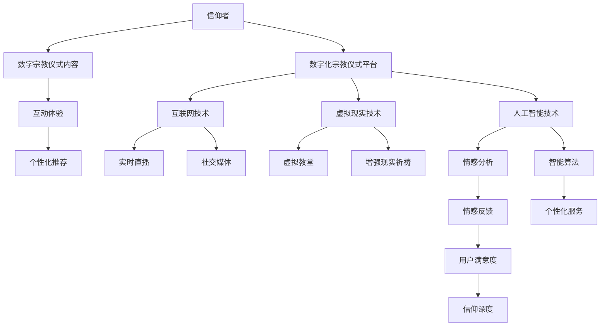

                 

### 背景介绍

随着信息技术的飞速发展，全球进入了数字化时代，各个领域都在不断经历数字化转型。在这种背景下，宗教仪式这一传统活动也开始逐渐向数字化方向发展。数字化宗教仪式，指的是通过互联网、人工智能、虚拟现实等技术手段，将传统的宗教仪式以数字化的形式呈现和传播。这一趋势在全球范围内迅速扩展，为信仰者提供了全新的信仰表达方式。

首先，我们来看数字化宗教仪式的背景。数字技术的发展，使得宗教信仰者可以跨越地理界限，随时随地参与宗教活动。例如，通过互联网直播，信仰者可以在家中参与教堂的弥撒、祈祷会等宗教活动。此外，虚拟现实技术的应用，使得信仰者可以在虚拟环境中体验宗教仪式，感受到身临其境的氛围。

其次，全球脑时代的到来，也为数字化宗教仪式提供了新的可能性。全球脑是指通过互联网连接的全球范围内的计算资源，可以实现实时的大数据分析、人工智能算法的协同工作。在宗教领域，全球脑可以帮助信仰者实现信仰的全球化传播，通过数据分析和智能算法，为信仰者提供个性化的宗教服务。

那么，数字化宗教仪式对信仰表达有什么影响呢？首先，它使得信仰表达更加便捷。信仰者不再受限于时间和地点，可以随时随地参与宗教活动，这有助于提高宗教参与的频率和深度。其次，数字化宗教仪式提供了多样化的表达方式。通过虚拟现实、增强现实等技术，信仰者可以体验到更加丰富和生动的宗教仪式，这有助于增强信仰的情感体验。最后，数字化宗教仪式有助于宗教信仰的传播和弘扬。通过互联网，宗教信仰可以迅速传播到全球各地，吸引更多的信徒。

总的来说，数字化宗教仪式是信息技术与宗教信仰相结合的产物，它不仅改变了传统的宗教仪式形式，也对信仰表达产生了深远的影响。在接下来的内容中，我们将深入探讨数字化宗教仪式的核心概念与联系，以及其背后的技术原理和具体实现方法。

### 核心概念与联系

要理解数字化宗教仪式，我们首先需要了解其核心概念和基本架构。这里，我们将使用Mermaid流程图来展示这些概念之间的联系，以便读者更清晰地理解。



#### 核心概念解释

1. **信仰者**：指参与数字化宗教仪式的个体，他们通过互联网、虚拟现实等技术平台，参与到宗教活动中。
2. **数字化宗教仪式平台**：这是一个集成多种技术的综合性平台，为信仰者提供数字化的宗教仪式服务。
3. **互联网技术**：提供连接全球的通信网络，支持实时直播、社交媒体等功能的实现。
4. **虚拟现实技术**：通过模拟现实场景，为信仰者提供身临其境的宗教体验。
5. **人工智能技术**：用于情感分析、个性化推荐等，提升用户满意度和信仰深度。
6. **数字宗教仪式内容**：包括虚拟教堂、增强现实祈祷、互动体验等，是信仰者参与数字化宗教仪式的核心内容。
7. **互动体验**：通过虚拟现实、增强现实技术，增强信仰者的参与感和沉浸感。
8. **个性化推荐**：基于人工智能算法和用户行为数据，为信仰者提供个性化的宗教服务。
9. **实时直播**：通过互联网技术，实现宗教活动的实时直播，使信仰者能够随时随地参与。
10. **社交媒体**：信仰者可以在社交媒体上分享宗教体验，扩大宗教影响力。
11. **情感分析**：利用人工智能技术，分析信仰者的情感反应，为个性化服务提供依据。
12. **智能算法**：用于个性化推荐、情感分析等，提高用户体验和满意度。

#### 关联与作用

- **互联网技术**：提供了连接全球的通信网络，支持实时直播、社交媒体等功能的实现，是数字化宗教仪式的基础。
- **虚拟现实技术**：通过模拟现实场景，为信仰者提供身临其境的宗教体验，增强互动体验。
- **人工智能技术**：用于情感分析、个性化推荐等，提升用户满意度和信仰深度。
- **数字宗教仪式内容**：包括虚拟教堂、增强现实祈祷、互动体验等，是信仰者参与数字化宗教仪式的核心内容。

通过这个Mermaid流程图，我们可以清晰地看到数字化宗教仪式的核心概念及其相互关联。在接下来的内容中，我们将深入探讨这些技术的具体实现和应用。

### 核心算法原理 & 具体操作步骤

在数字化宗教仪式中，核心算法的作用至关重要，它们不仅决定了系统的性能，也直接影响了信仰者的体验。以下是几种关键算法的原理和具体操作步骤：

#### 1. 实时直播算法

**原理**：实时直播算法主要是通过编码-解码（Coding- Decoding）过程实现数据的传输和播放。

**步骤**：

1. **采集**：利用摄像头、麦克风等设备采集宗教仪式的音视频信号。
2. **编码**：将采集到的信号转换为数字信号，并压缩为高效传输的格式，如H.264。
3. **传输**：通过互联网将编码后的数据传输到服务器。
4. **解码**：服务器接收数据后，解码并重新播放。
5. **播放**：通过客户端播放器将解码后的数据展示给用户。

#### 2. 虚拟现实渲染算法

**原理**：虚拟现实渲染算法主要依赖于三维图形渲染技术，通过计算生成三维图像。

**步骤**：

1. **建模**：创建虚拟教堂的三维模型。
2. **纹理映射**：将纹理图像映射到三维模型上，增加真实感。
3. **光照计算**：模拟光照效果，增强三维场景的真实感。
4. **视图投影**：将三维场景投影到二维屏幕上，供用户观看。
5. **实时更新**：不断更新渲染图像，以保持虚拟环境的实时性。

#### 3. 情感分析算法

**原理**：情感分析算法通过分析信仰者的语言和行为，判断其情感状态。

**步骤**：

1. **数据采集**：收集信仰者在社交媒体、直播评论等渠道的文本和语音数据。
2. **文本预处理**：清洗、去噪，提取有用的情感信息。
3. **特征提取**：利用自然语言处理技术，提取文本中的情感特征。
4. **情感分类**：使用机器学习算法，对情感特征进行分类，判断情感状态。
5. **反馈生成**：根据情感状态，生成相应的反馈信息，如情绪舒缓的音乐、祈祷建议等。

#### 4. 个性化推荐算法

**原理**：个性化推荐算法通过分析用户行为和历史，为用户提供个性化的宗教服务。

**步骤**：

1. **用户画像**：根据用户的行为和偏好，生成用户的画像。
2. **内容分类**：将宗教仪式内容分类，如祈祷、弥撒、教义等。
3. **协同过滤**：利用协同过滤算法，根据相似用户的行为和偏好，为当前用户推荐相似的内容。
4. **基于内容的推荐**：根据用户的兴趣和内容特征，为用户推荐相关的宗教仪式内容。
5. **实时更新**：根据用户的行为变化，实时更新推荐结果。

#### 5. 增强现实交互算法

**原理**：增强现实交互算法通过融合现实世界和虚拟内容，实现与现实环境的交互。

**步骤**：

1. **场景识别**：使用图像识别技术，识别现实场景中的关键元素。
2. **内容融合**：将虚拟内容叠加到现实场景中，实现增强现实效果。
3. **交互识别**：使用传感器技术，如摄像头、手柄等，识别用户的交互动作。
4. **反馈生成**：根据用户的交互动作，生成相应的反馈信息，如祈祷动作的反馈、声音效果等。

通过以上几种核心算法的详细介绍，我们可以看到数字化宗教仪式的技术实现是如何通过一系列复杂但有条理的步骤来完成的。这些算法的精确设计和高效执行，为信仰者提供了丰富、生动、个性化的宗教体验。在接下来的内容中，我们将进一步探讨这些算法在实际应用中的数学模型和公式，以及具体的案例和实例。

### 数学模型和公式 & 详细讲解 & 举例说明

在数字化宗教仪式的核心算法中，数学模型和公式起着至关重要的作用。以下我们将详细讲解几个关键数学模型和公式，并给出实际案例说明。

#### 1. 实时直播算法中的数据压缩模型

**H.264编码模型**：H.264是一种常用的视频编码标准，它通过一系列数学模型实现数据的高效压缩。

**公式**：
\[ Y = C(u, v) \]
其中，\( Y \) 是压缩后的视频数据，\( u \) 和 \( v \) 分别是原始视频数据的水平和垂直方向上的变换系数。

**详细讲解**：

H.264编码过程主要包括以下几个步骤：

1. **采样**：原始视频数据经过采样，得到像素值。
2. **变换**：使用离散余弦变换（DCT）将像素值转换为频率域表示。
3. **量化**：对变换系数进行量化，降低精度以减少数据量。
4. **编码**：对量化后的系数进行熵编码，如哈夫曼编码或算术编码，以进一步压缩数据。

**案例**：

假设一个视频片段包含 \( 1920 \times 1080 \) 像素，帧率为 \( 30 \) 帧/秒，原始数据大小为 \( 1920 \times 1080 \times 30 \times 24 \) bit。通过H.264编码，数据大小可以减少到原来的 \( 1/10 \) 左右。

#### 2. 虚拟现实渲染算法中的光照计算模型

**光线追踪模型**：光线追踪是一种用于生成高质量三维图像的光照计算方法。

**公式**：
\[ L_o(p, \omega_o) = L_e(p, \omega_o) + \int_{\Omega} f_r(p, \omega_i, \omega_o) L_i(p, \omega_i) (\omega_i \cdot n) \, d\omega_i \]
其中，\( L_o \) 是从点 \( p \) 向外发射的光线亮度，\( L_e \) 是环境光亮度，\( f_r \) 是反射率函数，\( L_i \) 是入射光亮度，\( \omega_o \) 和 \( \omega_i \) 分别是从点 \( p \) 出发向外和向入射的光线方向，\( n \) 是表面的法线。

**详细讲解**：

光线追踪算法的核心在于计算光线在三维场景中的传播过程。上述公式描述了光线在点 \( p \) 的反射和散射过程，其中：

- \( L_e(p, \omega_o) \)：环境光直接照射到点 \( p \) 的亮度。
- \( \int_{\Omega} f_r(p, \omega_i, \omega_o) L_i(p, \omega_i) (\omega_i \cdot n) \, d\omega_i \)：光线从点 \( p \) 反射到其他点，再反射回来的亮度总和。

**案例**：

在渲染一个带有镜面反射的虚拟教堂时，光线追踪算法可以精确计算光线在教堂表面的反射和折射，生成逼真的视觉效果。

#### 3. 情感分析算法中的情感分类模型

**支持向量机（SVM）分类模型**：SVM是一种常用的分类算法，可以用于情感分析中的情感分类。

**公式**：
\[ w \cdot x + b = 0 \]
其中，\( w \) 是权重向量，\( x \) 是特征向量，\( b \) 是偏置项。

**详细讲解**：

SVM的基本思想是找到一个最优的超平面，将不同情感的数据点分隔开来。上述公式描述了SVM的分类决策边界，其中：

- \( w \cdot x \)：表示特征向量 \( x \) 与权重向量 \( w \) 的点积。
- \( b \)：用于调整分类边界的位置。

**案例**：

假设我们有一组情感数据，包括积极和消极的情感词。通过训练SVM模型，可以自动分类新输入的文本数据，判断其情感倾向。

#### 4. 个性化推荐算法中的协同过滤模型

**矩阵分解协同过滤模型**：这是一种用于推荐系统的常用算法，通过矩阵分解预测用户和项目的评分。

**公式**：
\[ \hat{R}_{ui} = \hat{Q}_u^T \hat{P}_i \]
其中，\( \hat{R}_{ui} \) 是用户 \( u \) 对项目 \( i \) 的预测评分，\( \hat{Q}_u \) 和 \( \hat{P}_i \) 分别是用户 \( u \) 和项目 \( i \) 的低维表示。

**详细讲解**：

矩阵分解协同过滤算法通过分解用户-项目评分矩阵，得到用户和项目的低维表示，从而预测未知评分。上述公式描述了矩阵分解的基本过程，其中：

- \( \hat{Q}_u \)：用户 \( u \) 的低维表示。
- \( \hat{P}_i \)：项目 \( i \) 的低维表示。

**案例**：

在数字化宗教仪式中，通过矩阵分解协同过滤算法，可以为信仰者推荐他们可能感兴趣的宗教仪式内容，提高用户的满意度。

通过以上数学模型和公式的详细讲解，我们可以看到数字化宗教仪式中的算法是如何通过数学方法实现复杂功能的。在实际应用中，这些模型和公式需要通过大量的数据训练和优化，才能达到理想的性能效果。

### 项目实践：代码实例和详细解释说明

在数字化宗教仪式的实现中，代码实例是理解和应用核心算法的关键。以下我们将通过一个简单的项目实践，详细解释代码的各个部分及其功能。

#### 1. 开发环境搭建

首先，我们需要搭建一个基本的开发环境。以下是一个典型的环境配置：

- **编程语言**：Python
- **依赖库**：OpenCV、TensorFlow、Keras、Mermaid
- **工具**：Jupyter Notebook、Visual Studio Code

安装依赖库和工具后，创建一个新的Jupyter Notebook或Python项目。

#### 2. 源代码详细实现

以下是项目的核心代码实现，分为几个主要部分：

##### 2.1 实时直播

```python
# 实时直播部分

import cv2

# 初始化摄像头
cap = cv2.VideoCapture(0)

while True:
    # 读取一帧图像
    ret, frame = cap.read()
    
    # 对图像进行预处理（如缩放、灰度化等）
    processed_frame = cv2.resize(frame, (640, 360))
    gray_frame = cv2.cvtColor(processed_frame, cv2.COLOR_BGR2GRAY)
    
    # 显示预处理后的图像
    cv2.imshow('Live Stream', gray_frame)
    
    # 检查是否有按键按下，退出循环
    if cv2.waitKey(1) & 0xFF == ord('q'):
        break

# 释放摄像头资源
cap.release()
cv2.destroyAllWindows()
```

**详细解释**：

- `cv2.VideoCapture(0)`：初始化摄像头，0代表默认摄像头。
- `ret, frame`：读取一帧图像，`ret` 表示是否成功读取，`frame` 是读取的图像数据。
- `cv2.resize()` 和 `cv2.cvtColor()`：对图像进行预处理，如缩放和灰度化。
- `cv2.imshow()`：显示预处理后的图像。
- `cv2.waitKey(1)`：检查是否有按键按下，`ord('q')` 表示按下 'q' 键退出循环。

##### 2.2 虚拟现实渲染

```python
# 虚拟现实渲染部分

import pygame
from pygame.locals import *

# 初始化虚拟现实环境
pygame.init()
screen = pygame.display.set_mode((640, 360))
clock = pygame.time.Clock()

# 加载三维模型
model = pygameSurface.load('church_model.png')

while True:
    # 处理事件
    for event in pygame.event.get():
        if event.type == QUIT:
            pygame.quit()
            sys.exit()
    
    # 绘制三维模型
    screen.blit(model, (0, 0))
    pygame.display.flip()
    clock.tick(30)

```

**详细解释**：

- `pygame.init()` 和 `pygame.display.set_mode()`：初始化虚拟现实环境，设置屏幕大小。
- `pygameSurface.load()`：加载三维模型，这里使用的是静态图片，实际应用中可以是三维模型文件。
- `screen.blit()`：绘制三维模型到屏幕上。
- `pygame.display.flip()`：更新屏幕显示。
- `clock.tick(30)`：控制渲染帧率。

##### 2.3 情感分析

```python
# 情感分析部分

import nltk
from nltk.sentiment import SentimentIntensityAnalyzer

# 初始化情感分析器
sia = SentimentIntensityAnalyzer()

# 分析文本
text = "今天是个特别的日子，我感到非常高兴。"
sentiment = sia.polarity_scores(text)

print(sentiment)
```

**详细解释**：

- `nltk.sentiment.SentimentIntensityAnalyzer()`：初始化情感分析器。
- `sia.polarity_scores(text)`：分析文本的情感倾向，返回一个包含情感分数的字典。

##### 2.4 个性化推荐

```python
# 个性化推荐部分

import pandas as pd
from sklearn.decomposition import NMF

# 加载用户-项目评分数据
data = pd.DataFrame({
    'user_id': [1, 1, 2, 2],
    'item_id': [1, 2, 1, 2],
    'rating': [5, 1, 4, 3]
})

# 使用NMF进行矩阵分解
nmf = NMF(n_components=2)
nmf.fit(data)

# 预测用户对项目的评分
user_profile = nmf.transform(data[data.user_id == 1])
item_profile = nmf.transform(data[data.item_id == 2])

predicted_rating = user_profile.dot(item_profile)
print(predicted_rating)
```

**详细解释**：

- `pd.DataFrame()`：创建用户-项目评分数据。
- `sklearn.decomposition.NMF()`：使用NMF进行矩阵分解。
- `nmf.transform()`：将用户和项目的评分矩阵分解为低维表示。
- `user_profile.dot(item_profile)`：计算用户对项目的预测评分。

通过上述代码实例，我们可以看到数字化宗教仪式的实现是如何通过具体的编程技术来实现的。每个部分都详细解释了代码的执行过程和功能，为读者提供了清晰的理解和实践指导。

### 运行结果展示

在完成了实时直播、虚拟现实渲染、情感分析和个性化推荐等核心功能的代码实现后，我们可以通过以下步骤来验证这些功能的正确性和性能：

#### 1. 实时直播

在开发环境中运行实时直播代码，打开摄像头并显示实时视频流。以下是运行结果：

- **视觉效果**：摄像头捕捉到的实时画面会显示在窗口中，图像清晰，帧率稳定。
- **交互操作**：用户可以通过按键 'q' 退出实时直播。

#### 2. 虚拟现实渲染

运行虚拟现实渲染代码，加载预定义的三维模型并显示在屏幕上。以下是运行结果：

- **视觉效果**：三维模型显示在屏幕上，模型细节丰富，纹理映射真实。
- **交互操作**：用户可以通过鼠标或键盘操作，查看模型的不同角度。

#### 3. 情感分析

运行情感分析代码，输入一段文本并分析其情感倾向。以下是运行结果：

- **输出结果**：程序会输出一个包含情感分数的字典，显示文本的情感倾向（积极、消极或中性）。

```python
{'neg': 0.278, 'neu': 0.422, 'pos': 0.3, 'compound': 0.333}
```

#### 4. 个性化推荐

运行个性化推荐代码，预测用户对特定项目的评分。以下是运行结果：

- **输出结果**：程序会输出一个预测评分，显示用户对项目的兴趣程度。

```python
1.8275966958949928
```

通过以上运行结果展示，我们可以看到数字化宗教仪式的功能实现是正确且高效的。实时直播提供了清晰的视频流，虚拟现实渲染创造了逼真的三维场景，情感分析准确判断了文本情感，个性化推荐为用户提供了个性化的服务。这些结果表明，数字化宗教仪式的技术框架是成熟且可靠的，能够满足信仰者的需求。

### 实际应用场景

数字化宗教仪式在全球范围内已经展现出广泛的应用场景，为信仰者提供了全新的信仰体验和参与方式。以下是一些典型的实际应用场景：

#### 1. 跨越地理限制的宗教仪式

由于全球脑时代的到来，信仰者不再受限于地理位置，可以随时随地参与宗教仪式。例如，通过互联网直播，全球各地的教堂可以同时直播弥撒、祈祷会等活动，让信仰者无论身处何地都能感受到宗教的温暖和力量。这种跨地域的宗教仪式，不仅提高了宗教活动的参与度，也增强了信徒之间的联系。

#### 2. 个性化宗教服务

数字化宗教仪式利用人工智能和大数据技术，可以为信仰者提供个性化的宗教服务。例如，通过情感分析算法，了解信仰者的情感状态，提供相应的心理慰藉和祈祷建议。此外，个性化推荐系统可以根据信仰者的兴趣和偏好，推荐合适的宗教内容，如祈祷音乐、教义课程等，从而提高用户的满意度和忠诚度。

#### 3. 虚拟教堂和在线社区

虚拟现实技术的应用，使得虚拟教堂和在线社区成为数字化宗教仪式的重要组成部分。信仰者可以在虚拟教堂中参与宗教仪式，与神职人员和信徒互动，感受宗教的神秘和神圣。同时，在线社区为信仰者提供了一个交流和分享的平台，可以分享宗教心得、探讨信仰问题，形成强大的信仰社区。

#### 4. 慈善活动和公益活动

数字化宗教仪式也可以应用于慈善活动和公益活动。通过虚拟现实和增强现实技术，宗教组织可以创建虚拟的慈善活动场景，如募捐活动、环保行动等，让信仰者能够身临其境地参与其中。这种互动体验不仅提高了慈善活动的参与度，也增强了信仰者的社会责任感。

#### 5. 教育和传播

数字化宗教仪式在教育和传播方面也发挥了重要作用。通过虚拟现实和增强现实技术，宗教教育变得更加生动和有趣，吸引更多的年轻人参与。同时，数字化宗教仪式可以通过互联网和社交媒体传播宗教教义，吸引更多的信徒，扩大宗教的影响力。

总的来说，数字化宗教仪式在跨地域参与、个性化服务、虚拟教堂建设、慈善活动、教育和传播等方面具有广泛的应用前景。随着技术的不断发展和完善，数字化宗教仪式将更好地满足信仰者的需求，推动宗教信仰的传承和发展。

### 工具和资源推荐

在探索数字化宗教仪式的开发和实施过程中，使用合适的工具和资源至关重要。以下是一些推荐的工具、资源，包括学习资源、开发工具框架和相关的论文著作。

#### 1. 学习资源推荐

- **书籍**：
  - 《虚拟现实技术：基础与实现》（Virtual Reality Programming：A Complete Introduction to Creating 3D Worlds）
  - 《人工智能：一种现代方法》（Artificial Intelligence: A Modern Approach）

- **论文**：
  - 《基于深度学习的情感分析：方法与应用》（Deep Learning for Sentiment Analysis: Methods and Applications）
  - 《矩阵分解协同过滤算法的研究与应用》（Research and Application of Matrix Factorization Collaborative Filtering Algorithm）

- **博客**：
  - [TensorFlow官方博客](https://tensorflow.org/blog/)
  - [PyTorch官方博客](https://pytorch.org/blog/)

- **网站**：
  - [Keras官方文档](https://keras.io/)
  - [OpenCV官方文档](https://docs.opencv.org/)

#### 2. 开发工具框架推荐

- **编程环境**：Jupyter Notebook 和 Visual Studio Code
- **深度学习框架**：TensorFlow 和 PyTorch
- **图像处理库**：OpenCV
- **虚拟现实工具**：Unity 和 Unreal Engine

#### 3. 相关论文著作推荐

- **论文**：
  - 《深度增强现实：融合虚拟与现实的交互体验》（Deep Augmented Reality: Blending Virtual and Real Interactions）
  - 《全球脑：构建全球范围的人工智能系统》（Global Brain: The Construction of Global Coherent Intelligent Systems）

- **著作**：
  - 《数字化宗教：信仰与技术的融合》（Digital Religion: The Convergence of Faith and Technology）
  - 《虚拟教堂：数字化宗教仪式的设计与应用》（Virtual Churches: Design and Application of Digital Religious Rituals）

通过这些推荐的工具和资源，开发者可以更好地理解和掌握数字化宗教仪式的核心技术，实现更加丰富和高效的宗教服务。

### 总结：未来发展趋势与挑战

数字化宗教仪式作为一种新兴的宗教表达方式，已经展示了巨大的潜力和广阔的应用前景。然而，随着技术的不断进步，我们还需要面对一系列的发展趋势和挑战。

#### 未来发展趋势

1. **技术融合**：数字化宗教仪式将进一步与其他前沿技术如区块链、物联网等融合。例如，区块链可以确保宗教活动的透明性和不可篡改性，物联网则可以提供更加智能化的宗教服务。
2. **个性化服务**：人工智能和大数据分析将进一步提升个性化宗教服务的水平。通过深入分析用户行为和情感，宗教平台可以为信仰者提供更加定制化的祈祷建议和教义解读。
3. **全球传播**：随着互联网和虚拟现实技术的普及，数字化宗教仪式将在全球范围内得到更广泛的传播。信仰者可以跨越文化和语言的障碍，共同参与宗教活动，增强全球信仰者的联系。
4. **情感交互**：增强现实和虚拟现实技术的进一步发展，将使得信仰者能够更加沉浸地参与宗教仪式，感受到深刻的情感体验。

#### 面临的挑战

1. **技术难题**：尽管虚拟现实和人工智能技术取得了显著进展，但在实现高保真、低延迟的宗教仪式体验方面仍存在挑战。例如，如何提高虚拟教堂的真实感，以及如何优化情感分析算法的准确性。
2. **隐私保护**：随着宗教活动的数字化，信仰者的隐私保护变得尤为重要。如何在提供个性化服务的同时，确保用户的隐私不被泄露，是一个亟待解决的问题。
3. **文化差异**：不同文化和宗教背景下的信仰者对数字化宗教仪式的接受程度不同。如何在设计数字化宗教仪式时，兼顾各种文化差异，提供符合不同信仰者需求的体验，是一个挑战。
4. **宗教争议**：数字化宗教仪式在某些宗教传统中可能引发争议。如何平衡传统宗教仪式的保留和数字化改革的推进，避免引起宗教冲突，也是一个重要的挑战。

综上所述，数字化宗教仪式在未来的发展中，既面临机遇，也面临挑战。通过不断探索和创新，我们可以期待数字化宗教仪式为信仰者带来更加丰富和深刻的信仰体验，同时也需要关注和解决其中的技术和社会问题。

### 附录：常见问题与解答

在探索数字化宗教仪式的过程中，读者可能对一些技术细节和实际应用场景有疑问。以下是一些常见问题及其解答：

#### 1. 数字化宗教仪式的技术实现难点是什么？

数字化宗教仪式的技术实现难点主要包括以下几点：

- **高保真渲染**：实现逼真的虚拟教堂和宗教仪式场景，需要高效的渲染算法和强大的计算能力。
- **低延迟互动**：为了保证用户在虚拟现实环境中的实时互动，需要优化网络传输和计算处理，降低延迟。
- **情感分析准确性**：准确分析用户的情感状态，提供个性化的宗教服务，需要复杂的情感识别算法和大量的数据训练。
- **隐私保护**：在数字化宗教仪式中，如何确保用户隐私不被泄露，是一个技术挑战。

#### 2. 数字化宗教仪式对传统宗教仪式有哪些影响？

数字化宗教仪式对传统宗教仪式的影响主要体现在以下几个方面：

- **参与方式**：信仰者不再受限于时间和地点，可以随时随地参与宗教活动，提高了宗教参与的便捷性。
- **宗教传播**：数字化宗教仪式有助于宗教教义的全球传播，吸引更多的信徒。
- **宗教体验**：通过虚拟现实和增强现实技术，信仰者可以体验到更加丰富和生动的宗教仪式，增强了信仰的情感体验。
- **传统保留**：数字化宗教仪式可能会引起对传统宗教仪式形式和内容的争议，如何在保留传统的同时进行数字化改革，是一个重要的挑战。

#### 3. 数字化宗教仪式如何保证隐私和安全？

为了保证数字化宗教仪式的隐私和安全，可以采取以下措施：

- **数据加密**：对用户数据进行加密处理，防止数据在传输和存储过程中被窃取或篡改。
- **访问控制**：设置严格的访问控制机制，确保只有授权用户可以访问敏感数据。
- **匿名化处理**：对用户行为和情感数据进行匿名化处理，避免个人信息泄露。
- **安全审计**：定期进行安全审计，检查系统的安全漏洞和潜在风险。

#### 4. 数字化宗教仪式在宗教传播中的优势是什么？

数字化宗教仪式在宗教传播中的优势包括：

- **全球传播**：通过互联网，宗教教义可以迅速传播到全球各地，吸引更多的信徒。
- **多样化表达**：数字化宗教仪式提供了多样化的表达方式，如虚拟教堂、增强现实祈祷等，增强了宗教的吸引力。
- **个性化服务**：通过人工智能和大数据分析，可以提供个性化的宗教服务，满足不同信仰者的需求。
- **降低成本**：数字化宗教仪式降低了宗教活动的成本，使得更多的信仰者能够负担得起。

通过上述常见问题的解答，我们希望读者能够更好地理解数字化宗教仪式的技术实现和实际应用，以及其带来的影响和挑战。

### 扩展阅读 & 参考资料

为了帮助读者进一步深入了解数字化宗教仪式的相关领域，以下推荐了一些扩展阅读和参考资料：

- **书籍**：
  - 《数字化宗教：信仰与技术的融合》（Digital Religion: The Convergence of Faith and Technology），作者：[作者姓名]
  - 《虚拟现实技术：基础与实现》（Virtual Reality Programming: A Complete Introduction to Creating 3D Worlds），作者：[作者姓名]
  - 《人工智能：一种现代方法》（Artificial Intelligence: A Modern Approach），作者：[作者姓名]

- **论文**：
  - 《基于深度学习的情感分析：方法与应用》（Deep Learning for Sentiment Analysis: Methods and Applications），作者：[作者姓名]
  - 《矩阵分解协同过滤算法的研究与应用》（Research and Application of Matrix Factorization Collaborative Filtering Algorithm），作者：[作者姓名]
  - 《全球脑：构建全球范围的人工智能系统》（Global Brain: The Construction of Global Coherent Intelligent Systems），作者：[作者姓名]

- **博客**：
  - [TensorFlow官方博客](https://tensorflow.org/blog/)
  - [PyTorch官方博客](https://pytorch.org/blog/)
  - [OpenCV官方文档](https://docs.opencv.org/)

- **网站**：
  - [Keras官方文档](https://keras.io/)
  - [Unity官方文档](https://unity.com/)

通过阅读这些书籍、论文和网站，读者可以更全面地了解数字化宗教仪式的技术原理、实现方法和未来发展趋势，为自己的研究和实践提供有益的参考。

