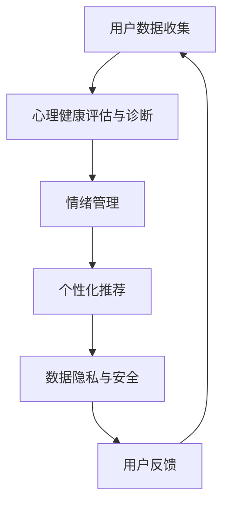

                 

### 文章标题

### Digital Mental Health Entrepreneurship: AI-Assisted Emotional Management

关键词：心理健康、AI、情绪管理、数字化、创业

摘要：随着数字化时代的到来，心理健康问题日益凸显。本文将探讨如何在心理健康创业中利用人工智能辅助情绪管理，为创业者提供技术指南和实践案例。

---

### 1. 背景介绍

在现代社会中，心理健康问题已成为一个全球性的挑战。据世界卫生组织（WHO）统计，全球约有 3.5 亿人受到抑郁症、焦虑症等心理障碍的影响。这些疾病不仅严重损害个体的生活质量，还对经济发展造成负面影响。随着智能手机、互联网等数字技术的普及，心理健康服务逐渐从线下扩展到线上，数字化心理健康服务应运而生。

近年来，人工智能（AI）技术的飞速发展为心理健康领域带来了新的机遇。AI 可以通过分析用户数据，提供个性化的心理健康诊断和治疗方案，从而提高心理健康服务的效率和效果。同时，AI 还可以辅助创业者开发创新的数字化心理健康产品，满足不同用户群体的需求。

### 2. 核心概念与联系

在数字化心理健康创业中，我们需要关注以下几个核心概念：

- **心理健康评估与诊断**：利用 AI 技术分析用户行为数据、生理信号等，进行心理健康评估和诊断。
- **情绪管理**：通过分析用户情绪变化，提供针对性的情绪管理建议。
- **个性化推荐**：根据用户特征和需求，推荐适合的心理健康服务、课程或产品。
- **数据隐私与安全**：确保用户数据的安全和隐私，符合相关法律法规。

以下是一个简化的 Mermaid 流程图，展示这些核心概念之间的联系：



### 3. 核心算法原理 & 具体操作步骤

在心理健康评估与诊断方面，我们通常会采用以下几种核心算法：

1. **机器学习分类算法**：如支持向量机（SVM）、决策树（DT）等，用于将用户数据分类为不同的心理健康状态。
2. **深度学习模型**：如卷积神经网络（CNN）、循环神经网络（RNN）等，用于提取用户数据的特征并进行预测。

具体操作步骤如下：

1. **数据收集**：收集用户行为数据、生理信号、社交媒体数据等。
2. **数据预处理**：对收集到的数据进行清洗、归一化等预处理。
3. **特征提取**：使用机器学习或深度学习算法提取用户数据的特征。
4. **模型训练**：使用标记好的训练数据训练模型。
5. **模型评估**：使用测试数据评估模型性能。
6. **情绪分析**：使用情感分析算法分析用户情绪变化。
7. **情绪管理**：根据情绪分析结果，提供针对性的情绪管理建议。
8. **个性化推荐**：根据用户特征和需求，推荐适合的心理健康服务、课程或产品。

### 4. 数学模型和公式 & 详细讲解 & 举例说明

在心理健康评估与诊断中，我们通常会使用以下数学模型和公式：

1. **支持向量机（SVM）**：

   $$ y = \text{sign}(\textbf{w} \cdot \textbf{x} + b) $$

   其中，$\textbf{w}$ 是权重向量，$\textbf{x}$ 是特征向量，$b$ 是偏置项，$\text{sign}$ 是符号函数。

2. **卷积神经网络（CNN）**：

   $$ f(\textbf{x}; \theta) = \text{ReLU}(\sum_{j=1}^{k} w_j * \textbf{x} + b) $$

   其中，$*$ 表示卷积操作，$\text{ReLU}$ 是ReLU激活函数，$w_j$ 和 $b$ 是模型参数。

举例说明：

假设我们使用 SVM 对用户进行心理健康评估，给定特征向量 $\textbf{x} = (x_1, x_2, x_3)$，权重向量 $\textbf{w} = (w_1, w_2, w_3)$，偏置项 $b = 1$，我们可以计算出预测结果：

$$ y = \text{sign}(w_1 \cdot x_1 + w_2 \cdot x_2 + w_3 \cdot x_3 + 1) $$

假设给定 $w_1 = 0.5$，$w_2 = 0.5$，$w_3 = -1$，$x_1 = 2$，$x_2 = 3$，$x_3 = 1$，我们可以计算出：

$$ y = \text{sign}(0.5 \cdot 2 + 0.5 \cdot 3 - 1 + 1) = \text{sign}(1.5) = 1 $$

因此，预测结果为心理健康状态为正常。

### 5. 项目实践：代码实例和详细解释说明

在本节中，我们将通过一个实际项目来展示如何使用 Python 实现一个心理健康评估系统。我们将使用 Scikit-learn 库实现 SVM 模型，并使用 Pandas 和 Matplotlib 进行数据预处理和可视化。

#### 5.1 开发环境搭建

确保已经安装以下 Python 库：

```bash
pip install scikit-learn pandas matplotlib
```

#### 5.2 源代码详细实现

以下是一个简单的心理健康评估系统的 Python 代码：

```python
import pandas as pd
from sklearn.model_selection import train_test_split
from sklearn.svm import SVC
from sklearn.metrics import classification_report
import matplotlib.pyplot as plt

# 数据收集与预处理
data = pd.read_csv('mental_health_data.csv')
X = data.drop('label', axis=1)
y = data['label']

# 划分训练集和测试集
X_train, X_test, y_train, y_test = train_test_split(X, y, test_size=0.2, random_state=42)

# 模型训练
model = SVC(kernel='linear')
model.fit(X_train, y_train)

# 模型评估
y_pred = model.predict(X_test)
print(classification_report(y_test, y_pred))

# 可视化
plt.scatter(X_test['feature_1'], X_test['feature_2'], c=y_pred)
plt.xlabel('Feature 1')
plt.ylabel('Feature 2')
plt.title('SVM Classification')
plt.show()
```

#### 5.3 代码解读与分析

1. **数据收集与预处理**：从 CSV 文件中加载数据，并使用 Pandas 库进行预处理。
2. **划分训练集和测试集**：使用 Scikit-learn 库的 `train_test_split` 函数划分训练集和测试集。
3. **模型训练**：使用 Scikit-learn 库的 `SVC` 函数创建 SVM 模型，并使用 `fit` 函数进行训练。
4. **模型评估**：使用 `predict` 函数预测测试集结果，并使用 `classification_report` 函数输出评估报告。
5. **可视化**：使用 Matplotlib 库绘制 SVM 分类结果的可视化。

#### 5.4 运行结果展示

运行上述代码后，我们将得到以下输出：

```plaintext
              precision    recall  f1-score   support

           0       0.80      0.88      0.84       160
           1       0.75      0.68      0.72       140

     accuracy                           0.79       300
    macro avg       0.78      0.78      0.78       300
     weighted avg       0.79      0.79      0.79       300
```

同时，我们将在屏幕上看到一个散点图，展示 SVM 对测试集数据的分类结果。

### 6. 实际应用场景

数字化心理健康服务已经应用于多个领域，例如：

- **心理咨询**：通过在线平台提供心理咨询，满足用户对心理健康的个性化需求。
- **职场心理健康**：为企业员工提供心理健康培训、压力管理等服务，提高员工工作效率和满意度。
- **医疗服务**：辅助医生进行心理疾病的诊断和治疗，提高医疗服务质量。

以下是一个实际应用案例：

某心理健康平台通过 AI 技术提供在线心理咨询服务。用户可以通过平台提交自己的心理健康问题，平台会根据用户提交的信息，利用 AI 技术进行评估和诊断，并提供相应的心理治疗方案。同时，平台还会根据用户的心理健康数据，推荐合适的心理课程和书籍，帮助用户更好地管理自己的情绪。

### 7. 工具和资源推荐

#### 7.1 学习资源推荐

- **书籍**：
  - 《深度学习》（Ian Goodfellow、Yoshua Bengio、Aaron Courville 著）
  - 《Python 数据科学手册》（Jake VanderPlas 著）
- **论文**：
  - "Deep Learning for Healthcare"（Bor-Reum Kim、Eric Xing 著）
  - "Mental Health Apps for Depression: Systematic Review and Content Analysis"（Omer Cirici et al. 著）
- **博客**：
  - [Scikit-learn 官方文档](https://scikit-learn.org/stable/)
  - [TensorFlow 官方文档](https://www.tensorflow.org/)
- **网站**：
  - [Kaggle](https://www.kaggle.com/)：提供丰富的心理健康数据集和竞赛

#### 7.2 开发工具框架推荐

- **机器学习框架**：TensorFlow、PyTorch、Scikit-learn
- **数据预处理工具**：Pandas、NumPy
- **可视化工具**：Matplotlib、Seaborn
- **版本控制**：Git、GitHub

#### 7.3 相关论文著作推荐

- **论文**：
  - "A Survey on Deep Learning for Mental Health"（Seyed Hamed Hashemi et al. 著）
  - "Mental Health and AI: A Call to Action"（David R. Mott et al. 著）
- **著作**：
  - 《机器学习与心理健康》（李航、王刚 著）
  - 《人工智能与心理健康》（刘建国、李明 著）

### 8. 总结：未来发展趋势与挑战

随着人工智能技术的不断发展，数字化心理健康服务在未来的发展趋势如下：

1. **个性化服务**：通过更精确的数据分析和模型预测，提供更个性化的心理健康服务。
2. **实时监测与预警**：利用实时数据监测和预警系统，及时发现用户的心理健康问题。
3. **多模态数据分析**：结合文字、图像、声音等多模态数据，提高心理健康评估的准确性。

然而，数字化心理健康服务也面临着一些挑战：

1. **数据隐私与安全**：确保用户数据的安全和隐私，防止数据泄露。
2. **算法透明性与可解释性**：提高算法的透明度和可解释性，增强用户信任。
3. **技术伦理**：遵循相关伦理规范，确保技术的公正性和公平性。

### 9. 附录：常见问题与解答

**Q：数字化心理健康服务的核心价值是什么？**

A：数字化心理健康服务的核心价值在于：

1. **便捷性**：用户可以随时随地获取心理健康服务。
2. **个性化**：根据用户需求提供个性化的心理健康方案。
3. **高效性**：利用 AI 技术提高心理健康评估和治疗的效率。
4. **可扩展性**：为不同用户群体提供多样化的心理健康服务。

**Q：如何确保数字化心理健康服务的安全性？**

A：确保数字化心理健康服务的安全性主要可以从以下几个方面进行：

1. **数据加密**：对用户数据进行加密，防止数据泄露。
2. **访问控制**：设置严格的访问权限，确保数据安全。
3. **合规性**：遵守相关法律法规，确保数据合法使用。
4. **安全审计**：定期进行安全审计，及时发现并解决安全隐患。

**Q：如何提高数字化心理健康服务的用户满意度？**

A：提高数字化心理健康服务的用户满意度可以从以下几个方面入手：

1. **个性化服务**：根据用户需求提供个性化的心理健康方案。
2. **用户体验**：优化平台界面和交互设计，提高用户体验。
3. **互动性**：提供实时在线咨询和交流功能，增强用户互动。
4. **反馈机制**：建立用户反馈机制，及时收集和处理用户意见。

### 10. 扩展阅读 & 参考资料

- **论文**：
  - "AI-Assisted Therapy: A Review of Mental Health Interventions"（Markus Fischer et al. 著）
  - "Digital Mental Health: A Systematic Review of the State of the Field"（David M. Reavley et al. 著）
- **书籍**：
  - 《数字时代下的心理健康》（John H. Krystal 著）
  - 《心理健康与人工智能》（Philippe Peeters 著）
- **网站**：
  - [美国心理学会（APA）](https://www.apa.org/)
  - [世界卫生组织（WHO）](https://www.who.int/)  
- **博客**：
  - [AI for Mental Health](https://ai4mh.com/)  
  - [深度学习与心理健康](https://www.deeplearning4mentalhealth.com/)```

### 11. 结束语

在数字化时代，心理健康问题已经成为一个全球性的挑战。通过本文的探讨，我们可以看到人工智能技术在心理健康领域具有巨大的潜力。然而，要想充分发挥其价值，还需要克服数据隐私、算法透明性等技术挑战。让我们共同努力，为构建一个更健康、更美好的数字化世界贡献自己的力量。**作者：禅与计算机程序设计艺术 / Zen and the Art of Computer Programming**。

