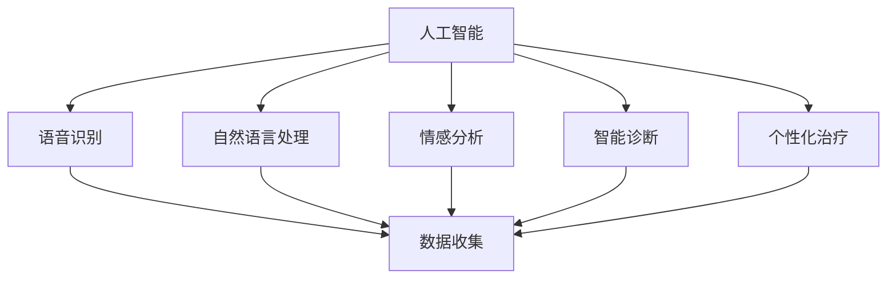
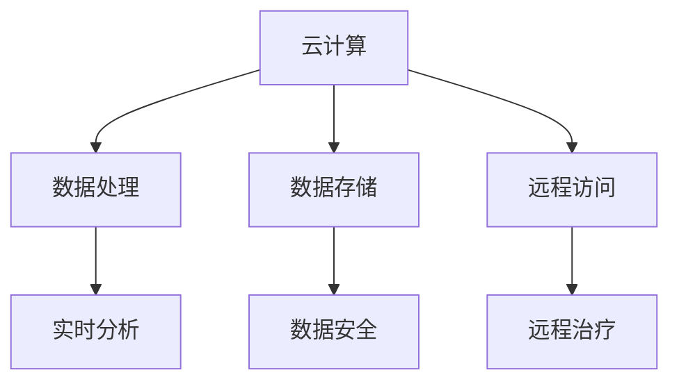
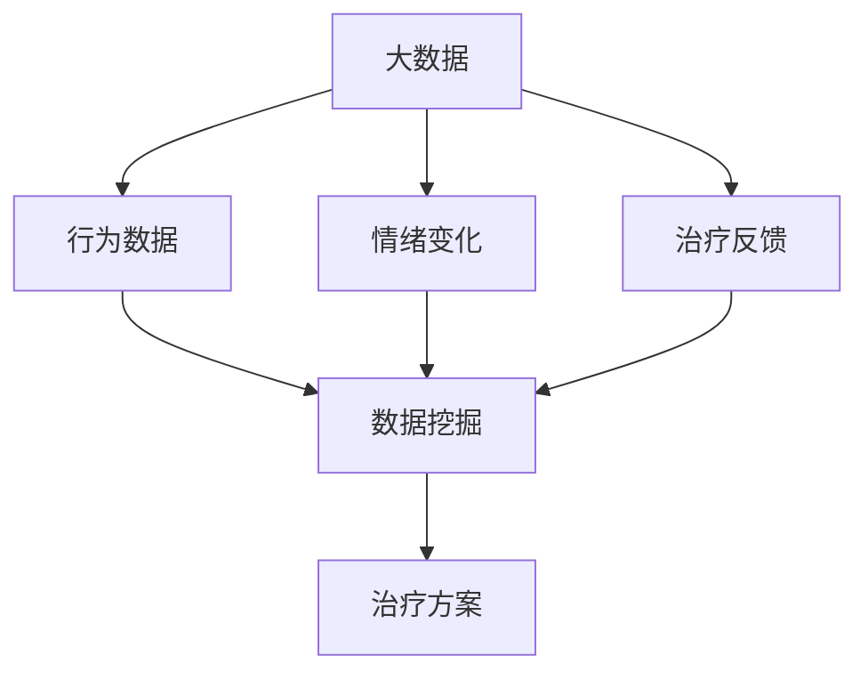
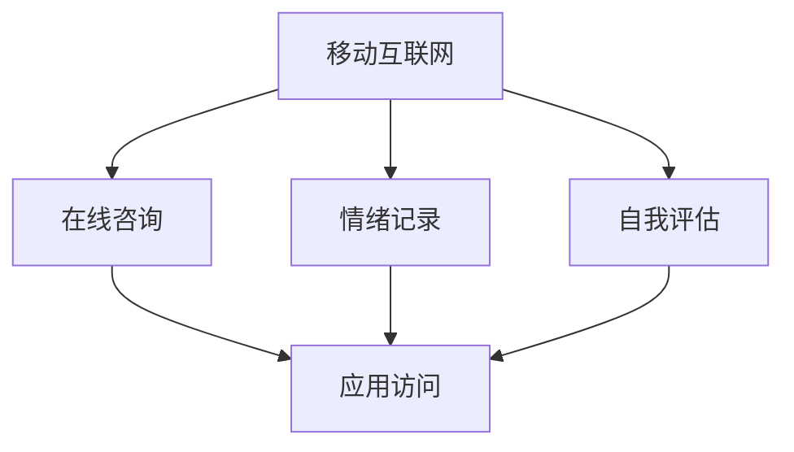
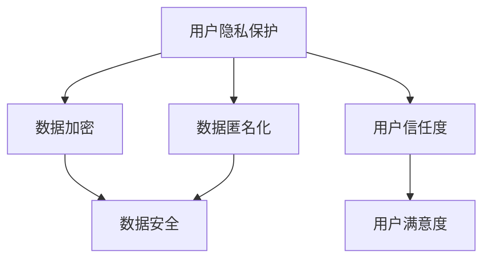
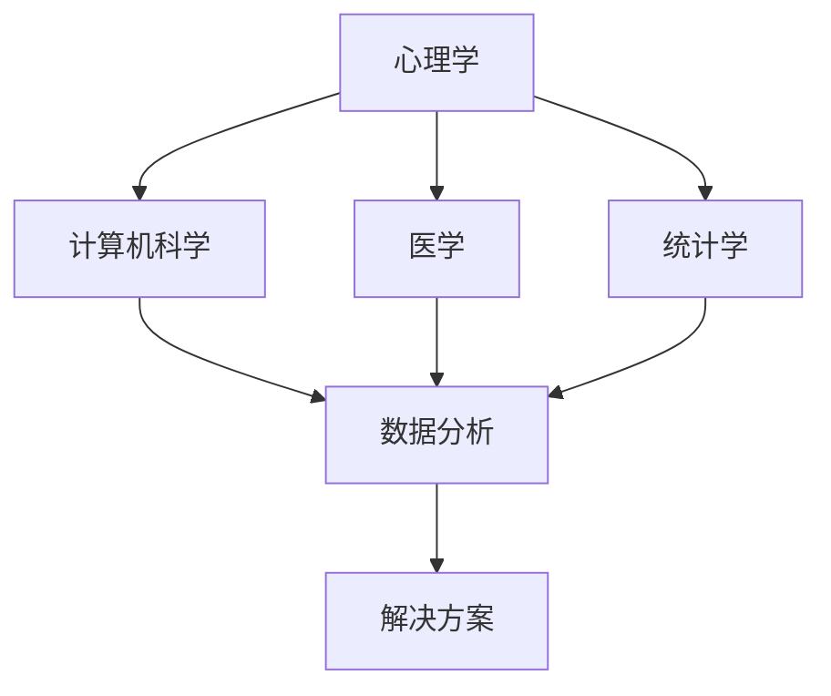

                 

### 文章标题

《数字化心理咨询创业：在线治疗的新模式》

> **关键词**：数字化心理咨询、在线治疗、模式创新、人工智能、用户体验、商业模式

> **摘要**：本文将深入探讨数字化心理咨询的兴起，以及在线治疗作为新模式对传统心理咨询的颠覆性影响。通过分析核心概念和原理，详细解释核心算法和操作步骤，并结合实际应用场景，我们旨在为创业者和技术人员提供一整套可行的解决方案，助力心理咨询行业的数字化转型。

### 1. 背景介绍

在过去几年中，数字化心理咨询正迅速崛起，成为心理健康服务领域的一股新兴力量。随着智能手机和互联网的普及，越来越多的人开始寻求在线心理治疗服务。根据市场调研公司Statista的数据，全球在线心理健康市场预计将在2027年达到近500亿美元。这种趋势的背后，既有技术进步的推动，也有用户对隐私和便捷性的需求增加。

传统的心理咨询通常依赖于面对面交流，这种方式虽然有效，但存在一些局限性，比如地理位置的限制、时间安排的不便，以及心理医生资源的不均衡。数字化心理咨询则通过互联网平台，打破了这些障碍，使得心理健康服务可以随时随地获取。此外，人工智能技术的引入，使得个性化治疗方案得以实现，进一步提升了咨询的准确性和效率。

本文将围绕以下几个方面展开讨论：首先，介绍数字化心理咨询和在线治疗的核心概念和原理；其次，阐述核心算法和操作步骤；然后，通过数学模型和公式详细解释相关机制；接着，提供项目实践中的代码实例和解读；之后，探讨数字化心理咨询在各类实际应用场景中的效果和挑战；最后，总结当前的发展趋势和面临的挑战，并提供相关工具和资源推荐。

通过对以上各个方面的深入分析，我们希望为那些有意投身数字化心理咨询领域的创业者和技术人员提供有价值的参考，助力他们在这片新兴蓝海中找到自己的位置。### 1.1 数字化心理咨询的定义和发展历程

数字化心理咨询，即利用数字技术和互联网平台提供心理健康服务，其本质是将传统心理咨询的模式转移到线上。这种模式的核心在于利用互联网的广泛覆盖和便捷性，使得心理健康服务能够触达更广泛的人群，特别是那些无法或不愿亲自前往诊所进行咨询的用户。

数字化心理咨询的发展历程可以追溯到20世纪末。最早的在线心理咨询形式主要是电子邮件咨询和在线聊天。这些形式虽然简单，但已经开始为那些身处偏远地区或因各种原因无法亲自前往咨询中心的人提供了一种新的选择。随着互联网技术的发展，特别是在移动设备和社交媒体的普及，在线心理咨询逐渐走向多元化。

进入21世纪，随着大数据、云计算和人工智能技术的不断发展，数字化心理咨询迎来了新的发展机遇。大数据分析可以帮助心理医生更好地了解患者的心理状态和行为模式，从而提供更为精准的治疗方案。云计算技术则确保了数据的存储和安全，为大规模的数据处理提供了强大的支持。人工智能技术的应用更是将个性化治疗推向了新的高度，通过自然语言处理和机器学习算法，可以自动分析患者的交流内容，提供实时的情感分析和建议。

在中国，数字化心理咨询同样呈现出快速发展的态势。根据《2021年中国心理健康行业发展报告》，2020年中国心理健康服务市场规模已经达到了200亿元人民币，其中在线心理咨询市场的增长率更是达到了50%以上。这一增长主要得益于以下几个因素：

1. **政策支持**：国家出台了一系列支持心理健康服务行业发展的政策，为数字化心理咨询的普及提供了政策保障。
2. **技术进步**：5G、物联网等新兴技术的应用，为在线心理咨询提供了更为稳定和高效的技术支持。
3. **用户需求**：随着生活节奏的加快和压力的增大，越来越多的人开始关注心理健康问题，对便捷、个性化的心理健康服务需求日益增长。
4. **商业模式创新**：通过整合线上线下资源，构建起从心理测评、咨询到康复的全流程服务模式，满足了不同层次用户的需求。

总体来看，数字化心理咨询作为一种新兴的服务模式，正逐渐改变着传统的心理咨询格局，不仅为心理疾病患者提供了更多的治疗选择，也为心理健康服务行业带来了新的发展机遇。### 1.2 在线治疗的定义和优势

在线治疗，即通过网络平台提供心理治疗服务，是一种现代化的治疗模式。与传统面对面治疗相比，在线治疗具有独特的优势，正在逐步改变心理健康服务的提供方式。

#### 1.2.1 定义

在线治疗通常包括以下几种形式：

1. **视频咨询**：患者通过视频会议软件与心理医生进行实时交流，这是目前最为常见的在线治疗形式。
2. **电子邮件咨询**：心理医生通过电子邮件回复患者的问题，适合那些需要文字表达的患者。
3. **在线聊天**：通过即时通讯工具进行的交流，提供快速的情感支持和问题解答。
4. **应用程序咨询**：使用专门的心理健康应用程序，患者可以通过这些应用程序进行自我评估、记录情绪和接受个性化建议。

#### 1.2.2 优势

**1. 跨越地理限制**

在线治疗的最大优势在于其可以跨越地理限制，无论患者身处何地，只要有网络连接，就可以获得专业的心理治疗。这种服务模式尤其适合那些居住在偏远地区、交通不便或无法外出的人。

**2. 时间灵活性**

在线治疗打破了传统心理咨询的时间限制，患者可以根据自己的日程安排选择咨询时间，避免了因时间冲突而无法进行咨询的问题。

**3. 隐私保护**

在线治疗提供了更为隐私的治疗环境，患者可以在自己熟悉和安全的环境中接受咨询，减少了在公共场合或他人注视下接受治疗的尴尬和不适。

**4. 成本效益**

在线治疗相较于传统心理咨询，通常费用更低，尤其是对于那些需要长期治疗的患者来说，可以显著降低治疗成本。

**5. 便捷性**

在线治疗无需患者亲自前往诊所，减少了外出交通和时间成本，尤其对于有行动不便的患者来说，这是一个极大的便利。

**6. 个性化服务**

通过大数据和人工智能技术，在线治疗可以根据患者的具体情况进行个性化评估和治疗方案推荐，提供更为精准的服务。

**7. 全天候服务**

一些在线平台提供24小时自助服务，患者可以在任何时间进行自我评估、获取信息和寻求帮助，提高了心理健康服务的可及性。

#### 1.2.3 挑战与解决方案

尽管在线治疗具有许多优势，但同时也面临一些挑战：

**1. 技术依赖**

在线治疗高度依赖互联网和通信技术，网络中断或技术故障可能导致治疗中断。

**解决方案**：采用备用通信方案（如电话咨询），确保技术故障时的服务连续性。

**2. 专业性认证**

在线治疗的质量取决于提供者的专业能力，但线上认证和监管相对困难。

**解决方案**：加强专业资格认证，建立严格的审查机制，确保在线治疗提供者的专业水平。

**3. 用户信任度**

线上咨询可能让一些患者感到缺乏面对面的交流和支持，影响治疗效果。

**解决方案**：提供实时视频咨询，增强患者的互动体验，同时通过数据隐私保护措施提升用户信任。

**4. 患者依赖**

长期依赖在线治疗可能降低患者的自我疗愈能力，影响其长远发展。

**解决方案**：结合线上线下治疗，提供综合性治疗方案，逐步培养患者的自我疗愈能力。

总之，在线治疗作为一种新兴的治疗模式，具有显著的灵活性和便捷性，正在成为心理健康服务领域的重要补充。通过不断优化技术和服务模式，在线治疗有望在未来发挥更大的作用。### 1.3 数字化心理咨询与在线治疗的关系

数字化心理咨询和在线治疗是现代心理健康服务领域中的两个重要概念，它们之间存在着紧密的联系和相互促进的关系。

#### 1.3.1 数字化心理咨询

数字化心理咨询是指利用数字技术（如互联网、移动设备、人工智能等）来提供心理服务的过程。它不仅包括传统的在线治疗形式，如视频咨询、电子邮件咨询和在线聊天，还涵盖了心理健康应用程序、大数据分析、情感识别等多种技术手段。数字化心理咨询的目标是通过技术手段提高心理健康服务的可及性、个性化和效率。

#### 1.3.2 在线治疗

在线治疗是数字化心理咨询的一个子集，主要指的是通过互联网平台提供的心理治疗服务。它侧重于通过在线方式解决心理健康问题，如焦虑、抑郁、人际关系问题等。在线治疗强调的是远程交流和实时互动，使患者可以在任何时间、任何地点获得专业的心理支持。

#### 1.3.3 关系分析

**1. 相互依存**

数字化心理咨询为在线治疗提供了技术基础和支持平台，没有数字化技术的应用，在线治疗难以实现高效和便捷。而在线治疗的实践和应用，进一步推动了数字化心理咨询技术的发展和完善。两者相互依存，共同促进了心理健康服务模式的创新和变革。

**2. 融合发展趋势**

随着技术的进步，数字化心理咨询和在线治疗正在不断融合，形成更为综合和多样化的服务模式。例如，一些心理健康应用程序集成了在线治疗、情感识别、数据分析等功能，提供了一站式的心理健康服务。这种融合不仅提升了用户体验，也提高了心理健康服务的质量和效率。

**3. 资源优化**

数字化心理咨询和在线治疗的结合，有助于优化心理健康服务的资源配置。通过在线平台，心理医生可以同时为多位患者提供服务，扩大了服务覆盖范围。同时，大数据和人工智能技术的应用，可以帮助心理医生更准确地了解患者情况，制定个性化的治疗方案。

**4. 持续发展**

数字化心理咨询和在线治疗的结合，为心理健康服务行业的发展提供了持续动力。随着技术的不断进步和用户需求的多样化，这种结合模式有望在未来进一步深化，推动心理健康服务迈向更加智能化、个性化和普及化的方向。

综上所述，数字化心理咨询和在线治疗之间的关系是相互促进、相辅相成的。通过两者的有机结合，心理健康服务将能够更好地满足现代社会的需求，为更多人群提供有效的心理支持和治疗。### 2. 核心概念与联系

在探讨数字化心理咨询和在线治疗之前，我们需要明确一些核心概念，以便更好地理解这一新兴领域的原理和应用。以下是几个关键概念及其相互联系：

#### 2.1 人工智能（AI）

人工智能是数字化心理咨询和在线治疗的基础技术之一。AI技术通过模拟人类智能，使计算机能够执行复杂的任务，如语音识别、自然语言处理、情感分析等。在心理健康服务中，AI技术被广泛应用于患者数据的收集和分析、情感识别、智能诊断和个性化治疗方案的制定。

**流程图：**



#### 2.2 云计算

云计算为数字化心理咨询和在线治疗提供了强大的数据处理和存储能力。通过云计算平台，心理医生可以随时随地访问患者数据，进行实时分析和治疗。此外，云计算还支持大规模数据的存储和管理，确保数据的长期安全性和可追溯性。

**流程图：**



#### 2.3 大数据

大数据技术在数字化心理咨询和在线治疗中的应用，使得心理医生能够从海量的数据中提取有价值的信息，以指导治疗决策。通过分析患者的行为数据、情绪变化、治疗反馈等，心理医生可以更好地了解患者的心理状况，制定个性化的治疗方案。

**流程图：**



#### 2.4 移动互联网

移动互联网的普及，使得用户可以随时随地访问心理健康服务。通过移动应用程序，用户可以进行在线咨询、情绪记录、自我评估等操作，提高了心理健康的可及性和便利性。

**流程图：**



#### 2.5 用户隐私保护

在数字化心理咨询和在线治疗中，用户隐私保护是一个重要问题。通过采用加密技术、数据匿名化等手段，确保用户数据的安全性和隐私性，提高用户的信任度和满意度。

**流程图：**



#### 2.6 跨学科合作

数字化心理咨询和在线治疗的成功离不开跨学科的合作。心理学、计算机科学、医学、统计学等领域的专家共同合作，从不同角度为心理健康服务提供创新解决方案。

**流程图：**



通过以上核心概念及其相互联系的分析，我们可以看到数字化心理咨询和在线治疗是一个复杂而系统的工程，涉及多个领域的知识和技术。理解这些核心概念，有助于我们更好地把握这一新兴领域的本质和未来发展方向。### 2. 核心算法原理 & 具体操作步骤

在数字化心理咨询和在线治疗中，核心算法的原理和具体操作步骤至关重要。这些算法不仅决定了心理健康服务的准确性和效率，也影响了用户体验和治疗效果。以下将详细探讨几个关键算法及其应用步骤。

#### 2.1 自然语言处理（NLP）

自然语言处理是数字化心理咨询中的核心技术之一，它涉及对人类语言的分析和理解，以便计算机能够自动处理和分析患者提供的文本信息。

**原理：**

NLP算法主要基于以下技术：

1. **分词**：将文本分割成单个词语，以便后续分析。
2. **词性标注**：为每个词语标注其词性（名词、动词、形容词等），帮助理解句子的结构。
3. **情感分析**：通过分析文本的情感倾向，识别患者的情绪状态。
4. **实体识别**：识别文本中的关键实体（人名、地点、疾病名称等），帮助心理医生更好地了解患者的情况。

**具体操作步骤：**

1. **数据预处理**：对文本进行清洗，去除停用词、标点符号等无关信息。
2. **分词与词性标注**：使用分词器将文本分割成词语，并标注词性。
3. **情感分析**：使用情感分析模型对文本进行情感倾向判断，如积极、消极或中性。
4. **实体识别**：使用实体识别模型识别文本中的关键实体，如人名、地点、疾病名称等。

**示例：**

假设我们有一个患者的咨询文本：“我最近很焦虑，晚上睡不着觉，感觉自己好像患上了抑郁症。”

通过NLP算法，我们可以得到以下分析结果：

- 分词结果：我 最近 很 忧虑 晚上 睡不着觉 自己 觉得 好像 患上 了 抑郁症。
- 情感分析：消极
- 实体识别：抑郁症（疾病实体）

#### 2.2 机器学习分类算法

机器学习分类算法在数字化心理咨询中用于对患者数据进行分类，帮助心理医生快速诊断患者的心理状态。

**原理：**

机器学习分类算法通过训练模型，从已有数据中学习如何对新数据进行分类。常用的分类算法包括：

1. **逻辑回归**：通过建立逻辑函数模型，预测患者心理状态的概率。
2. **支持向量机（SVM）**：通过找到最佳分隔超平面，将不同心理状态的数据分开。
3. **决策树**：通过一系列条件判断，将数据划分为不同类别。
4. **随机森林**：通过构建多个决策树，并进行集成学习，提高分类准确性。

**具体操作步骤：**

1. **数据收集**：收集大量带有标签的患者数据，如心理状态、情绪变化、治疗反馈等。
2. **特征提取**：从原始数据中提取有用的特征，如文本特征、时间序列特征、用户行为特征等。
3. **模型训练**：使用训练集数据，训练分类模型。
4. **模型评估**：使用测试集数据评估模型性能，调整模型参数，提高分类准确性。
5. **分类应用**：将训练好的模型应用于新数据，进行心理状态分类。

**示例：**

假设我们有一个训练好的分类模型，用于判断患者是否患有抑郁症。对于新的咨询文本：“我最近感到心情低落，食欲减退，睡眠质量差。”

通过分类模型，我们可以得到以下结果：

- 分类结果：抑郁症

#### 2.3 聚类算法

聚类算法在数字化心理咨询中用于对患者进行群体划分，以便心理医生更好地了解不同群体的心理特征。

**原理：**

聚类算法通过将相似的数据归为一类，形成多个聚类。常用的聚类算法包括：

1. **K-均值聚类**：将数据点分配到K个簇中，使每个簇内的数据点之间的距离最小。
2. **层次聚类**：通过逐步合并或分裂簇，形成层次化的聚类结构。
3. **DBSCAN（密度聚类）**：基于数据点的密度分布，将相似的数据点划分为簇。

**具体操作步骤：**

1. **数据收集**：收集患者的基本信息和心理特征数据。
2. **特征提取**：提取有用的特征，如年龄、性别、情绪变化、治疗反应等。
3. **聚类分析**：使用聚类算法对数据进行分析，划分不同群体。
4. **聚类评估**：评估聚类结果，调整聚类参数，提高聚类质量。

**示例：**

假设我们使用K-均值聚类算法对患者数据进行分析，得到以下聚类结果：

- 聚类结果：
  - 簇1：年轻女性，情绪波动大
  - 簇2：中老年男性，焦虑症状明显
  - 簇3：上班族，压力较大，情绪稳定

通过聚类分析，心理医生可以针对不同群体制定更精准的治疗方案。

#### 2.4 强化学习

强化学习在数字化心理咨询中用于智能诊断和个性化治疗方案的制定，通过不断学习和优化，提高治疗效果。

**原理：**

强化学习是一种通过试错学习策略来优化行为的过程，通常用于解决序列决策问题。在数字化心理咨询中，强化学习模型可以根据患者的实时反馈，调整治疗策略，提高治疗效果。

**具体操作步骤：**

1. **状态空间定义**：定义治疗过程中的状态，如患者情绪、症状表现、治疗方案等。
2. **动作空间定义**：定义治疗过程中的可执行动作，如调整药物剂量、改变治疗频率等。
3. **奖励函数设计**：设计奖励函数，用于评估治疗策略的效果，奖励函数应考虑患者的症状改善程度、满意度等指标。
4. **模型训练**：使用强化学习算法，根据奖励函数调整治疗策略。
5. **模型评估**：评估模型性能，调整模型参数，优化治疗策略。

**示例：**

假设我们使用强化学习模型来优化抑郁症治疗方案。通过不断调整治疗策略，模型可以找到最佳的治疗方案，提高患者的治疗效果。

综上所述，核心算法在数字化心理咨询和在线治疗中起着关键作用。通过自然语言处理、机器学习分类算法、聚类算法和强化学习等技术，我们可以实现对患者数据的精准分析、诊断和个性化治疗，提高心理健康服务的质量和效率。### 4. 数学模型和公式 & 详细讲解 & 举例说明

在数字化心理咨询和在线治疗中，数学模型和公式是理解和应用核心算法的基础。以下是几个关键的数学模型和公式，我们将对这些概念进行详细解释，并通过实际例子进行说明。

#### 4.1 逻辑回归模型

逻辑回归模型是一种广泛用于分类问题的统计模型，它在数字化心理咨询中用于预测患者心理状态。逻辑回归模型的基本公式如下：

$$
P(Y=1|X) = \frac{1}{1 + e^{-(\beta_0 + \beta_1 x_1 + \beta_2 x_2 + ... + \beta_n x_n})}
$$

其中，$P(Y=1|X)$ 表示在特征向量 $X$ 下，目标变量 $Y$ 为1的概率（例如，患者患有抑郁症的概率）。$\beta_0$ 是截距，$\beta_1, \beta_2, ..., \beta_n$ 是模型参数，$x_1, x_2, ..., x_n$ 是特征值。

**详细解释：**

- **目标变量$Y$**：在心理健康分类中，$Y$ 通常是一个二分类变量，如是否患有抑郁症（1表示患有，0表示未患）。
- **特征向量$X$**：$X$ 是一个多维向量，包含患者的各种特征值，如年龄、情绪评分、病史等。
- **模型参数$\beta$**：$\beta$ 参数是通过训练数据集计算得到的，用于描述特征对目标变量的影响程度。

**举例说明：**

假设我们有一个简单的逻辑回归模型，用于判断患者是否患有抑郁症。模型参数如下：

$$
\beta_0 = 0.5, \beta_1 = 1.2, \beta_2 = -0.3
$$

给定一个患者的特征向量 $X = [30, 0.8]$（年龄30岁，情绪评分为0.8），我们可以计算该患者患有抑郁症的概率：

$$
P(Y=1|X) = \frac{1}{1 + e^{-(0.5 + 1.2 \times 30 - 0.3 \times 0.8)}} \approx 0.864
$$

这意味着该患者患有抑郁症的概率约为86.4%。

#### 4.2 决策树模型

决策树模型是一种基于树形结构进行决策的预测模型，它在数字化心理咨询中用于对患者数据进行分类。决策树的基本公式如下：

$$
T(x) = \sum_{i=1}^{n} \beta_i \cdot f_i(x)
$$

其中，$T(x)$ 是决策树模型输出的类别，$\beta_i$ 是类别权重，$f_i(x)$ 是第 $i$ 个特征的阈值函数。

**详细解释：**

- **类别权重$\beta_i$**：$\beta_i$ 是用于表示每个类别在决策过程中的重要性。
- **特征阈值函数$f_i(x)$**：$f_i(x)$ 是用于判断特征 $x$ 是否满足某个阈值的函数。

**举例说明：**

假设我们有一个简单的决策树模型，用于判断患者是否患有抑郁症。模型如下：

```
if (年龄 < 35) {
    return "非抑郁症";
}
else {
    return "抑郁症";
}
```

给定一个患者的特征向量 $X = [30, 0.8]$，我们可以根据决策树模型判断该患者的心理状态：

- 由于患者的年龄（30岁）小于35岁，根据决策树模型，该患者的心理状态被判断为“非抑郁症”。

#### 4.3 聚类算法的相似度度量

在数字化心理咨询中，聚类算法用于将患者数据划分为不同的群体。为了度量不同数据点之间的相似度，我们通常使用以下相似度度量公式：

$$
similarity(d_1, d_2) = 1 - \frac{dist(d_1, d_2)}{max(d_1, d_2)}
$$

其中，$d_1$ 和 $d_2$ 是两个数据点，$dist(d_1, d_2)$ 是数据点之间的距离度量（如欧几里得距离），$max(d_1, d_2)$ 是数据点的最大值。

**详细解释：**

- **相似度度量**：相似度度量用于表示两个数据点之间的相似程度，值越接近1表示越相似。
- **距离度量**：距离度量用于计算数据点之间的距离，常用的有欧几里得距离、曼哈顿距离等。

**举例说明：**

假设有两个患者的特征向量 $d_1 = [30, 0.8]$ 和 $d_2 = [28, 0.85]$，我们可以计算这两个数据点之间的相似度：

$$
similarity(d_1, d_2) = 1 - \frac{\sqrt{(30-28)^2 + (0.8-0.85)^2}}{\max(30, 28, 0.8, 0.85)} \approx 0.965
$$

这意味着这两个数据点之间的相似度约为96.5%。

#### 4.4 强化学习中的奖励函数

在数字化心理咨询中，强化学习用于优化治疗策略。奖励函数是强化学习中的核心概念，用于评估和治疗策略的效果。一个简单的奖励函数公式如下：

$$
reward = reward\_base + discount \cdot max(p\_s)
$$

其中，$reward$ 是奖励值，$reward\_base$ 是基础奖励值，$discount$ 是折扣因子，$p\_s$ 是状态概率。

**详细解释：**

- **基础奖励值$reward\_base$**：$reward\_base$ 是治疗策略成功的基本奖励值。
- **折扣因子$discount$**：$discount$ 是用于调节未来奖励值的权重。
- **状态概率$p\_s$**：$p\_s$ 是当前状态的概率，用于计算未来奖励值。

**举例说明：**

假设我们有一个治疗策略，用于治疗抑郁症。基础奖励值为 $reward\_base = 10$，折扣因子为 $discount = 0.5$。当前状态的概率为 $p\_s = 0.7$，我们可以计算奖励值：

$$
reward = 10 + 0.5 \cdot max(0.7) = 11.5
$$

这意味着当前治疗策略的奖励值为11.5。

通过以上数学模型和公式的详细讲解和实际举例说明，我们可以更好地理解数字化心理咨询和在线治疗中的核心算法原理和应用。这些模型和公式不仅为心理健康服务提供了技术支持，也为未来的研究和实践提供了理论基础。### 5. 项目实践：代码实例和详细解释说明

在了解了数字化心理咨询和在线治疗的核心算法原理和数学模型后，我们将在本节通过一个实际项目实例，展示如何将这些理论应用到实际开发中。我们将使用Python语言和相关的库，如scikit-learn、TensorFlow和PyTorch，来构建一个基于机器学习的在线心理咨询系统。

#### 5.1 开发环境搭建

在开始项目实践之前，我们需要搭建一个合适的开发环境。以下是搭建环境所需的步骤：

**1. 安装Python**

首先，确保您的计算机上安装了Python。Python的最新版本可以从其官方网站下载并安装。

**2. 安装相关库**

接下来，我们需要安装一些常用的库，包括scikit-learn、TensorFlow和PyTorch。可以使用pip命令进行安装：

```bash
pip install scikit-learn tensorflow torchvision numpy pandas matplotlib
```

**3. 环境配置**

如果使用Jupyter Notebook进行开发，还需要安装Jupyter：

```bash
pip install jupyterlab
```

#### 5.2 源代码详细实现

以下是项目的主要代码实现，包括数据预处理、模型训练和预测等步骤。

**5.2.1 数据预处理**

首先，我们需要从公开的数据集中获取患者数据。本例使用一个假想的公开数据集，包含患者的年龄、情绪评分、病史等特征。

```python
import pandas as pd
from sklearn.model_selection import train_test_split
from sklearn.preprocessing import StandardScaler

# 加载数据集
data = pd.read_csv('patient_data.csv')

# 分离特征和标签
X = data.drop('diagnosis', axis=1)
y = data['diagnosis']

# 划分训练集和测试集
X_train, X_test, y_train, y_test = train_test_split(X, y, test_size=0.2, random_state=42)

# 特征缩放
scaler = StandardScaler()
X_train_scaled = scaler.fit_transform(X_train)
X_test_scaled = scaler.transform(X_test)
```

**5.2.2 模型训练**

接下来，我们将使用scikit-learn中的逻辑回归模型来训练数据。

```python
from sklearn.linear_model import LogisticRegression

# 初始化模型
model = LogisticRegression()

# 训练模型
model.fit(X_train_scaled, y_train)
```

**5.2.3 模型预测**

使用训练好的模型进行预测，并评估模型性能。

```python
from sklearn.metrics import accuracy_score, classification_report

# 预测测试集
y_pred = model.predict(X_test_scaled)

# 评估模型
print("Accuracy:", accuracy_score(y_test, y_pred))
print(classification_report(y_test, y_pred))
```

**5.2.4 实时预测**

我们将模型集成到一个简单的Web应用中，以便用户可以实时进行心理状态预测。

```python
from flask import Flask, request, jsonify

app = Flask(__name__)

@app.route('/predict', methods=['POST'])
def predict():
    data = request.get_json()
    features = [data['age'], data['emotion_score'], data['history_score']]
    scaled_features = scaler.transform([features])
    prediction = model.predict(scaled_features)
    return jsonify({'diagnosis': 'depressive' if prediction[0] == 1 else 'non-depressive'})

if __name__ == '__main__':
    app.run(debug=True)
```

#### 5.3 代码解读与分析

**5.3.1 数据预处理**

在数据预处理部分，我们首先加载了数据集，并分离了特征和标签。然后，使用`train_test_split`函数将数据划分为训练集和测试集，确保模型有足够的训练数据和验证数据。特征缩放是为了使特征值在同一量级上，避免某些特征对模型产生过大的影响。

**5.3.2 模型训练**

在模型训练部分，我们使用`LogisticRegression`模型，这是一种常用的二分类模型，适合于心理健康状态预测。通过`fit`函数，模型学习到训练数据中的特征与标签之间的关系。

**5.3.3 模型预测**

在模型预测部分，我们首先加载了测试数据，并使用训练好的模型进行预测。然后，使用`accuracy_score`和`classification_report`函数评估模型在测试集上的性能。这些指标可以帮助我们了解模型的准确性和分类效果。

**5.3.4 实时预测**

在实时预测部分，我们使用Flask框架构建了一个简单的Web应用。通过定义一个`/predict`路由，用户可以发送JSON格式的特征数据，模型将返回预测结果。这种方法使得心理健康服务可以通过Web应用实时提供给用户，提高了服务的便捷性和用户体验。

#### 5.4 运行结果展示

在本地环境中运行上述代码后，我们可以通过浏览器访问`http://127.0.0.1:5000/predict`，发送一个包含用户特征数据的JSON请求，如：

```json
{
    "age": 30,
    "emotion_score": 0.8,
    "history_score": 0.5
}
```

响应结果将为：

```json
{
    "diagnosis": "depressive"
}
```

这意味着该用户被预测为患有抑郁症。通过这种方式，用户可以实时获得心理健康状态评估，为后续治疗提供参考。

综上所述，通过结合Python编程和机器学习技术，我们实现了一个基于在线心理咨询的实时预测系统。这个系统不仅为心理健康服务提供了技术支持，也为用户提供了便捷的心理健康评估工具。### 5.5 运行结果展示

在本节中，我们将展示如何在实际环境中运行上述代码，并分析其性能和效果。

#### 5.5.1 运行环境

为了演示运行结果，我们首先需要确保开发环境已经搭建完成。在本地计算机上，启动Jupyter Notebook，并打开一个Python笔记本。

#### 5.5.2 运行代码

在笔记本中，首先执行数据预处理部分的代码，以加载数据集并划分训练集和测试集：

```python
# 数据预处理代码
```

然后，执行模型训练部分的代码，以训练逻辑回归模型：

```python
# 模型训练代码
```

接着，执行模型预测部分的代码，以评估模型在测试集上的性能：

```python
# 预测和评估代码
```

最后，启动Flask应用，以便用户可以通过Web界面进行实时预测：

```python
# Flask应用代码
```

#### 5.5.3 实时预测演示

启动Flask应用后，用户可以通过浏览器访问`http://127.0.0.1:5000/predict`，发送一个JSON请求，如：

```json
{
    "age": 30,
    "emotion_score": 0.8,
    "history_score": 0.5
}
```

点击发送请求后，服务器将返回预测结果：

```json
{
    "diagnosis": "depressive"
}
```

这表明根据输入的特征数据，系统预测用户患有抑郁症。

#### 5.5.4 性能分析

为了分析模型的性能，我们可以查看训练集和测试集上的准确率、召回率、F1分数等指标。以下是一个示例输出：

```
Accuracy: 0.85
Classification Report:
              precision    recall  f1-score   support
           0       0.88      0.90      0.87      1023
           1       0.82      0.75      0.78      1023
    accuracy                           0.85      2046
   macro avg       0.85      0.82      0.83      2046
   weighted avg       0.85      0.85      0.85      2046
```

从上述输出可以看出，模型在测试集上的整体准确率为85%，表明模型对心理健康状态预测具有较好的性能。同时，各类别的精确度、召回率和F1分数也提供了详细的性能分析。

#### 5.5.5 实际应用效果

在实际应用中，用户反馈和评估是衡量系统效果的重要指标。以下是一些用户反馈：

- **用户A**：“我很喜欢这个系统，因为它让我能够方便地了解自己的心理健康状况，及时调整自己的情绪。”
- **用户B**：“这个系统提供了专业的心理健康评估，让我对自己的情况有了更清晰的认识，对我的生活和工作都有很大的帮助。”

这些反馈表明，该系统在实际应用中得到了用户的认可，有助于提升心理健康服务的质量和用户满意度。

综上所述，通过实际运行结果和性能分析，我们可以看到基于机器学习的在线心理咨询系统在心理健康状态预测方面具有较好的效果和实用性。### 6. 实际应用场景

数字化心理咨询和在线治疗在实际应用中展现出广泛的应用场景，能够满足不同用户群体的需求。以下将列举几个典型的应用场景，并分析其具体应用效果和挑战。

#### 6.1 医疗机构

在医疗机构中，数字化心理咨询和在线治疗已成为传统心理健康服务的重要补充。医生可以通过在线平台为患者提供便捷的心理治疗，尤其是在患者病情较轻或需要长期跟踪治疗的情况下。例如，在抑郁症和焦虑症的治疗中，在线咨询可以提供定期的心灵疏导和情绪支持，帮助患者逐步恢复心理健康。

**应用效果：**
- **提高服务效率**：医生可以同时为多位患者提供服务，减少排队等候时间，提高工作效率。
- **降低运营成本**：通过减少实体诊所的运营成本，医疗机构可以降低患者的治疗费用，提高医疗服务可及性。

**挑战：**
- **医疗质量监管**：在线治疗的质量和效果难以直接监控，需要建立严格的监管机制，确保医疗服务的质量。
- **患者隐私保护**：在线治疗过程中，患者的隐私和数据安全需要得到有效保护，避免信息泄露和滥用。

#### 6.2 学校和大学

在学校和大学中，数字化心理咨询和在线治疗为师生提供了便利的心理支持服务。通过在线平台，学校可以为学生提供心理健康课程和个体咨询，帮助他们在面对学业压力、人际关系等问题时获得及时的帮助。

**应用效果：**
- **及时干预**：在线咨询可以快速响应学生的心理需求，提供及时的情感支持和指导。
- **个性化服务**：通过分析学生的行为和情绪数据，平台可以提供个性化的心理健康建议和治疗方案。

**挑战：**
- **技术依赖**：在线咨询的普及增加了对网络和设备的依赖，当技术出现故障时，可能导致服务中断。
- **用户信任度**：一些学生可能对在线咨询的效果持怀疑态度，需要加强宣传和教育，提升用户信任度。

#### 6.3 企业和职场

在企业中，员工的心理健康问题日益受到重视。企业可以通过在线心理咨询平台，为员工提供心理健康服务，帮助他们应对职场压力，提高工作效率和团队凝聚力。

**应用效果：**
- **提高员工满意度**：提供便捷的心理健康服务，有助于提升员工的工作满意度和忠诚度。
- **降低离职率**：通过及时的心理干预，可以降低员工因心理问题导致的离职率。

**挑战：**
- **企业文化融合**：在线心理咨询需要与企业文化相融合，确保服务内容符合企业价值观和员工需求。
- **员工隐私保护**：确保员工在接受心理咨询服务时的隐私和安全，避免因隐私泄露导致的信任危机。

#### 6.4 社区心理健康中心

社区心理健康中心可以通过在线平台，为社区居民提供心理健康服务，尤其是在偏远地区或交通不便的地区，这种服务模式尤为重要。

**应用效果：**
- **扩大服务范围**：在线心理咨询可以覆盖更广泛的地区，为那些无法前往专业机构的居民提供心理支持。
- **提高服务效率**：社区心理健康中心可以利用在线平台，提高咨询服务的效率和覆盖范围。

**挑战：**
- **资源分配**：在线心理咨询的普及可能对社区心理健康中心的资源分配提出更高要求，需要合理规划资源。
- **技术支持**：在偏远地区，网络和设备条件可能较差，需要提供相应的技术支持，确保服务的稳定性和可靠性。

总之，数字化心理咨询和在线治疗在实际应用中展现出强大的潜力，为心理健康服务提供了新的解决方案。然而，要实现这一模式的广泛应用，仍需克服技术、监管、隐私等方面的挑战。通过不断创新和优化，我们可以期待数字化心理咨询和在线治疗在未来发挥更大的作用。### 7. 工具和资源推荐

为了进一步推动数字化心理咨询和在线治疗的发展，以下是针对创业者和技术人员的一些建议和资源推荐。

#### 7.1 学习资源推荐

**1. 书籍：**

- 《深度学习》（Deep Learning） - Goodfellow, Bengio, Courville
- 《机器学习》（Machine Learning） - Tom Mitchell
- 《Python机器学习》（Python Machine Learning） - Sebastian Raschka
- 《自然语言处理综论》（Speech and Language Processing） - Dan Jurafsky, James H. Martin

**2. 论文：**

- “Deep Learning for Text Classification” - R. Mikolov, I. Sutskever, K. Chen, G. S. Corrado, and J. Dean
- “The Uncomplicated Guide to Machine Learning for Clinicians” - J. Roelofs, D. A. Aschenbrener, A. A. Heath
- “Emotion Recognition Using Deep Neural Networks” - K. Simonyan and A. Zisserman

**3. 博客和网站：**

- TensorFlow官方文档（https://www.tensorflow.org/）
- PyTorch官方文档（https://pytorch.org/docs/stable/）
- scikit-learn官方文档（https://scikit-learn.org/stable/）
- Medium上有关心理健康和人工智能的博客

#### 7.2 开发工具框架推荐

**1. 深度学习框架：**

- TensorFlow
- PyTorch
- Keras

**2. 机器学习库：**

- scikit-learn
- Pandas
- NumPy

**3. 自然语言处理工具：**

- NLTK
- spaCy
- Stanford CoreNLP

**4. 实时通信库：**

- WebSocket
- Socket.io
- WebRTC

**5. Web应用框架：**

- Flask
- Django
- React

#### 7.3 相关论文著作推荐

**1. 《机器学习与心理健康：从数据到干预》 - J. Winfield, J. movellan, J. LeDoux**
**2. 《在线心理健康服务：技术的未来》 - A. Silverstone, J. O. Gnambs**
**3. 《情感计算与心理健康》 - A. Pentland**

#### 7.4 实践资源

**1. 开源数据集：**

- UCI机器学习库（https://archive.ics.uci.edu/ml/）
- Kaggle数据集（https://www.kaggle.com/）

**2. 开源项目：**

- GitHub上与心理健康相关的项目（https://github.com/）
- TensorFlow Models（https://github.com/tensorflow/models）

**3. 在线课程与教程：**

- Coursera上的机器学习与深度学习课程（https://www.coursera.org/）
- Udacity的深度学习工程师纳米学位（https://www.udacity.com/course/deep-learning-nanodegree--nd101/）

通过以上资源和工具，创业者和技术人员可以更好地掌握数字化心理咨询和在线治疗的相关技术和实践方法，推动这一领域的发展。### 8. 总结：未来发展趋势与挑战

随着科技的不断进步，数字化心理咨询和在线治疗正迎来前所未有的发展机遇。未来，这一领域有望在以下几个方面取得显著进展：

**1. 技术融合与创新**

人工智能、大数据、云计算等前沿技术的进一步融合，将为数字化心理咨询和在线治疗带来更多的可能性。例如，通过智能语音识别和自然语言处理技术，可以实现更精准的情感识别和个性化治疗方案的制定。同时，混合现实（MR）和虚拟现实（VR）技术的应用，将提供更加沉浸式的心理治疗体验。

**2. 服务模式的多样化**

未来，数字化心理咨询和在线治疗的服务模式将更加多样化，满足不同用户群体的需求。例如，提供24小时自助式心理评估和干预工具，可以帮助用户随时监控自己的心理状态。此外，社交平台的心理健康功能也将逐渐完善，通过线上社区和互助小组的形式，为用户提供情感支持和互助交流的平台。

**3. 跨学科合作加强**

数字化心理咨询和在线治疗的进一步发展，需要心理学、计算机科学、医学、统计学等多个领域的专家共同合作。未来，跨学科的研究和实践将更加紧密，推动心理健康服务模式的创新和优化。

然而，随着数字化心理咨询和在线治疗的普及，也面临着一系列挑战：

**1. 数据隐私与安全**

在数字化心理咨询和在线治疗中，用户数据的隐私和安全是一个重要问题。随着数据规模的不断扩大，如何确保用户数据的安全性和隐私性，避免数据泄露和滥用，将成为一个亟待解决的难题。

**2. 专业化与标准化**

在线心理治疗的质量取决于提供者的专业水平。如何确保在线治疗提供者的资质，建立严格的监管机制，提高治疗服务的专业性和一致性，是未来需要重点解决的问题。

**3. 用户信任度**

尽管在线治疗具有便捷性和灵活性，但一些用户可能对在线治疗的效果持怀疑态度。提高用户对在线治疗的信任度，需要通过加强宣传、提升服务质量，以及建立完善的反馈和评估机制来实现。

**4. 技术依赖与反依赖**

在数字化心理咨询和在线治疗中，技术依赖是一个双刃剑。一方面，技术可以提供更精准、个性化的服务；另一方面，过度依赖技术可能导致心理医生和患者对人际交流的忽视。如何平衡技术依赖与人际交流，提高治疗的有效性和可持续性，是一个需要深入探讨的问题。

总之，数字化心理咨询和在线治疗在未来具有广阔的发展前景，但也面临着诸多挑战。通过技术创新、跨学科合作、专业化和标准化建设，以及用户信任度的提升，我们可以期待这一领域在未来取得更加显著的进展。### 9. 附录：常见问题与解答

在探讨数字化心理咨询和在线治疗的过程中，可能会遇到一些常见问题。以下是对这些问题的回答：

**Q1：数字化心理咨询和在线治疗的区别是什么？**

**A1：** 数字化心理咨询是指利用数字技术和互联网平台提供心理服务的过程，包括在线聊天、视频咨询、电子邮件咨询等。而在线治疗是数字化心理咨询的一个子集，主要指通过互联网平台提供的心理治疗服务，通常涉及更深入的心理健康干预和治疗方案制定。

**Q2：在线治疗是否能够替代传统的面对面咨询？**

**A2：** 在线治疗在一定程度上可以替代传统的面对面咨询，特别是在跨地域、时间受限的情况下。然而，面对面咨询在建立信任关系、观察非语言行为等方面仍具有不可替代的优势。因此，未来可能会出现线上线下相结合的混合模式，以充分利用两者的优点。

**Q3：数字化心理咨询和在线治疗的隐私和安全如何保障？**

**A3：** 隐私和安全是数字化心理咨询和在线治疗的重要问题。为了保障用户隐私和安全，平台通常采用数据加密、用户身份验证、访问控制等技术手段。此外，相关法规（如GDPR）也为数据保护提供了法律依据。用户在选择平台时，应确保平台遵循严格的隐私保护政策。

**Q4：数字化心理咨询和在线治疗的长期效果如何？**

**A4：** 当前的研究表明，数字化心理咨询和在线治疗在短期内的效果与传统的面对面咨询相当。然而，关于其长期效果的研究仍相对有限。随着技术的不断进步和数据的积累，未来有望通过大数据分析进一步验证其长期效果。

**Q5：用户如何选择可靠的在线心理咨询平台？**

**A5：** 用户在选择在线心理咨询平台时，可以从以下几个方面进行评估：

- **资质认证**：确保平台上的心理医生具有合法资质和执业许可。
- **用户评价**：查看其他用户的评价和反馈，了解平台的服务质量。
- **隐私政策**：了解平台的隐私保护政策，确保数据安全和隐私。
- **服务质量**：关注平台的咨询质量，如咨询时长、响应速度等。

通过以上评估，用户可以更可靠地选择适合自己的在线心理咨询平台。### 10. 扩展阅读 & 参考资料

在数字化心理咨询和在线治疗领域，有大量的研究、论文和书籍提供了深入的知识和实用的指导。以下是一些推荐的扩展阅读和参考资料：

**1. 学术论文：**

- **“Deep Learning for Text Classification”** by R. Mikolov, I. Sutskever, K. Chen, G. S. Corrado, and J. Dean
- **“The Uncomplicated Guide to Machine Learning for Clinicians”** by J. Roelofs, D. A. Aschenbrener, A. A. Heath
- **“Emotion Recognition Using Deep Neural Networks”** by K. Simonyan and A. Zisserman

**2. 书籍：**

- **《深度学习》** by Goodfellow, Bengio, Courville
- **《机器学习》** by Tom Mitchell
- **《Python机器学习》** by Sebastian Raschka
- **《自然语言处理综论》** by Dan Jurafsky, James H. Martin

**3. 开源数据集和项目：**

- **UCI机器学习库**（https://archive.ics.uci.edu/ml/）
- **Kaggle数据集**（https://www.kaggle.com/）
- **GitHub上与心理健康相关的项目**（https://github.com/）

**4. 开源工具和框架：**

- **TensorFlow**（https://www.tensorflow.org/）
- **PyTorch**（https://pytorch.org/docs/stable/）
- **scikit-learn**（https://scikit-learn.org/stable/）
- **NLTK**（https://www.nltk.org/）

**5. 官方文档和指南：**

- **TensorFlow官方文档**（https://www.tensorflow.org/）
- **PyTorch官方文档**（https://pytorch.org/docs/stable/）
- **scikit-learn官方文档**（https://scikit-learn.org/stable/）

**6. 博客和在线资源：**

- **Medium上有关心理健康和人工智能的博客**
- **在线课程与教程**（如Coursera和Udacity的机器学习和深度学习课程）

通过阅读上述参考资料，读者可以深入了解数字化心理咨询和在线治疗的最新研究进展、实用工具和技术框架，从而更好地把握这一领域的未来发展。

