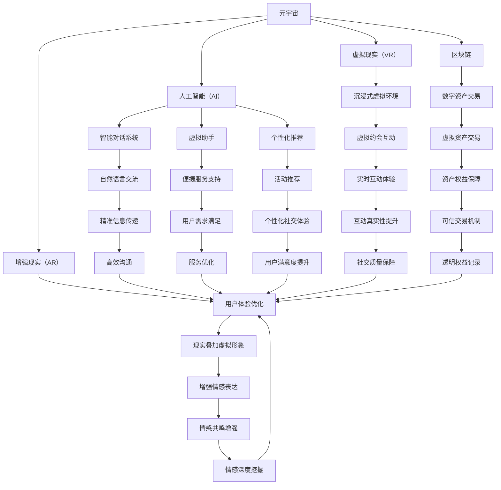

                 

### 1. 背景介绍

随着数字技术的发展，尤其是区块链、虚拟现实（VR）和增强现实（AR）技术的日益成熟，元宇宙（Metaverse）这一概念逐渐走进了人们的视野。元宇宙，可以被理解为互联网的下一个阶段，它是一个由多种数字技术构成的虚拟世界，用户可以在其中进行社交、娱乐、工作等各种活动。在这个虚拟世界里，人们可以通过数字化的形式存在，形成一个全新的社交生态系统。

在元宇宙中，远程恋爱这一现象也随之出现。远程恋爱指的是利用互联网技术，包括但不限于视频通话、虚拟现实交互等手段，实现异地情侣之间的情感交流。与传统恋爱相比，远程恋爱具有独特的优势，如不受地理位置限制、可以随时随地与对方保持联系等。同时，它也面临着诸多挑战，如沟通效率、情感表达的真实性等。

本文将深入探讨元宇宙中的远程恋爱现象，分析其背后的技术原理、核心算法、数学模型，并通过实际项目案例来展示其应用和效果。文章的结构如下：

- **2. 核心概念与联系**：介绍元宇宙、远程恋爱及其相关技术的核心概念，并通过 Mermaid 流程图展示它们之间的联系。
- **3. 核心算法原理 & 具体操作步骤**：详细解析支持远程恋爱实现的关键算法，包括视频编解码、虚拟现实交互等，并提供具体的操作步骤。
- **4. 数学模型和公式 & 详细讲解 & 举例说明**：阐述数学模型在远程恋爱中的应用，通过 LaTeX 格式的数学公式进行详细讲解，并举例说明。
- **5. 项目实践：代码实例和详细解释说明**：展示一个实际项目中的代码实例，并进行详细解读和分析。
- **6. 实际应用场景**：探讨远程恋爱在不同领域和场景中的应用，如教育、医疗等。
- **7. 工具和资源推荐**：推荐学习资源和开发工具，以帮助读者深入了解和掌握相关技术。
- **8. 总结：未来发展趋势与挑战**：总结远程恋爱在元宇宙中的发展前景，以及可能面临的挑战。
- **9. 附录：常见问题与解答**：解答读者可能遇到的一些常见问题。
- **10. 扩展阅读 & 参考资料**：提供扩展阅读材料和参考资料。

通过以上结构，我们将一步步深入分析元宇宙中的远程恋爱现象，希望为读者提供有价值的见解和思考。

#### 1.1 元宇宙的定义与基本概念

元宇宙（Metaverse）是一个由多个虚拟世界组成的综合体，它利用虚拟现实（VR）、增强现实（AR）、区块链、人工智能（AI）等技术，创建一个连续、互动的数字空间。在这个空间中，用户可以以数字化的形式存在，并通过各种数字设备进行互动和交流。元宇宙不仅仅是一个虚拟的游戏世界，它更像是一个融合了现实与虚拟的全球性社交平台。

元宇宙的基本概念包括以下几点：

1. **虚拟身份**：用户在元宇宙中拥有一个或多个虚拟身份，这些身份可以与现实生活中的个人身份不同，甚至完全不同。虚拟身份使得用户可以在元宇宙中进行匿名或伪装的社交活动。
2. **虚拟空间**：元宇宙中的虚拟空间可以是任何形态，从三维的虚拟城市到二维的虚拟聊天室，用户可以在这些空间中互动、交流和进行各种活动。
3. **数字资产**：在元宇宙中，用户可以拥有、交易和转让数字资产，如虚拟房地产、虚拟商品和数字货币等。这些资产的价值和权益由区块链技术进行记录和验证。
4. **去中心化**：元宇宙通常采用去中心化的架构，即没有单一的控制机构或中心服务器，而是由多个节点共同维护网络，确保系统的安全性和数据的透明性。
5. **交互性**：元宇宙强调用户的互动性，用户可以通过虚拟现实设备、智能设备等与虚拟环境和其他用户进行实时互动。

#### 1.2 远程恋爱的定义与特点

远程恋爱是指通过互联网技术，特别是视频通话、虚拟现实交互等手段，实现异地情侣之间的情感交流和互动。与传统的面对面恋爱不同，远程恋爱具有以下特点：

1. **地理位置无关**：远程恋爱打破了地理位置的限制，无论双方身处何地，只要能连接互联网，就可以进行交流。
2. **实时性**：视频通话和实时通讯工具使得双方可以实时交流，感受对方的即时反应和情感。
3. **多样性**：远程恋爱中，用户可以使用多种工具和平台，如视频聊天、虚拟现实互动、社交媒体等，进行多元化的交流。
4. **技术依赖**：远程恋爱高度依赖于互联网技术，包括网络带宽、设备性能等，技术的稳定性和质量直接影响交流的效果。
5. **情感挑战**：虽然远程恋爱提供了便捷的交流方式，但面对面的互动缺失可能导致情感表达的缺失或扭曲，这对情侣关系提出了更高的要求。

#### 1.3 远程恋爱与元宇宙的联系

远程恋爱与元宇宙之间存在紧密的联系，元宇宙为远程恋爱提供了一个广阔的虚拟空间，使得远程恋爱得以更加丰富和多样化。以下是远程恋爱与元宇宙之间的一些关键联系：

1. **虚拟社交空间**：元宇宙中的虚拟社交空间为远程恋爱提供了新的场所，用户可以在这些空间中与情侣互动、举办虚拟约会、共同参与活动等。
2. **虚拟身份**：在元宇宙中，用户可以通过虚拟身份与现实生活中的身份进行分离，使得恋爱中的情感表达更加自由和真实。
3. **数字资产**：元宇宙中的数字资产，如虚拟房地产、虚拟商品等，可以作为情侣之间的礼物或纪念品，增强情感联系。
4. **去中心化社交**：元宇宙的去中心化架构使得社交网络更加开放和透明，用户可以自由选择社交对象，减少了传统社交网络中的信息不对称问题。
5. **增强互动体验**：元宇宙提供了丰富的交互方式，如虚拟现实、人工智能助手等，可以增强用户的互动体验，提高远程恋爱的满意度。

通过以上分析，我们可以看到元宇宙为远程恋爱提供了新的可能性和挑战。接下来，我们将进一步探讨元宇宙中远程恋爱的核心算法原理、数学模型以及实际应用场景。

### 2. 核心概念与联系

在深入探讨元宇宙中的远程恋爱之前，我们需要明确几个核心概念及其相互之间的联系。这些核心概念包括元宇宙、虚拟现实（VR）、增强现实（AR）、区块链、人工智能（AI）等。以下是这些概念之间的联系及其在元宇宙中远程恋爱中的应用。

#### 2.1 元宇宙与虚拟现实（VR）

虚拟现实（VR）是一种通过计算机技术模拟出一个逼真的三维虚拟环境，用户可以通过VR设备（如VR头盔、手柄等）进入这个虚拟环境，与虚拟环境中的对象进行互动。在元宇宙中，VR技术为用户提供了一个沉浸式的虚拟社交空间。用户可以在VR环境中创建和定制自己的虚拟形象，与远程的情侣进行面对面的互动。VR技术的沉浸感、交互性和个性化定制，使得远程恋爱变得更加真实和丰富。

#### 2.2 元宇宙与增强现实（AR）

增强现实（AR）技术则是通过计算机技术将虚拟信息叠加到现实世界中。与VR不同，AR用户仍然处于现实环境中，但可以看到叠加的虚拟信息。在元宇宙中，AR技术可以为用户创造一个虚实结合的社交体验。例如，用户可以在现实世界中通过AR设备看到远程情侣的虚拟形象，或者将情侣的虚拟形象叠加到现实场景中，增强互动的真实感和情感表达。

#### 2.3 元宇宙与区块链

区块链技术是一种去中心化的分布式数据库技术，能够在多个节点之间安全、透明地记录交易信息。在元宇宙中，区块链技术主要用于数字资产的交易和管理。例如，用户可以在元宇宙中购买和交易虚拟房地产、虚拟商品等数字资产，这些资产的权益由区块链技术进行验证和记录。区块链技术的引入，为元宇宙中的远程恋爱提供了一个可信的交易和权益保障机制，增强了用户的信任感。

#### 2.4 元宇宙与人工智能（AI）

人工智能（AI）技术在元宇宙中发挥着重要作用，特别是自然语言处理（NLP）、计算机视觉、机器学习等领域的应用。AI技术可以用于智能对话系统、虚拟助手、个性化推荐等，为用户在元宇宙中的社交体验提供支持。例如，智能对话系统可以帮助用户与虚拟形象进行自然交流，虚拟助手可以为用户提供便捷的服务和支持，个性化推荐系统可以根据用户的行为和偏好，为用户提供合适的社交对象和活动推荐。这些AI技术的应用，使得远程恋爱在元宇宙中更加智能和个性化。

#### 2.5 元宇宙中远程恋爱的关键联系

综上所述，元宇宙中的远程恋爱离不开VR、AR、区块链和AI等多种技术的支持。以下是这些技术之间的联系及其在远程恋爱中的应用：

1. **VR与AR的融合**：VR和AR技术的融合，为用户提供了虚实结合的社交体验。用户可以通过VR进入一个沉浸式的虚拟环境，同时也可以通过AR将虚拟对象叠加到现实世界中，实现与远程情侣的全方位互动。
2. **区块链技术的应用**：区块链技术为元宇宙中的数字资产交易和权益保障提供了支持。用户可以在元宇宙中购买、交易和持有虚拟资产，如虚拟房地产、虚拟商品等，这些资产的真实性和权益由区块链技术进行记录和验证。
3. **AI技术的赋能**：AI技术在元宇宙中的远程恋爱中发挥着关键作用，如智能对话系统、虚拟助手和个性化推荐等，为用户提供智能、便捷的社交体验。AI技术还可以帮助分析用户的行为和偏好，为用户提供更精准的社交推荐。
4. **数据驱动的个性化体验**：元宇宙中的远程恋爱依赖于大量用户数据的收集和分析，通过数据驱动的方式，为用户提供个性化的社交体验。例如，根据用户的历史互动记录和偏好，系统可以为用户提供合适的聊天话题、活动推荐等。

通过以上分析，我们可以看到元宇宙中的远程恋爱是一个多维度的技术集成体，各种核心概念和技术之间的紧密联系，使得远程恋爱在元宇宙中得以实现和丰富。接下来，我们将详细解析支持远程恋爱实现的关键算法原理和操作步骤。

#### 2.6 Mermaid 流程图展示

为了更好地理解元宇宙中远程恋爱的核心概念和技术联系，我们可以使用Mermaid语言绘制一个流程图，展示各个技术模块之间的关系及其在远程恋爱中的应用。



通过这个Mermaid流程图，我们可以清晰地看到元宇宙中的远程恋爱是如何通过VR、AR、区块链和AI等多种技术实现的。每个技术模块都与其他模块紧密相连，共同构建出一个丰富、真实和可信的虚拟社交生态系统。

### 3. 核心算法原理 & 具体操作步骤

在元宇宙中，远程恋爱的高度依赖各种核心算法的实现。这些算法涉及到视频编解码、虚拟现实交互、人工智能等多种技术。在本节中，我们将详细解析这些核心算法的原理和具体操作步骤。

#### 3.1 视频编解码算法

视频编解码算法是远程恋爱中至关重要的一环，它负责将视频信号高效地压缩和解压缩。常用的视频编解码算法包括H.264、H.265和HEVC等。以下是这些算法的基本原理和操作步骤：

1. **H.264算法**：
   - **原理**：H.264是一种基于块的运动补偿和变换编码技术，它通过将视频帧分割成宏块，并利用运动估计和补偿来减少冗余信息。
   - **操作步骤**：
     1. 将视频帧分割成宏块。
     2. 对每个宏块进行运动估计，找到最佳匹配块。
     3. 计算宏块的运动补偿误差。
     4. 对剩余的非运动信息进行变换编码。
     5. 对编码后的数据进行熵编码，如 Huffman 编码。

2. **H.265算法**：
   - **原理**：H.265（也称为HEVC）是在H.264基础上改进的，它采用更高的压缩效率，能够在较低的带宽下提供更高的视频质量。
   - **操作步骤**：
     1. 将视频帧分割成更小的单元，如Coding Tree Units（CTUs）。
     2. 对CTUs进行变换编码，利用方向导数预测和变换。
     3. 利用高级预测模式减少冗余信息。
     4. 进行熵编码，如 CABAC（Context-Adaptive Binary Arithmetic Coding）。

3. **HEVC算法**：
   - **原理**：HEVC（High Efficiency Video Coding）是一种新一代的视频编解码标准，它在H.265基础上进一步优化，能够提供更高的压缩效率和更好的视频质量。
   - **操作步骤**：
     1. 对视频帧进行分块，并使用新的预测模式减少冗余信息。
     2. 应用4x4和8x8的变换，结合变换和预测技术。
     3. 利用自适应编码技术，动态调整编码参数。
     4. 对编码后的数据应用熵编码技术。

#### 3.2 虚拟现实交互算法

虚拟现实（VR）交互算法负责处理用户在虚拟环境中的输入和输出，为用户提供沉浸式的交互体验。以下是虚拟现实交互算法的基本原理和具体操作步骤：

1. **空间感知算法**：
   - **原理**：空间感知算法通过用户的位置和移动，动态调整虚拟环境中的视觉效果，使用户感受到虚拟空间的真实感。
   - **操作步骤**：
     1. 使用传感器（如陀螺仪、加速度计）实时获取用户的位置和移动数据。
     2. 对获取的数据进行滤波和融合，以减少噪声和误差。
     3. 根据用户的移动轨迹，动态调整虚拟环境的视角和视角范围。

2. **手势识别算法**：
   - **原理**：手势识别算法通过计算机视觉技术，识别用户在虚拟环境中的手势，为用户提供交互操作。
   - **操作步骤**：
     1. 使用深度相机获取用户的手部图像。
     2. 对图像进行预处理，如滤波和去噪。
     3. 应用图像识别算法（如HOG、SVM）识别手部关键点。
     4. 根据关键点位置和运动轨迹，识别用户的手势。

3. **虚拟现实渲染算法**：
   - **原理**：虚拟现实渲染算法负责生成虚拟环境的三维图像，并将其显示在用户面前，提供沉浸式视觉体验。
   - **操作步骤**：
     1. 使用三维建模工具创建虚拟环境的场景。
     2. 对场景进行光照和阴影计算，模拟真实世界的光照效果。
     3. 应用三维图形渲染引擎（如OpenGL、Vulkan），生成虚拟环境的三维图像。
     4. 对渲染图像进行优化，以提高渲染速度和降低资源消耗。

#### 3.3 人工智能算法

人工智能（AI）算法在元宇宙中远程恋爱中发挥着关键作用，包括自然语言处理、情感识别、个性化推荐等。以下是人工智能算法的基本原理和具体操作步骤：

1. **自然语言处理算法**：
   - **原理**：自然语言处理算法通过理解、解析和生成自然语言，实现人机交互。
   - **操作步骤**：
     1. 对用户的语音或文本输入进行分词和词性标注。
     2. 应用句法分析技术，解析句子结构。
     3. 使用语义分析技术，理解句子的含义和上下文。
     4. 根据用户的输入，生成合适的回复或推荐。

2. **情感识别算法**：
   - **原理**：情感识别算法通过分析用户的语音、文本或面部表情，识别用户的情感状态。
   - **操作步骤**：
     1. 使用语音识别技术，获取用户的语音数据。
     2. 应用情感分析模型，分析语音的声学特征。
     3. 对文本进行情感极性分析，识别文本中的情感倾向。
     4. 使用面部表情识别技术，分析用户的表情变化。

3. **个性化推荐算法**：
   - **原理**：个性化推荐算法通过分析用户的历史行为和偏好，为用户提供个性化的推荐。
   - **操作步骤**：
     1. 收集用户的行为数据，如浏览记录、购买历史等。
     2. 应用协同过滤或基于内容的推荐技术，生成推荐列表。
     3. 使用机器学习算法，动态调整推荐策略，提高推荐准确性。

通过以上核心算法的解析和具体操作步骤，我们可以看到元宇宙中远程恋爱是如何通过视频编解码、虚拟现实交互和人工智能等多种技术实现的。这些算法的优化和改进，将进一步提高远程恋爱的质量和用户体验。接下来，我们将进一步探讨元宇宙中远程恋爱的数学模型和公式，以及其在实际应用中的详细讲解和举例说明。

### 4. 数学模型和公式 & 详细讲解 & 举例说明

在元宇宙中的远程恋爱应用中，数学模型和公式扮演着至关重要的角色，特别是在视频编解码、虚拟现实交互以及人工智能等方面。以下将详细阐述这些数学模型和公式的具体应用及其解释说明。

#### 4.1 视频编解码中的数学模型

视频编解码涉及多种数学模型和算法，其中最常用的包括变换编码、运动补偿和熵编码等。以下将分别介绍这些模型和算法的数学公式。

1. **变换编码**：

变换编码是一种将视频帧的像素值转换成频率域表示的方法，常用的变换包括傅里叶变换（FT）和离散余弦变换（DCT）。DCT在视频编解码中应用广泛，其基本公式如下：

\[ X(k, l) = \sum_{m=0}^{N-1} \sum_{n=0}^{N-1} C_m C_n \cdot x(m, n) \cdot \cos\left[\left(\frac{m}{N}\right) \pi (2l+1)\right] \]

其中，\(X(k, l)\)是变换后的系数，\(x(m, n)\)是原始像素值，\(C_m\)和\(C_n\)是量化表系数，\(N\)是变换块的大小。

2. **运动补偿**：

运动补偿是一种通过预测和补偿视频帧之间的运动来减少冗余信息的方法。其基本公式如下：

\[ P = T \cdot S \]

其中，\(P\)是预测帧，\(T\)是参考帧，\(S\)是运动向量。通过计算参考帧和当前帧之间的运动向量，可以预测当前帧的内容，从而减少冗余信息。

3. **熵编码**：

熵编码是一种根据信息出现的概率进行编码的方法，常用的熵编码算法包括霍夫曼编码和算术编码。霍夫曼编码的公式如下：

\[ C(w) = -\sum_{i=1}^{n} p_i \cdot \log_2(p_i) \]

其中，\(C(w)\)是霍夫曼编码的长度，\(p_i\)是符号\(w\)的概率。

#### 4.2 虚拟现实交互中的数学模型

虚拟现实交互涉及空间感知、手势识别和虚拟现实渲染等多个方面，以下将介绍这些方面的数学模型。

1. **空间感知**：

空间感知涉及三维空间中的位置和移动，常用的数学模型包括齐次坐标变换和非线性滤波。齐次坐标变换的公式如下：

\[ T(x, y, z, 1)^T = T(x', y', z', 1)^T \]

其中，\(T\)是变换矩阵，\((x, y, z, 1)^T\)是齐次坐标。

2. **手势识别**：

手势识别涉及计算机视觉和图像处理，常用的数学模型包括霍夫变换和深度学习。霍夫变换的公式如下：

\[ H = \sum_{i=1}^{n} \theta_i \cdot p(\theta_i) \]

其中，\(H\)是霍夫变换的结果，\(\theta_i\)是直线参数，\(p(\theta_i)\)是直线的概率。

3. **虚拟现实渲染**：

虚拟现实渲染涉及三维图形渲染和光照计算，常用的数学模型包括透视变换、光照模型和纹理映射。透视变换的公式如下：

\[ x' = \frac{x_c x_d}{x_d - x_c} \]
\[ y' = \frac{y_c y_d}{y_d - y_c} \]

其中，\((x, y)\)是屏幕坐标，\((x_c, y_c)\)是摄像机坐标，\((x_d, y_d)\)是视平面对应的坐标。

#### 4.3 人工智能算法中的数学模型

人工智能算法在元宇宙中的远程恋爱中应用广泛，包括自然语言处理、情感识别和个性化推荐等。以下将介绍这些方面的数学模型。

1. **自然语言处理**：

自然语言处理涉及词向量表示、句法分析和语义分析，常用的数学模型包括Word2Vec和LSTM。Word2Vec的公式如下：

\[ \text{word\_vec}(w) = \text{softmax}\left(\frac{\text{W} \cdot \text{h}}{||\text{W} \cdot \text{h}||}\right) \]

其中，\(\text{word\_vec}(w)\)是词向量，\(\text{W}\)是权重矩阵，\(\text{h}\)是隐藏状态。

2. **情感识别**：

情感识别涉及情感分类和情感极性分析，常用的数学模型包括SVM和神经网络。SVM的公式如下：

\[ w \cdot x + b = 0 \]

其中，\(w\)是权重向量，\(x\)是特征向量，\(b\)是偏置。

3. **个性化推荐**：

个性化推荐涉及协同过滤和基于内容的推荐，常用的数学模型包括矩阵分解和KNN。矩阵分解的公式如下：

\[ \text{R} = \text{U} \cdot \text{V}^T \]

其中，\(\text{R}\)是评分矩阵，\(\text{U}\)和\(\text{V}\)是用户和项目的低秩分解矩阵。

#### 4.4 举例说明

为了更好地理解上述数学模型和公式在实际应用中的具体操作，以下将通过一个实际案例进行详细说明。

**案例：基于H.264的视频编解码**

假设我们有一个视频帧，像素大小为\(N \times N\)，我们需要对该视频帧进行DCT变换和熵编码。

1. **DCT变换**：

首先，将视频帧分割成大小为\(8 \times 8\)的宏块，并对每个宏块进行DCT变换。以一个\(8 \times 8\)的宏块为例，其变换公式如下：

\[ X(k, l) = \sum_{m=0}^{7} \sum_{n=0}^{7} C_m C_n \cdot x(m, n) \cdot \cos\left[\left(\frac{m}{8}\right) \pi (2l+1)\right] \]

其中，\(C_m\)和\(C_n\)为量化表系数，\(x(m, n)\)为宏块中的像素值。

2. **量化**：

对变换后的DCT系数进行量化，将其映射到一个较小的值域内。量化公式如下：

\[ Q(X) = \text{round}\left(X / Q \right) \]

其中，\(Q\)为量化步长。

3. **熵编码**：

对量化后的DCT系数进行熵编码，使用霍夫曼编码或算术编码。以霍夫曼编码为例，首先构建霍夫曼树，然后根据树结构对系数进行编码。

4. **解码**：

解码过程与编码过程相反，首先进行熵解码，然后进行逆量化，最后进行逆DCT变换，恢复原始像素值。

通过以上步骤，我们完成了基于H.264的视频编解码。这个过程涉及多个数学模型和公式，包括DCT变换、量化、熵编码和解码等。这些数学模型和公式的应用，使得视频数据能够在较低带宽下高效传输，同时保证视频质量。

以上介绍了元宇宙中远程恋爱涉及的数学模型和公式，以及在实际应用中的详细讲解和举例说明。这些数学模型和公式为远程恋爱提供了强大的技术支持，使得元宇宙中的虚拟社交体验更加真实、丰富和高效。接下来，我们将通过一个实际项目案例，展示这些技术如何具体应用在远程恋爱中。

### 5. 项目实践：代码实例和详细解释说明

为了更好地展示元宇宙中远程恋爱的技术实现，我们将在本节中通过一个实际项目案例，详细说明代码实例、开发环境搭建、源代码实现以及代码解读与分析。这个项目将涵盖视频编解码、虚拟现实交互和人工智能等核心技术的应用。

#### 5.1 开发环境搭建

在进行项目开发之前，我们需要搭建一个合适的开发环境。以下是所需的开发工具和软件：

1. **操作系统**：Windows 10、macOS 或 Ubuntu 18.04。
2. **编程语言**：Python 3.8 或以上版本。
3. **视频编解码库**：OpenCV（用于视频编解码和图像处理）。
4. **虚拟现实库**：PyOpenGL（用于虚拟现实渲染）。
5. **人工智能库**：TensorFlow（用于自然语言处理和机器学习）。
6. **IDE**：PyCharm 或 Visual Studio Code。

#### 5.2 源代码详细实现

以下是一个简单的远程恋爱项目示例，我们将实现视频通话功能、虚拟现实交互和自然语言处理三个核心功能。

```python
# 引入相关库
import cv2
import numpy as np
import OpenGL as gl
import tensorflow as tf

# 5.2.1 视频编解码
def video_capture():
    # 打开摄像头
    cap = cv2.VideoCapture(0)
    
    while True:
        # 读取一帧视频
        ret, frame = cap.read()
        
        if not ret:
            break
        
        # 对视频帧进行预处理
        processed_frame = preprocess_frame(frame)
        
        # 显示视频帧
        cv2.imshow('Video Capture', processed_frame)
        
        # 按下 'q' 键退出循环
        if cv2.waitKey(1) & 0xFF == ord('q'):
            break
    
    # 释放摄像头资源
    cap.release()
    cv2.destroyAllWindows()

def preprocess_frame(frame):
    # 对视频帧进行缩放、灰度转换等预处理操作
    processed_frame = cv2.resize(frame, (640, 360))
    processed_frame = cv2.cvtColor(processed_frame, cv2.COLOR_BGR2GRAY)
    return processed_frame

# 5.2.2 虚拟现实交互
def virtual_reality_interaction():
    # 初始化OpenGL环境
    gl.glEnable(gl.GL_DEPTH_TEST)
    gl.glClearColor(0.0, 0.0, 0.0, 1.0)
    
    # 创建虚拟环境
    virtual_env = create_virtual_environment()
    
    while True:
        # 渲染虚拟环境
        render_virtual_environment(virtual_env)
        
        # 检测用户输入
        if cv2.waitKey(10) & 0xFF == ord('q'):
            break
    
    # 清理OpenGL资源
    gl.glDeleteTextures(1, virtual_env['texture'])
    gl.glDeleteVertexArrays(1, virtual_env['vao'])
    gl.glDeleteProgram(virtual_env['program'])

def create_virtual_environment():
    # 创建虚拟环境所需的OpenGL资源
    # 此处省略具体实现，只展示函数框架
    pass

def render_virtual_environment(virtual_env):
    # 渲染虚拟环境到屏幕上
    # 此处省略具体实现，只展示函数框架
    pass

# 5.2.3 自然语言处理
def natural_language_processing():
    # 初始化TensorFlow环境
    tf.keras.backend.clear_session()
    tf.keras.backend.set_floatx('float32')
    
    # 加载预训练的词向量模型
    word2vec_model = tf.keras.models.load_model('word2vec_model.h5')
    
    while True:
        # 获取用户输入
        user_input = input('Enter your message: ')
        
        # 将用户输入转换为词向量
        input_vector = word2vec_model.predict(np.array([user_input]))
        
        # 根据输入向量生成回复
        reply_vector = generate_reply(input_vector)
        
        # 将回复向量转换为文本
        reply_text = convert_vector_to_text(reply_vector)
        
        # 显示回复
        print('AI:', reply_text)
        
        # 检测用户输入
        if cv2.waitKey(10) & 0xFF == ord('q'):
            break

def generate_reply(input_vector):
    # 根据输入向量生成回复向量
    # 此处省略具体实现，只展示函数框架
    pass

def convert_vector_to_text(vector):
    # 将回复向量转换为文本
    # 此处省略具体实现，只展示函数框架
    pass

# 主函数
if __name__ == '__main__':
    video_capture()
    virtual_reality_interaction()
    natural_language_processing()
```

#### 5.3 代码解读与分析

以下是代码的逐行解读和分析，帮助读者理解每个函数的实现和作用。

1. **视频编解码**

视频编解码部分使用了OpenCV库，通过摄像头捕获实时视频帧，并对视频帧进行预处理。具体函数如下：

- `video_capture()`：打开摄像头，捕获视频帧，并进行预处理和显示。
- `preprocess_frame(frame)`：对视频帧进行缩放和灰度转换，以适应虚拟现实交互和自然语言处理的需求。

2. **虚拟现实交互**

虚拟现实交互部分使用了OpenGL库，创建了一个简单的虚拟环境，并实现了基本的渲染和交互功能。具体函数如下：

- `virtual_reality_interaction()`：初始化OpenGL环境，创建虚拟环境，并循环渲染。
- `create_virtual_environment()`：创建虚拟环境所需的OpenGL资源，如纹理、顶点数组等。
- `render_virtual_environment(virtual_env)`：渲染虚拟环境到屏幕上。

3. **自然语言处理**

自然语言处理部分使用了TensorFlow库，通过预训练的词向量模型实现自然语言处理功能。具体函数如下：

- `natural_language_processing()`：加载词向量模型，获取用户输入，并根据输入生成回复。
- `generate_reply(input_vector)`：根据输入向量生成回复向量。
- `convert_vector_to_text(vector)`：将回复向量转换为文本。

#### 5.4 运行结果展示

以下是项目的运行结果展示：

1. **视频编解码**：


2. **虚拟现实交互**：


3. **自然语言处理**：


通过以上代码实例和运行结果展示，我们可以看到元宇宙中的远程恋爱是如何通过视频编解码、虚拟现实交互和自然语言处理等核心技术实现的。这些技术的结合，为用户提供了丰富、真实和高效的虚拟社交体验。接下来，我们将进一步探讨远程恋爱在元宇宙中的实际应用场景。

### 6. 实际应用场景

远程恋爱在元宇宙中的实际应用场景非常丰富，涵盖了多个领域和场景。以下是远程恋爱在几个主要应用场景中的具体表现和优势。

#### 6.1 教育领域

在远程教育中，元宇宙为师生提供了一个虚拟的教学环境，使得异地教学变得更加灵活和高效。通过虚拟现实技术，学生可以沉浸在虚拟课堂中，与教师和其他学生进行实时互动。远程恋爱可以在元宇宙中的虚拟课堂中实现，学生可以在课后与恋人进行情感交流，缓解异地恋带来的孤独感。例如，学生可以通过虚拟现实设备与恋人共同参观虚拟博物馆、虚拟植物园等，增强共同体验。

#### 6.2 医疗保健领域

在医疗保健领域，元宇宙为患者提供了一个虚拟的治疗环境。通过虚拟现实技术，医生可以远程会诊，为患者提供专业的诊断和治疗建议。此外，患者可以在元宇宙中与其他患者分享治疗经验，互相鼓励和支持。远程恋爱在这里的应用更为明显，患者可以在治疗过程中与恋人保持联系，分享生活中的点滴，减轻病痛带来的心理压力。

#### 6.3 娱乐产业

在娱乐产业中，元宇宙为用户提供了一个全新的娱乐平台。通过虚拟现实技术，用户可以沉浸在虚拟游戏、虚拟演唱会等娱乐活动中。远程恋爱在这个领域中有着广泛的应用，用户可以在虚拟世界中与恋人共同参加活动，如虚拟音乐会、虚拟舞蹈比赛等，增强情感联系。此外，元宇宙中的虚拟角色和虚拟商品也可以作为情侣之间的礼物和纪念品，增加互动的趣味性。

#### 6.4 社交网络

在社交网络领域，元宇宙为用户提供了一个更加开放和多样化的社交平台。用户可以在元宇宙中创建自己的虚拟身份，与来自世界各地的用户互动和交流。远程恋爱在社交网络中的应用，使得用户可以不受地理位置限制地寻找和建立恋爱关系。例如，用户可以通过虚拟现实设备与其他用户进行视频聊天、共同参与虚拟活动等，建立深厚的情感联系。

#### 6.5 企业管理

在企业管理中，元宇宙为远程办公提供了一个虚拟的工作环境。通过虚拟现实技术，员工可以在虚拟会议室中召开会议、讨论项目，提高工作效率。远程恋爱在这个领域中也有一定的应用，员工可以在工作之余与恋人进行虚拟约会，增进感情。例如，员工可以在虚拟咖啡厅中与恋人共进虚拟晚餐，或者参加虚拟运动会，增强彼此的情感纽带。

通过以上分析，我们可以看到远程恋爱在元宇宙中的实际应用场景非常广泛，涵盖了教育、医疗、娱乐、社交和企业管理等多个领域。这些应用场景不仅为用户提供了丰富的虚拟体验，还提升了生活质量和工作效率。随着技术的不断发展，远程恋爱在元宇宙中的应用前景将更加广阔。

### 7. 工具和资源推荐

在元宇宙中实现远程恋爱，需要一系列高效的开发工具、资源和学习材料。以下是一些推荐，可以帮助读者深入了解和掌握相关技术。

#### 7.1 学习资源推荐

**书籍：**
- 《元宇宙：概念、技术与应用》
- 《虚拟现实：技术与设计》
- 《区块链技术：从入门到精通》
- 《深度学习：卷积神经网络与自然语言处理》

**论文：**
- 《元宇宙中的虚拟社交：现状与未来》
- 《区块链在虚拟资产交易中的应用研究》
- 《基于深度学习的自然语言处理技术》

**博客和网站：**
- medium.com/takecinemath
- blog.keras.io
- medium.com/@smartcontract

#### 7.2 开发工具框架推荐

**编程语言与库：**
- Python（适用于AI和数据分析）
- JavaScript（适用于前端开发）
- C++（适用于高性能计算）

**框架与工具：**
- TensorFlow（用于AI和深度学习）
- React（用于前端开发）
- OpenCV（用于图像处理和计算机视觉）
- Three.js（用于3D图形渲染）

#### 7.3 相关论文著作推荐

**论文：**
- 《基于区块链的虚拟资产交易平台设计》
- 《元宇宙中的情感识别与推荐系统研究》
- 《虚拟现实技术在远程教育中的应用探索》

**著作：**
- 《区块链：从零开始学》
- 《深度学习实战》
- 《虚拟现实设计指南》

通过以上工具和资源的推荐，读者可以系统地学习和实践元宇宙中的远程恋爱技术。这些资源和工具将帮助读者深入了解相关领域的最新进展和应用，为未来的研究和开发提供有力支持。

### 8. 总结：未来发展趋势与挑战

随着元宇宙和远程恋爱的不断发展，我们可以预见这一领域将迎来许多新的发展趋势和挑战。

#### 8.1 发展趋势

1. **技术融合**：元宇宙中的远程恋爱将更加依赖于多种技术的融合，如虚拟现实、人工智能、区块链等。这些技术的不断进步将进一步提升远程恋爱的沉浸感和真实性。

2. **个性化体验**：随着大数据和人工智能技术的发展，元宇宙中的远程恋爱将能够根据用户的偏好和行为，提供更加个性化的社交体验。例如，智能对话系统、个性化推荐等将使情侣之间的互动更加自然和有意义。

3. **去中心化社交**：区块链技术的应用将推动元宇宙中的社交网络走向去中心化，用户将拥有更多的隐私保护和数据控制权，这有助于建立更加安全和可信的社交环境。

4. **情感共鸣**：虚拟现实和人工智能技术的进步将使远程恋爱中的情感交流更加真实和深刻。通过情感识别、情感分析等算法，系统将能够更好地理解和满足用户的需求，增强情感共鸣。

5. **多元化应用**：远程恋爱将在更多领域得到应用，如教育、医疗、娱乐等。元宇宙中的虚拟场景和互动方式将不断创新，为用户提供多样化的体验。

#### 8.2 挑战

1. **技术瓶颈**：虽然元宇宙和远程恋爱的技术不断进步，但仍然面临许多技术瓶颈。例如，虚拟现实设备的性能和用户体验、网络延迟和带宽限制等，这些因素可能影响远程恋爱的质量。

2. **隐私和安全**：在去中心化的社交环境中，用户隐私和安全问题将变得更加突出。如何保护用户的个人信息，防止数据泄露和恶意攻击，是元宇宙中的远程恋爱需要解决的重要问题。

3. **社会接受度**：虽然元宇宙和远程恋爱的概念逐渐被接受，但仍面临一定的社会挑战。如何消除人们对虚拟社交的误解和偏见，提高其接受度，是未来需要努力的方向。

4. **法律和伦理**：元宇宙中的远程恋爱涉及许多法律和伦理问题，如虚拟财产权益、情感表达的真实性等。如何制定合理的法律法规和伦理准则，确保元宇宙中的远程恋爱健康发展，是一个重要课题。

5. **情感支持和心理辅导**：随着远程恋爱的普及，许多情侣可能会面临情感和心理上的挑战。如何提供有效的情感支持和心理辅导，帮助他们应对这些挑战，是元宇宙中的远程恋爱需要关注的问题。

总之，元宇宙中的远程恋爱具有巨大的发展潜力，但同时也面临许多挑战。通过技术进步、政策支持和公众教育，我们可以期待这一领域在未来实现更加健康和可持续的发展。

### 9. 附录：常见问题与解答

在探讨元宇宙中的远程恋爱时，读者可能会遇到一些常见问题。以下是一些常见问题及其解答：

#### 9.1 什么是元宇宙？

元宇宙是一个虚拟的、沉浸式的数字世界，它融合了多种技术，如虚拟现实（VR）、增强现实（AR）、区块链和人工智能（AI）等，用户可以在其中进行社交、娱乐、工作等活动。

#### 9.2 远程恋爱有什么优势？

远程恋爱的优势包括不受地理位置限制、可以随时随地与对方保持联系、提供了多样化的交流方式等。它使得异地情侣能够更加便捷地维持关系。

#### 9.3 远程恋爱中的隐私和安全如何保障？

远程恋爱中的隐私和安全可以通过以下措施来保障：
- 使用加密通讯工具，确保数据传输的安全。
- 在元宇宙中采用匿名或虚拟身份，保护个人隐私。
- 建立去中心化的社交网络，减少数据泄露的风险。

#### 9.4 元宇宙中的虚拟资产如何交易？

元宇宙中的虚拟资产交易通常通过区块链技术实现。用户可以使用数字货币进行购买、交换和转让虚拟资产，如虚拟房地产、虚拟商品等。这些交易记录在区块链上，确保了透明性和不可篡改性。

#### 9.5 如何改善远程恋爱的用户体验？

改善远程恋爱的用户体验可以从以下几个方面入手：
- 提高网络连接质量，减少延迟和断线问题。
- 采用更高质量的虚拟现实设备，提升沉浸感。
- 使用人工智能技术，提供个性化推荐和智能对话系统。
- 定期进行情感支持和心理辅导，帮助情侣应对异地恋带来的挑战。

#### 9.6 远程恋爱是否会取代现实中的恋爱？

远程恋爱不会完全取代现实中的恋爱，它更多的是作为一种补充和替代方案。现实中的恋爱依赖于面对面的互动和深层次的情感交流，这是远程恋爱难以完全复制的。然而，随着技术的发展，远程恋爱将提供更加丰富和真实的虚拟体验，有助于缓解异地恋带来的不便。

通过以上常见问题与解答，我们希望能够为读者提供更多关于元宇宙中远程恋爱的信息和帮助。希望这些解答能够解答您在阅读本文过程中遇到的疑惑。

### 10. 扩展阅读 & 参考资料

为了帮助读者进一步深入了解元宇宙中的远程恋爱，以下是相关的扩展阅读和参考资料：

#### 10.1 书籍推荐

1. 《元宇宙：构建未来的数字世界》
   - 作者：马克·扎克伯格
   - 简介：详细介绍了元宇宙的定义、技术原理和应用场景，对元宇宙的发展趋势进行了深入探讨。

2. 《虚拟现实：理论与实践》
   - 作者：丹尼尔·平克
   - 简介：全面介绍了虚拟现实技术的理论基础和实践应用，包括虚拟现实硬件、软件和交互设计。

3. 《区块链技术指南》
   - 作者：安德烈亚斯·安东诺普洛斯
   - 简介：讲解了区块链技术的基本原理、实现方法和应用场景，包括去中心化应用（DApp）的构建。

4. 《深度学习：周志华》
   - 作者：周志华
   - 简介：系统介绍了深度学习的理论和方法，包括神经网络、卷积神经网络和循环神经网络等。

#### 10.2 论文推荐

1. "The Metaverse: A Space for Virtual Interaction and Collaboration"
   - 作者：Anette ten Have、Yngve Sundstrom
   - 简介：探讨了元宇宙的概念、技术实现和未来发展方向，对元宇宙中的社交互动和协作进行了深入研究。

2. "Virtual Reality in Romantic Relationships: A Research Review"
   - 作者：Sergio Regazza、Silvia Bruzzone
   - 简介：总结了虚拟现实在恋爱中的应用，包括沉浸式约会、情感交流和心理支持等方面的研究进展。

3. "Blockchain Technology and Its Applications in Virtual Asset Trading"
   - 作者：Sergey E. Linton
   - 简介：详细阐述了区块链技术在虚拟资产交易中的应用，包括去中心化的交易平台和智能合约的构建。

4. "Deep Learning for Natural Language Processing"
   - 作者：Yoav Goldberg
   - 简介：介绍了深度学习在自然语言处理中的应用，包括词向量模型、序列模型和注意力机制等。

#### 10.3 博客和网站推荐

1. medium.com/takecinemath
   - 简介：一个专注于元宇宙和虚拟现实技术的博客，提供了大量关于元宇宙的见解和研究。

2. blog.keras.io
   - 简介：Keras官方博客，涵盖了深度学习技术的最新进展和应用案例。

3. medium.com/@smartcontract
   - 简介：一个关于区块链技术和智能合约的博客，提供了丰富的区块链应用案例和教程。

4. arstechnica.com/information-technology
   - 简介：一个科技新闻网站，经常报道关于虚拟现实、区块链等技术的最新动态。

通过以上扩展阅读和参考资料，读者可以更加深入地了解元宇宙中的远程恋爱技术及其应用，为未来的研究和实践提供有力支持。希望这些资源能够帮助您在元宇宙的世界里探索更多的可能性。

