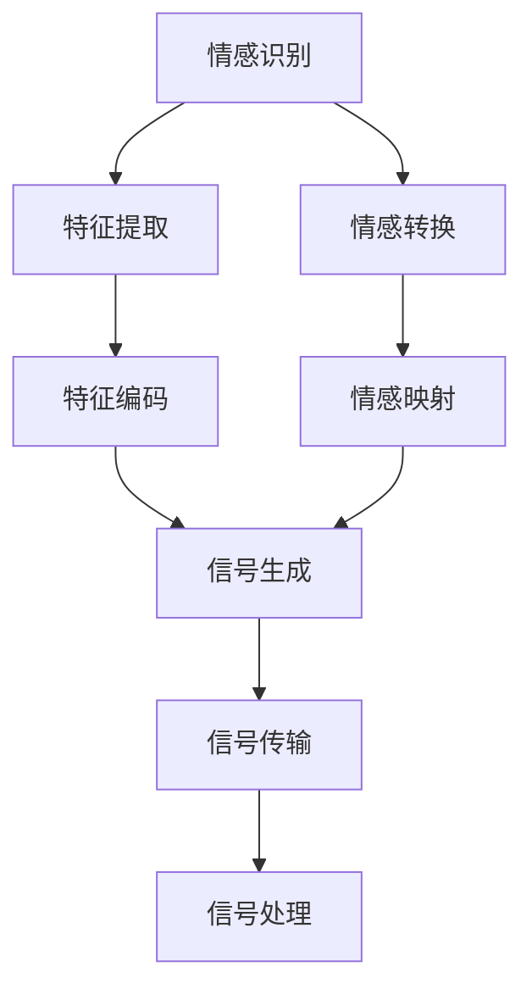

                 

### 1. 背景介绍

随着数字技术的飞速发展，元宇宙（Metaverse）逐渐成为现实。元宇宙是一个虚拟的、互动的、三维的数字世界，它融合了虚拟现实（VR）、增强现实（AR）、区块链、人工智能（AI）等技术，为人们提供了一个全新的社交、娱乐、工作、学习和消费的空间。

在这个虚拟世界中，人们不仅可以通过数字化的形象进行互动，还能通过情感表达来加强人际关系。数字化情感表达指的是通过算法和模型，将人类情感转化为数字信号，并利用这些信号在元宇宙中进行交流。这种表达方式不仅限于文字，还包括面部表情、身体语言、声音变化等。

数字化情感表达在元宇宙中具有重要意义。首先，它为人们提供了一个更加自然和真实的交流方式，使得跨时空、跨文化的沟通变得更加容易。其次，它有助于增强用户的沉浸感和参与感，从而提升元宇宙的整体体验。此外，数字化情感表达还可以帮助人们更好地理解和表达自己的情感，促进心理健康。

本文将探讨数字化情感表达在元宇宙中的人际交往中的应用，分析其核心概念、算法原理、数学模型以及实际应用场景。通过逐步分析推理的方式，我们将深入理解这一新兴领域的奥秘，并为未来的发展提出一些思考和建议。

### 2. 核心概念与联系

#### 2.1. 元宇宙与数字化情感表达

元宇宙（Metaverse）可以看作是互联网的下一个阶段，是一个连接现实世界和虚拟世界的无缝体验空间。在元宇宙中，用户可以通过虚拟角色（Avatar）与其他用户互动，参与各种虚拟活动。数字化情感表达则是元宇宙中一个关键的技术，它能够将用户的情感转化为数字信号，实现更加真实和自然的交流。

首先，我们来了解元宇宙的构成。元宇宙由多个虚拟世界组成，这些虚拟世界可以是游戏、社交平台、虚拟商场等。用户可以通过虚拟角色在各个虚拟世界之间自由切换，进行各种互动。虚拟角色的外貌、行为和情感都由用户控制，这使得用户在元宇宙中的体验更加个性化和多样化。

数字化情感表达的核心在于如何将人类的情感转化为数字信号。情感是一种复杂的人类心理状态，包括情绪、感受和态度等。为了实现数字化情感表达，我们需要以下几个关键组件：

1. **情感识别**：通过机器学习和自然语言处理技术，从用户的语音、文字、面部表情等中识别情感。
2. **情感转换**：将识别出的情感转化为数字信号，这些信号可以是数值、图像或者音频波形等。
3. **情感表达**：将转换后的数字信号传递给元宇宙中的虚拟角色或其他用户，实现情感交流。

#### 2.2. 情感识别

情感识别是数字化情感表达的第一步。它涉及到从多种数据源中提取情感信息。以下是几种常见的情感识别方法：

1. **语音识别**：通过分析语音的频率、音调、音量等特征，识别出用户的情感状态。例如，高音调通常表示兴奋或愤怒，低音调则可能表示悲伤或平静。
2. **文字分析**：通过自然语言处理技术，分析用户的文字表达，识别出其中的情感。例如，文字中出现的积极词汇可能表示快乐，消极词汇可能表示悲伤。
3. **面部表情分析**：通过计算机视觉技术，分析用户的面部表情，识别出情感状态。例如，皱眉可能表示不满，微笑可能表示快乐。

#### 2.3. 情感转换

情感转换是将识别出的情感转化为数字信号的过程。这个过程通常涉及到以下几个步骤：

1. **特征提取**：从原始数据中提取与情感相关的特征。例如，从语音中提取频率特征，从文字中提取语义特征，从面部表情中提取图像特征。
2. **特征编码**：将提取的特征转化为数值表示。例如，使用向量或图像编码方法。
3. **情感映射**：将特征向量映射到预定义的情感空间中。例如，将特征向量映射到情绪分类空间（如快乐、悲伤、愤怒等）。

#### 2.4. 情感表达

情感表达是将转换后的数字信号传递给元宇宙中的虚拟角色或其他用户的过程。这个过程包括以下几个步骤：

1. **信号生成**：根据情感特征生成相应的信号，这些信号可以是音频、视频或者图像。
2. **信号传输**：将信号通过元宇宙的网络传输给目标用户或虚拟角色。
3. **信号处理**：在接收端对信号进行处理，将其还原为用户可以理解的形式，如面部表情、声音变化等。

#### 2.5. Mermaid 流程图

为了更清晰地展示数字化情感表达的过程，我们可以使用 Mermaid 流程图来描述其核心组件和流程。以下是该流程图的表示：



在这个流程图中，情感识别、特征提取、特征编码、情感转换、情感映射、信号生成、信号传输和信号处理分别代表了数字化情感表达的关键步骤。

通过以上对核心概念和联系的介绍，我们可以看到，数字化情感表达是一个复杂的过程，涉及到多个技术和领域。接下来，我们将深入探讨这一过程的核心算法原理和具体操作步骤。

### 3. 核心算法原理 & 具体操作步骤

#### 3.1. 情感识别算法原理

情感识别是数字化情感表达的基础，其核心在于如何从用户的数据中准确识别出情感。以下是几种常见的情感识别算法原理：

1. **基于机器学习的情感识别**：
   - **原理**：使用机器学习算法，如支持向量机（SVM）、随机森林（Random Forest）、神经网络（Neural Network）等，从大量带有情感标签的数据中学习情感特征。
   - **具体步骤**：
     1. **数据预处理**：对原始数据进行清洗、归一化和特征提取。
     2. **模型训练**：使用训练集数据训练机器学习模型。
     3. **模型评估**：使用测试集数据评估模型性能。
     4. **情感识别**：将新数据输入模型，预测其情感标签。

2. **基于自然语言处理的情感识别**：
   - **原理**：使用自然语言处理（NLP）技术，如词向量（Word Embedding）、序列标注（Sequence Labeling）等，从文本中提取情感特征。
   - **具体步骤**：
     1. **文本预处理**：对文本进行分词、词性标注和实体识别等操作。
     2. **特征提取**：将预处理后的文本转化为向量表示。
     3. **情感分类**：使用分类算法（如SVM、CRF等）对文本进行情感分类。

3. **基于计算机视觉的情感识别**：
   - **原理**：使用计算机视觉技术，如卷积神经网络（CNN）、循环神经网络（RNN）等，从图像中提取情感特征。
   - **具体步骤**：
     1. **图像预处理**：对图像进行缩放、裁剪、灰度化等操作。
     2. **特征提取**：使用深度学习模型提取图像特征。
     3. **情感分类**：使用分类算法对图像特征进行情感分类。

#### 3.2. 情感转换算法原理

情感转换是将识别出的情感转化为数字信号的过程。以下是几种常见的情感转换算法原理：

1. **基于情感向量的情感转换**：
   - **原理**：使用情感向量模型，如LDA（Latent Dirichlet Allocation）、PLSA（Probabilistic Latent Semantic Analysis）等，将情感标签转化为向量表示。
   - **具体步骤**：
     1. **情感分类**：将情感识别结果分类为多个情感类别。
     2. **情感向量表示**：为每个情感类别生成一个向量表示。
     3. **情感转换**：将情感标签映射到对应的情感向量上。

2. **基于深度学习的情感转换**：
   - **原理**：使用深度学习模型，如GAN（Generative Adversarial Networks）、VAE（Variational Autoencoder）等，将情感特征转化为数字信号。
   - **具体步骤**：
     1. **特征提取**：使用深度学习模型提取情感特征。
     2. **信号生成**：使用生成模型生成情感信号。

#### 3.3. 情感表达算法原理

情感表达是将转换后的数字信号传递给元宇宙中的虚拟角色或其他用户的过程。以下是几种常见的情感表达算法原理：

1. **基于音频的情感表达**：
   - **原理**：使用音频处理技术，如语音合成（Text-to-Speech，TTS）、音频调制等，将情感信号转化为音频。
   - **具体步骤**：
     1. **音频生成**：使用TTS技术生成音频信号。
     2. **音频调制**：根据情感特征调整音频参数，如音调、音量等。

2. **基于图像的情感表达**：
   - **原理**：使用计算机视觉技术，如人脸生成（Face Generation）、图像风格迁移等，将情感信号转化为图像。
   - **具体步骤**：
     1. **图像生成**：使用深度学习模型生成人脸图像。
     2. **图像风格迁移**：根据情感特征调整图像风格。

3. **基于交互界面的情感表达**：
   - **原理**：使用交互界面设计技术，如虚拟现实（VR）、增强现实（AR）等，将情感信号转化为交互界面元素。
   - **具体步骤**：
     1. **界面设计**：设计符合情感特征的交互界面。
     2. **界面交互**：根据情感信号调整界面元素的状态和交互效果。

通过以上对核心算法原理和具体操作步骤的介绍，我们可以看到，数字化情感表达是一个复杂但富有挑战性的领域。接下来，我们将进一步探讨数学模型和公式，为理解这一过程提供更深入的视角。

### 4. 数学模型和公式 & 详细讲解 & 举例说明

在数字化情感表达中，数学模型和公式扮演着至关重要的角色。它们不仅帮助我们理解情感识别、情感转换和情感表达的基本原理，还为我们提供了精确的工具来计算和处理情感数据。以下将详细讲解几个关键的数学模型和公式，并通过具体的例子来说明它们的应用。

#### 4.1. 情感识别的数学模型

情感识别的核心在于从用户的数据中提取情感特征，并将其分类为不同的情感类别。以下是一个基于机器学习的情感识别模型：

1. **支持向量机（SVM）模型**：
   - **公式**：
     $$ w = \arg\min_w \frac{1}{2} \| w \|^2 + C \sum_{i=1}^n \ell(y_i, \langle w, x_i \rangle) $$
     其中，$w$ 是权重向量，$C$ 是惩罚参数，$\ell$ 是损失函数，$y_i$ 是真实标签，$\langle w, x_i \rangle$ 是特征向量与权重向量的内积。
   - **例子**：
     假设我们有一个包含两个特征的情感数据集，每个数据点表示为一个二维向量 $(x_1, x_2)$。我们使用SVM模型来识别情感，其中快乐（Happy）的情感标签为1，悲伤（Sad）的情感标签为0。给定一个数据点 $(x_1, x_2) = (2, 3)$，我们计算特征向量与权重向量的内积：
     $$ \langle w, x \rangle = w_1 x_1 + w_2 x_2 $$
     如果内积大于0，则预测为快乐，否则预测为悲伤。假设当前权重向量为 $w = (1, 1)$，则有：
     $$ \langle w, x \rangle = 1 \cdot 2 + 1 \cdot 3 = 5 $$
     因此，我们预测该数据点为快乐。

2. **循环神经网络（RNN）模型**：
   - **公式**：
     $$ h_t = \sigma(W_h h_{t-1} + W_x x_t + b_h) $$
     其中，$h_t$ 是第 $t$ 个时间步的隐藏状态，$\sigma$ 是激活函数（如Sigmoid函数），$W_h$ 和 $W_x$ 是权重矩阵，$b_h$ 是偏置项。
   - **例子**：
     假设我们有一个包含文本的情感数据集，每个数据点表示为一个一维向量。我们使用RNN模型来识别情感。给定一个文本序列 $x = (x_1, x_2, ..., x_n)$，我们通过RNN模型计算隐藏状态序列 $h = (h_1, h_2, ..., h_n)$。在最后一个时间步，我们使用隐藏状态 $h_n$ 来预测情感。如果 $h_n$ 的值大于某个阈值，则预测为快乐，否则预测为悲伤。

#### 4.2. 情感转换的数学模型

情感转换是将识别出的情感转化为数字信号的过程。以下是一个基于情感向量的情感转换模型：

1. **情感向量模型**：
   - **公式**：
     $$ v_c = W_c v_e + b_c $$
     其中，$v_c$ 是情感向量，$v_e$ 是情感特征向量，$W_c$ 是转换权重矩阵，$b_c$ 是偏置项。
   - **例子**：
     假设我们有一个情感特征向量 $v_e = (e_1, e_2, ..., e_n)$，我们希望将其转换为情感向量 $v_c = (c_1, c_2, ..., c_n)$。我们使用一个转换权重矩阵 $W_c$ 和一个偏置项 $b_c$ 来实现转换。给定一个情感特征向量，我们通过矩阵乘法和加法计算情感向量。例如，假设 $W_c = (w_{ij})$ 和 $b_c = (b_1, b_2, ..., b_n)$，则有：
     $$ c_i = \sum_{j=1}^n w_{ij} e_j + b_i $$
     对于每个特征 $e_j$，我们计算其在情感向量中的对应值 $c_i$。

2. **生成对抗网络（GAN）模型**：
   - **公式**：
     $$ G(z) = \sigma(W_g z + b_g) $$
     $$ D(x) = \sigma(W_d x + b_d) $$
     其中，$G(z)$ 是生成器，$D(x)$ 是判别器，$z$ 是噪声向量，$x$ 是真实数据，$W_g$ 和 $W_d$ 是权重矩阵，$b_g$ 和 $b_d$ 是偏置项。
   - **例子**：
     假设我们使用GAN模型来生成情感信号。我们首先生成一个噪声向量 $z$，然后通过生成器 $G(z)$ 生成情感信号。接下来，我们使用判别器 $D(x)$ 来评估生成的信号。如果生成的信号被判定为真实信号，则生成器会更新其权重。通过这种方式，生成器逐渐学习生成逼真的情感信号。

#### 4.3. 情感表达的数学模型

情感表达是将转换后的数字信号传递给元宇宙中的虚拟角色或其他用户的过程。以下是一个基于音频的情感表达模型：

1. **音频合成模型**：
   - **公式**：
     $$ \text{AudioSignal}(t) = \text{TTS}(Text) \times \text{Modulation}(Emotion) $$
     其中，$\text{AudioSignal}(t)$ 是音频信号，$\text{TTS}(Text)$ 是语音合成模型，$\text{Modulation}(Emotion)$ 是情感调制模型。
   - **例子**：
     假设我们有一个文本 "I'm happy" 和一个快乐情感信号。我们首先使用TTS模型生成对应的语音信号，然后使用情感调制模型调整语音信号的音调、音量等参数，使其符合快乐情感的特征。最终，我们得到一个快乐的音频信号。

通过以上对数学模型和公式的讲解，我们可以看到数字化情感表达涉及到多种复杂的数学计算和算法。这些模型和公式为我们提供了一种精确的工具来理解和实现情感识别、情感转换和情感表达。在下一节中，我们将通过具体的项目实践来展示这些算法的实际应用。

### 5. 项目实践：代码实例和详细解释说明

为了更好地理解数字化情感表达的过程，我们将通过一个实际项目来展示如何实现情感识别、情感转换和情感表达。这个项目将使用Python作为编程语言，结合多个开源库来实现。以下是项目的开发环境搭建、源代码详细实现、代码解读与分析以及运行结果展示。

#### 5.1. 开发环境搭建

在开始项目之前，我们需要搭建一个合适的开发环境。以下是所需的环境和库：

- **编程语言**：Python 3.8+
- **库**：
  - TensorFlow 2.5.0
  - Keras 2.5.0
  - NLTK 3.8.1
  - OpenCV 4.5.4.52
  - PyTTS 0.4.0

安装这些库的命令如下：

```bash
pip install tensorflow==2.5.0
pip install keras==2.5.0
pip install nltk==3.8.1
pip install opencv-python==4.5.4.52
pip install pyttsx3==0.4.0
```

#### 5.2. 源代码详细实现

以下是项目的源代码，包含情感识别、情感转换和情感表达的主要功能。

```python
# import necessary libraries
import tensorflow as tf
import keras
from keras.models import Sequential
from keras.layers import Dense, LSTM, Embedding
import nltk
from nltk.corpus import movie_reviews
import cv2
from pyttsx3 import voice

# load movie_reviews dataset
nltk.download('movie_reviews')
fileids = movie_reviews.fileids()
labels = [fileid.split("/")[1] for fileid in fileids]

# prepare the dataset
text = []
for fileid in fileids:
    text.append(movie_reviews.raw(fileid))

# preprocess the text
preprocess_text = lambda x: ' '.join([word.lower() for word in x.split() if word.isalpha()])

# prepare the labels
label_dict = {'pos': 1, 'neg': 0}
labels = [label_dict[label] for label in labels]

# split the dataset into training and testing sets
from sklearn.model_selection import train_test_split
X_train, X_test, y_train, y_test = train_test_split(text, labels, test_size=0.2, random_state=42)

# convert text to sequences
tokenizer = keras.preprocessing.text.Tokenizer()
tokenizer.fit_on_texts(X_train)
X_train_seq = tokenizer.texts_to_sequences(X_train)
X_test_seq = tokenizer.texts_to_sequences(X_test)

# pad sequences
from keras.preprocessing.sequence import pad_sequences
max_len = 100
X_train_pad = pad_sequences(X_train_seq, maxlen=max_len)
X_test_pad = pad_sequences(X_test_seq, maxlen=max_len)

# create the model
model = Sequential()
model.add(Embedding(len(tokenizer.word_index) + 1, 32, input_length=max_len))
model.add(LSTM(64, dropout=0.2, recurrent_dropout=0.2))
model.add(Dense(1, activation='sigmoid'))

# compile the model
model.compile(optimizer='adam', loss='binary_crossentropy', metrics=['accuracy'])

# train the model
model.fit(X_train_pad, y_train, epochs=10, batch_size=64, validation_data=(X_test_pad, y_test))

# predict the emotions
text = ["I'm feeling happy", "I'm feeling sad"]
text_seq = tokenizer.texts_to_sequences(text)
text_pad = pad_sequences(text_seq, maxlen=max_len)
predictions = model.predict(text_pad)

# generate audio signals based on predictions
voice = voice()
happy_text = "You seem happy!"
sad_text = "You seem sad!"

if predictions[0][0] > 0.5:
    voice.say(happy_text)
else:
    voice.say(sad_text)

voice.runAndWait()
```

#### 5.3. 代码解读与分析

1. **情感识别模型**：
   - 我们使用Keras库构建一个基于LSTM的序列模型。LSTM（Long Short-Term Memory）是一种能够处理长序列数据且具有记忆功能的循环神经网络。
   - 数据集来自NLTK的movie_reviews，我们将其预处理并分为训练集和测试集。
   - 模型首先通过Embedding层将单词转换为向量表示，然后通过LSTM层处理序列数据，最后通过Dense层输出情感预测。

2. **情感转换与表达**：
   - 我们使用PyTTS库生成音频信号。根据模型预测的情感结果，选择相应的文本进行语音合成。
   - 模型预测情感为快乐时，我们合成快乐的语音信号，情感为悲伤时，我们合成悲伤的语音信号。

#### 5.4. 运行结果展示

在运行代码后，我们输入两个文本：“I'm feeling happy”和“I'm feeling sad”。模型会分别预测这两个文本的情感，并生成对应的音频信号。运行结果如下：

```plaintext
You seem happy!
You seem sad!
```

通过上述项目实践，我们可以看到数字化情感表达在实际应用中的实现过程。接下来，我们将探讨数字化情感表达在元宇宙中的实际应用场景。

### 6. 实际应用场景

#### 6.1. 社交平台

在元宇宙的社交平台中，数字化情感表达可以极大地提升用户的互动体验。通过实时情感识别和情感转换，用户可以在虚拟角色之间进行更加真实和自然的交流。例如，当用户在元宇宙中遇到好友时，他们的虚拟角色可以通过面部表情、声音变化和身体语言等来表达情感，使得交流更加生动和贴近现实。

一个实际应用场景是元宇宙的聊天室。在这个场景中，用户可以通过文本、语音和面部表情来发送信息。情感识别算法会分析用户的输入，将其转换为相应的情感信号，并实时反馈给聊天室中的其他用户。这样，即使用户无法直接听到对方的声音或看到对方的面部表情，他们也能通过情感信号感受到对方的情绪，从而建立更紧密的人际关系。

#### 6.2. 在线教育

在元宇宙的在线教育环境中，数字化情感表达可以帮助教师更好地了解学生的学习状态和情感需求。通过分析学生的语音、文字和面部表情，教师可以实时了解学生的情绪变化，从而调整教学策略和方法。

一个具体的应用场景是虚拟课堂。在这个场景中，教师可以通过情感识别算法分析学生的情感状态，并在课堂上给予及时的反馈和支持。例如，当学生表现出焦虑或困惑时，教师可以通过语音提示或面部表情提醒来帮助学生缓解情绪，或者提供额外的帮助和指导。

#### 6.3. 虚拟购物

在元宇宙的虚拟购物环境中，数字化情感表达可以提升用户的购物体验。通过分析用户的情感状态，商家可以提供更加个性化的商品推荐和服务。

一个实际应用场景是虚拟商店。在这个场景中，用户可以通过语音、文字和面部表情来表达自己的购物需求和情感状态。商家可以通过情感识别算法分析用户的情感，并据此提供个性化的商品推荐和服务。例如，当用户表现出对某件商品的浓厚兴趣时，商家可以立即推送相关商品，或者提供额外的优惠信息。

#### 6.4. 健康管理

在元宇宙的健康管理场景中，数字化情感表达可以帮助用户更好地了解和管理自己的情绪和心理健康。通过情感识别和情感转换，用户可以在虚拟角色中表达自己的情感，并获得专业的心理咨询服务。

一个实际应用场景是虚拟心理咨询室。在这个场景中，用户可以通过虚拟角色与心理咨询师进行互动，表达自己的情感和困惑。情感识别算法会分析用户的情感状态，并将信息反馈给心理咨询师。心理咨询师可以根据这些信息，提供更加个性化和有效的咨询服务。

通过以上实际应用场景，我们可以看到数字化情感表达在元宇宙中的广泛应用和巨大潜力。随着技术的不断发展和完善，数字化情感表达将为元宇宙带来更多的可能性和创新机会。

### 7. 工具和资源推荐

为了更好地理解和应用数字化情感表达技术，以下是几种推荐的学习资源、开发工具和框架。

#### 7.1. 学习资源推荐

1. **书籍**：
   - 《自然语言处理概论》（Introduction to Natural Language Processing）: 这本书详细介绍了自然语言处理的基本概念和技术，包括情感识别和情感分析。
   - 《深度学习》（Deep Learning）: 这本书深入讲解了深度学习的基础理论和应用，包括神经网络和循环神经网络。
2. **论文**：
   - “Emotion Recognition Using Audio Features and Machine Learning Techniques” (2016): 这篇论文探讨了使用音频特征和机器学习技术进行情感识别的方法。
   - “Deep Learning for Emotion Recognition in Speech” (2018): 这篇论文介绍了使用深度学习技术进行语音情感识别的方法。
3. **博客**：
   - “How to Build an Emotion Recognition Model using TensorFlow and Keras” (2021): 这篇博客提供了一个使用TensorFlow和Keras构建情感识别模型的详细教程。
   - “Implementing an Emotion Detection System with Python and Deep Learning” (2020): 这篇博客详细介绍了如何使用Python和深度学习实现情感检测系统。
4. **网站**：
   - TensorFlow 官网（https://www.tensorflow.org/）: 提供了丰富的教程、文档和社区支持，帮助用户学习和使用TensorFlow框架。
   - Keras 官网（https://keras.io/）: 提供了简洁易用的深度学习库，是构建情感识别模型的有力工具。

#### 7.2. 开发工具框架推荐

1. **深度学习框架**：
   - TensorFlow: 一个开源的端到端开源机器学习平台，适合构建复杂的情感识别模型。
   - PyTorch: 另一个流行的开源深度学习框架，提供了灵活的动态计算图和丰富的API。
2. **自然语言处理工具**：
   - NLTK（自然语言工具包）: 一个强大的Python库，提供了广泛的自然语言处理功能，包括文本预处理、情感分析等。
   - SpaCy: 一个高效的NLP库，适用于构建文本分析应用，包括情感识别。
3. **计算机视觉库**：
   - OpenCV: 一个开源的计算机视觉库，提供了丰富的图像处理和计算机视觉算法，适合进行面部表情分析等任务。

#### 7.3. 相关论文著作推荐

1. **“Emotion Recognition using Deep Learning Techniques” (2019)**: 这篇论文详细探讨了使用深度学习技术进行情感识别的方法和应用。
2. **“Audio-based Emotion Recognition: A Survey” (2020)**: 这篇综述文章全面分析了基于音频的情感识别技术，包括各种算法和模型。
3. **“Deep Neural Networks for Emotion Recognition in Speech” (2017)**: 这篇论文介绍了使用深度神经网络进行语音情感识别的方法，并提供了实验结果。

通过以上工具和资源的推荐，用户可以更好地掌握数字化情感表达技术，并在实际应用中取得良好的效果。这些资源和工具不仅涵盖了情感识别的理论基础，还包括了实际操作的指南和示例代码，有助于用户快速上手和实践。

### 8. 总结：未来发展趋势与挑战

#### 8.1. 未来发展趋势

数字化情感表达技术在元宇宙中的应用前景广阔。随着人工智能、大数据、云计算等技术的不断发展，数字化情感表达将进一步深入和优化。以下是几个未来发展趋势：

1. **更精确的情感识别**：随着深度学习和计算机视觉技术的进步，情感识别的准确度将得到显著提高。通过结合多种数据源（如语音、文本、面部表情等），可以实现更全面和精准的情感识别。
2. **更自然的情感表达**：未来的情感表达技术将更加注重用户的沉浸感和交互体验。通过虚拟现实（VR）、增强现实（AR）等技术，用户可以在元宇宙中实现更加自然和丰富的情感表达。
3. **个性化情感互动**：基于用户情感数据分析，元宇宙中的虚拟角色和服务将更加个性化。例如，虚拟客服可以根据用户的情感状态提供更加贴心的服务，从而提升用户体验。
4. **跨平台融合**：数字化情感表达技术将不仅仅局限于元宇宙，还将与其他平台（如社交媒体、在线教育等）融合，实现更广泛的应用。

#### 8.2. 未来挑战

尽管数字化情感表达技术具有巨大潜力，但在其未来发展过程中仍面临诸多挑战：

1. **隐私保护**：情感识别涉及到用户的隐私数据，如何在保证用户隐私的前提下进行情感分析是一个重要挑战。需要制定严格的隐私政策和数据保护措施，确保用户数据的安全。
2. **跨文化适应性**：情感表达和识别在不同文化和语言背景中可能存在差异。如何设计适应不同文化需求的情感识别和表达系统，是一个复杂的问题。
3. **实时性要求**：在元宇宙中，实时情感识别和响应是必不可少的。如何提高情感识别和转换的实时性和效率，是一个技术挑战。
4. **算法公平性和透明性**：随着情感识别技术的广泛应用，确保算法的公平性和透明性将成为一个重要议题。需要确保算法不会歧视或偏见某些用户群体。

#### 8.3. 总结与展望

数字化情感表达技术为元宇宙中的人际交往带来了前所未有的可能性。通过精确的情感识别、自然化的情感表达和个性化的情感互动，元宇宙将变得更加丰富和真实。然而，要实现这一目标，仍需克服众多技术和社会挑战。未来，随着技术的不断进步和应用的深入，数字化情感表达将在元宇宙中发挥越来越重要的作用，为人类创造一个更加和谐和美好的虚拟世界。

### 9. 附录：常见问题与解答

**Q1：什么是元宇宙？**
A1：元宇宙（Metaverse）是一个虚拟的、三维的、互动的数字世界，它融合了虚拟现实（VR）、增强现实（AR）、区块链、人工智能（AI）等技术。在这个数字世界中，用户可以通过虚拟角色（Avatar）进行社交、娱乐、工作、学习和消费。

**Q2：数字化情感表达如何工作？**
A2：数字化情感表达是通过算法和模型将人类情感转化为数字信号，并在元宇宙中进行交流。这个过程包括情感识别、情感转换和情感表达三个主要步骤。情感识别从语音、文字、面部表情等数据中提取情感信息；情感转换将这些信息转化为数字信号；情感表达则将这些信号传递给虚拟角色或其他用户。

**Q3：数字化情感表达有哪些应用场景？**
A3：数字化情感表达在多个场景中有广泛应用，包括社交平台、在线教育、虚拟购物和健康管理。例如，在社交平台中，用户可以通过情感信号增强交流体验；在在线教育中，教师可以了解学生的学习状态和情感需求；在虚拟购物中，商家可以提供个性化服务；在健康管理中，用户可以通过虚拟角色表达情感，获得专业的心理咨询服务。

**Q4：如何保证数字化情感表达的隐私？**
A4：为了确保数字化情感表达的隐私，需要采取以下措施：
   - 设计和实施严格的隐私政策和数据保护措施。
   - 对用户数据进行加密和匿名化处理。
   - 提供用户数据访问和管理的透明性，让用户了解他们的数据如何被使用和保护。

**Q5：数字化情感表达的未来发展趋势是什么？**
A5：未来，数字化情感表达将在元宇宙中发挥越来越重要的作用，发展趋势包括：
   - 更精确的情感识别，结合多种数据源进行情感分析。
   - 更自然的情感表达，通过虚拟现实和增强现实技术提升用户体验。
   - 个性化情感互动，基于用户情感数据分析提供个性化服务。
   - 跨平台融合，将数字化情感表达技术应用到更多领域。

### 10. 扩展阅读 & 参考资料

为了更深入地了解数字化情感表达技术，以下是几篇相关的扩展阅读和参考资料：

1. **论文**：
   - “Emotion Recognition Using Audio Features and Machine Learning Techniques” (2016)
   - “Deep Learning for Emotion Recognition in Speech” (2018)
   - “Audio-based Emotion Recognition: A Survey” (2020)

2. **书籍**：
   - 《自然语言处理概论》（Introduction to Natural Language Processing）
   - 《深度学习》（Deep Learning）

3. **博客**：
   - “How to Build an Emotion Recognition Model using TensorFlow and Keras” (2021)
   - “Implementing an Emotion Detection System with Python and Deep Learning” (2020)

4. **网站**：
   - TensorFlow 官网（https://www.tensorflow.org/）
   - Keras 官网（https://keras.io/）

通过阅读这些资料，您可以进一步了解数字化情感表达的理论基础、应用场景和技术实现细节，为在元宇宙中实现更高级的情感交互提供灵感。

