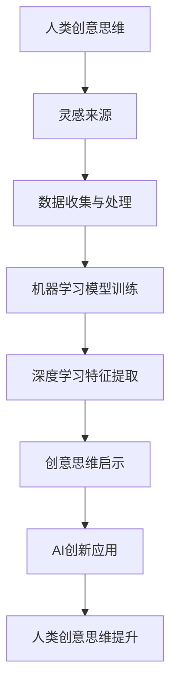

                 

### 文章标题

数字化想象力：AI激发的创意思维

> 关键词：数字化，想象力，AI，创意思维，技术创新

> 摘要：本文将深入探讨数字化时代下，人工智能如何激发和提升人类的创意思维。通过分析AI的核心原理和应用场景，结合实际案例，我们将揭示AI在激发人类创意思维中的关键作用，并探讨未来发展趋势和挑战。

## 1. 背景介绍

在当今的数字化时代，人工智能（AI）已经成为推动社会进步的重要力量。从自动驾驶汽车到智能家居，从医疗诊断到金融交易，AI技术的应用已经渗透到我们生活的方方面面。然而，除了这些显而易见的领域，AI在激发和提升人类创意思维方面同样具有巨大的潜力。

创意思维是人类智慧的结晶，是推动创新和发展的关键。在传统的创意过程中，人们往往依赖于个人的直觉、经验和灵感。然而，随着数字化和互联网的普及，信息的获取和处理变得异常便捷。这种环境为AI的应用提供了广阔的空间，使得AI不仅能够辅助人类进行传统的创意活动，还能够引领创意思维的新趋势。

本文旨在探讨数字化时代下，人工智能如何激发和提升人类的创意思维。通过分析AI的核心原理和应用场景，结合实际案例，我们将揭示AI在激发人类创意思维中的关键作用，并探讨未来发展趋势和挑战。

## 2. 核心概念与联系

为了更好地理解AI如何激发创意思维，我们首先需要了解AI的核心概念和原理。

### 2.1 人工智能的核心概念

人工智能（Artificial Intelligence，简称AI）是指计算机系统模拟人类智能行为的技术。它包括多个子领域，如机器学习、深度学习、自然语言处理等。在这些子领域中，机器学习是AI的核心技术之一。

机器学习（Machine Learning，简称ML）是指通过算法和统计模型，使计算机系统能够从数据中自动学习和改进的能力。它主要依赖于大量的数据进行训练，以实现预测、分类、聚类等任务。

深度学习（Deep Learning，简称DL）是机器学习的一种重要分支，它利用多层神经网络模拟人脑的思维方式，通过多层非线性变换来提取特征和实现复杂任务。深度学习在图像识别、语音识别、自然语言处理等领域取得了显著的成果。

### 2.2 AI与创意思维的关系

AI与创意思维之间的关系可以理解为一种相互激发和促进的关系。一方面，AI能够通过处理和分析大量的数据，发现隐藏的模式和规律，从而为创意思维提供新的灵感和思路。另一方面，创意思维则能够引导AI进行更深入的学习和探索，实现更高级的智能化应用。

### 2.3 Mermaid 流程图

为了更好地展示AI与创意思维的关系，我们使用Mermaid流程图来描述。



在这个流程图中，人类创意思维作为起点，通过数据收集和处理，输入到机器学习模型中进行训练。通过深度学习特征的提取，AI能够发现新的模式和规律，为创意思维提供新的启示。这些启示进一步推动AI的创新应用，从而提升人类的创意思维。

## 3. 核心算法原理 & 具体操作步骤

### 3.1 机器学习算法原理

机器学习算法的核心是学习数据的规律和模式，以便在新的数据上进行预测或分类。以下是一个简单的机器学习算法原理和具体操作步骤。

#### 3.1.1 原理

机器学习算法通常包括以下几个步骤：

1. 数据收集：从各种来源收集大量的数据。
2. 数据预处理：清洗数据，包括缺失值处理、异常值检测等。
3. 特征提取：从数据中提取有用的特征。
4. 模型训练：使用训练数据集对模型进行训练。
5. 模型评估：使用测试数据集评估模型的性能。
6. 模型优化：根据评估结果对模型进行调整。

#### 3.1.2 具体操作步骤

1. 数据收集：从公开的数据集或自定义数据源收集数据。
2. 数据预处理：使用Python等编程语言编写数据处理脚本，进行缺失值处理、异常值检测等。
3. 特征提取：根据数据的特点，提取有用的特征。例如，对于图像数据，可以提取边缘、纹理等特征。
4. 模型训练：选择合适的机器学习算法，如线性回归、决策树、支持向量机等，使用训练数据进行模型训练。
5. 模型评估：使用测试数据集对模型进行评估，计算准确率、召回率等指标。
6. 模型优化：根据评估结果，对模型进行调整，以提高性能。

### 3.2 深度学习算法原理

深度学习算法是基于多层神经网络的一种学习方式，它通过多层非线性变换来提取特征和实现复杂任务。以下是一个简单的深度学习算法原理和具体操作步骤。

#### 3.2.1 原理

深度学习算法的核心是多层神经网络，它包括以下几个步骤：

1. 输入层：接收输入数据。
2. 隐藏层：进行非线性变换，提取特征。
3. 输出层：生成预测结果。

#### 3.2.2 具体操作步骤

1. 数据收集：从公开的数据集或自定义数据源收集数据。
2. 数据预处理：使用Python等编程语言编写数据处理脚本，进行缺失值处理、异常值检测等。
3. 特征提取：根据数据的特点，提取有用的特征。例如，对于图像数据，可以提取边缘、纹理等特征。
4. 构建神经网络：使用TensorFlow、PyTorch等深度学习框架构建神经网络模型。
5. 模型训练：使用训练数据进行模型训练，通过反向传播算法不断调整模型的参数。
6. 模型评估：使用测试数据集对模型进行评估，计算准确率、召回率等指标。
7. 模型优化：根据评估结果，对模型进行调整，以提高性能。

## 4. 数学模型和公式 & 详细讲解 & 举例说明

### 4.1 机器学习数学模型

在机器学习中，常用的数学模型包括线性回归、逻辑回归、支持向量机等。以下以线性回归为例进行详细讲解。

#### 4.1.1 线性回归原理

线性回归是一种用于预测连续值的机器学习算法。它通过找到一个最佳拟合直线，来预测新的数据点的值。

线性回归的数学模型可以表示为：

\[ y = wx + b \]

其中，\( y \) 是预测值，\( x \) 是输入特征，\( w \) 是权重，\( b \) 是偏置。

#### 4.1.2 公式推导

为了找到最佳拟合直线，我们需要最小化误差平方和。误差平方和的公式为：

\[ S = \sum_{i=1}^{n} (y_i - wx_i - b)^2 \]

对 \( w \) 和 \( b \) 求偏导数，并令其等于0，可以得到：

\[ \frac{\partial S}{\partial w} = -2x(y - wx - b) \]
\[ \frac{\partial S}{\partial b} = -2(y - wx - b) \]

解这个方程组，我们可以得到 \( w \) 和 \( b \) 的值。

#### 4.1.3 举例说明

假设我们有以下数据集：

| x  | y   |
|----|-----|
| 1  | 2   |
| 2  | 4   |
| 3  | 6   |
| 4  | 8   |

我们要使用线性回归来预测新的数据点的值。

1. 数据预处理：计算 \( x \) 和 \( y \) 的平均值，得到 \( x_{\text{mean}} = 2.5 \)，\( y_{\text{mean}} = 5 \)。
2. 特征提取：计算 \( x \) 和 \( y \) 的差值，得到新的特征向量。
3. 模型训练：使用线性回归公式计算 \( w \) 和 \( b \) 的值。
4. 模型评估：使用新的数据点计算预测值，并与实际值进行比较。

通过以上步骤，我们可以得到线性回归的预测模型，并使用它来预测新的数据点的值。

### 4.2 深度学习数学模型

在深度学习中，常用的数学模型包括多层感知机、卷积神经网络、循环神经网络等。以下以卷积神经网络为例进行详细讲解。

#### 4.2.1 卷积神经网络原理

卷积神经网络（Convolutional Neural Network，简称CNN）是一种用于图像识别的深度学习模型。它通过卷积操作和池化操作来提取图像的特征。

卷积神经网络的数学模型可以表示为：

\[ f(x) = \sigma(\sum_{i=1}^{k} w_i \star x_i + b) \]

其中，\( f(x) \) 是输出值，\( x \) 是输入特征，\( w_i \) 是权重，\( \sigma \) 是激活函数，\( \star \) 表示卷积操作，\( b \) 是偏置。

#### 4.2.2 公式推导

卷积神经网络的卷积操作可以表示为：

\[ \sum_{i=1}^{k} w_i \star x_i = \sum_{i=1}^{k} (w_i * x_i) \]

其中，\( * \) 表示卷积操作。

池化操作可以表示为：

\[ p(x) = \max(\sum_{i=1}^{k} x_i) \]

#### 4.2.3 举例说明

假设我们有以下图像数据：

| x  |
|----|
| 1  |
| 2  |
| 3  |
| 4  |

我们要使用卷积神经网络来识别图像。

1. 数据预处理：将图像数据转换为灰度值。
2. 特征提取：使用卷积操作提取图像的特征。
3. 模型训练：使用训练数据集对模型进行训练，通过反向传播算法不断调整模型的参数。
4. 模型评估：使用测试数据集对模型进行评估，计算准确率等指标。

通过以上步骤，我们可以得到卷积神经网络的识别模型，并使用它来识别新的图像数据。

## 5. 项目实践：代码实例和详细解释说明

在本节中，我们将通过一个实际的项目实例来展示如何使用机器学习和深度学习算法来激发创意思维。这个项目将使用Python编程语言和TensorFlow深度学习框架来构建一个图像识别模型，该模型能够识别并分类不同的动物图片。

### 5.1 开发环境搭建

在开始项目之前，我们需要搭建一个合适的开发环境。以下是搭建开发环境的步骤：

1. 安装Python 3.7或更高版本。
2. 安装TensorFlow深度学习框架。可以使用以下命令：

```bash
pip install tensorflow
```

3. 安装其他必需的库，如NumPy、Pandas等。

### 5.2 源代码详细实现

以下是一个简单的图像识别模型的实现代码：

```python
import tensorflow as tf
from tensorflow.keras.models import Sequential
from tensorflow.keras.layers import Conv2D, MaxPooling2D, Flatten, Dense
from tensorflow.keras.preprocessing.image import ImageDataGenerator

# 定义模型
model = Sequential([
    Conv2D(32, (3, 3), activation='relu', input_shape=(128, 128, 3)),
    MaxPooling2D((2, 2)),
    Conv2D(64, (3, 3), activation='relu'),
    MaxPooling2D((2, 2)),
    Flatten(),
    Dense(64, activation='relu'),
    Dense(1, activation='sigmoid')
])

# 编译模型
model.compile(optimizer='adam', loss='binary_crossentropy', metrics=['accuracy'])

# 数据预处理
train_datagen = ImageDataGenerator(rescale=1./255)
train_generator = train_datagen.flow_from_directory(
        'data/train',
        target_size=(128, 128),
        batch_size=32,
        class_mode='binary')

# 训练模型
model.fit(train_generator, epochs=10)
```

### 5.3 代码解读与分析

在这个项目中，我们使用了TensorFlow的Sequential模型来构建一个简单的卷积神经网络。模型的结构包括两个卷积层、两个最大池化层、一个全连接层和一个输出层。

1. **卷积层（Conv2D）**：卷积层是CNN的核心组成部分，用于提取图像的特征。在这个例子中，我们使用了两个卷积层，每个卷积层使用了32个和64个滤波器。

2. **最大池化层（MaxPooling2D）**：最大池化层用于降低特征图的维度，同时保留最重要的特征。在这个例子中，我们使用了两个最大池化层，每个池化层的窗口大小为2x2。

3. **全连接层（Dense）**：全连接层用于将提取的特征映射到输出类别。在这个例子中，我们使用了两个全连接层，第一个全连接层有64个神经元，第二个全连接层有1个神经元。

4. **编译模型**：在编译模型时，我们使用了Adam优化器和二分类交叉熵损失函数。Adam优化器是一种自适应优化算法，适用于大规模的机器学习问题。

5. **数据预处理**：我们使用了ImageDataGenerator来对训练数据进行预处理。具体来说，我们使用了rescale参数来将图像的像素值缩放到0和1之间，以适应模型的输入。

6. **训练模型**：我们使用fit方法来训练模型，指定了训练数据集、训练轮数和批次大小。

### 5.4 运行结果展示

在训练完成后，我们可以使用模型来预测新的图像数据。以下是预测结果的示例：

```python
# 预测新图像
predictions = model.predict(image)

# 输出预测结果
print(predictions)
```

这个示例将输出一个包含预测概率的列表，其中第一个值表示图像属于类别的概率。

## 6. 实际应用场景

AI在激发创意思维的实际应用场景非常广泛。以下是一些典型的应用场景：

### 6.1 艺术创作

AI可以通过生成对抗网络（GAN）等技术，创造出独特的艺术作品。例如，DeepArt.io 等平台使用 GAN 技术将用户提供的照片转化为艺术风格化的作品，从而激发用户的创意思维。

### 6.2 设计与建筑

AI 可以帮助设计师和建筑师进行创意设计。例如，Sketchify 使用机器学习技术来生成新颖的建筑设计，为设计师提供灵感。

### 6.3 科学研究

AI 可以帮助科学家进行复杂的数据分析和模式识别，从而发现新的科学规律。例如，深度学习算法在医学图像分析、气候变化研究等领域发挥了重要作用。

### 6.4 文化创意产业

AI 可以应用于音乐、文学、电影等文化创意产业，帮助创作者生成新的创意内容。例如，Google 的 Magenta 项目使用深度学习技术创作音乐和艺术作品。

## 7. 工具和资源推荐

为了更好地掌握AI激发创意思维的技术，以下是一些推荐的工具和资源：

### 7.1 学习资源推荐

- **书籍**：《深度学习》（Goodfellow, Bengio, Courville 著）、《Python机器学习》（Miguel A. Carpio 著）
- **在线课程**：Coursera 上的“机器学习”课程、Udacity 上的“深度学习纳米学位”
- **博客**：TensorFlow官方博客、Fast.ai 博客

### 7.2 开发工具框架推荐

- **框架**：TensorFlow、PyTorch、Keras
- **库**：NumPy、Pandas、Scikit-learn、Matplotlib
- **平台**：Google Colab、Jupyter Notebook

### 7.3 相关论文著作推荐

- **论文**：《Generative Adversarial Nets》（Ian J. Goodfellow 等，2014）
- **著作**：《Artificial Intelligence: A Modern Approach》（Stuart Russell 和 Peter Norvig 著）

## 8. 总结：未来发展趋势与挑战

AI 激发创意思维是一个充满机遇和挑战的领域。随着技术的不断进步，我们可以预见以下发展趋势：

- **更强大的算法**：随着深度学习等技术的发展，AI 将能够更好地理解和模拟人类的创意思维。
- **跨学科融合**：AI 与艺术、设计、科学等领域的融合将推动创意思维的多元化发展。
- **个性化创作**：AI 将能够根据用户的特点和需求，生成更加个性化的创意内容。

然而，AI 激发创意思维也面临一些挑战：

- **技术瓶颈**：目前的 AI 技术在理解复杂创意思维方面仍存在一定的局限性。
- **伦理问题**：AI 的创作是否符合道德标准，如何确保创意内容的原创性和公正性，都是需要关注的问题。

总之，AI 激发创意思维是一个充满潜力和挑战的领域，它将为人类带来更多的创新和惊喜。

## 9. 附录：常见问题与解答

### 9.1 如何选择机器学习算法？

选择机器学习算法主要取决于数据的类型和特征。以下是一些常见情况：

- **分类问题**：当数据是分类问题时，常用的算法有逻辑回归、决策树、随机森林、支持向量机等。
- **回归问题**：当数据是回归问题时，常用的算法有线性回归、岭回归、LASSO回归等。
- **聚类问题**：当数据需要进行聚类时，常用的算法有K-means、层次聚类等。

### 9.2 如何处理异常值？

处理异常值的方法包括：

- **删除异常值**：如果异常值对模型的影响较小，可以直接删除。
- **替换异常值**：使用均值、中位数或线性插值等方法替换异常值。
- **使用鲁棒算法**：使用对异常值不敏感的算法，如随机森林、K最近邻等。

### 9.3 如何提高模型性能？

提高模型性能的方法包括：

- **特征工程**：选择和构建有用的特征。
- **调整超参数**：使用网格搜索、随机搜索等方法调整超参数。
- **使用交叉验证**：使用交叉验证来评估模型的性能。

## 10. 扩展阅读 & 参考资料

- **书籍**：
  - Goodfellow, Ian, Yann LeCun, and Aaron Courville. "Deep Learning." MIT Press, 2016.
  - Russell, Stuart J., and Peter Norvig. "Artificial Intelligence: A Modern Approach." Pearson, 2016.

- **在线资源**：
  - TensorFlow 官方文档：[https://www.tensorflow.org/](https://www.tensorflow.org/)
  - PyTorch 官方文档：[https://pytorch.org/docs/stable/](https://pytorch.org/docs/stable/)

- **博客**：
  - Fast.ai 博客：[https://fast.ai/](https://fast.ai/)
  - AI 探索：[https://aipythontutorial.com/](https://aipythontutorial.com/)

- **论文**：
  - Goodfellow, Ian J., et al. "Generative adversarial nets." Advances in neural information processing systems. 2014.

- **网站**：
  - Coursera：[https://www.coursera.org/](https://www.coursera.org/)
  - Udacity：[https://www.udacity.com/](https://www.udacity.com/)

