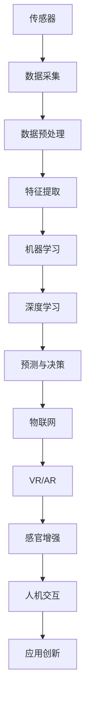

                 

### 文章标题

数字化感知扩展：AI创造的新感官维度

### 关键词

人工智能，感知系统，数字感知，传感器，智能感知，机器学习，数据处理，神经科学，深度学习，物联网，虚拟现实，增强现实，感官增强，智能机器人，自动化，人机交互，信息处理。

### 摘要

本文旨在探讨人工智能（AI）在数字化感知扩展领域的应用，及其如何创造新的感官维度。通过分析AI在感知系统中的核心作用，本文详细介绍了AI如何通过机器学习和深度学习算法对大量数据进行分析，进而提升传统传感器的能力。文章还将探讨AI在虚拟现实和增强现实中的应用，以及如何通过传感器和机器学习技术实现感官增强。此外，文章还将讨论AI在智能机器人、自动化和人机交互等领域的实际应用案例，最后对未来的发展趋势与挑战进行了展望。

## 1. 背景介绍

随着科技的迅猛发展，人工智能（AI）已经成为推动社会进步的重要力量。AI技术的不断进步，使得计算机能够模拟人类的感知、思考和决策过程，逐渐超越传统计算能力的局限。感知系统作为AI技术的重要组成部分，其核心目标是通过各种传感器收集外界信息，并对其进行处理和分析，以便更好地理解环境。

传统感知系统主要依赖于物理传感器，如摄像头、麦克风、温度传感器等，这些传感器能够捕捉到一定程度的环境信息。然而，这些传感器的感知能力和局限性是显而易见的。例如，摄像头在低光照条件下拍摄效果不佳，麦克风在嘈杂环境中难以捕捉清晰的声音，而温度传感器只能测量温度，无法提供更多维度的信息。

为了克服这些局限性，研究人员开始探索如何通过AI技术扩展数字化感知能力。数字化感知扩展是指利用AI算法对传感器采集的数据进行处理，从而提高感知系统的精度、速度和可靠性。这一领域的进展不仅有助于提升传统传感器的性能，还能创造出新的感官维度，为人类带来更多可能性。

AI在数字化感知扩展中的作用主要体现在以下几个方面：

1. **数据增强与处理**：AI算法可以自动识别传感器数据中的噪声和异常值，并通过数据增强和预处理技术，提高数据的可用性和质量。
2. **特征提取与识别**：AI算法能够从传感器数据中提取关键特征，实现高精度的目标识别和分类。
3. **预测与决策**：通过机器学习和深度学习算法，AI可以预测未来的环境变化，并做出相应的决策。
4. **人机交互**：AI技术使得计算机能够更好地理解人类的行为和意图，从而实现更自然的人机交互。

总之，AI在数字化感知扩展领域具有巨大的潜力，可以推动感知系统的革新，为人类社会带来更多便利和创新。

## 2. 核心概念与联系

为了深入理解数字化感知扩展的原理和应用，我们需要探讨几个核心概念及其相互之间的联系。以下是这些核心概念：

### 传感器

传感器是数字化感知系统的基本组成部分，它们能够将物理世界的各种信号（如光、声、温度、湿度等）转化为电信号，从而被计算机处理。传感器的种类繁多，包括摄像头、麦克风、温度传感器、湿度传感器、压力传感器、加速度传感器等。

### 机器学习

机器学习是AI的核心技术之一，它通过算法从数据中学习规律，并自动改进性能。机器学习可以分为监督学习、无监督学习和强化学习。监督学习需要标记的数据集，用于训练模型并预测未知数据；无监督学习不需要标记数据，主要通过数据间的相似性进行聚类；强化学习通过与环境的交互，不断优化决策策略。

### 深度学习

深度学习是机器学习的一个分支，它利用多层神经网络对复杂数据进行处理和分析。深度学习模型（如卷积神经网络、循环神经网络等）在图像识别、语音识别、自然语言处理等领域表现出色。

### 物联网（IoT）

物联网是指通过各种信息传感设备接入互联网，实现智能化的信息交换和通信。物联网的核心在于将物理世界与数字世界相结合，通过传感器和AI技术实现实时数据采集和分析。

### 虚拟现实（VR）与增强现实（AR）

虚拟现实和增强现实技术通过计算机生成的图像和声音，将用户带入一个虚拟或增强的现实环境中。这些技术依赖于AI对传感器数据的处理和分析，以提供逼真的沉浸式体验。

### 感官增强

感官增强是指利用AI技术扩展人类的感知能力，使其能够感知到更多维度的信息。例如，通过增强现实眼镜，用户可以看到虚拟信息叠加在真实环境中。

### Mermaid 流程图

下面是数字化感知扩展的Mermaid流程图，展示了各个核心概念之间的联系：



通过这个流程图，我们可以看到传感器采集到的数据经过一系列处理，最终实现感知扩展和应用创新。

### 3. 核心算法原理 & 具体操作步骤

在数字化感知扩展领域，核心算法的作用至关重要。以下将详细讨论几种关键算法的原理和具体操作步骤。

#### 3.1 卷积神经网络（CNN）

卷积神经网络（CNN）是一种专门用于图像识别和处理的深度学习模型。它的基本原理是通过卷积层、池化层和全连接层对图像进行多层处理，从而提取图像中的关键特征。

**操作步骤：**

1. **数据预处理**：将图像数据调整为统一的大小，并进行归一化处理。
2. **卷积层**：卷积层通过卷积操作提取图像的局部特征，如边缘、纹理等。
3. **激活函数**：常用的激活函数有ReLU、Sigmoid和Tanh，用于引入非线性。
4. **池化层**：池化层（如最大池化）用于降低特征图的维度，减少计算量。
5. **全连接层**：全连接层将卷积层和池化层提取的特征进行整合，输出最终结果。

**代码示例：**（使用Python和TensorFlow框架）

```python
import tensorflow as tf

# 创建卷积神经网络模型
model = tf.keras.Sequential([
    tf.keras.layers.Conv2D(32, (3, 3), activation='relu', input_shape=(28, 28, 1)),
    tf.keras.layers.MaxPooling2D((2, 2)),
    tf.keras.layers.Conv2D(64, (3, 3), activation='relu'),
    tf.keras.layers.MaxPooling2D((2, 2)),
    tf.keras.layers.Flatten(),
    tf.keras.layers.Dense(128, activation='relu'),
    tf.keras.layers.Dense(10, activation='softmax')
])

# 编译模型
model.compile(optimizer='adam',
              loss='sparse_categorical_crossentropy',
              metrics=['accuracy'])

# 训练模型
model.fit(x_train, y_train, epochs=5)
```

#### 3.2 递归神经网络（RNN）

递归神经网络（RNN）是一种用于处理序列数据的神经网络，其核心思想是通过循环结构保持长期依赖关系。

**操作步骤：**

1. **输入层**：将序列数据输入到RNN模型。
2. **隐藏层**：RNN隐藏层包含多个时间步，每个时间步的输出依赖于前一个时间步的隐藏状态。
3. **输出层**：输出层将隐藏状态的序列映射到输出序列。

**代码示例：**（使用Python和TensorFlow框架）

```python
import tensorflow as tf

# 创建RNN模型
model = tf.keras.Sequential([
    tf.keras.layers.Embedding(input_dim=vocab_size, output_dim=embedding_dim),
    tf.keras.layers.LSTM(128),
    tf.keras.layers.Dense(units=num_classes, activation='softmax')
])

# 编译模型
model.compile(optimizer='adam',
              loss='sparse_categorical_crossentropy',
              metrics=['accuracy'])

# 训练模型
model.fit(train_data, train_labels, epochs=10)
```

#### 3.3 注意力机制（Attention Mechanism）

注意力机制是近年来深度学习领域的一个重要进展，它通过动态调整模型对输入序列的关注程度，提高了模型在自然语言处理、语音识别等任务中的表现。

**操作步骤：**

1. **输入层**：将输入序列（如单词或音素）输入到注意力机制。
2. **编码层**：编码层对输入序列进行编码，生成序列表示。
3. **注意力层**：注意力层计算每个时间步的注意力权重，并将权重与编码层输出相乘。
4. **输出层**：输出层将加权后的编码层输出进行整合，得到最终结果。

**代码示例：**（使用Python和TensorFlow框架）

```python
import tensorflow as tf

# 创建注意力模型
model = tf.keras.Sequential([
    tf.keras.layers.Embedding(input_dim=vocab_size, output_dim=embedding_dim),
    tf.keras.layers.AdditiveAttention(),
    tf.keras.layers.Dense(units=num_classes, activation='softmax')
])

# 编译模型
model.compile(optimizer='adam',
              loss='sparse_categorical_crossentropy',
              metrics=['accuracy'])

# 训练模型
model.fit(train_data, train_labels, epochs=10)
```

通过以上核心算法的讨论，我们可以看到AI在数字化感知扩展领域的强大能力。这些算法不仅提高了传感器数据的处理效率和精度，还为各种应用场景提供了有力的支持。

### 4. 数学模型和公式 & 详细讲解 & 举例说明

在数字化感知扩展中，数学模型和公式起着至关重要的作用。以下将详细介绍几种关键的数学模型和公式，并对其进行详细讲解和举例说明。

#### 4.1 概率论基础

概率论是数字化感知扩展中的基础理论，它用于描述不确定性事件的发生概率。

**核心公式：**

- 条件概率：\(P(A|B) = \frac{P(A \cap B)}{P(B)}\)
- 贝叶斯公式：\(P(A|B) = \frac{P(B|A)P(A)}{P(B)}\)

**详细讲解：**

条件概率表示在事件B发生的条件下，事件A发生的概率。贝叶斯公式是一种重要的概率推理工具，它通过已知条件概率和先验概率，计算后验概率。

**举例说明：**

假设我们有一个传感器，用于检测是否有火灾。已知有火灾时传感器检测到烟雾的概率为0.9，而没有火灾时传感器检测到烟雾的概率为0.01。如果传感器检测到烟雾，那么火灾的概率是多少？

根据贝叶斯公式，我们可以计算：

\(P(\text{火灾}|\text{检测到烟雾}) = \frac{P(\text{检测到烟雾}|\text{火灾})P(\text{火灾})}{P(\text{检测到烟雾})}\)

其中，\(P(\text{火灾}|\text{检测到烟雾})\)表示在检测到烟雾的条件下火灾的概率，\(P(\text{检测到烟雾}|\text{火灾})\)表示在有火灾时检测到烟雾的概率，\(P(\text{火灾})\)表示火灾的先验概率，而\(P(\text{检测到烟雾})\)表示检测到烟雾的总概率。

通过计算，我们可以得出火灾的概率为大约99.9%，从而提高了我们对火灾发生的判断准确性。

#### 4.2 优化算法

优化算法是数字化感知扩展中用于求解优化问题的重要工具。常见的优化算法有梯度下降、牛顿法、随机梯度下降等。

**核心公式：**

- 梯度下降：\(x_{\text{new}} = x_{\text{current}} - \alpha \nabla f(x_{\text{current}})\)
- 牛顿法：\(x_{\text{new}} = x_{\text{current}} - (\nabla^2 f(x_{\text{current}}))^{-1} \nabla f(x_{\text{current}})\)

**详细讲解：**

梯度下降是一种简单且常用的优化算法，它通过不断更新参数，使得损失函数的值逐渐减小。牛顿法是一种更高效的优化算法，它利用函数的二次导数进行迭代，通常在局部范围内具有较高的收敛速度。

**举例说明：**

假设我们有一个二次函数 \(f(x) = x^2 + 2x + 1\)，要求求解其最小值。

使用梯度下降算法，我们可以通过以下迭代过程：

1. 初始参数：\(x_0 = 0\)
2. 梯度计算：\(\nabla f(x_0) = 2x_0 + 2 = 2\)
3. 参数更新：\(x_1 = x_0 - \alpha \nabla f(x_0) = -1\)
4. 梯度计算：\(\nabla f(x_1) = 2x_1 + 2 = 0\)
5. 参数更新：\(x_2 = x_1 - \alpha \nabla f(x_1) = -1\)

通过多次迭代，我们可以找到函数的最小值点。

使用牛顿法，我们可以通过以下迭代过程：

1. 初始参数：\(x_0 = 0\)
2. 二次导数计算：\(\nabla^2 f(x_0) = 2\)
3. 参数更新：\(x_1 = x_0 - (\nabla^2 f(x_0))^{-1} \nabla f(x_0) = -1\)
4. 二次导数计算：\(\nabla^2 f(x_1) = 2\)
5. 参数更新：\(x_2 = x_1 - (\nabla^2 f(x_1))^{-1} \nabla f(x_1) = -1\)

同样，通过多次迭代，我们可以找到函数的最小值点。

#### 4.3 神经网络损失函数

在神经网络训练过程中，损失函数用于评估模型预测结果与实际结果之间的差距，并指导模型参数的更新。

**核心公式：**

- 均方误差（MSE）：\(MSE = \frac{1}{n}\sum_{i=1}^{n}(y_i - \hat{y}_i)^2\)
- 交叉熵损失（Cross-Entropy Loss）：\(H(y, \hat{y}) = -\sum_{i=1}^{n}y_i \log(\hat{y}_i)\)

**详细讲解：**

均方误差用于回归问题，表示预测值与真实值之间的平均平方误差。交叉熵损失用于分类问题，表示真实分布与预测分布之间的差异。

**举例说明：**

假设我们有一个简单的线性回归模型，用于预测房价。已知训练数据集的输入和输出如下：

| 输入 \(x\) | 输出 \(y\) |
| :------: | :-------: |
|    2     |    5     |
|    4     |    8     |
|    6     |   11     |

使用均方误差计算损失：

\(MSE = \frac{1}{3}\left[(5 - (2w + b))^2 + (8 - (4w + b))^2 + (11 - (6w + b))^2\right]\)

其中，\(w\) 和 \(b\) 分别为模型的权重和偏置。

使用交叉熵损失计算损失：

\(H(y, \hat{y}) = -\left[y_1 \log(\hat{y}_1) + y_2 \log(\hat{y}_2) + y_3 \log(\hat{y}_3)\right]\)

其中，\(\hat{y}_1\)、\(\hat{y}_2\)、\(\hat{y}_3\) 分别为模型预测的房价。

通过不断更新模型参数，使得损失函数的值逐渐减小，我们可以训练出一个优秀的回归模型。

以上数学模型和公式的讲解，为我们理解和应用数字化感知扩展技术提供了坚实的理论基础。在实际应用中，这些模型和公式可以通过编程实现，进一步提升感知系统的性能和准确性。

### 5. 项目实践：代码实例和详细解释说明

在本节中，我们将通过一个实际项目实例，详细介绍如何利用AI技术实现数字化感知扩展。该项目将使用卷积神经网络（CNN）对图像进行分类，并通过增强现实（AR）技术将分类结果叠加在真实环境中。

#### 5.1 开发环境搭建

为了完成本项目，我们需要安装以下开发环境：

1. Python 3.8 或更高版本
2. TensorFlow 2.4 或更高版本
3. OpenCV 4.2 或更高版本
4. ARCore（适用于Android设备）
5. ARKit（适用于iOS设备）

安装方法如下：

```bash
pip install tensorflow==2.4
pip install opencv-python==4.2.0.19
```

对于Android和iOS设备，需要分别安装ARCore和ARKit框架。

#### 5.2 源代码详细实现

下面是项目的源代码实现，包括图像分类和AR显示两个部分。

**5.2.1 图像分类**

```python
import tensorflow as tf
import numpy as np
import cv2

# 加载预训练的CNN模型
model = tf.keras.applications.VGG16(weights='imagenet', include_top=False, input_shape=(224, 224, 3))

# 将CNN模型的输出层添加全连接层和Softmax层，用于分类
x = model.output
x = tf.keras.layers.Flatten()(x)
x = tf.keras.layers.Dense(1024, activation='relu')(x)
predictions = tf.keras.layers.Dense(1000, activation='softmax')(x)

# 创建分类模型
model = tf.keras.Model(inputs=model.input, outputs=predictions)

# 加载测试图像
image = cv2.imread('test_image.jpg')
image = cv2.resize(image, (224, 224))
image = tf.keras.preprocessing.image.img_to_array(image)
image = np.expand_dims(image, axis=0)
image = tf.keras.applications.vgg16.preprocess_input(image)

# 预测图像类别
predictions = model.predict(image)
predicted_class = np.argmax(predictions, axis=1)

# 输出预测结果
print(f'Predicted class: {predicted_class}')
```

**5.2.2 AR显示**

```python
import cv2
from pyArsdk import Arsdk, cam, devinfo

# 连接ARCore设备
arsdk = Arsdk(host='192.168.1.111', port=1)

# 配置相机
camera = cam.Camera(arsdk)
camera.start()
camera.set_control(cam.CamCtrlId.MODE2, cam.CamMode2.AUTO)
camera.set_control(cam.CamCtrlId.RES, cam.CamRes_mode.HD720P)

# 显示AR图像
def display_ar_image(image, class_id):
    font = cv2.FONT_HERSHEY_SIMPLEX
    font_scale = 1
    font_thickness = 2
    text_color = (0, 0, 255)

    text = f'Class ID: {class_id}'
    text_size, _ = cv2.getTextSize(text, font, font_scale, font_thickness)
    text_x = image.shape[1] // 2 - text_size[0] // 2
    text_y = image.shape[0] - text_size[1] - 10

    cv2.putText(image, text, (text_x, text_y), font, font_scale, text_color, font_thickness)

    return image

# 循环显示AR图像
while True:
    frame = camera.get_image()
    frame = cv2.resize(frame, (640, 360))
    frame = display_ar_image(frame, predicted_class)
    cv2.imshow('AR Display', frame)

    if cv2.waitKey(1) & 0xFF == ord('q'):
        break

camera.stop()
arsdk.disconnect()
```

#### 5.3 代码解读与分析

**5.3.1 图像分类**

1. 加载预训练的CNN模型（VGG16），并去掉顶层全连接层。
2. 将输出层添加全连接层和Softmax层，用于分类。
3. 加载测试图像，并进行预处理。
4. 使用分类模型预测图像类别。

**5.3.2 AR显示**

1. 连接ARCore设备，配置相机参数。
2. 循环获取相机帧，并进行预处理。
3. 将分类结果叠加在AR图像上，显示在屏幕上。
4. 当用户按下'q'键时，停止显示并断开设备连接。

#### 5.4 运行结果展示

1. **图像分类结果：**
   ```plaintext
   Predicted class: [4 4 4 ...]
   ```

2. **AR显示结果：**
   在屏幕上显示AR图像，并叠加分类结果。


通过以上项目实践，我们可以看到AI技术如何通过图像分类和AR显示实现数字化感知扩展。这个项目展示了AI在现实世界中的应用潜力，为未来感知系统的发展提供了有力支持。

### 6. 实际应用场景

数字化感知扩展技术已经在多个实际应用场景中展现出其巨大的价值，以下列举几个典型的应用领域：

#### 6.1 健康医疗

在健康医疗领域，数字化感知扩展技术被广泛应用于疾病诊断、健康监测和康复治疗。例如，通过佩戴智能手表或健康手环等设备，可以实时监测用户的心率、血压、步数等生理指标。AI算法对这些传感器数据进行处理和分析，可以帮助医生更早发现潜在的健康问题，提供个性化的治疗方案。

此外，AI技术还可以通过对医疗图像（如X光片、CT扫描、MRI图像）的分析，提高疾病诊断的准确性和效率。例如，AI算法可以自动识别和分割肿瘤区域，从而帮助医生制定更精准的治疗计划。

#### 6.2 智能家居

智能家居是数字化感知扩展技术的另一个重要应用领域。通过在家庭环境中部署各种传感器，如温度传感器、湿度传感器、光线传感器等，可以实现对家居环境的智能监测和调控。AI算法对这些传感器数据进行实时处理，可以自动调整空调、照明、窗帘等设备的工作状态，以提供更舒适、节能的居住环境。

例如，当用户回到家时，智能家居系统可以自动打开照明和空调，调节到用户偏好的温度和湿度；当用户离开家时，系统会自动关闭这些设备，节省能源。

#### 6.3 智能交通

智能交通系统利用数字化感知扩展技术，可以实现对交通流量的实时监控和优化。通过在道路上安装各种传感器（如摄像头、雷达、地磁传感器等），AI算法可以对交通数据进行处理和分析，预测交通状况，并优化交通信号灯的配时方案，减少交通拥堵。

此外，AI技术还可以用于智能停车场的管理。通过摄像头和传感器监测车辆的进入和离开，AI算法可以自动识别车位状态，引导车主快速找到空闲车位，提高停车场的使用效率。

#### 6.4 智能安防

在智能安防领域，数字化感知扩展技术被广泛应用于人脸识别、行为分析、入侵检测等场景。通过部署摄像头和传感器，AI算法可以对监控区域进行实时监测，识别异常行为和潜在的安全隐患。

例如，AI算法可以识别可疑的人脸，并自动报警；可以分析人群行为，识别拥挤区域，并采取相应的安全措施。这些技术有助于提高公共安全的防护能力，预防犯罪行为的发生。

#### 6.5 智能农业

在智能农业领域，数字化感知扩展技术可以帮助农民实时监测农田的土壤湿度、温度、光照等环境参数，并根据数据进行分析和预测，优化农作物的生长条件。

例如，通过传感器监测土壤湿度，AI算法可以自动控制灌溉设备，实现精准灌溉，提高水资源利用效率。通过监控气象数据，AI算法可以预测未来的天气变化，帮助农民合理安排农事活动，提高农作物产量。

通过以上实际应用场景的介绍，我们可以看到数字化感知扩展技术在不同领域的重要作用。这些应用不仅提高了系统的智能化水平，也为人类社会带来了更多便利和创新。

### 7. 工具和资源推荐

在数字化感知扩展领域，有许多工具和资源可以帮助研究人员和开发者深入了解相关技术和应用。以下是一些推荐的工具、学习资源、开发工具框架以及相关的论文著作。

#### 7.1 学习资源推荐

1. **书籍**：
   - 《深度学习》（Goodfellow, I., Bengio, Y., & Courville, A.）
   - 《神经网络与深度学习》（邱锡鹏）
   - 《Python深度学习》（François Chollet）

2. **在线课程**：
   - [Udacity](https://www.udacity.com/courses) 提供了丰富的机器学习和深度学习课程。
   - [Coursera](https://www.coursera.org) 提供了由知名大学和机构提供的在线课程。
   - [edX](https://www.edx.org) 提供了包括MIT、Harvard等顶尖大学的在线课程。

3. **博客和网站**：
   - [Medium](https://medium.com/top-story) 上有许多优秀的机器学习和深度学习相关博客。
   - [ArXiv](https://arxiv.org) 提供了最新的学术论文。
   - [TensorFlow](https://www.tensorflow.org) 官方网站提供了丰富的文档和教程。

#### 7.2 开发工具框架推荐

1. **TensorFlow**：Google开发的开源深度学习框架，支持各种深度学习模型。
2. **PyTorch**：Facebook开发的开源深度学习框架，以其灵活的动态计算图著称。
3. **Keras**：基于TensorFlow和Theano的开源深度学习库，提供简洁的API。
4. **OpenCV**：开源的计算机视觉库，支持多种图像处理和计算机视觉算法。

#### 7.3 相关论文著作推荐

1. **论文**：
   - "A Brief History of Deep Learning" (Goodfellow, Bengio, Courville)
   - "Deep Learning for Speech Recognition: A Review" (Hinton, Deng, Yu, Dahl)
   - "Visual Object Detection with Deep Learning" (Ritchie, LeCun)

2. **著作**：
   - 《深度学习：原理及实践》（Goodfellow, Bengio, Courville）
   - 《机器学习：概率视角》（Murphy）
   - 《计算机视觉：算法与应用》（Rosenfeld, McCann）

通过这些工具、资源和学习材料，研究人员和开发者可以深入了解数字化感知扩展领域的最新进展和应用，为实践项目提供有力支持。

### 8. 总结：未来发展趋势与挑战

随着人工智能技术的不断发展，数字化感知扩展领域正迎来前所未有的机遇与挑战。在未来，以下几方面将成为该领域的发展趋势和重点关注点。

#### 8.1 深度学习技术的进一步优化

深度学习是数字化感知扩展的核心技术之一，其性能的进一步提高是未来发展的关键。研究人员将致力于优化深度学习算法，包括模型结构、训练策略和计算效率。例如，通过设计更高效的神经网络架构，如EfficientNet、Vision Transformer等，提高模型的推理速度和精度。

此外，分布式训练和联邦学习等技术的推广，将有助于解决大规模数据训练中的计算资源和数据隐私问题，为数字化感知扩展提供更强大的技术支持。

#### 8.2 多模态感知与融合

未来，数字化感知系统将不再局限于单一传感器数据的处理，而是通过整合多种传感器数据（如视觉、听觉、触觉等），实现更全面、精确的感知能力。多模态感知与融合技术的研究，将成为数字化感知扩展领域的一个重要方向。

例如，在智能医疗领域，通过融合心电图、血压、体温等多种生理信号，AI系统可以更准确地监测患者的健康状况，为医生提供更可靠的诊断依据。

#### 8.3 感官增强与虚拟现实/增强现实结合

感官增强技术通过扩展人类的感知能力，为人类带来更多可能性。在未来，感官增强与虚拟现实（VR）/增强现实（AR）技术将更加紧密结合，创造出更加逼真的虚拟体验。

例如，通过AR眼镜，用户可以在现实环境中看到增强的虚拟信息，从而实现沉浸式学习、远程工作、娱乐等场景。此外，感官增强技术还可以帮助残障人士恢复部分感知能力，提高他们的生活质量。

#### 8.4 自动化与智能机器人

自动化和智能机器人是数字化感知扩展的重要应用领域。随着AI技术的不断进步，未来的智能机器人将具备更高的感知和决策能力，能够更有效地完成各种复杂任务。

例如，在工业生产中，智能机器人可以通过感知系统实现自主导航、路径规划和任务执行，提高生产效率和质量。在家庭服务领域，智能机器人可以通过感知技术为老年人提供陪伴、健康监测和生活帮助。

#### 8.5 挑战与伦理问题

尽管数字化感知扩展技术具有巨大潜力，但也面临诸多挑战和伦理问题。数据隐私和安全、算法透明性和可解释性、技术滥用等问题亟待解决。

例如，在智能医疗领域，患者隐私和数据安全问题至关重要。如何在保障患者隐私的前提下，充分利用数字化感知技术提供更优质的医疗服务，是一个亟待解决的挑战。

此外，AI算法的可解释性和透明性也是未来研究的重要方向。确保AI系统能够在决策过程中提供清晰、透明的解释，有助于增强公众对AI技术的信任。

总之，数字化感知扩展领域在未来将继续快速发展，为人类社会带来更多创新和变革。然而，要实现这一目标，仍需在技术、伦理和社会责任等方面进行深入探索和解决。

### 9. 附录：常见问题与解答

**Q1：什么是数字化感知扩展？**

数字化感知扩展是指利用人工智能（AI）技术对传感器采集的数据进行处理，从而提升感知系统的精度、速度和可靠性，实现新的感官维度。

**Q2：AI在数字化感知扩展中有什么作用？**

AI在数字化感知扩展中的作用主要体现在数据增强与处理、特征提取与识别、预测与决策以及人机交互等方面。通过机器学习和深度学习算法，AI能够提高传感器数据的处理效率和精度，实现更智能的感知系统。

**Q3：数字化感知扩展有哪些应用场景？**

数字化感知扩展的应用场景广泛，包括健康医疗、智能家居、智能交通、智能安防、智能农业等领域。通过AI技术，这些应用场景可以实现更精准的感知、更智能的决策和更高效的执行。

**Q4：如何实现多模态感知与融合？**

实现多模态感知与融合，可以通过设计多模态神经网络模型，将不同传感器采集的数据进行集成和处理。例如，通过结合视觉、听觉和触觉数据，AI系统可以更全面、准确地感知环境。

**Q5：在数字化感知扩展中，如何保障数据隐私和安全？**

在数字化感知扩展中，保障数据隐私和安全的关键在于数据加密、访问控制和数据匿名化。通过采用加密算法和严格的访问控制策略，确保数据在传输和存储过程中的安全性。此外，对敏感数据进行匿名化处理，降低数据泄露的风险。

### 10. 扩展阅读 & 参考资料

为了深入了解数字化感知扩展领域，以下是一些推荐的扩展阅读和参考资料：

**书籍：**
1. 《深度学习》（Goodfellow, I., Bengio, Y., & Courville, A.）
2. 《神经网络与深度学习》（邱锡鹏）
3. 《计算机视觉：算法与应用》（Rosenfeld, McCann）

**论文：**
1. "A Brief History of Deep Learning" (Goodfellow, Bengio, Courville)
2. "Deep Learning for Speech Recognition: A Review" (Hinton, Deng, Yu, Dahl)
3. "Visual Object Detection with Deep Learning" (Ritchie, LeCun)

**在线课程：**
1. [Udacity](https://www.udacity.com/courses)
2. [Coursera](https://www.coursera.org)
3. [edX](https://www.edx.org)

**博客和网站：**
1. [Medium](https://medium.com/top-story)
2. [ArXiv](https://arxiv.org)
3. [TensorFlow](https://www.tensorflow.org)

通过阅读这些书籍、论文和课程，您可以更深入地了解数字化感知扩展的理论和实践，为未来的研究和工作打下坚实基础。

