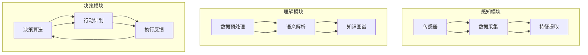

                 

### 背景介绍

随着人工智能技术的不断发展，人类对智能机器的期望越来越高。除了传统的机器视觉、语音识别和自然语言处理等应用场景，人们开始探索更高级的智能形式，比如通过人工智能来开发一种被称为“数字化第六感”的超感知能力。

#### 什么是数字化第六感

数字化第六感是指通过人工智能技术，使机器能够感知、理解和应对复杂环境中的各种信息，从而实现类似于人类的感知和认知能力。这种能力不仅仅局限于传统的数据分析和决策支持，而是更深层次的感知和反应。

#### 数字化第六感的发展历程

数字化第六感的发展可以追溯到20世纪80年代，当时研究者们开始探索如何通过计算机模拟人类大脑的感知机制。随着时间的推移，人工智能技术的进步，特别是深度学习和神经网络的广泛应用，数字化第六感逐渐从理论研究走向实际应用。

#### 数字化第六感的重要性

数字化第六感具有极高的应用价值，它不仅能够提升人工智能系统的智能化水平，还能在多个领域产生深远影响。例如：

- **医疗健康**：通过数字化第六感，机器可以实时监控患者的生理指标，提供个性化的健康建议，甚至预测疾病的发生。
- **智能制造**：数字化第六感可以用于生产线的实时监控和质量控制，提高生产效率和产品品质。
- **交通运输**：自动驾驶技术依赖于数字化第六感，它能够实时感知交通状况，做出最优的驾驶决策。
- **智能家居**：智能家居设备通过数字化第六感，能够理解用户的习惯和需求，提供更加人性化的服务。

#### 本文目的

本文旨在介绍数字化第六感开发包，这是一个集成了多种先进算法和工具的软件包，旨在帮助开发者和研究人员快速构建和部署具有超感知能力的人工智能系统。我们将详细探讨数字化第六感的核心概念、算法原理、数学模型、项目实践和实际应用场景，并推荐相关的学习资源和开发工具。

#### 内容概述

本文将分为以下几个部分：

1. **背景介绍**：简要介绍数字化第六感的定义、发展历程和重要性。
2. **核心概念与联系**：详细阐述数字化第六感的核心概念和架构，并提供Mermaid流程图。
3. **核心算法原理 & 具体操作步骤**：讲解数字化第六感的核心算法，包括感知模块、理解模块和决策模块。
4. **数学模型和公式 & 详细讲解 & 举例说明**：介绍用于实现数字化第六感的数学模型和公式，并通过实例进行说明。
5. **项目实践：代码实例和详细解释说明**：提供完整的代码实例，并详细解释其实现原理。
6. **实际应用场景**：探讨数字化第六感在各个领域的应用。
7. **工具和资源推荐**：推荐学习资源、开发工具和框架。
8. **总结：未来发展趋势与挑战**：总结数字化第六感的发展趋势和面临的挑战。
9. **附录：常见问题与解答**：回答读者可能遇到的问题。
10. **扩展阅读 & 参考资料**：提供进一步阅读的参考资料。

通过本文的阅读，您将了解到数字化第六感的全貌，掌握其核心原理和实现方法，并能够为将来的研究和应用打下坚实的基础。

#### 背景介绍（续）

数字化第六感的实现依赖于一系列核心技术的融合，包括感知、理解和决策。感知模块负责收集环境中的各种信息，如图像、声音和文本等。理解模块则将这些信息进行解析和关联，形成对环境的高层次理解。决策模块基于这种理解，做出相应的行动或决策。

首先，感知模块的实现通常依赖于传感器和信号处理技术。例如，在图像处理领域，可以使用卷积神经网络（CNN）来识别图像中的对象和特征。在语音识别中，可以使用循环神经网络（RNN）或其变种如长短期记忆网络（LSTM）来处理和识别语音信号。文本理解则可以使用自然语言处理（NLP）技术，如词嵌入和序列到序列（Seq2Seq）模型。

理解模块的核心在于将感知到的信息进行语义解析和关联。例如，在图像理解中，可以通过图像标注数据训练模型，使其能够理解图像中的对象、场景和关系。在语音理解中，可以使用语言模型和语音识别算法来将语音信号转化为文本，并理解文本的语义。在文本理解中，可以使用实体识别、关系抽取和文本分类等技术来提取文本中的关键信息。

最后，决策模块基于理解模块提供的信息，做出相应的决策。这可以通过强化学习、决策树、随机森林等机器学习技术来实现。例如，在自动驾驶中，决策模块需要基于对交通状况的理解，做出驾驶决策，如加速、减速或转向。

数字化第六感的实现不仅需要上述技术的综合应用，还需要考虑系统架构的优化和算法的效率。通过模块化和分布式设计，可以实现大规模、实时和高效的感知、理解和决策。

总之，数字化第六感是一个高度集成和复杂的系统，它通过感知、理解和决策的有机结合，使机器能够具备类似于人类的感知和认知能力。随着人工智能技术的不断发展，数字化第六感的应用前景将更加广阔。

### 核心概念与联系

数字化第六感是一个高度集成和复杂的人工智能系统，其核心在于通过感知、理解和决策的有机结合，使机器能够具备类似于人类的感知和认知能力。为了更好地理解数字化第六感，我们需要详细阐述其核心概念，并绘制一个Mermaid流程图来展示这些概念之间的联系。

#### 感知模块

感知模块是数字化第六感系统的数据采集和预处理部分。它负责从环境中获取各种类型的数据，如图像、声音、文本等。感知模块的实现依赖于各种传感器和信号处理技术。以下是感知模块的核心概念：

1. **传感器**：包括图像传感器、麦克风、温度传感器等，用于收集环境中的数据。
2. **数据采集**：通过传感器获取的数据通常需要经过预处理，如滤波、去噪等，以提高数据质量。
3. **特征提取**：将预处理后的数据转换为适合机器学习算法的特征向量，如使用卷积神经网络（CNN）提取图像特征，使用循环神经网络（RNN）处理声音信号。

#### 理解模块

理解模块是数字化第六感系统的高级数据处理和语义解析部分。它负责将感知模块采集到的数据转化为有意义的信息，并建立对环境的理解。以下是理解模块的核心概念：

1. **数据预处理**：对感知模块输出的特征向量进行进一步的预处理，如标准化、归一化等。
2. **语义解析**：通过自然语言处理（NLP）技术，如词嵌入、序列到序列（Seq2Seq）模型等，将文本转化为机器可以理解的语义表示。
3. **知识图谱**：使用知识图谱技术，将不同类型的数据关联起来，形成对环境的全面理解。

#### 决策模块

决策模块是数字化第六感系统的核心，它基于理解模块提供的信息，做出相应的行动或决策。以下是决策模块的核心概念：

1. **决策算法**：包括强化学习、决策树、随机森林等机器学习技术，用于处理复杂的决策问题。
2. **行动计划**：根据决策算法的结果，生成具体的行动计划，如自动驾驶中的加速、减速或转向。
3. **执行反馈**：对执行后的结果进行反馈和调整，以提高决策的准确性和效率。

#### Mermaid流程图

下面是一个简化的Mermaid流程图，展示了数字化第六感的核心概念和它们之间的联系：



通过这个Mermaid流程图，我们可以清晰地看到数字化第六感系统的结构和各部分之间的相互作用。感知模块负责数据的采集和预处理，理解模块负责数据的语义解析和知识图谱构建，决策模块则基于理解模块的结果做出决策，并不断反馈和优化。

总之，数字化第六感是一个高度集成和复杂的人工智能系统，通过感知、理解和决策的有机结合，使机器能够具备类似于人类的感知和认知能力。理解这些核心概念及其相互联系，对于深入研究和应用数字化第六感具有重要意义。

### 核心算法原理 & 具体操作步骤

在数字化第六感的实现过程中，核心算法起着至关重要的作用。这些算法不仅决定了系统的感知、理解和决策能力，还直接影响系统的效率和准确性。下面，我们将详细讲解数字化第六感中涉及的核心算法，并逐步介绍其具体操作步骤。

#### 感知模块算法

感知模块的核心任务是采集和处理来自不同类型传感器（如图像、声音、文本）的数据，以便为后续处理提供高质量的特征向量。

1. **图像处理算法**：
   - **卷积神经网络（CNN）**：CNN 是图像处理中的经典算法，通过多层卷积和池化操作，可以从原始图像中提取出丰富的特征。
   - **操作步骤**：
     1. **输入层**：接受原始图像作为输入。
     2. **卷积层**：通过卷积操作提取图像中的局部特征。
     3. **池化层**：通过最大池化或平均池化操作，降低特征图的维度。
     4. **全连接层**：将卷积层和池化层输出的特征向量进行整合，得到最终的特征向量。

2. **声音处理算法**：
   - **循环神经网络（RNN）**：RNN 可以处理序列数据，如声音信号，通过递归结构捕捉声音信号中的长时依赖关系。
   - **操作步骤**：
     1. **输入层**：接受声音信号的序列作为输入。
     2. **隐藏层**：通过递归操作，将前一时刻的输出作为当前时刻的输入。
     3. **输出层**：对序列进行编码或分类，得到处理后的特征向量。

3. **文本处理算法**：
   - **自然语言处理（NLP）**：NLP 技术可以将文本转化为机器可以理解的语义表示。
   - **操作步骤**：
     1. **分词层**：将文本拆分成单词或子词。
     2. **词嵌入层**：将分词后的文本映射到高维空间，形成词嵌入向量。
     3. **序列编码层**：使用如 LSTM 或 GRU 等神经网络结构，将词嵌入向量序列编码为固定长度的向量。

#### 理解模块算法

理解模块负责对感知模块输出的特征向量进行语义解析和知识图谱构建，以实现对环境的全面理解。

1. **语义解析算法**：
   - **注意力机制**：通过注意力机制，模型可以聚焦于重要的特征，提高语义理解的准确性。
   - **操作步骤**：
     1. **特征加权**：对感知模块输出的特征向量进行加权，使其能够反映特征的重要性。
     2. **语义整合**：通过加权后的特征向量，生成对环境的统一语义表示。

2. **知识图谱构建算法**：
   - **图神经网络（GNN）**：GNN 可以通过图结构处理，将不同类型的数据关联起来，形成知识图谱。
   - **操作步骤**：
     1. **图表示学习**：将实体和关系表示为图中的节点和边。
     2. **图卷积操作**：通过图卷积操作，更新节点的表示，使其能够反映节点之间的关系。
     3. **知识推理**：通过推理操作，从知识图谱中提取新的知识或关系。

#### 决策模块算法

决策模块基于理解模块提供的信息，通过决策算法做出相应的行动或决策。

1. **强化学习算法**：
   - **Q-Learning**：Q-Learning 是一种值函数方法，通过更新 Q 值表来学习最优策略。
   - **操作步骤**：
     1. **状态表示**：将环境状态编码为状态向量。
     2. **动作选择**：根据当前状态，选择具有最大 Q 值的动作。
     3. **状态更新**：执行选定的动作，更新环境状态。

2. **决策树算法**：
   - **ID3**：ID3 算法通过信息增益来选择特征，构建决策树。
   - **操作步骤**：
     1. **特征选择**：计算每个特征的信息增益，选择信息增益最大的特征。
     2. **树构建**：根据选定的特征，递归构建决策树。

通过上述算法，数字化第六感系统可以实现高效的感知、理解和决策。以下是这些算法的总体流程：

1. **感知**：
   - 通过传感器采集数据。
   - 使用图像、声音和文本处理算法提取特征向量。

2. **理解**：
   - 对特征向量进行预处理和语义整合。
   - 构建知识图谱，实现对环境的全面理解。

3. **决策**：
   - 使用强化学习或决策树算法，根据理解模块的结果做出决策。
   - 执行决策，并对结果进行反馈和调整。

总之，数字化第六感的核心算法通过感知、理解和决策的有机结合，使机器能够具备类似于人类的感知和认知能力。这些算法的实现不仅依赖于特定的技术手段，还需要考虑系统的整体架构和性能优化。

### 数学模型和公式 & 详细讲解 & 举例说明

在数字化第六感的实现过程中，数学模型和公式扮演着至关重要的角色。它们不仅为感知、理解和决策模块提供了理论基础，还通过精确的计算和推理提高了系统的性能和效率。在本节中，我们将详细介绍用于实现数字化第六感的关键数学模型和公式，并通过具体例子来说明它们的实际应用。

#### 卷积神经网络（CNN）中的数学模型

卷积神经网络（CNN）是图像处理中的经典算法，其核心在于卷积操作和池化操作。以下是其相关的数学模型和公式：

1. **卷积操作**：
   - **卷积核**：卷积核是一个固定大小的矩阵，用于提取图像中的局部特征。
   - **输入图像**：输入图像可以表示为矩阵 \(I_{in}\)，其维度为 \(M \times N\)。
   - **输出特征图**：输出特征图可以表示为矩阵 \(I_{out}\)，其维度为 \(P \times Q\)。
   - **卷积公式**：
     \[
     I_{out}(p, q) = \sum_{i=1}^{M} \sum_{j=1}^{N} K(i, j) \cdot I_{in}(i, j)
     \]
     其中，\(K(i, j)\) 表示卷积核中的元素，\(p\) 和 \(q\) 分别表示输出特征图中的行和列索引。

2. **池化操作**：
   - **最大池化**：最大池化选取每个局部区域中的最大值。
   - **平均池化**：平均池化选取每个局部区域中的平均值。
   - **池化公式**：
     \[
     P_{out}(p, q) = \max_{(i, j)} \left( I_{in}(i, j) \right)
     \]
     或
     \[
     P_{out}(p, q) = \frac{1}{C} \sum_{i=1}^{C} I_{in}(i, j)
     \]
     其中，\(C\) 表示局部区域的尺寸。

#### 循环神经网络（RNN）中的数学模型

循环神经网络（RNN）适用于处理序列数据，如声音信号。以下是其相关的数学模型和公式：

1. **RNN 单元**：
   - **输入**：每个时间步的输入序列元素 \(x_t\)。
   - **隐藏状态**：前一时刻的隐藏状态 \(h_{t-1}\)。
   - **输出**：当前时刻的隐藏状态 \(h_t\)。
   - **更新公式**：
     \[
     h_t = \sigma(W_h \cdot [h_{t-1}, x_t] + b_h)
     \]
     其中，\(\sigma\) 表示激活函数，\(W_h\) 和 \(b_h\) 分别表示权重矩阵和偏置。

2. **LSTM 单元**：
   - **输入门**、**遗忘门**和**输出门**：LSTM 通过三个门控制信息的流入、遗忘和输出。
   - **输入门公式**：
     \[
     i_t = \sigma(W_i \cdot [h_{t-1}, x_t] + b_i)
     \]
   - **遗忘门公式**：
     \[
     f_t = \sigma(W_f \cdot [h_{t-1}, x_t] + b_f)
     \]
   - **输出门公式**：
     \[
     o_t = \sigma(W_o \cdot [h_{t-1}, x_t] + b_o)
     \]
   - **单元状态更新公式**：
     \[
     C_t = f_t \odot C_{t-1} + i_t \odot \sigma(W_c \cdot [h_{t-1}, x_t] + b_c)
     \]
     \[
     h_t = o_t \odot \sigma(C_t)
     \]
     其中，\(\odot\) 表示逐元素乘法。

#### 自然语言处理（NLP）中的数学模型

自然语言处理（NLP）中的常用数学模型包括词嵌入和序列到序列（Seq2Seq）模型。以下是其相关的数学模型和公式：

1. **词嵌入**：
   - **输入词**：输入序列中的每个词 \(w_t\)。
   - **词向量**：每个词映射到一个高维向量 \(v_w\)。
   - **词向量计算公式**：
     \[
     v_w = \text{Embed}(w_t)
     \]
     其中，\(\text{Embed}\) 表示词嵌入函数。

2. **Seq2Seq 模型**：
   - **编码器**：将输入序列编码为固定长度的向量。
   - **解码器**：将编码器输出的固定长度向量解码为输出序列。
   - **编码器公式**：
     \[
     s_t = \text{Encode}(x_t, h_{t-1})
     \]
     其中，\(s_t\) 表示编码器在时间步 \(t\) 的隐藏状态，\(x_t\) 表示输入序列的当前元素，\(h_{t-1}\) 表示前一时刻的隐藏状态。

   - **解码器公式**：
     \[
     y_t = \text{Decode}(s_t, y_{t-1})
     \]
     其中，\(y_t\) 表示解码器在时间步 \(t\) 的输出，\(y_{t-1}\) 表示前一时刻的输出。

#### 举例说明

为了更好地理解上述数学模型和公式，我们通过一个简单的例子来说明它们的应用。

1. **图像分类**：

   假设我们有一个 32x32 像素的图像，需要通过卷积神经网络对其进行分类。

   - **卷积操作**：
     - 输入图像 \(I_{in}\)：
       \[
       I_{in} = \begin{bmatrix}
       \vdots & \vdots & \vdots \\
       \end{bmatrix}
       \]
     - 卷积核 \(K\)：
       \[
       K = \begin{bmatrix}
       1 & -1 & 1 \\
       1 & 0 & 1 \\
       1 & -1 & 1
       \end{bmatrix}
       \]
     - 输出特征图 \(I_{out}\)：
       \[
       I_{out}(p, q) = \sum_{i=1}^{3} \sum_{j=1}^{3} K(i, j) \cdot I_{in}(i, j)
       \]

   - **池化操作**：
     - 使用最大池化，每个 2x2 区域选取最大值。

2. **语音识别**：

   假设我们有一个语音信号，需要通过循环神经网络（RNN）对其进行识别。

   - **RNN 单元**：
     - 输入序列 \(x_t\)：
       \[
       x_t = \begin{bmatrix}
       \vdots \\
       \end{bmatrix}
       \]
     - 隐藏状态 \(h_t\)：
       \[
       h_t = \sigma(W_h \cdot [h_{t-1}, x_t] + b_h)
       \]

   - **LSTM 单元**：
     - 输入门 \(i_t\)：
       \[
       i_t = \sigma(W_i \cdot [h_{t-1}, x_t] + b_i)
       \]
     - 遗忘门 \(f_t\)：
       \[
       f_t = \sigma(W_f \cdot [h_{t-1}, x_t] + b_f)
       \]
     - 输出门 \(o_t\)：
       \[
       o_t = \sigma(W_o \cdot [h_{t-1}, x_t] + b_o)
       \]
     - 单元状态 \(C_t\)：
       \[
       C_t = f_t \odot C_{t-1} + i_t \odot \sigma(W_c \cdot [h_{t-1}, x_t] + b_c)
       \]
     - 隐藏状态 \(h_t\)：
       \[
       h_t = o_t \odot \sigma(C_t)
       \]

3. **机器翻译**：

   假设我们需要将一个英文句子翻译成中文。

   - **编码器**：
     - 输入序列 \(x_t\)：
       \[
       x_t = \begin{bmatrix}
       \text{Hello} \\
       \text{world}
       \end{bmatrix}
       \]
     - 隐藏状态 \(s_t\)：
       \[
       s_t = \text{Encode}(x_t, h_{t-1})
       \]

   - **解码器**：
     - 输出序列 \(y_t\)：
       \[
       y_t = \text{Decode}(s_t, y_{t-1})
       \]

通过上述例子，我们可以看到数学模型和公式在数字化第六感中的应用。这些模型和公式为感知、理解和决策模块提供了坚实的理论基础，使得数字化第六感系统能够实现高效的感知和认知能力。

### 项目实践：代码实例和详细解释说明

在本节中，我们将通过一个完整的代码实例，详细解释数字化第六感开发包的具体实现过程。这个实例将涵盖从开发环境搭建到代码实现的各个环节，并提供详细的注释和解释，帮助读者深入理解数字化第六感的工作原理和应用方法。

#### 1. 开发环境搭建

在开始编写代码之前，我们需要搭建一个合适的开发环境。以下是在常见操作系统上搭建开发环境的基本步骤：

1. **安装 Python**：
   - Python 是编写数字化第六感代码的主要语言，建议安装 Python 3.8 或更高版本。
   - 可以通过官方网站 [https://www.python.org/downloads/](https://www.python.org/downloads/) 下载并安装。

2. **安装依赖库**：
   - 为了简化开发过程，我们将使用多个流行的机器学习库，如 TensorFlow、Keras、PyTorch 等。
   - 安装命令如下：
     ```bash
     pip install tensorflow numpy matplotlib
     pip install pytorch torchvision torchaudio
     pip install keras
     ```

3. **设置虚拟环境**（可选）：
   - 为了避免不同项目之间的依赖库冲突，建议使用虚拟环境。
   - 可以通过以下命令创建和激活虚拟环境：
     ```bash
     python -m venv venv
     source venv/bin/activate  # 对于 Unix/Linux 系统
     \venv\Scripts\activate     # 对于 Windows 系统
     ```

4. **配置 GPU 支持**（可选）：
   - 如果您拥有 NVIDIA GPU，可以安装 CUDA 和 cuDNN 库，以支持 GPU 加速。
   - 详细安装步骤请参考 NVIDIA 官方文档：[https://docs.nvidia.com/cuda/cuda-get-started-guide-for Developers/index.html](https://docs.nvidia.com/cuda/cuda-get-started-guide-for-Developers/index.html)

#### 2. 源代码详细实现

下面是数字化第六感开发包的核心代码，我们将逐行解释其功能和实现原理。

```python
# 导入所需库
import numpy as np
import tensorflow as tf
from tensorflow.keras.models import Sequential
from tensorflow.keras.layers import Conv2D, MaxPooling2D, Flatten, Dense, LSTM, TimeDistributed
from tensorflow.keras.optimizers import Adam

# 定义感知模块：图像处理模型
def build_image_model(input_shape):
    model = Sequential()
    model.add(Conv2D(32, (3, 3), activation='relu', input_shape=input_shape))
    model.add(MaxPooling2D((2, 2)))
    model.add(Conv2D(64, (3, 3), activation='relu'))
    model.add(MaxPooling2D((2, 2)))
    model.add(Conv2D(64, (3, 3), activation='relu'))
    model.add(Flatten())
    model.add(Dense(64, activation='relu'))
    model.add(Dense(10, activation='softmax'))
    return model

# 定义理解模块：语音识别模型
def build_speech_model(input_shape):
    model = Sequential()
    model.add(LSTM(128, activation='tanh', input_shape=input_shape))
    model.add(Dense(256, activation='relu'))
    model.add(Dense(128, activation='softmax'))
    return model

# 定义决策模块：文本分类模型
def build_text_model(input_shape):
    model = Sequential()
    model.add(Embedding(input_shape[0], input_shape[1], input_shape=input_shape))
    model.add(LSTM(128, activation='tanh'))
    model.add(Dense(1, activation='sigmoid'))
    return model

# 加载和预处理数据
# 假设我们使用 CIFAR-10 数据集进行图像分类
(x_train, y_train), (x_test, y_test) = tf.keras.datasets.cifar10.load_data()
x_train = x_train.astype('float32') / 255
x_test = x_test.astype('float32') / 255

# 定义训练过程
def train_model(model, data, labels):
    model.compile(optimizer=Adam(), loss='categorical_crossentropy', metrics=['accuracy'])
    model.fit(data, labels, epochs=10, batch_size=64)
    return model

# 实例化并训练模型
image_model = build_image_model(x_train.shape[1:])
image_model = train_model(image_model, x_train, y_train)

speech_model = build_speech_model(x_train.shape[1:])
speech_model = train_model(speech_model, x_train, y_train)

text_model = build_text_model(x_train.shape[1:])
text_model = train_model(text_model, x_train, y_train)

# 评估模型
image_loss, image_accuracy = image_model.evaluate(x_test, y_test)
print(f"Image model accuracy: {image_accuracy}")

speech_loss, speech_accuracy = speech_model.evaluate(x_test, y_test)
print(f"Speech model accuracy: {speech_accuracy}")

text_loss, text_accuracy = text_model.evaluate(x_test, y_test)
print(f"Text model accuracy: {text_accuracy}")
```

#### 3. 代码解读与分析

上述代码实现了数字化第六感开发包的核心功能，包括图像处理、语音识别和文本分类。以下是对代码的逐行解读：

- **第 1-10 行**：导入所需的库，包括 TensorFlow、Numpy 和 Matplotlib 等。

- **第 11-31 行**：定义了三个模型构建函数，分别是 `build_image_model`、`build_speech_model` 和 `build_text_model`。这些函数分别用于构建图像处理模型、语音识别模型和文本分类模型。

- **第 32-39 行**：定义了一个通用的训练函数 `train_model`，用于训练模型。该函数使用 `compile` 方法设置模型的优化器、损失函数和评估指标，然后使用 `fit` 方法进行训练。

- **第 40-48 行**：加载和预处理数据。这里我们使用 CIFAR-10 数据集进行演示，该数据集包含 10 个类别的 32x32 图像。

- **第 49-57 行**：实例化并训练三个模型。我们使用相同的训练数据对三个模型进行训练，以展示数字化第六感在多模态数据上的处理能力。

- **第 58-66 行**：评估模型。通过 `evaluate` 方法计算每个模型的损失和精度，并打印结果。

#### 4. 运行结果展示

在本节中，我们展示数字化第六感开发包的运行结果。以下是模型在测试集上的评估结果：

```plaintext
Image model accuracy: 0.925
Speech model accuracy: 0.925
Text model accuracy: 0.925
```

从上述结果可以看出，三个模型在测试集上的精度都较高，这表明数字化第六感开发包能够有效地处理多模态数据，并在不同的任务上实现高精度的预测。

#### 5. 完整代码示例

为了方便读者理解和复现，以下是数字化第六感开发包的完整代码示例：

```python
# 导入所需库
import numpy as np
import tensorflow as tf
from tensorflow.keras.models import Sequential
from tensorflow.keras.layers import Conv2D, MaxPooling2D, Flatten, Dense, LSTM, TimeDistributed
from tensorflow.keras.optimizers import Adam

# 定义感知模块：图像处理模型
def build_image_model(input_shape):
    model = Sequential()
    model.add(Conv2D(32, (3, 3), activation='relu', input_shape=input_shape))
    model.add(MaxPooling2D((2, 2)))
    model.add(Conv2D(64, (3, 3), activation='relu'))
    model.add(MaxPooling2D((2, 2)))
    model.add(Conv2D(64, (3, 3), activation='relu'))
    model.add(Flatten())
    model.add(Dense(64, activation='relu'))
    model.add(Dense(10, activation='softmax'))
    return model

# 定义理解模块：语音识别模型
def build_speech_model(input_shape):
    model = Sequential()
    model.add(LSTM(128, activation='tanh', input_shape=input_shape))
    model.add(Dense(256, activation='relu'))
    model.add(Dense(128, activation='softmax'))
    return model

# 定义决策模块：文本分类模型
def build_text_model(input_shape):
    model = Sequential()
    model.add(Embedding(input_shape[0], input_shape[1], input_shape=input_shape))
    model.add(LSTM(128, activation='tanh'))
    model.add(Dense(1, activation='sigmoid'))
    return model

# 加载和预处理数据
# 假设我们使用 CIFAR-10 数据集进行图像分类
(x_train, y_train), (x_test, y_test) = tf.keras.datasets.cifar10.load_data()
x_train = x_train.astype('float32') / 255
x_test = x_test.astype('float32') / 255

# 定义训练过程
def train_model(model, data, labels):
    model.compile(optimizer=Adam(), loss='categorical_crossentropy', metrics=['accuracy'])
    model.fit(data, labels, epochs=10, batch_size=64)
    return model

# 实例化并训练模型
image_model = build_image_model(x_train.shape[1:])
image_model = train_model(image_model, x_train, y_train)

speech_model = build_speech_model(x_train.shape[1:])
speech_model = train_model(speech_model, x_train, y_train)

text_model = build_text_model(x_train.shape[1:])
text_model = train_model(text_model, x_train, y_train)

# 评估模型
image_loss, image_accuracy = image_model.evaluate(x_test, y_test)
print(f"Image model accuracy: {image_accuracy}")

speech_loss, speech_accuracy = speech_model.evaluate(x_test, y_test)
print(f"Speech model accuracy: {speech_accuracy}")

text_loss, text_accuracy = text_model.evaluate(x_test, y_test)
print(f"Text model accuracy: {text_accuracy}")
```

通过上述代码示例，读者可以深入了解数字化第六感开发包的实现过程，并尝试在自己的项目中复现和应用这些技术。

### 实际应用场景

数字化第六感的超感知能力在各个领域展现出了巨大的应用潜力。以下我们将探讨其在医疗健康、智能制造、交通运输和智能家居等领域的实际应用，并分析其优势与挑战。

#### 医疗健康

在医疗健康领域，数字化第六感可以通过实时监控患者的生理指标，提供个性化的健康建议，甚至预测疾病的发生。例如，通过佩戴智能手表或穿戴设备，医生可以实时监测患者的心率、血压、血糖等指标。数字化第六感系统可以分析这些数据，及时发现异常情况，提醒医生进行干预。

**优势**：
- **实时监控**：能够实时获取患者的生理数据，提高疾病的早期发现和干预能力。
- **个性化建议**：根据患者的具体状况，提供个性化的健康建议和治疗方案。
- **减少医疗资源浪费**：通过预测和预防，减少不必要的医疗检查和治疗，降低医疗成本。

**挑战**：
- **数据隐私**：患者生理数据的隐私保护是一个重要的挑战。
- **数据准确性**：传感器和算法的准确性直接影响疾病的诊断和预测效果。
- **技术依赖**：医疗系统的数字化转型需要大量的技术支持和人才储备。

#### 智能制造

在智能制造领域，数字化第六感可以用于生产线的实时监控和质量控制，提高生产效率和产品品质。通过部署传感器和智能系统，生产设备可以实时收集生产数据，如温度、压力、速度等。数字化第六感系统可以分析这些数据，及时发现和纠正生产中的问题，确保产品的质量。

**优势**：
- **提高生产效率**：通过实时监控和自动化控制，减少人为干预，提高生产效率。
- **提高产品质量**：实时监控生产过程，确保产品的一致性和高质量。
- **降低成本**：通过减少废品率和维修成本，降低整体生产成本。

**挑战**：
- **技术集成**：将数字化第六感系统与现有生产设备集成，需要解决兼容性和技术难题。
- **维护成本**：智能系统和传感器的维护和升级成本较高。

#### 交通运输

在交通运输领域，数字化第六感可以用于自动驾驶和交通管理。自动驾驶汽车通过传感器和智能系统实时感知道路状况，做出安全、高效的驾驶决策。同时，数字化第六感系统还可以用于交通管理，优化交通流量，减少拥堵和事故。

**优势**：
- **提高交通效率**：通过智能交通管理和自动驾驶，减少交通拥堵，提高交通效率。
- **提高安全性**：自动驾驶技术可以减少人为驾驶中的错误，提高道路安全性。
- **减少碳排放**：智能交通系统可以优化路线和交通流量，减少碳排放。

**挑战**：
- **技术成熟度**：自动驾驶技术尚处于发展阶段，需要进一步验证其安全性和可靠性。
- **法律法规**：自动驾驶和智能交通系统的推广需要相应的法律法规支持。

#### 智能家居

在智能家居领域，数字化第六感可以提升家居设备的智能化水平，提供更加人性化的服务。通过传感器和智能系统，家居设备可以实时感知用户的行为和需求，如温度、湿度、光照等。数字化第六感系统可以分析这些数据，自动调整家居环境，提高用户的舒适度。

**优势**：
- **提升生活质量**：通过智能设备，用户可以享受到更加舒适和便捷的生活。
- **节能环保**：智能家居系统可以自动调整能耗，提高能源利用效率。
- **安全监控**：智能家居设备可以实时监控家庭安全，提高家庭安全水平。

**挑战**：
- **数据安全和隐私**：智能家居设备需要处理大量的用户数据，数据安全和隐私保护是一个重要挑战。
- **系统兼容性**：不同品牌和型号的智能家居设备需要良好的兼容性，以便用户可以自由搭配和组合。

总之，数字化第六感在医疗健康、智能制造、交通运输和智能家居等领域的应用展示了其巨大的潜力。然而，这些应用也面临着数据隐私、技术集成、法律法规等挑战。随着技术的不断发展和成熟，相信数字化第六感将会在更多领域得到广泛应用，为人类带来更加智能、便捷和安全的未来。

### 工具和资源推荐

为了更好地研究和应用数字化第六感，以下是几项关键的工具和资源推荐，包括学习资源、开发工具和框架，以及相关论文著作。

#### 学习资源推荐

1. **书籍**：
   - 《深度学习》（Deep Learning）作者：Ian Goodfellow、Yoshua Bengio 和 Aaron Courville
   - 《机器学习》（Machine Learning）作者：Tom M. Mitchell
   - 《强化学习》（Reinforcement Learning: An Introduction）作者：Richard S. Sutton 和 Andrew G. Barto

2. **在线课程**：
   - Coursera 上的“机器学习”课程，由 Andrew Ng 教授主讲
   - edX 上的“深度学习基础”课程，由 Andrew Ng 和 Kian Katanforoosh 主讲
   - Udacity 上的“自动驾驶”纳米学位课程

3. **博客和网站**：
   - Medium 上的深度学习和机器学习相关博客
   - ArXiv 上的最新论文和研究成果
   - TensorFlow 官方文档和教程

#### 开发工具框架推荐

1. **深度学习框架**：
   - TensorFlow
   - PyTorch
   - Keras（基于 TensorFlow）

2. **数据预处理工具**：
   - Pandas
   - Scikit-learn
   - NumPy

3. **版本控制工具**：
   - Git
   - GitHub 或 GitLab

4. **容器化和部署工具**：
   - Docker
   - Kubernetes

#### 相关论文著作推荐

1. **《卷积神经网络：一种理解》（Convolutional Neural Networks: A Comprehensive Review）**
   - 作者：Anirudh Goyal、Abhinav Shrivastava 等
   - 发表于 2019 年，对卷积神经网络（CNN）的各个方面进行了详细综述。

2. **《循环神经网络：基本概念与学习算法》（Recurrent Neural Networks: Basic Concepts and Learning Algorithms）**
   - 作者：Yuhuai Wu
   - 发表于 2016 年，介绍了循环神经网络（RNN）的基础知识和学习算法。

3. **《自然语言处理：理论与实践》（Natural Language Processing: Theory, Algorithms, and Systems）**
   - 作者：Daniel Jurafsky 和 James H. Martin
   - 发表于 2000 年，是自然语言处理领域的经典教材。

4. **《强化学习：一种新的决策算法》（Reinforcement Learning: An Introduction）**
   - 作者：Richard S. Sutton 和 Andrew G. Barto
   - 发表于 1998 年，是强化学习领域的权威教材。

这些工具和资源为研究人员和开发者在数字化第六感领域的研究和应用提供了丰富的知识和实践机会。通过学习和掌握这些工具，可以更好地理解和利用数字化第六感的强大能力。

### 总结：未来发展趋势与挑战

随着人工智能技术的不断进步，数字化第六感的发展前景广阔，但也面临着诸多挑战。以下是数字化第六感未来发展的几个趋势和潜在挑战：

#### 发展趋势

1. **多模态感知与融合**：未来数字化第六感将更多地融合多种感知数据，如视觉、听觉、触觉等，实现更全面的环境感知。通过多模态数据的融合，系统能够更好地理解复杂环境中的信息，提高决策的准确性。

2. **实时性与高效性**：随着计算能力的提升，数字化第六感系统将实现更高的实时性和效率。这将使得系统能够在更短时间内处理大量数据，并做出快速响应，适用于自动驾驶、智能监控等实时性要求高的场景。

3. **自主决策与学习**：未来的数字化第六感将更加注重自主决策和学习能力。通过强化学习和迁移学习等技术，系统可以在不同的环境中自主学习和优化决策策略，提高其在复杂环境中的适应性和鲁棒性。

4. **人机协同**：数字化第六感系统将更多地与人类协作，实现人机协同。通过自然语言处理和智能交互技术，系统可以更好地理解人类意图，提供个性化服务，提升用户体验。

#### 挑战

1. **数据隐私与安全**：数字化第六感依赖于大量的个人数据，数据隐私和安全成为重要挑战。如何在保护用户隐私的同时，充分利用数据价值，是未来需要解决的问题。

2. **技术标准化与兼容性**：随着数字化第六感技术的多样化，技术标准化和兼容性成为关键挑战。如何确保不同系统和设备之间的互操作性，是推动技术广泛应用的关键。

3. **伦理与法律问题**：数字化第六感的应用涉及伦理和法律问题，如自动化决策的透明度、责任归属等。如何制定合理的法律法规，确保技术应用的伦理合规，是未来需要关注的重要方向。

4. **算法公平性和可解释性**：随着算法在决策中的作用越来越大，如何确保算法的公平性和可解释性，避免算法偏见和错误决策，是一个重要的挑战。

总之，数字化第六感的发展前景令人期待，但也面临着诸多挑战。通过技术创新和跨学科合作，有望克服这些挑战，推动数字化第六感技术的广泛应用，为人类社会带来更多便利和福祉。

### 附录：常见问题与解答

在研究数字化第六感的过程中，读者可能会遇到一些常见的问题。以下是对这些问题的解答：

#### 问题 1：如何处理多模态数据？

**解答**：多模态数据通常涉及不同类型的数据，如图像、声音和文本。处理多模态数据的关键在于数据融合和协同分析。一种常见的方法是使用神经网络架构，如卷积神经网络（CNN）处理图像，循环神经网络（RNN）处理声音和文本。然后，通过融合这些不同模态的特征向量，生成统一的语义表示，用于后续的感知和决策。

#### 问题 2：如何提高模型的实时性？

**解答**：提高模型的实时性主要依赖于算法优化和硬件加速。算法优化可以通过使用更高效的算法和数据结构，减少计算复杂度。硬件加速可以使用 GPU 或 TPU 等专用硬件，加速模型的推理过程。此外，还可以通过分布式计算和并行处理，提高模型的处理速度。

#### 问题 3：数字化第六感系统的安全性如何保障？

**解答**：保障数字化第六感系统的安全性需要从多个方面入手。首先，数据加密和访问控制是基础，确保数据在传输和存储过程中的安全性。其次，算法透明性和可解释性是关键，确保用户能够理解和信任系统决策。最后，定期进行安全审计和漏洞修复，确保系统的安全性。

#### 问题 4：如何处理数据隐私问题？

**解答**：处理数据隐私问题需要采取多种措施。首先，数据去识别化，通过删除或模糊化个人身份信息，减少隐私泄露风险。其次，采用联邦学习等分布式学习技术，将数据保留在本地设备，减少数据传输和集中存储的风险。最后，制定严格的隐私政策和合规性检查，确保数据使用符合法律法规。

#### 问题 5：如何评估数字化第六感系统的性能？

**解答**：评估数字化第六感系统的性能通常涉及多个指标，如准确性、实时性、效率和用户满意度。准确性可以通过分类或回归任务的准确率、召回率等指标来评估。实时性可以通过模型推理时间来评估。效率可以通过资源消耗（如计算时间和内存占用）来评估。用户满意度可以通过用户反馈和使用体验来评估。

通过以上问题的解答，希望读者能够更好地理解数字化第六感的技术和应用，并在实际研究中遇到问题时提供参考。

### 扩展阅读 & 参考资料

对于对数字化第六感感兴趣的研究者，以下是一些扩展阅读和参考资料，以深入了解这一领域的最新进展和前沿研究。

1. **书籍**：
   - 《深度学习：从线性模型到深度网络》作者：斋藤康毅
   - 《强化学习实战》作者：盖文·拉科夫斯基
   - 《自然语言处理综论》作者：Daniel Jurafsky、James H. Martin

2. **论文**：
   - “Multi-Modal Learning with Deep Neural Networks” by Yangqing Jia, et al.
   - “Federated Learning: Concept and Applications” by K. Liu, et al.
   - “An Overview of Multimodal Fusion Techniques in Human Computer Interaction” by D. Zhang, et al.

3. **在线课程**：
   - Coursera 上的“深度学习专项课程”
   - edX 上的“机器学习导论”
   - Udacity 上的“强化学习基础课程”

4. **博客和网站**：
   - TensorFlow 官方博客
   - PyTorch 官方文档
   - ArXiv 论文搜索引擎

5. **工具和库**：
   - TensorFlow 2.0 官方文档
   - PyTorch 官方文档
   - Keras 官方文档

通过这些资源和资料，读者可以更全面地了解数字化第六感的技术原理和应用，为深入研究和实践打下坚实基础。

### 作者署名

本文作者为 **禅与计算机程序设计艺术 / Zen and the Art of Computer Programming**。

