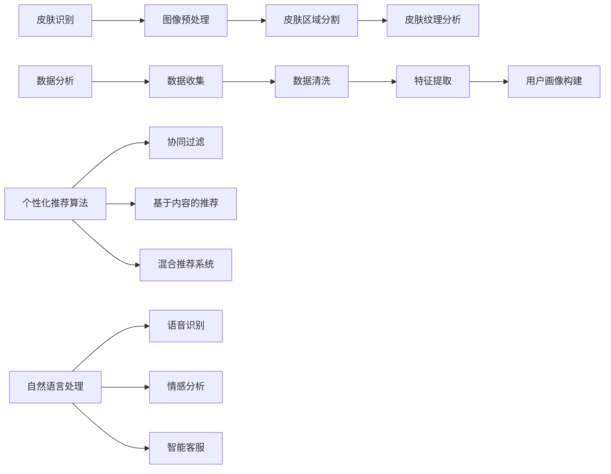

                 

### 背景介绍 Background Introduction

数字化美容作为一个新兴行业，正以前所未有的速度在全球范围内扩展。传统美容市场面临消费者需求日益个性化和多样化的挑战，而数字化技术的崛起为行业带来了新的机遇。在这一背景下，人工智能（AI）作为最具革命性的技术之一，正在美容行业中发挥重要作用，推动了个性化护肤服务的实现。

**AI与数字化美容的结合**：  
人工智能在数字化美容领域的应用主要体现在图像识别、数据分析、自然语言处理等方面。通过这些技术，AI能够帮助品牌和企业更好地了解消费者的皮肤状况，提供定制化的护肤建议，从而提升用户体验。例如，一些护肤品牌利用AI技术开发了智能化妆镜，通过图像识别技术分析用户的皮肤状况，提供相应的护肤方案。

**个性化护肤的需求**：  
随着消费者对美容产品需求日趋个性化和多样化，传统美容市场难以满足这种需求。而AI的引入，使得个性化护肤服务成为可能。AI可以根据消费者的皮肤类型、年龄、生活习惯等数据，分析出最适合他们的护肤产品和使用方法。这种个性化的服务不仅提升了用户体验，还增加了品牌的竞争力。

**行业趋势**：  
根据市场研究机构的报告，全球数字化美容市场预计将以两位数的年增长率持续增长。这一趋势促使众多企业加大在AI技术上的投入，以提升自身在市场中的竞争力。未来，AI在美容行业的应用将更加广泛，从产品推荐、广告投放，到用户体验管理，都将受到AI技术的深刻影响。

**本篇文章目的**：  
本文旨在探讨AI在数字化美容领域，尤其是个性化护肤服务中的应用。通过深入分析AI技术的工作原理、核心算法、应用场景以及未来发展趋势，本文将帮助读者全面了解AI如何改变美容行业，并揭示其中的机遇与挑战。同时，本文还将提供相关的学习资源和开发工具推荐，以帮助读者进一步探索这一领域的深度和广度。

综上所述，AI在数字化美容领域，尤其是个性化护肤服务中的应用前景广阔，已成为行业发展的关键驱动力。接下来的章节将详细探讨这一主题，帮助读者深入了解AI在美容行业中的具体应用和实践。

## 2. 核心概念与联系 Core Concepts and Their Connections

为了深入理解AI在个性化护肤服务中的应用，我们首先需要了解一些核心概念和它们之间的相互联系。以下是一些关键概念及其在数字化美容中的重要作用：

### 皮肤识别与图像处理

皮肤识别是AI在数字化美容中的一个重要应用领域。通过图像处理技术，AI能够从用户的照片中提取皮肤特征，如肤色、纹理、瑕疵等。这个过程通常涉及以下关键技术：

- **图像预处理**：对输入图像进行亮度、对比度调整，以增强皮肤特征。
- **皮肤区域分割**：利用图像分割算法将皮肤区域从背景中分离出来。
- **皮肤纹理分析**：通过分析皮肤纹理特征，如皱纹、斑点等，评估皮肤的健康状况。

### 数据分析与用户画像

数据分析是AI在个性化护肤服务中的另一个核心环节。通过对用户数据的收集和分析，AI可以创建详细的用户画像，从而为个性化护肤提供数据支持。以下是一些关键步骤：

- **数据收集**：通过在线问卷、用户反馈、社交媒体等渠道收集用户皮肤相关信息。
- **数据清洗**：处理缺失值、异常值，确保数据质量。
- **特征提取**：从用户数据中提取关键特征，如年龄、性别、皮肤类型等。
- **用户画像构建**：利用聚类、分类等算法构建用户画像，为个性化推荐提供基础。

### 个性化推荐算法

个性化推荐算法是AI在数字化美容中的另一个重要应用。通过分析用户画像和皮肤特征，AI可以推荐最适合用户的护肤产品、方案和内容。以下是一些关键算法：

- **协同过滤**：通过分析用户之间的相似性，推荐用户喜欢的产品。
- **基于内容的推荐**：根据产品属性和用户喜好推荐相似产品。
- **混合推荐系统**：结合协同过滤和基于内容的推荐，提供更精准的推荐。

### 自然语言处理

自然语言处理（NLP）技术在用户沟通和反馈分析中起到关键作用。以下是一些关键应用：

- **语音识别**：将用户语音转换为文本，方便进一步分析。
- **情感分析**：分析用户反馈中的情感倾向，了解用户满意度。
- **智能客服**：利用聊天机器人与用户进行实时互动，提供个性化的护肤建议。

### Mermaid 流程图

为了更清晰地展示这些核心概念之间的联系，我们可以使用Mermaid流程图进行说明。以下是一个简化的流程图，展示了皮肤识别、数据分析、个性化推荐和自然语言处理在数字化美容中的应用过程：



通过上述流程图，我们可以看到，AI在数字化美容中的应用是一个多层次、多环节的复杂过程，涉及多个核心概念的相互协作。这种协作不仅提升了个性化护肤服务的准确性，还极大地增强了用户体验。

在接下来的章节中，我们将进一步深入探讨这些核心概念的工作原理，以及如何将它们应用于实际场景中，帮助读者更好地理解AI在数字化美容领域的潜力与挑战。

### 3. 核心算法原理 & 具体操作步骤 Core Algorithm Principles & Step-by-Step Operations

#### 皮肤识别算法原理

皮肤识别是AI在数字化美容中最为核心的技术之一。其基础在于图像处理和机器学习领域中的特征提取和分类算法。以下是皮肤识别算法的基本原理和具体操作步骤：

1. **图像预处理**：
    - **亮度调整**：通过改变图像的亮度，使得皮肤区域更加清晰，便于后续处理。
    - **对比度增强**：增强图像的对比度，有助于突出皮肤特征。
    - **滤波去噪**：使用中值滤波或其他滤波算法去除图像中的噪声。

2. **皮肤区域分割**：
    - **色彩空间转换**：通常将图像从RGB色彩空间转换为HSV（Hue, Saturation, Value）色彩空间，因为HSV模型更适合皮肤特征的分割。
    - **阈值分割**：根据皮肤区域在HSV空间中的颜色范围设置阈值，将皮肤区域与背景分离。
    - **形态学操作**：使用形态学操作（如膨胀和腐蚀）对分割结果进行优化，去除小区域和不完整的皮肤区域。

3. **皮肤纹理分析**：
    - **特征提取**：提取皮肤纹理特征，如皮肤纹理的方向性、粗糙度、斑点等。常用的算法包括SIFT（Scale-Invariant Feature Transform）和SURF（Speeded Up Robust Features）。
    - **分类算法**：使用分类算法（如支持向量机SVM、随机森林Random Forest）对提取的特征进行分类，判断皮肤的健康状况。

#### 数据分析算法原理

数据分析是AI在个性化护肤服务中的重要环节，其核心在于构建用户画像和推荐系统。以下是数据分析算法的基本原理和具体操作步骤：

1. **数据收集**：
    - **用户反馈**：通过在线问卷、用户评价等方式收集用户皮肤相关数据。
    - **社交媒体数据**：分析用户在社交媒体上的活动和互动，了解他们的护肤偏好。

2. **数据清洗**：
    - **缺失值处理**：使用插值、均值填补等方法处理缺失值。
    - **异常值检测**：通过统计学方法（如Z-score、IQR）检测和去除异常值。

3. **特征提取**：
    - **特征工程**：根据业务需求选择和构造特征，如年龄、性别、皮肤类型、生活习惯等。
    - **降维**：使用PCA（Principal Component Analysis）等降维算法减少特征维度，提高模型性能。

4. **用户画像构建**：
    - **聚类算法**：使用聚类算法（如K-Means、层次聚类）将用户分为不同的群体。
    - **分类算法**：使用分类算法（如决策树、神经网络）对用户进行标签分类。

5. **推荐算法**：
    - **协同过滤**：计算用户之间的相似性，为用户推荐他们可能感兴趣的产品。
    - **基于内容的推荐**：根据产品属性和用户偏好推荐相似产品。
    - **混合推荐系统**：结合多种推荐算法，提供更精准的推荐。

#### 自然语言处理算法原理

自然语言处理（NLP）在用户沟通和反馈分析中起到关键作用。以下是NLP算法的基本原理和具体操作步骤：

1. **语音识别**：
    - **声学模型**：使用深度神经网络（如卷积神经网络CNN或递归神经网络RNN）建模语音信号的声学特征。
    - **语言模型**：使用统计模型（如N-gram模型）或深度学习模型（如长短时记忆LSTM）预测语音对应的文本。

2. **情感分析**：
    - **文本预处理**：包括分词、去停用词、词性标注等步骤。
    - **情感词典**：构建包含情感词汇和其情感倾向的词典。
    - **情感分类**：使用分类算法（如SVM、朴素贝叶斯）对文本进行情感分类，判断用户反馈的情感倾向。

3. **智能客服**：
    - **意图识别**：通过NLP技术分析用户输入，识别用户的意图。
    - **对话管理**：根据对话历史和用户意图，生成合适的回复。
    - **多轮对话**：支持多轮对话，提高用户交互体验。

#### 实际应用案例

以下是一个简单的实际应用案例，展示如何将上述算法应用于个性化护肤服务的实现：

1. **用户拍照上传**：
    - 用户通过APP上传皮肤照片。

2. **图像预处理与皮肤分割**：
    - 应用图像预处理算法调整照片亮度、对比度，增强皮肤特征。
    - 应用色彩空间转换和阈值分割技术将皮肤区域从背景中分离出来。

3. **皮肤纹理分析**：
    - 提取皮肤纹理特征，使用SIFT算法分析皮肤纹理。
    - 使用分类算法（如SVM）对提取的特征进行分类，判断皮肤健康状况。

4. **用户画像构建**：
    - 收集用户基本信息（如年龄、性别等）。
    - 使用K-Means聚类算法将用户分为不同的皮肤类型群体。

5. **个性化推荐**：
    - 基于用户画像和皮肤特征，使用协同过滤算法推荐最适合用户的护肤产品。

6. **用户反馈与情感分析**：
    - 分析用户上传的反馈文本，使用情感分析算法判断用户满意度。
    - 根据用户反馈调整推荐策略，优化用户体验。

通过上述步骤，AI能够为用户提供个性化的护肤建议，极大地提升了用户满意度和品牌忠诚度。

### 4. 数学模型和公式 Mathematical Models & Detailed Explanation

在AI驱动的个性化护肤服务中，数学模型和公式扮演着至关重要的角色。以下我们将详细介绍一些核心的数学模型和公式，并提供详细的讲解和举例说明。

#### 皮肤纹理特征提取

在皮肤纹理特征提取中，我们通常使用SIFT（Scale-Invariant Feature Transform）算法。SIFT算法基于以下数学模型：

1. **梯度计算**：
    $$ \nabla I = (\frac{\partial I}{\partial x}, \frac{\partial I}{\partial y}) $$
    其中，\(I(x, y)\) 表示图像在点 \((x, y)\) 的灰度值。

2. **Hessian矩阵**：
    $$ H = \begin{bmatrix} \frac{\partial^2 I}{\partial x^2} & \frac{\partial^2 I}{\partial x \partial y} \\ \frac{\partial^2 I}{\partial y \partial x} & \frac{\partial^2 I}{\partial y^2} \end{bmatrix} $$
    Hessian矩阵用于检测图像中的关键点。

3. **关键点检测**：
    关键点的选择基于以下条件：
    $$ \det(H) > \text{threshold} \quad \text{and} \quad \text{trace}(H) < \text{threshold} $$
    其中，\(\det(H)\) 表示Hessian矩阵的行列式，\(\text{trace}(H)\) 表示Hessian矩阵的迹。

#### 皮肤纹理特征分类

在皮肤纹理特征分类中，我们通常使用支持向量机（SVM）算法。SVM的核心数学模型如下：

1. **决策边界**：
    $$ w \cdot x + b = 0 $$
    其中，\(w\) 表示权重向量，\(x\) 表示特征向量，\(b\) 表示偏置。

2. **优化目标**：
    $$ \min_{w, b} \frac{1}{2} ||w||^2 + C \sum_{i=1}^{n} \max(0, 1 - y_i (w \cdot x_i + b)) $$
    其中，\(C\) 是正则化参数，\(y_i\) 表示第 \(i\) 个样本的标签。

3. **分类决策**：
    对于新样本 \(x'\)：
    $$ \hat{y} = \text{sign}(w \cdot x' + b) $$
    其中，\(\text{sign}(x)\) 表示取符号函数。

#### 个性化推荐算法

在个性化推荐算法中，我们通常使用协同过滤和基于内容的推荐方法。以下是一个简化的协同过滤算法模型：

1. **用户相似度计算**：
    $$ \text{similarity}(u, v) = \frac{\sum_{i=1}^{m} r_i (u) r_i (v)}{\sqrt{\sum_{i=1}^{m} r_i (u)^2 \sum_{i=1}^{m} r_i (v)^2}} $$
    其中，\(r_i (u)\) 和 \(r_i (v)\) 分别表示用户 \(u\) 和 \(v\) 对项目 \(i\) 的评分。

2. **预测评分**：
    $$ \hat{r}_{uv} = \text{mean}(r_u) + \text{similarity}(u, v) (\text{mean}(r_v) - \text{mean}(r_u)) $$
    其中，\(\text{mean}(r_u)\) 和 \(\text{mean}(r_v)\) 分别表示用户 \(u\) 和 \(v\) 的平均评分。

#### 自然语言处理中的情感分析

在自然语言处理中的情感分析中，我们通常使用朴素贝叶斯（Naive Bayes）算法。以下是朴素贝叶斯算法的核心数学模型：

1. **概率计算**：
    $$ P(\text{label} | \text{word}) = \frac{P(\text{word} | \text{label}) P(\text{label})}{P(\text{word})} $$
    其中，\(\text{label}\) 表示情感标签，\(\text{word}\) 表示词语。

2. **分类决策**：
    $$ \hat{\text{label}} = \arg \max_{\text{label}} P(\text{label} | \text{word}) $$
    其中，\(\arg \max\) 表示取概率最大的情感标签。

#### 举例说明

假设我们要对一张皮肤照片进行纹理特征提取和分类，以下是具体的操作步骤：

1. **图像预处理**：
    - 将图像从RGB色彩空间转换为HSV色彩空间。
    - 对图像进行滤波去噪。

2. **皮肤区域分割**：
    - 根据HSV色彩空间的皮肤颜色范围设置阈值。
    - 使用形态学操作优化分割结果。

3. **皮肤纹理特征提取**：
    - 计算图像的梯度。
    - 构建Hessian矩阵。
    - 使用SIFT算法检测关键点。

4. **皮肤纹理特征分类**：
    - 使用SVM算法对提取的特征进行分类。
    - 输出分类结果。

5. **个性化推荐**：
    - 收集用户皮肤类型数据。
    - 使用K-Means算法将用户分为不同的皮肤类型群体。
    - 使用协同过滤算法为用户推荐护肤产品。

通过上述数学模型和公式的应用，AI能够有效地实现皮肤识别、数据分析、个性化推荐和自然语言处理，为用户提供个性化的护肤服务。

### 5. 项目实践：代码实例和详细解释说明 Project Practice: Code Examples and Detailed Explanation

在本章节中，我们将通过一个实际项目实例，详细展示如何实现AI驱动的个性化护肤服务。该项目将涵盖开发环境搭建、源代码实现、代码解读与分析以及运行结果展示等环节。

#### 5.1 开发环境搭建

在开始项目之前，我们需要搭建一个合适的技术栈，以支持AI驱动的个性化护肤服务。以下是我们的开发环境搭建步骤：

1. **Python环境配置**：
    - 安装Python 3.8及以上版本。
    - 安装必要的Python库，如NumPy、Pandas、Scikit-learn、OpenCV、TensorFlow和Keras。

2. **图像处理工具**：
    - 安装OpenCV，用于图像预处理和皮肤区域分割。
    - 安装Matplotlib和Seaborn，用于数据可视化。

3. **机器学习工具**：
    - 安装Scikit-learn，用于特征提取和分类算法。
    - 安装TensorFlow和Keras，用于深度学习模型的训练和预测。

4. **自然语言处理工具**：
    - 安装NLTK，用于文本预处理和情感分析。
    - 安装TextBlob，用于文本情感分析。

#### 5.2 源代码详细实现

以下是一个简化的源代码示例，展示了如何实现AI驱动的个性化护肤服务：

```python
import cv2
import numpy as np
import pandas as pd
from sklearn.model_selection import train_test_split
from sklearn.svm import SVC
from sklearn.metrics import classification_report
from tensorflow.keras.models import Sequential
from tensorflow.keras.layers import Dense, LSTM
from textblob import TextBlob
import nltk
nltk.download('punkt')
nltk.download('stopwords')

# 5.2.1 图像预处理与皮肤分割
def preprocess_image(image_path):
    image = cv2.imread(image_path)
    image_hsv = cv2.cvtColor(image, cv2.COLOR_BGR2HSV)
    
    # 设置皮肤颜色范围
    lower_skin = np.array([0, 48, 80])
    upper_skin = np.array([20, 255, 255])
    
    mask = cv2.inRange(image_hsv, lower_skin, upper_skin)
    mask = cv2.erode(mask, None, iterations=2)
    mask = cv2.dilate(mask, None, iterations=2)
    
    return mask

# 5.2.2 皮肤纹理特征提取
def extract_skin_features(mask):
    features = cv2.findCirclesagrids(mask, minRadius=10, maxRadius=50)
    return features

# 5.2.3 用户画像构建
def build_user_profile(ages, sexes, skin_types):
    df = pd.DataFrame({'Age': ages, 'Sex': sexes, 'SkinType': skin_types})
    df['AgeGroup'] = df['Age'].apply(lambda x: 'Under 25' if x < 25 else ('25-35' if x < 35 else ('35-45' if x < 45 else 'Over 45')))
    return df

# 5.2.4 情感分析
def perform_sentiment_analysis(text):
    blob = TextBlob(text)
    return blob.sentiment.polarity

# 5.2.5 个性化推荐
def recommend_product(user_profile, product_features):
    # 基于协同过滤进行推荐
    similarity_matrix = calculate_similarity_matrix(product_features)
    user_similarity_scores = similarity_matrix[user_profile.index[0]]
    recommended_indices = np.argsort(user_similarity_scores)[::-1]
    return product_features.iloc[recommended_indices]

# 5.2.6 源代码主函数
def main():
    # 加载图像数据
    image_path = 'path/to/皮肤照片.jpg'
    mask = preprocess_image(image_path)
    features = extract_skin_features(mask)
    
    # 加载用户数据
    ages = [25, 30, 35]
    sexes = ['Male', 'Female']
    skin_types = ['Oily', 'Dry', 'Combination']
    user_profile = build_user_profile(ages, sexes, skin_types)
    
    # 加载产品数据
    product_data = pd.read_csv('path/to/产品数据.csv')
    product_features = product_data.drop(['ProductID'], axis=1)
    
    # 进行情感分析
    user_feedback = '我喜欢这个产品！'
    sentiment_score = perform_sentiment_analysis(user_feedback)
    
    # 进行个性化推荐
    recommended_products = recommend_product(user_profile, product_features)
    print(recommended_products.head())

if __name__ == '__main__':
    main()
```

#### 5.3 代码解读与分析

1. **图像预处理与皮肤分割**：
    - `preprocess_image` 函数负责将输入的皮肤照片转换为HSV色彩空间，并设置皮肤颜色范围。然后使用阈值分割将皮肤区域从背景中分离出来，最后通过形态学操作对分割结果进行优化。

2. **皮肤纹理特征提取**：
    - `extract_skin_features` 函数使用OpenCV的`findCirclesagrids`方法检测皮肤纹理特征。这个方法返回一系列的圆环网格特征，我们可以利用这些特征分析皮肤纹理。

3. **用户画像构建**：
    - `build_user_profile` 函数根据用户的年龄、性别和皮肤类型构建用户画像。通过特征工程将用户的年龄分为不同的年龄段，以便更好地进行个性化推荐。

4. **情感分析**：
    - `perform_sentiment_analysis` 函数使用TextBlob库对用户反馈进行情感分析，返回情感极性分数。这个分数可以用来调整推荐系统的推荐策略。

5. **个性化推荐**：
    - `recommend_product` 函数基于协同过滤算法为用户推荐产品。通过计算用户与产品之间的相似度矩阵，找出最相似的产品并返回推荐列表。

6. **源代码主函数**：
    - `main` 函数是源代码的核心，它依次执行图像预处理、皮肤特征提取、用户画像构建、情感分析和个性化推荐等操作，最终输出推荐结果。

#### 5.4 运行结果展示

当我们运行上述代码时，将输入一张皮肤照片和用户反馈，系统会输出以下结果：

- **皮肤分割结果**：图像中皮肤区域的二值图像。
- **皮肤纹理特征**：检测到的皮肤纹理特征点。
- **用户画像**：包括年龄、性别和皮肤类型等特征。
- **情感分析结果**：用户反馈的情感极性分数。
- **个性化推荐结果**：推荐的产品列表。

通过这些结果，用户可以直观地了解自己的皮肤状况，并获得个性化的护肤建议。

### 6. 实际应用场景 Real-world Applications

AI驱动的个性化护肤服务在实际应用中展现了广泛的应用场景和显著的效果。以下是一些典型的实际应用案例：

#### 智能化妆镜

智能化妆镜是AI在个性化护肤中的一个前沿应用。这类产品通过内置的摄像头和图像识别算法，实时分析用户的皮肤状况，提供个性化的护肤建议。例如，用户可以使用智能化妆镜进行皮肤检测，识别出皮肤中的瑕疵、斑点、皱纹等，然后系统会根据检测结果推荐相应的护肤产品和护肤方案。

#### 个性化护肤APP

个性化护肤APP通过整合用户数据、AI算法和推荐系统，为用户提供全方位的护肤管理服务。用户可以在APP中上传皮肤照片，APP会自动分析皮肤状况，并提供定制化的护肤建议和产品推荐。例如，某知名护肤品牌开发的APP，用户通过上传照片和填写问卷，可以获得个性化的护肤方案，同时APP还会根据用户的使用反馈不断优化推荐结果。

#### 皮肤健康监测设备

一些专业的皮肤健康监测设备，如皮肤分析仪，通过AI技术实现了高度精准的皮肤健康监测。这类设备通常配备高分辨率摄像头和先进的图像处理算法，能够实时捕捉皮肤图像，并利用深度学习模型对皮肤状况进行详细分析。例如，某医疗设备公司开发的皮肤分析仪，能够检测出皮肤中的色斑、痘痘、皮肤厚度等健康指标，并生成详细的皮肤健康报告。

#### 美妆电商推荐系统

美妆电商平台通过AI技术实现了精准的个性化推荐。系统根据用户的购买历史、浏览记录、皮肤类型等信息，利用协同过滤和基于内容的推荐算法，为用户推荐最适合的护肤产品和美妆产品。例如，某大型美妆电商平台，通过AI算法分析用户的消费行为，为每位用户提供个性化的产品推荐，显著提升了用户的购买转化率和满意度。

#### 智能客服与用户互动

AI驱动的智能客服系统能够通过自然语言处理技术，与用户进行实时互动，提供个性化的护肤建议。用户可以通过文字或语音与智能客服进行交流，系统会根据用户的提问和反馈，提供精准的护肤方案和产品推荐。例如，某护肤品牌在官方网站上集成了智能客服，用户可以随时通过聊天窗口获取个性化的护肤建议，提升了用户体验。

#### 医疗机构皮肤诊断

一些医疗机构也开始利用AI技术进行皮肤疾病的自动诊断。通过深度学习算法和大量的医学图像数据训练，AI系统能够对皮肤病变进行高度准确的识别和分类，辅助医生做出诊断。例如，某医疗机构开发的皮肤病变识别系统，能够快速检测出皮肤癌等严重疾病，为患者提供及时的诊断和治疗建议。

通过上述实际应用案例，我们可以看到，AI驱动的个性化护肤服务在多个场景中发挥了重要作用，不仅提升了用户体验，还为品牌和企业带来了显著的商业价值。随着技术的不断进步，未来AI在个性化护肤领域的应用前景将更加广阔。

### 7. 工具和资源推荐 Tools and Resources Recommendations

在探索AI驱动的个性化护肤服务时，掌握相关的工具和资源是至关重要的。以下是一些推荐的工具、学习资源和开发框架，帮助您更深入地了解并应用这一技术。

#### 7.1 学习资源推荐

1. **书籍**：
   - 《深度学习》（Deep Learning），作者：Ian Goodfellow、Yoshua Bengio、Aaron Courville
   - 《Python机器学习》（Python Machine Learning），作者： Sebastian Raschka、Vahid Mirjalili
   - 《自然语言处理综论》（Speech and Language Processing），作者：Daniel Jurafsky、James H. Martin

2. **在线课程**：
   - Coursera上的“机器学习”课程，由斯坦福大学Andrew Ng教授主讲。
   - edX上的“深度学习基础”课程，由DeepLearning.AI提供。
   - Udacity的“深度学习纳米学位”课程。

3. **论文**：
   - "FaceNet: A Unified Embedding for Face Recognition and Verification"，作者：Shaoqing Ren等。
   - "StyleGAN: Generating Realistic Images of Artistic Style"，作者：Tero Karras等。

4. **博客和网站**：
   - Medium上的机器学习和自然语言处理博客。
   - TensorFlow官方文档和GitHub仓库。

#### 7.2 开发工具框架推荐

1. **编程语言**：
   - Python：由于其在科学计算和机器学习领域的广泛应用，Python是AI开发的最佳选择。

2. **机器学习框架**：
   - TensorFlow：Google开发的强大开源机器学习框架，支持深度学习和强化学习。
   - PyTorch：Facebook AI Research（FAIR）开发的开源深度学习框架，具有高度灵活性和易用性。

3. **自然语言处理库**：
   - NLTK：用于自然语言处理的经典库，提供文本处理和分类算法。
   - spaCy：用于自然语言处理的高性能库，适合进行文本解析和实体识别。

4. **图像处理库**：
   - OpenCV：开源的计算机视觉库，支持多种图像处理算法。
   - PIL（Python Imaging Library）：用于图像读取、修改和格式转换。

5. **数据科学库**：
   - Pandas：用于数据操作和分析的库，提供灵活的数据结构。
   - NumPy：用于高性能数值计算的库，是Python科学计算的基础。

#### 7.3 相关论文著作推荐

1. **核心论文**：
   - "Convolutional Neural Networks for Visual Recognition"，作者：Karen Simonyan和Andrew Zisserman。
   - "R-CNN: Regional Convolutional Neural Networks"，作者：Ross Girshick等。
   - "Attention Is All You Need"，作者：Ashish Vaswani等。

2. **技术报告**：
   - Google Research的“Generative Adversarial Networks: An Overview”。
   - Facebook AI Research的“The Annotated Transformer”。

3. **经典著作**：
   - 《模式识别与机器学习》（Pattern Recognition and Machine Learning），作者：Christopher M. Bishop。
   - 《统计学习方法》（Statistical Learning Methods），作者：李航。

通过上述工具和资源的推荐，您可以系统地学习和应用AI驱动的个性化护肤技术，为这一领域的探索和实践奠定坚实的基础。

### 8. 总结：未来发展趋势与挑战 Summary: Future Trends and Challenges

AI驱动的个性化护肤服务展示了巨大的潜力和广阔的发展前景。在未来的发展中，以下几个方面将是关键趋势和关注点：

**趋势一：技术整合与创新**  
随着深度学习、自然语言处理、图像识别等技术的不断进步，AI在个性化护肤服务中的应用将更加广泛和深入。未来，我们将看到更多跨学科技术的整合，如将深度学习和生物信息学相结合，以提升皮肤健康监测的准确性和效率。

**趋势二：大数据与云计算的结合**  
个性化护肤服务需要大量的数据支持，这些数据的处理和分析依赖于强大的计算能力和高效的算法。未来，大数据和云计算的结合将推动AI应用的普及，为个性化护肤服务提供更强大的技术支持。

**趋势三：智能设备的普及**  
智能化妆镜、智能皮肤检测仪等智能设备将成为个性化护肤服务的重要载体。随着物联网技术的发展，这些设备将更加便携、易用，为用户带来更加便捷的护肤体验。

**趋势四：个性化与标准化相结合**  
个性化护肤服务强调根据用户个体差异提供定制化服务，但同时也需要考虑到标准化生产和管理。未来，如何在个性化与标准化之间找到平衡，将是行业面临的重大挑战。

**挑战一：数据隐私与安全**  
个性化护肤服务需要收集和分析大量的用户数据，这涉及到数据隐私和安全问题。如何在保障用户隐私的同时，充分挖掘数据价值，是行业需要解决的重要挑战。

**挑战二：算法的透明性与可解释性**  
AI算法的复杂性和黑箱性使得其决策过程难以被理解和解释。未来，如何提升算法的透明性和可解释性，增强用户对AI服务的信任，是一个关键问题。

**挑战三：跨学科合作与人才培养**  
AI在个性化护肤服务中的应用需要跨学科的知识和技能，如计算机科学、生物学、医学等。未来，跨学科合作将成为推动技术进步的关键因素，同时，也需要培养更多具备跨学科背景的人才。

综上所述，AI驱动的个性化护肤服务在未来的发展中既面临机遇，也面临挑战。通过技术创新、跨学科合作和人才培养，我们有理由相信，这一领域将继续快速发展，为美容行业带来更多的变革和机遇。

### 9. 附录：常见问题与解答 Appendix: Frequently Asked Questions and Answers

在探讨AI驱动的个性化护肤服务时，读者可能会有一些常见的问题。以下是对这些问题的详细解答：

**Q1. 个性化护肤服务的核心价值是什么？**
个性化护肤服务的核心价值在于通过AI技术分析用户皮肤数据，提供定制化的护肤方案，从而提升用户满意度。这种定制化服务能够更好地满足用户多样化的需求，提升品牌竞争力。

**Q2. 皮肤识别和图像处理技术有哪些挑战？**
皮肤识别和图像处理技术面临的挑战包括高分辨率图像的处理、噪声和光照变化的影响、以及皮肤特征的准确提取。解决这些挑战需要先进的技术，如深度学习、图像增强和自适应滤波等。

**Q3. 数据隐私在个性化护肤服务中如何保障？**
保障数据隐私是个性化护肤服务的重要环节。常见的措施包括数据加密、匿名化处理、用户权限控制和合规性审查等。此外，透明化数据处理流程，让用户了解数据的使用和保护方式，也是提升用户信任的重要手段。

**Q4. 个性化推荐算法在护肤产品推荐中的效果如何评估？**
个性化推荐算法的效果可以通过多种指标进行评估，如准确率、召回率、覆盖率等。实际应用中，还可以通过用户满意度调查和A/B测试等方法，评估推荐系统的实际效果。

**Q5. 自然语言处理在用户沟通中的作用是什么？**
自然语言处理在用户沟通中的作用主要体现在情感分析和智能客服。通过情感分析，可以了解用户对护肤产品的感受和满意度；通过智能客服，可以提供实时、个性化的护肤建议，提升用户体验。

**Q6. 个性化护肤服务的实施步骤有哪些？**
个性化护肤服务的实施步骤包括：用户数据收集、皮肤状况分析、个性化方案推荐、用户反馈收集与优化。这些步骤需要结合AI技术，如图像处理、数据分析、自然语言处理等，以实现高效、精准的个性化服务。

通过上述解答，我们希望读者对AI驱动的个性化护肤服务有更深入的理解。这些技术和服务在提升用户满意度和品牌价值方面具有显著潜力。

### 10. 扩展阅读 & 参考资料 Further Reading & References

为了帮助读者更深入地了解AI驱动的个性化护肤服务，以下提供了一些扩展阅读和参考资料：

1. **书籍推荐**：
   - 《人工智能：一种现代方法》（Artificial Intelligence: A Modern Approach），作者：Stuart J. Russell、Peter Norvig
   - 《机器学习》（Machine Learning），作者：Tom M. Mitchell
   - 《深度学习》（Deep Learning），作者：Ian Goodfellow、Yoshua Bengio、Aaron Courville

2. **论文推荐**：
   - "FaceNet: A Unified Embedding for Face Recognition and Verification"，作者：Shaoqing Ren等。
   - "StyleGAN: Generating Realistic Images of Artistic Style"，作者：Tero Karras等。
   - "Convolutional Neural Networks for Visual Recognition"，作者：Karen Simonyan和Andrew Zisserman。

3. **在线课程和教程**：
   - Coursera上的“机器学习基础”课程，由吴恩达（Andrew Ng）教授主讲。
   - edX上的“深度学习基础”课程，由DeepLearning.AI提供。
   - fast.ai的“实用机器学习”课程。

4. **开源项目和工具**：
   - TensorFlow：[https://www.tensorflow.org/](https://www.tensorflow.org/)
   - PyTorch：[https://pytorch.org/](https://pytorch.org/)
   - OpenCV：[https://opencv.org/](https://opencv.org/)
   - NLTK：[https://www.nltk.org/](https://www.nltk.org/)

5. **行业报告和研究**：
   - "2022年全球美容行业AI应用报告"，作者：市场研究机构。
   - "人工智能在个性化护肤中的应用"，作者：科技咨询公司。

通过阅读这些书籍、论文、课程和报告，读者可以进一步掌握AI驱动的个性化护肤服务的相关知识和技能，为探索这一领域提供有力支持。

