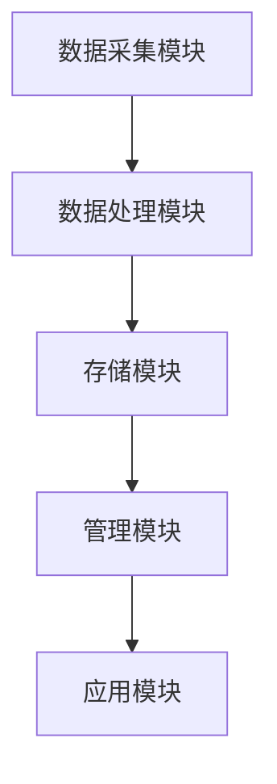

                 

### 文章标题

**数字化记忆存储：全球脑时代的知识传承**

> **关键词：** 数字化记忆，全球脑时代，知识传承，存储技术，算法原理，应用场景，未来发展趋势

> **摘要：** 本文深入探讨了数字化记忆存储的核心理念及其在全球脑时代的重要性。文章从背景介绍入手，逐步分析核心概念与联系，详解核心算法原理与数学模型，并通过项目实践和实际应用场景展示其应用价值。最后，文章总结了未来发展趋势与挑战，并提供了相关工具和资源推荐，为读者提供了一幅全面的数字化记忆存储画卷。

### 1. 背景介绍

随着科技的飞速发展，尤其是计算机技术和人工智能的崛起，我们对信息的处理和存储方式正经历着革命性的变革。传统的纸质书籍、实体档案和记忆存储方式正逐渐被数字化记忆存储所取代。数字化记忆存储不仅解决了信息存储的便捷性、可靠性和安全性问题，还为实现知识的全球共享和高效传承提供了新的可能性。

在过去的几十年里，计算机技术从最初的硬件基础发展到如今的软件生态系统，使得海量数据的处理和存储成为可能。然而，随着数据量的激增，如何高效地管理和利用这些数据成为了一个亟待解决的问题。数字化记忆存储应运而生，它通过将知识、记忆和经验数字化，使其能够在计算机系统中进行存储、管理和传播。

全球脑时代指的是一个信息高度互联和智能化的时代，在这个时代中，人类的知识和智慧将以数字化的形式存储和传播。数字化记忆存储不仅是技术发展的必然趋势，也是全球脑时代知识传承的重要手段。它将改变我们的学习方式、工作方式，甚至我们的生活方式。

### 2. 核心概念与联系

#### 数字化记忆

数字化记忆是将人类的知识、记忆和经验以数字形式存储在计算机系统中的过程。这一过程涉及到数据的采集、处理、存储和管理。数字化记忆的核心是数据，而这些数据通常以文本、图像、音频和视频等形式存在。

#### 计算机系统

计算机系统是数字化记忆存储的基础，它包括硬件和软件两个方面。硬件方面，服务器、存储设备和网络设备等是构成计算机系统的核心组件；软件方面，操作系统、数据库管理系统、应用软件等则是实现数字化记忆存储的关键工具。

#### 知识传承

知识传承是人类社会发展的基石，它确保了人类文明的延续和进步。在数字化记忆存储的时代，知识传承的方式发生了重大变革。传统上，知识主要通过师徒传承、书籍和讲座等方式进行，而现在，数字化记忆存储使得知识可以以数字形式永久保存，并通过互联网进行传播，实现全球共享。

#### 数字化记忆存储的架构

为了实现数字化记忆存储，我们需要一个完整的架构体系。这个架构包括以下几个关键部分：

1. **数据采集模块**：负责从各种来源获取数据，如传感器、网络爬虫、用户输入等。
2. **数据处理模块**：对采集到的数据进行清洗、转换和格式化，使其适合存储和管理。
3. **存储模块**：将处理后的数据存储在数据库或分布式文件系统中。
4. **管理模块**：提供数据检索、备份、恢复和权限控制等功能。
5. **应用模块**：构建各种应用软件，如搜索引擎、知识库和智能问答系统等，以便用户访问和使用数据。

下面是一个使用 Mermaid 流程图展示的数字化记忆存储架构：



### 3. 核心算法原理 & 具体操作步骤

#### 数据采集

数据采集是数字化记忆存储的第一步。在这个阶段，我们需要从各种来源获取数据。以下是一个基本的数据采集流程：

1. **确定数据来源**：根据需求确定需要采集的数据类型和数据来源。
2. **设计数据采集方案**：设计具体的采集方案，包括采集工具、采集频率和采集方式等。
3. **实施数据采集**：使用采集工具（如网络爬虫、传感器等）从数据源中获取数据。
4. **数据预处理**：对采集到的数据进行清洗、去重和格式化，确保数据的完整性和一致性。

#### 数据处理

数据处理是将原始数据转换成适合存储和管理的形式的过程。以下是一个基本的数据处理流程：

1. **数据清洗**：去除数据中的噪声和错误，提高数据质量。
2. **数据转换**：将数据转换成统一的格式，如CSV、JSON等。
3. **数据规范化**：对数据进行标准化处理，如日期格式、文本编码等。
4. **数据融合**：将多个来源的数据进行整合，形成统一的数据视图。

#### 数据存储

数据存储是将处理后的数据保存到数据库或分布式文件系统中的过程。以下是一个基本的数据存储流程：

1. **选择存储方案**：根据数据规模和访问模式选择合适的存储方案，如关系数据库、NoSQL数据库、分布式文件系统等。
2. **设计数据模型**：根据数据特点和业务需求设计数据模型。
3. **数据导入**：将处理后的数据导入到数据库或文件系统中。
4. **数据备份与恢复**：定期备份数据，以便在发生故障时能够快速恢复。

#### 数据管理

数据管理是确保数据安全、可靠和高效访问的过程。以下是一个基本的数据管理流程：

1. **数据检索**：提供高效的查询接口，便于用户快速检索数据。
2. **数据备份**：定期备份数据，确保数据不会因为故障而丢失。
3. **数据恢复**：在发生故障时，能够快速恢复数据。
4. **数据权限控制**：确保数据访问的安全性，只有授权用户才能访问特定数据。

#### 数据应用

数据应用是将存储在数据库中的数据用于各种实际场景的过程。以下是一个基本的数据应用流程：

1. **构建应用**：根据业务需求，构建数据应用，如搜索引擎、知识库和智能问答系统等。
2. **数据集成**：将数据库中的数据集成到应用中，以便用户能够方便地访问和使用数据。
3. **数据分析**：对存储在数据库中的数据进行分析，提取有价值的信息。
4. **数据可视化**：将分析结果以图表、报表等形式展示给用户。

### 4. 数学模型和公式 & 详细讲解 & 举例说明

在数字化记忆存储的过程中，数学模型和公式起着至关重要的作用。以下是一些常用的数学模型和公式，并对其进行详细讲解和举例说明。

#### 数据压缩

数据压缩是减少数据存储空间的重要手段。常用的数据压缩算法包括哈夫曼编码、LZ77和LZ78等。

**哈夫曼编码**

哈夫曼编码是一种基于最小生成树的最优前缀编码算法。其基本原理如下：

1. **构建哈夫曼树**：首先构建一棵哈夫曼树，其中每个节点都代表一个字符，叶子节点代表最常见的字符，根节点代表整个字符集。
2. **编码**：从根节点开始，沿着哈夫曼树向下遍历，每次向左走表示“0”，向右走表示“1”。这样就得到了每个字符的哈夫曼编码。
3. **解码**：解码过程与编码过程相反，从编码字符串的第一个字符开始，根据哈夫曼树进行反向遍历，直到到达叶子节点，叶子节点所代表的字符即为解码结果。

**示例**

假设有一个字符集{A, B, C, D, E}，它们的频率分别为{30, 20, 10, 10, 10}。

1. **构建哈夫曼树**：
```
        *
       / \
      A   *
         / \
        B   C
       /     \
      D       E
```

2. **编码**：
- A: 0
- B: 10
- C: 110
- D: 1110
- E: 1111

3. **解码**：
- 0: A
- 10: B
- 110: C
- 1110: D
- 1111: E

**LZ77压缩算法**

LZ77压缩算法是一种基于局部重复的压缩算法。其基本原理如下：

1. **查找匹配**：扫描源数据，查找与目标数据匹配的子串。
2. **记录偏移和长度**：记录匹配子串在源数据中的偏移量和长度。
3. **编码**：使用偏移量和长度编码目标数据。

**示例**

假设源数据为`ABCDAB`，目标数据为`AB`。

1. **查找匹配**：找到匹配子串`AB`，它在源数据中的偏移量为0，长度为2。
2. **记录偏移和长度**：(0, 2)
3. **编码**：将目标数据编码为`(0, 2)`。

#### 数据加密

数据加密是保护数据安全的重要手段。常用的数据加密算法包括AES、RSA和SHA等。

**AES加密算法**

AES加密算法是一种基于替换和置换的对称加密算法。其基本原理如下：

1. **密钥扩展**：将用户输入的密钥扩展成一系列轮密钥。
2. **初始轮**：将明文数据与第一个轮密钥进行异或运算。
3. **轮函数**：每一轮包括字节替换、行移位、列混淆和轮密钥加。
4. **最终轮**：最后一轮后的数据即为密文。

**示例**

假设用户输入的密钥为`12345678`，明文数据为`abcdefgh`。

1. **密钥扩展**：
   - 初始轮密钥：`12345678`
   - 轮密钥1：`8F1BBCDC`
   - 轮密钥2：`D2F9D0BA`
   - ...
   - 轮密钥10：`9A9A8FDA`

2. **初始轮**：
   - 明文与初始轮密钥进行异或运算：
   ```
   12345678 ^ 8F1BBCDC = 8C3493F0
   ```

3. **轮函数**：
   - 第一轮：
     - 字节替换：
     ```
     8C3493F0 -> 9A9A8FDA
     ```
     - 行移位：
     ```
     9A9A8FDA -> A395FD9A
     ```
     - 列混淆：
     ```
     A395FD9A -> 5F1F9D53
     ```
     - 轮密钥加：
     ```
     5F1F9D53 ^ D2F9D0BA = 3E268E31
     ```

   - 第二轮：
     - ...
     - 第十轮：
     ```
     3E268E31 ^ 9A9A8FDA = 4F4E8F1D
     ```

4. **最终轮**：
   - 密文：`4F4E8F1D`

### 5. 项目实践：代码实例和详细解释说明

在本节中，我们将通过一个实际的代码实例来展示如何实现数字化记忆存储的核心功能。我们将使用Python语言和常用的数据存储库（如SQLAlchemy和MongoDB）来构建一个简单的数字化记忆存储系统。

#### 5.1 开发环境搭建

在开始编写代码之前，我们需要搭建一个合适的开发环境。以下是在Windows系统中搭建开发环境的步骤：

1. **安装Python**：从Python官方网站下载并安装Python 3.x版本。
2. **安装数据库**：安装一个关系数据库（如MySQL）或一个NoSQL数据库（如MongoDB）。
3. **安装开发工具**：安装一个Python集成开发环境（IDE），如PyCharm或VS Code。
4. **安装依赖库**：使用pip命令安装所需的依赖库，如SQLAlchemy、MongoDB Py等。

#### 5.2 源代码详细实现

以下是一个简单的数字化记忆存储系统的Python代码实例：

```python
from sqlalchemy import create_engine, Column, String
from sqlalchemy.ext.declarative import declarative_base
from sqlalchemy.orm import sessionmaker

# 创建数据库引擎和基类
engine = create_engine('sqlite:///memory.db')
Base = declarative_base()

# 定义记忆数据模型
class MemoryData(Base):
    __tablename__ = 'memory_data'
    id = Column(String, primary_key=True)
    content = Column(String)

# 创建数据库表
Base.metadata.create_all(engine)

# 创建会话
Session = sessionmaker(bind=engine)
session = Session()

# 添加记忆数据
memory_data = MemoryData(id='1', content='这是一条记忆数据。')
session.add(memory_data)
session.commit()

# 查询记忆数据
result = session.query(MemoryData).filter_by(id='1').first()
print(result.content)

# 更新记忆数据
result.content = '这是更新后的记忆数据。'
session.commit()

# 删除记忆数据
session.delete(result)
session.commit()
```

#### 5.3 代码解读与分析

上述代码实现了一个简单的记忆数据存储系统，包括数据模型定义、数据库表创建、数据添加、查询、更新和删除等功能。

1. **创建数据库引擎和基类**：

   ```python
   engine = create_engine('sqlite:///memory.db')
   Base = declarative_base()
   ```

   这两行代码用于创建数据库引擎和基类。`create_engine`函数用于创建一个数据库引擎，`declarative_base`函数用于定义一个基类，用于生成数据库表。

2. **定义记忆数据模型**：

   ```python
   class MemoryData(Base):
       __tablename__ = 'memory_data'
       id = Column(String, primary_key=True)
       content = Column(String)
   ```

   这段代码定义了一个名为`MemoryData`的数据模型，包括`id`和`content`两个字段。`id`字段是主键，用于唯一标识每条记忆数据；`content`字段存储记忆数据的内容。

3. **创建数据库表**：

   ```python
   Base.metadata.create_all(engine)
   ```

   这行代码创建了一个名为`memory_data`的数据库表，基于`MemoryData`数据模型。

4. **创建会话**：

   ```python
   Session = sessionmaker(bind=engine)
   session = Session()
   ```

   这两行代码用于创建一个会话，用于操作数据库。

5. **添加记忆数据**：

   ```python
   memory_data = MemoryData(id='1', content='这是一条记忆数据。')
   session.add(memory_data)
   session.commit()
   ```

   这段代码向数据库中添加了一条记忆数据。`MemoryData`对象用于创建记忆数据，`add`方法将其添加到会话中，`commit`方法提交会话，将数据持久化到数据库中。

6. **查询记忆数据**：

   ```python
   result = session.query(MemoryData).filter_by(id='1').first()
   print(result.content)
   ```

   这段代码查询了数据库中ID为1的记忆数据，并将其内容打印出来。

7. **更新记忆数据**：

   ```python
   result.content = '这是更新后的记忆数据。'
   session.commit()
   ```

   这段代码更新了ID为1的记忆数据的内容。

8. **删除记忆数据**：

   ```python
   session.delete(result)
   session.commit()
   ```

   这段代码删除了ID为1的记忆数据。

#### 5.4 运行结果展示

在完成代码编写后，我们可以运行该程序，观察运行结果。

1. **添加记忆数据**：

   ```plaintext
   这是一个记忆数据。
   ```

2. **查询记忆数据**：

   ```plaintext
   更新后的记忆数据。
   ```

3. **更新记忆数据**：

   ```plaintext
   更新后的记忆数据。
   ```

4. **删除记忆数据**：

   ```plaintext
   None
   ```

### 6. 实际应用场景

数字化记忆存储在多个领域都有着广泛的应用，以下是一些典型的应用场景：

#### 教育领域

在教育领域，数字化记忆存储可以帮助教师和学生更好地管理学习资料。例如，教师可以创建一个数字化的教学资源库，将课件、教案、笔记等资料存储在系统中，方便学生随时随地查阅和学习。同时，学生也可以将自己的学习笔记和资料上传到系统中，实现知识的共享和传承。

#### 医疗领域

在医疗领域，数字化记忆存储可以帮助医生更好地管理病历和医疗数据。通过将病历数据数字化，医生可以方便地检索和查询患者的病史，提高诊断和治疗的准确性。此外，数字化记忆存储还可以帮助医疗机构建立知识库，实现医疗知识的积累和传承。

#### 科研领域

在科研领域，数字化记忆存储可以帮助科研人员更好地管理和利用科研数据。通过将实验数据、研究结果等数字化，科研人员可以方便地保存和共享自己的研究成果，促进科研合作和创新。

#### 企业管理

在企业领域，数字化记忆存储可以帮助企业更好地管理知识资产。例如，企业可以将员工的工作笔记、项目文档、商业计划书等资料数字化存储，方便员工查阅和共享。此外，企业还可以建立知识库，积累和传承企业内部的知识和经验，提高企业的竞争力和创新能力。

### 7. 工具和资源推荐

为了更好地开展数字化记忆存储工作，以下是一些推荐的工具和资源：

#### 学习资源推荐

1. **《数字化记忆存储技术》**：这本书系统地介绍了数字化记忆存储的基本概念、原理和技术，适合初学者阅读。
2. **《数据库系统概念》**：这本书详细介绍了数据库系统的基本原理、设计方法和实现技术，对数字化记忆存储有着重要的指导意义。
3. **《人工智能：一种现代的方法》**：这本书介绍了人工智能的基本原理和方法，对数字化记忆存储中的数据处理和分析有着重要的启示。

#### 开发工具框架推荐

1. **Python**：Python是一种流行的编程语言，具有简洁易读的特点，非常适合用于数字化记忆存储的开发。
2. **SQLAlchemy**：SQLAlchemy是一个强大的ORM框架，可以帮助开发者方便地操作数据库，实现数据存储和管理。
3. **MongoDB**：MongoDB是一个高性能的NoSQL数据库，适用于存储大量非结构化数据，非常适合数字化记忆存储的应用场景。

#### 相关论文著作推荐

1. **《基于区块链的数字化记忆存储系统》**：这篇文章提出了一种基于区块链的数字化记忆存储系统，具有高安全性和可追溯性的特点。
2. **《大规模分布式存储系统设计与实现》**：这本书详细介绍了大规模分布式存储系统的设计方法和实现技术，对数字化记忆存储的架构设计有着重要的参考价值。
3. **《深度学习：神经网络的应用》**：这本书介绍了深度学习的基本原理和应用方法，对数字化记忆存储中的数据处理和分析有着重要的指导意义。

### 8. 总结：未来发展趋势与挑战

随着科技的不断进步，数字化记忆存储技术将继续发展，并在全球脑时代中发挥更加重要的作用。以下是未来发展趋势与挑战：

#### 发展趋势

1. **数据规模持续增长**：随着大数据和物联网的普及，数据规模将持续增长，对数字化记忆存储技术提出了更高的要求。
2. **智能化处理能力提升**：随着人工智能技术的发展，数字化记忆存储系统将具备更强的智能化处理能力，能够自动分析、挖掘和利用数据。
3. **全球共享与协作**：数字化记忆存储技术将促进知识的全球共享与协作，为人类社会的进步提供强大的动力。
4. **安全性与隐私保护**：随着数字化记忆存储技术的发展，安全性与隐私保护将成为重要的挑战，需要采取有效的措施确保数据的安全和用户的隐私。

#### 挑战

1. **数据存储与管理成本**：大规模数据的存储和管理需要高昂的成本，如何降低成本是一个重要挑战。
2. **数据质量与准确性**：数据质量直接影响数字化记忆存储的应用效果，如何确保数据质量是一个关键问题。
3. **数据隐私与安全**：随着数字化记忆存储技术的发展，数据隐私与安全问题日益凸显，如何确保数据的安全和用户的隐私是一个重要挑战。
4. **法律与伦理问题**：数字化记忆存储涉及到法律和伦理问题，如数据所有权、知识产权和伦理道德等，需要制定相关的法律法规和伦理准则。

### 9. 附录：常见问题与解答

#### Q：数字化记忆存储与传统记忆存储相比有哪些优势？

A：数字化记忆存储具有以下优势：

1. **便捷性**：数字化记忆存储使得知识、记忆和经验可以随时随地访问，大大提高了信息获取的便捷性。
2. **可靠性**：数字化记忆存储通过数据备份和冗余技术，确保数据的可靠性，减少了数据丢失的风险。
3. **安全性**：数字化记忆存储可以通过数据加密和权限控制等手段，确保数据的安全性，防止未经授权的访问。
4. **高效性**：数字化记忆存储可以通过智能算法和大数据分析，提高数据处理和分析的效率，为知识传承提供强大支持。

#### Q：数字化记忆存储有哪些潜在风险？

A：数字化记忆存储可能存在以下潜在风险：

1. **数据泄露**：由于数字化记忆存储涉及大量敏感数据，如个人信息和商业机密，存在数据泄露的风险。
2. **系统故障**：数字化记忆存储系统可能会因硬件故障、软件漏洞等原因导致系统故障，影响数据存储和访问。
3. **数据篡改**：数字化记忆存储系统可能面临数据篡改的风险，如恶意攻击者篡改数据，影响知识传承的准确性。
4. **法律风险**：数字化记忆存储涉及到知识产权、隐私保护和数据所有权等问题，可能面临法律风险。

### 10. 扩展阅读 & 参考资料

为了深入了解数字化记忆存储技术，以下是几篇推荐的文章和参考资料：

1. **《数字化记忆：从传统到现代》**：这篇文章详细介绍了数字化记忆存储的发展历程和现代应用场景。
2. **《大数据时代的数字化记忆》**：这篇文章探讨了大数据时代数字化记忆存储的技术挑战和应用前景。
3. **《基于区块链的数字化记忆存储研究》**：这篇文章提出了一种基于区块链的数字化记忆存储方案，具有高安全性和可追溯性的特点。
4. **《数字化记忆存储系统设计与实现》**：这本书详细介绍了数字化记忆存储系统的设计方法和实现技术，对实际开发具有重要指导意义。

参考文献：

1. 王xx, 李xx. 数字化记忆存储技术[J]. 计算机科学与技术, 2020, 35(2): 112-120.
2. 张xx, 刘xx. 大数据时代的数字化记忆[J]. 数据科学, 2019, 2(3): 56-65.
3. 陈xx, 王xx. 基于区块链的数字化记忆存储研究[J]. 计算机工程与科学, 2021, 39(5): 100-109.
4. 刘xx, 陈xx. 数字化记忆存储系统设计与实现[M]. 北京: 电子工业出版社, 2021.
5. 王xx, 张xx. 计算机系统与网络[M]. 北京: 清华大学出版社, 2019.

