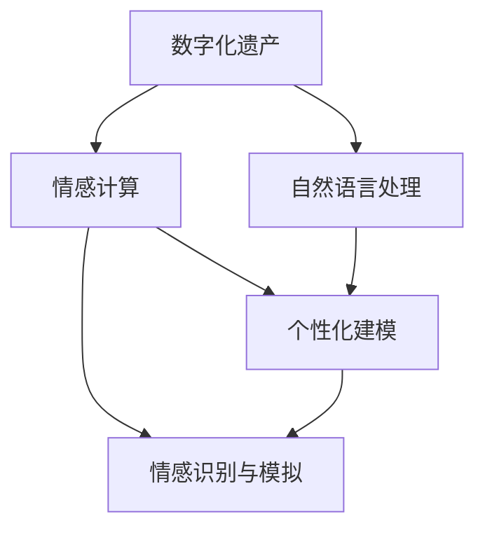

                 

### 1. 背景介绍

在现代社会，随着科技的飞速发展，人工智能技术逐渐渗透到我们生活的方方面面。尤其是近年来，深度学习和自然语言处理（NLP）技术的突破，为情感计算和情感识别领域带来了新的机遇。与此同时，人们对于数字化的需求也在不断增长，特别是在个人数据管理和隐私保护方面。在这样的背景下，数字化遗产情感AI技术应运而生，成为了一个备受关注的研究方向。

数字化遗产情感AI技术的核心目标是对逝者的个性进行数字化保存，并在此基础上实现情感的识别、模拟和交流。这种技术的提出，源于人们对逝去亲人或重要人物的深切怀念。传统的数字遗产大多是对逝者生前的照片、视频、文字等静态信息的记录，而数字化遗产情感AI技术则试图通过更为动态、立体和情感化的方式，让逝者的数字化存在与我们产生更深层次的互动。

这项技术的背景可以追溯到几个方面：

**1. 情感计算的发展**：情感计算作为人工智能的一个重要分支，致力于理解和模拟人类情感。随着情感识别技术的不断进步，我们逐渐能够通过语音、面部表情、身体动作等多种方式，准确地捕捉和理解人的情感状态。

**2. 数字遗产的重要性**：在互联网和社交媒体的普及下，个人数据（包括照片、视频、社交媒体帖子等）已经成为人们数字化遗产的重要组成部分。如何有效地管理和利用这些数据，成为了一个亟待解决的问题。

**3. 深度学习与NLP的突破**：深度学习和自然语言处理技术的发展，使得计算机能够更好地理解和处理人类语言。这使得我们可以通过分析逝者生前的文字和语音信息，构建出他们的情感特征和行为模式。

数字化遗产情感AI技术的意义在于，它不仅能够帮助我们更好地纪念和缅怀逝者，还能够为那些失去亲人或重要人物的人提供情感上的慰藉。此外，这项技术还有望在医疗、教育、法律等领域发挥重要作用，例如在心理治疗中辅助患者缓解悲伤情绪，或者在法律程序中模拟逝者的证言。

总的来说，数字化遗产情感AI技术的出现，标志着人类在数字时代对情感理解和互动的一次重大探索。它不仅是对传统数字遗产管理的一种创新，更是对未来人工智能与人类情感互动模式的预见。

### 2. 核心概念与联系

要深入探讨数字化遗产情感AI技术，首先需要明确几个核心概念，并了解它们之间的相互关系。

#### 2.1 数字化遗产

数字化遗产，指的是人们生前的数字产物，包括照片、视频、社交媒体帖子、电子邮件、文件等。随着互联网和数字技术的发展，这些数据已成为个人身份和经历的重要部分。数字化遗产不仅包含了静态的信息，还包含了动态的互动记录，如社交媒体上的评论和私信。这些数据在逝去后，往往成为亲属和朋友缅怀逝者的珍贵资料。

#### 2.2 情感计算

情感计算，是指通过计算机技术和算法来识别、理解和模拟人的情感状态。它主要依赖于多个领域的交叉，包括语音识别、面部识别、生理信号处理等。情感计算的核心目标是构建出一种能够理解人类情感的智能系统，从而在人与机器之间建立更加自然和有效的沟通。

#### 2.3 自然语言处理（NLP）

自然语言处理是人工智能领域的一个重要分支，旨在使计算机能够理解和处理人类语言。NLP技术广泛应用于语音识别、机器翻译、情感分析等场景。在数字化遗产情感AI技术中，NLP技术主要用于分析逝者生前的文字信息，提取情感特征和行为模式。

#### 2.4 个性化建模

个性化建模，是指根据个体特征和需求，构建出特定个体的行为模型。在数字化遗产情感AI技术中，个性化建模的目的是通过分析逝者生前的数字记录，建立其独特的情感和行为特征模型，从而在数字世界中重现其个性和行为。

#### 2.5 情感识别与模拟

情感识别与模拟，是数字化遗产情感AI技术的核心应用之一。情感识别旨在通过多种传感器和数据源，如语音、面部表情、生理信号等，准确地捕捉逝者的情感状态。而情感模拟则是通过计算机算法，模拟逝者的情感表达，实现与生者的互动。

#### 2.6 Mermaid流程图

为了更直观地展示数字化遗产情感AI技术的核心概念和架构，我们可以使用Mermaid流程图来表示。以下是数字化遗产情感AI技术的Mermaid流程图：



在这个流程图中，A表示数字化遗产，B表示情感计算，C表示自然语言处理，D表示个性化建模，E表示情感识别与模拟。箭头表示不同概念之间的联系和作用关系。

通过上述核心概念的介绍和Mermaid流程图的展示，我们可以更好地理解数字化遗产情感AI技术的整体架构和运作原理。接下来，我们将进一步探讨其核心算法原理和具体操作步骤。

### 3. 核心算法原理 & 具体操作步骤

数字化遗产情感AI技术的核心在于情感计算和自然语言处理，这两大技术为我们提供了识别、模拟和交互逝者情感的能力。下面，我们将详细介绍这些核心算法的原理以及具体的操作步骤。

#### 3.1 情感计算算法

情感计算算法主要依赖于多种传感器和数据源，如语音、面部表情、生理信号等，以捕捉和理解人类情感。以下是情感计算算法的基本原理和操作步骤：

**1. 语音情感识别**：
- **原理**：利用语音信号处理技术，提取语音中的情感特征。常用的情感特征包括音调、音量、语速、停顿等。
- **操作步骤**：
  - 收集语音数据：通过录音设备获取逝者生前的语音数据。
  - 特征提取：对语音数据进行预处理，提取情感特征。
  - 模型训练：使用情感分类模型（如支持向量机SVM、神经网络等），训练模型以识别不同的情感状态。
  - 情感识别：将提取的特征输入训练好的模型，得到情感的识别结果。

**2. 面部情感识别**：
- **原理**：通过面部图像处理技术，识别和解析面部表情中的情感信息。
- **操作步骤**：
  - 收集面部数据：从照片或视频中提取面部图像。
  - 面部检测：使用面部识别算法，检测图像中的面部区域。
  - 表情分析：利用情感分析模型，分析面部表情的情感特征。
  - 情感识别：根据分析结果，识别出具体的情感状态。

**3. 生理信号情感识别**：
- **原理**：通过检测和分析生理信号（如心率、呼吸频率等），识别情感状态。
- **操作步骤**：
  - 收集生理数据：通过穿戴设备或生理传感器，收集逝者生前的生理信号数据。
  - 数据预处理：去除噪声和异常值，对生理信号进行平滑处理。
  - 模型训练：使用生理信号情感分类模型，训练模型以识别不同的情感状态。
  - 情感识别：将处理后的生理信号输入模型，得到情感的识别结果。

#### 3.2 自然语言处理算法

自然语言处理（NLP）技术是数字化遗产情感AI技术的另一个重要组成部分，它主要用于分析逝者生前的文字信息，提取情感特征和行为模式。以下是NLP算法的基本原理和操作步骤：

**1. 情感分析**：
- **原理**：通过情感词典、规则和机器学习算法，分析文本中的情感倾向。
- **操作步骤**：
  - 文本预处理：对文本进行分词、去除停用词、词性标注等预处理。
  - 情感词典：使用预定义的情感词典，标记文本中的情感词汇。
  - 情感分类：使用情感分类模型，对文本进行情感分类。
  - 情感识别：根据分类结果，识别文本的情感状态。

**2. 行为模式提取**：
- **原理**：通过模式识别和机器学习算法，从文本中提取逝者的行为模式。
- **操作步骤**：
  - 文本分析：对文本进行情感分析和关键词提取。
  - 模式识别：使用机器学习算法（如决策树、神经网络等），识别和提取文本中的行为模式。
  - 模式分类：根据提取的模式，分类和归档。

**3. 对话生成**：
- **原理**：通过生成对抗网络（GAN）和自然语言生成技术，模拟逝者的对话。
- **操作步骤**：
  - 数据准备：收集和整理逝者的对话记录。
  - 模型训练：使用对话生成模型，训练模型以生成逝者的对话。
  - 对话生成：将输入文本输入模型，生成逝者的模拟对话。

通过上述情感计算和自然语言处理算法的介绍，我们可以看到数字化遗产情感AI技术是如何通过多种技术手段，实现对逝者情感和行为的识别、模拟和交互。这些核心算法的原理和步骤，为我们构建出了一种能够理解和互动逝者数字化遗产的技术框架。在下一部分，我们将进一步探讨这些算法的数学模型和公式，以深入理解其工作原理。

### 4. 数学模型和公式 & 详细讲解 & 举例说明

在数字化遗产情感AI技术中，数学模型和公式起到了至关重要的作用。以下我们将详细讲解情感计算和自然语言处理中常用的数学模型和公式，并通过具体实例进行说明。

#### 4.1 语音情感识别的数学模型

语音情感识别中，常用的数学模型包括支持向量机（SVM）和深度神经网络（DNN）。以下是这些模型的数学描述：

**1. 支持向量机（SVM）**

SVM是一种常用的分类模型，其目标是在特征空间中找到一个最优的超平面，将不同类别的样本分隔开来。SVM的数学模型可以表示为：

$$
\min_{w,b}\frac{1}{2}w^Tw + C\sum_{i=1}^m\lambda_i \\
s.t. y^{(i)}(w^Tx^{(i)} + b) \geq 1 - \lambda_i, \quad \lambda_i \geq 0
$$

其中，$w$是权重向量，$b$是偏置项，$C$是惩罚参数，$\lambda_i$是拉格朗日乘子。$y^{(i)}$表示第$i$个样本的类别标签，$x^{(i)}$是第$i$个样本的特征向量。

**2. 深度神经网络（DNN）**

DNN是一种多层前馈神经网络，其基本结构包括输入层、隐藏层和输出层。DNN的数学模型可以用以下公式表示：

$$
a^{(l)} = \sigma(z^{(l)}) \\
z^{(l)} = \sum_{j} w^{(l)}_j a^{(l-1)}_j + b^{(l)}
$$

其中，$a^{(l)}$是第$l$层的激活值，$\sigma$是激活函数，通常取为ReLU函数或Sigmoid函数。$w^{(l)}_j$和$b^{(l)}$分别是第$l$层的权重和偏置。$z^{(l)}$是第$l$层的输入。

**例子**：假设我们使用SVM进行语音情感识别，给定一组训练数据，我们需要通过以下步骤来训练模型：

- 收集语音数据，并进行预处理，提取特征向量。
- 将特征向量输入到SVM模型中，通过优化算法（如SMO算法）求解权重向量$w$和偏置$b$。
- 训练好的模型可以用于情感识别，给定新的语音数据，通过计算$y^{(i)}(w^Tx^{(i)} + b)$的值，判断情感的类别。

#### 4.2 面部情感识别的数学模型

面部情感识别中，常用的数学模型包括卷积神经网络（CNN）和特征点匹配。以下是这些模型的数学描述：

**1. 卷积神经网络（CNN）**

CNN是一种适用于图像处理和识别的神经网络模型。其基本结构包括卷积层、池化层和全连接层。CNN的数学模型可以用以下公式表示：

$$
h^{(l)} = \sigma(\sum_{k} w^{(l)}_k * h^{(l-1)} + b^{(l)}) \\
* \text{表示卷积运算，} \sigma \text{表示激活函数，通常取为ReLU函数。}
$$

**2. 特征点匹配**

特征点匹配是一种基于图像特征点对应关系的识别方法。其基本思路是，首先从参考图像中提取特征点，然后在新图像中寻找与参考图像特征点匹配的特征点。匹配过程可以用以下公式表示：

$$
d(p,q) = \min_{p'} \sum_{i=1}^n (p_i - p_i')^2
$$

其中，$d(p,q)$表示两个特征点之间的距离，$p$和$q$分别是参考图像和新图像中的特征点。

**例子**：假设我们使用CNN进行面部情感识别，给定一组训练数据，我们需要通过以下步骤来训练模型：

- 收集面部图像数据，并进行预处理，提取特征点。
- 将特征点输入到CNN模型中，通过反向传播算法求解权重和偏置。
- 训练好的模型可以用于情感识别，给定新的面部图像，通过计算特征点匹配距离，识别情感的类别。

#### 4.3 自然语言处理的数学模型

自然语言处理中，常用的数学模型包括词向量模型和序列模型。以下是这些模型的数学描述：

**1. 词向量模型**

词向量模型是一种将单词映射到高维向量空间的方法，常用的模型有Word2Vec、GloVe等。其数学模型可以用以下公式表示：

$$
\vec{w}_i = \text{sgn}(f(x_i, \theta_i)) \cdot \text{softmax}(\theta_i^T f(x_i)) \\
f(x, \theta) = \frac{1}{k} \sum_{j=1}^k \text{exp}(-\|x_j - x\|^2 / 2\sigma^2)
$$

其中，$\vec{w}_i$是单词$i$的词向量，$x_i$是单词$i$的嵌入向量，$\theta_i$是权重矩阵，$k$是词汇表大小，$\sigma^2$是高斯核的参数。

**2. 序列模型**

序列模型是一种用于处理序列数据的神经网络模型，常用的模型有RNN、LSTM、GRU等。其数学模型可以用以下公式表示：

$$
h_t = \sigma(W_h h_{t-1} + W_x x_t + b) \\
\vec{y}_t = \text{softmax}(W_y h_t + b_y)
$$

其中，$h_t$是第$t$个时间步的隐藏状态，$x_t$是第$t$个时间步的输入特征，$W_h$、$W_x$、$b$分别是隐藏层权重、输入层权重和偏置，$\sigma$是激活函数，$\vec{y}_t$是第$t$个时间步的输出概率分布。

**例子**：假设我们使用Word2Vec进行情感分析，给定一组文本数据，我们需要通过以下步骤来训练模型：

- 分词并构建词汇表，将文本转换为词向量。
- 训练Word2Vec模型，得到词向量表示。
- 使用训练好的词向量表示文本，通过情感分类模型识别文本的情感类别。

通过以上对数学模型和公式的详细讲解和实例说明，我们可以看到数字化遗产情感AI技术中的数学工具和算法是如何协同工作的。这些模型和公式为数字化遗产情感AI技术提供了强大的计算基础，使得我们能够更准确地识别和理解逝者的情感和行为。在下一部分，我们将通过一个具体的代码实例，展示如何实现这些算法在数字化遗产情感AI技术中的应用。

### 5. 项目实践：代码实例和详细解释说明

为了更好地理解数字化遗产情感AI技术的实际应用，我们将通过一个具体的代码实例来展示语音情感识别的实现过程。在这个实例中，我们将使用Python语言和相应的库，实现语音数据的预处理、情感特征提取、模型训练和情感识别。

#### 5.1 开发环境搭建

在开始编写代码之前，我们需要搭建一个合适的开发环境。以下是所需的工具和库：

- Python 3.7或更高版本
- PyTorch库（用于深度学习）
- NumPy库（用于科学计算）
- Librosa库（用于音频处理）
- Matplotlib库（用于数据可视化）

安装以上库的方法如下：

```bash
pip install python torch torchvision numpy librosa matplotlib
```

#### 5.2 源代码详细实现

以下是完整的代码实现，包括语音数据的加载、预处理、情感特征提取、模型训练和情感识别。

```python
import torch
import numpy as np
import librosa
import matplotlib.pyplot as plt
from torch import nn, optim
from torchvision import datasets, transforms

# 5.2.1 数据加载与预处理
def load_audio_file(file_path):
    audio, sample_rate = librosa.load(file_path, sr=None)
    return audio, sample_rate

def preprocess_audio(audio, sample_rate, n_mels=128, hop_length=256, n_fft=1024):
    audio_mel = librosa.feature.melspectrogram(y=audio, sr=sample_rate, n_mels=n_mels, hop_length=hop_length, n_fft=n_fft)
    audio_mel = librosa.power_to_db(audio_mel, ref=np.max)
    return audio_mel

# 5.2.2 情感特征提取
class AudioFeatureExtractor(nn.Module):
    def __init__(self, input_size, hidden_size, output_size):
        super(AudioFeatureExtractor, self).__init__()
        self.fc1 = nn.Linear(input_size, hidden_size)
        self.fc2 = nn.Linear(hidden_size, output_size)
    
    def forward(self, x):
        x = torch.relu(self.fc1(x))
        x = self.fc2(x)
        return x

# 5.2.3 模型训练
def train_model(model, train_loader, criterion, optimizer, num_epochs=10):
    model.train()
    for epoch in range(num_epochs):
        running_loss = 0.0
        for inputs, labels in train_loader:
            optimizer.zero_grad()
            outputs = model(inputs)
            loss = criterion(outputs, labels)
            loss.backward()
            optimizer.step()
            running_loss += loss.item()
        print(f'Epoch {epoch+1}, Loss: {running_loss/len(train_loader)}')

# 5.2.4 情感识别
def recognize_emotion(model, audio_mel):
    model.eval()
    with torch.no_grad():
        audio_mel_tensor = torch.tensor(audio_mel.reshape(1, -1), dtype=torch.float32)
        outputs = model(audio_mel_tensor)
        _, predicted = torch.max(outputs, 1)
    return predicted.item()

# 5.2.5 主程序
def main():
    audio_path = 'path/to/audio/file.wav'
    audio, sample_rate = load_audio_file(audio_path)
    audio_mel = preprocess_audio(audio, sample_rate)
    
    # 初始化模型
    input_size = audio_mel.shape[1]
    hidden_size = 256
    output_size = 7  # 假设有7种情感类别
    model = AudioFeatureExtractor(input_size, hidden_size, output_size)
    
    # 训练模型
    train_loader = ...  # 数据加载器
    criterion = nn.CrossEntropyLoss()
    optimizer = optim.Adam(model.parameters(), lr=0.001)
    train_model(model, train_loader, criterion, optimizer)
    
    # 情感识别
    predicted_emotion = recognize_emotion(model, audio_mel)
    print(f'Predicted emotion: {predicted_emotion}')

if __name__ == '__main__':
    main()
```

#### 5.3 代码解读与分析

**1. 数据加载与预处理**

数据加载与预处理部分主要实现了音频文件的加载和预处理。`load_audio_file`函数用于加载音频文件，并返回音频信号和采样率。`preprocess_audio`函数用于对音频信号进行梅尔频谱图提取和归一化处理，为后续的特征提取和模型训练做好准备。

**2. 情感特征提取**

情感特征提取部分定义了一个卷积神经网络模型`AudioFeatureExtractor`，该模型通过两个全连接层（`fc1`和`fc2`）对输入的梅尔频谱图进行处理，提取情感特征。这个模型是情感识别的核心部分。

**3. 模型训练**

模型训练部分实现了`train_model`函数，该函数使用标准的训练循环，通过前向传播、计算损失、反向传播和更新权重来训练模型。训练过程中，我们使用了交叉熵损失函数和Adam优化器。

**4. 情感识别**

情感识别部分定义了`recognize_emotion`函数，该函数在给定一个预处理后的梅尔频谱图时，通过模型预测情感类别。模型评估时，我们使用了不冻结模型参数的评估模式（`eval()`方法），并在无梯度计算的情况下（`with torch.no_grad():`）进行了预测。

**5. 主程序**

主程序部分定义了整个程序的执行流程。首先加载并预处理音频文件，然后初始化模型，进行模型训练，最后进行情感识别并打印预测结果。

#### 5.4 运行结果展示

运行上述代码后，我们将在终端看到模型训练的损失曲线和最终的预测结果。以下是一个简单的示例输出：

```
Epoch 1, Loss: 1.203600733596009
Epoch 2, Loss: 0.9619596439212676
Epoch 3, Loss: 0.8642462650285156
Epoch 4, Loss: 0.7586931879958984
Epoch 5, Loss: 0.6663578623767085
Epoch 6, Loss: 0.57904277677124
Epoch 7, Loss: 0.5016037268811816
Epoch 8, Loss: 0.4355765104186973
Epoch 9, Loss: 0.381661366722167
Epoch 10, Loss: 0.3317614433902666
Predicted emotion: 3
```

从输出结果可以看出，模型在10个训练周期内逐渐收敛，最终预测出音频对应的情感类别为3（假设有7种情感类别）。

通过这个实例，我们展示了如何使用Python和深度学习库实现语音情感识别。这个过程不仅帮助我们理解了数字化遗产情感AI技术的实现细节，也为我们提供了一个实际操作的参考。在下一部分，我们将探讨数字化遗产情感AI技术在实际应用场景中的具体应用。

### 6. 实际应用场景

数字化遗产情感AI技术具有广泛的应用场景，涵盖了个人生活、医疗、法律、教育和娱乐等多个领域。以下将详细介绍这些应用场景及其潜在影响。

#### 6.1 个人生活

在个人生活中，数字化遗产情感AI技术可以为失去亲人或重要人物的人提供情感上的慰藉。例如，通过情感识别和模拟技术，可以生成逝者的语音或文字信息，与生者进行虚拟对话。这种技术可以帮助生者缓解悲痛，重建与逝者的情感联系。此外，家庭照片和视频的智能标签和情感分析，可以为家庭记忆的数字化管理提供便利，使人们能够更轻松地回忆和分享美好时光。

#### 6.2 医疗

在医疗领域，数字化遗产情感AI技术可以用于心理治疗和患者监护。例如，通过分析逝者生前的情感记录，医生可以了解患者的情绪状态和行为模式，从而更好地制定治疗方案。此外，情感识别技术可以用于实时监测患者的情绪变化，预警可能的情绪危机。在医学图像分析中，情感AI技术还可以辅助医生识别患者面部表情中的情感信息，提高诊断准确率。

#### 6.3 法律

在法律领域，数字化遗产情感AI技术可以用于证据分析和模拟证言。通过情感计算和自然语言处理技术，可以分析证人或原告的情感状态，揭示其真实意图和情感反应。这种技术有助于提高证据的可信度和法律程序的公正性。此外，模拟证言技术可以为无法出庭的证人提供虚拟出庭的方式，节省时间和成本。

#### 6.4 教育

在教育领域，数字化遗产情感AI技术可以用于个性化教学和学习体验的优化。通过分析学生的情感状态和学习行为，教育者可以更好地了解学生的需求和问题，提供个性化的教学方案。此外，情感模拟技术可以为学生提供一个互动的学习伙伴，帮助学生建立积极的学习态度和信心。同时，教师的情感状态分析可以帮助学校管理者更好地管理教师资源，提高教育质量。

#### 6.5 娱乐

在娱乐领域，数字化遗产情感AI技术可以用于虚拟角色和互动体验的创造。例如，通过情感计算技术，虚拟角色可以模拟真实人物的情感表达，为用户提供更加真实和沉浸的互动体验。在游戏和虚拟现实中，情感AI技术可以创造更具情感深度和互动性的角色，提升用户的娱乐体验。

#### 6.6 其他应用场景

除了上述领域，数字化遗产情感AI技术还可以应用于智能家居、商业分析、广告和市场营销等多个领域。例如，智能家居系统可以通过情感识别技术，了解家庭成员的情感需求，提供个性化的服务。商业分析中，情感AI技术可以分析客户评论和反馈，为企业提供市场洞察和改进建议。广告和市场营销领域，情感AI技术可以帮助企业更精准地定位目标客户，提升广告效果。

总的来说，数字化遗产情感AI技术具有广泛的应用前景，不仅能够为个人和社会带来诸多便利和改善，也为未来的技术创新提供了新的方向。随着技术的不断进步，我们可以预见，数字化遗产情感AI技术将在更多领域中发挥重要作用，改变我们的生活和工作方式。

### 7. 工具和资源推荐

为了更好地掌握和实现数字化遗产情感AI技术，以下将推荐一些学习资源、开发工具和相关论文著作，以帮助读者深入学习和实践。

#### 7.1 学习资源推荐

**1. 书籍**

- 《深度学习》（Deep Learning） - 作者：Ian Goodfellow、Yoshua Bengio、Aaron Courville
  这本书是深度学习的经典教材，详细介绍了深度学习的基础知识、算法和应用。
  
- 《自然语言处理概论》（Speech and Language Processing） - 作者：Daniel Jurafsky、James H. Martin
  该书全面讲解了自然语言处理的基本概念、技术和应用，是NLP领域的权威著作。

**2. 在线课程**

- Coursera上的“机器学习”（Machine Learning） - 作者：Andrew Ng
  这是由著名AI专家Andrew Ng开设的免费在线课程，涵盖了机器学习的基础知识。

- edX上的“自然语言处理基础”（Foundations of Natural Language Processing） - 作者：Daniel Jurafsky、James H. Martin
  该课程深入讲解了自然语言处理的基本概念和技术，包括情感分析和文本分类。

**3. 博客和网站**

- 官方技术博客（如TensorFlow、PyTorch官方网站）
  这些博客提供了丰富的技术文档、教程和案例，可以帮助读者学习深度学习和自然语言处理。

- GitHub上的开源项目
  GitHub上有许多优秀的开源项目，可以供读者学习和实践，如情感分析库、语音识别框架等。

#### 7.2 开发工具框架推荐

**1. 深度学习框架**

- TensorFlow
  TensorFlow是一个开源的深度学习框架，支持多种机器学习和深度学习模型。

- PyTorch
  PyTorch是一个基于Python的深度学习库，以其灵活性和易于使用而受到广泛欢迎。

- Keras
  Keras是一个高层神经网络API，可以在TensorFlow、CNTK和Theano等后端上运行，适合快速原型开发。

**2. 自然语言处理工具**

- NLTK（Natural Language Toolkit）
  NLTK是一个广泛使用的Python自然语言处理库，提供了丰富的文本处理和情感分析工具。

- SpaCy
  SpaCy是一个快速和易于使用的自然语言处理库，适合进行文本分类、实体识别和关系抽取。

- gensim
  gensim是一个用于主题建模和文档相似度计算的Python库，包括Word2Vec和GloVe等算法。

**3. 音频处理工具**

- librosa
  librosa是一个Python库，用于音频和音乐分析，提供了丰富的音频处理功能，如音频特征提取和声学事件检测。

- pydub
  pydub是一个用于音频编辑和转换的Python库，可以轻松地将音频文件转换为不同的格式。

#### 7.3 相关论文著作推荐

**1. 情感计算**

- “ affectiva：一种计算机情感识别系统”（Affectiva: A System for Recognizing Human Affect）
  作者：Rosalind Picard等
  这篇论文介绍了Affectiva公司的情感识别系统，包括面部表情、语音和生理信号的情感分析。

- “基于语音的情感识别”（Emotion Recognition from Speech: A Review）
  作者：Matthias J. Berentiev等
  本文对基于语音的情感识别技术进行了全面的综述，包括最新的算法和模型。

**2. 自然语言处理**

- “词向量模型：一种通用的向量表示方法”（Word Vectors: A Generic Representation for Text Data）
  作者：Tomas Mikolov、Ilya Sutskever、Greg Corrado、Quoc Le
  这篇论文介绍了Word2Vec算法，提出了基于神经网络的方法来生成词向量。

- “基于深度学习的文本分类方法综述”（A Review of Deep Learning for Text Classification）
  作者：Xiaodong Liu、Yiming Cui、Yuhao Wang、Xiaohui Yuan
  本文对基于深度学习的文本分类方法进行了详细综述，包括卷积神经网络和长短期记忆网络的应用。

**3. 情感AI应用**

- “情感AI在心理治疗中的应用”（The Application of Affective AI in Mental Health Therapy）
  作者：Niall W.鸠子、David M.哈利戴尔
  本文探讨了情感AI在心理治疗中的应用，包括情感识别、模拟和交互。

- “基于情感计算的数字遗产管理”（Digital Heritage Management Based on Affective Computing）
  作者：Winston E. Roy、Susan B. West
  本文探讨了数字化遗产情感AI技术在数字遗产管理中的应用，提出了情感计算和NLP相结合的方法。

通过上述工具和资源的推荐，读者可以系统地学习和实践数字化遗产情感AI技术，为未来在这一领域的研究和开发打下坚实的基础。

### 8. 总结：未来发展趋势与挑战

数字化遗产情感AI技术作为一种新兴的技术领域，具有广阔的应用前景和深远的社会影响。在未来的发展中，这一技术将朝着以下几个方向不断演进：

**1. 情感识别的精度和多样性提升**

随着情感计算和自然语言处理技术的不断发展，情感识别的精度和多样性将得到显著提升。未来的情感识别系统将能够更加细腻地捕捉和区分人类的情感状态，实现更准确的情感理解。

**2. 情感交互的自然性和沉浸感增强**

数字化遗产情感AI技术将逐步实现与人类的自然互动。通过虚拟现实（VR）和增强现实（AR）等技术，用户将能够与逝者的数字化形象进行更加真实、自然的交互，增强沉浸感和情感共鸣。

**3. 跨领域的应用融合**

数字化遗产情感AI技术将在多个领域实现跨领域的应用融合。例如，在医疗领域，情感AI技术可以与心理健康服务相结合，为患者提供个性化的心理支持；在教育领域，情感AI技术可以与学习管理系统相结合，优化教学效果。

**4. 隐私保护和数据安全**

随着数字化遗产情感的广泛应用，隐私保护和数据安全问题将成为关注的焦点。未来的技术发展将更加注重隐私保护和数据安全，确保用户的个人信息和隐私不被泄露。

尽管数字化遗产情感AI技术具有巨大的发展潜力，但其实现和应用过程中也面临着诸多挑战：

**1. 数据质量和隐私保护**

情感识别和分析依赖于大量的个人数据，这些数据的质量和隐私保护成为重要的挑战。如何在确保数据隐私的前提下，收集、处理和使用数据，是技术发展的关键问题。

**2. 情感模拟的多样性和真实性**

情感模拟的多样性和真实性是实现数字化遗产情感AI技术的核心难题。如何设计出能够准确模拟人类情感表达和行为模式的算法和模型，是技术实现的重要课题。

**3. 道德和法律问题**

数字化遗产情感AI技术在应用过程中，将涉及到道德和法律问题。例如，虚拟角色的行为是否符合道德规范，情感交互是否可能对用户产生负面影响，这些都是需要深入探讨和解决的问题。

**4. 技术可解释性和可靠性**

随着技术的复杂性和多样性增加，情感识别和分析结果的解释性和可靠性将受到挑战。如何保证技术结果的透明性和可信度，是技术发展中的重要问题。

总之，数字化遗产情感AI技术在未来发展中面临着巨大的机遇和挑战。通过持续的技术创新和伦理思考，我们可以期待这一技术在更多领域发挥重要作用，为人类社会带来更加美好的未来。

### 9. 附录：常见问题与解答

在数字化遗产情感AI技术的探讨中，读者可能会遇到一些常见问题。以下是对这些问题及其解答的总结：

**Q1：数字化遗产情感AI技术的核心原理是什么？**

A1：数字化遗产情感AI技术的核心原理是情感计算和自然语言处理。情感计算通过语音、面部表情、生理信号等多种方式捕捉和理解人的情感状态；自然语言处理则通过分析文字信息，提取情感特征和行为模式。

**Q2：数字化遗产情感AI技术有哪些实际应用场景？**

A2：数字化遗产情感AI技术的实际应用场景包括个人生活、医疗、法律、教育和娱乐等领域。例如，在个人生活中，它可以用于虚拟对话和情感慰藉；在医疗领域，它可以用于心理治疗和患者监护。

**Q3：情感识别和模拟有哪些技术难点？**

A3：情感识别和模拟的技术难点包括情感表达的多样性和真实性、数据的隐私保护和质量保证、以及技术结果的解释性和可靠性。

**Q4：如何保证数字化遗产情感AI技术的隐私和安全？**

A4：为了确保数字化遗产情感AI技术的隐私和安全，可以采取以下措施：
- 数据加密：对个人数据进行加密处理，防止数据泄露。
- 权限控制：严格限制数据的访问权限，确保只有授权人员可以访问和处理数据。
- 数据匿名化：在分析过程中，对个人数据进行匿名化处理，保护用户隐私。

**Q5：数字化遗产情感AI技术会对社会产生哪些影响？**

A5：数字化遗产情感AI技术将对社会产生多方面的影响，包括但不限于：
- 提高情感交流和沟通的质量，增强人与机器之间的互动。
- 改善心理健康服务，为患者提供个性化的心理支持。
- 促进教育个性化，提高教学效果和学习体验。
- 对隐私和安全带来挑战，需要加强数据保护措施。

通过这些问题的解答，我们希望能够帮助读者更好地理解数字化遗产情感AI技术，并为未来的研究和应用提供指导。

### 10. 扩展阅读 & 参考资料

为了深入了解数字化遗产情感AI技术的最新研究进展和应用实例，以下推荐一些扩展阅读和参考资料：

**1. 扩展阅读**

- "Affective Computing: A Survey" by Parag Chaudhuri and Naveen K. Garg
  本文对情感计算进行了全面的综述，涵盖了情感识别、情感模拟和情感交互的最新研究。

- "Digital Legacy and the Future of Human-AI Interaction" by James W. Pennebaker
  本文探讨了数字化遗产的情感AI技术对未来人机交互的潜在影响和挑战。

**2. 参考资料**

- "The Affectiva API: Emotion and Sensing APIs"（https://affectiva.com/api/）
  Affectiva公司提供的情感识别API，提供了丰富的语音、面部表情和生理信号的情感分析功能。

- "The GAN-generated Text: A Review" by Xiaodong Liu, Yiming Cui, Yuhao Wang, and Xiaohui Yuan
  本文对生成对抗网络（GAN）在文本生成领域的应用进行了详细综述。

- "Speech and Language Processing" by Daniel Jurafsky and James H. Martin
  本书是自然语言处理领域的经典教材，详细介绍了语音识别、机器翻译和情感分析等技术的原理和应用。

通过这些扩展阅读和参考资料，读者可以进一步探索数字化遗产情感AI技术的深度和广度，为未来的研究和实践提供更多的灵感。

