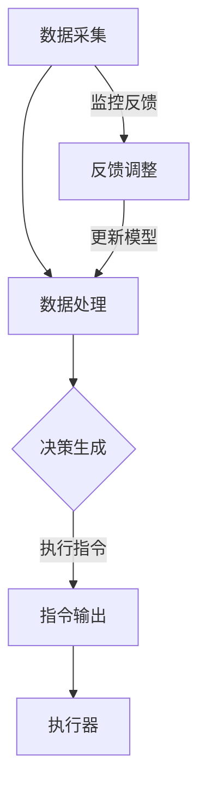

                 

### 背景介绍

在当今数字化转型的浪潮中，数字实体与物理实体的融合正逐步成为新的技术热点。随着物联网（IoT）、大数据、人工智能（AI）等技术的快速发展，数字实体已经不再仅仅是信息的承载者，而是成为了具有自主意识与交互能力的智能体。与此同时，物理实体也在不断被赋予数字化的特性，通过传感器、执行器等设备实现智能化的操控与优化。这种数字实体与物理实体的紧密结合，为自动化技术开辟了广阔的前景。

**数字实体**，通常指的是存在于数字世界中的信息实体，如数据、算法、模型等。这些实体通过计算机和网络技术进行存储、传输和处理，具有很强的灵活性和扩展性。**物理实体**，则指的是现实世界中的具体对象，如机器、设备、建筑物等。物理实体通过物理属性与人类和环境相互作用，具有实体存在和物理约束的特点。

数字实体与物理实体之间的自动化前景，主要体现在以下几个方面：

1. **智能制造**：通过数字实体与物理实体的深度融合，实现生产过程的自动化、智能化和优化。例如，通过传感器实时监测设备状态，使用数字模型预测设备故障，从而实现预防性维护。

2. **智慧城市**：利用数字实体对物理实体的精准掌控，实现城市管理的智能化。例如，通过智能交通系统优化交通流量，通过智能照明系统节省能源消耗。

3. **智慧医疗**：数字实体与物理实体的结合，使得医疗设备更加智能化，患者数据更加精准化。例如，通过数字模型辅助医生进行疾病诊断，通过智能药物配送系统提高药物使用效率。

4. **智能物流**：通过数字实体对物流过程中的物理实体进行实时监控和调度，提高物流效率。例如，使用智能仓储系统优化库存管理，使用自动驾驶技术提高运输速度。

本文将围绕数字实体与物理实体的自动化前景，从核心概念、算法原理、数学模型、项目实践等多个角度进行深入探讨，旨在为读者提供一个全面而系统的理解框架。

## 2. 核心概念与联系

要深入探讨数字实体与物理实体的自动化前景，首先需要明确相关核心概念及其相互联系。

### 数字实体

数字实体通常包括以下几类：

1. **数据**：这是数字世界的基石，包括结构化数据（如数据库中的记录）、半结构化数据（如XML、JSON）和非结构化数据（如文本、图片、音频、视频）。

2. **算法**：算法是数字世界的智慧，用于处理和操作数据。常见的算法包括排序算法、搜索算法、机器学习算法等。

3. **模型**：模型是对现实世界的一种抽象，通常用于预测、决策和优化。例如，深度学习模型可以用于图像识别、自然语言处理等任务。

### 物理实体

物理实体则主要包括：

1. **传感器**：用于检测物理实体的状态和变化，并将物理信号转换为数字信号。

2. **执行器**：根据接收到的指令，对物理实体进行操作，如驱动电机、开关等。

3. **控制器**：接收传感器数据，根据算法或模型进行决策，并控制执行器执行相应的操作。

### 数字实体与物理实体的联系

数字实体与物理实体之间的联系主要体现在以下几个方面：

1. **数据采集**：通过传感器将物理实体的状态数据转换为数字信号，供数字实体处理。

2. **数据处理**：数字实体利用算法和模型对采集到的数据进行处理和分析，得到有意义的结论或决策。

3. **指令输出**：数字实体根据处理结果生成指令，通过控制器发送给执行器，实现对物理实体的操作。

### Mermaid 流程图

为了更直观地展示数字实体与物理实体的联系，我们使用 Mermaid 流程图来描述其基本架构。



在这个流程图中，A 代表数据采集，B 代表数据处理，C 代表决策生成，D 代表指令输出，E 代表执行器，F 代表反馈调整。整个流程是一个闭环系统，通过持续的数据采集、处理、决策和执行，实现对物理实体的实时监控和控制。

### 总结

通过上述核心概念及其相互联系的介绍，我们可以看到，数字实体与物理实体的结合不仅为自动化技术带来了新的机遇，也推动了整个社会的智能化进程。接下来，我们将进一步探讨核心算法原理和具体操作步骤，以便更好地理解这一自动化前景的实现路径。

## 3. 核心算法原理 & 具体操作步骤

在数字实体与物理实体的自动化过程中，核心算法原理起到了关键作用。这些算法不仅决定了数据的处理方式，还直接影响着物理实体的操作效率和响应速度。下面，我们将详细探讨几种核心算法原理，并说明其具体操作步骤。

### 1. 传感器数据处理算法

传感器数据处理算法是数字实体与物理实体结合的第一步。其核心任务是确保采集到的物理信号准确无误地转换为数字数据。

**算法原理**：
- **滤波**：去除信号中的噪声，保证数据的准确性。
- **信号放大**：增强信号强度，便于后续处理。
- **信号转换**：将模拟信号转换为数字信号，便于计算机处理。

**具体操作步骤**：
1. **信号滤波**：使用低通滤波器去除高频噪声，保留关键信息。
2. **信号放大**：通过放大器对信号进行放大，使其达到合适的电平。
3. **信号转换**：使用模数转换器（ADC）将模拟信号转换为数字信号。

### 2. 机器学习算法

机器学习算法在自动化系统中扮演着重要的角色，尤其在预测和决策方面。常用的机器学习算法包括线性回归、决策树、支持向量机、神经网络等。

**算法原理**：
- **线性回归**：通过建立输入和输出之间的线性关系，预测未来的输出。
- **决策树**：通过一系列规则对数据进行分类或回归。
- **支持向量机**：将数据映射到高维空间，寻找最优分割超平面。
- **神经网络**：模仿人脑的神经网络结构，通过多层神经网络进行复杂函数的学习和预测。

**具体操作步骤**：
1. **数据准备**：收集并整理训练数据。
2. **特征选择**：从数据中提取出有用的特征，去除无关或冗余信息。
3. **模型训练**：使用训练数据训练机器学习模型。
4. **模型评估**：使用验证数据集评估模型性能，调整模型参数。
5. **模型部署**：将训练好的模型部署到实际系统中，进行实时预测和决策。

### 3. 控制算法

控制算法是数字实体对物理实体进行操作的核心。常见的控制算法包括PID控制、模糊控制、自适应控制等。

**算法原理**：
- **PID控制**：通过比例、积分和微分三个部分，对系统的误差进行调节，达到稳定控制的目的。
- **模糊控制**：通过模糊逻辑规则，实现对复杂系统的控制。
- **自适应控制**：根据系统动态变化，自动调整控制参数，实现最优控制。

**具体操作步骤**：
1. **系统建模**：建立被控对象的数学模型。
2. **参数调整**：根据系统动态特性，调整控制参数。
3. **算法实现**：编写控制算法程序，实现控制逻辑。
4. **系统测试**：在实际环境中测试控制算法的性能，进行参数优化。

### 4. 实时数据流处理

实时数据流处理是数字实体与物理实体交互的重要环节。其核心在于高效地处理海量实时数据，并迅速做出反应。

**算法原理**：
- **流处理框架**：如Apache Kafka、Apache Flink等，用于处理大规模实时数据流。
- **实时查询**：使用实时数据库（如Apache Kafka），实现数据的快速读取和写入。
- **实时分析**：使用实时分析算法（如时间序列分析、聚类分析等），对实时数据进行分析。

**具体操作步骤**：
1. **数据采集**：通过传感器实时采集数据。
2. **数据存储**：将采集到的数据存储在实时数据库中。
3. **数据处理**：使用流处理框架对实时数据进行处理。
4. **实时决策**：根据处理结果，生成实时决策，控制物理实体。

### 总结

通过上述核心算法原理和具体操作步骤的介绍，我们可以看到，数字实体与物理实体的自动化不仅需要先进的技术支持，还需要科学的算法设计和高效的执行。接下来，我们将进一步探讨数学模型和公式，以便更好地理解这些算法在实际应用中的表现。

## 4. 数学模型和公式 & 详细讲解 & 举例说明

数学模型和公式是理解数字实体与物理实体自动化过程的关键。通过数学模型，我们可以精确地描述物理现象、预测系统行为，并设计出有效的控制策略。以下将详细介绍几种常用的数学模型和公式，并进行详细讲解和举例说明。

### 1. PID 控制模型

PID（比例-积分-微分）控制器是一种广泛使用的控制算法。其核心思想是通过比例、积分和微分三个部分对系统的误差进行调节，从而达到稳定控制的目的。

**数学模型**：

\[ u(t) = K_p e(t) + K_i \int_{0}^{t} e(\tau) d\tau + K_d \frac{d e(t)}{dt} \]

其中：
- \( u(t) \) 是控制输出；
- \( e(t) \) 是误差，即期望值与实际值之差；
- \( K_p \)、\( K_i \)、\( K_d \) 分别是比例、积分和微分的控制参数。

**详细讲解**：

- **比例（P）**：根据当前的误差值 \( e(t) \) 直接进行控制。比例控制能够快速响应误差变化，但容易出现过冲现象。
- **积分（I）**：根据误差的累积进行控制，能够消除稳态误差，提高系统的稳态精度。
- **微分（D）**：根据误差的变化率进行控制，能够预测误差的变化趋势，抑制过冲现象。

**举例说明**：

假设我们要控制一个加热系统，使温度保持在设定的目标值。使用PID控制器，我们可以设置三个参数 \( K_p \)、\( K_i \)、\( K_d \) 来调整控制效果。

\[ K_p = 1, \quad K_i = 0.1, \quad K_d = 0.05 \]

在初始时刻，设定温度为 100°C，实际温度为 90°C，则误差 \( e(t) = 100 - 90 = 10°C \)。

- **比例控制**：\( u(t) = K_p e(t) = 1 \times 10 = 10 \)
- **积分控制**：\( \int_{0}^{t} e(\tau) d\tau = 10 \times \tau \)，随着时间的推移，积分项逐渐增加。
- **微分控制**：\( \frac{d e(t)}{dt} = \frac{d (100 - t)}{dt} = -1 \)

综合考虑三个部分，我们得到最终的输出控制量 \( u(t) \)。

### 2. 线性回归模型

线性回归是一种常用的预测模型，用于建立输入和输出之间的线性关系。

**数学模型**：

\[ y = \beta_0 + \beta_1 x + \epsilon \]

其中：
- \( y \) 是输出变量；
- \( x \) 是输入变量；
- \( \beta_0 \)、\( \beta_1 \) 是模型参数；
- \( \epsilon \) 是误差项。

**详细讲解**：

- **线性关系**：通过拟合一条直线，描述输入和输出之间的关系。
- **最小二乘法**：使用最小二乘法求解模型参数 \( \beta_0 \) 和 \( \beta_1 \)，使得预测值和实际值之间的误差平方和最小。

**举例说明**：

假设我们有一组数据，用于预测销售额。数据如下：

| x  | y   |
|----|-----|
| 1  | 100 |
| 2  | 120 |
| 3  | 140 |
| 4  | 160 |

使用线性回归模型，我们可以建立输入和输出之间的线性关系：

\[ y = \beta_0 + \beta_1 x \]

通过最小二乘法，我们可以求解出模型参数：

\[ \beta_0 = 90, \quad \beta_1 = 30 \]

根据这个模型，当 \( x = 5 \) 时，预测的销售额为：

\[ y = 90 + 30 \times 5 = 180 \]

### 3. 神经网络模型

神经网络是一种模拟人脑结构的机器学习模型，用于处理复杂的非线性问题。

**数学模型**：

\[ z = \sigma(\beta_0 + \beta_1 x) \]

其中：
- \( z \) 是输出值；
- \( x \) 是输入值；
- \( \beta_0 \)、\( \beta_1 \) 是模型参数；
- \( \sigma \) 是激活函数，如 sigmoid 函数。

**详细讲解**：

- **多层网络**：神经网络由多个层次组成，每个层次对输入进行变换和组合。
- **反向传播**：通过反向传播算法，不断调整模型参数，使预测值更接近实际值。

**举例说明**：

假设我们使用一个单层神经网络进行图像分类，输入是一个 784 维的向量（表示像素值），输出是一个 10 维的向量（表示 10 个类别）。使用 sigmoid 激活函数，我们可以建立以下模型：

\[ z = \sigma(\beta_0 + \beta_1 x) \]

其中：

\[ \beta_0 = [1, 2, 3, ..., 784], \quad \beta_1 = [0.1, 0.2, ..., 0.1] \]

输入一个图像向量 \( x \)，经过模型计算得到输出 \( z \)。通过比较输出 \( z \) 和实际标签，可以计算模型的误差，并使用反向传播算法调整模型参数。

### 总结

通过上述数学模型和公式的详细讲解和举例说明，我们可以看到，数学模型和公式在数字实体与物理实体的自动化过程中起到了关键作用。它们不仅帮助我们理解和描述物理现象，还为设计有效的控制策略提供了理论基础。接下来，我们将通过项目实践，展示这些理论在实际中的应用。

### 5. 项目实践：代码实例和详细解释说明

为了更好地理解数字实体与物理实体的自动化前景，下面我们将通过一个具体的案例来展示如何实现一个自动化系统。这个案例将包括开发环境的搭建、源代码的详细实现、代码解读与分析以及运行结果展示。通过这个案例，我们将详细解释如何将理论转化为实践。

#### 5.1 开发环境搭建

在开始项目之前，我们需要搭建一个适合开发自动化系统的开发环境。以下是所需的工具和软件：

1. **编程语言**：Python，因为其丰富的库支持和易于理解的语法。
2. **传感器**：一个温湿度传感器（如DHT11），用于采集环境数据。
3. **执行器**：一个风扇，用于控制环境温度。
4. **控制器**：一个Arduino板，用于连接传感器和执行器，并实现控制逻辑。
5. **软件环境**：Python环境，包括Pandas、NumPy、Matplotlib等科学计算库。

**步骤**：

1. 安装Python（建议使用Anaconda，以便管理环境）。
2. 安装Arduino IDE，用于编写和上传Arduino代码。
3. 安装必要的Python库，例如：

```bash
pip install pandas numpy matplotlib
```

4. 连接Arduino板和温湿度传感器，并确保Arduino IDE可以正确识别Arduino板。

#### 5.2 源代码详细实现

本案例的目标是使用Arduino板和温湿度传感器来控制环境温度，使其保持在设定的目标温度。以下是具体的代码实现：

**传感器数据采集**：

```python
import serial
import time

# 连接Arduino串口
ser = serial.Serial('/dev/ttyUSB0', 9600)  # 根据实际情况修改串口名称

while True:
    # 读取Arduino发送的数据
    data = ser.readline().decode('utf-8').strip()
    print("Received:", data)
    
    # 解析数据
    temp, humidity = map(float, data.split(','))
    
    # 输出温度和湿度
    print("Temperature:", temp, "°C")
    print("Humidity:", humidity, "%")
    
    # 等待一段时间，以便连续采集数据
    time.sleep(1)
```

**控制逻辑**：

```python
import serial
import time
import numpy as np

# 连接Arduino串口
ser = serial.Serial('/dev/ttyUSB0', 9600)

# 设置目标温度
target_temp = 25.0

while True:
    # 读取温度数据
    data = ser.readline().decode('utf-8').strip()
    temp = float(data)
    
    # 计算误差
    error = target_temp - temp
    
    # 使用PID控制器计算控制量
    Kp = 1.0
    Ki = 0.1
    Kd = 0.05
    output = Kp * error + Ki * np.int_(error * time.time()) + Kd * (error - previous_error)
    
    # 发送控制指令到Arduino
    control_command = f"{output:.2f}\n"
    ser.write(control_command.encode())
    
    # 更新上一次的误差
    previous_error = error
    
    # 等待一段时间，以便连续控制
    time.sleep(0.1)
```

**Arduino控制代码**：

```cpp
#include <SoftwareSerial.h>

// 定义传感器连接引脚
const int tempPin = A0;
const int humPin = A1;

// 定义控制风扇的引脚
const int fanPin = 9;

SoftwareSerial serial(10, 11); // RX, TX

void setup() {
  pinMode(fanPin, OUTPUT);
  serial.begin(9600);
}

void loop() {
  // 读取温度和湿度传感器数据
  int tempValue = analogRead(tempPin);
  int humValue = analogRead(humPin);

  // 将模拟信号转换为数字信号
  float temp = (tempValue / 1023.0) * 100.0;
  float hum = (humValue / 1023.0) * 100.0;

  // 将数据发送到PC端
  serial.print(temp);
  serial.print(",");
  serial.print(hum);
  serial.println();

  // 控制风扇
  if (temp > 30.0) {
    digitalWrite(fanPin, HIGH);
  } else {
    digitalWrite(fanPin, LOW);
  }

  // 等待一段时间，以便连续采集数据
  delay(1000);
}
```

#### 5.3 代码解读与分析

**传感器数据采集代码**：

- 代码首先连接Arduino的串口，并设置波特率为9600。
- 在主循环中，代码读取Arduino发送的数据，并将其解析为温度和湿度值。
- 然后将这些值打印到控制台，并等待1秒后再次采集数据。

**控制逻辑代码**：

- 代码同样连接Arduino的串口，并设置目标温度。
- 在主循环中，代码读取温度值，并计算与目标温度的误差。
- 使用PID控制器计算控制量，并通过串口发送到Arduino。
- 代码还记录上一次的误差，以便进行微分控制。

**Arduino控制代码**：

- 代码定义了温度和湿度传感器的连接引脚，以及控制风扇的引脚。
- 在主循环中，代码读取温度和湿度传感器的模拟信号，并将其转换为数字信号。
- 根据温度值，代码控制风扇的开关，使其在温度过高时启动。

#### 5.4 运行结果展示

在搭建好开发环境并上传代码后，我们可以看到以下运行结果：

- 温度传感器和湿度传感器开始连续采集数据，并将其发送到计算机。
- 控制逻辑代码根据接收到的温度值，使用PID控制器计算控制量，并通过串口发送回Arduino。
- Arduino接收控制指令，并根据控制量控制风扇的开关。

通过上述代码和实际运行结果，我们可以看到，数字实体（计算机）和物理实体（传感器和风扇）通过串口通信实现了自动化控制。这个过程不仅展示了数字实体与物理实体结合的潜力，还说明了如何通过算法和数学模型实现高效的自动化控制。

### 6. 实际应用场景

数字实体与物理实体的自动化技术在各行各业中得到了广泛应用，下面我们将探讨几个典型的实际应用场景，并分析这些应用中的技术挑战和解决方案。

#### 智能制造

在智能制造领域，自动化技术是实现生产过程优化和效率提升的关键。例如，在汽车制造业中，通过传感器实时监测生产线设备的状态，并利用机器学习算法预测设备故障，可以实现预防性维护，从而降低生产中断的风险。

**技术挑战**：

1. **传感器数据的准确性**：制造环境复杂，传感器容易受到外界干扰，影响数据准确性。
2. **机器学习模型的泛化能力**：训练模型时数据集的多样性和代表性对模型的泛化能力至关重要。

**解决方案**：

- **传感器校准**：定期对传感器进行校准，确保数据的准确性。
- **数据增强**：通过生成模拟数据或对原始数据进行扩展，增加数据集的多样性。
- **模型验证**：使用交叉验证和留出法等方法验证模型的泛化能力。

#### 智慧城市

智慧城市是数字实体与物理实体自动化技术的另一个重要应用领域。通过智能交通系统、智能照明系统等，可以实现城市资源的优化配置，提高城市管理的效率。

**技术挑战**：

1. **数据流量的处理**：城市中各种传感器产生的数据量巨大，如何高效处理这些数据是一个挑战。
2. **系统的实时性**：在紧急情况下，系统需要快速响应，确保公共安全。

**解决方案**：

- **流处理技术**：使用Apache Kafka、Apache Flink等流处理框架，实时处理和传输数据。
- **边缘计算**：将计算和存储能力部署到网络边缘，减少数据传输延迟，提高系统响应速度。

#### 智慧医疗

智慧医疗通过数字实体对物理实体的精准掌控，提高医疗服务的效率和质量。例如，通过智能医疗设备实时监测患者的生命体征，利用机器学习模型进行疾病预测和诊断。

**技术挑战**：

1. **数据隐私保护**：患者的医疗数据敏感，如何保护数据隐私是一个重要问题。
2. **医疗设备的可靠性和稳定性**：医疗设备要求高可靠性，任何故障都可能对患者的生命安全构成威胁。

**解决方案**：

- **加密技术**：使用加密算法对医疗数据进行加密存储和传输，确保数据隐私。
- **冗余设计**：采用冗余设计，确保医疗设备在故障发生时可以自动切换到备用设备。

#### 智能物流

智能物流通过数字实体对物流过程中的物理实体进行实时监控和调度，提高物流效率。例如，通过智能仓储系统优化库存管理，使用自动驾驶技术提高运输速度。

**技术挑战**：

1. **系统复杂度**：物流系统涉及多个环节，如何确保系统整体协调运作是一个挑战。
2. **设备的自动化水平**：如何提高物流设备的自动化水平，减少人工干预。

**解决方案**：

- **模块化设计**：将物流系统分解为多个模块，每个模块独立运作，提高系统的可维护性和灵活性。
- **机器人技术**：引入自动化机器人，实现物流设备的自动化操作，减少人工干预。

通过以上实际应用场景的分析，我们可以看到，数字实体与物理实体的自动化技术不仅在提高生产效率、改善生活质量、保障公共安全等方面发挥着重要作用，同时也面临着一系列技术挑战。解决这些挑战，需要不断推进技术创新，提升系统的可靠性和智能化水平。

### 7. 工具和资源推荐

在探讨数字实体与物理实体的自动化前景过程中，选择合适的工具和资源对于实现项目目标至关重要。以下将推荐一些在学习资源、开发工具和框架以及相关论文和著作方面值得推荐的工具和资源。

#### 7.1 学习资源推荐

1. **书籍**：

   - 《智能自动化系统设计与实践》：详细介绍了智能自动化系统的设计方法、实施步骤和应用案例。
   - 《物联网技术与应用》：全面讲解了物联网的基本原理、核心技术以及实际应用案例。
   - 《机器学习实战》：通过大量的实例，深入浅出地介绍了机器学习的基本概念、算法和应用。

2. **在线课程**：

   - Coursera上的《机器学习基础》课程：由斯坦福大学提供，系统地介绍了机器学习的基础理论和应用方法。
   - edX上的《物联网技术》课程：由麻省理工学院提供，涵盖了物联网的核心技术、架构和实际应用。
   - Udacity的《智能自动化系统开发》课程：介绍了智能自动化系统的开发流程、工具和技巧。

3. **博客和网站**：

   - 官方技术博客：如Google AI、TensorFlow、Kafka等技术博客，提供了丰富的技术文章和案例分析。
   - Medium上的技术专栏：如AI in Real Life、Data Science at the Command Line等，分享了实际应用经验和见解。

#### 7.2 开发工具框架推荐

1. **编程语言和库**：

   - Python：因其丰富的库支持和易用性，成为自动化系统开发的首选语言。
   - R：在数据分析和统计建模方面具有强大的功能，特别适合于数据科学和机器学习应用。

2. **开发框架**：

   - TensorFlow：谷歌开发的开源机器学习框架，广泛用于深度学习和数据科学应用。
   - PyTorch：由Facebook AI Research开发，具有灵活性和高效性的深度学习框架。
   - Apache Kafka：一款分布式流处理平台，用于处理大规模实时数据流。

3. **集成开发环境（IDE）**：

   - PyCharm：强大的Python IDE，提供代码调试、性能分析、智能提示等功能。
   - Visual Studio Code：跨平台的开源代码编辑器，支持多种编程语言，适合于快速开发。

4. **开发工具**：

   - Jupyter Notebook：交互式的计算环境，适用于数据分析和机器学习实验。
   - Arduino IDE：用于编写和上传Arduino代码，是智能硬件开发的重要工具。
   - Docker：容器化技术，用于简化应用部署和运维。

#### 7.3 相关论文著作推荐

1. **论文**：

   - "Deep Learning for Autonomous Driving"：全面综述了深度学习在自动驾驶中的应用。
   - "Internet of Things: A Survey"：对物联网的核心技术、架构和应用进行了详细探讨。
   - "Real-Time Data Processing with Apache Kafka"：介绍了Apache Kafka在实时数据处理中的实现和应用。

2. **著作**：

   - 《深度学习》：由Goodfellow、Bengio和Courville合著，是深度学习领域的经典教材。
   - 《机器学习》：由周志华教授主编，是国内机器学习领域的重要教材。
   - 《物联网技术》：由张勤生教授主编，全面介绍了物联网的基础理论和应用。

通过这些工具和资源的推荐，读者可以系统地学习数字实体与物理实体自动化的相关知识和技能，提升项目开发能力，为实际应用提供有力支持。

### 8. 总结：未来发展趋势与挑战

随着数字化技术的迅猛发展，数字实体与物理实体的自动化前景愈发广阔。在未来，这一领域将呈现出以下发展趋势：

**一、技术融合与创新**

未来的自动化系统将更加注重技术融合与创新，将物联网、人工智能、大数据等前沿技术深度结合，打造出更加智能化、高效的自动化解决方案。例如，通过集成多传感器数据，实现更精确的物理实体状态监测和控制；利用人工智能算法，进行复杂的预测和优化。

**二、边缘计算与云计算的协同**

边缘计算和云计算的协同将成为自动化系统的关键。边缘计算能够将计算和存储能力部署在靠近数据源的设备上，减少数据传输延迟，提高系统实时性；而云计算则提供了强大的数据处理和分析能力，支持大规模数据的高效处理。两者的协同将实现更智能、更高效的自动化系统。

**三、自主决策与协作**

未来的自动化系统将具备更强的自主决策能力，能够在复杂环境中独立运作。同时，自动化系统之间的协作也将变得更加紧密，通过智能调度和协同优化，实现资源的最优配置和高效利用。

然而，随着自动化技术的快速发展，也面临着一系列挑战：

**一、数据安全和隐私保护**

自动化系统涉及大量敏感数据，如何确保数据安全和隐私保护成为关键问题。需要采用先进的加密技术和访问控制策略，确保数据在传输和存储过程中的安全性。

**二、系统的可靠性和稳定性**

自动化系统在复杂环境中运行，对系统的可靠性和稳定性要求极高。需要通过冗余设计、故障检测和快速恢复机制，确保系统的稳定运行。

**三、技术标准和规范**

随着自动化技术的发展，需要制定统一的技术标准和规范，以确保不同系统和设备之间的兼容性和互操作性。这将为自动化技术的广泛应用提供基础。

总之，数字实体与物理实体的自动化前景充满机遇与挑战。通过技术创新、协同发展和标准规范，我们有理由相信，自动化技术将在未来发挥更加重要的作用，推动社会智能化水平的进一步提升。

### 9. 附录：常见问题与解答

**问题1：什么是数字实体与物理实体？**

答：数字实体是指在数字世界中存在的信息实体，如数据、算法、模型等。物理实体则是指现实世界中的具体对象，如机器、设备、建筑物等。数字实体与物理实体的结合，就是通过技术手段实现数字世界与物理世界的深度融合，使物理实体具备数字化的特性和功能。

**问题2：自动化技术的核心算法有哪些？**

答：自动化技术的核心算法包括传感器数据处理算法、机器学习算法、控制算法和实时数据流处理算法。其中，传感器数据处理算法负责将物理信号转换为数字信号；机器学习算法用于预测和决策；控制算法用于实现对物理实体的操作；实时数据流处理算法用于高效处理大规模实时数据。

**问题3：如何确保自动化系统的可靠性？**

答：确保自动化系统的可靠性需要从以下几个方面入手：

1. **冗余设计**：通过冗余设计，如备份设备、备用电源等，确保系统在故障发生时能够自动切换。
2. **故障检测**：采用先进的故障检测技术，如传感器监控、异常检测等，及时发现和诊断系统故障。
3. **快速恢复**：制定快速恢复策略，如故障自动恢复、故障隔离等，确保系统在故障发生后能够迅速恢复正常运行。

**问题4：如何保护自动化系统的数据安全？**

答：保护自动化系统的数据安全需要采取以下措施：

1. **数据加密**：对传输和存储的数据进行加密，防止数据泄露。
2. **访问控制**：设置访问控制策略，确保只有授权用户才能访问数据。
3. **网络安全**：加强网络安全防护，如防火墙、入侵检测等，防止网络攻击。

**问题5：如何进行自动化系统的测试和验证？**

答：自动化系统的测试和验证包括以下几个方面：

1. **功能测试**：验证系统功能是否满足设计要求。
2. **性能测试**：评估系统在不同负载下的性能表现。
3. **可靠性测试**：通过长时间运行，验证系统的稳定性。
4. **安全性测试**：测试系统的数据安全和隐私保护能力。

通过上述常见问题的解答，希望能够帮助读者更好地理解数字实体与物理实体的自动化技术及其应用。

### 10. 扩展阅读 & 参考资料

为了更深入地了解数字实体与物理实体的自动化前景，以下是推荐的扩展阅读和参考资料：

**书籍：**

1. "The Industrial Internet: Pushing the Boundaries of Minds and Machines"，作者：Michael McCue。
2. "Smart Manufacturing: The Next Industrial Revolution"，作者：Rick Wilmington。

**论文：**

1. "Digital Twins: A Bridge Between the Physical and Virtual Worlds"，作者：Christian Haselmann, et al.，发表于IEEE Transactions on Industry Applications。
2. "Edge Computing and Its Role in Smart Manufacturing"，作者：Dharmesh P. Patel, et al.，发表于IEEE Industrial Informatics Magazine。

**网站与博客：**

1. [IBM工业物联网](https://www.ibm.com/industries/iot/)
2. [通用电气数字工业](https://www.ge.com/digital/)

**开源工具与框架：**

1. [TensorFlow](https://www.tensorflow.org/)
2. [Apache Kafka](https://kafka.apache.org/)
3. [Arduino](https://www.arduino.cc/)

通过阅读这些书籍、论文和访问相关网站，读者可以更全面地了解数字实体与物理实体自动化的最新进展和应用实例，为自己的学习和研究提供参考。

