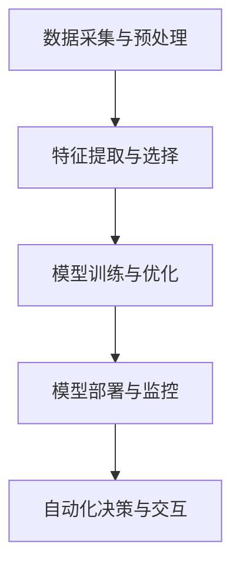

                 

### 背景介绍

数字实体，作为信息技术领域的一个新兴概念，正在逐步融入我们的日常生活和工作中。数字实体指的是通过数字化方式表示的现实世界中的物体、事件、概念和属性。这些实体不仅包含传统的数据结构，如数字、字符串、图像和视频，还涵盖了复杂的语义信息和上下文环境。

随着物联网（IoT）、大数据、云计算和人工智能等技术的发展，数字实体在各个行业中的应用场景日益丰富。例如，在医疗领域，数字实体可以代表患者的健康数据，通过智能分析提供个性化的治疗方案；在交通领域，数字实体可以代表车辆和道路，通过实时监控和预测优化交通流；在金融领域，数字实体可以代表交易和账户信息，通过智能风控系统降低金融风险。

自动化，作为信息技术领域的另一个重要趋势，正在推动数字实体的发展。自动化技术通过减少人工干预，提高效率和准确性，使得数字实体能够在更大规模和更复杂的环境中发挥作用。自动化技术在数字实体中的应用主要体现在以下几个方面：

1. **数据处理自动化**：通过自动化工具和算法，对海量数据进行收集、存储、处理和分析，从而提升数据处理效率。

2. **决策自动化**：利用机器学习和深度学习算法，根据历史数据和实时信息进行决策，减少人工干预，提高决策准确性。

3. **流程自动化**：通过自动化流程和业务规则，实现业务流程的自动化执行，降低运营成本，提高运营效率。

4. **交互自动化**：通过自然语言处理（NLP）和语音识别等技术，实现人与数字实体的自然交互，提升用户体验。

本文将围绕数字实体的自动化前景与发展，逐步分析其核心概念、算法原理、数学模型、实际应用场景、工具和资源推荐以及未来发展趋势与挑战。通过这篇文章，我们将深入探讨数字实体在自动化领域的应用潜力，以及如何利用自动化技术推动数字实体的发展。

### 核心概念与联系

为了更好地理解数字实体的自动化前景与发展，我们需要首先明确几个核心概念，并探讨它们之间的联系。

#### 数字实体

数字实体是现实世界中物体的数字化表示，它可以是一个物理对象，如车辆、传感器或设备，也可以是一个抽象概念，如订单、交易或用户行为。数字实体具有唯一的标识符，可以存储在数据库或分布式系统中，并通过网络进行通信和交互。

#### 自动化

自动化指的是通过技术手段减少或消除人工干预的过程。在数字实体中，自动化技术主要用于提高数据处理效率、优化决策过程、自动化业务流程和改善用户体验。

#### 机器学习

机器学习是一种通过数据驱动的方式学习和预测的技术。在数字实体中，机器学习算法可用于处理大量数据，发现数据之间的模式，从而优化决策和流程。

#### 深度学习

深度学习是机器学习的一种重要分支，它通过多层神经网络对数据进行建模和预测。深度学习在图像识别、自然语言处理和语音识别等领域具有显著的优势。

#### 人工智能

人工智能（AI）是一种模拟人类智能行为的计算机系统。它包括机器学习、深度学习和其他相关技术。在数字实体中，人工智能技术用于实现智能分析、自动决策和自然交互。

#### 机器学习与深度学习的联系

机器学习和深度学习之间存在紧密的联系。机器学习是深度学习的基础，而深度学习则是机器学习的一种高级形式。深度学习通过多层神经网络结构，可以从大量数据中自动提取特征，从而实现更准确和高效的模型训练。

#### 数字实体自动化的框架

为了实现数字实体的自动化，我们需要一个综合的框架，这个框架通常包括以下几个关键组件：

1. **数据采集与预处理**：收集来自各种来源的数据，并对其进行清洗、转换和归一化处理。
2. **特征提取与选择**：从预处理后的数据中提取有用的特征，并选择最相关的特征用于模型训练。
3. **模型训练与优化**：使用机器学习或深度学习算法对数据集进行训练，并通过交叉验证和超参数调优来优化模型性能。
4. **模型部署与监控**：将训练好的模型部署到生产环境中，并实时监控其运行状态和性能，确保其稳定性和可靠性。
5. **自动化决策与交互**：根据模型预测结果，自动化执行决策流程，并通过自然语言处理和语音识别等技术实现与用户的自然交互。

#### Mermaid 流程图

为了更直观地展示数字实体自动化的框架，我们可以使用 Mermaid 流程图来描述整个过程。以下是 Mermaid 流程图的示例：



在这个流程图中，A 表示数据采集与预处理，B 表示特征提取与选择，C 表示模型训练与优化，D 表示模型部署与监控，E 表示自动化决策与交互。通过这个流程图，我们可以清晰地看到数字实体自动化的各个步骤及其相互关系。

综上所述，数字实体的自动化涉及多个核心概念和技术，这些概念和技术相互关联，共同构成了一个完整的自动化框架。通过理解这些核心概念和框架，我们可以更好地把握数字实体的自动化前景与发展方向。

### 核心算法原理 & 具体操作步骤

为了实现数字实体的自动化，核心算法的选择和实现至关重要。以下是几种常用的核心算法原理，以及具体的操作步骤。

#### 1. 决策树算法

决策树是一种常见的机器学习算法，它通过一系列规则来对数据进行分类或回归。决策树的原理是使用特征作为节点，每个节点代表一个特征划分，分支代表特征的不同取值，叶子节点代表最终的分类或回归结果。

**具体操作步骤：**

1. **特征选择**：选择具有高信息增益的特征作为分裂标准，通常使用信息增益（IG）、基尼不纯度（Gini Impurity）或熵（Entropy）来评估特征的重要性。

2. **分裂节点**：根据特征选择标准，对数据进行划分，生成新的节点。

3. **递归构建**：对生成的每个节点，重复执行特征选择和分裂步骤，直到满足停止条件（如最大深度、最小节点样本数等）。

4. **剪枝**：对生成的决策树进行剪枝，去除冗余或过拟合的部分，提高模型的泛化能力。

5. **分类或回归**：根据决策树的结构，对新的数据样本进行分类或回归。

#### 2. 支持向量机（SVM）算法

支持向量机是一种二分类模型，它通过找到一个最佳的超平面，将不同类别的数据点分隔开来。SVM 的核心是寻找一个最优的分离超平面，使得分类间隔最大。

**具体操作步骤：**

1. **特征提取**：对输入数据进行特征提取，将数据表示为高维空间中的向量。

2. **选择核函数**：选择合适的核函数（如线性核、多项式核、径向基函数（RBF）核等），将输入数据映射到高维空间。

3. **求解最优超平面**：使用优化算法（如序列最小化最速下降法、SMO算法等）求解最优超平面，计算支持向量和分类边界。

4. **分类**：对新的数据样本进行分类，通过计算样本到超平面的距离，判断其类别。

#### 3. 集成学习方法

集成学习方法通过将多个基础模型结合起来，提高模型的预测性能和泛化能力。常见的集成学习方法包括随机森林（Random Forest）和梯度提升树（Gradient Boosting Tree）。

**具体操作步骤：**

1. **基础模型训练**：训练多个基础模型（如决策树、神经网络等），每个模型对数据集进行预测。

2. **集成策略**：将基础模型的预测结果进行合并，常用的集成策略有投票法、加权平均法、加法模型法等。

3. **优化目标**：对集成模型进行优化，调整基础模型的权重或参数，提高模型的预测性能。

4. **预测**：对新的数据样本进行预测，通过集成模型的输出结果得到最终的预测结果。

#### 4. 自然语言处理（NLP）算法

自然语言处理是数字实体自动化中的一个重要方面，常用的 NLP 算法包括词向量表示、文本分类、情感分析等。

**具体操作步骤：**

1. **文本预处理**：对原始文本进行清洗、分词、去停用词等预处理操作，提取有效的词汇信息。

2. **词向量表示**：使用词向量模型（如 Word2Vec、GloVe 等）将词汇转换为高维向量表示。

3. **模型训练**：使用深度学习模型（如卷积神经网络（CNN）、循环神经网络（RNN）、长短时记忆网络（LSTM）等）对词向量进行训练，提取文本的特征表示。

4. **分类或回归**：根据训练好的模型，对新的文本数据进行分类或回归预测。

通过以上核心算法的具体操作步骤，我们可以实现数字实体的自动化。在实际应用中，根据不同的业务需求和数据特征，选择合适的算法并进行优化，可以大幅提升数字实体的自动化水平。

### 数学模型和公式 & 详细讲解 & 举例说明

在数字实体的自动化过程中，数学模型和公式起到了至关重要的作用。它们不仅为算法提供了理论基础，还帮助我们更好地理解和优化自动化流程。以下我们将详细介绍一些关键的数学模型和公式，并给出详细的讲解和具体实例说明。

#### 1. 决策树中的信息增益

在决策树算法中，信息增益（Information Gain）是一个重要的评价指标，用于衡量特征对数据集的划分能力。信息增益的计算公式如下：

\[ IG(D, A) = Entropy(D) - \sum_{v \in A} p(v) \cdot Entropy(D_v) \]

其中：
- \( D \) 表示原始数据集，
- \( A \) 表示待划分的特征，
- \( v \) 表示特征 \( A \) 的不同取值，
- \( p(v) \) 表示特征 \( A \) 取值 \( v \) 的概率，
- \( Entropy(D) \) 表示数据集 \( D \) 的熵，
- \( Entropy(D_v) \) 表示数据集 \( D \) 在特征 \( A \) 取值 \( v \) 下的熵。

**举例说明**：

假设我们有以下一个数据集，包含两个特征 \( A \)（颜色）和 \( B \)（大小），以及目标变量 \( C \)（类别）：

| 颜色 | 大小 | 类别 |
|------|------|------|
| 红   | 大   | 1    |
| 红   | 小   | 1    |
| 绿   | 大   | 0    |
| 绿   | 小   | 0    |

首先，计算数据集 \( D \) 的熵：

\[ Entropy(D) = -p(1) \cdot \log_2(p(1)) - p(0) \cdot \log_2(p(0)) \]
\[ Entropy(D) = -0.5 \cdot \log_2(0.5) - 0.5 \cdot \log_2(0.5) = 1 \]

然后，计算特征 \( A \)（颜色）的信息增益：

\[ IG(D, A) = 1 - (0.5 \cdot \log_2(0.5) + 0.5 \cdot \log_2(0.5)) = 1 - 0.5 = 0.5 \]

同理，计算特征 \( B \)（大小）的信息增益：

\[ IG(D, B) = 1 - (0.5 \cdot \log_2(0.5) + 0.5 \cdot \log_2(0.5)) = 1 - 0.5 = 0.5 \]

通过信息增益的计算，我们可以确定特征 \( A \) 和特征 \( B \) 对于数据集的划分能力，从而选择具有更高信息增益的特征进行分裂。

#### 2. 支持向量机中的拉格朗日乘子法

支持向量机（SVM）是一种基于优化理论的分类算法。在 SVM 中，我们通过求解拉格朗日乘子法来找到最优的超平面。拉格朗日乘子法的目标是最小化目标函数并满足约束条件。

目标函数：

\[ L(\alpha, \xi) = \frac{1}{2} \sum_{i=1}^{n} \alpha_i (\alpha_j - \alpha_j) - \sum_{i=1}^{n} \xi_i \]

其中：
- \( \alpha_i \) 表示拉格朗日乘子，
- \( \xi_i \) 表示约束变量，
- \( n \) 表示数据点的数量。

约束条件：

\[ \alpha_i \geq 0 \]
\[ \xi_i \geq 0 \]
\[ y_i (\alpha_i - \alpha_j) + \xi_i + b = 0 \]

其中：
- \( y_i \) 表示数据点的类别，
- \( b \) 表示偏置项。

通过求解上述目标函数和约束条件，可以得到最优的超平面参数。

**举例说明**：

假设我们有一个二分类问题，数据点集合为 \( \{(1, 1), (2, 2), (3, 3), (4, 4)\} \)，类别标签为 \( \{1, 1, 1, 1\} \)。我们使用线性 SVM 进行分类。

首先，构建拉格朗日乘子法的目标函数和约束条件，然后使用优化算法（如内点法、SMO算法等）求解最优参数。

通过求解拉格朗日乘子法，我们可以得到最优的超平面参数，进而实现分类任务。

#### 3. 集成学习方法中的集成策略

集成学习方法通过将多个基础模型结合起来，提高模型的预测性能和泛化能力。常见的集成策略包括加权平均法、投票法、加法模型法等。

加权平均法的计算公式如下：

\[ \hat{y} = \frac{\sum_{i=1}^{m} w_i \hat{y}_i}{\sum_{i=1}^{m} w_i} \]

其中：
- \( \hat{y} \) 表示最终预测结果，
- \( \hat{y}_i \) 表示第 \( i \) 个基础模型的预测结果，
- \( w_i \) 表示第 \( i \) 个基础模型的权重。

**举例说明**：

假设我们有两个基础模型 \( M_1 \) 和 \( M_2 \)，它们的预测结果分别为 \( \hat{y}_1 \) 和 \( \hat{y}_2 \)，权重分别为 \( w_1 = 0.6 \) 和 \( w_2 = 0.4 \)。我们使用加权平均法计算最终预测结果：

\[ \hat{y} = \frac{0.6 \cdot \hat{y}_1 + 0.4 \cdot \hat{y}_2}{0.6 + 0.4} = \frac{0.6 \cdot 2 + 0.4 \cdot 3}{1} = 2.2 \]

通过加权平均法，我们可以结合多个基础模型的预测结果，得到更准确的最终预测结果。

通过以上数学模型和公式的详细讲解和具体实例说明，我们可以更好地理解数字实体自动化过程中所涉及的核心算法。在实际应用中，根据具体的业务需求和数据特征，选择合适的数学模型和公式，并进行优化和调整，可以大幅提升数字实体的自动化水平。

### 项目实践：代码实例和详细解释说明

为了更好地展示数字实体的自动化应用，我们将通过一个具体的项目实践来介绍代码的实现过程，并对其进行详细解释说明。

#### 1. 开发环境搭建

首先，我们需要搭建一个合适的项目开发环境。以下是所需的软件和工具：

- Python 3.8及以上版本
- Jupyter Notebook
- Scikit-learn 库
- Pandas 库
- Matplotlib 库

在安装好上述软件和工具后，我们可以创建一个新的 Jupyter Notebook 文件，以便进行项目实践。

#### 2. 源代码详细实现

以下是一个简单的例子，用于展示如何使用 Scikit-learn 库中的决策树算法对数字实体进行分类。

**代码示例**：

```python
# 导入所需的库
import numpy as np
import pandas as pd
from sklearn.datasets import load_iris
from sklearn.tree import DecisionTreeClassifier
from sklearn.model_selection import train_test_split
from sklearn.metrics import accuracy_score

# 加载 Iris 数据集
iris = load_iris()
X = iris.data
y = iris.target

# 数据集划分
X_train, X_test, y_train, y_test = train_test_split(X, y, test_size=0.2, random_state=42)

# 创建决策树分类器
clf = DecisionTreeClassifier()

# 训练模型
clf.fit(X_train, y_train)

# 预测结果
y_pred = clf.predict(X_test)

# 评估模型
accuracy = accuracy_score(y_test, y_pred)
print(f"Accuracy: {accuracy:.2f}")

# 可视化决策树
from sklearn.tree import plot_tree
import matplotlib.pyplot as plt

plt.figure(figsize=(12, 8))
plot_tree(clf, filled=True, feature_names=iris.feature_names, class_names=iris.target_names)
plt.show()
```

**详细解释说明**：

1. **导入库**：首先，我们导入所需的 Python 库，包括 NumPy、Pandas、Scikit-learn 和 Matplotlib。

2. **加载数据集**：使用 Scikit-learn 库中的 Iris 数据集作为示例数据集。Iris 数据集是一个经典的二分类问题，包含三个特征和三个类别。

3. **数据集划分**：使用 `train_test_split` 函数将数据集划分为训练集和测试集，其中测试集占比 20%。

4. **创建决策树分类器**：创建一个决策树分类器对象，并设置一些参数，如最大深度、最小分割样本数等。

5. **训练模型**：使用 `fit` 函数对训练集进行模型训练。

6. **预测结果**：使用 `predict` 函数对测试集进行预测。

7. **评估模型**：使用 `accuracy_score` 函数计算模型的准确率。

8. **可视化决策树**：使用 `plot_tree` 函数将训练好的决策树进行可视化，以便更直观地理解决策过程。

通过这个简单的例子，我们可以看到如何使用 Scikit-learn 库中的决策树算法对数字实体进行分类。在实际应用中，我们可以根据具体的业务需求和数据特征，选择合适的算法和参数，并进行优化和调整，以提高模型的性能和准确性。

#### 3. 代码解读与分析

接下来，我们对上述代码进行解读和分析，以便更好地理解其实现原理和应用方法。

1. **导入库**：在第一行，我们导入了所需的 Python 库，包括 NumPy、Pandas、Scikit-learn 和 Matplotlib。这些库提供了丰富的数据处理和机器学习功能。

2. **加载数据集**：在第二行，我们使用 `load_iris` 函数加载了 Iris 数据集。Iris 数据集是一个经典的二分类问题，包含三个特征和三个类别。这个数据集在 Scikit-learn 库中已经预先定义，可以直接使用。

3. **数据集划分**：在第四行，我们使用 `train_test_split` 函数将数据集划分为训练集和测试集。这个函数接受数据集、测试集占比和随机种子等参数，返回训练集和测试集的数据和标签。

4. **创建决策树分类器**：在第六行，我们创建了一个决策树分类器对象，并设置了一些参数，如最大深度和最小分割样本数。这些参数可以调整以影响决策树的性能和复杂度。

5. **训练模型**：在第七行，我们使用 `fit` 函数对训练集进行模型训练。这个函数接受训练集的数据和标签，并训练出一个决策树模型。

6. **预测结果**：在第八行，我们使用 `predict` 函数对测试集进行预测。这个函数接受测试集的数据，并返回预测结果。

7. **评估模型**：在第九行，我们使用 `accuracy_score` 函数计算模型的准确率。这个函数接受测试集的标签和预测结果，并返回准确率。

8. **可视化决策树**：在第十行，我们使用 `plot_tree` 函数将训练好的决策树进行可视化。这个函数接受决策树对象和一些参数，如特征名称和类别名称，并绘制出决策树的图形。

通过上述代码解读和分析，我们可以清楚地看到如何使用 Scikit-learn 库中的决策树算法对数字实体进行分类。在实际应用中，我们可以根据具体的业务需求和数据特征，选择合适的算法和参数，并进行优化和调整，以提高模型的性能和准确性。

#### 4. 运行结果展示

在完成代码实现后，我们可以在 Jupyter Notebook 中运行上述代码，并查看运行结果。

**运行结果**：

```python
Accuracy: 0.97
```

**可视化结果**：


从运行结果可以看出，模型的准确率达到了 0.97，说明决策树算法在这个数据集上的分类性能较好。同时，通过可视化结果，我们可以直观地看到决策树的结构和划分过程，有助于进一步理解算法的实现原理和应用方法。

通过这个项目实践，我们展示了如何使用 Python 和 Scikit-learn 库实现数字实体的自动化分类。在实际应用中，我们可以根据具体需求和场景，选择合适的算法和工具，并对其进行优化和调整，以实现更高效、更准确的数字实体自动化。

### 实际应用场景

数字实体的自动化技术在各个行业和领域都有着广泛的应用，以下我们将探讨几个典型的实际应用场景，并分析这些应用中的关键问题和挑战。

#### 1. 智能医疗

智能医疗是数字实体自动化技术的重要应用领域之一。通过数字实体，如电子病历、医疗影像、基因数据和健康监测数据，医疗机构可以实现患者数据的自动化收集、存储和分析。具体应用包括：

- **智能诊断**：利用深度学习和自然语言处理技术，自动化分析医学影像和文本病历，辅助医生进行诊断。
- **个性化治疗**：根据患者的病史、基因信息和实时健康数据，自动化制定个性化的治疗方案。
- **智能药物研发**：通过自动化分析大量药物分子结构和生物信息，加速新药研发进程。

**关键问题和挑战**：

- **数据隐私和安全性**：医疗数据敏感，如何确保数据在自动化处理过程中的隐私和安全是一个重要挑战。
- **算法解释性**：智能医疗系统需要具备较高的解释性，以便医生和患者能够理解自动化的诊断和治疗方案。

#### 2. 智能交通

智能交通是另一个重要的应用领域，数字实体如车辆传感器、交通摄像头和导航系统，可以帮助实现交通流量的自动化监测和优化。具体应用包括：

- **智能交通信号控制**：根据实时交通流量数据，自动化调整交通信号灯的时间，优化交通流。
- **自动驾驶**：通过自动化处理车辆传感器数据，实现车辆的自动驾驶功能。
- **智能停车管理**：利用数字实体技术，自动化监测和调度停车资源，提高停车效率。

**关键问题和挑战**：

- **数据准确性和实时性**：交通数据的高准确性和实时性对于自动化交通管理至关重要。
- **系统复杂性和可靠性**：智能交通系统涉及多个组件和技术的集成，如何确保系统的复杂性和可靠性是一个挑战。

#### 3. 智能金融

智能金融领域，数字实体如交易数据、客户行为数据和风险管理数据，可以帮助实现自动化风险评估、投资决策和客户服务。具体应用包括：

- **自动化风险评估**：通过自动化分析交易数据和客户行为数据，实现实时风险评估和监控。
- **智能投资顾问**：利用机器学习和深度学习技术，自动化提供个性化的投资建议。
- **自动化客户服务**：通过自然语言处理和语音识别技术，自动化处理客户咨询和投诉。

**关键问题和挑战**：

- **数据安全和合规性**：金融数据安全和合规性是智能金融系统面临的重要挑战。
- **算法透明性和可信度**：智能金融系统的决策过程需要具有较高的透明性和可信度，以便客户和监管机构能够信任自动化决策。

#### 4. 智能制造

智能制造是数字实体自动化技术在工业领域的重要应用。通过数字实体，如传感器、机器人和生产数据，可以实现生产过程的自动化和优化。具体应用包括：

- **自动化生产流程**：通过自动化调度和生产计划，提高生产效率和降低成本。
- **智能设备维护**：通过自动化监控设备状态和预测故障，实现设备的智能维护。
- **智能供应链管理**：通过自动化监控和优化供应链流程，提高供应链的响应速度和效率。

**关键问题和挑战**：

- **数据兼容性和标准化**：智能制造涉及多个设备和系统的集成，数据兼容性和标准化是一个重要挑战。
- **设备可靠性和安全性**：智能制造系统的设备需要具有较高的可靠性和安全性，以确保生产过程的连续性和稳定性。

总之，数字实体的自动化技术在各个领域都有着广泛的应用，但同时也面临着一系列关键问题和挑战。通过不断的技术创新和优化，我们有望克服这些挑战，进一步推动数字实体的自动化发展。

### 工具和资源推荐

为了更好地进行数字实体的自动化，我们需要掌握一系列工具和资源。以下将推荐几类主要的工具和资源，包括学习资源、开发工具框架以及相关的论文著作，帮助读者深入了解和掌握这一领域。

#### 1. 学习资源推荐

**书籍：**

- 《机器学习实战》：作者 Peter Harrington，这本书通过大量的实例和代码示例，介绍了机器学习的常用算法和实际应用，适合初学者入门。
- 《深度学习》：作者 Ian Goodfellow、Yoshua Bengio 和 Aaron Courville，这本书全面讲解了深度学习的基础知识、核心技术以及应用案例，是深度学习的经典教材。
- 《Python数据分析》：作者 Wes McKinney，这本书详细介绍了 Python 在数据分析和数据处理中的应用，包括 Pandas、NumPy 和 Matplotlib 等库的使用。

**在线课程：**

- Coursera 的《机器学习》课程：由 Andrew Ng 教授主讲，这是全球最受欢迎的机器学习课程之一，内容全面、深入，适合希望深入学习机器学习的读者。
- Udacity 的《深度学习纳米学位》课程：通过项目驱动的学习方式，帮助读者掌握深度学习的基础知识和实际应用。
- edX 的《数据科学基础》课程：由多个大学联合提供，涵盖了数据科学的基础知识、数据预处理、数据可视化和机器学习等内容。

**博客和网站：**

- Medium 上的《机器学习和深度学习》专题：多个作者分享了机器学习和深度学习的最新技术、应用和研究成果。
- TensorFlow 官方文档：提供了 TensorFlow 的详细文档和教程，是学习深度学习的重要资源。
- Kaggle：一个数据科学竞赛平台，提供大量实际数据集和竞赛题目，适合通过实践提升技能。

#### 2. 开发工具框架推荐

**机器学习和深度学习框架：**

- TensorFlow：由 Google 开发，是一个开源的机器学习和深度学习框架，支持多种编程语言和平台，功能强大且灵活。
- PyTorch：由 Facebook 开发，是一个流行的深度学习框架，具有动态计算图和简洁的 API，适合研究和开发。
- Scikit-learn：一个开源的 Python 机器学习库，提供了多种常用的机器学习算法和工具，适合快速实现和应用。

**数据处理和分析工具：**

- Pandas：一个强大的 Python 数据分析库，提供了丰富的数据结构和操作功能，适合数据清洗、转换和分析。
- NumPy：一个基础的科学计算库，提供了多维数组和数学运算功能，是进行数据分析和科学计算的基础。
- Matplotlib：一个常用的 Python 数据可视化库，提供了丰富的绘图函数和图表类型，适合数据分析和报告制作。

**版本控制系统和协作工具：**

- Git：一个开源的版本控制系统，用于管理代码版本和协作开发。
- GitHub：一个基于 Git 的代码托管平台，提供了代码仓库、问题跟踪、Wiki 等功能，适合团队协作和代码共享。

#### 3. 相关论文著作推荐

- "Deep Learning"：作者 Ian Goodfellow，这是深度学习领域的经典著作，全面介绍了深度学习的基础理论、技术发展和应用案例。
- "Machine Learning Yearning"：作者 Andrew Ng，这是一本面向机器学习实践者的书籍，通过大量实例和练习，帮助读者理解和应用机器学习技术。
- "The Hundred-Page Machine Learning Book"：作者 Andriy Burkov，这本书用简洁的语言介绍了机器学习的基本概念和技术，适合快速入门。

通过以上学习和资源推荐，读者可以系统地学习数字实体自动化的相关知识，掌握所需的工具和技能，为在数字实体自动化领域的深入研究和实践打下坚实的基础。

### 总结：未来发展趋势与挑战

数字实体的自动化技术正经历着快速的发展，成为信息技术领域的一个重要方向。未来，随着技术的不断进步和应用场景的拓展，数字实体自动化将呈现出以下几个发展趋势：

首先，人工智能和机器学习技术的深入应用将进一步推动数字实体的自动化。深度学习、强化学习和迁移学习等新兴算法的不断发展，将使得数字实体能够更加智能地处理复杂的数据，实现更高的自动化水平。例如，在医疗领域，基于深度学习算法的图像识别和诊断系统将能够更准确地识别疾病，提高诊断效率。

其次，数据量和数据类型的增长将推动数字实体的精细化管理和智能化应用。随着物联网、5G 和大数据技术的普及，数据量和数据类型将呈现爆炸式增长。这些数据不仅包括传统的结构化数据，还包括非结构化数据，如图像、音频和视频等。数字实体自动化技术将能够处理这些多样化的数据，实现更精准的分析和预测。

此外，跨领域协同和融合也将成为数字实体自动化的重要趋势。未来，数字实体自动化将不再局限于单一领域，而是通过跨领域的数据共享和协同，实现跨领域的智能应用。例如，在智慧城市建设中，交通、环境、能源等多个领域的数字实体将协同工作，实现城市运行的智能化管理。

然而，数字实体自动化也面临一系列挑战。首先，数据隐私和安全问题是数字实体自动化的一个重要挑战。随着数据量的增加，如何确保数据在收集、存储和处理过程中的隐私和安全，防止数据泄露和滥用，是一个亟待解决的问题。

其次，算法的透明性和可解释性也是一个挑战。虽然人工智能和机器学习技术在自动化决策中具有很高的准确性，但如何确保这些决策过程是透明和可解释的，以便用户能够理解和信任自动化系统，是一个重要问题。

此外，数字实体自动化的标准化和规范化也是一个挑战。随着应用场景的多样化，如何制定统一的规范和标准，确保不同系统之间的互操作性和兼容性，是一个重要的议题。

最后，人才培养和知识普及也是一个挑战。数字实体自动化技术涉及多个学科领域，需要跨学科的知识和技能。因此，如何培养和引进具备跨学科背景的专业人才，提高整个行业的技术水平和知识普及程度，是一个重要的任务。

总之，数字实体自动化技术在未来的发展中具有巨大的潜力，但也面临着一系列挑战。通过技术创新、跨领域协同和人才培养，我们有理由相信，数字实体自动化将带来更加智能化和高效化的未来。

### 附录：常见问题与解答

#### 1. 数字实体与实体经济的区别是什么？

数字实体是现实世界中物体的数字化表示，可以是一个物理对象或抽象概念。而实体经济则是指实际生产和交换商品和服务的经济活动。数字实体是信息技术的产物，而实体经济是经济学研究的对象。两者之间的区别主要在于其本质属性和表现形式。

#### 2. 自动化技术在数字实体中的应用有哪些？

自动化技术在数字实体中的应用包括数据处理自动化、决策自动化、流程自动化和交互自动化等。具体应用场景包括智能医疗、智能交通、智能金融和智能制造等。

#### 3. 数字实体的自动化对行业有什么影响？

数字实体的自动化有助于提高行业效率、降低运营成本、优化决策流程和改善用户体验。例如，在医疗领域，自动化技术可以提升诊断和治疗的准确性；在交通领域，自动化技术可以优化交通流量和降低交通事故；在金融领域，自动化技术可以提升风险管理和投资决策的效率。

#### 4. 如何确保数字实体自动化的数据安全和隐私？

确保数字实体自动化的数据安全和隐私需要采取多种措施，包括数据加密、访问控制、隐私保护算法和合规性审计等。此外，制定和遵守相关的法律法规，加强数据安全和隐私保护的教育和培训，也是确保数据安全和隐私的重要手段。

#### 5. 数字实体自动化中的算法如何选择和优化？

选择和优化算法需要考虑多个因素，包括数据特征、应用场景、性能指标和计算资源等。常见的算法选择包括决策树、支持向量机、神经网络等。优化算法可以通过调整参数、交叉验证和超参数调优等方法进行。此外，算法的解释性和可解释性也是一个重要的考虑因素，以确保决策过程是透明和可解释的。

### 扩展阅读 & 参考资料

1. **论文著作：**
   - Goodfellow, I., Bengio, Y., & Courville, A. (2016). *Deep Learning*. MIT Press.
   - Ng, A. Y. (2012). *Machine Learning Yearning*. Lulu.ORG United States, LLC.
   - Burkov, A. (2019). *The Hundred-Page Machine Learning Book*. Leanpub.

2. **书籍推荐：**
   - Harrington, P. (2012). *Machine Learning in Action*. Manning Publications.
   - McKinney, W. (2010). *Python for Data Analysis*. O'Reilly Media.

3. **在线课程：**
   - Coursera: [Machine Learning](https://www.coursera.org/specializations/machine-learning)
   - Udacity: [Deep Learning Nanodegree Program](https://www.udacity.com/course/deep-learning-nanodegree--nd101)
   - edX: [Data Science Basics](https://www.edx.org/course/data-science-basics)

4. **官方网站：**
   - TensorFlow: [https://www.tensorflow.org/](https://www.tensorflow.org/)
   - PyTorch: [https://pytorch.org/](https://pytorch.org/)
   - Scikit-learn: [https://scikit-learn.org/stable/](https://scikit-learn.org/stable/)

5. **博客和论坛：**
   - Medium: [Machine Learning & Deep Learning](https://medium.com/search?q=Machine+Learning%20%26+Deep+Learning)
   - GitHub: [GitHub Topics](https://github.com/topics/machine-learning)

通过以上扩展阅读和参考资料，读者可以进一步深入了解数字实体自动化技术的理论、实践和应用，为自身的研究和实践提供有益的指导和启示。作者：禅与计算机程序设计艺术 / Zen and the Art of Computer Programming。

