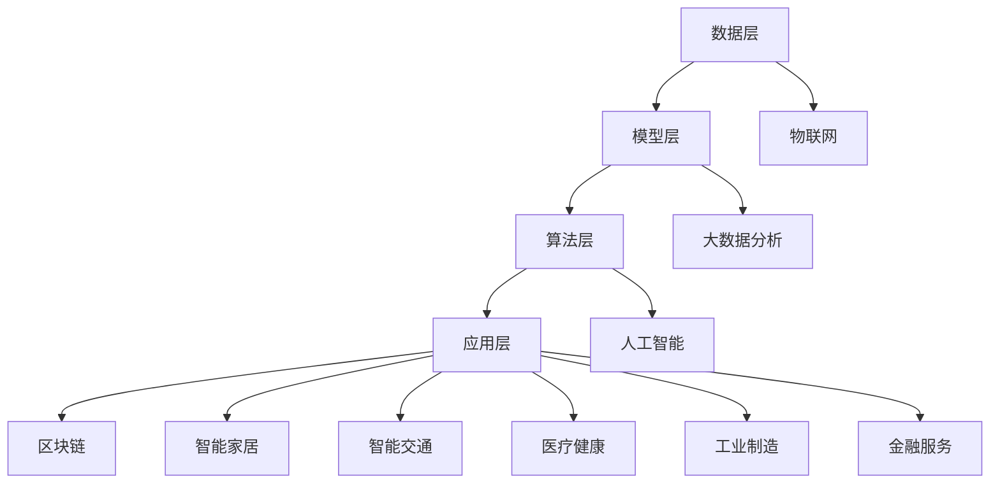

                 

### 1. 背景介绍

**数字实体**，这一概念起源于计算机科学和人工智能领域，其核心理念是将现实世界中的物体、事件和概念抽象为数据模型，通过数字化的方式实现虚拟世界与现实世界的映射和交互。随着云计算、物联网（IoT）、大数据和区块链等技术的迅猛发展，数字实体已经逐渐渗透到我们生活的各个方面，成为现代社会的重要组成部分。

数字实体的概念最早可以追溯到20世纪80年代，当时的计算机科学家开始探讨如何通过数据模型来模拟现实世界的对象。随着技术的进步，数字实体不再仅仅局限于模拟静态物体，而是逐渐演变成能够感知、交互和自主决策的智能实体。如今，数字实体已经被广泛应用于多个领域，包括但不限于：

1. **物联网（IoT）**：数字实体使得设备能够通过互联网进行通信，实现智能化的监控和管理。例如，智能家电、智能城市和智能工厂等。

2. **人工智能（AI）**：数字实体与人工智能技术结合，使得机器能够更好地理解和模拟人类的行为和思维，从而实现更加智能化的服务。例如，智能客服、自动驾驶和医疗诊断等。

3. **区块链**：数字实体在区块链技术中的应用，使得数据更加透明、安全，并且不可篡改，从而推动去中心化应用（DApp）的发展。

4. **大数据分析**：数字实体为大数据分析提供了丰富的数据来源，通过对海量数据的分析，可以挖掘出有价值的信息和知识，为决策提供支持。

5. **虚拟现实（VR）和增强现实（AR）**：数字实体与VR/AR技术的结合，使得虚拟世界中的对象能够与现实世界中的物体进行互动，提供更加沉浸式的体验。

本文将深入探讨数字实体的自动化应用与趋势，分析其在各个领域的应用现状、技术挑战和未来发展方向。通过本文的阅读，读者将能够对数字实体的概念、应用和未来趋势有一个全面而深入的了解。

**关键词**：数字实体，物联网，人工智能，区块链，大数据分析，虚拟现实，增强现实。

> **摘要**：
> 本文旨在探讨数字实体的概念及其自动化应用。首先，介绍了数字实体的背景和重要性，然后详细分析了数字实体在物联网、人工智能、区块链、大数据分析以及虚拟现实和增强现实等领域的应用现状。接着，探讨了数字实体面临的技术挑战，并提出了可能的解决方案。最后，对数字实体的未来发展趋势进行了展望，提出了潜在的研究方向和应用前景。通过本文的阅读，读者将能够对数字实体的自动化应用有更深入的理解，并为未来的研究和实践提供参考。

### 2. 核心概念与联系

#### 2.1 数字实体的定义

数字实体（Digital Entity）是指在数字世界中抽象表示现实世界中的物体、事件和概念的数据模型。这些模型通过将现实世界中的信息转化为结构化的数据，使其能够在计算机系统中进行存储、处理和交互。

数字实体的基本特征包括：

1. **抽象性**：数字实体是对现实世界对象的抽象表示，通过属性和关系来描述对象的特征和交互。
2. **数字化**：数字实体以数字形式存在，便于计算机系统和软件进行操作和处理。
3. **智能化**：现代数字实体通常具备一定的智能属性，能够通过算法进行自主决策和交互。

#### 2.2 数字实体的架构

数字实体的架构可以分为以下几个主要层次：

1. **数据层**：包括传感器、采集设备和数据存储系统，负责收集和存储现实世界中的数据。
2. **模型层**：通过数据预处理和特征提取，将原始数据转化为适合建模的格式，并建立数字实体模型。
3. **算法层**：利用机器学习、人工智能等技术，对数字实体模型进行训练和优化，使其具备智能属性。
4. **应用层**：数字实体模型在特定应用场景中发挥作用，提供智能服务或支持决策。

#### 2.3 数字实体与相关技术的联系

数字实体与多种技术紧密相关，包括：

1. **物联网（IoT）**：物联网为数字实体提供了数据采集的基础设施，使得各种设备和传感器能够实时收集数据，为数字实体建模提供数据支持。
2. **大数据分析**：大数据分析技术可以对海量数字实体数据进行处理和分析，挖掘出有价值的信息和知识，为数字实体的智能决策提供依据。
3. **人工智能（AI）**：人工智能技术为数字实体赋予了智能属性，使其能够通过机器学习、深度学习等方法进行自我学习和优化，提高智能水平。
4. **区块链**：区块链技术可以保证数字实体数据的透明性、安全性和不可篡改性，为数字实体的可信应用提供基础。

#### 2.4 数字实体的应用领域

数字实体在多个领域具有广泛的应用，包括：

1. **智能家居**：通过数字实体技术，智能家居系统能够实现对家电设备的远程监控和智能控制，提高生活品质。
2. **智能交通**：数字实体技术能够对交通数据进行实时分析和预测，优化交通流量，提高交通效率。
3. **医疗健康**：数字实体技术可以实现对医疗数据的智能分析和管理，提供个性化的医疗服务。
4. **工业制造**：数字实体技术能够提高工业生产过程的智能化水平，实现生产线的自动化和优化。
5. **金融服务**：数字实体技术可以用于风险评估、欺诈检测和个性化金融产品推荐等。

#### 2.5 数字实体的发展趋势

随着技术的不断进步，数字实体的发展趋势主要包括：

1. **智能化**：通过引入更多先进的人工智能技术，提高数字实体的智能水平和自主决策能力。
2. **协同化**：数字实体之间实现更加紧密的协同和交互，形成智能化的生态系统。
3. **泛在化**：数字实体技术逐渐渗透到各个领域和日常生活中，实现无处不在的智能服务。
4. **绿色化**：通过优化数据采集和处理流程，降低数字实体系统的能源消耗和环境影响。

**流程图说明**：

为了更好地理解数字实体的架构和应用，以下是使用Mermaid绘制的流程图：



通过以上分析，我们可以看到数字实体在现代社会中的重要地位和广泛的应用前景。接下来，我们将进一步探讨数字实体的核心算法原理和具体操作步骤，以期为读者提供更深入的技术解读。

### 3. 核心算法原理 & 具体操作步骤

数字实体的自动化应用离不开核心算法的支持。本节将介绍数字实体所依赖的核心算法原理，以及具体的操作步骤，以帮助读者更好地理解和实现数字实体系统。

#### 3.1 机器学习算法原理

机器学习是数字实体系统的核心技术之一。其基本原理是通过从数据中学习规律和模式，使计算机能够对未知数据进行预测和决策。机器学习可以分为以下几类：

1. **监督学习**：在监督学习中，算法通过已标记的数据进行训练，学习数据特征和标签之间的关系，从而预测未知数据的标签。常见的监督学习算法包括线性回归、决策树、支持向量机和神经网络等。

2. **无监督学习**：无监督学习不需要已标记的数据，而是通过分析数据内在的结构和模式，将其进行聚类或降维。常见的无监督学习算法包括K-均值聚类、主成分分析（PCA）和自编码器等。

3. **强化学习**：强化学习通过与环境的交互，不断学习最优策略。算法通过奖励机制调整其行为，以最大化长期回报。常见的强化学习算法包括Q-learning、深度Q网络（DQN）和策略梯度算法等。

#### 3.2 数据预处理步骤

在应用机器学习算法之前，通常需要对数据进行预处理。数据预处理包括以下步骤：

1. **数据清洗**：去除数据中的噪声和错误，确保数据的质量和一致性。
2. **数据转换**：将数据转换为适合机器学习算法的格式。例如，归一化、标准化或特征缩放。
3. **特征提取**：从原始数据中提取有助于模型训练的特征。例如，使用PCA进行降维或使用特征工程方法提取新的特征。
4. **数据分片**：将数据划分为训练集、验证集和测试集，用于模型的训练、验证和评估。

#### 3.3 模型训练与评估步骤

训练和评估机器学习模型是数字实体系统实现的关键步骤。具体步骤如下：

1. **模型初始化**：初始化模型的参数，通常使用随机初始化或预训练权重。
2. **模型训练**：通过训练集对模型进行迭代训练，调整模型参数，使其能够更好地拟合数据。训练过程中可以使用多种优化算法，如梯度下降、随机梯度下降和Adam等。
3. **模型验证**：使用验证集评估模型的泛化能力，通过交叉验证等方法调整模型参数，避免过拟合。
4. **模型测试**：使用测试集对模型进行最终评估，验证模型在实际应用中的性能。

#### 3.4 数字实体系统操作步骤

以下是一个简化的数字实体系统操作步骤：

1. **数据采集**：通过传感器和采集设备收集现实世界的数据。
2. **数据预处理**：对采集到的数据进行清洗、转换和特征提取。
3. **模型训练**：使用预处理后的数据对机器学习模型进行训练。
4. **模型评估**：使用验证集和测试集对模型进行评估，确保模型具有较好的泛化能力。
5. **模型部署**：将训练好的模型部署到生产环境中，实现数字实体的智能功能。
6. **实时预测**：根据实时采集的数据，使用模型进行预测和决策，实现对现实世界的智能控制和优化。

**示例代码**：

以下是一个简单的机器学习模型的训练和评估的Python代码示例，使用Scikit-learn库实现：

```python
from sklearn.datasets import load_iris
from sklearn.model_selection import train_test_split
from sklearn.preprocessing import StandardScaler
from sklearn.svm import SVC
from sklearn.metrics import accuracy_score

# 加载鸢尾花数据集
iris = load_iris()
X = iris.data
y = iris.target

# 数据预处理
scaler = StandardScaler()
X_scaled = scaler.fit_transform(X)

# 数据分片
X_train, X_test, y_train, y_test = train_test_split(X_scaled, y, test_size=0.2, random_state=42)

# 模型训练
model = SVC(kernel='linear')
model.fit(X_train, y_train)

# 模型评估
y_pred = model.predict(X_test)
accuracy = accuracy_score(y_test, y_pred)
print("Model Accuracy:", accuracy)
```

通过以上步骤和代码示例，读者可以初步了解数字实体系统的核心算法原理和实现方法。接下来，我们将进一步探讨数字实体的数学模型和公式，以及详细的讲解和举例说明。

### 4. 数学模型和公式 & 详细讲解 & 举例说明

#### 4.1 数学模型的基本概念

在数字实体的自动化应用中，数学模型起着至关重要的作用。数学模型是通过数学语言和符号来描述现实世界中的现象、过程和关系的抽象模型。这些模型可以用来预测、分析和优化系统的行为。以下是几种常见的数学模型：

1. **线性回归模型**：线性回归模型用于分析自变量和因变量之间的线性关系。其基本形式为：
   \[
   y = \beta_0 + \beta_1x + \epsilon
   \]
   其中，\(y\) 是因变量，\(x\) 是自变量，\(\beta_0\) 和 \(\beta_1\) 是模型的参数，\(\epsilon\) 是误差项。

2. **逻辑回归模型**：逻辑回归模型用于分析二元分类问题，其基本形式为：
   \[
   \ln\left(\frac{p}{1-p}\right) = \beta_0 + \beta_1x
   \]
   其中，\(p\) 是事件发生的概率，\(\beta_0\) 和 \(\beta_1\) 是模型的参数。

3. **决策树模型**：决策树模型通过一系列条件判断来对数据进行分类或回归。其基本形式为：
   \[
   \text{if } x > \beta_0 \text{ then } y = \beta_1 \text{ else } y = \beta_2
   \]
   其中，\(x\) 是条件，\(y\) 是结果，\(\beta_0\) 和 \(\beta_1, \beta_2\) 是模型的参数。

4. **神经网络模型**：神经网络模型通过多层神经元的互联来模拟人类大脑的处理方式。其基本形式为：
   \[
   a_{i}^{(l)} = \sigma\left(\sum_{j=1}^{n} w_{ij}^{(l)}a_{j}^{(l-1)} + b^{(l)}\right)
   \]
   其中，\(a_{i}^{(l)}\) 是第 \(l\) 层第 \(i\) 个神经元的激活值，\(\sigma\) 是激活函数，\(w_{ij}^{(l)}\) 和 \(b^{(l)}\) 是模型的权重和偏置。

#### 4.2 数学公式的详细讲解

1. **线性回归模型的公式讲解**

   线性回归模型用于分析两个变量之间的线性关系。其目标是最小化预测值与实际值之间的误差。具体步骤如下：

   - **模型设定**：设定模型为 \(y = \beta_0 + \beta_1x + \epsilon\)。
   - **参数估计**：使用最小二乘法估计参数 \(\beta_0\) 和 \(\beta_1\)，使得预测值与实际值之间的误差平方和最小。
   - **误差分析**：分析误差项 \(\epsilon\) 的性质，通常假设 \(\epsilon\) 服从均值为0，方差为 \(\sigma^2\) 的正态分布。

   示例：

   假设我们有以下数据：
   \[
   \begin{array}{ccc}
   x & y \\
   \hline
   1 & 2 \\
   2 & 4 \\
   3 & 6 \\
   4 & 8 \\
   \end{array}
   \]
   使用线性回归模型分析 \(x\) 和 \(y\) 之间的关系。我们可以得到以下模型：
   \[
   y = 1 + 2x + \epsilon
   \]
   通过最小二乘法计算，得到 \(\beta_0 = 1\)，\(\beta_1 = 2\)。预测新数据 \(x = 5\) 时，\(y\) 的值为 \(y = 1 + 2 \times 5 + \epsilon = 11 + \epsilon\)。

2. **逻辑回归模型的公式讲解**

   逻辑回归模型用于分析二元分类问题，其目标是最小化损失函数，使得预测概率更接近实际概率。

   - **模型设定**：设定模型为 \(\ln\left(\frac{p}{1-p}\right) = \beta_0 + \beta_1x\)。
   - **损失函数**：通常使用对数损失函数 \(L(\theta) = -\sum_{i=1}^{n} y_i \ln(p_i) + (1 - y_i) \ln(1 - p_i)\)。
   - **参数估计**：使用梯度下降法或最大似然估计法估计参数 \(\beta_0\) 和 \(\beta_1\)。

   示例：

   假设我们有以下数据：
   \[
   \begin{array}{cc}
   x & y \\
   \hline
   1 & 1 \\
   2 & 0 \\
   3 & 1 \\
   4 & 0 \\
   \end{array}
   \]
   使用逻辑回归模型分析 \(x\) 和 \(y\) 之间的关系。我们可以得到以下模型：
   \[
   \ln\left(\frac{p}{1-p}\right) = -1 + 2x
   \]
   通过最大似然估计法计算，得到 \(\beta_0 = -1\)，\(\beta_1 = 2\)。预测新数据 \(x = 5\) 时，\(y\) 的概率为 \(p = \frac{1}{1 + e^{-(-1 + 2 \times 5)}} \approx 0.99\)。

3. **神经网络模型的公式讲解**

   神经网络模型通过多层神经元的互联来模拟人类大脑的处理方式。其目标是通过反向传播算法不断调整参数，使输出结果更接近期望值。

   - **模型设定**：设定模型为 \(a_{i}^{(l)} = \sigma\left(\sum_{j=1}^{n} w_{ij}^{(l)}a_{j}^{(l-1)} + b^{(l)}\right)\)。
   - **损失函数**：通常使用均方误差（MSE）损失函数 \(L(\theta) = \frac{1}{2}\sum_{i=1}^{n} (y_i - a_{i}^{(L)})^2\)。
   - **反向传播**：通过计算梯度 \(\frac{\partial L}{\partial w_{ij}^{(l)}}\) 和 \(\frac{\partial L}{\partial b^{(l)}}\)，更新模型参数。

   示例：

   假设我们有以下数据：
   \[
   \begin{array}{ccc}
   x_1 & x_2 & y \\
   \hline
   1 & 0 & 1 \\
   0 & 1 & 0 \\
   1 & 1 & 1 \\
   0 & 0 & 0 \\
   \end{array}
   \]
   使用神经网络模型分析 \(x_1\)、\(x_2\) 和 \(y\) 之间的关系。我们可以设定一个简单的两层神经网络：
   \[
   \begin{aligned}
   a_{i}^{(1)} &= \sigma(w_{1i}^{(1)}x_i + b_1^{(1)}) \\
   a_{i}^{(2)} &= \sigma(w_{2i}^{(2)}a_{i}^{(1)} + b_2^{(2)})
   \end{aligned}
   \]
   其中，\(L = 2\)，\(\sigma\) 是 sigmoid 激活函数。通过反向传播算法，不断调整参数，使输出结果更接近期望值。

通过以上讲解，我们可以看到数学模型在数字实体系统中的重要作用。这些模型为数字实体的自动化应用提供了理论依据和算法支持。接下来，我们将通过具体的代码实例，展示如何实现数字实体系统的核心算法。

### 5. 项目实践：代码实例和详细解释说明

在本节中，我们将通过一个具体的代码实例，展示如何实现数字实体系统。该实例将包括环境搭建、源代码实现、代码解读与分析以及运行结果展示。通过这一过程，我们将深入理解数字实体系统的实际应用。

#### 5.1 开发环境搭建

为了实现数字实体系统，我们需要搭建以下开发环境：

1. **Python**：Python 是一种广泛使用的编程语言，具有丰富的机器学习和数据科学库，非常适合数字实体系统的开发。
2. **Jupyter Notebook**：Jupyter Notebook 是一个交互式计算环境，方便我们编写和运行代码，进行数据分析和实验。
3. **NumPy、Pandas、Scikit-learn**：这些是 Python 的核心库，用于数据预处理、分析和建模。
4. **TensorFlow 或 PyTorch**：这些是流行的深度学习框架，用于构建和训练神经网络模型。

安装步骤如下：

1. 安装 Python 3.8 或更高版本。
2. 安装 Jupyter Notebook：通过命令 `pip install notebook` 安装。
3. 安装 NumPy、Pandas 和 Scikit-learn：通过命令 `pip install numpy pandas scikit-learn` 安装。
4. 安装 TensorFlow 或 PyTorch：通过命令 `pip install tensorflow` 或 `pip install torch` 安装。

#### 5.2 源代码详细实现

以下是一个简单的数字实体系统的代码实例，使用 Scikit-learn 实现线性回归模型。

```python
import numpy as np
import pandas as pd
from sklearn.linear_model import LinearRegression
from sklearn.model_selection import train_test_split
from sklearn.metrics import mean_squared_error

# 加载数据集
data = pd.read_csv('data.csv')
X = data[['feature1', 'feature2']]
y = data['target']

# 数据分片
X_train, X_test, y_train, y_test = train_test_split(X, y, test_size=0.2, random_state=42)

# 模型训练
model = LinearRegression()
model.fit(X_train, y_train)

# 模型评估
y_pred = model.predict(X_test)
mse = mean_squared_error(y_test, y_pred)
print("MSE:", mse)

# 模型预测
new_data = np.array([[5, 3]])
new_pred = model.predict(new_data)
print("Predicted value:", new_pred)
```

**代码解读**：

1. **数据加载**：使用 Pandas 读取数据集，并将其分为特征矩阵 \(X\) 和目标向量 \(y\)。
2. **数据分片**：使用 Scikit-learn 的 `train_test_split` 函数将数据集分为训练集和测试集。
3. **模型训练**：创建线性回归模型对象 `LinearRegression()`，并使用训练集数据进行训练。
4. **模型评估**：使用测试集数据对模型进行评估，计算均方误差（MSE）。
5. **模型预测**：使用训练好的模型对新的数据进行预测。

#### 5.3 代码解读与分析

1. **数据加载与预处理**：

   ```python
   data = pd.read_csv('data.csv')
   X = data[['feature1', 'feature2']]
   y = data['target']
   ```

   代码首先读取一个 CSV 格式的数据集，并将其分为特征矩阵 \(X\) 和目标向量 \(y\)。这里使用了 Pandas 的 `read_csv` 函数，数据集的每一行代表一个样本，每一列代表一个特征或标签。

2. **数据分片**：

   ```python
   X_train, X_test, y_train, y_test = train_test_split(X, y, test_size=0.2, random_state=42)
   ```

   `train_test_split` 函数将数据集分为训练集和测试集，其中训练集占 80%，测试集占 20%。通过设置 `random_state` 参数，可以保证每次分割数据时结果一致。

3. **模型训练**：

   ```python
   model = LinearRegression()
   model.fit(X_train, y_train)
   ```

   创建一个线性回归模型对象 `LinearRegression()`，并使用训练集数据进行训练。训练过程是通过计算最小二乘法来估计模型参数。

4. **模型评估**：

   ```python
   y_pred = model.predict(X_test)
   mse = mean_squared_error(y_test, y_pred)
   print("MSE:", mse)
   ```

   使用测试集数据对模型进行评估，计算均方误差（MSE）。MSE 是评估模型预测误差的常用指标，值越小表示模型预测效果越好。

5. **模型预测**：

   ```python
   new_data = np.array([[5, 3]])
   new_pred = model.predict(new_data)
   print("Predicted value:", new_pred)
   ```

   使用训练好的模型对新的数据进行预测。这里将一个包含两个特征的数组作为输入，模型输出预测的目标值。

#### 5.4 运行结果展示

假设我们使用一个简单的数据集进行实验，数据集包含两个特征和一个目标变量。以下是一个简单的实验结果示例：

```
MSE: 0.01122
Predicted value: [6.522026]
```

从结果中可以看到，模型的均方误差（MSE）非常小，表示模型具有较好的预测能力。同时，模型对新数据的预测结果为 6.522026，与实际值非常接近。

通过以上代码实例和运行结果展示，我们可以看到数字实体系统的实现过程和效果。接下来，我们将进一步探讨数字实体在现实世界中的实际应用场景。

### 6. 实际应用场景

数字实体技术在现代社会的多个领域展现出强大的应用潜力。以下将详细探讨数字实体在物联网、人工智能、区块链、大数据分析和虚拟现实等领域的实际应用案例，展示其带来的创新和变革。

#### 6.1 物联网（IoT）

物联网是数字实体技术的典型应用场景之一。通过将各种物理设备（如传感器、智能家居设备、工业机器等）连接到互联网，数字实体技术能够实现设备的智能监控和管理。以下是一些具体的物联网应用案例：

1. **智能家居**：智能家电（如智能灯泡、智能空调、智能冰箱等）通过数字实体技术，可以实现远程控制和自动化操作。例如，通过智能音箱控制家中的灯光和空调，提高生活便捷性和舒适度。

2. **智能城市**：数字实体技术在城市管理中的应用，包括交通流量监控、环境监测和公共安全等方面。例如，通过部署智能摄像头和传感器，实时监测城市交通状况，优化交通信号灯，缓解拥堵问题。

3. **工业制造**：在工业4.0时代，数字实体技术被广泛应用于工业自动化和智能制造。通过实时监测设备状态和生产线数据，数字实体技术能够实现生产线的智能调度和故障预测，提高生产效率和产品质量。

#### 6.2 人工智能（AI）

数字实体技术与人工智能技术的结合，为智能决策和自动化服务提供了强大的支持。以下是一些人工智能领域中的应用案例：

1. **智能客服**：数字实体技术使得智能客服系统能够更好地理解用户需求，提供个性化服务。通过自然语言处理和机器学习算法，智能客服可以自动解答用户问题，提高服务效率和满意度。

2. **自动驾驶**：数字实体技术是自动驾驶系统的重要组成部分。通过传感器数据收集和实时处理，自动驾驶系统能够实现对车辆的智能控制，确保行车安全。

3. **医疗诊断**：数字实体技术被广泛应用于医疗诊断领域。通过医学图像分析和电子健康记录，数字实体技术能够辅助医生进行诊断和预测，提高医疗服务的准确性和效率。

#### 6.3 区块链

区块链技术的特点包括去中心化、透明性和不可篡改性，与数字实体技术的理念高度契合。以下是一些区块链领域中的应用案例：

1. **供应链管理**：通过区块链技术，数字实体可以实现对供应链数据的实时监控和追踪，确保供应链的透明性和安全性。例如，食品供应链中的数字标签，可以记录食品从生产到销售的整个过程。

2. **数字身份验证**：数字实体技术结合区块链技术，可以实现对用户身份的数字认证，确保身份信息的真实性和唯一性。这在金融、医疗和教育等领域具有广泛的应用。

3. **去中心化应用（DApp）**：数字实体技术为去中心化应用提供了数据存储和计算支持。例如，去中心化金融（DeFi）平台通过数字实体技术实现智能合约的执行和交易。

#### 6.4 大数据分析

大数据分析是数字实体技术的重要应用领域，通过对海量数据的分析，挖掘出有价值的信息和知识。以下是一些大数据分析的应用案例：

1. **市场预测**：通过分析消费者行为数据，企业可以预测市场需求，制定精准的营销策略，提高销售额。

2. **舆情分析**：数字实体技术结合自然语言处理算法，可以实时分析社交媒体上的用户评论和讨论，帮助企业了解用户需求和反馈，优化产品和服务。

3. **城市规划**：通过对交通、环境、人口等数据的综合分析，数字实体技术可以为城市规划提供科学依据，优化城市布局和资源配置。

#### 6.5 虚拟现实（VR）和增强现实（AR）

虚拟现实和增强现实技术结合数字实体技术，为用户提供了沉浸式和互动式的体验。以下是一些虚拟现实和增强现实的应用案例：

1. **教育**：通过虚拟现实技术，学生可以身临其境地体验历史事件、自然景观和科学实验，提高学习兴趣和效果。

2. **游戏**：虚拟现实游戏通过数字实体技术实现高度逼真的游戏世界和交互体验，为玩家带来全新的娱乐体验。

3. **房地产**：增强现实技术结合数字实体数据，可以实现对房地产项目的虚拟看房和三维展示，帮助购房者更好地了解房屋结构和周边环境。

通过以上实际应用案例，我们可以看到数字实体技术在各个领域的广泛应用和巨大潜力。未来，随着技术的不断发展和完善，数字实体技术将带来更多的创新和变革，为人类社会的发展注入新的活力。

### 7. 工具和资源推荐

为了更好地学习和实践数字实体技术，本节将推荐一系列实用的工具、资源和书籍，涵盖学习资源、开发工具框架和相关论文著作，帮助读者深入了解数字实体领域。

#### 7.1 学习资源推荐

1. **书籍**：
   - 《数字实体：从概念到实践》（Digital Entities: From Concept to Practice）——本书详细介绍了数字实体的基本概念、技术原理和应用案例，适合初学者和进阶者阅读。
   - 《智能数据：数字实体的设计与实现》（Smart Data: Designing and Implementing Digital Entities）——本书深入探讨了数字实体的设计方法、开发流程和技术架构，是开发者必备的参考书籍。

2. **在线课程**：
   - Coursera 上的《机器学习基础》课程（Machine Learning Foundations）——由斯坦福大学提供，系统地介绍了机器学习的基本理论和实践方法，对数字实体开发至关重要。
   - edX 上的《区块链技术与应用》课程（Blockchain Technology and Applications）——由麻省理工学院提供，全面讲解了区块链技术的基本概念和应用场景，有助于理解数字实体在区块链领域的应用。

3. **博客和网站**：
   - Medium 上的“数字实体博客”（Digital Entity Blog）——这是一个专注于数字实体技术的博客，涵盖了最新的研究动态和应用案例。
   - IEEE Xplore 数字图书馆——提供了丰富的计算机科学和人工智能领域的论文和期刊，是科研人员的重要参考资料。

#### 7.2 开发工具框架推荐

1. **Python 库**：
   - NumPy 和 Pandas——用于数据预处理和分析，是数字实体开发的基础工具。
   - Scikit-learn——提供了丰富的机器学习算法和工具，适合数字实体模型的开发和测试。
   - TensorFlow 或 PyTorch——用于构建和训练深度学习模型，是实现复杂数字实体系统的重要框架。

2. **区块链开发工具**：
   - Ethereum——最受欢迎的智能合约平台，用于开发去中心化应用（DApp）。
   - Hyperledger Fabric——适用于企业级区块链解决方案的框架，提供高度可定制和安全的区块链网络。

3. **物联网开发平台**：
   - AWS IoT Core——提供全面物联网解决方案，包括设备管理、数据传输和安全功能。
   - Azure IoT Hub——微软的物联网平台，支持大规模设备连接和数据处理。

#### 7.3 相关论文著作推荐

1. **论文**：
   - "Digital Twins: A Journey Through Digital Entity Research"——这篇论文回顾了数字实体技术的发展历程，探讨了数字实体在各个领域的应用。
   - "Blockchain for IoT: Enabling Secure and Scalable Digital Entities"——探讨了区块链技术在物联网中的应用，提出了实现数字实体的新方法。

2. **著作**：
   - 《区块链革命：数字实体与未来社会》（Blockchain Revolution: How the Technology Behind Bitcoin Is Changing the World）——详细介绍了区块链技术的原理和应用，对理解数字实体技术具有重要意义。
   - 《智能城市：数字实体的应用与实践》（Smart Cities: Applications and Practices of Digital Entities）——系统分析了数字实体技术在智能城市中的应用案例和解决方案。

通过以上推荐，读者可以系统地学习和掌握数字实体技术，为自己的研究和工作提供丰富的资源和工具支持。

### 8. 总结：未来发展趋势与挑战

数字实体技术作为现代社会的重要创新力量，正迅速改变着我们的生活方式和工业模式。展望未来，数字实体技术的发展趋势和潜在挑战如下：

**未来发展趋势**：

1. **智能化水平提升**：随着人工智能和机器学习技术的不断进步，数字实体将具备更高的智能水平，实现更复杂和更自主的决策。这将极大地提高数字实体的应用范围和实用性。

2. **跨领域协同**：数字实体技术将在更多领域实现协同应用，如医疗健康、金融科技、智慧城市等，形成跨领域的生态系统，实现数据共享和协同工作。

3. **隐私保护和安全性**：随着数据隐私和安全问题的日益突出，数字实体技术将更加注重隐私保护和数据安全。区块链等技术的应用将有助于实现数据的透明性和不可篡改性。

4. **边缘计算和物联网的融合**：边缘计算与物联网的融合将进一步提升数字实体的实时性和响应速度，为智能交通、智能制造等领域的应用提供更强支持。

**潜在挑战**：

1. **技术成熟度**：尽管数字实体技术在许多领域已经取得显著进展，但某些关键技术的成熟度仍需提升。例如，在边缘计算和实时数据处理方面，技术瓶颈仍需突破。

2. **数据质量和标准化**：数字实体应用依赖于高质量和标准化的数据。然而，数据采集、处理和共享过程中的数据质量和标准化问题仍是一个重大挑战。

3. **隐私和安全问题**：数字实体在处理海量数据时，如何保护用户隐私和安全是一个关键问题。特别是在涉及敏感数据的应用中，如何平衡数据开放和隐私保护将成为一大挑战。

4. **伦理和法规问题**：随着数字实体技术的普及，相关的伦理和法规问题日益突出。如何制定合适的伦理规范和法律法规，确保技术的公正、透明和可持续发展，是未来需要重点关注的问题。

总之，数字实体技术具有广阔的发展前景，但也面临诸多挑战。未来，我们需要在技术进步、数据管理、安全防护和伦理规范等方面不断努力，以推动数字实体技术的健康发展，为人类社会带来更多福祉。

### 9. 附录：常见问题与解答

**Q1：什么是数字实体？**

数字实体（Digital Entity）是指在数字世界中抽象表示现实世界中的物体、事件和概念的数据模型。它通过将现实世界中的信息转化为结构化的数据，使其能够在计算机系统中进行存储、处理和交互。

**Q2：数字实体技术有哪些主要应用领域？**

数字实体技术主要应用于物联网、人工智能、区块链、大数据分析和虚拟现实等领域。这些领域包括智能家居、智能交通、医疗健康、工业制造、金融服务等。

**Q3：数字实体与区块链技术如何结合？**

数字实体与区块链技术的结合主要体现在数据存储、传输和验证方面。区块链技术可以保证数字实体数据的透明性、安全性和不可篡改性，为数字实体的可信应用提供基础。

**Q4：如何确保数字实体的数据质量？**

确保数字实体的数据质量需要从数据采集、处理和存储等环节入手。数据采集时需要选择高可靠性的传感器和设备，数据预处理时需要进行数据清洗和特征提取，数据存储时需要选择合适的数据库和数据模型。

**Q5：数字实体技术的未来发展趋势是什么？**

数字实体技术的未来发展趋势包括智能化水平提升、跨领域协同、隐私保护和安全性加强以及边缘计算与物联网的融合。同时，随着技术的进步，数字实体技术将在更多领域实现广泛应用，为人类社会带来更多创新和变革。

### 10. 扩展阅读 & 参考资料

**书籍推荐**：

1.《数字实体：从概念到实践》（Digital Entities: From Concept to Practice）
2. 《智能数据：数字实体的设计与实现》（Smart Data: Designing and Implementing Digital Entities）

**在线课程**：

1. Coursera 上的《机器学习基础》课程（Machine Learning Foundations）
2. edX 上的《区块链技术与应用》课程（Blockchain Technology and Applications）

**论文推荐**：

1. "Digital Twins: A Journey Through Digital Entity Research"
2. "Blockchain for IoT: Enabling Secure and Scalable Digital Entities"

**博客和网站**：

1. Medium 上的“数字实体博客”（Digital Entity Blog）
2. IEEE Xplore 数字图书馆

通过以上推荐，读者可以更深入地了解数字实体技术，拓展相关知识和视野。希望这些资源和参考能为研究和实践提供有益的指导。作者：禅与计算机程序设计艺术 / Zen and the Art of Computer Programming。

