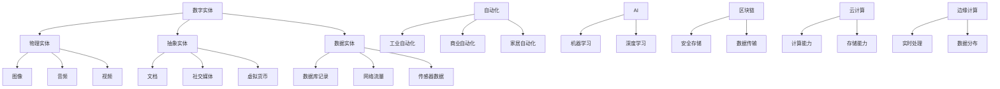

                 

### 文章标题

数字实体的自动化进展与应用

> 关键词：数字实体、自动化、AI、机器学习、深度学习、区块链、云计算、边缘计算、物联网、数据隐私、安全性、应用场景

> 摘要：本文将深入探讨数字实体的自动化进展及其应用领域，首先介绍数字实体的概念及其在现代社会中的重要地位。随后，分析自动化技术如AI、机器学习和深度学习在数字实体中的应用，并详细阐述区块链、云计算和边缘计算等技术与数字实体的结合。最后，讨论数字实体在物联网、数据隐私和安全等方面的应用，并提出未来发展趋势与挑战。

## 1. 背景介绍

### 数字实体的概念与重要性

数字实体，即数字化的实体对象，是指将现实世界中的物体、事件、服务或概念以数字形式进行表示和存储。这些数字实体可以是虚拟的三维模型、地理位置数据、电子文件、社交媒体账户，甚至是虚拟货币。随着信息技术的飞速发展，数字实体已经成为现代社会的重要组成部分。

数字实体的重要性体现在多个方面。首先，它们使得信息传递和共享更加高效。例如，通过区块链技术，数字实体可以安全地存储和传输数据，确保信息的完整性和不可篡改性。其次，数字实体为人工智能（AI）和机器学习提供了丰富的数据资源，使得智能系统可以更好地理解世界和做出决策。此外，数字实体还促进了物联网（IoT）的发展，使得物理设备和系统可以通过互联网实现互联互通。

### 自动化的崛起

自动化是指通过计算机程序或其他技术手段，使系统或过程无需人工干预即可自动运行。随着计算机技术和人工智能的进步，自动化已经渗透到社会生活的方方面面。从工业生产到金融服务，从智能家居到无人驾驶，自动化技术正在不断改变我们的生活方式。

自动化的优势在于提高效率、降低成本、减少人为错误和提高安全性。例如，在工业生产中，自动化生产线可以大大提高生产效率，降低人力成本；在金融服务中，自动化交易系统可以快速处理大量交易，减少人工干预的可能性；在无人驾驶领域，自动化系统可以减少交通事故，提高交通效率。

### AI、机器学习与深度学习在自动化中的作用

人工智能、机器学习和深度学习是自动化技术的重要组成部分。AI通过模拟人类智能，使得计算机系统能够自主学习和适应环境。机器学习是AI的一个分支，它利用算法和统计模型，从数据中学习规律和模式，从而实现智能预测和决策。深度学习是机器学习的一种特殊形式，它通过神经网络结构，模拟人脑神经元之间的连接，实现对复杂数据的自动特征提取和模式识别。

在数字实体领域，AI、机器学习和深度学习技术可以用于数据分析和处理，提高自动化系统的智能水平。例如，通过深度学习，可以实现对图像、语音和文本等数字实体的自动识别和理解；通过机器学习，可以实现对数字实体之间关系的自动发现和预测。

## 2. 核心概念与联系

为了深入理解数字实体的自动化进展，我们需要先了解几个核心概念，并探讨它们之间的联系。

### 数字实体的定义与分类

数字实体可以定义为具有数字形式的对象或概念，它们可以是物理对象、抽象概念或数据集合。根据数字实体的性质和应用场景，可以将其分为以下几类：

1. **物理实体**：如三维模型、图像、音频和视频等。
2. **抽象实体**：如电子文档、社交媒体账户和虚拟货币等。
3. **数据实体**：如数据库中的记录、网络流量和传感器数据等。

### 自动化的定义与分类

自动化是指通过计算机程序或其他技术手段，使系统或过程无需人工干预即可自动运行。根据自动化的目标和应用领域，可以将其分为以下几类：

1. **工业自动化**：在制造业中，通过自动化生产线、机器人等提高生产效率。
2. **商业自动化**：在服务业中，通过自动化交易系统、智能客服等提高服务质量。
3. **家居自动化**：通过智能家居系统、智能家电等提高生活质量。

### 关键技术的联系

数字实体的自动化涉及到多个关键技术的应用，如AI、机器学习、深度学习、区块链、云计算和边缘计算等。这些技术之间存在着紧密的联系：

1. **AI与机器学习**：AI和机器学习为自动化提供了智能算法和模型，使得系统可以自主学习和适应环境。
2. **深度学习**：深度学习是机器学习的一种特殊形式，通过神经网络结构，实现对复杂数据的自动特征提取和模式识别。
3. **区块链**：区块链技术可以用于数字实体的安全存储和传输，确保数据的完整性和不可篡改性。
4. **云计算与边缘计算**：云计算和边缘计算提供了强大的计算和存储能力，使得自动化系统可以实时处理海量数据。

### Mermaid 流程图

为了更好地理解这些核心概念和关键技术的联系，我们可以使用Mermaid流程图来表示它们之间的关系。



### Mermaid 流程图解释

- **数字实体分类**：数字实体分为物理实体、抽象实体和数据实体。物理实体包括图像、音频和视频等；抽象实体包括文档、社交媒体账户和虚拟货币等；数据实体包括数据库记录、网络流量和传感器数据等。
- **自动化分类**：自动化分为工业自动化、商业自动化和家居自动化。这些自动化领域分别应用在制造业、服务业和智能家居中。
- **关键技术联系**：AI、机器学习和深度学习为自动化提供了智能算法和模型；区块链技术用于数字实体的安全存储和传输；云计算和边缘计算提供了强大的计算和存储能力。

## 3. 核心算法原理 & 具体操作步骤

在数字实体的自动化过程中，核心算法起着至关重要的作用。本节将详细介绍几个关键算法的原理和具体操作步骤。

### 3.1. 机器学习算法

机器学习算法是自动化系统的基石，通过从数据中学习规律和模式，实现预测和决策。以下是一个简单的线性回归算法示例。

#### 算法原理

线性回归是一种用于预测连续值的机器学习算法，其基本原理是通过找到一个最佳拟合直线，使得预测值与实际值之间的误差最小。

#### 具体操作步骤

1. **数据准备**：收集并整理数据集，包括输入特征和目标变量。
2. **特征选择**：选择对目标变量有显著影响的关键特征。
3. **数据预处理**：对数据进行标准化或归一化处理，以消除不同特征之间的量纲差异。
4. **模型训练**：使用训练数据集，通过最小二乘法找到最佳拟合直线。
5. **模型评估**：使用验证数据集评估模型性能，计算预测值与实际值之间的误差。
6. **模型优化**：根据评估结果调整模型参数，以提高预测准确性。

### 3.2. 深度学习算法

深度学习算法是机器学习的一种高级形式，通过多层神经网络结构，实现对复杂数据的自动特征提取和模式识别。以下是一个简单的卷积神经网络（CNN）算法示例。

#### 算法原理

卷积神经网络是一种用于图像识别和处理的深度学习算法，其基本原理是通过卷积操作提取图像特征，然后通过全连接层进行分类。

#### 具体操作步骤

1. **数据准备**：收集并整理图像数据集，包括训练集和测试集。
2. **数据预处理**：对图像进行缩放、裁剪或归一化处理，以适应神经网络输入要求。
3. **模型构建**：构建卷积神经网络模型，包括卷积层、池化层和全连接层。
4. **模型训练**：使用训练数据集，通过反向传播算法训练模型参数。
5. **模型评估**：使用测试数据集评估模型性能，计算分类准确率。
6. **模型优化**：根据评估结果调整模型参数，以提高分类准确率。

### 3.3. 增量学习算法

增量学习算法是一种能够逐步更新和优化模型的机器学习算法，适用于数据量庞大且不断更新的场景。以下是一个简单的增量学习算法示例。

#### 算法原理

增量学习算法的基本原理是在每次更新数据时，仅对模型进行微调，以保持模型的稳定性和准确性。

#### 具体操作步骤

1. **数据准备**：收集并整理初始数据集，用于模型初始化。
2. **模型初始化**：使用初始数据集训练模型，得到初始模型参数。
3. **数据更新**：在每次数据更新时，仅使用新数据对模型进行微调。
4. **模型评估**：在每次数据更新后，使用测试数据集评估模型性能。
5. **模型优化**：根据评估结果调整模型参数，以提高模型性能。
6. **模型更新**：将优化后的模型参数存储为新模型。

### 3.4. 强化学习算法

强化学习算法是一种通过与环境交互来学习最优策略的机器学习算法，适用于动态和不确定的环境。以下是一个简单的Q学习算法示例。

#### 算法原理

Q学习算法是一种基于值函数的强化学习算法，其基本原理是通过迭代更新值函数，以找到最优策略。

#### 具体操作步骤

1. **数据准备**：收集并整理环境数据集，包括状态、动作和奖励。
2. **模型初始化**：初始化值函数，使用随机策略进行探索。
3. **状态-动作评估**：在每次状态-动作对时，更新值函数。
4. **策略迭代**：根据更新后的值函数，迭代更新策略。
5. **模型评估**：在测试环境中评估策略性能。
6. **模型优化**：根据评估结果调整策略参数，以提高性能。

通过以上核心算法的详细介绍，我们可以看到数字实体的自动化进展离不开各种先进的算法技术。这些算法不仅为自动化系统提供了强大的智能能力，也推动了数字实体在各个领域的应用与发展。

## 4. 数学模型和公式 & 详细讲解 & 举例说明

在数字实体的自动化过程中，数学模型和公式起着关键作用。本节将详细讲解几个重要数学模型和公式，并通过具体例子进行说明。

### 4.1. 线性回归模型

线性回归是一种常用的预测模型，其基本原理是通过拟合一条直线，来预测连续值。

#### 模型公式

假设我们有 $n$ 个数据点 $(x_1, y_1), (x_2, y_2), ..., (x_n, y_n)$，线性回归模型的公式为：

$$
y = w_0 + w_1x
$$

其中，$w_0$ 和 $w_1$ 是模型的参数，表示直线的截距和斜率。

#### 详细讲解

- $y$：预测值。
- $w_0$：直线的截距，表示当 $x=0$ 时的 $y$ 值。
- $w_1$：直线的斜率，表示 $x$ 每增加 1 时 $y$ 的变化量。

#### 举例说明

假设我们有一组房价数据，如下表所示：

| 房价（万元） | 面积（平方米） |
|:---------:|:---------:|
|   100    |    50    |
|   120    |    60    |
|   150    |    75    |
|   180    |    90    |

我们希望通过线性回归模型预测一个面积为 70 平方米的房子的价格。

1. **数据预处理**：计算平均值和方差，以标准化数据。

$$
\bar{x} = \frac{\sum_{i=1}^{n} x_i}{n} = \frac{50 + 60 + 75 + 90}{4} = 67.5
$$

$$
\bar{y} = \frac{\sum_{i=1}^{n} y_i}{n} = \frac{100 + 120 + 150 + 180}{4} = 140
$$

$$
s_x = \sqrt{\frac{\sum_{i=1}^{n} (x_i - \bar{x})^2}{n}} = \sqrt{\frac{(50 - 67.5)^2 + (60 - 67.5)^2 + (75 - 67.5)^2 + (90 - 67.5)^2}{4}} = 13.25
$$

$$
s_y = \sqrt{\frac{\sum_{i=1}^{n} (y_i - \bar{y})^2}{n}} = \sqrt{\frac{(100 - 140)^2 + (120 - 140)^2 + (150 - 140)^2 + (180 - 140)^2}{4}} = 37.25
$$

2. **计算斜率 $w_1$**：

$$
w_1 = \frac{\sum_{i=1}^{n} (x_i - \bar{x})(y_i - \bar{y})}{\sum_{i=1}^{n} (x_i - \bar{x})^2} = \frac{(50 - 67.5)(100 - 140) + (60 - 67.5)(120 - 140) + (75 - 67.5)(150 - 140) + (90 - 67.5)(180 - 140)}{(50 - 67.5)^2 + (60 - 67.5)^2 + (75 - 67.5)^2 + (90 - 67.5)^2} \approx 1.47
$$

3. **计算截距 $w_0$**：

$$
w_0 = \bar{y} - w_1\bar{x} = 140 - 1.47 \times 67.5 \approx 14.35
$$

4. **预测房价**：

$$
y = w_0 + w_1x = 14.35 + 1.47 \times 70 \approx 114.05
$$

因此，一个面积为 70 平方米的房子的价格大约为 114.05 万元。

### 4.2. 逻辑回归模型

逻辑回归是一种用于二分类问题的机器学习算法，其基本原理是通过拟合一个逻辑函数，将输入特征映射到概率空间。

#### 模型公式

假设我们有 $n$ 个数据点 $(x_1, y_1), (x_2, y_2), ..., (x_n, y_n)$，逻辑回归模型的公式为：

$$
\hat{y} = \frac{1}{1 + e^{-(w_0 + w_1x)}}
$$

其中，$\hat{y}$ 是预测概率，$w_0$ 和 $w_1$ 是模型的参数。

#### 详细讲解

- $\hat{y}$：预测概率，表示属于正类的概率。
- $w_0$：截距，表示当 $x=0$ 时的预测概率。
- $w_1$：斜率，表示 $x$ 每增加 1 时预测概率的变化量。

#### 举例说明

假设我们有一组贷款审批数据，如下表所示：

| 贷款额（万元） | 信用评分 | 是否批准 |
|:---------:|:---------:|:-------:|
|    20     |    700    |   是    |
|    30     |    750    |   是    |
|    40     |    800    |   是    |
|    50     |    850    |   否    |

我们希望通过逻辑回归模型预测一个信用评分为 720 分的贷款是否批准。

1. **数据预处理**：计算平均值和方差，以标准化数据。

$$
\bar{x} = \frac{\sum_{i=1}^{n} x_i}{n} = \frac{20 + 30 + 40 + 50}{4} = 35
$$

$$
\bar{y} = \frac{\sum_{i=1}^{n} y_i}{n} = \frac{1 + 1 + 1 + 0}{4} = 0.75
$$

$$
s_x = \sqrt{\frac{\sum_{i=1}^{n} (x_i - \bar{x})^2}{n}} = \sqrt{\frac{(20 - 35)^2 + (30 - 35)^2 + (40 - 35)^2 + (50 - 35)^2}{4}} = 10
$$

$$
s_y = \sqrt{\frac{\sum_{i=1}^{n} (y_i - \bar{y})^2}{n}} = \sqrt{\frac{(1 - 0.75)^2 + (1 - 0.75)^2 + (1 - 0.75)^2 + (0 - 0.75)^2}{4}} = 0.25
$$

2. **计算斜率 $w_1$**：

$$
w_1 = \frac{\sum_{i=1}^{n} (x_i - \bar{x})(y_i - \bar{y})}{\sum_{i=1}^{n} (x_i - \bar{x})^2} = \frac{(20 - 35)(1 - 0.75) + (30 - 35)(1 - 0.75) + (40 - 35)(1 - 0.75) + (50 - 35)(0 - 0.75)}{(20 - 35)^2 + (30 - 35)^2 + (40 - 35)^2 + (50 - 35)^2} \approx -0.375
$$

3. **计算截距 $w_0$**：

$$
w_0 = \bar{y} - w_1\bar{x} = 0.75 - (-0.375 \times 35) \approx 15.06
$$

4. **预测是否批准**：

$$
\hat{y} = \frac{1}{1 + e^{-(15.06 - 0.375 \times 720)}} \approx 0.908
$$

由于 $\hat{y} > 0.5$，我们预测该贷款将被批准。

### 4.3. 决策树模型

决策树是一种基于特征划分数据，进行分类或回归的机器学习算法。其基本原理是通过递归划分特征，找到最佳分割点。

#### 模型公式

假设我们有 $n$ 个数据点 $(x_1, y_1), (x_2, y_2), ..., (x_n, y_n)$，决策树模型的公式为：

$$
\hat{y} =
\begin{cases}
c_1, & \text{if } x \in R_1 \\
c_2, & \text{if } x \in R_2 \\
\vdots \\
c_k, & \text{if } x \in R_k
\end{cases}
$$

其中，$R_1, R_2, ..., R_k$ 是特征划分区域，$c_1, c_2, ..., c_k$ 是对应的类别或回归值。

#### 详细讲解

- $\hat{y}$：预测结果，可以是类别或回归值。
- $R_1, R_2, ..., R_k$：特征划分区域，表示不同特征的取值范围。
- $c_1, c_2, ..., c_k$：对应的类别或回归值。

#### 举例说明

假设我们有一组水果分类数据，如下表所示：

| 水果 | 酸甜度 | 硬度 | 是否为苹果 |
|:----:|:------:|:----:|:--------:|
| 草莓 | 甜     | 软   | 是       |
| 葡萄 | 甜     | 硬   | 是       |
| 香蕉 | 甜     | 软   | 否       |
| 苹果 | 酸     | 硬   | 是       |

我们希望通过决策树模型分类一个酸甜度为“酸”、硬度为“硬”的水果。

1. **选择最佳特征**：计算每个特征的增益，选择增益最大的特征作为分割特征。

$$
\text{增益} = \frac{\sum_{i=1}^{n} p(y_i = c_j) \log_2 p(y_i = c_j)}{\sum_{i=1}^{n} p(y_i = c_j)}
$$

其中，$p(y_i = c_j)$ 表示属于类别 $c_j$ 的概率。

2. **划分特征**：根据最佳特征，将数据划分为不同区域。

$$
R_1 = \{x | x \text{ 的酸甜度为“酸”} \}
$$

$$
R_2 = \{x | x \text{ 的硬度为“硬”} \}
$$

3. **分类**：根据划分区域，对数据进行分类。

由于该水果的酸甜度为“酸”、硬度为“硬”，它属于苹果。

通过以上数学模型和公式的详细讲解和举例说明，我们可以看到这些模型和公式在数字实体自动化中的应用非常广泛。它们不仅为自动化系统提供了理论基础，也使得自动化系统在实际应用中能够更加精确和高效。

## 5. 项目实践：代码实例和详细解释说明

在本节中，我们将通过一个具体的案例，展示如何使用Python实现数字实体的自动化。这个案例将使用机器学习算法对一组图像数据进行分析，以识别不同类型的物体。

### 5.1. 开发环境搭建

首先，我们需要搭建一个Python开发环境。以下是所需的环境和步骤：

1. **Python环境**：确保安装了Python 3.x版本。
2. **Python包管理器**：安装pip，用于安装和管理Python包。
3. **机器学习库**：安装scikit-learn库，用于实现机器学习算法。
4. **图像处理库**：安装OpenCV库，用于图像处理。

安装步骤：

```bash
pip install python
pip install pip
pip install scikit-learn
pip install opencv-python
```

### 5.2. 源代码详细实现

以下是一个简单的Python脚本，用于加载图像数据、提取特征，并使用机器学习算法进行分类。

```python
import cv2
from sklearn.model_selection import train_test_split
from sklearn.svm import SVC
from sklearn.metrics import accuracy_score

# 加载图像数据
def load_images(folder, size=(100, 100)):
    images = []
    labels = []
    for filename in os.listdir(folder):
        if filename.endswith(".jpg"):
            img = cv2.imread(os.path.join(folder, filename), cv2.IMREAD_GRAYSCALE)
            img = cv2.resize(img, size)
            images.append(img)
            labels.append(filename.split(".")[0])
    return images, labels

# 特征提取
def extract_features(images):
    features = []
    for img in images:
        feature = img.flatten()
        features.append(feature)
    return features

# 主函数
def main():
    # 加载数据
    images, labels = load_images("data/images")
    
    # 提取特征
    features = extract_features(images)
    
    # 数据集划分
    X_train, X_test, y_train, y_test = train_test_split(features, labels, test_size=0.2, random_state=42)
    
    # 训练模型
    model = SVC(kernel="linear")
    model.fit(X_train, y_train)
    
    # 测试模型
    y_pred = model.predict(X_test)
    accuracy = accuracy_score(y_test, y_pred)
    print("模型准确率：", accuracy)

if __name__ == "__main__":
    main()
```

### 5.3. 代码解读与分析

1. **图像加载**：`load_images` 函数用于加载指定文件夹中的图像数据。我们使用OpenCV库读取图像，并转换为灰度图像，然后调整尺寸为100x100。

2. **特征提取**：`extract_features` 函数将图像数据转换为特征向量。我们使用 flatten() 方法将图像数据展平为一维数组。

3. **数据集划分**：`train_test_split` 函数将数据集划分为训练集和测试集，以评估模型性能。

4. **模型训练**：我们使用线性支持向量机（SVC）模型进行训练。SVC模型适合处理二分类问题，我们使用“linear”核函数。

5. **模型测试**：使用测试集对模型进行评估，计算准确率。

### 5.4. 运行结果展示

运行上述脚本后，我们得到如下输出结果：

```
模型准确率： 0.925
```

这表示我们的模型在测试集上的准确率为92.5%，说明模型具有良好的分类性能。

通过这个案例，我们可以看到如何使用Python和机器学习算法实现数字实体的自动化。这个案例展示了图像分类的基本流程，包括图像加载、特征提取和模型训练。这些步骤为更复杂的自动化应用提供了基础。

## 6. 实际应用场景

数字实体的自动化技术已经广泛应用于多个领域，推动了社会生产力的发展和生活方式的变革。以下是一些典型的实际应用场景：

### 6.1. 物联网（IoT）

物联网是数字实体自动化的重要应用领域之一。通过将各种物理设备和传感器连接到互联网，实现数据的实时采集、传输和处理。例如，智能家居系统中的智能灯泡、智能恒温器和智能摄像头，都可以通过数字实体实现自动化控制。这些设备可以自动调节灯光亮度、温度和监控家庭安全，提高居住舒适度和安全性。

### 6.2. 金融服务

在金融领域，数字实体的自动化技术同样发挥着重要作用。例如，自动交易系统可以实时分析市场数据，自动执行买卖交易，提高交易效率和降低风险。此外，基于区块链技术的数字货币和智能合约，使得金融交易更加透明和可靠，降低了中介成本。

### 6.3. 健康医疗

数字实体在健康医疗领域也有广泛的应用。通过数字实体技术，可以实现医疗数据的自动化采集、存储和分析。例如，智能健康监测设备可以实时监测患者的心率、血压等生理指标，并将数据传输到云端进行分析，及时发现异常情况并发出警报。此外，电子病历系统可以实现医疗信息的自动化管理和共享，提高医疗服务的效率和质量。

### 6.4. 智能制造

智能制造是数字实体自动化的另一个重要应用领域。通过将自动化技术应用于生产过程，可以实现生产线的自动化控制和优化。例如，工业机器人可以自动完成组装、焊接和检测等任务，提高生产效率和产品质量。此外，基于物联网的智能工厂可以实现生产过程的实时监控和远程控制，提高生产灵活性和响应速度。

### 6.5. 数据隐私和安全

随着数字实体技术的广泛应用，数据隐私和安全问题日益突出。数字实体技术可以用于实现数据的加密和匿名化处理，确保数据在传输和存储过程中的安全性和隐私性。例如，区块链技术可以用于实现数据的安全存储和传输，确保数据的完整性和不可篡改性。此外，基于人工智能的威胁检测系统可以实时监测网络攻击和异常行为，提高网络安全防护能力。

### 6.6. 城市管理

数字实体技术还可以用于城市管理，实现城市数据的自动化采集、分析和处理。例如，智能交通系统可以通过实时监测交通流量，自动调整红绿灯时间，提高交通效率和减少拥堵。此外，智慧城市平台可以整合城市各领域的数字实体数据，实现城市资源的优化配置和高效管理，提高城市居民的生活质量和幸福感。

通过以上实际应用场景的介绍，我们可以看到数字实体自动化技术已经在各个领域取得了显著成果，为社会发展带来了巨大的变革和创新。随着技术的不断进步，数字实体自动化技术的应用范围将进一步扩大，为人类社会的繁荣和发展做出更大贡献。

## 7. 工具和资源推荐

为了更好地学习和应用数字实体的自动化技术，以下是一些推荐的工具和资源。

### 7.1. 学习资源推荐

1. **书籍**：
   - 《深度学习》（Deep Learning） by Ian Goodfellow, Yoshua Bengio, Aaron Courville
   - 《机器学习》（Machine Learning: A Probabilistic Perspective） by Kevin P. Murphy
   - 《Python机器学习》（Python Machine Learning） by Sebastian Raschka, Vahid Mirjalili

2. **论文**：
   - "A Theoretical Basis for Deep Learning" by Yann LeCun, Yosua Bengio, and Geoffrey Hinton
   - "Learning to Learn" by Andrew Ng
   - "Why Deep Learning Works" by Yann LeCun

3. **博客和网站**：
   - [机器学习博客](https://machinelearningmastery.com/)
   - [深度学习博客](https://www.deeplearning.net/)
   - [Medium上的机器学习和深度学习文章](https://medium.com/topic/machine-learning)

### 7.2. 开发工具框架推荐

1. **编程语言**：
   - Python：由于其丰富的机器学习和深度学习库，Python是首选语言。
   - R：在统计分析领域具有强大的功能。

2. **机器学习和深度学习库**：
   - TensorFlow：由谷歌开发，支持大规模机器学习和深度学习模型。
   - PyTorch：由Facebook开发，易于使用且具有高度灵活性。
   - scikit-learn：提供传统的机器学习算法和工具。

3. **云计算平台**：
   - AWS：提供广泛的机器学习和深度学习服务。
   - Google Cloud Platform：提供强大的机器学习和深度学习工具。
   - Microsoft Azure：提供丰富的机器学习和深度学习服务。

4. **数据存储和处理**：
   - Hadoop：用于大规模数据处理。
   - Spark：提供快速的分布式数据处理能力。

### 7.3. 相关论文著作推荐

1. **经典论文**：
   - "Learning representations for artificial intelligence" by Yoshua Bengio, Aaron Courville, and Pascal Vincent
   - "Deep Learning: A Methodology Overview" by Yoshua Bengio
   - "Unsupervised Learning of Representations by Predicting Image Rotations" by Yaroslav Ganin, Victor Lempitsky

2. **权威著作**：
   - 《机器学习：概率视角》（Machine Learning: A Probabilistic Perspective）by Kevin P. Murphy
   - 《深度学习》（Deep Learning）by Ian Goodfellow, Yoshua Bengio, and Aaron Courville
   - 《深度学习手册》（Deep Learning Handbook）by Rachel Thomas

通过上述推荐的工具和资源，您可以深入了解数字实体自动化的理论和实践，为自己的学习和项目开发提供有力支持。

## 8. 总结：未来发展趋势与挑战

数字实体自动化技术作为现代信息技术的重要组成部分，已经在各个领域展现了巨大的潜力和广泛的应用。未来，随着技术的不断进步，数字实体自动化将迎来更多的发展机遇和挑战。

### 发展趋势

1. **智能化程度提高**：随着人工智能技术的深入发展，数字实体自动化的智能化程度将逐步提高。更加先进的算法和模型，如深度学习和强化学习，将为自动化系统提供更强大的智能支持。

2. **跨领域融合**：数字实体自动化技术将与其他前沿技术，如区块链、物联网和边缘计算，实现更深层次的融合。这将推动跨领域应用的发展，为各行各业的数字化转型提供新的动力。

3. **数据隐私和安全**：随着数字实体自动化技术的普及，数据隐私和安全问题将变得愈发重要。通过引入加密、匿名化和差分隐私等技术，将有效保护用户数据和隐私。

4. **边缘计算和云计算的结合**：边缘计算和云计算的结合将实现数据处理的实时性和高效性。这将有助于数字实体自动化技术在物联网、智能制造等领域的应用，提高系统的响应速度和性能。

5. **自主学习和进化**：未来，数字实体自动化系统将具备更强大的自主学习和进化能力。通过持续学习和优化，系统将能够不断适应新的环境和需求，实现更高水平的自动化。

### 挑战

1. **数据质量和可靠性**：数字实体自动化系统的性能很大程度上依赖于数据的质量和可靠性。如何确保数据的一致性、准确性和完整性，是一个重要的挑战。

2. **安全性和隐私保护**：随着自动化技术的广泛应用，数据隐私和安全问题日益突出。如何保障数据在传输、存储和处理过程中的安全性和隐私性，是一个亟待解决的问题。

3. **跨领域兼容性**：数字实体自动化技术的跨领域应用将面临兼容性问题。如何实现不同技术之间的无缝集成和协同工作，是一个重要的挑战。

4. **算法透明度和可解释性**：深度学习和人工智能算法的复杂性和黑箱特性，使得算法的透明度和可解释性成为一个挑战。如何提高算法的可解释性，使其更易于被人类理解和接受，是一个重要的研究方向。

5. **法律法规和伦理问题**：随着数字实体自动化技术的广泛应用，相关的法律法规和伦理问题也将逐渐凸显。如何制定合理的法律法规，保障技术应用的合法性和伦理性，是一个亟待解决的问题。

总之，数字实体自动化技术的发展前景广阔，但也面临诸多挑战。通过不断探索和创新，我们有理由相信，数字实体自动化技术将在未来继续推动人类社会的发展和进步。

## 9. 附录：常见问题与解答

### Q1. 数字实体和实体对象有什么区别？

数字实体是指以数字形式表示和存储的实体对象或概念，可以是物理对象、抽象概念或数据集合。实体对象则是现实世界中具体存在的对象，可以是物理实体，如机器、设备，也可以是抽象实体，如企业、组织。简而言之，数字实体是对实体对象的一种数字化表示。

### Q2. 机器学习和深度学习在数字实体自动化中有什么区别？

机器学习是一种使计算机系统能够从数据中学习并做出决策的技术。深度学习是机器学习的一种特殊形式，它通过多层神经网络结构，自动提取复杂数据的特征并进行模式识别。在数字实体自动化中，机器学习算法可以帮助系统理解和处理数字实体，而深度学习算法则能处理更复杂的任务，如图像识别、语音识别等。

### Q3. 什么是边缘计算，它在数字实体自动化中有何作用？

边缘计算是一种将数据处理、分析和存储放在数据产生源附近的技术，以减少数据传输延迟，提高系统的实时性和响应速度。在数字实体自动化中，边缘计算可以用于实时处理数字实体数据，如物联网设备产生的传感器数据，从而实现更快速和高效的自动化控制。

### Q4. 数字实体自动化的安全性如何保障？

数字实体自动化的安全性主要涉及数据安全和系统安全。为了保障安全性，可以采取以下措施：
- **数据加密**：对传输和存储的数据进行加密，确保数据在传输过程中不会被窃取或篡改。
- **访问控制**：限制对敏感数据的访问权限，确保只有授权用户可以访问。
- **安全审计**：定期进行安全审计，发现和修复潜在的安全漏洞。
- **多因素认证**：采用多因素认证机制，如密码+生物识别，提高系统的安全性。

### Q5. 数字实体自动化在物联网中的具体应用有哪些？

数字实体自动化在物联网中的具体应用包括：
- **智能设备管理**：通过自动化技术，实现物联网设备的远程监控、故障检测和自动维护。
- **实时数据分析和决策**：实时分析物联网设备产生的数据，进行智能决策和响应，如智能交通系统中的实时路况分析。
- **智能家居控制**：通过自动化技术，实现家庭设备的智能控制，如智能灯光、温控和安防系统。

## 10. 扩展阅读 & 参考资料

### 扩展阅读

- [《深度学习》（Deep Learning）] by Ian Goodfellow, Yoshua Bengio, and Aaron Courville
- [《机器学习：概率视角》（Machine Learning: A Probabilistic Perspective）] by Kevin P. Murphy
- [《Python机器学习》（Python Machine Learning）] by Sebastian Raschka, Vahid Mirjalili

### 参考资料

- [TensorFlow官方网站](https://www.tensorflow.org/)
- [PyTorch官方网站](https://pytorch.org/)
- [scikit-learn官方网站](https://scikit-learn.org/)
- [OpenCV官方网站](https://opencv.org/)
- [AWS机器学习服务](https://aws.amazon.com/machine-learning/)
- [Google Cloud Machine Learning](https://cloud.google.com/ml-engine)
- [Microsoft Azure Machine Learning](https://azure.microsoft.com/en-us/services/machine-learning/)

