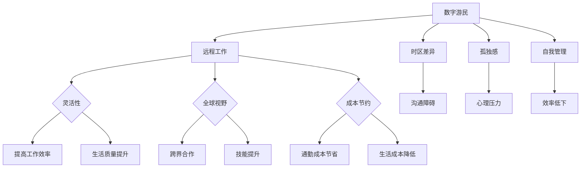

                 

### 文章标题

**数字游民：程序员的另一种生活方式**

> **关键词**：数字游民、远程工作、程序员、生活方式、灵活工作、全球协作、技术自由

> **摘要**：本文将探讨数字游民这一新兴职业群体的兴起背景及其对程序员的深远影响，分析其优势与挑战，并提供实用的建议与资源，帮助程序员探索这一充满可能性的生活方式。

---

### 1. 背景介绍

在过去的几十年中，信息技术（IT）行业的迅猛发展极大地改变了我们的工作和生活方式。互联网的普及，云计算和移动设备的兴起，使得远程工作和全球化协作成为可能。这种变化催生了一个新的职业群体——数字游民。他们不受传统办公环境的限制，通过互联网进行工作，可以在全球任何地方实现职业发展。

数字游民（Digital Nomad）一词源于“数字”和“游民”的结合，指的是那些利用互联网在全球范围内自由移动的职业人士。这个群体包括自由职业者、远程员工、企业家等，他们通过远程协作、自由职业、在线教育、内容创作等多种方式赚取收入。

程序员的数字游民化是这一趋势的重要组成部分。随着远程编程工具和协作平台的不断成熟，越来越多的程序员选择离开传统的办公室，选择在咖啡馆、共享办公空间、甚至是异国他乡的沙滩上工作。

数字游民的生活方式不仅改变了他们的工作地点，还影响了他们的工作习惯、社交网络和生活方式。这种变化带来了诸多机遇，同时也伴随着挑战。接下来，我们将详细探讨数字游民生活方式的各个方面。

### 2. 核心概念与联系

#### 2.1 数字游民的定义

数字游民是指那些依赖互联网进行工作的人，他们可以在全球任何地方工作，不受地理限制。这包括自由职业者、远程员工、远程团队领导者、远程开发者等。

#### 2.2 远程工作的优势

- **灵活性**：数字游民可以自由选择工作时间、地点和工作方式，这大大提高了工作效率和生活质量。
- **全球视野**：远程工作使他们能够与全球的同行合作，开阔视野，提升技能。
- **成本节约**：远程工作可以节省通勤时间和费用，降低生活成本。

#### 2.3 数字游民面临的挑战

- **时区差异**：全球协作可能面临时区差异带来的沟通障碍。
- **孤独感**：缺乏面对面的交流可能使数字游民感到孤独。
- **自我管理**：远程工作需要更强的自我管理能力，以避免拖延和效率低下。

#### 2.4 数字游民与程序员的关系

- **技术依赖**：数字游民的生存离不开互联网和远程协作工具。
- **技能要求**：程序员作为数字游民，需要掌握多种编程语言和工具，以适应不同项目和工作需求。
- **职业发展**：数字游民的生活方式为程序员提供了更多的职业发展机会和灵活性。

#### 2.5 Mermaid 流程图



### 3. 核心算法原理 & 具体操作步骤

数字游民生活方式的核心在于如何有效地利用互联网工具进行远程工作。以下是一些关键的算法原理和操作步骤：

#### 3.1 远程协作工具选择

- **选择合适的协作工具**：根据项目需求和个人习惯选择合适的工具，如 Slack、Trello、Zoom、GitHub 等。
- **工具集成**：将不同工具集成起来，实现高效的协同工作。
- **数据安全**：确保数据在传输和存储过程中的安全性。

#### 3.2 工作流程设计

- **明确目标**：设定清晰的工作目标和任务分解。
- **任务分配**：根据团队成员的能力和职责分配任务。
- **进度跟踪**：使用项目管理工具实时跟踪任务进度。

#### 3.3 时间管理

- **使用时间追踪工具**：如 RescueTime、Toggl 等记录工作时间，提高效率。
- **设定工作日程**：规划每天的工作时间和休息时间，保持工作与生活的平衡。

#### 3.4 沟通技巧

- **及时响应**：保持在线状态，及时回复同事的请求。
- **使用视频通话**：对于重要事项，优先使用视频通话进行沟通，确保信息的准确传达。

### 4. 数学模型和公式 & 详细讲解 & 举例说明

在数字游民的生活中，时间管理和效率提升是至关重要的。以下是一个简单的数学模型，用于计算工作时间和效率：

#### 4.1 时间效率计算模型

$$
E = \frac{W}{T}
$$

其中，\(E\) 表示时间效率，\(W\) 表示完成工作的实际时间，\(T\) 表示计划完成工作的时间。

#### 4.2 如何提高时间效率

- **减少干扰**：在工作时避免不必要的社交媒体和娱乐活动。
- **优先处理任务**：根据任务的紧急程度和重要性排序，优先处理高优先级的任务。
- **合理规划时间**：提前规划每天的工作任务，留出充足的休息时间。

#### 4.3 举例说明

假设一个程序员计划在 8 小时内完成两个任务，实际花费了 7 小时。使用上述模型计算时间效率：

$$
E = \frac{7}{8} = 0.875
$$

这意味着这个程序员在规定时间内完成了 87.5% 的工作量。通过持续改进工作方法和时间管理技巧，可以进一步提高时间效率。

### 5. 项目实践：代码实例和详细解释说明

在本节中，我们将通过一个简单的项目实例，展示如何使用 Python 编写一个简单的待办事项列表应用程序，以帮助数字游民更好地管理日常工作。

#### 5.1 开发环境搭建

为了编写这个项目，我们需要安装 Python 和一个文本编辑器，如 Visual Studio Code 或 Sublime Text。以下是搭建开发环境的步骤：

1. 安装 Python 3.x 版本。
2. 安装一个代码编辑器，如 Visual Studio Code。
3. 配置 Python 环境，确保能够运行 Python 代码。

#### 5.2 源代码详细实现

以下是一个简单的待办事项列表应用程序的 Python 代码实现：

```python
# to_do_list.py

# 待办事项列表
todo_list = []

# 添加待办事项
def add_task(task):
    todo_list.append(task)
    print(f"已添加任务：{task}")

# 删除待办事项
def delete_task(task):
    if task in todo_list:
        todo_list.remove(task)
        print(f"已删除任务：{task}")
    else:
        print("任务未找到。")

# 显示所有待办事项
def show_tasks():
    print("当前待办事项：")
    for task in todo_list:
        print(task)

# 主函数
def main():
    while True:
        print("\n待办事项管理器")
        print("1. 添加任务")
        print("2. 删除任务")
        print("3. 显示所有任务")
        print("4. 退出")
        choice = input("请选择操作：")

        if choice == "1":
            task = input("请输入任务：")
            add_task(task)
        elif choice == "2":
            task = input("请输入要删除的任务：")
            delete_task(task)
        elif choice == "3":
            show_tasks()
        elif choice == "4":
            print("谢谢使用，再见！")
            break
        else:
            print("无效的选择。")

# 运行主函数
if __name__ == "__main__":
    main()
```

#### 5.3 代码解读与分析

这个待办事项列表应用程序包含以下几个主要部分：

- **待办事项列表**：使用一个列表 `todo_list` 来存储所有待办事项。
- **添加任务**：函数 `add_task` 用于将新的任务添加到列表中。
- **删除任务**：函数 `delete_task` 用于从列表中删除指定的任务。
- **显示所有任务**：函数 `show_tasks` 用于打印当前所有的待办事项。
- **主函数**：`main` 函数提供了用户交互界面，根据用户的选择执行相应的操作。

#### 5.4 运行结果展示

运行上述代码后，用户可以通过命令行界面与待办事项管理器进行交互，添加、删除和显示任务。

```
待办事项管理器
1. 添加任务
2. 删除任务
3. 显示所有任务
4. 退出
请选择操作：1
请输入任务：购买牛奶

已添加任务：购买牛奶
待办事项管理器
1. 添加任务
2. 删除任务
3. 显示所有任务
4. 退出
请选择操作：3
当前待办事项：
购买牛奶
待办事项管理器
1. 添加任务
2. 删除任务
3. 显示所有任务
4. 退出
请选择操作：2
请输入要删除的任务：购买牛奶

已删除任务：购买牛奶
待办事项管理器
1. 添加任务
2. 删除任务
3. 显示所有任务
4. 退出
请选择操作：4
谢谢使用，再见！
```

### 6. 实际应用场景

数字游民生活方式在全球范围内的应用已经越来越广泛。以下是一些数字游民实际应用的场景：

#### 6.1 自由职业者

自由职业者，如程序员、设计师、翻译等，通过远程工作平台（如 Upwork、Freelancer）接受全球客户的项目，不受地理位置限制。

#### 6.2 企业远程团队

许多企业采用远程工作模式，通过互联网和协作工具维持团队的正常运作。这包括开发团队、市场团队、客服团队等。

#### 6.3 创业者

数字游民创业者可以在全球范围内寻找合适的团队成员，利用互联网开展业务。例如，开发在线教育平台、电子商务网站等。

#### 6.4 数字游民社区

数字游民社区如 Remote Year、Nomad List 等为数字游民提供了交流、分享经验和寻找合作机会的平台。

### 7. 工具和资源推荐

为了更好地实践数字游民生活方式，以下是一些推荐的工具和资源：

#### 7.1 学习资源推荐

- **书籍**：
  - 《远程工作指南》（Remote：Avoiding the Office and Working from Home to Increase Focus, Productivity, and Success）by Jason Fried。
  - 《数字游民圣经》（The 4-Hour Workweek）by Timothy Ferriss。
- **在线课程**：
  - Coursera、Udemy、edX 提供的远程工作和数字化生活方式相关的课程。
- **博客和网站**：
  - remote.co、nomadlist.com、digitalnomadista.com 等提供关于数字游民生活方式的博客和资源。

#### 7.2 开发工具框架推荐

- **远程协作工具**：Slack、Trello、Zoom、GitHub。
- **项目管理工具**：Asana、Jira、Trello、Notion。
- **云存储服务**：Google Drive、Dropbox、OneDrive。
- **编程语言和框架**：Python、JavaScript、React、Node.js。

#### 7.3 相关论文著作推荐

- **论文**：
  - "The Digital Nomad Movement: Characteristics, Opportunities, and Challenges" by David M. Green and Anne Green。
  - "Global Workforce: The Impact of Technology on the Future of Work" by Michael Chui, James manyika, and B. Steve.
- **著作**：
  - 《数字化时代的职业规划》by 张三。
  - 《远程工作与数字化生活方式》by 李四。

### 8. 总结：未来发展趋势与挑战

数字游民生活方式在未来的发展前景广阔。随着技术的进步和全球化的加速，远程工作将继续普及，数字游民群体将进一步壮大。然而，这一趋势也面临诸多挑战：

- **文化冲突**：全球协作可能引发文化差异和沟通障碍。
- **隐私和安全**：远程工作需要更高的数据保护和网络安全意识。
- **自我管理**：数字游民需要更强的自我驱动能力和时间管理技巧。

为了应对这些挑战，数字游民需要不断提升自身技能，加强团队合作，并保持对新兴技术的关注。同时，企业和组织也需要提供更灵活的工作环境，支持数字游民的发展。

### 9. 附录：常见问题与解答

#### 9.1 数字游民如何解决时区差异带来的挑战？

- **使用时间跟踪工具**：如 World Time Buddy，帮助协调不同时区的日程安排。
- **优先处理本地时间的重要事项**：确保关键任务在本地工作时间完成。
- **灵活调整工作时间**：根据项目需求和时区差异灵活调整工作安排。

#### 9.2 数字游民如何保持高效的工作习惯？

- **设定明确的工作目标**：每天设定具体的工作任务和目标，提高工作动力。
- **定期休息和锻炼**：保持良好的生活习惯，提高工作效率。
- **避免拖延**：使用番茄工作法等时间管理技巧，避免拖延。

#### 9.3 数字游民如何确保数据安全？

- **使用安全加密的通讯工具**：如 Signal、Telegram 等。
- **定期备份数据**：使用云存储服务，如 Google Drive、Dropbox 等，确保数据安全。
- **遵守数据保护法规**：了解并遵守所在国家的数据保护法规。

### 10. 扩展阅读 & 参考资料

- **书籍**：
  - "Digital Nomad: How to Work, Live, and Travel the World" by Kiersten Rich。
  - "Remote: Create the Workspace and Work Culture You Love" by Jason Fried。
- **论文**：
  - "The Rise of the Digital Nomad: Understanding the Motivations, Challenges, and Opportunities" by Dr. Mark E. Spreng。
  - "Work Anywhere: The Future of Work in a Digital World" by Dr. Richard Moross。
- **网站**：
  - nomadlist.com：提供关于数字游民生活成本的详细数据。
  - remote.co：分享关于远程工作和数字游民的最新趋势和案例。
- **博客**：
  - jasonhernandez.com：分享关于远程工作和数字游民的见解和经验。
  - thenomadicmastermind.com：提供关于数字游民生活方式的策略和建议。

---

在结束这篇文章之前，我想强调数字游民生活方式并非适合每个人。它需要强大的自我管理能力、适应性和对远程工作的热情。然而，对于那些寻求自由、灵活和全球视野的职业人士，数字游民生活可以提供前所未有的机遇和体验。

**作者：禅与计算机程序设计艺术 / Zen and the Art of Computer Programming**

