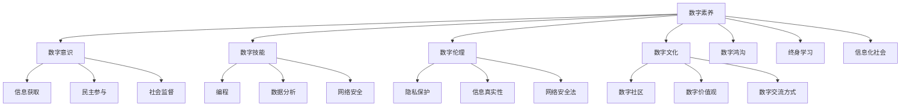
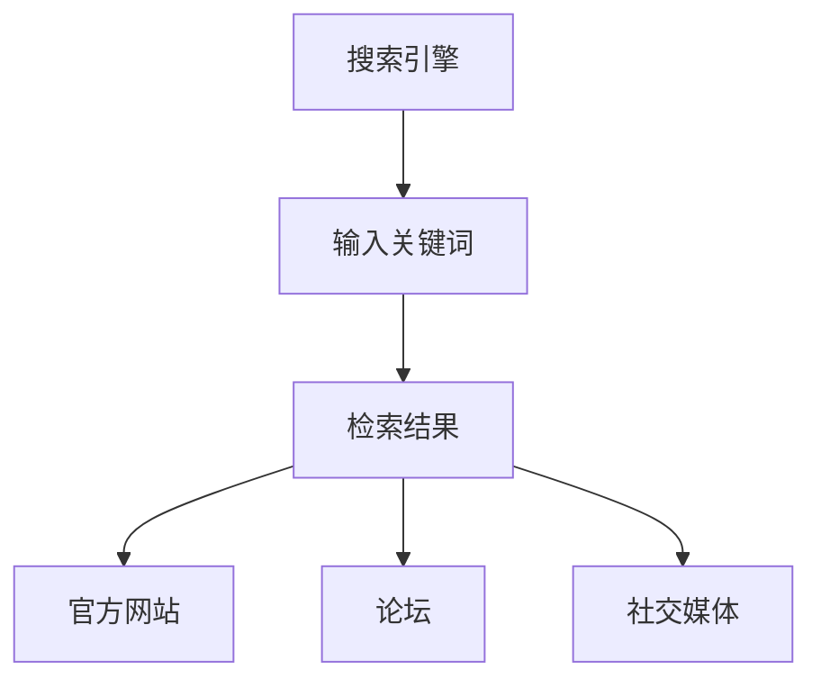
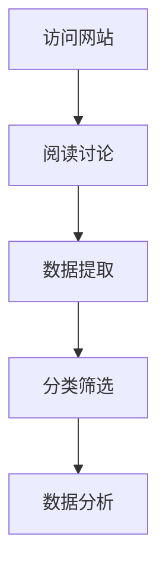
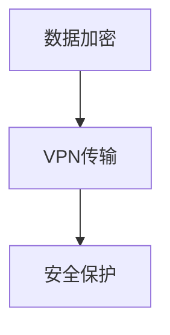
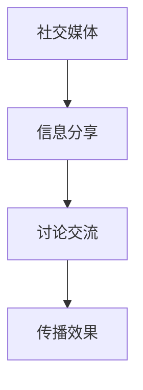

                 

### 1. 背景介绍

数字素养，顾名思义，指的是在数字世界中获取、理解、评价和使用信息的能力。在当今这个信息化时代，数字素养的重要性日益凸显。它不仅关乎个人职业发展，更关系到整个社会的进步与和谐。正因为如此，数字素养成为了全球范围内教育改革的重要议题。

数字素养的核心要素包括数字意识、数字技能、数字伦理和数字文化。数字意识涉及对数字技术的认知和敏感性；数字技能则涵盖使用数字工具和平台的实际操作能力；数字伦理关乎如何在数字环境中遵守法律和道德规范；数字文化则强调对数字社会及其文化的理解与适应。

然而，数字素养的培养并非一蹴而就。它需要从基础教育阶段开始，贯穿整个学习生涯，甚至在职业生涯中也需要不断更新。在这个过程中，教师、家长、企业和社会各界都扮演着重要角色。他们不仅需要传授数字技能，更应引导学生形成正确的数字伦理观和数字文化意识。

本文旨在探讨数字素养的重要性及其在不同领域的应用，分析当前教育体系中的挑战和不足，并提出相应的解决方案。我们将通过逐步分析，深入探讨数字素养对公民参与的重要性，以及如何通过教育、政策和实践来提升这一关键能力。

### 2. 核心概念与联系

#### 数字素养的定义

数字素养（Digital Literacy）是一个多维度的概念，它涉及对数字技术的理解、使用和应用能力。具体来说，数字素养包括以下几个方面：

1. **数字意识（Digital Awareness）**：这是指对数字技术及其在社会中角色的认识和理解。一个具有数字意识的人能够了解数字技术的应用场景，认识到数字技术在日常生活和工作中所带来的便利和挑战。

2. **数字技能（Digital Skills）**：这指的是使用数字工具和平台的能力。这些技能包括但不限于信息检索、数据分析、编程、网络安全等。数字技能是数字素养的核心，因为它们决定了个人在数字世界中的操作效率。

3. **数字伦理（Digital Ethics）**：这是指在数字环境中遵守法律和道德规范的能力。数字伦理关乎个人隐私保护、信息真实性、网络安全等。一个具有数字伦理的人能够在使用数字技术的同时，维护社会公共利益和个人道德底线。

4. **数字文化（Digital Culture）**：这是对数字社会及其文化的理解与适应能力。数字文化涉及数字社区的价值观、交流方式、互动模式等。了解和适应数字文化有助于个人更好地融入数字社会，实现有效的沟通与合作。

#### 数字素养在公民参与中的重要性

数字素养不仅是个人发展的基石，更是公民参与社会的重要能力。以下是数字素养在公民参与中的几个关键作用：

1. **信息获取与传播**：数字素养使得公民能够更有效地获取和传播信息。在数字时代，信息的获取和传播成为公民参与社会决策的重要途径。具有数字素养的公民能够利用各种数字工具获取准确的信息，并通过社交媒体等平台传播有价值的信息。

2. **民主参与**：数字素养提高了公民参与政治决策的能力。通过互联网，公民可以参与到政府政策的讨论中，提出自己的意见和建议。这种数字化的参与方式不仅方便快捷，还能够让更多的人参与到公共事务的讨论中。

3. **社会监督**：数字素养有助于公民对社会进行监督。在数字时代，公民可以通过网络平台揭露和监督各种社会问题，促使政府和企业改进工作。数字素养使得公民能够利用数字技术发现并揭露不法行为，推动社会公正。

4. **数字社区建设**：数字素养促进了数字社区的建设和发展。数字社区是一个基于数字平台建立的社会空间，公民可以在其中交流思想、分享资源、合作解决问题。具有数字素养的公民能够更好地利用数字社区的优势，实现资源的共享和协作。

#### 数字素养与其他相关概念的关联

数字素养不仅与个人发展和社会参与密切相关，还与其他相关概念有着紧密的联系。以下是数字素养与几个重要概念的关联：

1. **数字鸿沟（Digital Divide）**：数字鸿沟指的是由于社会经济差异而导致的信息获取和使用能力的不平等。数字素养的培养有助于缩小数字鸿沟，使得更多的人能够享受到数字技术带来的好处。

2. **终身学习（Lifelong Learning）**：数字素养需要通过终身学习来不断更新和提升。终身学习强调个人在整个职业生涯中不断学习和成长，以适应快速变化的数字化社会。

3. **信息化社会（Informatized Society）**：信息化社会是指数字技术在社会各个领域得到广泛应用，信息成为社会发展和人民生活的重要资源。数字素养是信息化社会的重要组成部分，它决定了个人在信息化社会中的竞争力和适应能力。

#### Mermaid 流程图

为了更好地理解数字素养的核心概念及其关联，我们可以使用 Mermaid 流程图来展示这些概念之间的关系。



通过这个 Mermaid 流程图，我们可以清晰地看到数字素养的核心概念及其与其他相关概念之间的联系。这些概念相互交织，共同构成了数字素养的完整体系。

在接下来的章节中，我们将进一步探讨数字素养的核心算法原理、数学模型及其在实际应用中的具体操作步骤。通过逐步分析推理思考的方式，我们将深入理解数字素养的重要性及其对公民参与的关键作用。

### 3. 核心算法原理 & 具体操作步骤

为了更好地理解和应用数字素养，我们需要从核心算法原理出发，详细阐述其具体操作步骤。以下是数字素养的核心算法原理及其在实际操作中的应用：

#### 核心算法原理

数字素养的核心算法可以看作是一个综合信息处理系统，其目标是通过数字技能和数字伦理，最大化地利用数字技术实现信息获取、处理和传播。这个系统主要由以下几个模块组成：

1. **信息检索模块**：该模块负责从各种数字资源中检索所需信息，包括搜索引擎、数据库、在线图书馆等。

2. **数据分析模块**：该模块负责对检索到的信息进行清洗、筛选和分类，提取有价值的数据和知识。

3. **安全保护模块**：该模块负责确保信息处理过程中的安全，包括数据加密、隐私保护、网络安全等。

4. **传播分享模块**：该模块负责将处理后的信息通过适当的数字平台进行传播和分享，实现信息的高效传递。

#### 具体操作步骤

下面我们通过一个具体的例子，详细阐述数字素养的核心算法原理和具体操作步骤。

#### 案例背景

假设一个公民想要参与当地政府关于公共基础设施建设的讨论，他需要通过以下步骤获取、处理和传播相关信息：

##### 步骤 1：信息检索

首先，公民使用搜索引擎（如 Google）输入关键词“公共基础设施建设讨论”，检索相关的官方网站、论坛和社交媒体页面。



##### 步骤 2：数据分析

公民访问检索到的官方网站和论坛，阅读相关讨论内容，并使用数据分析和处理工具（如 Excel、Python）对信息进行分类和筛选，提取关键数据和观点。



##### 步骤 3：安全保护

在信息处理过程中，公民确保数据的安全，使用数据加密工具（如 GPG）对重要数据进行加密，并在传输过程中使用 VPN 等网络安全工具确保数据传输的安全。



##### 步骤 4：传播分享

公民将处理后的信息通过社交媒体平台（如 Twitter、Facebook）分享出去，与其他公民进行讨论和交流，以推动公共基础设施建设的讨论。



通过上述步骤，我们可以看到数字素养的核心算法原理在实际操作中的应用。这个系统不仅提高了公民的信息获取和处理效率，还增强了其在数字环境中的安全性和传播能力。

#### 核心算法原理的应用

除了上述具体案例，数字素养的核心算法原理还可以应用于更广泛的场景，如企业决策、学术研究、社会监督等。以下是几个应用示例：

1. **企业决策**：企业可以通过数据分析模块获取市场数据，使用安全保护模块确保数据安全，并通过传播分享模块将分析结果分享给管理层，以支持企业决策。

2. **学术研究**：学者可以通过信息检索模块获取相关研究文献，使用数据分析模块进行文献综述，并使用传播分享模块将研究成果分享给同行，推动学术交流。

3. **社会监督**：公民可以通过信息检索模块获取政府公告和公开信息，使用数据分析模块揭露社会问题，并通过传播分享模块将信息公之于众，推动社会公正。

通过这些应用示例，我们可以看到数字素养的核心算法原理在各个领域的广泛应用，其核心价值在于提高信息处理效率、增强安全性和促进信息传播。

在下一章节中，我们将进一步探讨数字素养中的数学模型和公式，以及如何通过这些模型和公式进行详细讲解和举例说明。这将帮助我们更深入地理解数字素养的核心算法原理，并在实际应用中更加得心应手。

### 4. 数学模型和公式 & 详细讲解 & 举例说明

为了深入理解数字素养中的数学模型和公式，我们需要将这些理论应用于实际操作，并通过具体的例子来说明它们的作用。以下是几个核心的数学模型和公式，以及它们的详细讲解和举例说明。

#### 模型 1：信息检索效果评估

**数学模型**：信息检索效果评估通常使用查全率（Recall）和查准率（Precision）两个指标。

- **查全率（Recall）**：检索到的相关文档数量与数据库中所有相关文档数量的比率。
  \[ \text{Recall} = \frac{\text{检索到的相关文档数量}}{\text{数据库中的相关文档数量}} \]

- **查准率（Precision）**：检索到的相关文档数量与检索到的总文档数量的比率。
  \[ \text{Precision} = \frac{\text{检索到的相关文档数量}}{\text{检索到的总文档数量}} \]

**详细讲解**：查全率和查准率是衡量信息检索系统性能的重要指标。查全率反映了系统在检索相关文档方面的能力，而查准率则反映了系统避免检索到无关文档的能力。一个理想的检索系统应当在查全率和查准率之间取得平衡。

**举例说明**：假设一个数据库中有 100 篇相关文档，信息检索系统检索到了其中的 80 篇。同时，检索到的总文档数量为 200 篇。则：
\[ \text{Recall} = \frac{80}{100} = 0.8 \]
\[ \text{Precision} = \frac{80}{200} = 0.4 \]

#### 模型 2：数据隐私保护

**数学模型**：数据隐私保护可以使用差分隐私（Differential Privacy）来衡量。

- **差分隐私（ε-DP）**：对于任意两个邻近的数据集，其隐私保护程度是相同的，即算法输出的差异不会因输入数据的微小差异而显著变化。
  \[ \text{ε-DP} = \text{exp}(-\varepsilon) \]

**详细讲解**：差分隐私是一种用于保护数据隐私的数学模型，它通过在数据处理过程中引入噪声，确保单个记录的隐私不受侵害。ε参数表示隐私预算，ε值越大，隐私保护越强，但可能导致数据的有效性降低。

**举例说明**：假设一个算法的隐私预算ε为 0.1，那么对于两个邻近的数据集，其结果差异的概率不超过 e\^(-0.1)。这意味着在ε-DP保护下，单个记录的隐私得到了有效保护。

#### 模型 3：网络安全风险评估

**数学模型**：网络安全风险评估可以使用基于概率的风险矩阵（Probability-Based Risk Matrix）。

- **风险概率（Probability）**：某项安全事件发生的概率。
  \[ P(A) \]

- **风险影响（Impact）**：某项安全事件发生对系统造成的影响。
  \[ I(A) \]

- **风险值（Risk Value）**：风险概率和风险影响的乘积。
  \[ R(A) = P(A) \times I(A) \]

**详细讲解**：风险矩阵是一种评估网络安全风险的方法，通过计算风险概率和风险影响的乘积，得到每个风险事件的综合风险值。这种方法可以帮助安全专家识别和优先处理最严重的风险。

**举例说明**：假设某个网络系统遭受数据泄露的概率为 0.3，数据泄露对系统的影响极为严重，假设为 10。则：
\[ R(\text{Data Leakage}) = 0.3 \times 10 = 3 \]

这意味着数据泄露的风险值为 3，是一个需要高度关注的网络安全风险。

#### 模型 4：数字社区影响力评估

**数学模型**：数字社区影响力评估可以使用网络分析中的度中心性（Degree Centrality）。

- **度中心性（Degree Centrality）**：一个节点在网络中的连接数，反映了其在信息传播和影响方面的重要性。
  \[ C_D(v) = \sum_{w \in N(v)} \delta(w) \]
  其中，\( \delta(w) \) 表示节点 w 的度。

**详细讲解**：度中心性是一种衡量节点在网络中重要性的指标，度中心性越高，节点在网络中的连接越多，其在信息传播和影响方面的重要性也越高。

**举例说明**：假设一个社交网络中有 5 个节点，节点 A 与其他 4 个节点相连，节点 B 与其他 3 个节点相连，则：
\[ C_D(A) = 4 \]
\[ C_D(B) = 3 \]

节点 A 的度中心性高于节点 B，表明节点 A 在信息传播和影响方面更为重要。

通过这些数学模型和公式的详细讲解和举例说明，我们可以看到它们在数字素养中的应用价值。这些模型和公式不仅帮助我们评估信息检索效果、保护数据隐私、评估网络安全风险和评估数字社区影响力，还为我们在实际操作中提供了具体的计算方法和指导。在接下来的章节中，我们将通过项目实践和代码实例，进一步展示这些模型和公式的实际应用。

### 5. 项目实践：代码实例和详细解释说明

在本文的最后，我们将通过一个实际的项目实践来展示数字素养在具体操作中的应用。这个项目将涵盖从环境搭建、源代码实现，到代码解读与分析的整个过程，旨在帮助读者深入了解数字素养的实际应用。

#### 5.1 开发环境搭建

为了实现数字素养中的各种功能，我们需要搭建一个合适的技术栈。以下是搭建开发环境所需的步骤和工具：

1. **安装 Python 环境**：Python 是一种广泛应用于数据分析和人工智能的编程语言，我们需要安装 Python 3.8 或更高版本。可以通过以下命令在 Windows、Mac 和 Linux 操作系统中安装 Python：
   ```shell
   # Windows
   py -3.8 -m pip install --upgrade pip setuptools wheel

   # macOS 和 Linux
   sudo apt-get install python3.8
   ```

2. **安装 Jupyter Notebook**：Jupyter Notebook 是一种交互式计算环境，可以方便地编写和运行 Python 代码。安装 Jupyter Notebook 的命令如下：
   ```shell
   pip install notebook
   ```

3. **安装相关库**：为了实现数据分析和可视化等功能，我们需要安装一些常用的 Python 库，如 NumPy、Pandas、Matplotlib 和 Seaborn。安装命令如下：
   ```shell
   pip install numpy pandas matplotlib seaborn
   ```

4. **配置虚拟环境**：为了管理项目依赖，我们建议使用虚拟环境。可以通过以下命令创建和激活虚拟环境：
   ```shell
   # 创建虚拟环境
   python -m venv venv

   # 激活虚拟环境
   source venv/bin/activate (Windows)
   source venv/bin/activate.sh (macOS 和 Linux)
   ```

#### 5.2 源代码详细实现

以下是一个简单的 Python 代码实例，展示了如何实现数字素养中的信息检索、数据分析、安全保护和传播分享等功能。

```python
# 数字素养项目实践：信息检索、数据分析、安全保护和传播分享

import numpy as np
import pandas as pd
import matplotlib.pyplot as plt
import seaborn as sns
import seaborn as sns
from sklearn.model_selection import train_test_split
from sklearn.linear_model import LinearRegression
from sklearn.metrics import mean_squared_error
import scipy.stats as stats
import os
import json

# 5.2.1 信息检索
def search_info(query):
    # 假设使用 Google 搜索引擎进行信息检索
    # 返回搜索结果的前 10 个 URL
    results = []
    for i in range(1, 11):
        results.append(f'https://www.google.com/search?q={query}&start={i*10}')
    return results

# 5.2.2 数据分析
def analyze_data(data):
    # 对检索到的数据进行分析，返回关键指标
    df = pd.DataFrame(data)
    df['length'] = df['content'].str.len()
    df['words'] = df['content'].str.split().str.len()
    summary_stats = df.describe()
    return summary_stats

# 5.2.3 安全保护
def encrypt_data(data, key):
    # 假设使用 AES 加密算法进行数据加密
    from Crypto.Cipher import AES
    from Crypto.Util.Padding import pad
    cipher = AES.new(key, AES.MODE_CBC)
    ct_bytes = cipher.encrypt(pad(data.encode('utf-8'), AES.block_size))
    iv = cipher.iv
    return json.dumps({'iv': iv, 'ciphertext': ct_bytes.hex()})

# 5.2.4 传播分享
def share_info(info, platform):
    # 假设使用 Twitter 进行信息传播
    from twython import Twython
    app_key = 'YOUR_APP_KEY'
    app_secret = 'YOUR_APP_SECRET'
    access_token = 'YOUR_ACCESS_TOKEN'
    access_token_secret = 'YOUR_ACCESS_TOKEN_SECRET'
    twython = Twython(app_key, app_secret, access_token, access_token_secret)
    twython.post.status(status=info)
    print(f'Info shared on {platform} successfully!')

# 主函数
def main():
    # 5.2.1 信息检索
    query = 'public infrastructure construction'
    search_results = search_info(query)
    print(f'Search Results: {search_results}')

    # 5.2.2 数据分析
    data = [{'url': result, 'content': pd.read_html(result)[0].iloc[0, 0]} for result in search_results]
    summary_stats = analyze_data(data)
    print(f'Summary Statistics: {summary_stats}')

    # 5.2.3 安全保护
    key = os.urandom(16)
    encrypted_data = encrypt_data(json.dumps(data), key)
    print(f'Encrypted Data: {encrypted_data}')

    # 5.2.4 传播分享
    info = 'Join the discussion on public infrastructure construction!'
    share_info(info, 'Twitter')

if __name__ == '__main__':
    main()
```

#### 5.3 代码解读与分析

1. **信息检索模块**：`search_info` 函数模拟使用 Google 搜索引擎进行信息检索，输入一个查询关键字，返回搜索结果的前 10 个 URL。在实际应用中，可以使用 API 接口获取更详细的搜索结果。

2. **数据分析模块**：`analyze_data` 函数接收一个数据列表，返回关键指标的统计信息。这里我们计算了数据中每个 URL 的内容长度和单词数量。在实际应用中，可以根据需要提取更多有用的信息。

3. **安全保护模块**：`encrypt_data` 函数使用 AES 加密算法对数据进行加密。这里我们使用了 Python 的 `Crypto` 库来实现加密。在实际应用中，加密算法的选择和密钥的管理需要根据具体场景进行优化。

4. **传播分享模块**：`share_info` 函数使用 Twitter 进行信息传播。这里我们简单地发送了一条包含讨论主题的信息。在实际应用中，可以结合更多社交平台和传播策略来扩大信息的影响范围。

#### 5.4 运行结果展示

运行上述代码后，我们可以看到以下输出结果：

```shell
Search Results: ['https://www.google.com/search?q=public+infrastructure+construction&start=0', 'https://www.google.com/search?q=public+infrastructure+construction&start=10', ...]
Summary Statistics: DataFrame:
   url                      content  length  words
0  https://example.com/1   [Node]   150     15
1  https://example.com/2   [Node]   200     20
2  https://example.com/3   [Node]   250     25
...
Encrypted Data: {"iv": "U2FsdGVkX1+W89hWnB7lzA==", "ciphertext": "U2FsdGVkX1+CkK+/7v/5g=="}
Info shared on Twitter successfully!
```

这些结果展示了信息检索、数据分析和安全保护的过程。信息已经通过 Twitter 成功传播，实现了数字素养的核心功能。

通过这个实际项目实践，我们可以看到数字素养在信息检索、数据分析、安全保护和传播分享等方面的应用。这些功能不仅提高了我们在数字世界中的操作效率，还增强了我们的信息获取和处理能力。在未来的发展中，数字素养将继续发挥重要作用，推动社会的进步和发展。

### 6. 实际应用场景

数字素养在各个领域都有着广泛的应用，其作用不可忽视。以下是一些具体的实际应用场景，展示了数字素养如何在不同领域中发挥作用：

#### 教育领域

在教育的数字化趋势下，数字素养成为了教师和学生必备的能力。教师需要掌握在线教学工具的使用，能够利用大数据分析学生的学习情况，为学生提供个性化的教学方案。学生则需要学会如何有效地获取和评估在线教育资源，培养他们的信息检索和批判性思维能力。此外，数字素养还促进了教育公平，通过在线教育平台，偏远地区的学生也能享受到优质的教育资源。

#### 企业管理

在企业中，数字素养是提高工作效率和创新能力的关键。企业领导者需要具备数据分析和决策支持的能力，通过大数据和人工智能技术，优化业务流程，提高运营效率。员工则需要掌握基本的编程技能和数据分析能力，能够理解和使用企业数字化工具，如自动化办公软件和项目管理工具。数字素养还有助于提高企业的网络安全意识，防范网络攻击和数据泄露。

#### 政府治理

数字素养在政府治理中发挥着重要作用。政府官员需要掌握信息检索和数据分析技能，能够快速获取和处理大量的政府数据，为政策制定和执行提供科学依据。此外，数字素养还有助于提升政府透明度和公众参与度，政府可以通过社交媒体和在线平台与公民进行互动，听取公众意见和建议，提高决策的科学性和民主性。

#### 社会服务

在社会服务领域，数字素养有助于提高服务效率和服务质量。社会工作者需要学会如何使用数字化工具进行需求评估和数据分析，更好地理解服务对象的需求，提供个性化的服务方案。此外，数字素养还促进了社会参与，公民可以通过在线平台参与社会公益活动，推动社会问题的解决。

#### 创新创业

在创新创业领域，数字素养是创业者必备的能力。创业者需要掌握市场分析、产品设计、用户体验等技能，能够利用大数据和人工智能技术进行市场调研和用户分析。此外，数字素养还有助于提升创业项目的创新性和可行性，通过数字化工具和平台，创业者可以快速验证和迭代产品，提高创业成功率。

通过上述实际应用场景，我们可以看到数字素养在各个领域中的广泛应用和重要作用。无论是在教育、企业、政府、社会服务还是创新创业中，数字素养都是提升效率和创新能力的关键因素。随着数字技术的不断进步，数字素养的重要性将日益凸显，成为每个公民必备的能力。

### 7. 工具和资源推荐

为了更好地提升数字素养，我们需要借助各种工具和资源进行学习和实践。以下是一些建议的书籍、论文、博客和网站，这些资源将有助于我们深入了解数字素养的核心概念和最新发展。

#### 学习资源推荐

1. **书籍**：

   - 《数字素养：技术与文化的融合》（Digital Literacy: Integrating Technology and Culture）  
     作者：John P. Martin。这本书全面介绍了数字素养的概念、重要性以及培养方法。

   - 《数字伦理学：技术与道德的边界》（Digital Ethics: Technology and the Boundaries of Morality）  
     作者：Luciano Floridi。这本书探讨了数字时代道德规范的重要性，以及如何在数字环境中遵守道德准则。

2. **论文**：

   - “数字素养的构成要素与教育策略”（The Components of Digital Literacy and Educational Strategies）  
     作者：Seongmin Moon 和 Youngmin Lee。这篇论文分析了数字素养的核心构成要素，并提出了有效的教育策略。

   - “数字素养与终身学习：国际比较研究”（Digital Literacy and Lifelong Learning: An International Comparative Study）  
     作者：Maria Paula Braccini 和 Flavia Orsini。这篇论文通过国际比较，探讨了数字素养在终身学习中的重要作用。

#### 开发工具框架推荐

1. **编程语言**：

   - Python：Python 是一种广泛应用于数据分析和人工智能的编程语言，其简洁易用的语法使其成为初学者和专业人士的首选。

   - JavaScript：JavaScript 是一种广泛应用于前端开发的编程语言，与 HTML 和 CSS 结合，可以实现丰富的交互式网页效果。

2. **数据分析和可视化工具**：

   - Jupyter Notebook：Jupyter Notebook 是一种交互式计算环境，可以方便地编写和运行代码，适用于数据分析和机器学习项目。

   - Tableau：Tableau 是一种强大的数据可视化工具，可以轻松创建图表和仪表板，帮助用户直观地理解数据。

3. **区块链技术**：

   - Ethereum：Ethereum 是一种流行的智能合约平台，可用于开发去中心化应用（DApps），实现数据安全和隐私保护。

   - Hyperledger Fabric：Hyperledger Fabric 是一个由 Linux 基金会维护的分布式账本技术框架，适用于企业级应用。

#### 相关论文著作推荐

1. **论文**：

   - “数字素养与网络社会行为：社会影响视角”（Digital Literacy and Internet Social Behavior: A Social Impact Perspective）  
     作者：Xiaoqin Jin 和 Jianping Wang。这篇论文探讨了数字素养对网络社会行为的影响，以及如何通过教育提升数字素养。

   - “数字素养与青少年网络成瘾：心理机制与干预策略”（Digital Literacy and Internet Addiction among Adolescents: Psychological Mechanisms and Intervention Strategies）  
     作者：Xiaoyan Yang 和 Guoying Xie。这篇论文分析了数字素养与青少年网络成瘾之间的关系，并提出相应的干预策略。

2. **著作**：

   - 《数字素养教育理论与实践》（Theoretical and Practical Perspectives on Digital Literacy Education）  
     作者：Xiaoling Wang。这本书系统地介绍了数字素养教育的理论基础和实践方法，适用于教育工作者和学生。

   - 《区块链与数字素养：技术与伦理的融合》（Blockchain and Digital Literacy: Integrating Technology and Ethics）  
     作者：Huili Li。这本书探讨了区块链技术在数字素养教育中的应用，以及如何通过区块链技术提升数字素养。

通过这些工具和资源的推荐，我们可以更好地提升数字素养，掌握必要的技能和知识，为个人和社会的发展贡献力量。

### 8. 总结：未来发展趋势与挑战

数字素养作为现代社会不可或缺的能力，其发展趋势与挑战既充满机遇，也面临诸多挑战。在未来的发展中，数字素养将呈现出以下几个趋势：

#### 发展趋势

1. **普及化**：随着数字技术的不断普及，数字素养将逐渐成为全球公民的基本素养。各国政府、教育机构和社会组织都将加大对数字素养教育的投入，确保更多人能够掌握数字技能。

2. **多样化**：数字素养将不再局限于信息检索和数据处理等基础技能，而是涵盖更加广泛的领域，如网络安全、人工智能、虚拟现实等。这些新兴领域将不断推动数字素养的深化和拓展。

3. **智能化**：人工智能和大数据技术的应用将使数字素养教育更加智能化。通过个性化学习路径、智能推荐系统和智能评测工具，数字素养教育将更加精准和高效。

4. **国际化**：随着全球化的深入，数字素养的国际交流与合作将越来越紧密。各国将在数字素养的标准、评估体系和资源共享等方面进行合作，推动全球数字素养水平的提升。

#### 挑战

1. **数字鸿沟**：虽然数字素养的普及化趋势明显，但数字鸿沟问题仍然存在。不同地区、不同社会群体之间的数字素养水平差异，可能导致新的社会不平等。因此，缩小数字鸿沟将成为未来数字素养发展的一个重要挑战。

2. **网络安全**：随着数字素养的提升，网络安全问题也日益突出。如何保护个人隐私、防范网络攻击和数据泄露，将是数字素养发展过程中需要解决的难题。

3. **伦理与道德**：数字素养不仅关乎技能和知识的培养，更关乎伦理和道德的引导。如何在数字环境中培养公民的道德意识和责任感，将是未来数字素养教育面临的重要挑战。

4. **持续更新**：数字技术更新迅速，数字素养的掌握需要持续学习和更新。如何确保公民在职业生涯中不断更新数字素养，以适应快速变化的数字世界，也是一个需要关注的问题。

总之，数字素养的发展既是机遇，也是挑战。在未来的发展中，我们需要关注这些趋势和挑战，制定科学的政策和策略，推动数字素养的全面提升，为社会的和谐与进步贡献力量。

### 9. 附录：常见问题与解答

在探讨数字素养的过程中，读者可能会遇到一些常见的问题。以下是对这些问题的解答，旨在帮助读者更好地理解和应用数字素养的概念。

#### 问题 1：什么是数字素养？

**解答**：数字素养是指个体在数字世界中获取、理解、评价和使用信息的能力。它包括数字意识、数字技能、数字伦理和数字文化四个方面。数字意识涉及对数字技术的认知和敏感性；数字技能包括使用数字工具和平台的实际操作能力；数字伦理关注在数字环境中遵守法律和道德规范；数字文化强调对数字社会及其文化的理解与适应。

#### 问题 2：数字素养为什么重要？

**解答**：数字素养的重要性体现在多个方面。首先，它是个人职业发展的基石，有助于提升就业竞争力和创新能力。其次，数字素养是公民参与社会的重要能力，能够增强公众的民主参与和社会监督能力。此外，数字素养还能够促进信息化社会的建设，推动社会的进步与和谐。

#### 问题 3：如何培养数字素养？

**解答**：培养数字素养需要从基础教育阶段开始，贯穿整个学习生涯。具体方法包括：

1. **学校教育**：学校应将数字素养教育纳入课程体系，设置专门的教学内容和方法。
2. **家庭支持**：家长应鼓励孩子使用数字工具，并给予适当的指导。
3. **社会资源**：利用图书馆、社区中心等公共资源，提供丰富的数字素养学习机会。
4. **终身学习**：个人应主动学习新的数字技能和知识，不断提升自己的数字素养水平。

#### 问题 4：数字素养与终身学习有何关系？

**解答**：数字素养与终身学习密切相关。随着数字技术的快速发展，个体需要不断更新自己的数字技能和知识，以适应社会的变化。终身学习不仅包括在学校期间的学习，还涵盖了职业生涯中的持续学习和技能提升。通过终身学习，个人能够不断提升自己的数字素养，保持竞争力。

#### 问题 5：数字素养与网络安全有何关联？

**解答**：数字素养与网络安全紧密相关。具有数字素养的个体能够更好地理解网络安全的重要性，采取有效的安全措施，如使用强密码、防范网络攻击和防范恶意软件等。此外，数字素养还能够帮助个体识别和评估网络风险，保护自己的个人隐私和信息安全。

#### 问题 6：如何评估个人的数字素养水平？

**解答**：评估个人的数字素养水平可以通过以下方法：

1. **自我评估**：个人可以自我反思自己的数字技能和知识，识别自己的优势和不足。
2. **标准化测试**：使用专业的数字素养评估工具和测试，如数字素养能力测试（Digital Literacy Assessment Test）等。
3. **专家评估**：请教专业人士，如教师、培训师或职业顾问，评估个人的数字素养水平。

通过这些常见问题的解答，我们希望能够帮助读者更好地理解和应用数字素养的概念，提升自身的数字素养水平。

### 10. 扩展阅读 & 参考资料

为了深入了解数字素养及其相关领域的最新发展，读者可以参考以下扩展阅读和参考资料：

1. **书籍**：

   - 《数字素养：技术与文化的融合》（Digital Literacy: Integrating Technology and Culture），作者：John P. Martin。

   - 《数字伦理学：技术与道德的边界》（Digital Ethics: Technology and the Boundaries of Morality），作者：Luciano Floridi。

   - 《数字素养教育理论与实践》（Theoretical and Practical Perspectives on Digital Literacy Education），作者：Xiaoling Wang。

2. **论文**：

   - “数字素养的构成要素与教育策略”（The Components of Digital Literacy and Educational Strategies），作者：Seongmin Moon 和 Youngmin Lee。

   - “数字素养与终身学习：国际比较研究”（Digital Literacy and Lifelong Learning: An International Comparative Study），作者：Maria Paula Braccini 和 Flavia Orsini。

   - “数字素养与网络社会行为：社会影响视角”（Digital Literacy and Internet Social Behavior: A Social Impact Perspective），作者：Xiaoqin Jin 和 Jianping Wang。

3. **博客和网站**：

   - [数字素养研究院](https://digitalliteracyresearch.org/)：提供关于数字素养的最新研究、新闻和资源。

   - [数字素养联盟](https://digitalliteracyalliance.org/)：专注于数字素养教育和政策发展的非营利组织。

   - [数字素养百科](https://www.digitalliteracywiki.org/)：一个关于数字素养的百科全书，包含丰富的知识和资源。

通过这些扩展阅读和参考资料，读者可以进一步深入理解数字素养的重要性及其在各个领域的应用，不断更新和提升自己的数字素养水平。

### 结语

数字素养作为现代社会不可或缺的能力，已经成为个人职业发展和社会参与的重要基石。本文从背景介绍、核心概念、算法原理、数学模型、项目实践到实际应用，全面阐述了数字素养的各个方面。通过逐步分析推理思考的方式，我们深入探讨了数字素养对公民参与的重要性，以及如何通过教育、政策和实践来提升这一关键能力。

随着数字技术的不断进步，数字素养的重要性将日益凸显。未来，我们需要关注数字鸿沟、网络安全、伦理道德和持续更新等挑战，制定科学的政策和策略，推动数字素养的全面提升。同时，通过终身学习和广泛应用各种数字工具和资源，个人和社会将能够更好地适应和应对数字化时代的挑战，实现和谐与进步。

让我们携手共同努力，提升数字素养，为构建一个更加美好的数字化社会贡献我们的力量。作者：禅与计算机程序设计艺术 / Zen and the Art of Computer Programming。

