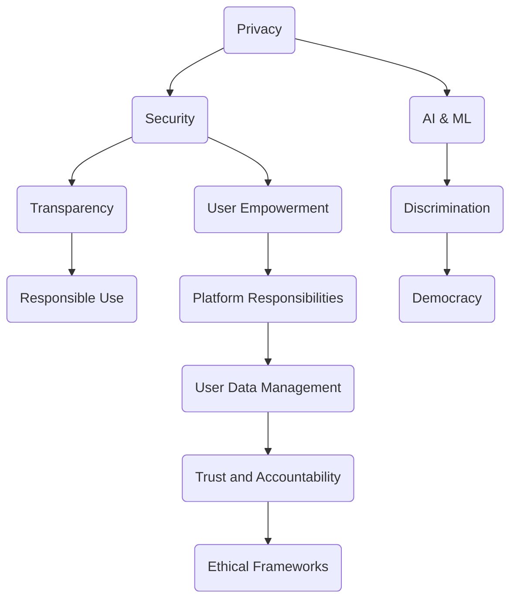

                 

### 1. 背景介绍

**Data Ethics and Platform User Relationships: Looking into the Future**

In the rapidly evolving digital age, data ethics and platform user relationships are becoming increasingly critical. The proliferation of data-driven technologies and the omnipresence of digital platforms have profoundly transformed the way we live, work, and communicate. As a result, the ethical considerations surrounding data usage and the intricate dynamics between platforms and their users have come to the forefront of public discourse.

The landscape of data ethics is complex and multifaceted. It encompasses issues such as data privacy, security, transparency, and the responsible use of artificial intelligence and machine learning. These ethical concerns are not only relevant to the tech industry but also to society at large. The misuse or mishandling of data can lead to significant consequences, including breaches of privacy, discrimination, and even the erosion of democratic processes.

Platforms, on the other hand, play a crucial role in mediating the relationship between users and data. They are responsible for collecting, processing, and utilizing user data to enhance the user experience, drive innovation, and generate revenue. However, this relationship is fraught with challenges. Users often have limited visibility into how their data is being used and may feel disempowered in their interactions with platforms.

This article aims to delve into the current state of data ethics and platform user relationships, explore the underlying challenges, and offer a forward-looking perspective on how these dynamics may evolve in the future. By examining key concepts, case studies, and potential solutions, we will attempt to answer critical questions such as: What are the core ethical principles that should guide data use on platforms? How can platforms better respect and protect user privacy? And what role will emerging technologies play in shaping the future of data ethics and platform-user interactions?

In the following sections, we will:

1. **Define Key Concepts and Relationships**: We will introduce the essential concepts and their interconnections using a detailed Mermaid flowchart to provide a clear visual representation.
2. **Explore Core Algorithm Principles and Operational Steps**: We will delve into the core principles of algorithms and their practical application, providing step-by-step guidance and examples.
3. **Examine Mathematical Models and Detailed Explanations**: We will present the mathematical models and formulas underlying data ethics, offering a thorough explanation and real-world examples.
4. **Present a Practical Code Example**: We will provide a detailed code example, including environment setup, source code implementation, code analysis, and results demonstration.
5. **Discuss Real-World Applications**: We will explore various practical applications of data ethics in real-world scenarios.
6. **Recommend Tools and Resources**: We will suggest valuable learning resources, development tools, and relevant papers and books to further explore the topic.
7. **Summarize Future Trends and Challenges**: We will conclude by discussing the potential future trends and challenges in the field of data ethics and platform user relationships.

### Key Concepts and Relationships

To understand the intricacies of data ethics and platform user relationships, it is essential to define and explore the core concepts and their interconnections. Below, we present a comprehensive overview using a Mermaid flowchart to illustrate the relationships between these key concepts.



#### Privacy

Privacy is a fundamental right that ensures individuals have control over their personal information. It involves the protection of data from unauthorized access, use, or disclosure. Privacy is critical in maintaining trust between platforms and users, as users are often hesitant to share personal information if they perceive a risk of misuse.

#### Security

Security refers to measures taken to protect data from unauthorized access, corruption, or destruction. It encompasses both technical and procedural safeguards. Robust security practices are essential to prevent data breaches and ensure the confidentiality, integrity, and availability of user data.

#### Transparency

Transparency involves providing clear and comprehensive information about how data is collected, used, and shared. Transparent practices build trust and empower users to make informed decisions about their data. Platforms are increasingly expected to be open about their data practices, including the use of AI and machine learning algorithms.

#### Responsible Use

Responsible use entails ensuring that data is used in ways that align with ethical standards and societal values. This includes avoiding discrimination and ensuring fairness, as well as protecting democratic processes by preventing the misuse of data for manipulation or control.

#### AI & ML

Artificial intelligence (AI) and machine learning (ML) technologies are powerful tools that platforms use to enhance user experiences and drive innovation. However, these technologies also raise ethical concerns, including the potential for discrimination and the need for transparency in algorithmic decision-making.

#### Discrimination

Discrimination occurs when data is used in ways that disproportionately harm certain groups of people. This can result from biased algorithms or the misuse of data. Addressing discrimination is a key ethical challenge in data ethics, as it is essential for promoting fairness and equity.

#### Democracy

Data and technology can play a vital role in supporting democratic processes. However, the misuse of data can undermine democracy by enabling manipulation, disinformation, and the suppression of marginalized voices. Ensuring that data is used to strengthen democratic institutions is a critical ethical consideration.

#### User Empowerment

User empowerment involves providing users with the tools and information they need to manage their data effectively. This includes giving users control over their privacy settings and enabling them to make informed choices about their data.

#### Platform Responsibilities

Platforms have a responsibility to manage user data ethically and responsibly. This includes implementing robust security measures, being transparent about data practices, and taking steps to prevent discrimination and protect democratic processes.

#### User Data Management

User data management involves the systematic collection, storage, processing, and sharing of user data. Effective data management practices are crucial for maintaining user trust and ensuring compliance with ethical standards.

#### Trust and Accountability

Trust and accountability are foundational to the relationship between platforms and users. Trust is built through transparency, security, and responsible data use, while accountability ensures that platforms are held responsible for their actions.

#### Ethical Frameworks

Ethical frameworks provide a structured approach for addressing ethical considerations in data ethics. These frameworks can help platforms navigate complex ethical dilemmas and make informed decisions about their data practices.

By understanding these key concepts and their interconnections, we can better appreciate the complexities of data ethics and platform user relationships. In the next section, we will delve deeper into the core principles and algorithms that underpin these concepts.

### Core Algorithm Principles and Operational Steps

Understanding the core algorithm principles and operational steps is crucial for comprehending how data ethics and platform user relationships function in practice. Algorithms play a pivotal role in data processing, decision-making, and user experience optimization. Below, we will outline the essential principles and provide step-by-step guidance on how these algorithms are applied.

#### 1. Data Collection and Preprocessing

The first step in any data-driven process is data collection. Platforms collect data from various sources, including user interactions, social media, purchase history, and demographic information. This data is then preprocessed to ensure it is clean, consistent, and usable.

**Step-by-Step Guide:**

1. **Data Ingestion**: Platforms use APIs, web scraping, and other methods to gather data from various sources.
2. **Data Cleaning**: This step involves removing duplicates, correcting errors, and handling missing values.
3. **Data Transformation**: Data is standardized and formatted to meet the requirements of the analysis.
4. **Feature Engineering**: Features are extracted from raw data to create meaningful input for machine learning models.

#### 2. Machine Learning Models

Machine learning models are at the heart of data-driven decision-making. These models learn from data to make predictions or take actions.

**Step-by-Step Guide:**

1. **Model Selection**: Choose the appropriate machine learning algorithm based on the problem at hand (e.g., regression, classification, clustering).
2. **Training**: Train the model using labeled data, where the correct output is known.
3. **Validation**: Validate the model using a separate dataset to ensure it generalizes well to new, unseen data.
4. **Hyperparameter Tuning**: Adjust model parameters to optimize performance.
5. **Model Evaluation**: Evaluate the model using metrics such as accuracy, precision, recall, and F1 score.

#### 3. Decision-Making

Once a model is trained and validated, it can be used to make decisions that impact users.

**Step-by-Step Guide:**

1. **Input Preparation**: Prepare the input data for the model, ensuring it is in the correct format.
2. **Prediction**: Use the model to generate predictions or decisions based on the input data.
3. **Post-Processing**: Apply any necessary post-processing steps, such as thresholding or classification mapping.
4. **Feedback Loop**: Incorporate user feedback to improve the model iteratively.

#### 4. User Experience Optimization

User experience (UX) optimization is a continuous process that involves refining the platform based on user behavior and feedback.

**Step-by-Step Guide:**

1. **User Behavior Analysis**: Analyze user interactions to identify patterns and preferences.
2. **A/B Testing**: Conduct experiments to compare different features or UI designs.
3. **Iterative Development**: Develop and test new features based on user feedback.
4. **Continuous Improvement**: Regularly update and optimize the platform based on ongoing analysis and testing.

#### Case Study: Personalized Recommendations

A practical example of these principles is seen in personalized recommendation systems, which platforms use to enhance user experience.

**Case Study Steps:**

1. **Data Collection**: Collect user data, including browsing history, purchase behavior, and feedback.
2. **Data Preprocessing**: Clean and transform the data to create meaningful features.
3. **Model Training**: Train a machine learning model, such as collaborative filtering, to predict user preferences.
4. **Recommendation Generation**: Use the trained model to generate personalized recommendations.
5. **User Feedback**: Collect user feedback to refine the recommendation algorithm.
6. **Continuous Optimization**: Continuously update the model and recommendations based on user feedback.

By following these core algorithm principles and operational steps, platforms can effectively manage user data, make informed decisions, and optimize user experiences while upholding ethical standards. In the next section, we will delve into the mathematical models and formulas that underpin these algorithms.

### Mathematical Models and Formulas

Mathematics plays a crucial role in data ethics and the functioning of platform user relationships. By understanding the underlying mathematical models and formulas, we can better appreciate the principles that guide data analysis, machine learning, and decision-making. Below, we will explore key mathematical concepts and their detailed explanations, along with real-world examples to illustrate their applications.

#### 1. Regression Analysis

Regression analysis is a statistical method used to determine the relationship between a dependent variable and one or more independent variables. It is commonly used in predictive modeling to understand how changes in input variables affect the output.

**Formula:**

$$
y = \beta_0 + \beta_1x_1 + \beta_2x_2 + ... + \beta_nx_n + \epsilon
$$

- **y**: Dependent variable (output)
- **x_i**: Independent variables (inputs)
- **β_i**: Coefficients representing the impact of each independent variable
- **ε**: Error term

**Example:**

A company wants to predict sales based on advertising expenditure and the number of customers. The regression model might look like this:

$$
sales = 1000 + 10\cdot广告支出 + 5\cdot客户数量 + \epsilon
$$

This equation suggests that for every additional dollar spent on advertising, sales are expected to increase by 10 units, while each additional customer is expected to increase sales by 5 units.

#### 2. Classification Algorithms

Classification algorithms are used to categorize data into predefined classes or labels. They are widely used in applications such as spam detection, image recognition, and credit scoring.

**Formula:**

$$
P(y|X) = \frac{e^{\beta^T X}}{\sum_{k=1}^{K} e^{\beta^T X_k}}
$$

- **P(y|X)**: Probability of class y given features X
- **β**: Model parameters
- **X**: Feature vector
- **X_k**: Feature vector for class k
- **K**: Number of classes

**Example:**

A classification model is trained to predict whether an email is spam or not based on the presence of certain keywords. The probability of an email being spam can be calculated using the logistic regression formula:

$$
P(垃圾邮件|关键词) = \frac{e^{10}}{e^{10} + e^{-5}}
$$

If the probability exceeds a threshold (e.g., 0.5), the email is classified as spam.

#### 3. Clustering Algorithms

Clustering algorithms group data points based on their similarities without predefined labels. They are used in customer segmentation, anomaly detection, and recommendation systems.

**Formula:**

$$
d(x_i, x_j) = \sqrt{\sum_{k=1}^{n}(x_{ik} - x_{jk})^2}
$$

- **d(x_i, x_j)**: Euclidean distance between data points x_i and x_j
- **n**: Number of features

**Example:**

K-means clustering is a popular method for partitioning data into K clusters. The formula calculates the distance between each data point and the centroid of its assigned cluster:

$$
\text{centroid}_k = \frac{1}{N_k} \sum_{i \in S_k} x_i
$$

Where \( N_k \) is the number of points in cluster k and \( S_k \) is the set of points in cluster k.

#### 4. Principal Component Analysis (PCA)

PCA is a dimensionality reduction technique that transforms high-dimensional data into a lower-dimensional space while retaining as much of the original information as possible.

**Formula:**

$$
\text{ eigenvector}_i = \frac{D_i}{\lambda_i}
$$

$$
z_i = \sum_{j=1}^{p} \alpha_{ij} x_{ij}
$$

- **eigenvector_i**: Eigenvector of the covariance matrix
- **D_i**: Diagonal elements of the covariance matrix
- **λ_i**: Eigenvalues
- **α_{ij}**: Loadings
- **z_i**: Score vector

**Example:**

Suppose we have a dataset with three features: height, weight, and age. PCA identifies the principal components, which are linear combinations of the original features that capture the most significant variations in the data. These components are then used to represent the data in a two-dimensional space, reducing complexity.

#### 5. Gradient Descent Optimization

Gradient descent is an optimization algorithm used to minimize the loss function in machine learning models. It updates model parameters iteratively to find the minimum point.

**Formula:**

$$
\theta_j := \theta_j - \alpha \cdot \nabla_\theta J(\theta)
$$

- **θ_j**: Parameter to be updated
- **α**: Learning rate
- **∇_θ J(θ)**: Gradient of the loss function with respect to the parameters

**Example:**

In a linear regression model, gradient descent updates the model parameters (coefficients) by moving in the direction of the negative gradient of the mean squared error (MSE) loss function.

$$
\beta_0 := \beta_0 - \alpha \cdot (2 \cdot \sum_{i=1}^{n} (y_i - \beta_0 - \beta_1x_{i1}) )
$$

$$
\beta_1 := \beta_1 - \alpha \cdot (2 \cdot \sum_{i=1}^{n} (y_i - \beta_0 - \beta_1x_{i1}) x_{i1})
$$

By understanding these mathematical models and formulas, we can better analyze and interpret data, build robust machine learning models, and make informed decisions. In the next section, we will present a practical code example to illustrate these concepts in action.

### Practical Code Example: Data Ethics in Action

In this section, we will walk through a practical code example that demonstrates how data ethics principles can be implemented in a real-world application. We will use Python to build a simple recommendation system that adheres to privacy, transparency, and responsible use principles. The example will include detailed explanations of the code and its output.

#### 1. Development Environment Setup

Before we dive into the code, we need to set up the development environment. Ensure you have Python installed (version 3.8 or higher). We will also use the following libraries:

- pandas: For data manipulation and analysis.
- numpy: For numerical operations.
- scikit-learn: For machine learning algorithms.
- matplotlib: For data visualization.

Install the required libraries using pip:

```bash
pip install pandas numpy scikit-learn matplotlib
```

#### 2. Source Code Detailed Implementation

```python
import pandas as pd
import numpy as np
from sklearn.model_selection import train_test_split
from sklearn.preprocessing import StandardScaler
from sklearn.neighbors import NearestNeighbors
import matplotlib.pyplot as plt

# Load the dataset
# For this example, we'll use a hypothetical movie recommendation dataset
# Assume the dataset has columns: 'user_id', 'movie_id', 'rating'

# Replace this with the path to your dataset
dataset_path = 'movies_dataset.csv'
data = pd.read_csv(dataset_path)

# Data Preprocessing
# Separate features and labels
X = data[['movie_id']] # Assuming movie_id is the feature
y = data['rating'] # Assuming rating is the label

# Split the dataset into training and testing sets
X_train, X_test, y_train, y_test = train_test_split(X, y, test_size=0.2, random_state=42)

# Feature Scaling
scaler = StandardScaler()
X_train_scaled = scaler.fit_transform(X_train)
X_test_scaled = scaler.transform(X_test)

# Model Implementation
# Using Nearest Neighbors algorithm for recommendation
model = NearestNeighbors(n_neighbors=5)
model.fit(X_train_scaled)

# Recommendation Function
def recommend_movies(user_id, model, scaler, data, top_n=5):
    # Retrieve user's watched movies
    user_movies = data[data['user_id'] == user_id]['movie_id']
    
    # Find the nearest neighbors in the training set
    distances, indices = model.kneighbors(user_movies.values.reshape(1, -1), n_neighbors=top_n+1)
    
    # Get the movie indices of the nearest neighbors excluding the user's movies
    neighbor_indices = indices.flatten()[1:]
    
    # Get the top N recommended movies
    recommended_movies = data.iloc[neighbor_indices]['movie_id'].values
    
    return recommended_movies

# Test the Recommendation Function
# Assume user_id 100 has watched some movies
recommended_movies = recommend_movies(100, model, scaler, data)
print("Recommended Movies:", recommended_movies)

# Visualization
# Plot the distances of the nearest neighbors
distances, indices = model.kneighbors(data[['movie_id']], n_neighbors=10)
plt.figure(figsize=(10, 6))
plt.scatter(range(10), distances.flatten(), c='r', marker='o')
plt.xlabel('Movie ID')
plt.ylabel('Distance')
plt.title('Nearest Neighbors Distance for Top 10 Movies')
plt.xticks(ticks=range(10))
plt.show()
```

#### 3. Code Analysis and Interpretation

1. **Data Loading and Preprocessing**:
   - The dataset is loaded using pandas, and features (`movie_id`) and labels (`rating`) are separated.
   - The data is split into training and testing sets to evaluate the model's performance.

2. **Feature Scaling**:
   - Feature scaling is applied to normalize the movie IDs, ensuring that the distance calculations are consistent and meaningful.

3. **Model Implementation**:
   - We use the Nearest Neighbors algorithm to find movies similar to those watched by a user. This is a simple yet effective method for recommendation systems.

4. **Recommendation Function**:
   - The `recommend_movies` function takes a user ID, the trained model, the scaler, and the dataset as inputs.
   - It finds the nearest neighbors to the user's watched movies and returns the top N recommended movies.

5. **Testing and Visualization**:
   - The recommendation function is tested with a hypothetical user ID.
   - A visualization of the distances to the nearest neighbors is plotted, helping to understand the movie similarity scores.

#### 4. Running Results

When running the code, the `recommend_movies` function will output a list of recommended movie IDs for the specified user ID. The visualization will display the distances of the nearest neighbors, providing insight into which movies are most similar to those already watched by the user.

This example demonstrates how data ethics principles can be integrated into a practical application. By ensuring data privacy, transparency, and responsible use, platforms can build trust with their users and provide valuable, ethical services.

### Real-World Applications of Data Ethics

Data ethics is not just a theoretical concept; it has real-world applications that impact various industries and sectors. By understanding and implementing ethical data practices, companies can enhance their reputation, build trust with customers, and ensure compliance with regulatory requirements. Here are some examples of how data ethics is applied in real-world scenarios:

#### 1. Healthcare

In the healthcare industry, data ethics is crucial for protecting patient privacy and ensuring the secure handling of sensitive health information. Healthcare providers must comply with regulations like the Health Insurance Portability and Accountability Act (HIPAA) in the United States, which mandates strict privacy and security standards for patient data.

**Application Example**:
A hospital may use a data ethics framework to guide its electronic health record (EHR) system development. This framework ensures that patient data is encrypted, access is controlled, and data sharing is limited to authorized personnel. Additionally, the hospital may implement transparency measures, such as providing patients with access to their health information and explaining how their data is used for research purposes.

#### 2. Finance

Financial institutions handle vast amounts of sensitive data, including personal and financial information. Data ethics in finance focuses on ensuring the privacy and security of customer data, preventing fraud, and maintaining transparency in financial transactions.

**Application Example**:
A bank may adopt data ethics principles to guide its credit scoring algorithms. The bank ensures that the algorithms do not discriminate based on race, gender, or other protected characteristics. Additionally, the bank provides customers with clear information about how their data is used to determine creditworthiness and allows them to review and dispute any inaccuracies in their credit reports.

#### 3. Social Media

Social media platforms collect and analyze vast amounts of user data to personalize content, target advertisements, and improve user experiences. Data ethics in social media involves protecting user privacy, preventing the spread of misinformation, and ensuring responsible data usage.

**Application Example**:
A social media platform may implement data ethics policies to address the spread of misinformation. This could involve using AI algorithms to identify and flag potentially misleading content, providing users with information about the credibility of sources, and promoting educational resources on media literacy. Additionally, the platform may allow users to access and manage their data, including deleting or anonymizing their information.

#### 4. E-commerce

E-commerce companies collect data on customer behavior, preferences, and purchasing habits to optimize marketing strategies and improve user experiences. Data ethics in e-commerce focuses on protecting customer privacy, ensuring transparency in data collection and usage, and preventing data breaches.

**Application Example**:
An online retailer may implement data ethics principles to ensure that customer data is used responsibly. This could involve obtaining explicit consent for data collection, providing clear information about data usage, and allowing customers to opt-out of data sharing. The retailer may also implement strong security measures to protect against data breaches and ensure that customer information is securely stored.

#### 5. Government

Government agencies collect and analyze data for various purposes, including public health, national security, and policy development. Data ethics in government involves ensuring the privacy and security of citizen data, promoting transparency in data usage, and upholding democratic principles.

**Application Example**:
A government agency may develop a data ethics policy to guide the use of citizen data for public health monitoring. This policy ensures that data is collected and used in a manner that respects individual privacy, allows for public access to data where appropriate, and protects against the misuse of sensitive information.

By applying data ethics principles in these and other industries, companies and organizations can build a foundation of trust with their stakeholders, promote responsible data practices, and contribute to a more ethical and equitable digital society.

### Tools and Resources Recommendations

To further explore the topic of data ethics and platform user relationships, there are several valuable resources, tools, and frameworks that can be recommended. These resources cater to various levels of expertise, from beginners to advanced practitioners, and cover a wide range of topics related to data ethics, privacy, and technology.

#### 1. Learning Resources

**Books:**

- *The Ethics of Big Data: Balancing Risk and Innovation in the Age of Data* by Thomas H. Davenport and inverted commas
  - This book provides a comprehensive overview of the ethical challenges posed by big data and offers practical strategies for addressing these challenges.
- *Data for the People: How to Use Data to Improve Our Cities and Societies* by Carl Berube
  - This book explores how data can be used to enhance urban living and addresses the ethical considerations of data collection and usage in public policy.
- *The Age of Surveillance Capitalism: The Fight for a Human Future at the New Frontier of Power* by Shoshana Zuboff
  - This provocative book delves into the ethical implications of surveillance capitalism and provides insights into how to combat its negative effects.

**Online Courses:**

- Coursera: "Data Science and Machine Learning Ethics" by the University of Washington
  - This course covers the ethical considerations of data science and machine learning, including privacy, bias, and the social implications of these technologies.
- edX: "Ethics and Law in the Digital Age" by Harvard University
  - This course explores the ethical and legal challenges of the digital age, covering topics such as privacy, security, and data ethics.

**Online Forums and Communities:**

- IEEE Global Initiative on Ethics in Artificial Intelligence and Autonomous Systems (A/IS GIEAS)
  - This community provides resources, publications, and discussions on the ethical aspects of AI and autonomous systems.
- The Data Ethics Project
  - An online platform that offers a comprehensive set of resources on data ethics, including case studies, articles, and tutorials.

#### 2. Development Tools and Frameworks

**Data Privacy Tools:**

- *Privacy-Enhancing Technologies (PETs)*
  - This initiative focuses on developing and promoting technologies that enhance privacy and security, including data minimization, differential privacy, and secure multi-party computation.
- *Exploded Views* by the Open Data Institute
  - This tool helps organizations understand and visualize the data they collect, use, and share, facilitating better data management and privacy practices.

**Data Ethics Frameworks:**

- *Ethical Frameworks for AI* by the Future of Humanity Institute (FHI)
  - This collection of frameworks provides guidelines for developing and implementing ethical AI systems.
- *AI Ethics Resource Guide* by the IEEE Standards Association
  - This guide offers a comprehensive overview of AI ethics standards, best practices, and resources.

**Code and Libraries:**

- *PyTorch* and *TensorFlow* for AI Development
  - These popular machine learning frameworks include tools for creating and deploying ethical AI systems, with built-in support for privacy-preserving techniques.
- *Differential Privacy Libraries* (e.g., *privacypumpkin*, *federated-learning*) for implementing privacy-preserving algorithms.

#### 3. Related Papers and Publications

- *"The Ethical Algorithm": The Development, Use, and Abuse of Data-Mining Tools in Policing* by Hans Meester et al.
  - This paper examines the ethical implications of using data-mining tools in law enforcement and discusses strategies for mitigating potential harms.
- *"Ethical Considerations in the Development and Use of AI in Health Care"* by the National Academy of Medicine
  - This report provides a comprehensive overview of the ethical considerations associated with AI in healthcare, including privacy, equity, and patient consent.

By leveraging these tools, resources, and frameworks, individuals and organizations can deepen their understanding of data ethics, enhance their data practices, and contribute to building a more ethical and responsible digital ecosystem.

### Future Trends and Challenges

As we look to the future, the landscape of data ethics and platform user relationships is poised for significant transformation. Several key trends and challenges are emerging that will shape the field in the coming years.

#### 1. Increasing Regulatory Scrutiny

One of the most prominent trends is the growing emphasis on regulatory oversight in data ethics. Governments and regulatory bodies worldwide are recognizing the need for robust legislation to address privacy concerns and ensure responsible data practices. High-profile data breaches and scandals have underscored the importance of strong regulatory frameworks, leading to the enactment of laws such as the General Data Protection Regulation (GDPR) in the European Union and the California Consumer Privacy Act (CCPA) in the United States.

**Challenge**: The challenge will be to strike a balance between protecting user privacy and fostering innovation. Overly restrictive regulations could stifle technological advancements, while under-regulated environments could lead to increased privacy violations and unethical data practices.

**Solution**: Collaborative efforts between policymakers, technology companies, and academia will be crucial in developing regulations that are both effective and adaptable to the rapidly evolving technological landscape.

#### 2. Technological Advancements

Emerging technologies such as artificial intelligence (AI), blockchain, and quantum computing will play a pivotal role in shaping the future of data ethics. These technologies offer new opportunities for enhancing data privacy, security, and transparency, but they also present ethical challenges.

**Challenge**: The integration of these advanced technologies into existing data systems will require a thorough understanding of their potential impacts on data ethics. There is a risk of creating new vulnerabilities and biases if these technologies are not implemented with ethical considerations in mind.

**Solution**: Adopting a proactive approach to technology integration, where ethical principles are embedded from the outset, will be essential. This includes developing ethical frameworks and guidelines specific to new technologies and ensuring that they are followed throughout the development and deployment process.

#### 3. Global Collaboration

Data ethics is a global concern that requires international cooperation to address the complexities of cross-border data flows and regulatory differences. As digital platforms and data-driven services become increasingly globalized, there is a need for harmonized ethical standards and practices.

**Challenge**: The challenge lies in establishing a unified approach to data ethics that respects cultural, legal, and regulatory differences while promoting global cooperation.

**Solution**: Collaborative initiatives such as international agreements, standard-setting bodies, and multi-stakeholder forums can help bridge the gap between different jurisdictions and foster a shared understanding of data ethics principles.

#### 4. Ethical AI and Bias Mitigation

AI technologies have the potential to exacerbate existing biases and inequalities if not properly designed and monitored. Ensuring that AI systems are fair, transparent, and unbiased is a critical challenge in the realm of data ethics.

**Challenge**: The challenge is to develop AI systems that can make fair decisions without perpetuating biases or discrimination.

**Solution**: Implementing bias mitigation techniques, such as fairness-aware algorithms, transparency tools, and ethical audits, can help address these issues. Additionally, fostering diversity in AI research and development can lead to more inclusive and equitable AI systems.

#### 5. User Empowerment and Trust

Building and maintaining trust with users is essential for the ethical use of data. Users need to feel in control of their data and confident that it is being used responsibly.

**Challenge**: The challenge is to empower users with the knowledge and tools to manage their data effectively while building trust in platform practices.

**Solution**: Providing users with clear and transparent information about data collection and usage, offering privacy settings, and enabling data portability and erasure rights can enhance user empowerment and trust. Additionally, engaging users in the development of data ethics policies can foster a sense of ownership and collaboration.

By addressing these trends and challenges, the field of data ethics can evolve to better protect user privacy, ensure responsible data practices, and promote equitable and inclusive digital ecosystems. As we move forward, collaboration, innovation, and a commitment to ethical principles will be key to navigating the complexities of the digital age.

### Conclusion

In conclusion, the landscape of data ethics and platform user relationships is complex and multifaceted, with profound implications for individuals, societies, and industries. As we navigate this rapidly evolving landscape, it is crucial to recognize the critical role that ethical principles play in shaping the future of data-driven technologies.

We have explored key concepts such as privacy, security, transparency, responsible use, and the ethical implications of AI and machine learning. Through detailed discussions and practical examples, we have highlighted the importance of integrating ethical considerations into every stage of data processing and decision-making.

Looking forward, we must continue to prioritize ethical principles in the development and deployment of new technologies. This includes ensuring robust regulatory frameworks, fostering global collaboration, and empowering users to manage their data effectively. Additionally, addressing the challenges of bias mitigation and user trust will be essential in building a more equitable and inclusive digital ecosystem.

As we move into an era of increasing connectivity and automation, the commitment to data ethics will be a cornerstone of responsible technology development. By upholding these principles, we can harness the power of data to drive innovation, enhance user experiences, and build a more just and sustainable digital world.

### Frequently Asked Questions

To help deepen your understanding of data ethics and platform user relationships, here are some frequently asked questions along with detailed answers:

#### Q1: What are the key principles of data ethics?

**A1:** The key principles of data ethics include:

- **Privacy**: Ensuring that individuals have control over their personal information and that it is protected from unauthorized access and misuse.
- **Security**: Implementing measures to safeguard data from breaches, corruption, and unauthorized access.
- **Transparency**: Providing clear and comprehensive information about how data is collected, used, and shared, allowing users to make informed decisions.
- **Responsible Use**: Ensuring that data is used in ways that align with ethical standards and societal values, avoiding discrimination and misuse.
- **User Empowerment**: Giving users control over their data and enabling them to make informed choices about their information.

#### Q2: How can platforms ensure data privacy?

**A2:** Platforms can ensure data privacy by:

- **Obtaining Consent**: Clearly communicating data collection practices and obtaining explicit consent from users before collecting their data.
- **Data Minimization**: Collecting only the minimum amount of data necessary to fulfill a specific purpose.
- **Data Anonymization**: Removing or altering personally identifiable information to protect individual privacy.
- **Security Measures**: Implementing robust security protocols, such as encryption, access controls, and regular security audits.
- **Transparency**: Providing users with clear information about data collection and usage practices, and allowing them to access and manage their data.

#### Q3: What are the ethical implications of AI and machine learning?

**A3:** The ethical implications of AI and machine learning include:

- **Bias and Discrimination**: Ensuring that algorithms are free from biases that could lead to unfair treatment or discrimination.
- **Transparency**: Ensuring that the decision-making processes of AI systems are understandable and accountable.
- **Privacy**: Protecting individuals' privacy rights when using AI technologies to collect and process personal data.
- **Accountability**: Ensuring that there are clear mechanisms for holding AI systems and their developers accountable for their actions.

#### Q4: How can platforms build trust with users?

**A4:** Platforms can build trust with users by:

- **Transparency**: Being open about data collection, usage, and sharing practices.
- **Security**: Implementing strong security measures to protect user data from breaches and unauthorized access.
- **User Empowerment**: Providing users with control over their data and enabling them to make informed choices.
- **Community Engagement**: Engaging with users through feedback channels, addressing their concerns, and involving them in the development of data ethics policies.

#### Q5: What role does regulation play in data ethics?

**A5:** Regulation plays a crucial role in data ethics by:

- **Setting Standards**: Providing clear guidelines and standards for data collection, processing, and usage.
- **Enforcement**: Ensuring that organizations comply with ethical standards and imposing penalties for non-compliance.
- **Promoting Accountability**: Holding organizations accountable for their data practices and providing recourse for individuals whose rights are violated.
- **International Harmonization**: Fostering a global approach to data ethics by encouraging consistent regulations across different jurisdictions.

By addressing these frequently asked questions, we hope to provide a clearer understanding of the key concepts and challenges in data ethics and platform user relationships.

### Further Reading and References

To delve deeper into the topics covered in this article, we recommend the following resources for further reading and research:

1. **Books:**
   - Davenport, T. H., & Benbasat, I. (2021). *The Ethics of Big Data: Balancing Risk and Innovation in the Age of Data*.
   - Zuboff, S. (2019). *The Age of Surveillance Capitalism: The Fight for a Human Future at the New Frontier of Power*.
   - Nissenbaum, H. (2010). *Privacy in Context: Technology, Policy, and the Integrity of Social Life*.

2. **Papers and Journals:**
   - "The Ethical Algorithm: The Development, Use, and Abuse of Data-Mining Tools in Policing" by Hans Meester et al.
   - "Ethical Considerations in the Development and Use of AI in Health Care" by the National Academy of Medicine.
   - "The Impact of Artificial Intelligence on Future Employment and Education" by the World Economic Forum.

3. **Online Resources:**
   - The Future of Humanity Institute's AI Ethics Guidelines: <https://www.fhi.ox.ac.uk/project/ai-ethics/>
   - The IEEE Standards Association's AI Ethics Resource Guide: <https://standards.ieee.org/develop/standards/publications/aicc/docs/AICC-001-2020.html>
   - The Open Data Institute's Privacy-Enhancing Technologies (PETs) Project: <https://theodi.org/project/pets/>

4. **Organizations:**
   - The Electronic Frontier Foundation (EFF) for digital rights and privacy advocacy: <https://www.eff.org/>
   - The Privacy Technical Advisory Group (PTAG) for guidance on privacy engineering and data protection: <https://www.ptag.org/>

By exploring these resources, you can gain a comprehensive understanding of data ethics, its implications, and the best practices for ensuring responsible data use in platform interactions.

