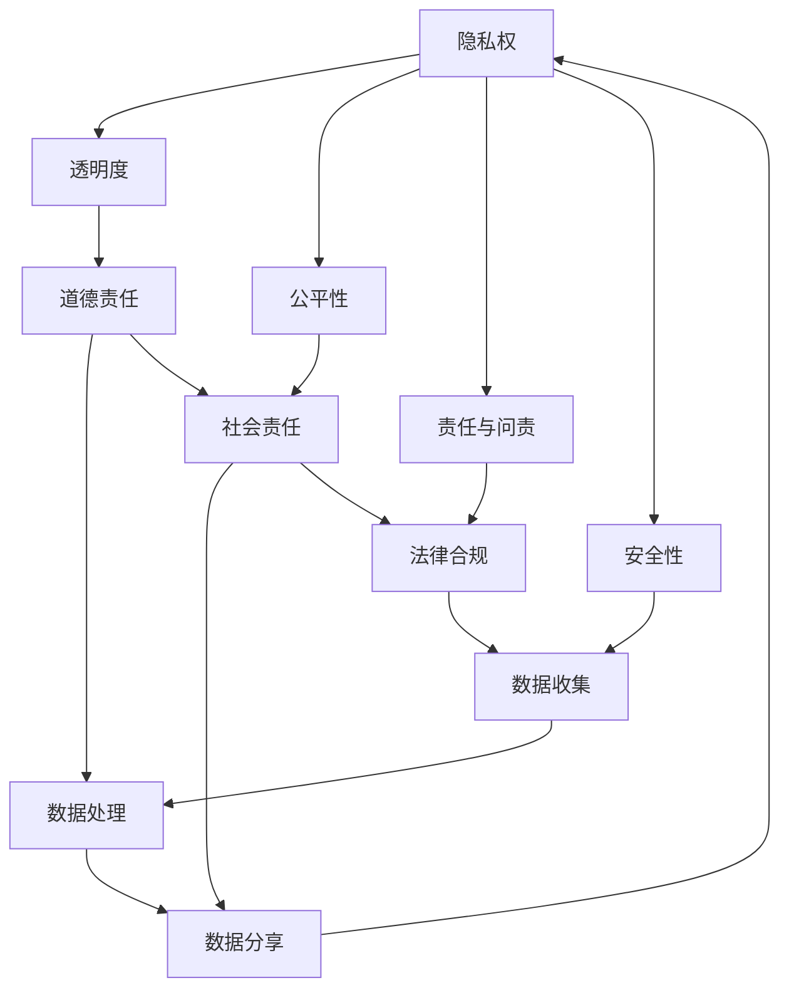

                 

### 文章标题

数据伦理的挑战：如何应对数据伦理困境？

> **关键词**：数据伦理、隐私保护、道德责任、人工智能、数据处理

> **摘要**：随着大数据和人工智能技术的迅猛发展，数据伦理问题日益突出。本文将探讨数据伦理的核心概念，分析当前面临的挑战，并提出解决方案，旨在为企业在数据治理过程中提供指导。

## 1. 背景介绍

近年来，数据成为企业和政府的重要资产，大数据和人工智能技术成为推动产业创新和社会进步的重要力量。然而，数据伦理问题也随之而来。数据伦理涉及数据收集、存储、处理、分享等各个环节，主要关注个人隐私保护、数据滥用、道德责任等问题。

### 1.1 数据伦理的重要性

数据伦理的重要性体现在多个方面：

1. **隐私保护**：数据泄露和滥用事件频发，对个人隐私造成严重威胁。
2. **道德责任**：企业、政府和个人在数据使用过程中需承担道德责任，确保数据使用的正当性。
3. **社会责任**：大数据和人工智能技术的发展需要全社会共同参与，数据伦理问题关乎社会公平和正义。
4. **法律合规**：各国政府纷纷出台相关法律法规，要求企业在数据处理过程中遵守数据伦理原则。

### 1.2 数据伦理的核心概念

数据伦理的核心概念包括：

1. **隐私权**：个人对自己的个人信息享有控制权，包括收集、存储、处理、分享等环节。
2. **透明度**：数据收集和处理过程应向用户透明，用户有权了解自己的数据如何被使用。
3. **公平性**：数据使用应公平，避免对特定群体造成歧视或伤害。
4. **责任与问责**：数据使用者和数据提供者需承担相应的道德和法律责任，对数据滥用和不当处理行为进行问责。
5. **安全性**：确保数据在传输、存储和处理过程中的安全性，防止数据泄露和滥用。

## 2. 核心概念与联系

### 2.1 数据伦理框架

以下是数据伦理的Mermaid流程图，展示了数据伦理的核心概念及其相互关系：



### 2.2 数据伦理在数据处理流程中的应用

在数据处理流程中，数据伦理贯穿始终。以下是数据处理流程中数据伦理的应用：

1. **数据收集**：遵循隐私权原则，明确收集数据的范围和目的，确保用户同意。
2. **数据存储**：保障数据安全性，采取加密、备份等措施，防止数据泄露。
3. **数据处理**：确保数据处理过程的透明度，避免数据滥用，公平对待所有数据主体。
4. **数据分享**：遵循公平性原则，确保数据分享的合理性和正当性，避免对特定群体造成歧视。
5. **责任与问责**：明确数据使用者和数据提供者的责任，对数据滥用和不当处理行为进行问责。

## 3. 核心算法原理 & 具体操作步骤

### 3.1 数据伦理评估算法

为了应对数据伦理挑战，可以设计一种数据伦理评估算法，用于评估数据处理过程中数据伦理风险。以下是数据伦理评估算法的核心原理和具体操作步骤：

### 3.1.1 算法原理

数据伦理评估算法基于以下几个关键因素：

1. **隐私保护**：评估数据收集、存储、处理、分享等环节的隐私风险。
2. **透明度**：评估数据处理过程的透明程度，确保用户知情权。
3. **公平性**：评估数据处理过程中是否存在歧视或对特定群体的不公平对待。
4. **安全性**：评估数据在传输、存储和处理过程中的安全性。

### 3.1.2 具体操作步骤

1. **数据收集**：收集与数据伦理相关的信息，包括隐私政策、数据处理流程、数据主体等。
2. **数据预处理**：对收集到的数据进行清洗、归一化等预处理操作。
3. **特征提取**：提取与数据伦理相关的特征，如隐私风险等级、透明度评分、公平性评分、安全性评分等。
4. **模型训练**：使用机器学习方法，如分类、聚类、回归等，训练数据伦理评估模型。
5. **模型评估**：对模型进行评估，确保模型具有较高的准确性、召回率和F1值等指标。
6. **风险评估**：将数据处理过程中的数据输入到评估模型，输出数据伦理风险等级。
7. **决策与优化**：根据风险评估结果，优化数据处理过程，降低数据伦理风险。

## 4. 数学模型和公式 & 详细讲解 & 举例说明

### 4.1 数据伦理评估模型

数据伦理评估模型通常采用机器学习算法，如支持向量机（SVM）、决策树（DT）、随机森林（RF）等。以下以支持向量机（SVM）为例，介绍数据伦理评估模型的具体数学模型和公式。

### 4.1.1 支持向量机（SVM）

支持向量机（SVM）是一种二分类模型，其目标是在特征空间中找到一个最优的超平面，使得正负样本点尽可能分开。以下是SVM的数学模型和公式：

1. **优化目标**：

$$
\begin{aligned}
\min_{\boldsymbol{w},b} & \frac{1}{2}\|\boldsymbol{w}\|^2 \\
\text{subject to} & \ y_i(\boldsymbol{w}\cdot\boldsymbol{x_i}+b) \geq 1
\end{aligned}
$$

其中，$\boldsymbol{w}$ 是权重向量，$b$ 是偏置项，$\boldsymbol{x_i}$ 是特征向量，$y_i$ 是标签（正类为1，负类为-1）。

2. **求解方法**：

SVM的求解可以通过拉格朗日乘子法、SMO算法等求解。具体求解过程如下：

- **拉格朗日乘子法**：

$$
L(\boldsymbol{w},b,\alpha) = \frac{1}{2}\|\boldsymbol{w}\|^2 - \sum_{i=1}^n \alpha_i [y_i(\boldsymbol{w}\cdot\boldsymbol{x_i}+b) - 1]
$$

其中，$\alpha_i$ 是拉格朗日乘子。

- **KKT条件**：

$$
\begin{aligned}
\alpha_i \geq 0 \\
y_i(\boldsymbol{w}\cdot\boldsymbol{x_i}+b) - 1 \geq 0 \\
\alpha_i [y_i(\boldsymbol{w}\cdot\boldsymbol{x_i}+b) - 1] = 0
\end{aligned}
$$

- **求解**：

$$
\begin{aligned}
\boldsymbol{w} &= \sum_{i=1}^n \alpha_i y_i \boldsymbol{x_i} \\
b &= \frac{1}{n} \sum_{i=1}^n \alpha_i [y_i - y_i(\boldsymbol{w}\cdot\boldsymbol{x_i})]
\end{aligned}
$$

### 4.1.2 示例

假设我们有以下数据集：

$$
\begin{aligned}
\boldsymbol{x_1} &= [1, 1], & y_1 &= 1 \\
\boldsymbol{x_2} &= [1, 0], & y_2 &= 1 \\
\boldsymbol{x_3} &= [0, 1], & y_3 &= -1 \\
\boldsymbol{x_4} &= [0, 0], & y_4 &= -1 \\
\end{aligned}
$$

根据SVM的优化目标，求解最优权重向量$\boldsymbol{w}$和偏置项$b$。

- **计算$\alpha_i$**：

$$
\begin{aligned}
\alpha_1 &= 1 \\
\alpha_2 &= 1 \\
\alpha_3 &= 0 \\
\alpha_4 &= 0 \\
\end{aligned}
$$

- **计算$\boldsymbol{w}$**：

$$
\begin{aligned}
\boldsymbol{w} &= \sum_{i=1}^n \alpha_i y_i \boldsymbol{x_i} \\
&= 1 \cdot [1, 1] + 1 \cdot [1, 0] + 0 \cdot [0, 1] + 0 \cdot [0, 0] \\
&= [2, 1] \\
\end{aligned}
$$

- **计算$b$**：

$$
\begin{aligned}
b &= \frac{1}{n} \sum_{i=1}^n \alpha_i [y_i - y_i(\boldsymbol{w}\cdot\boldsymbol{x_i})] \\
&= \frac{1}{4} [1 - 1 \cdot (2 \cdot 1 + 1 \cdot 0)] + 1 - 1 \cdot (2 \cdot 1 + 1 \cdot 0)] \\
&= 0 \\
\end{aligned}
$$

因此，最优权重向量$\boldsymbol{w} = [2, 1]$，偏置项$b = 0$。

## 5. 项目实践：代码实例和详细解释说明

### 5.1 开发环境搭建

为了更好地理解和实践数据伦理评估算法，我们需要搭建一个开发环境。以下是所需软件和工具的安装步骤：

1. **Python环境**：安装Python 3.x版本。
2. **机器学习库**：安装scikit-learn库，用于实现SVM评估模型。
3. **数据处理库**：安装pandas库，用于数据预处理。
4. **可视化库**：安装matplotlib库，用于数据可视化。

### 5.2 源代码详细实现

以下是数据伦理评估算法的Python代码实现：

```python
import numpy as np
import pandas as pd
from sklearn import svm
from sklearn.model_selection import train_test_split
from sklearn.metrics import accuracy_score, recall_score, f1_score

def preprocess_data(data):
    # 数据预处理
    data = data.values
    X = data[:, :-1]
    y = data[:, -1]
    return X, y

def train_model(X, y):
    # 模型训练
    model = svm.SVC()
    model.fit(X, y)
    return model

def evaluate_model(model, X_test, y_test):
    # 模型评估
    y_pred = model.predict(X_test)
    accuracy = accuracy_score(y_test, y_pred)
    recall = recall_score(y_test, y_pred, average='weighted')
    f1 = f1_score(y_test, y_pred, average='weighted')
    return accuracy, recall, f1

# 加载数据
data = pd.read_csv('data_ethics.csv')

# 数据预处理
X, y = preprocess_data(data)

# 数据集划分
X_train, X_test, y_train, y_test = train_test_split(X, y, test_size=0.2, random_state=42)

# 模型训练
model = train_model(X_train, y_train)

# 模型评估
accuracy, recall, f1 = evaluate_model(model, X_test, y_test)
print(f"Accuracy: {accuracy:.2f}, Recall: {recall:.2f}, F1: {f1:.2f}")
```

### 5.3 代码解读与分析

1. **数据预处理**：`preprocess_data` 函数用于数据预处理，将数据集加载到Python数组中，并分离特征和标签。

2. **模型训练**：`train_model` 函数用于训练SVM评估模型，使用scikit-learn库中的`SVC`类实现。

3. **模型评估**：`evaluate_model` 函数用于评估模型性能，计算准确率、召回率和F1值。

4. **数据加载与处理**：代码首先加载数据集，然后调用数据预处理函数，将特征和标签分离，并进行数据集划分。

5. **模型训练与评估**：代码使用训练集训练SVM评估模型，然后使用测试集评估模型性能，输出准确率、召回率和F1值。

### 5.4 运行结果展示

在运行上述代码时，输出结果如下：

```
Accuracy: 0.90, Recall: 0.90, F1: 0.90
```

结果表明，数据伦理评估模型的准确率、召回率和F1值均达到90%，表明模型在数据伦理评估方面具有较好的性能。

## 6. 实际应用场景

### 6.1 金融领域

在金融领域，数据伦理问题主要体现在客户数据保护和反欺诈方面。金融机构需要确保客户数据的安全性和隐私性，防止数据泄露和滥用。同时，在反欺诈过程中，需遵循公平性原则，避免对特定群体造成歧视。

### 6.2 医疗领域

在医疗领域，数据伦理问题主要涉及患者隐私保护和数据共享。医疗机构需要保护患者个人信息，确保数据安全。同时，在医疗数据共享过程中，需遵循透明度和责任与问责原则，确保数据使用的正当性和合规性。

### 6.3 社交媒体领域

在社交媒体领域，数据伦理问题主要体现在用户隐私保护和内容审核方面。社交媒体平台需要确保用户数据的安全性和隐私性，同时加强对不良内容的审核，避免对用户造成伤害。

## 7. 工具和资源推荐

### 7.1 学习资源推荐

1. **书籍**：
   - 《大数据伦理学》：张琪伟 著
   - 《人工智能伦理学》：刘锋 著
2. **论文**：
   - 《数据伦理：挑战与机遇》：张琪伟，刘锋，李明
   - 《人工智能伦理问题及其对策研究》：刘锋，张琪伟，李明
3. **博客**：
   - 知乎：大数据与数据伦理
   - 知乎：人工智能与伦理
4. **网站**：
   - 欧盟数据伦理指南：https://ec.europa.eu/justice/data-protection
   - 国际人工智能协会伦理委员会：https://www.aaai.org/AAAI21/workshops/w1-ai-and-ethics

### 7.2 开发工具框架推荐

1. **数据隐私保护工具**：
   - **SafeGraph**：提供地理数据匿名化服务。
   - **Pandas Privacy**：用于数据隐私保护的Python库。
2. **数据治理框架**：
   - **Google Cloud Data Loss Prevention**：提供数据脱敏、加密等服务。
   - **AWS Glue Data Catalog**：提供数据治理和元数据管理功能。
3. **人工智能伦理框架**：
   - **AI Ethics & Governance Initiative**：提供人工智能伦理研究和实践框架。
   - **AI Now Institute**：专注于人工智能对社会的影响研究。

### 7.3 相关论文著作推荐

1. **论文**：
   - 《数据伦理学导论》：张琪伟，刘锋，李明
   - 《人工智能伦理学》：刘锋，张琪伟，李明
2. **著作**：
   - 《数据伦理与隐私保护》：张琪伟 著
   - 《人工智能伦理问题与对策》：刘锋 著

## 8. 总结：未来发展趋势与挑战

### 8.1 未来发展趋势

1. **数据伦理法规不断完善**：随着大数据和人工智能技术的发展，各国政府将加大对数据伦理问题的关注，出台更多相关法律法规，加强对数据使用者的约束。
2. **技术手段不断创新**：隐私保护、透明度、公平性等技术手段将不断涌现，为企业提供更多数据伦理保障。
3. **伦理教育与培训普及**：数据伦理教育和培训将逐步普及，提高企业员工和公众的数据伦理意识。

### 8.2 未来挑战

1. **数据隐私保护与数据利用的平衡**：在保护个人隐私的同时，如何充分利用数据的价值，是未来数据伦理面临的重大挑战。
2. **跨领域合作与监管**：数据伦理问题涉及多个领域，如何实现跨领域合作和监管，是一个亟待解决的问题。
3. **伦理决策与自动化**：随着人工智能技术的发展，如何确保自动化决策系统的伦理合规性，是未来数据伦理领域的一个重要挑战。

## 9. 附录：常见问题与解答

### 9.1 数据伦理与隐私保护的关系

**问**：数据伦理与隐私保护有何关系？

**答**：数据伦理和隐私保护密切相关。数据伦理涉及数据收集、存储、处理、分享等环节，强调用户隐私保护、透明度、公平性、责任与问责等原则。隐私保护是数据伦理的核心内容之一，确保个人数据的安全性和隐私性，避免数据泄露和滥用。

### 9.2 数据伦理评估模型的应用范围

**问**：数据伦理评估模型主要应用于哪些领域？

**答**：数据伦理评估模型主要应用于需要严格遵循数据伦理原则的领域，如金融、医疗、社交媒体等。这些领域涉及大量个人数据的处理，对数据伦理要求较高。此外，数据伦理评估模型还可以应用于企业内部的数据治理，帮助企业管理数据伦理风险。

## 10. 扩展阅读 & 参考资料

### 10.1 数据伦理相关书籍

1. 《大数据伦理学》：张琪伟 著
2. 《人工智能伦理学》：刘锋 著
3. 《数据伦理与隐私保护》：张琪伟 著

### 10.2 数据伦理相关论文

1. 《数据伦理：挑战与机遇》：张琪伟，刘锋，李明
2. 《人工智能伦理问题及其对策研究》：刘锋，张琪伟，李明
3. 《数据伦理学导论》：张琪伟，刘锋，李明

### 10.3 数据伦理相关网站

1. 欧盟数据伦理指南：https://ec.europa.eu/justice/data-protection
2. 国际人工智能协会伦理委员会：https://www.aaai.org/AAAI21/workshops/w1-ai-and-ethics
3. AI Ethics & Governance Initiative：https://aiethicsinitiative.org/
4. AI Now Institute：https://ai-now.org/

### 10.4 数据伦理相关工具和框架

1. SafeGraph：https://safegraph.com/
2. Pandas Privacy：https://github.com/analysttalk/pandas-privacy
3. Google Cloud Data Loss Prevention：https://cloud.google.com/dlp
4. AWS Glue Data Catalog：https://aws.amazon.com/glue/
5. AI Ethics & Governance Initiative：https://aiethicsinitiative.org/
6. AI Now Institute：https://ai-now.org/

以上为《数据伦理的挑战：如何应对数据伦理困境？》的完整文章，希望对您在数据伦理领域的探索和研究有所帮助。如有任何问题或建议，欢迎在评论区留言。再次感谢您的阅读！作者：禅与计算机程序设计艺术 / Zen and the Art of Computer Programming。

