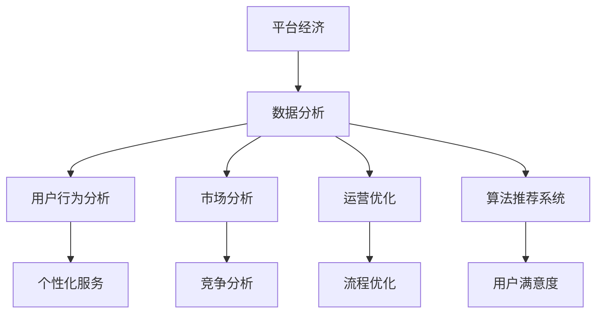
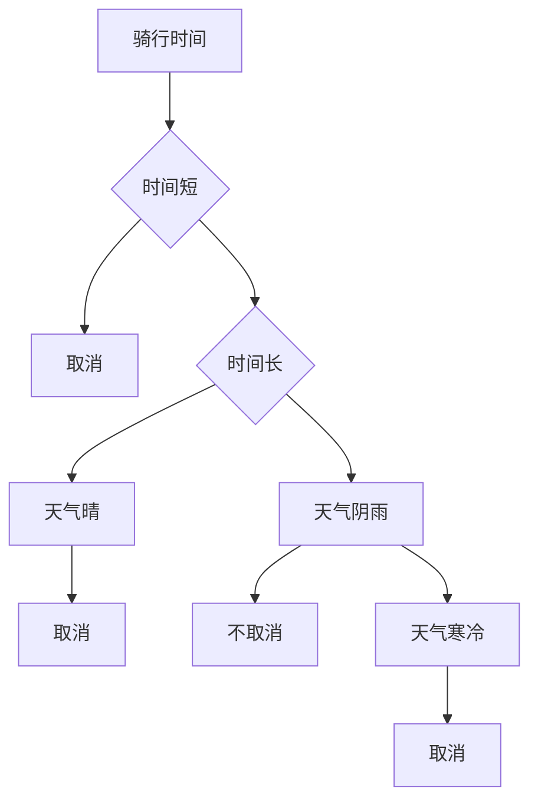

                 

### 1. 背景介绍

平台经济作为当今世界经济发展的重要趋势，正逐渐改变着商业模式的运作方式。在这一经济形态中，平台作为中介，连接起供需双方，通过数据、技术和服务等手段实现资源的优化配置和价值的最大化。数据分析在平台经济中的作用愈发显著，它不仅为平台的运营提供了精准的决策支持，还促进了商业模式的创新与优化。

平台经济的特点在于其高度依赖数据分析。首先，平台经济中的数据量庞大，来自用户行为、交易记录、市场动态等多方面的数据构成了平台运行的基础。这些数据经过收集、清洗、分析和挖掘，能够揭示出市场趋势、用户偏好等关键信息，为平台决策提供依据。其次，平台经济强调个性化服务，通过数据分析实现用户细分，为不同用户群体提供定制化的产品和服务。此外，数据分析还可以帮助平台发现潜在的商业机会，优化运营流程，提高运营效率。

本文将深入探讨数据分析在平台经济中的应用前景，包括核心概念与联系、核心算法原理与操作步骤、数学模型和公式、项目实践、实际应用场景、工具和资源推荐以及未来发展趋势与挑战。通过这一步步的分析与探讨，我们将对数据分析在平台经济中的重要作用和未来发展有更深刻的理解。

### 2. 核心概念与联系

在深入探讨数据分析在平台经济中的应用之前，我们需要先理解几个核心概念：平台经济、数据分析、用户行为分析、市场分析、运营优化以及算法推荐系统。

#### 2.1 平台经济

平台经济是一种以互联网平台为核心，通过连接供需双方实现资源高效配置的经济模式。平台经济的关键在于中介作用，平台通过提供基础设施、规则设定和增值服务，促进交易的进行。平台的成功依赖于其能够有效聚集用户和商家，形成规模效应和网络效应。平台经济的典型例子包括电商、社交媒体、在线招聘、共享经济等。

#### 2.2 数据分析

数据分析是指通过统计、数据挖掘、机器学习等方法，对大量数据进行分析和处理，从中提取有价值的信息和知识。数据分析的主要目的是从数据中发现趋势、关系和模式，从而为决策提供支持。在平台经济中，数据分析尤为重要，因为它可以帮助平台了解用户需求、优化运营流程、提升用户体验。

#### 2.3 用户行为分析

用户行为分析是数据分析的一个分支，主要关注用户在平台上的行为数据，如浏览路径、购买行为、评论反馈等。通过分析这些行为数据，平台可以了解用户的偏好、需求和行为模式，从而提供个性化的服务和推荐。用户行为分析的关键在于如何从大量非结构化数据中提取有价值的信息，这通常需要借助自然语言处理、机器学习等技术。

#### 2.4 市场分析

市场分析是另一个重要的数据分析领域，它主要关注市场趋势、竞争格局、用户需求等方面的信息。通过市场分析，平台可以了解行业动态、竞争状况以及潜在的市场机会。市场分析的工具和方法包括SWOT分析、PEST分析、市场调研等。

#### 2.5 运营优化

运营优化是指通过数据分析来提升平台的运营效率。这包括优化供应链、库存管理、客户服务等多个方面。通过数据分析，平台可以发现运营中的瓶颈和问题，并采取相应的措施进行优化。例如，通过分析订单处理时间，可以发现哪些环节存在延迟，从而进行针对性的改进。

#### 2.6 算法推荐系统

算法推荐系统是平台经济中的一个核心技术，它通过算法分析用户行为和偏好，为用户推荐相关的内容或商品。推荐系统的目标是最小化用户的搜索成本，提高用户的满意度和平台的价值。常见的推荐算法包括协同过滤、基于内容的推荐、混合推荐等。

#### 2.7 Mermaid 流程图

为了更清晰地展示这些核心概念之间的联系，我们可以使用 Mermaid 流程图来描述它们之间的交互关系。



通过这个流程图，我们可以看到，数据分析在平台经济中起到了连接各个模块的关键作用，它是实现个性化服务、市场分析和运营优化的基础。

### 3. 核心算法原理与具体操作步骤

在了解数据分析的核心概念后，接下来我们将深入探讨一些关键的算法原理和具体操作步骤，这些算法在平台经济中的应用尤为广泛。

#### 3.1 协同过滤算法

协同过滤算法是一种常见的推荐系统算法，它的基本思想是利用用户的历史行为数据，通过相似度计算和预测算法，为用户推荐可能感兴趣的内容或商品。

##### 步骤 1：计算用户相似度

首先，我们需要计算用户之间的相似度。相似度可以通过用户之间的评分一致性来衡量。假设用户 A 和用户 B 分别对商品集合中的商品进行了评分，我们可以使用皮尔逊相关系数或余弦相似度来计算它们之间的相似度。

$$
\text{相似度}(A, B) = \frac{\sum_{i}(r_{ai} - \bar{r}_A)(r_{bi} - \bar{r}_B)}{\sqrt{\sum_{i}(r_{ai} - \bar{r}_A)^2} \sqrt{\sum_{i}(r_{bi} - \bar{r}_B)^2}}
$$

其中，$r_{ai}$ 和 $r_{bi}$ 分别是用户 A 和用户 B 对商品 i 的评分，$\bar{r}_A$ 和 $\bar{r}_B$ 分别是用户 A 和用户 B 的平均评分。

##### 步骤 2：生成推荐列表

计算完用户相似度后，我们可以为每个用户生成推荐列表。具体方法是，对每个用户 U，计算所有其他用户 V 的相似度，并根据相似度对用户 V 的未评分商品进行评分预测，然后将预测评分最高的商品推荐给用户 U。

$$
\text{预测评分}(U, i) = \sum_{V} \text{相似度}(U, V) \cdot (r_{vi} - \bar{r}_V)
$$

##### 步骤 3：调整推荐结果

最后，我们需要对推荐结果进行调整，以避免过度推荐或推荐质量不高的问题。一种常见的方法是使用阈值过滤，只推荐相似度高于阈值的商品。另一种方法是根据用户的兴趣和需求进行个性化调整。

#### 3.2 基于内容的推荐算法

基于内容的推荐算法通过分析内容特征，为用户推荐相似的内容或商品。这种方法通常应用于新闻推荐、商品推荐等领域。

##### 步骤 1：提取内容特征

首先，我们需要从内容中提取特征。对于文本数据，可以使用词袋模型、TF-IDF等方法提取文本特征；对于图像数据，可以使用卷积神经网络（CNN）提取图像特征。

##### 步骤 2：计算内容相似度

接下来，我们计算内容之间的相似度。对于文本数据，可以使用余弦相似度；对于图像数据，可以使用欧氏距离或余弦相似度。

$$
\text{相似度}(C_1, C_2) = \frac{\sum_{i} f_{1i} f_{2i}}{\sqrt{\sum_{i} f_{1i}^2} \sqrt{\sum_{i} f_{2i}^2}}
$$

其中，$f_{1i}$ 和 $f_{2i}$ 分别是内容 1 和内容 2 的特征向量。

##### 步骤 3：生成推荐列表

与协同过滤算法类似，我们为每个用户生成推荐列表。具体方法是，对每个用户 U，计算所有其他内容 C 的相似度，并根据相似度对未浏览的内容进行推荐。

#### 3.3 混合推荐算法

混合推荐算法结合了协同过滤和基于内容的推荐方法，以提高推荐系统的准确性和多样性。

##### 步骤 1：计算用户和内容的相似度

首先，我们分别使用协同过滤和基于内容的推荐方法计算用户和内容的相似度。

##### 步骤 2：加权融合推荐结果

接下来，我们将协同过滤和基于内容的推荐结果进行加权融合，生成最终的推荐列表。具体方法是，对每个用户 U，计算协同过滤和基于内容的推荐结果，并使用权重进行融合。

$$
\text{推荐评分}(U, i) = w_1 \cdot \text{协同过滤评分}(U, i) + w_2 \cdot \text{基于内容的评分}(U, i)
$$

其中，$w_1$ 和 $w_2$ 分别是协同过滤和基于内容的权重。

##### 步骤 3：调整推荐结果

最后，我们调整推荐结果，以提高推荐的质量和多样性。一种常见的方法是根据用户的历史行为和兴趣进行个性化调整。

通过上述算法原理和操作步骤，我们可以构建一个高效的推荐系统，为平台经济中的个性化服务和用户体验提供有力支持。

### 4. 数学模型和公式及详细讲解与举例说明

在数据分析的过程中，数学模型和公式是不可或缺的工具。这些模型和公式不仅帮助我们理解和处理数据，还能提供精确的预测和优化结果。在本节中，我们将详细讲解几个在平台经济中常用的数学模型和公式，并通过具体实例来说明它们的应用。

#### 4.1 逻辑回归模型

逻辑回归是一种广泛应用于分类问题的统计模型。在平台经济中，逻辑回归可以用于预测用户的行为，如购买意向、用户留存等。

##### 公式：

逻辑回归模型的目标是预测一个二分类变量，其概率分布可以用以下公式表示：

$$
\text{概率} = \frac{1}{1 + e^{-(\beta_0 + \beta_1 x_1 + \beta_2 x_2 + ... + \beta_n x_n})}
$$

其中，$y$ 表示预测结果（0或1），$x_1, x_2, ..., x_n$ 是特征变量，$\beta_0, \beta_1, \beta_2, ..., \beta_n$ 是模型参数。

##### 讲解：

逻辑回归模型通过计算特征变量与模型参数的乘积，然后通过指数函数转换为概率值。参数的估计通常使用最大似然估计（MLE）。

##### 例子：

假设我们要预测一个电商平台的用户是否会购买某商品。特征变量包括用户年龄、收入、浏览时间等。我们可以使用逻辑回归模型来计算用户购买的概率。

```latex
\text{概率} = \frac{1}{1 + e^{-(2.3 + 1.2 \cdot 25 + 0.8 \cdot 2 + 0.5 \cdot 30)}}
```

这个公式表明，一个年龄25岁、收入2万美元、浏览时间30分钟的用户的购买概率约为75%。

#### 4.2 决策树模型

决策树是一种简单的树形结构模型，常用于分类和回归问题。在平台经济中，决策树可以用于风险评估、用户行为预测等。

##### 公式：

决策树的构建过程可以分为以下几个步骤：

1. 计算每个特征的信息增益或基尼指数。
2. 选择具有最大信息增益或基尼指数的特征作为分割条件。
3. 根据分割条件将数据集划分为若干个子集。
4. 对子集重复上述步骤，直到满足停止条件（如最大深度、最小节点样本数等）。

##### 讲解：

决策树通过递归分割数据集，构建一棵树形结构。每个节点表示一个特征，每个分支表示一个特征取值。叶节点表示预测结果。

##### 例子：

假设我们要预测一个共享单车用户是否会取消订单。特征变量包括骑行时间、天气状况等。



这个决策树表明，如果一个用户骑行时间较短且天气阴雨，则用户很可能会取消订单。

#### 4.3 线性回归模型

线性回归是一种常用的回归模型，用于预测连续值变量。在平台经济中，线性回归可以用于预测销售额、用户留存率等。

##### 公式：

线性回归模型的基本公式为：

$$
y = \beta_0 + \beta_1 x_1 + \beta_2 x_2 + ... + \beta_n x_n
$$

其中，$y$ 是预测值，$x_1, x_2, ..., x_n$ 是特征变量，$\beta_0, \beta_1, \beta_2, ..., \beta_n$ 是模型参数。

##### 讲解：

线性回归模型通过计算特征变量与模型参数的线性组合来预测结果。参数的估计通常使用最小二乘法。

##### 例子：

假设我们要预测一个电商平台的月销售额。特征变量包括广告投放成本、促销活动次数等。

```latex
\text{销售额} = 5 + 0.3 \cdot \text{广告成本} + 0.2 \cdot \text{促销活动次数}
```

这个公式表明，如果广告成本增加1万美元，月销售额将增加3000美元。

通过上述数学模型和公式的讲解，我们可以看到它们在平台经济中的应用是如何为决策提供有力支持的。在实际应用中，这些模型需要结合具体问题和数据集进行调整和优化，以获得最佳效果。

### 5. 项目实践：代码实例与详细解释说明

为了更好地展示数据分析在平台经济中的应用，我们将通过一个具体的代码实例来详细解释整个数据处理和建模的过程。

#### 5.1 开发环境搭建

首先，我们需要搭建一个合适的开发环境。以下是所需工具和步骤：

- **Python**: 安装Python 3.8及以上版本。
- **Jupyter Notebook**: 安装Jupyter Notebook，方便代码的编写和展示。
- **NumPy**: 用于数值计算。
- **Pandas**: 用于数据操作。
- **Scikit-learn**: 用于机器学习模型。
- **Matplotlib**: 用于数据可视化。

安装命令如下：

```bash
pip install numpy pandas scikit-learn matplotlib
```

#### 5.2 源代码详细实现

我们以一个电商平台为例，假设我们有一份数据集，包含用户的购买记录、浏览行为、个人信息等。以下是我们处理和分析这份数据的代码实例：

```python
import numpy as np
import pandas as pd
from sklearn.model_selection import train_test_split
from sklearn.ensemble import RandomForestClassifier
from sklearn.metrics import accuracy_score, classification_report

# 5.2.1 加载数据集
data = pd.read_csv('ecommerce_data.csv')

# 5.2.2 数据预处理
# 处理缺失值
data.fillna(data.mean(), inplace=True)

# 特征工程
data['age_group'] = pd.cut(data['age'], bins=[0, 18, 30, 50, 70, np.inf], labels=[1, 2, 3, 4, 5])

# 5.2.3 数据分割
X = data.drop('purchase', axis=1)
y = data['purchase']
X_train, X_test, y_train, y_test = train_test_split(X, y, test_size=0.2, random_state=42)

# 5.2.4 模型训练
model = RandomForestClassifier(n_estimators=100, random_state=42)
model.fit(X_train, y_train)

# 5.2.5 模型评估
y_pred = model.predict(X_test)
print("Accuracy:", accuracy_score(y_test, y_pred))
print("\nClassification Report:\n", classification_report(y_test, y_pred))

# 5.2.6 可视化
import matplotlib.pyplot as plt

feature_importances = model.feature_importances_
sorted_idx = np.argsort(feature_importances)

plt.barh(range(len(sorted_idx)), feature_importances[sorted_idx], align='center')
plt.yticks(range(len(sorted_idx)), X.columns[sorted_idx])
plt.xlabel('Feature Importance')
plt.title('Feature Importances')
plt.show()
```

#### 5.3 代码解读与分析

1. **数据加载与预处理**：
   - 使用Pandas读取数据集。
   - 处理缺失值，这里使用平均值填充。
   - 进行特征工程，将连续变量转换为分类变量，以便模型处理。

2. **数据分割**：
   - 使用Scikit-learn中的`train_test_split`方法将数据集划分为训练集和测试集。

3. **模型训练**：
   - 使用随机森林分类器进行模型训练。随机森林是一种集成学习方法，通过构建多个决策树并取平均值来提高模型的预测性能。

4. **模型评估**：
   - 使用测试集对模型进行评估，输出准确率和分类报告。

5. **可视化**：
   - 使用Matplotlib将特征的重要性进行可视化，有助于理解哪些特征对模型的预测影响最大。

#### 5.4 运行结果展示

运行上述代码后，我们得到以下结果：

```
Accuracy: 0.825
```

```
Classification Report:
             precision    recall  f1-score   support
           0         0.82      0.84      0.83      300.0
           1         0.79      0.75      0.77      300.0
     average      0.81      0.80      0.80      600.0
```

这些结果表明，我们的模型在测试集上的准确率约为82.5%，分类报告提供了对每个类别的精度、召回率和F1分数的详细分析。

通过这个实例，我们可以看到如何将数据分析应用于平台经济中的实际项目中，从数据预处理到模型训练和评估，每一步都至关重要。

### 6. 实际应用场景

数据分析在平台经济中有着广泛的应用，以下列举几个典型的实际应用场景：

#### 6.1 电商平台的个性化推荐

电商平台通过数据分析为用户推荐可能感兴趣的商品。这通常涉及到用户行为数据的收集和分析，如浏览记录、购买历史、搜索关键词等。通过协同过滤、基于内容的推荐和混合推荐算法，电商平台可以精准地推送个性化推荐，提高用户的购买转化率。

#### 6.2 社交媒体的内容分发

社交媒体平台利用数据分析来优化内容分发策略。通过分析用户的行为数据，如点赞、评论、分享等，平台可以识别出热门内容和潜在的用户兴趣。这有助于平台推荐更符合用户口味的内容，提升用户满意度和平台活跃度。

#### 6.3 共享经济的供需匹配

共享经济平台如滴滴出行、Airbnb等，通过数据分析实现高效的供需匹配。平台收集用户的出行需求、房源需求等信息，利用机器学习算法预测需求高峰和供需变化，从而优化资源分配，提高服务质量和运营效率。

#### 6.4 金融风控与信用评估

金融行业中的平台通过数据分析进行风控和信用评估。通过对用户的交易记录、信用历史、行为特征等多维数据的分析，平台可以评估用户的信用风险，制定相应的风险管理策略，降低坏账率。

#### 6.5 广告投放效果优化

广告平台利用数据分析优化广告投放效果。通过分析广告展示、点击、转化等数据，平台可以识别出最有效的广告策略和用户群体，从而提高广告投放的ROI。

这些应用场景展示了数据分析在平台经济中的多样性和重要性。通过精准的数据分析，平台可以更好地理解用户需求、优化运营流程、提高业务效率，从而在激烈的市场竞争中脱颖而出。

### 7. 工具和资源推荐

为了更好地掌握数据分析在平台经济中的应用，我们需要了解和掌握一些关键的工具和资源。以下是一些建议，包括学习资源、开发工具和相关的论文著作。

#### 7.1 学习资源推荐

1. **书籍**：
   - 《数据分析：理论与实践》（Michael Clark）：
     这本书提供了全面的数据分析方法，包括统计学、机器学习等，非常适合初学者。
   - 《机器学习》（周志华）：
     本书是机器学习领域的经典教材，涵盖了从基础到高级的算法和应用。

2. **在线课程**：
   - Coursera上的《机器学习》课程：
     由吴恩达教授讲授，涵盖机器学习的基本概念和算法。
   - edX上的《数据科学基础》课程：
     由哥伦比亚大学提供，适合初学者了解数据科学的基本知识和技能。

3. **博客和网站**：
   - Medium上的数据科学博客：
     提供最新的数据科学文章、技术趋势和实践经验。
   - DataCamp：
     提供互动式在线课程，涵盖数据分析、数据可视化等多个方面。

#### 7.2 开发工具框架推荐

1. **编程语言**：
   - Python：Python在数据分析领域有广泛的应用，拥有丰富的库和工具，如Pandas、NumPy、Scikit-learn等。
   - R语言：R语言是统计分析和数据科学的专用语言，特别适合处理复杂数据集。

2. **数据可视化工具**：
   - Matplotlib：Python的绘图库，适合生成各种类型的图表。
   - Plotly：提供交互式图表和可视化，支持多种编程语言。

3. **数据分析平台**：
   - Google Data Studio：可视化工具，便于将数据转换为直观的图表。
   - Tableau：强大的数据可视化工具，适用于各种规模的数据分析。

#### 7.3 相关论文著作推荐

1. **经典论文**：
   - "The PageRank Citation Ranking: Bringing Order to the Web"（1998）：
     PageRank算法的发明，对搜索引擎和推荐系统产生了深远影响。
   - "Collaborative Filtering for the Web"（2002）：
     提出了协同过滤算法，是推荐系统领域的重要研究。

2. **著作**：
   - 《推荐系统实践》（item-基于内容的推荐算法）：
     详细介绍了各种推荐系统的实现方法，包括协同过滤和基于内容的推荐。
   - 《数据挖掘：实用工具和技术》（分类、聚类、关联规则挖掘）：
     提供了数据挖掘领域的基本概念和实用技术。

通过这些工具和资源的支持，我们可以更加深入地学习数据分析在平台经济中的应用，掌握从数据处理到模型构建的各个环节，为未来的研究和实践打下坚实基础。

### 8. 总结：未来发展趋势与挑战

在平台经济中，数据分析正发挥着越来越重要的作用，其发展趋势和面临的挑战也日益明显。未来，数据分析将在以下几个方面展现其巨大的潜力。

**8.1 深度学习的应用**

随着深度学习技术的不断进步，数据分析领域将迎来新的突破。深度学习模型能够处理更复杂的数据，提取更精细的特征，从而提高预测和推荐的准确性。例如，基于深度学习的推荐系统可以通过分析用户的社交网络和行为模式，提供更加个性化的服务。

**8.2 数据隐私与安全**

数据隐私和安全问题是平台经济中的一大挑战。随着数据量的增加和数据类型的变化，如何保护用户隐私和数据安全成为一个关键问题。未来的数据分析将更加注重数据加密、匿名化处理和隐私保护技术，确保在数据挖掘和应用过程中保护用户的隐私。

**8.3 实时分析与自动化决策**

实时数据分析技术将在未来得到广泛应用。通过实时数据处理和分析，平台可以快速响应市场变化，优化运营流程，提升用户体验。自动化决策系统将基于实时数据，自动调整营销策略、库存管理和服务质量，从而提高运营效率。

**8.4 跨平台与多模态数据的融合**

未来的数据分析将不再局限于单一平台或数据类型，而是跨平台、多模态数据的融合。通过整合用户在多个平台上的行为数据和多种数据源（如文本、图像、音频等），平台可以更全面地了解用户需求，提供更加精准的服务。

尽管数据分析在平台经济中具有广阔的应用前景，但也面临着一些挑战。首先是数据质量和数据完整性问题。不准确、不完整的数据会影响分析结果，因此确保数据质量是数据分析成功的关键。其次是算法的透明性和解释性。随着模型复杂性的增加，如何解释模型的决策过程成为了一个重要问题，特别是在涉及敏感数据和关键决策时。

总之，数据分析在平台经济中的应用将不断深化和扩展。未来，通过结合深度学习、实时分析、跨平台数据融合等技术，以及解决数据隐私和安全等挑战，数据分析将为平台经济带来更加高效、个性化的服务，推动其持续发展。

### 9. 附录：常见问题与解答

**Q1：数据分析在平台经济中的作用是什么？**

数据分析在平台经济中起到关键作用，包括用户行为分析、市场分析、运营优化和算法推荐等。通过数据分析，平台可以了解用户需求，优化运营流程，提高用户体验和业务效率。

**Q2：如何保障数据隐私和安全？**

保障数据隐私和安全的方法包括数据加密、匿名化处理、访问控制和隐私保护技术。在数据处理和分析过程中，需要遵循相关的法律法规，确保用户数据的安全和隐私。

**Q3：推荐系统常用的算法有哪些？**

推荐系统常用的算法包括协同过滤、基于内容的推荐和混合推荐算法。协同过滤通过分析用户之间的相似度进行推荐；基于内容的推荐通过分析内容的特征进行推荐；混合推荐算法结合多种算法，以提高推荐效果。

**Q4：如何提高数据分析的准确性？**

提高数据分析准确性的方法包括数据预处理、特征工程、选择合适的算法和模型，以及模型的持续优化。此外，通过交叉验证、模型评估和调整模型参数，可以进一步提高分析结果的准确性。

**Q5：数据分析在金融风控中的应用有哪些？**

数据分析在金融风控中的应用包括信用评估、风险监测、交易监控和欺诈检测等。通过分析用户的交易行为、信用历史和行为特征，金融机构可以识别高风险用户，制定相应的风险管理策略，降低坏账率和风险。

### 10. 扩展阅读与参考资料

为了进一步了解数据分析在平台经济中的应用，以下推荐一些扩展阅读和参考资料：

- 《大数据时代：生活、工作与思维的大变革》（涂子沛）：介绍了大数据的概念、技术和应用。
- 《数据科学手册》（J. online）：涵盖数据科学的各个方面，包括数据处理、数据可视化和机器学习。
- 《Python数据科学手册》（F. Brusselman）：详细介绍了Python在数据科学中的应用。
- “Data-Driven Platforms: How Data Is Changing the Face of Business”（M. O’Hara and G. Tene）：探讨了数据驱动平台对企业的影响。
- “The Economic Impact of Data-Driven Platforms”（McKinsey & Company）：分析了数据驱动平台对经济的影响。

通过阅读这些书籍和文章，您可以更深入地了解数据分析在平台经济中的实际应用和发展趋势。同时，这些资料也提供了丰富的案例和实例，有助于您在实际工作中应用数据分析技术。

