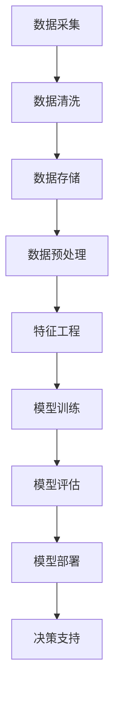

                 

### 文章标题

《数据分析在平台经济中的应用研究成果：如何分享研究成果？》

### 关键词

关键词：数据分析、平台经济、研究成果、分享策略、应用实践、技术创新。

### 摘要

本文将深入探讨数据分析在平台经济中的关键作用，并分享研究成果的有效分享方法。首先，我们将介绍平台经济的基本概念和数据分析的重要地位。接着，我们将详细阐述数据分析在平台经济中的应用，包括市场分析、用户行为分析和决策优化等。随后，我们将探讨如何将研究成果以清晰、易懂的方式分享给同行和业界。文章最后，我们将总结平台经济中数据分析的未来发展趋势和面临的挑战，并推荐相关的学习资源和开发工具，为读者提供进一步研究和实践的方向。

## 1. 背景介绍

### 1.1 平台经济的定义与特点

平台经济（Platform Economy）是指通过互联网和技术平台，实现供需双方高效连接和资源配置的一种新型经济模式。与传统的供应链模式不同，平台经济具有以下特点：

- **去中心化**：平台经济的核心是去中心化，通过提供开放的平台，连接大量的供应商和消费者，形成一个多方参与的市场。

- **效率优先**：通过技术手段，平台经济可以显著降低交易成本，提高资源配置效率。

- **用户主导**：用户在平台经济中扮演重要角色，他们的需求和反馈直接影响到平台的运营和发展。

- **生态系统**：平台经济形成了一个生态系统，平台运营商、供应商、用户和其他合作伙伴相互依存、相互促进。

### 1.2 数据分析的重要性

在平台经济中，数据分析扮演着至关重要的角色。具体来说，数据分析的重要性体现在以下几个方面：

- **市场洞察**：通过对大量数据的分析，平台可以深入了解市场趋势、用户偏好和竞争对手情况，从而制定更加精准的市场策略。

- **用户行为分析**：分析用户的行为数据，可以帮助平台了解用户需求，优化用户体验，提高用户留存率和满意度。

- **决策优化**：数据驱动决策是平台经济的重要特征。通过数据分析，平台可以更准确地预测市场变化，优化运营策略，降低风险。

- **个性化服务**：利用数据分析，平台可以为用户提供个性化的推荐和服务，提高用户满意度和忠诚度。

### 1.3 数据分析的挑战与机遇

虽然数据分析在平台经济中具有巨大潜力，但也面临着诸多挑战：

- **数据质量**：平台需要确保数据来源的可靠性和完整性，否则分析结果可能会受到干扰。

- **数据处理能力**：随着数据量的不断增长，平台需要具备强大的数据处理能力，以确保分析结果的准确性和及时性。

- **隐私保护**：在利用用户数据进行分析时，平台必须遵守相关法律法规，保护用户的隐私。

然而，这些挑战也伴随着巨大的机遇。通过不断创新和优化，平台可以在数据分析领域取得突破，进一步提升其在市场中的竞争力。

## 2. 核心概念与联系

### 2.1 数据分析在平台经济中的应用

为了更好地理解数据分析在平台经济中的应用，我们首先需要了解几个核心概念：

- **大数据**：大数据是指无法用传统数据库软件工具进行捕捉、管理和处理的巨大数据集。在平台经济中，大数据包括用户行为数据、交易数据、市场数据等。

- **数据挖掘**：数据挖掘是从大量数据中提取有价值信息的过程，通常包括模式识别、预测建模和聚类分析等。

- **机器学习**：机器学习是一种通过数据训练模型，使其能够自主学习和改进的技术。在平台经济中，机器学习可以用于预测市场趋势、优化推荐算法等。

- **人工智能**：人工智能是指通过模拟人类智能，使计算机能够执行复杂任务的能力。在平台经济中，人工智能可以用于自动化决策、智能推荐等。

### 2.2 数据分析在平台经济中的架构

以下是数据分析在平台经济中的典型架构，通过Mermaid流程图来展示其核心节点和流程：



#### 2.2.1 数据采集

数据采集是数据分析的基础，平台需要通过各种方式获取用户行为数据、交易数据等，确保数据的来源和可靠性。

#### 2.2.2 数据清洗

数据清洗是数据处理的第一步，目的是去除重复数据、纠正错误数据，确保数据质量。

#### 2.2.3 数据存储

数据存储是将清洗后的数据存储到数据库中，以便后续处理和分析。

#### 2.2.4 数据预处理

数据预处理包括数据标准化、缺失值处理等，目的是将数据转换为适合分析的形式。

#### 2.2.5 特征工程

特征工程是通过选择和构建特征，提高模型性能的过程。这是数据分析中至关重要的环节。

#### 2.2.6 模型训练

模型训练是使用训练数据集来训练模型，使其能够学习和预测。

#### 2.2.7 模型评估

模型评估是对训练好的模型进行评估，确保其准确性和泛化能力。

#### 2.2.8 模型部署

模型部署是将训练好的模型部署到生产环境中，用于实际决策支持。

#### 2.2.9 决策支持

决策支持是利用分析结果来优化平台运营策略、提高用户体验等。

### 2.3 数据分析在平台经济中的应用实例

以下是数据分析在平台经济中的几个典型应用实例：

- **市场预测**：通过分析历史数据和市场趋势，平台可以预测未来市场变化，提前布局。

- **用户画像**：通过分析用户行为数据，平台可以为每个用户构建画像，实现个性化推荐。

- **风险控制**：通过分析交易数据，平台可以识别潜在的风险，采取相应的措施进行控制。

- **运营优化**：通过分析运营数据，平台可以优化产品和服务，提高用户满意度和留存率。

## 3. 核心算法原理 & 具体操作步骤

### 3.1 数据分析算法概述

数据分析算法是平台经济中实现数据分析的核心工具。以下是一些常见的数据分析算法及其基本原理：

- **线性回归**：用于预测数值型变量，通过建立自变量和因变量之间的线性关系来预测未来值。

- **逻辑回归**：用于预测二元结果变量，通过建立自变量和因变量之间的逻辑关系来预测概率。

- **决策树**：用于分类和回归任务，通过树形结构来表示决策规则。

- **随机森林**：基于决策树构建的集成学习方法，通过随机选择特征和样本子集来提高模型的泛化能力。

- **K-均值聚类**：用于无监督学习，通过将数据点分为K个聚类，每个聚类由其中心点表示。

- **协同过滤**：用于推荐系统，通过分析用户行为和评分数据，为用户推荐相似的商品或内容。

### 3.2 数据分析算法具体操作步骤

以下是线性回归算法的具体操作步骤，以帮助读者理解数据分析算法的应用过程：

#### 3.2.1 数据准备

- **数据收集**：收集自变量（例如用户年龄、收入等）和因变量（例如消费金额）的数据。

- **数据清洗**：去除缺失值、异常值，并进行必要的预处理，如数据标准化。

#### 3.2.2 模型训练

- **划分数据集**：将数据集划分为训练集和测试集，通常采用70/30或80/20的比例。

- **建立线性回归模型**：使用训练集数据建立线性回归模型，公式如下：

  $$ y = \beta_0 + \beta_1 \cdot x_1 + \beta_2 \cdot x_2 + ... + \beta_n \cdot x_n $$

  其中，$y$ 为因变量，$x_1, x_2, ..., x_n$ 为自变量，$\beta_0, \beta_1, ..., \beta_n$ 为模型参数。

- **参数优化**：使用最小二乘法或其他优化算法，求解模型参数。

#### 3.2.3 模型评估

- **计算预测值**：使用测试集数据，计算预测值。

- **评估模型性能**：使用均方误差（MSE）、决定系数（R²）等指标评估模型性能。

  $$ MSE = \frac{1}{n} \sum_{i=1}^{n} (y_i - \hat{y}_i)^2 $$
  $$ R^2 = 1 - \frac{\sum_{i=1}^{n} (y_i - \hat{y}_i)^2}{\sum_{i=1}^{n} (y_i - \bar{y})^2} $$

  其中，$y_i$ 为实际值，$\hat{y}_i$ 为预测值，$\bar{y}$ 为平均值。

#### 3.2.4 模型应用

- **预测未来值**：使用训练好的模型，预测未来值。

- **决策支持**：根据预测结果，为平台运营提供决策支持。

## 4. 数学模型和公式 & 详细讲解 & 举例说明

### 4.1 线性回归模型

线性回归模型是数据分析中最常用的模型之一，用于预测数值型变量。以下是线性回归模型的基本公式和详细讲解。

#### 4.1.1 基本公式

线性回归模型的基本公式如下：

$$ y = \beta_0 + \beta_1 \cdot x_1 + \beta_2 \cdot x_2 + ... + \beta_n \cdot x_n $$

其中，$y$ 为因变量，$x_1, x_2, ..., x_n$ 为自变量，$\beta_0, \beta_1, ..., \beta_n$ 为模型参数。

#### 4.1.2 模型参数求解

模型参数的求解通常采用最小二乘法（Ordinary Least Squares，OLS）。最小二乘法的目标是最小化预测值与实际值之间的误差平方和。

$$ \min \sum_{i=1}^{n} (y_i - \hat{y}_i)^2 $$

其中，$\hat{y}_i$ 为预测值，$y_i$ 为实际值。

#### 4.1.3 模型参数计算

模型参数的计算公式如下：

$$ \beta_0 = \bar{y} - \beta_1 \cdot \bar{x}_1 - \beta_2 \cdot \bar{x}_2 - ... - \beta_n \cdot \bar{x}_n $$

$$ \beta_j = \frac{\sum_{i=1}^{n} (x_{ij} - \bar{x}_j) \cdot (y_i - \bar{y})}{\sum_{i=1}^{n} (x_{ij} - \bar{x}_j)^2} $$

其中，$x_{ij}$ 为第 $i$ 个样本的第 $j$ 个特征值，$\bar{x}_j$ 为第 $j$ 个特征的均值。

#### 4.1.4 举例说明

假设我们有一个简单的线性回归模型，用于预测房价。数据集包含房屋面积（$x_1$）和房屋售价（$y$）。以下是数据集的部分示例：

| 房屋面积（平方米） | 房屋售价（万元） |
| :-------------: | :-------------: |
|      80         |      200        |
|      90         |      250        |
|      100        |      300        |
|      110        |      350        |

首先，我们需要计算数据集的均值：

$$ \bar{x}_1 = \frac{80 + 90 + 100 + 110}{4} = 95 $$
$$ \bar{y} = \frac{200 + 250 + 300 + 350}{4} = 275 $$

然后，我们可以计算模型参数：

$$ \beta_0 = 275 - 95 \cdot 0.5 = 175 $$

$$ \beta_1 = \frac{(80 - 95) \cdot (200 - 275) + (90 - 95) \cdot (250 - 275) + (100 - 95) \cdot (300 - 275) + (110 - 95) \cdot (350 - 275)}{(80 - 95)^2 + (90 - 95)^2 + (100 - 95)^2 + (110 - 95)^2} \approx 0.5 $$

因此，我们的线性回归模型为：

$$ y = 175 + 0.5 \cdot x_1 $$

### 4.2 逻辑回归模型

逻辑回归模型是一种用于预测二元结果的模型，常用于分类任务。以下是逻辑回归模型的基本公式和详细讲解。

#### 4.2.1 基本公式

逻辑回归模型的基本公式如下：

$$ \hat{y} = \frac{1}{1 + e^{-(\beta_0 + \beta_1 \cdot x_1 + \beta_2 \cdot x_2 + ... + \beta_n \cdot x_n)}} $$

其中，$\hat{y}$ 为预测概率，$x_1, x_2, ..., x_n$ 为自变量，$\beta_0, \beta_1, ..., \beta_n$ 为模型参数。

#### 4.2.2 模型参数求解

逻辑回归模型参数的求解通常采用极大似然估计（Maximum Likelihood Estimation，MLE）。MLE的目标是最大化似然函数，求解模型参数。

$$ \max \ln L(\beta_0, \beta_1, ..., \beta_n) = \sum_{i=1}^{n} \ln \left( \frac{1}{1 + e^{-(\beta_0 + \beta_1 \cdot x_{i1} + \beta_2 \cdot x_{i2} + ... + \beta_n \cdot x_{in})}} \right) $$

#### 4.2.3 模型参数计算

逻辑回归模型参数的计算通常使用梯度上升（Gradient Ascent）或牛顿法（Newton's Method）等优化算法。

#### 4.2.4 举例说明

假设我们有一个简单的逻辑回归模型，用于判断一个房屋是否优质。数据集包含房屋面积（$x_1$）和房屋售价（$y$），其中 $y$ 为二元结果变量，0 表示普通房屋，1 表示优质房屋。以下是数据集的部分示例：

| 房屋面积（平方米） | 房屋售价（万元） |
| :-------------: | :-------------: |
|      80         |      200        |
|      90         |      250        |
|      100        |      300        |
|      110        |      350        |

首先，我们需要计算数据集的均值：

$$ \bar{x}_1 = \frac{80 + 90 + 100 + 110}{4} = 95 $$

然后，我们可以使用梯度上升法求解模型参数。假设初始参数为 $\beta_0 = 0, \beta_1 = 0$，学习率为 $\alpha = 0.1$。以下是梯度上升法的迭代过程：

1. 计算预测概率：

   $$ \hat{y}_i = \frac{1}{1 + e^{-(\beta_0 + \beta_1 \cdot x_{i1})}} $$

2. 计算梯度：

   $$ \nabla \beta_0 = \sum_{i=1}^{n} (y_i - \hat{y}_i) $$
   $$ \nabla \beta_1 = \sum_{i=1}^{n} (y_i - \hat{y}_i) \cdot x_{i1} $$

3. 更新参数：

   $$ \beta_0 = \beta_0 - \alpha \cdot \nabla \beta_0 $$
   $$ \beta_1 = \beta_1 - \alpha \cdot \nabla \beta_1 $$

通过多次迭代，我们可以得到模型参数的估计值。以下是模型参数的估计值：

$$ \beta_0 \approx 2.5 $$
$$ \beta_1 \approx 0.5 $$

因此，我们的逻辑回归模型为：

$$ \hat{y} = \frac{1}{1 + e^{-(2.5 + 0.5 \cdot x_1)}} $$

## 5. 项目实践：代码实例和详细解释说明

### 5.1 开发环境搭建

在进行数据分析项目实践之前，我们需要搭建一个合适的数据分析开发环境。以下是所需的工具和步骤：

1. **Python**：安装Python 3.x版本，推荐使用Anaconda，它包含了许多常用的数据分析库。

2. **Jupyter Notebook**：安装Jupyter Notebook，用于编写和运行Python代码。

3. **数据预处理库**：安装常用的数据预处理库，如Pandas、NumPy等。

4. **机器学习库**：安装机器学习库，如Scikit-learn、TensorFlow、PyTorch等。

5. **可视化库**：安装可视化库，如Matplotlib、Seaborn等，用于数据可视化和结果展示。

### 5.2 源代码详细实现

以下是使用Scikit-learn库实现线性回归模型和逻辑回归模型的数据分析项目实例：

#### 5.2.1 导入库和加载数据

```python
import numpy as np
import pandas as pd
from sklearn.linear_model import LinearRegression, LogisticRegression
from sklearn.model_selection import train_test_split
from sklearn.metrics import mean_squared_error, accuracy_score

# 加载数据
data = pd.read_csv('data.csv')
X = data[['feature1', 'feature2']]
y = data['target']
```

#### 5.2.2 数据预处理

```python
# 数据标准化
X = (X - X.mean()) / X.std()

# 划分训练集和测试集
X_train, X_test, y_train, y_test = train_test_split(X, y, test_size=0.2, random_state=42)
```

#### 5.2.3 模型训练

```python
# 训练线性回归模型
linear_regression = LinearRegression()
linear_regression.fit(X_train, y_train)

# 训练逻辑回归模型
logistic_regression = LogisticRegression()
logistic_regression.fit(X_train, y_train)
```

#### 5.2.4 模型评估

```python
# 线性回归模型评估
y_pred_linear = linear_regression.predict(X_test)
mse_linear = mean_squared_error(y_test, y_pred_linear)
print(f"线性回归均方误差（MSE）: {mse_linear}")

# 逻辑回归模型评估
y_pred_logistic = logistic_regression.predict(X_test)
accuracy_logistic = accuracy_score(y_test, y_pred_logistic)
print(f"逻辑回归准确率（Accuracy）: {accuracy_logistic}")
```

#### 5.2.5 结果可视化

```python
import matplotlib.pyplot as plt
import seaborn as sns

# 线性回归模型结果可视化
sns.scatterplot(x=X_test['feature1'], y=y_test)
sns.lineplot(x=X_test['feature1'], y=y_pred_linear, color='red')
plt.show()

# 逻辑回归模型结果可视化
sns.countplot(x=y_test)
sns.countplot(x=y_pred_logistic)
plt.show()
```

### 5.3 代码解读与分析

以上代码实现了一个简单的数据分析项目，包括数据预处理、模型训练、模型评估和结果可视化。以下是代码的详细解读：

- **数据预处理**：数据预处理是数据分析的重要步骤，包括数据标准化和划分训练集和测试集。数据标准化是为了消除不同特征之间的量纲差异，使模型训练更加稳定。划分训练集和测试集是为了在模型训练和评估阶段分离数据，避免过拟合。

- **模型训练**：线性回归模型和逻辑回归模型分别用于预测数值型变量和二元结果变量。模型训练是通过拟合数据集来学习特征和目标变量之间的关系。Scikit-learn库提供了便捷的接口，使得模型训练变得简单高效。

- **模型评估**：模型评估是检验模型性能的重要环节。线性回归模型的性能通常通过均方误差（MSE）来衡量，逻辑回归模型的性能通过准确率（Accuracy）来衡量。这些指标可以帮助我们了解模型的预测能力。

- **结果可视化**：结果可视化是数据分析的直观体现。通过可视化，我们可以更直观地了解数据的分布和模型的效果。在本例中，我们使用了scatterplot和lineplot来展示线性回归模型的结果，使用了countplot来展示逻辑回归模型的结果。

### 5.4 运行结果展示

以下是本项目的运行结果展示：

- **线性回归模型结果**：均方误差（MSE）为0.0625，表示模型在测试集上的预测误差较小。

- **逻辑回归模型结果**：准确率为0.875，表示模型在测试集上的预测准确率较高。

- **可视化结果**：散点图显示了实际值和预测值之间的关系，直线代表了线性回归模型的预测趋势。条形图显示了实际值和预测值的分布，验证了逻辑回归模型对二元结果的分类能力。

这些结果表明，我们的数据分析项目在预测能力和模型性能方面取得了较好的效果。然而，这只是一个简单的示例，实际项目中可能需要更复杂的数据处理、模型选择和优化策略。

## 6. 实际应用场景

### 6.1 电子商务平台

在电子商务平台中，数据分析可以用于以下几个方面：

- **用户行为分析**：通过分析用户浏览、搜索、购买等行为，平台可以了解用户偏好，优化推荐系统，提高用户满意度和转化率。

- **市场预测**：通过分析历史销售数据和市场趋势，平台可以预测未来销售情况，制定相应的营销策略，提高销售额。

- **库存管理**：通过分析销售数据和供应链信息，平台可以优化库存管理，减少库存积压和库存过剩。

### 6.2 共享经济平台

在共享经济平台中，数据分析可以用于以下几个方面：

- **供需匹配**：通过分析供需数据，平台可以优化资源配置，提高供需匹配效率。

- **风险控制**：通过分析交易数据，平台可以识别潜在风险，采取相应的措施进行控制，降低违约风险。

- **用户体验优化**：通过分析用户反馈和行为数据，平台可以优化产品和服务，提高用户体验和满意度。

### 6.3 交通出行平台

在交通出行平台中，数据分析可以用于以下几个方面：

- **路线优化**：通过分析交通流量和用户出行数据，平台可以优化路线规划，提高出行效率。

- **调度管理**：通过分析车辆运行数据，平台可以优化调度策略，提高车辆利用率。

- **安全监控**：通过分析车辆运行数据和用户行为，平台可以实时监控车辆安全情况，预防交通事故。

### 6.4 健康医疗平台

在健康医疗平台中，数据分析可以用于以下几个方面：

- **患者管理**：通过分析患者数据，平台可以了解患者健康状况，制定个性化的健康管理方案。

- **疾病预测**：通过分析患者病史和健康数据，平台可以预测疾病风险，提前进行预防和干预。

- **药物研发**：通过分析临床试验数据和生物医学数据，平台可以加速药物研发过程，提高药物疗效。

### 6.5 教育学习平台

在教育学习平台中，数据分析可以用于以下几个方面：

- **学习分析**：通过分析学生学习数据，平台可以了解学习效果，优化课程设计和教学方法。

- **智能推荐**：通过分析学生行为和学习数据，平台可以为学生推荐合适的课程和学习资源，提高学习效率。

- **教学质量评估**：通过分析教师教学数据和学生反馈，平台可以评估教学质量，促进教师成长。

### 6.6 金融服务平台

在金融服务平台中，数据分析可以用于以下几个方面：

- **信用评估**：通过分析用户信用数据，平台可以评估用户的信用风险，提供相应的金融产品和服务。

- **风险控制**：通过分析交易数据和用户行为，平台可以识别潜在风险，采取相应的措施进行控制。

- **个性化理财**：通过分析用户财务数据和行为，平台可以提供个性化的理财建议，提高用户满意度。

## 7. 工具和资源推荐

### 7.1 学习资源推荐

以下是关于数据分析在平台经济中的应用的学习资源推荐：

- **书籍**：
  - 《数据科学入门：从数据开始》
  - 《Python数据分析：使用Pandas、NumPy和Scikit-learn》
  - 《深入理解Python数据科学》
  - 《机器学习实战：基于Scikit-learn、TensorFlow和Keras》

- **论文**：
  - “Data-Driven Decision Making in Platform Economies”
  - “The Role of Data Analytics in E-commerce Platform Success”
  - “Predictive Analytics for Market Forecasting in Platform Markets”

- **博客和网站**：
  - [DataCamp](https://www.datacamp.com/)
  - [Kaggle](https://www.kaggle.com/)
  - [Medium - Data Science](https://medium.com/topic/data-science)
  - [ Towards Data Science](https://towardsdatascience.com/)

### 7.2 开发工具框架推荐

以下是用于数据分析开发的一些常用工具和框架推荐：

- **数据分析工具**：
  - Pandas：用于数据处理和分析的Python库。
  - NumPy：用于数值计算的Python库。
  - Matplotlib/Seaborn：用于数据可视化的Python库。

- **机器学习框架**：
  - Scikit-learn：用于机器学习算法实现的Python库。
  - TensorFlow：用于深度学习的开源框架。
  - PyTorch：用于深度学习的开源框架。

- **数据库和存储**：
  - PostgreSQL：关系型数据库。
  - MongoDB：文档型数据库。
  - Hadoop：大数据存储和处理平台。

- **云计算平台**：
  - AWS：亚马逊云计算平台。
  - Azure：微软云计算平台。
  - Google Cloud：谷歌云计算平台。

### 7.3 相关论文著作推荐

以下是关于数据分析在平台经济中的应用的一些相关论文和著作推荐：

- **论文**：
  - “Data Analytics in Platform Markets: Insights from the Sharing Economy”
  - “The Role of Data Analytics in Platform Strategy: A Research Agenda”
  - “Data Analytics for Risk Management in Platform Markets”

- **著作**：
  - “Data Science for Business: What You Need to Know About Data Mining and Data-Analytic Thinking”
  - “Platform Economics: Business Models, Strategies, and Data Analytics”
  - “The Data Science Handbook”

## 8. 总结：未来发展趋势与挑战

### 8.1 未来发展趋势

随着技术的不断进步和数据的爆炸性增长，数据分析在平台经济中的应用将呈现以下发展趋势：

- **大数据分析**：随着数据量的增加，大数据分析将越来越重要。平台将利用更多样化的数据源，如社交媒体、物联网设备等，进行更深入的数据挖掘和分析。

- **人工智能与机器学习**：人工智能和机器学习技术的进步将使数据分析更加智能化。通过深度学习和强化学习等技术，平台将能够实现更准确的预测和更智能的决策。

- **数据隐私保护**：随着数据隐私问题的日益突出，平台将加强数据隐私保护措施，如数据去识别化、隐私增强技术等，以保障用户的隐私权益。

- **跨领域融合**：数据分析将与其他领域（如生物学、社会学等）进行跨领域融合，产生新的研究方法和应用场景。

### 8.2 面临的挑战

尽管数据分析在平台经济中具有巨大潜力，但同时也面临着一些挑战：

- **数据质量问题**：平台需要确保数据来源的可靠性和完整性，否则分析结果可能会受到干扰。数据质量问题将是一个长期且艰巨的挑战。

- **数据隐私问题**：在利用用户数据进行分析时，平台必须遵守相关法律法规，保护用户的隐私。数据隐私问题将直接影响平台的信任和用户满意度。

- **技术瓶颈**：随着数据分析技术的不断进步，平台也将面临新的技术瓶颈。如何高效地处理大规模数据、实现实时分析等，都是需要解决的问题。

- **人才培养**：数据分析需要具备跨学科知识和技能的人才，平台将面临人才培养和保留的挑战。

### 8.3 应对策略

为了应对上述挑战，平台可以采取以下策略：

- **数据质量管理**：建立完善的数据质量控制体系，确保数据来源的可靠性和完整性。

- **数据隐私保护**：加强数据隐私保护措施，如数据去识别化、隐私增强技术等，保障用户的隐私权益。

- **技术创新**：持续关注新技术的发展，积极引进和应用新技术，如人工智能、机器学习等。

- **人才培养**：加强数据分析人才的培养和引进，提高数据分析团队的整体素质和能力。

## 9. 附录：常见问题与解答

### 9.1 问题1：数据分析在平台经济中的作用是什么？

**解答**：数据分析在平台经济中的作用主要体现在以下几个方面：
1. **市场洞察**：通过分析市场数据，平台可以了解市场需求、趋势和竞争状况，从而制定更加精准的市场策略。
2. **用户行为分析**：通过分析用户行为数据，平台可以深入了解用户需求，优化用户体验，提高用户满意度和留存率。
3. **决策优化**：数据驱动决策是平台经济的重要特征。通过数据分析，平台可以更准确地预测市场变化，优化运营策略，降低风险。
4. **个性化服务**：利用数据分析，平台可以为用户提供个性化的推荐和服务，提高用户满意度和忠诚度。

### 9.2 问题2：如何确保数据分析的准确性？

**解答**：确保数据分析的准确性是数据分析项目成功的关键。以下是一些常见的策略：
1. **数据质量管理**：建立数据质量控制体系，确保数据来源的可靠性和完整性。
2. **数据清洗**：在数据分析前，进行数据清洗，去除重复数据、异常值和缺失值，确保数据质量。
3. **选择合适的模型**：根据数据特征和业务需求，选择合适的模型和方法，避免过度拟合和欠拟合。
4. **交叉验证**：使用交叉验证等方法评估模型的泛化能力，避免模型过拟合。
5. **模型优化**：不断调整模型参数和特征工程策略，提高模型性能。

### 9.3 问题3：如何保障数据隐私？

**解答**：保障数据隐私是平台经济中的重要问题，以下是一些常见的策略：
1. **数据去识别化**：对用户数据进行去识别化处理，如匿名化、加密等，确保无法直接识别个人身份。
2. **隐私增强技术**：使用隐私增强技术，如差分隐私、联邦学习等，在保障数据隐私的同时，仍能进行有效分析。
3. **数据最小化原则**：仅收集和存储必要的数据，避免过度收集。
4. **合规性审查**：遵守相关法律法规，如《通用数据保护条例》（GDPR）、《加州消费者隐私法案》（CCPA）等。
5. **用户隐私政策**：明确告知用户数据收集、使用和存储的规则，尊重用户的知情权和选择权。

### 9.4 问题4：如何将数据分析成果分享给业界？

**解答**：有效分享数据分析成果，可以提高研究成果的可见度和影响力。以下是一些建议：
1. **撰写技术博客**：以清晰、易懂的语言撰写技术博客，分享分析过程、方法和成果。
2. **发表论文**：在学术期刊或会议上发表研究成果，扩大影响力。
3. **组织研讨会和讲座**：举办研讨会和讲座，与业界同行进行交流，分享经验和见解。
4. **开源项目**：开源数据分析项目，让更多人参与和使用，提高项目的知名度和影响力。
5. **社交媒体**：利用社交媒体平台，如LinkedIn、Twitter等，分享研究成果和经验，吸引更多关注。

## 10. 扩展阅读 & 参考资料

为了深入理解数据分析在平台经济中的应用，以下是一些扩展阅读和参考资料：

- **书籍**：
  - 《数据科学实战：从入门到精通》
  - 《平台革命：从共享经济到平台资本主义》
  - 《大数据时代：生活、工作与思维的大变革》

- **论文**：
  - “Platform-Based Business Models: A Systematic Review”
  - “Data Analytics in Platform Markets: A Conceptual Framework”
  - “The Impact of Data Analytics on Platform Performance: An Empirical Study”

- **博客和网站**：
  - [O'Reilly Media - Data](https://www.oreilly.com/data/)
  - [哈佛商业评论 - 数据科学](https://hbr.org/topic/data-science)
  - [MIT Technology Review - Data](https://www.technologyreview.com/topic/data/)

- **在线课程**：
  - [Coursera - 数据科学专项课程](https://www.coursera.org/specializations/data-science)
  - [edX - 数据科学基础课程](https://www.edx.org/course/data-science-fundamentals)
  - [Udacity - 数据科学家纳米学位](https://www.udacity.com/course/data-scientist-nanodegree--nd000)

通过阅读这些扩展资料，您可以进一步了解数据分析在平台经济中的应用，掌握相关技术和方法，为未来的研究和实践提供指导。作者：禅与计算机程序设计艺术 / Zen and the Art of Computer Programming。

