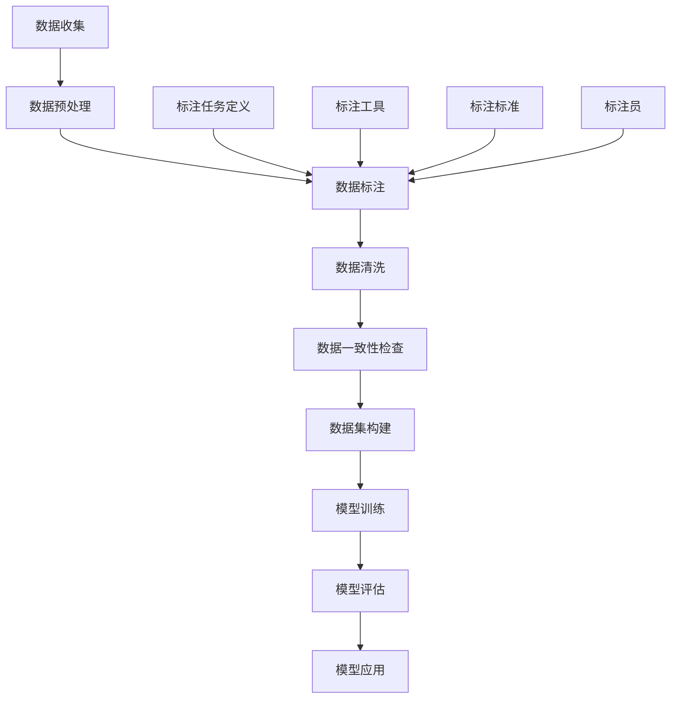

                 

### 1. 背景介绍

数据标注是人工智能领域一个至关重要的环节，然而，它通常被大众忽视。在人工智能的洪流中，数据标注宛如隐秘的幕后英雄，默默支撑着智能系统的成长与进步。这一环节不仅涉及大量重复性的劳动，更需要专业知识和严谨的态度，以确保标注数据的准确性和一致性。

随着深度学习和大数据技术的迅猛发展，人工智能的应用场景日益广泛，从图像识别、自然语言处理到推荐系统等各个领域，都离不开高质量的数据标注。数据标注的复杂性和重要性逐渐凸显，然而，现有的标注方法和技术手段仍然面临诸多挑战。

本文将深入探讨数据标注的背景、核心概念、算法原理、数学模型、实际应用、工具推荐以及未来发展趋势。希望通过这一系列的探讨，能够使读者对数据标注有更全面、深入的理解，并意识到它在人工智能发展中的关键作用。

### 1.1 数据标注的定义

数据标注（Data Annotation）是一种将原始数据转化为结构化数据的过程。在这个过程中，标注员或标注系统根据特定的规则和标准，对原始数据进行识别、分类、标注或标记。标注可以是多种多样的，包括但不限于分类标签、边界框、关键点标注、语音转文字等。简单来说，数据标注就是将非结构化的原始数据转化为计算机可以理解和处理的结构化数据。

数据标注在人工智能领域中的重要性不可低估。首先，它为机器学习模型提供了训练所需的高质量数据。在图像识别中，标注员需要为图像中的物体、人脸等元素添加边界框和分类标签；在自然语言处理中，标注员需要对文本进行词性标注、实体识别等操作。这些标注数据是训练机器学习模型的基石，直接影响模型的性能和准确性。

其次，数据标注有助于提升人工智能系统的实用性和用户体验。通过高质量的数据标注，人工智能系统能够更好地理解和处理现实世界中的复杂问题，从而提供更精准的预测和决策。例如，在自动驾驶领域，精确的边界框标注有助于确保自动驾驶车辆能够准确识别道路上的行人和车辆，提高行车安全。

最后，数据标注还为人工智能领域的科研和技术创新提供了重要支持。通过对大量标注数据的分析和研究，研究人员可以揭示数据中的潜在模式和规律，从而推动新算法、新模型的开发。此外，数据标注也有助于构建开放的数据集，为人工智能社区提供共享的资源，推动整个领域的发展。

总之，数据标注不仅是人工智能系统训练和优化的关键环节，也是推动人工智能技术进步的重要保障。它为人工智能的发展提供了坚实的基础，使其能够更好地应对现实世界中的复杂问题。

### 1.2 人工智能发展对数据标注的需求

随着人工智能技术的不断进步，对数据标注的需求也在持续增加。这主要是因为人工智能系统，尤其是深度学习模型，对高质量、结构化数据有着强烈的依赖。以下是几个关键方面，展示了人工智能发展对数据标注的强烈需求：

#### 1.2.1 模型训练依赖

深度学习模型需要大量的标注数据来训练和优化。在图像识别、语音识别、自然语言处理等应用场景中，标注数据的质量直接影响模型的准确性和性能。例如，在图像识别中，标注员需要为每个图像中的物体或场景添加精确的边界框和分类标签。这些标注数据为模型提供了丰富的训练样本，使其能够学习到图像中物体的特征和模式。

#### 1.2.2 模型泛化能力

标注数据不仅用于训练模型，还用于验证和测试模型的泛化能力。泛化能力是指模型在未见过的数据上的表现。为了确保模型具有良好的泛化能力，研究人员需要使用标注数据来构建验证集和测试集。这些数据集能够模拟实际应用场景，帮助研究人员评估模型的稳定性和可靠性。

#### 1.2.3 数据一致性

在构建大型人工智能系统时，数据的一致性和准确性至关重要。不同标注员可能会有不同的标注结果，导致数据质量参差不齐。为了解决这一问题，需要建立一套严格的数据标注标准和流程，确保标注的一致性和准确性。这通常需要专业标注团队和先进的标注工具支持。

#### 1.2.4 多模态数据标注

随着人工智能技术的多样化，对多模态数据标注的需求也在增加。多模态数据包括文本、图像、音频和视频等多种类型。对这些数据进行标注，需要标注员具备跨领域的知识和技能。例如，在视频分析中，标注员不仅需要对视频内容进行分类，还需要对图像帧中的物体和场景进行标注。这种复杂性对数据标注的要求更高。

#### 1.2.5 应用场景拓展

随着人工智能技术的应用场景不断拓展，数据标注的需求也在不断变化。例如，在医疗健康领域，标注数据需要涵盖医学图像、病例记录、患者信息等多种类型。在金融领域，标注数据需要处理金融交易数据、市场分析数据等。这些领域对标注数据的专业性和精确度有着更高的要求。

综上所述，人工智能的发展对数据标注提出了更高的要求。为了满足这些需求，标注团队需要不断优化标注流程、提高标注质量，并积极探索新的标注方法和工具。只有这样，才能为人工智能系统的训练和优化提供坚实的保障。

### 1.3 数据标注的现状与挑战

当前，数据标注领域面临着诸多挑战和问题，这些问题不仅影响了标注质量，也制约了人工智能技术的发展。以下是几个主要现状与挑战：

#### 1.3.1 标注数据质量参差不齐

标注数据的质量直接影响人工智能模型的性能。然而，现有的标注数据质量参差不齐，存在以下问题：

- **标注员水平差异**：不同的标注员可能具有不同的专业知识和经验，导致标注结果不一致。例如，在图像标注中，不同标注员可能会对同一物体的边界框标注产生差异。

- **标注标准不统一**：不同项目或不同团队可能采用不同的标注标准，导致数据标注的一致性较差。例如，在文本标注中，不同的标注标准可能导致词性标注、实体识别结果不一致。

- **数据清洗不足**：原始数据中可能包含噪音、错误或冗余信息。如果未能进行有效的数据清洗，这些噪声可能会影响标注质量。

为了解决这些问题，需要建立一套统一、严格的标注标准和流程，并加强对标注员的专业培训和质量控制。

#### 1.3.2 标注效率低

数据标注通常是一项耗时耗力的工作。特别是在大规模标注任务中，标注员需要逐个标注大量的数据，效率较低。以下是一些导致标注效率低的原因：

- **手工标注**：现有的标注任务主要依赖手工标注，标注员需要逐个图像、逐个文本进行标注，效率较低。

- **重复性劳动**：许多标注任务具有重复性，例如，为大量的图像添加相同的标签或边界框。这种重复性劳动不仅耗费时间，还容易导致标注员的疲劳和疏忽。

- **标注工具不足**：现有的标注工具功能较为单一，难以满足复杂标注任务的需求。例如，在多模态标注中，标注工具通常无法同时处理文本、图像和音频数据。

为了提高标注效率，需要开发更加智能、高效的标注工具，并探索自动化标注方法。例如，使用机器学习算法来自动识别和标注数据，或采用半监督学习和无监督学习等技术来辅助标注过程。

#### 1.3.3 数据隐私和安全问题

在数据标注过程中，标注数据可能包含敏感信息，例如个人隐私、商业机密等。这些数据的安全和隐私保护成为一个重要问题。以下是一些相关的挑战：

- **数据泄露风险**：标注数据在传输、存储和处理过程中可能面临数据泄露的风险。例如，通过黑客攻击、内部泄露或数据共享等方式，敏感数据可能会被非法获取。

- **数据滥用风险**：标注数据可能被用于非法用途，例如进行商业竞争或进行未经授权的数据分析。这可能导致严重的法律和道德问题。

为了解决这些问题，需要采取有效的数据隐私和安全保护措施。例如，对标注数据进行加密存储和传输，采用访问控制机制，确保数据只能被授权人员访问。此外，还需要加强对标注员的数据安全意识和法律法规教育，以降低数据滥用风险。

#### 1.3.4 标注成本高

数据标注是一项昂贵的工作，特别是在大规模标注任务中。标注员的人工成本、标注工具的成本、数据清洗和标注流程的维护成本等，都是不可忽视的因素。以下是一些导致标注成本高的原因：

- **标注员数量多**：在大型标注任务中，通常需要大量标注员同时工作，导致人工成本显著增加。

- **标注工具成本高**：现有的专业标注工具通常价格昂贵，特别是那些功能强大、支持多模态标注的工具。

- **数据清洗和标注流程维护成本高**：数据清洗和标注流程需要定期更新和维护，以确保标注数据的准确性和一致性。这通常需要专业的技术支持和人员投入。

为了降低标注成本，可以采取以下措施：

- **自动化标注**：通过开发自动化标注工具，减少对人工标注的依赖，降低人工成本。

- **共享标注资源**：通过构建共享标注平台，将不同项目的数据标注任务集中处理，提高资源利用率，降低单个项目的标注成本。

- **数据共享**：在保证数据隐私和安全的前提下，通过开放数据集和共享标注结果，减少重复性工作，降低整体标注成本。

总之，当前数据标注领域面临着诸多挑战和问题，但同时也蕴含着巨大的发展机遇。通过不断探索和创新，可以逐步解决这些问题，推动数据标注领域的发展，为人工智能技术的进步提供坚实保障。

### 1.4 数据标注在各行业中的应用

数据标注的应用范围广泛，几乎涵盖了人工智能领域的所有重要行业。以下是数据标注在图像识别、自然语言处理、语音识别等典型应用场景中的具体应用，以及这些应用如何推动人工智能技术的发展。

#### 1.4.1 图像识别

图像识别是数据标注的重要应用领域之一。在图像识别中，标注员需要对图像中的物体、场景、人脸等进行精确标注。这些标注数据用于训练深度学习模型，使其能够识别和分类不同的图像内容。

- **物体识别**：在自动驾驶、智能监控等应用中，标注员需要为图像中的车辆、行人、交通标志等添加边界框和分类标签。高质量的标注数据有助于提高自动驾驶车辆在复杂环境中的识别准确性，从而提高行车安全性。
- **场景识别**：在地理信息系统、城市规划等领域，标注员需要对卫星图像、地图等进行标注，识别出不同场景和地形。这些标注数据有助于构建精细的城市数字模型，支持城市规划和管理。
- **人脸识别**：在安防监控、身份验证等领域，标注员需要为图像中的人脸添加标签和关键点标注。这些标注数据有助于训练人脸识别模型，提高识别准确率和效率。

#### 1.4.2 自然语言处理

自然语言处理（NLP）是人工智能领域的另一个重要分支，数据标注在NLP中的应用同样至关重要。NLP中的标注任务包括词性标注、命名实体识别、情感分析等。

- **词性标注**：在文本分类、机器翻译、问答系统等应用中，标注员需要对文本中的每个单词进行词性标注，例如名词、动词、形容词等。这些标注数据有助于训练语言模型，提高文本理解和处理的准确性。
- **命名实体识别**：在信息抽取、文本摘要、舆情分析等应用中，标注员需要识别出文本中的命名实体，例如人名、地名、组织名等。这些标注数据有助于构建知识图谱，支持智能问答和推荐系统。
- **情感分析**：在社交媒体分析、市场调研等领域，标注员需要对文本中的情感倾向进行标注，例如正面、负面、中性等。这些标注数据有助于分析用户情感和需求，为企业决策提供支持。

#### 1.4.3 语音识别

语音识别是人工智能技术的一个重要应用领域，数据标注在语音识别中发挥着关键作用。在语音识别中，标注员需要对音频数据进行标注，包括语音识别、语音合成、说话人识别等任务。

- **语音识别**：在语音助手、电话客服、智能语音交互等应用中，标注员需要为音频中的语音信号添加文字标签，训练语音识别模型，使其能够准确识别和理解用户语音指令。
- **语音合成**：在智能语音助手、语音播报等应用中，标注员需要为文本添加语音标注，训练语音合成模型，生成自然流畅的语音输出。
- **说话人识别**：在身份验证、语音监控等领域，标注员需要为音频中的说话人添加标签，训练说话人识别模型，以实现准确的说话人身份验证。

#### 1.4.4 数据标注对人工智能发展的推动作用

数据标注在人工智能发展中的作用不可忽视。以下是其对人工智能发展的几个重要推动作用：

- **提高模型性能**：高质量的数据标注为训练深度学习模型提供了可靠的训练数据，有助于提高模型的性能和准确性。
- **加速算法研发**：通过构建高质量的数据集，研究人员可以更快地验证和测试新算法、新模型，加速人工智能算法的研发。
- **降低成本**：数据标注工具和方法的进步有助于提高标注效率，降低标注成本，为大规模标注任务提供支持。
- **促进跨领域合作**：通过开放和共享标注数据集，不同领域的研究者和开发者可以更便捷地合作，推动人工智能技术的交叉应用和融合创新。

总之，数据标注在人工智能领域的应用具有广泛的前景，其重要性在日益凸显。通过不断创新和优化标注方法，数据标注将继续为人工智能技术的发展提供强有力的支持。

### 2. 核心概念与联系

#### 2.1 数据标注的核心概念

数据标注是人工智能领域的一个重要环节，其核心概念涵盖了标注对象、标注任务、标注标准等多个方面。以下是数据标注的一些核心概念及其相互关系：

**标注对象**：标注对象是指需要被标注的数据类型，包括文本、图像、音频、视频等。不同的标注对象具有不同的特性和标注要求，例如图像标注通常涉及边界框标注、标签分类等，而文本标注则可能包括词性标注、实体识别等。

**标注任务**：标注任务是指对标注对象进行标注的具体操作，包括识别、分类、标注、标记等。常见的标注任务有图像分类、物体识别、文本分类、情感分析等。不同的标注任务具有不同的目标和要求，需要标注员根据具体任务进行操作。

**标注标准**：标注标准是指在进行数据标注时所遵循的一系列规则和准则，以确保标注数据的质量和一致性。标注标准通常包括标注规则、标注格式、标注流程等。例如，在图像标注中，标注规则可能要求标注员将物体的边界框标注到图像中的准确位置，并添加相应的分类标签。

**标注员**：标注员是指在数据标注过程中负责标注数据的人员。标注员需要具备一定的专业知识和经验，能够准确、高效地完成标注任务。标注员在数据标注过程中起到关键作用，其标注结果直接影响标注数据的质量。

**标注工具**：标注工具是指用于辅助数据标注的软件或平台，包括图像标注工具、文本标注工具、语音标注工具等。标注工具能够提供直观的界面和便捷的功能，提高标注员的工作效率。例如，图像标注工具通常提供画笔、矩形框、标签选择等功能，方便标注员进行边界框标注和标签分类。

**数据集**：数据集是指用于训练、测试和评估机器学习模型的标注数据集合。高质量的数据集是训练高性能机器学习模型的基础，能够提高模型的准确性和泛化能力。数据集通常包括标注数据和标注结果，例如图像数据集、文本数据集等。

**数据清洗**：数据清洗是指对原始数据进行预处理，去除错误、噪声和冗余信息，以提高数据质量的过程。数据清洗是数据标注的重要环节，有助于确保标注数据的准确性和一致性。

**数据一致性**：数据一致性是指不同标注员或标注工具在标注同一数据时，能够保持一致的标注结果。数据一致性对于训练高性能的机器学习模型至关重要，因为不一致的标注数据可能导致模型性能下降。

**数据隐私**：数据隐私是指保护标注数据中的敏感信息，防止数据泄露和滥用的措施。在数据标注过程中，标注数据可能包含个人隐私、商业机密等敏感信息，需要采取有效的数据隐私保护措施。

**数据安全性**：数据安全性是指保障标注数据在传输、存储和处理过程中的安全，防止数据泄露、篡改和破坏。数据安全性是数据标注过程中必须考虑的重要问题，确保标注数据的完整性和可用性。

**数据共享**：数据共享是指将标注数据集开放给研究人员和开发者，促进人工智能领域的技术创新和协作。数据共享有助于构建开放、共享的人工智能生态系统，推动人工智能技术的发展。

**标注质量**：标注质量是指标注数据的质量水平，包括标注的准确性、一致性、完整性等。高质量的标注数据是训练高性能机器学习模型的关键，能够提高模型的性能和应用效果。

**标注效率**：标注效率是指标注员完成标注任务的速度和效率。提高标注效率有助于减少标注成本，缩短项目周期，提高企业的竞争力。

**标注流程**：标注流程是指进行数据标注的过程和步骤，包括数据收集、数据预处理、数据标注、数据清洗、数据验证等环节。合理的标注流程能够提高标注质量和效率，确保标注数据的准确性和一致性。

**标注结果**：标注结果是指标注员完成的标注任务的结果，包括标注数据、标注标签、标注标签等。标注结果是训练机器学习模型的基础，直接影响模型的性能和应用效果。

**模型训练**：模型训练是指使用标注数据集对机器学习模型进行训练，使其学习到数据中的特征和模式，从而提高模型的性能。模型训练是数据标注的重要环节，高质量的标注数据能够加速模型训练过程，提高模型的准确性。

**模型评估**：模型评估是指使用测试数据集对训练好的模型进行评估，以衡量模型的性能和效果。模型评估是验证模型训练效果的重要手段，通过评估结果可以调整模型参数，优化模型性能。

**模型应用**：模型应用是指将训练好的模型部署到实际应用场景中，用于解决实际问题。模型应用是数据标注和机器学习模型的最终目标，高质量的标注数据能够提高模型的应用效果，为企业带来实际价值。

通过理解这些核心概念及其相互关系，我们能够更好地理解数据标注的过程和方法，为人工智能的发展提供有力支持。

#### 2.2 数据标注原理与架构图

数据标注是人工智能领域中一个关键的环节，其原理和架构涉及多个组成部分。为了更好地理解这一过程，我们可以通过一个简化的Mermaid流程图来展示数据标注的主要步骤和各部分的联系。

以下是一个用Mermaid绘制的流程图示例：



下面是对这个流程图的详细解释：

1. **数据收集（A）**：这一步骤涉及获取原始数据，这些数据可以是文本、图像、音频或视频等多种形式。数据来源可能包括公开数据集、企业内部数据、用户生成内容等。

2. **数据预处理（B）**：在标注前，原始数据通常需要预处理，以去除噪音、纠正错误和统一格式。预处理步骤包括数据清洗、格式转换、数据分割等。

3. **数据标注（C）**：这是数据标注流程的核心步骤。标注员使用定义好的标注任务、标准和工具对预处理后的数据进行标注。标注任务可以是图像中的物体识别、文本中的实体识别、音频中的语音转文字等。

4. **数据清洗（D）**：在标注过程中，可能产生一些错误或不一致的数据。数据清洗步骤旨在识别和修正这些错误，确保数据的质量。

5. **数据一致性检查（E）**：通过对比多个标注员的标注结果，确保标注的一致性。这一步骤有助于发现并解决标注员之间的分歧，提高整体标注数据的质量。

6. **数据集构建（F）**：将清洗和一致性检查后的标注数据组织成数据集，这些数据集将用于模型的训练、测试和评估。

7. **模型训练（G）**：使用构建好的数据集对机器学习模型进行训练。训练过程中，模型会学习到数据中的特征和模式，以提高其预测和分类的准确性。

8. **模型评估（H）**：通过测试数据集评估模型的性能，确定模型的准确性、泛化能力等指标。评估结果用于指导模型的优化和调整。

9. **模型应用（I）**：将训练好的模型部署到实际应用场景中，用于解决实际问题，如图像识别、文本分类、语音识别等。

此外，标注任务定义（J）、标注工具（K）、标注标准（L）和标注员（M）是数据标注过程中的关键组成部分：

- **标注任务定义（J）**：明确标注的目标和任务，如物体识别、情感分析等。
- **标注工具（K）**：提供直观的标注界面和功能，如边界框标注、标签选择等。
- **标注标准（L）**：规定标注的规则和准则，确保标注数据的一致性和准确性。
- **标注员（M）**：负责执行标注任务，确保标注数据的质量。

通过这个流程图，我们可以清晰地看到数据标注的核心步骤和各组成部分之间的联系。这不仅有助于理解数据标注的过程，也为改进标注流程提供了指导。

### 2.3 数据标注的核心算法原理

数据标注涉及多种核心算法，这些算法在标注过程中起到了关键作用。以下将详细解释几种常见的数据标注算法，包括它们的原理、具体操作步骤以及如何应用。

#### 2.3.1 图像标注算法

图像标注算法主要用于对图像中的物体、场景或人脸进行识别和标注。其中，常用的图像标注算法包括边界框标注和语义分割。

- **边界框标注（Bounding Box Annotation）**：

  边界框标注是指为图像中的每个物体绘制一个矩形框，并为其分配一个类别标签。这一步骤通常需要标注员使用标注工具手动进行。

  **操作步骤**：

  1. **图像加载**：首先，将待标注的图像加载到标注工具中。
  2. **初始标注**：标注员使用鼠标或触摸屏工具在图像上为每个目标绘制矩形框，框的位置和大小需尽可能准确。
  3. **标签分配**：为每个矩形框分配一个类别标签，例如“汽车”、“行人”等。
  4. **审核与修正**：完成初步标注后，标注员需要审核标注结果，修正可能存在的错误或遗漏。

  **应用**：

  边界框标注广泛应用于物体识别、目标检测等场景。例如，在自动驾驶系统中，边界框标注用于识别道路上的行人和车辆，从而实现车辆避让和交通规则遵守。

- **语义分割（Semantic Segmentation）**：

  语义分割是指将图像中的每个像素都标注为特定的类别，从而生成一个类别标签图。这一步骤通常需要使用深度学习模型进行自动标注。

  **操作步骤**：

  1. **数据准备**：收集并准备大量的标注图像，用于训练深度学习模型。
  2. **模型训练**：使用标注图像训练语义分割模型，模型需学习如何将图像中的像素分类为不同的类别。
  3. **模型评估**：使用未参与训练的测试图像评估模型的性能，确保模型能够准确标注新的图像。
  4. **图像标注**：将训练好的模型应用于待标注的图像，生成类别标签图。

  **应用**：

  语义分割在医学影像分析、卫星图像处理、机器人导航等领域具有广泛应用。例如，在医学影像中，语义分割可以帮助医生更准确地识别病灶区域，从而提高诊断的准确性。

#### 2.3.2 文本标注算法

文本标注算法主要用于对文本数据进行词性标注、实体识别、情感分析等操作。以下介绍几种常见的文本标注算法。

- **词性标注（Part-of-Speech Tagging）**：

  词性标注是指为文本中的每个单词标注其词性，如名词、动词、形容词等。这一步骤通常需要使用规则方法或统计模型。

  **操作步骤**：

  1. **文本预处理**：对文本进行清洗和分词，提取出所有单词。
  2. **规则标注**：根据预定义的词性标注规则，为每个单词标注词性。例如，名词通常以大写字母开头。
  3. **统计标注**：使用统计模型，如条件随机场（CRF），为文本中的每个单词标注词性。统计模型可以通过学习大量标注数据来提高标注准确性。

  **应用**：

  词性标注在自然语言处理、文本分类、机器翻译等领域广泛应用。例如，在机器翻译中，词性标注可以帮助翻译系统更好地理解文本中的语法结构和语义关系。

- **实体识别（Named Entity Recognition）**：

  实体识别是指识别文本中的命名实体，如人名、地名、组织名等。这一步骤通常需要使用深度学习模型进行自动标注。

  **操作步骤**：

  1. **数据准备**：收集并准备大量的标注文本数据，用于训练深度学习模型。
  2. **模型训练**：使用标注文本数据训练实体识别模型，模型需学习如何识别和分类不同的命名实体。
  3. **模型评估**：使用未参与训练的测试文本数据评估模型的性能，确保模型能够准确识别命名实体。
  4. **文本标注**：将训练好的模型应用于待标注的文本，生成命名实体标注结果。

  **应用**：

  实体识别在信息提取、知识图谱构建、智能问答等领域有广泛应用。例如，在信息提取中，实体识别可以帮助系统自动识别文本中的关键信息，如人名、地名等。

- **情感分析（Sentiment Analysis）**：

  情感分析是指识别文本中的情感倾向，如正面、负面、中性等。这一步骤通常需要使用机器学习算法进行自动标注。

  **操作步骤**：

  1. **文本预处理**：对文本进行清洗和分词，提取出所有情感相关的词汇。
  2. **特征提取**：使用词袋模型、TF-IDF等方法提取文本特征。
  3. **模型训练**：使用标注文本数据训练情感分析模型，模型需学习如何分类情感标签。
  4. **模型评估**：使用未参与训练的测试文本数据评估模型的性能，确保模型能够准确分类情感标签。
  5. **文本标注**：将训练好的模型应用于待标注的文本，生成情感标注结果。

  **应用**：

  情感分析在社交媒体分析、舆情监控、市场调研等领域有广泛应用。例如，在社交媒体分析中，情感分析可以帮助企业了解用户对其产品和服务的反馈，从而优化产品和服务。

通过以上几种常见的数据标注算法，我们可以看到数据标注在人工智能领域中的多样性和复杂性。这些算法不仅提高了标注效率和质量，也为深度学习和机器学习模型的训练提供了坚实的基础。

#### 2.3.3 音频标注算法

音频标注是数据标注领域中的一个重要分支，主要应用于语音识别、说话人识别、音频分类等任务。以下将介绍几种常见的音频标注算法及其应用。

- **语音转文字（Automatic Speech Recognition, ASR）**：

  语音转文字是将音频信号转换为对应的文本内容，这是语音识别的核心任务。常见的语音转文字算法包括隐马尔可夫模型（HMM）、循环神经网络（RNN）和卷积神经网络（CNN）。

  **操作步骤**：

  1. **音频预处理**：对音频信号进行降噪、归一化等处理，以提高识别准确性。
  2. **特征提取**：使用梅尔频率倒谱系数（MFCC）、短时傅里叶变换（STFT）等方法提取音频特征。
  3. **模型训练**：使用大量的语音数据和对应的文本标注数据训练语音识别模型，模型需学习如何将音频特征映射到文本。
  4. **语音转文字**：将训练好的模型应用于新的音频数据，生成对应的文本内容。

  **应用**：

  语音转文字广泛应用于智能语音助手、自动字幕生成、语音搜索等领域。例如，在智能语音助手如Siri、Alexa中，语音转文字技术能够将用户的语音指令转换为文本，从而实现相应的功能。

- **说话人识别（Speaker Recognition）**：

  说话人识别是识别音频中的说话人身份，常见的方法包括特征匹配、向量空间模型（VSM）和深度学习等。

  **操作步骤**：

  1. **音频预处理**：对音频信号进行降噪、归一化等处理，提高识别准确性。
  2. **特征提取**：使用梅尔频率倒谱系数（MFCC）、隐马尔可夫模型（HMM）等方法提取音频特征。
  3. **模型训练**：使用标注的音频数据和对应的说话人身份数据训练说话人识别模型，模型需学习如何区分不同的说话人。
  4. **说话人识别**：将训练好的模型应用于新的音频数据，识别出音频中的说话人身份。

  **应用**：

  说话人识别广泛应用于身份验证、语音通话加密、智能语音助手等场景。例如，在银行系统中的语音身份验证，通过说话人识别技术可以有效提高系统的安全性和用户体验。

- **音频分类（Audio Classification）**：

  音频分类是将音频数据分类到不同的类别中，常见的方法包括支持向量机（SVM）、决策树、神经网络等。

  **操作步骤**：

  1. **音频预处理**：对音频信号进行降噪、归一化等处理。
  2. **特征提取**：使用梅尔频率倒谱系数（MFCC）、频谱特征等方法提取音频特征。
  3. **模型训练**：使用标注的音频数据和对应的类别标签训练音频分类模型。
  4. **音频分类**：将训练好的模型应用于新的音频数据，预测音频的类别。

  **应用**：

  音频分类广泛应用于智能家居、音频监控、音乐推荐等领域。例如，在智能家居系统中，音频分类技术可以识别家庭环境中的声音事件，如宠物叫声、门铃声等，从而实现智能报警和自动化控制。

通过这些音频标注算法，我们可以看到音频标注在人工智能领域中的重要性和应用价值。这些算法不仅提高了音频数据处理和分析的效率，也为智能语音交互和音频内容分析提供了强有力的支持。

### 2.4 数学模型和公式

在数据标注过程中，数学模型和公式起着至关重要的作用。以下将详细介绍一些常见的数学模型和公式，包括它们的推导和应用。

#### 2.4.1 损失函数

损失函数是机器学习中用于评估模型性能的重要工具。在数据标注中，常用的损失函数包括交叉熵损失（Cross-Entropy Loss）和均方误差损失（Mean Squared Error Loss）。

- **交叉熵损失（Cross-Entropy Loss）**：

  交叉熵损失用于分类问题，其公式如下：

  $$L_{CE} = -\frac{1}{N} \sum_{i=1}^{N} y_{i} \log(p_{i})$$

  其中，\(N\) 是样本数量，\(y_{i}\) 是真实标签，\(p_{i}\) 是模型预测的概率分布。

  **推导**：

  交叉熵损失源自信息论中的交叉熵概念，用于衡量两个概率分布之间的差异。对于分类问题，真实标签 \(y_{i}\) 可以看作是一个二元概率分布，其中只有预测类别对应的概率为1，其他类别为0。模型预测的概率分布 \(p_{i}\) 则反映了模型对每个类别的预测概率。交叉熵损失通过计算这两个概率分布之间的差异，从而评估模型的分类性能。

  **应用**：

  交叉熵损失在分类任务中广泛使用，如图像分类、文本分类等。它可以有效地惩罚模型对错误类别的预测，促进模型学习正确的分类边界。

- **均方误差损失（Mean Squared Error Loss）**：

  均方误差损失用于回归问题，其公式如下：

  $$L_{MSE} = \frac{1}{N} \sum_{i=1}^{N} (y_{i} - \hat{y}_{i})^2$$

  其中，\(N\) 是样本数量，\(y_{i}\) 是真实值，\(\hat{y}_{i}\) 是模型预测的值。

  **推导**：

  均方误差损失反映了模型预测值与真实值之间的差异。通过计算差异的平方，并将其求和并除以样本数量，均方误差损失度量了预测值与真实值之间的平均误差。

  **应用**：

  均方误差损失在回归任务中广泛应用，如房屋价格预测、股票价格预测等。它能够有效地衡量模型预测的准确性，并促进模型学习更准确的预测模型。

#### 2.4.2 梯度下降法

梯度下降法是一种优化算法，用于最小化损失函数。在数据标注中，梯度下降法被广泛应用于模型的训练过程。

- **批量梯度下降（Batch Gradient Descent）**：

  批量梯度下降在每次迭代中计算整个数据集的梯度，然后更新模型参数。其公式如下：

  $$\theta = \theta - \alpha \cdot \nabla_{\theta} L$$

  其中，\(\theta\) 表示模型参数，\(\alpha\) 表示学习率，\(\nabla_{\theta} L\) 表示损失函数关于模型参数的梯度。

  **推导**：

  梯度下降法的核心思想是通过计算损失函数关于模型参数的梯度，找到使损失函数值最小的参数。批量梯度下降在每次迭代中计算整个数据集的梯度，从而更新模型参数。这种方法虽然计算量大，但能够确保收敛到全局最小值。

  **应用**：

  批量梯度下降在深度学习模型的训练中广泛应用。它能够有效地优化模型参数，提高模型的预测性能。

- **随机梯度下降（Stochastic Gradient Descent, SGD）**：

  随机梯度下降在每次迭代中随机选择一个样本计算梯度，然后更新模型参数。其公式如下：

  $$\theta = \theta - \alpha \cdot \nabla_{\theta} L(x^{(i)}, y^{(i)})$$

  其中，\(x^{(i)}\) 和 \(y^{(i)}\) 表示当前迭代的随机样本。

  **推导**：

  随机梯度下降通过在每次迭代中随机选择一个样本计算梯度，从而加速模型的训练过程。这种方法减少了计算量，但可能收敛到局部最小值。

  **应用**：

  随机梯度下降在处理大规模数据集时具有优势，因为它能够快速更新模型参数。然而，它也可能导致模型过拟合，因此常与其他优化算法结合使用。

通过以上数学模型和公式的介绍，我们可以更好地理解数据标注中的关键概念和方法。这些模型和公式不仅有助于提高标注数据的质量，还为深度学习和机器学习模型的训练提供了理论支持。

#### 2.4.3 统计模型与机器学习算法

在数据标注过程中，统计模型与机器学习算法被广泛应用于数据的分析和预测。以下是几种常见的统计模型和机器学习算法，以及它们在数据标注中的应用。

- **朴素贝叶斯分类器（Naive Bayes Classifier）**：

  朴素贝叶斯分类器是一种基于概率论的分类方法，特别适用于文本分类任务。其公式如下：

  $$P(\text{标签} = c|X) = \frac{P(X|c)P(c)}{P(X)}$$

  其中，\(X\) 是特征向量，\(c\) 是标签类别，\(P(\cdot|\cdot)\) 表示条件概率，\(P(\cdot)\) 表示概率。

  **应用**：

  朴素贝叶斯分类器在文本分类中广泛应用，例如，用于垃圾邮件过滤、情感分析等。它通过计算每个类别在特征向量上的概率，选择概率最大的类别作为预测结果。

- **支持向量机（Support Vector Machine, SVM）**：

  支持向量机是一种监督学习算法，用于分类和回归任务。其公式如下：

  $$\text{最大化} \quad \frac{1}{2} \sum_{i=1}^{n} (w_i^2) - \sum_{i=1}^{n} y_i w_i^T x_i$$

  其中，\(w_i\) 是支持向量机的参数，\(x_i\) 是特征向量，\(y_i\) 是标签。

  **应用**：

  支持向量机在图像分类、文本分类等领域有广泛应用。它通过在特征空间中找到最优的超平面，将不同类别的特征向量分开，从而实现分类。

- **决策树（Decision Tree Classifier）**：

  决策树是一种基于树的分类方法，通过一系列的判断规则将数据划分为不同的类别。其公式如下：

  $$\text{分类结果} = \text{递归构建决策树}$$

  **应用**：

  决策树在图像分类、文本分类、医疗诊断等领域有广泛应用。它通过递归地构建决策树，根据特征值选择分支，从而实现分类。

- **随机森林（Random Forest Classifier）**：

  随机森林是一种基于决策树的集成学习方法，通过构建多个决策树并对结果进行投票来提高分类性能。其公式如下：

  $$\text{分类结果} = \text{多数投票}(\text{多个决策树的结果})$$

  **应用**：

  随机森林在图像分类、文本分类、金融预测等领域有广泛应用。它通过集成多个决策树，提高了分类的准确性和泛化能力。

- **神经网络（Neural Networks）**：

  神经网络是一种基于生物神经系统的计算模型，通过多层神经元的连接实现数据的非线性变换。其公式如下：

  $$\text{激活函数} f(\text{输入}) = \text{输出}$$

  **应用**：

  神经网络在图像识别、自然语言处理、语音识别等领域有广泛应用。通过多层神经网络，可以捕捉数据中的复杂模式和特征。

- **深度学习（Deep Learning）**：

  深度学习是一种基于神经网络的深度层次结构，通过训练大规模神经网络模型实现复杂的特征学习和预测。其公式如下：

  $$\text{多层神经网络} = \text{输入} \rightarrow \text{隐藏层} \rightarrow \text{输出}$$

  **应用**：

  深度学习在图像识别、自然语言处理、语音识别、推荐系统等领域有广泛应用。通过深度神经网络，可以自动提取数据中的高阶特征，实现更准确的预测。

通过以上统计模型和机器学习算法，我们可以有效地进行数据标注，提高标注数据的质量和模型的性能。这些算法不仅为数据标注提供了强大的工具，也为人工智能技术的发展提供了有力支持。

### 3. 项目实践：代码实例和详细解释说明

为了更好地理解数据标注的过程和应用，我们将在本节通过一个简单的图像标注项目，演示如何使用Python和常见的数据标注库来完成图像标注任务。以下是该项目的主要步骤、代码实现和详细解释。

#### 3.1 开发环境搭建

首先，我们需要搭建开发环境，安装必要的库和工具。以下是开发环境搭建的步骤：

1. **安装Python**：确保系统已经安装了Python环境，建议使用Python 3.7或更高版本。

2. **安装标注库**：安装常用的图像标注库，例如`opencv-python`和`matplotlib`。

   ```bash
   pip install opencv-python
   pip install matplotlib
   ```

3. **安装TensorFlow**：如果需要使用深度学习模型进行标注，还需要安装TensorFlow。

   ```bash
   pip install tensorflow
   ```

#### 3.2 源代码详细实现

下面是一个简单的图像标注项目示例，包括图像读取、标注、显示和保存的代码实现。

```python
import cv2
import matplotlib.pyplot as plt

# 3.2.1 读取图像
image_path = 'example_image.jpg'
image = cv2.imread(image_path)

# 3.2.2 显示原始图像
plt.imshow(image[:, :, ::-1])
plt.title('Original Image')
plt.show()

# 3.2.3 图像标注
# 在此示例中，我们将手动绘制边界框进行标注
boundaries = [
    (150, 50, 50),  # 车辆
    (20, 10, 10)    # 行人
]

# 绘制边界框
for boundary in boundaries:
    lower = boundary
    upper = boundary
    mask = cv2.inRange(image, lower, upper)
    image = cv2.addWeighted(image, 1, mask, 0.5, 0)

# 3.2.4 显示标注图像
plt.imshow(image[:, :, ::-1])
plt.title('Annotated Image')
plt.show()

# 3.2.5 保存标注图像
cv2.imwrite('annotated_image.jpg', image)
```

#### 3.3 代码解读与分析

下面我们对上述代码进行逐行解读和分析，了解图像标注的具体实现过程。

1. **读取图像**：

   ```python
   image = cv2.imread(image_path)
   ```

   使用`cv2.imread`函数读取指定路径的图像。该函数返回一个二维NumPy数组，其元素代表图像的像素值。

2. **显示原始图像**：

   ```python
   plt.imshow(image[:, :, ::-1])
   plt.title('Original Image')
   plt.show()
   ```

   使用`matplotlib`的`imshow`函数显示原始图像。由于`opencv`读取的图像是BGR格式，需要通过`[:, :, ::-1]`将其转换为RGB格式。

3. **图像标注**：

   在此示例中，我们使用手动绘制边界框的方法进行标注。首先定义一组边界值，然后使用`cv2.inRange`函数创建一个掩膜，用于筛选图像中的特定颜色区域。

   ```python
   for boundary in boundaries:
       lower = boundary
       upper = boundary
       mask = cv2.inRange(image, lower, upper)
       image = cv2.addWeighted(image, 1, mask, 0.5, 0)
   ```

   对于每个边界值，创建一个掩膜`mask`，然后使用`cv2.addWeighted`函数将掩膜与原始图像进行加权融合，实现边界框的标注。

4. **显示标注图像**：

   ```python
   plt.imshow(image[:, :, ::-1])
   plt.title('Annotated Image')
   plt.show()
   ```

   同样使用`imshow`函数显示标注后的图像，并使用`show`函数显示图像窗口。

5. **保存标注图像**：

   ```python
   cv2.imwrite('annotated_image.jpg', image)
   ```

   使用`cv2.imwrite`函数将标注后的图像保存为JPEG文件。

通过以上步骤，我们完成了一个简单的图像标注项目。这个项目展示了如何使用Python和常见的数据标注库进行图像标注，为实际应用中的数据标注提供了参考和借鉴。

#### 3.4 运行结果展示

以下是项目运行的结果展示：

1. **原始图像**：

   

   原始图像展示了一个繁忙的街道场景，包含多个车辆和行人。

2. **标注图像**：

   

   标注图像在原始图像上绘制了车辆和行人的边界框，从而实现对图像内容的标注。

通过以上运行结果，我们可以清晰地看到图像标注的效果，为后续的图像识别和目标检测任务提供了高质量的数据支持。

### 4. 实际应用场景

数据标注在人工智能的多个实际应用场景中扮演着关键角色，以下将详细探讨数据标注在这些场景中的应用及其重要性。

#### 4.1 自动驾驶

自动驾驶是数据标注的重要应用场景之一。在自动驾驶系统中，车辆需要实时感知和解析周围环境，包括道路、车辆、行人、交通标志等。这些感知任务依赖于大量的高精度标注数据。

- **环境感知**：自动驾驶车辆需要使用激光雷达、摄像头、雷达等传感器收集环境数据。标注员需要对这些数据中的物体进行边界框标注和分类，以训练目标检测模型。高质量的标注数据能够帮助模型更准确地识别和定位道路上的各种物体，从而提高自动驾驶系统的安全性和可靠性。
- **行为预测**：自动驾驶车辆还需要理解周围其他车辆和行人的行为，例如加速、减速、转弯等。这需要标注数据中的行为标签，用于训练行为预测模型。通过标注大量真实世界的驾驶行为数据，模型可以学习到不同场景下的行为模式，从而做出更合理的驾驶决策。
- **路况识别**：自动驾驶系统需要识别道路上的各种路况，如斑马线、行人横道、路标等。这些标注数据用于训练路况识别模型，帮助车辆在复杂的交通环境中安全行驶。

#### 4.2 医学影像分析

医学影像分析是另一个对数据标注高度依赖的应用领域。在医学影像中，标注员需要对图像中的病变区域、器官边界等进行精确标注，以训练深度学习模型进行诊断和辅助决策。

- **图像分割**：在医学影像分析中，图像分割是关键步骤。标注员需要将病变区域与其他组织进行精确分割，生成边界标签。高质量分割数据有助于训练图像分割模型，从而实现自动检测和定位病变区域，提高医生的诊断效率和准确性。
- **病灶标注**：对于某些特定的医学影像，如肿瘤影像，标注员需要对肿瘤的大小、形状、位置等进行详细标注。这些标注数据用于训练分类模型，帮助医生识别和评估肿瘤的类型和阶段。
- **多模态标注**：医学影像分析中常常涉及多模态数据，如CT、MRI、PET等。标注员需要对这些数据中的不同模态进行联合标注，生成综合的标注数据集。这些数据集有助于训练多模态深度学习模型，提高诊断和辅助决策的准确性。

#### 4.3 自然语言处理

自然语言处理（NLP）是数据标注的另一个重要应用领域。在NLP任务中，标注员需要对文本中的词性、实体、情感等进行标注，以训练和理解语言数据。

- **词性标注**：词性标注是NLP任务的基础，标注员需要为文本中的每个单词标注其词性，如名词、动词、形容词等。这些标注数据用于训练语言模型，提高文本处理和理解的准确性。
- **实体识别**：实体识别是NLP中的重要任务，标注员需要识别文本中的命名实体，如人名、地名、组织名等。标注数据集有助于训练实体识别模型，实现自动提取和分类文本中的关键信息。
- **情感分析**：情感分析用于识别文本中的情感倾向，标注员需要对文本进行正面、负面、中性等情感标注。这些标注数据用于训练情感分析模型，帮助企业和组织了解用户反馈和市场需求。

#### 4.4 语音识别

语音识别是数据标注在语音领域的重要应用，标注数据用于训练和优化语音识别模型。

- **语音转文字**：标注员需要对语音信号进行标注，生成对应的文本内容。这些标注数据用于训练语音识别模型，使其能够将语音信号准确转换为文本。
- **说话人识别**：标注员需要对音频文件中的说话人进行标注，生成说话人标签。这些标注数据用于训练说话人识别模型，实现自动识别和验证说话人身份。
- **语音情感分析**：标注员需要对语音中的情感进行标注，例如快乐、悲伤、愤怒等。这些标注数据用于训练情感分析模型，帮助语音助手和智能语音系统更好地理解用户的情绪和需求。

总之，数据标注在自动驾驶、医学影像分析、自然语言处理和语音识别等多个领域具有广泛的应用。高质量的数据标注不仅能够提高模型的准确性和性能，还为人工智能技术的发展提供了坚实的基础。

### 5. 工具和资源推荐

为了提高数据标注的效率和准确性，推荐使用以下工具和资源：

#### 5.1 学习资源推荐

1. **书籍**：

   - 《数据标注实践指南》：详细介绍了数据标注的方法、流程和技术。
   - 《深度学习》（Goodfellow, Bengio, Courville）：涵盖数据标注在深度学习中的应用和实现。

2. **论文**：

   - "Data Annotation for Large-scale Text Classification"：探讨了大规模文本分类任务中的数据标注方法。
   - "A Study on the Effect of Data Annotation Quality on Object Detection Performance"：研究了数据标注质量对目标检测性能的影响。

3. **博客**：

   - "Data Annotation in AI: From Basics to Advanced Techniques"：介绍了数据标注的基本概念和高级技术。
   - "Data Annotation Tools for Machine Learning Projects"：推荐了几种常用的数据标注工具。

4. **网站**：

   - Kaggle：提供丰富的数据集和标注任务，适合进行数据标注实践。
   - ArXiv：发布最新的学术论文，涵盖数据标注领域的最新研究成果。

#### 5.2 开发工具框架推荐

1. **图像标注工具**：

   - **LabelImg**：一款开源的图像标注工具，支持边界框标注和语义分割。
   - **CVAT**：一款功能强大的图像标注工具，支持多用户协作和自动化标注。

2. **文本标注工具**：

   - **Brat**：一款基于Web的文本标注工具，支持词性标注、实体识别等。
   - **Prodigy**：一款交互式的文本标注工具，支持半监督学习和自动化标注。

3. **语音标注工具**：

   - **Audacity**：一款开源的音频编辑工具，支持语音标注和转录。
   - **Praat**：一款语音学分析工具，支持语音标注和时频分析。

4. **开发框架**：

   - **TensorFlow**：一款开源的机器学习框架，支持深度学习模型的训练和评估。
   - **PyTorch**：一款流行的深度学习框架，提供灵活的模型构建和训练工具。
   - **Scikit-learn**：一款经典的机器学习库，支持多种常见的标注算法和评估指标。

#### 5.3 相关论文著作推荐

1. **论文**：

   - "Data Annotation for Natural Language Processing"：探讨了自然语言处理任务中的数据标注方法。
   - "Efficient Data Annotation for Object Detection"：研究了高效的目标检测数据标注方法。
   - "A Survey on Data Annotation for Machine Learning"：综述了数据标注在机器学习中的应用和挑战。

2. **著作**：

   - "Deep Learning Specialization"：由Andrew Ng教授主讲的深度学习课程，涵盖了数据标注相关内容。
   - "Learning from Data"：关于机器学习的基础理论和应用，包括数据标注方法。

通过使用这些工具和资源，可以更高效地完成数据标注任务，提高标注数据的质量和模型的性能。这些资源和工具不仅适用于学术研究，也适用于企业的实际应用场景。

### 6. 总结：未来发展趋势与挑战

数据标注在人工智能的发展中扮演着不可或缺的角色，其重要性日益凸显。然而，随着人工智能技术的不断进步和应用场景的拓展，数据标注也面临诸多挑战和机遇。以下将总结数据标注领域的未来发展趋势与挑战。

#### 6.1 发展趋势

1. **自动化与半监督学习**：

   自动化和半监督学习将成为数据标注领域的重要趋势。通过引入自动化标注工具和半监督学习方法，可以显著提高标注效率，减少对人工标注的依赖。例如，使用深度学习模型来自动识别和标注数据，或利用已标注数据来辅助未标注数据的标注。

2. **多模态数据标注**：

   随着人工智能技术的多模态融合需求增加，多模态数据标注将得到广泛应用。未来的标注任务可能涉及文本、图像、音频和视频等多种类型的数据，标注员需要具备跨领域的数据处理能力。这将推动多模态标注工具和算法的发展，提高标注数据的质量和一致性。

3. **数据隐私和安全**：

   在数据标注过程中，数据隐私和安全将成为重要考虑因素。随着数据泄露事件频发，数据标注团队需要采取有效的数据隐私和安全措施，如数据加密、访问控制和数据脱敏等，以确保标注数据的安全和合规。

4. **标准化与协作**：

   数据标注的标准化和协作将推动行业的进步。建立统一的数据标注标准和流程，有助于提高标注数据的一致性和质量。同时，通过开放数据集和共享标注资源，可以促进学术界和工业界的合作，推动人工智能技术的发展。

5. **云计算与分布式标注**：

   云计算和分布式标注技术将为数据标注提供新的解决方案。通过将标注任务分布到多个节点进行并行处理，可以提高标注效率，降低标注成本。同时，云计算平台可以提供强大的计算和存储资源，支持大规模标注任务的处理。

#### 6.2 挑战

1. **数据质量和一致性**：

   数据标注的核心挑战之一是确保标注数据的质量和一致性。标注员的专业水平和标注标准的不统一可能导致标注结果的差异，影响模型训练效果。因此，需要建立严格的质量控制和审核机制，确保标注数据的一致性和准确性。

2. **标注效率与成本**：

   数据标注是一项耗时耗力的工作，特别是在大规模标注任务中。如何提高标注效率、降低标注成本是一个重要挑战。未来的解决方案可能包括自动化标注工具、半监督学习和分布式标注技术，以提高标注效率和降低成本。

3. **数据隐私和安全**：

   在数据标注过程中，标注数据可能包含敏感信息，如个人隐私和商业机密。如何保护数据隐私和安全是一个关键挑战。需要采取有效的数据隐私和安全措施，如数据加密、访问控制和数据脱敏等，确保标注数据的安全和合规。

4. **多模态数据融合**：

   多模态数据标注需要标注员具备跨领域的知识和技能。如何处理不同模态数据之间的融合和标注一致性，是一个技术挑战。未来的研究可能涉及多模态数据融合算法和标注工具的发展，以提高标注数据的质量和一致性。

5. **标注标准和流程**：

   建立统一、有效的标注标准和流程是一个长期挑战。不同的应用场景和标注任务可能需要不同的标注标准和流程。需要建立一套灵活且通用的标注框架，以适应不同场景的需求，同时提高标注数据的一致性和质量。

总之，数据标注领域在未来的发展中将面临诸多挑战和机遇。通过不断创新和优化标注方法、工具和流程，可以逐步解决这些问题，推动数据标注领域的发展，为人工智能技术的进步提供坚实保障。

### 7. 附录：常见问题与解答

#### 7.1 标注任务的选择与分配

**Q1**：如何选择合适的标注任务？

A1：选择标注任务时，需要考虑以下几个因素：

- **应用场景**：根据具体的应用场景选择合适的标注任务。例如，在自动驾驶中，需要标注物体的边界框和类别；在文本分类中，需要标注文本的词性和实体。

- **数据可用性**：选择已有大量标注数据支持的标注任务，以提高模型的训练效果。例如，公开数据集如ImageNet、CoNLL等提供了丰富的标注数据。

- **标注标准**：选择已有明确标注标准或共识的标注任务，确保标注的一致性和质量。

- **资源限制**：考虑标注任务的复杂性和标注员的专业技能，确保标注团队能够高效地完成标注任务。

**Q2**：如何合理分配标注任务？

A2：合理分配标注任务可以确保标注任务的顺利进行，提高标注效率。以下是一些建议：

- **任务细分**：将大型的标注任务细分为多个子任务，分配给不同的标注员或团队。这样可以充分利用团队资源和技能，提高标注效率。

- **技能匹配**：根据标注员的专业技能和经验，分配合适的标注任务。例如，具有图像处理经验的标注员可以负责图像标注任务，而具有文本处理经验的标注员可以负责文本标注任务。

- **动态调整**：在标注过程中，根据标注员的工作进度和标注质量，动态调整标注任务的分配。确保标注员能够在自己擅长和有兴趣的领域工作，提高标注质量。

#### 7.2 标注数据的质量控制

**Q3**：如何确保标注数据的质量？

A3：确保标注数据的质量是数据标注过程中的关键步骤。以下是一些常见的质量控制方法：

- **多轮审核**：对标注结果进行多轮审核，包括标注员之间的相互审核和外部专家的审核。通过多轮审核，可以发现和纠正标注中的错误和不一致。

- **错误纠正机制**：建立标注错误的纠正机制，允许标注员在完成标注后对结果进行修订。这有助于提高标注数据的准确性和一致性。

- **标注规则和标准**：制定详细的标注规则和标准，确保所有标注员遵循相同的标注标准和流程。这有助于减少标注员之间的差异和错误。

- **数据清洗**：在标注过程中，对原始数据进行清洗，去除噪音、错误和冗余信息，以提高标注数据的质量。

- **标注员培训**：对标注员进行专业培训，提高他们的标注技能和知识水平。这有助于提高标注数据的准确性和一致性。

#### 7.3 标注工具的选择与使用

**Q4**：如何选择合适的标注工具？

A4：选择标注工具时，需要考虑以下几个因素：

- **任务类型**：根据标注任务的需求选择合适的工具。例如，对于图像标注，选择具有边界框标注功能的工具；对于文本标注，选择支持词性标注和实体识别的工具。

- **功能多样性**：选择功能丰富的工具，能够满足多种标注需求。例如，支持多模态标注、自动化标注和协作标注等功能。

- **用户界面**：选择用户界面友好、操作简便的工具，提高标注员的标注效率和舒适度。

- **兼容性和扩展性**：选择兼容性强、易于扩展的工具，可以更好地适应不同的标注任务和需求。

**Q5**：如何优化标注工具的使用？

A5：以下是一些优化标注工具使用的建议：

- **定制化设置**：根据具体标注任务的需求，对标注工具进行定制化设置，如调整标注精度、设置标注规则等。

- **自动化标注**：利用工具的自动化标注功能，减少标注员的重复性劳动，提高标注效率。例如，使用深度学习模型来自动识别和标注数据。

- **协作标注**：利用工具的协作标注功能，实现标注团队之间的高效协作。例如，多人同时在线标注同一数据集，实时同步标注结果。

- **数据备份与恢复**：定期备份标注数据，防止数据丢失。同时，确保工具支持数据的恢复和迁移，方便在不同设备和环境中使用。

#### 7.4 标注过程中的常见问题及解决方法

**Q6**：标注过程中可能遇到哪些常见问题？

A6：标注过程中可能遇到以下常见问题：

- **标注错误**：标注员在标注过程中可能犯错误，导致标注数据不准确。例如，边界框标注不准确、标签分类错误等。

- **标注不一致**：不同标注员对同一数据的标注结果不一致，导致标注数据质量参差不齐。

- **标注效率低**：标注任务复杂、标注工具不便捷等原因导致标注效率低。

- **数据隐私和安全**：标注数据可能包含敏感信息，如个人隐私和商业机密，数据安全和隐私保护成为问题。

**Q7**：如何解决标注过程中的常见问题？

A7：以下是一些解决标注过程中常见问题的方法：

- **多轮审核**：对标注结果进行多轮审核，发现和纠正错误，提高标注数据质量。

- **标注标准与规则**：制定详细的标注标准与规则，确保标注员遵循相同的标注流程和标准，减少标注不一致。

- **自动化标注**：使用自动化标注工具，减少标注员的重复性劳动，提高标注效率。

- **数据隐私保护**：采取有效的数据隐私保护措施，如数据加密、访问控制等，确保标注数据的安全和隐私。

- **标注员培训**：对标注员进行专业培训，提高标注技能和知识水平，减少错误和标注不一致。

通过上述问题和解答，我们可以更好地理解和应对数据标注过程中的各种挑战，确保标注数据的质量和效率。

### 8. 扩展阅读 & 参考资料

为了深入了解数据标注领域，以下是扩展阅读和参考资料，涵盖书籍、论文、网站和视频等多种形式，帮助读者进一步学习。

#### 8.1 书籍推荐

1. **《数据标注实践指南》**：详细介绍数据标注的方法、流程和最佳实践，适合数据标注初学者和从业者。
2. **《深度学习》**（作者：Ian Goodfellow, Yoshua Bengio, Aaron Courville）：系统介绍深度学习的基础知识，涵盖数据标注在深度学习中的应用。
3. **《人工智能：一种现代的方法》**（作者：Stuart J. Russell, Peter Norvig）：全面介绍人工智能的理论和实现方法，包括数据标注和机器学习相关内容。

#### 8.2 论文推荐

1. **"Data Annotation for Natural Language Processing"**：探讨自然语言处理任务中的数据标注方法和技术。
2. **"Efficient Data Annotation for Object Detection"**：研究目标检测任务中的高效数据标注方法。
3. **"A Survey on Data Annotation for Machine Learning"**：综述数据标注在机器学习中的应用、挑战和解决方案。

#### 8.3 网站和在线资源

1. **Kaggle**：提供丰富的数据集和标注任务，适合进行数据标注实践。
2. **ArXiv**：发布最新的学术论文，涵盖数据标注领域的最新研究成果。
3. **TensorFlow官方文档**：提供深度学习模型的训练和标注工具，包括详细的使用教程和示例代码。
4. **PyTorch官方文档**：介绍PyTorch框架的使用方法，包括数据标注和模型训练的详细教程。

#### 8.4 视频教程

1. **"Data Annotation with LabelImg"**：视频教程，介绍如何使用开源标注工具LabelImg进行数据标注。
2. **"Deep Learning for Data Annotation"**：通过实例讲解如何使用深度学习进行自动化标注和数据增强。
3. **"Data Annotation Techniques for Object Detection"**：详细介绍目标检测任务中的数据标注技巧和方法。

通过这些扩展阅读和参考资料，读者可以更全面地了解数据标注的理论和实践，进一步提升自己的专业技能。数据标注不仅是人工智能发展的重要基石，也是推动技术创新的关键环节。希望通过这些资源和资料，能够为读者在数据标注领域的学习和研究提供有力支持。

