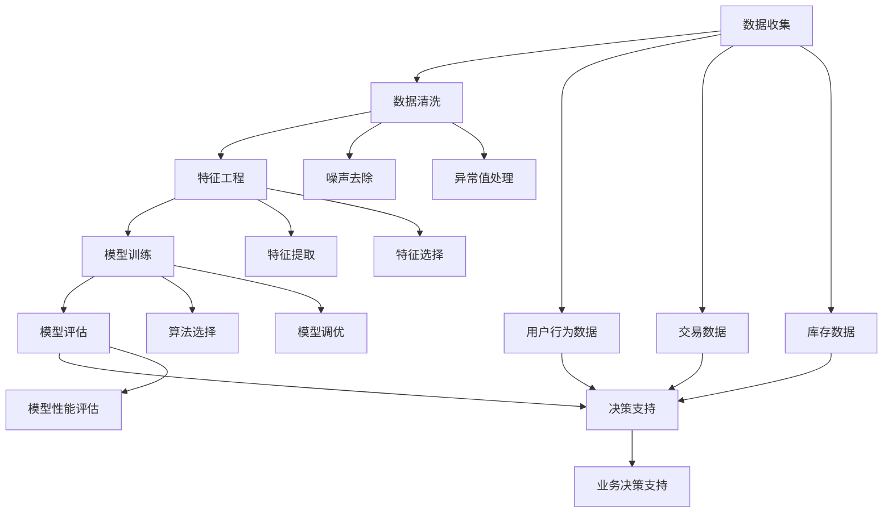

                 

### 背景介绍

#### 电商行业的发展

电商行业在过去几十年中经历了飞速的发展。随着互联网技术的不断进步，消费者逐渐从线下购物转向线上购物，这使得电商市场呈现出蓬勃发展的态势。根据数据显示，全球电商市场规模在2021年已经达到了4.89万亿美元，预计到2025年这一数字将突破6万亿美元。这种快速的增长不仅为电商企业带来了巨大的商业价值，同时也对企业的运营管理提出了更高的要求。

在电商行业的发展过程中，数据的重要性逐渐凸显。无论是用户行为分析、商品推荐，还是库存管理和市场预测，数据都成为了决策的重要依据。数据驱动的决策模式，使得电商企业能够更加精准地满足消费者的需求，提高运营效率，降低成本，从而在激烈的市场竞争中脱颖而出。

#### 数据驱动决策的重要性

数据驱动决策（Data-Driven Decision Making，简称DDDM）是指企业通过收集、处理和分析数据，从而做出更加科学和有效的决策。在电商行业中，数据驱动决策具有重要意义：

1. **提高营销效率**：通过分析用户数据，电商企业可以了解消费者的购买偏好和行为习惯，从而制定更精准的营销策略，提高转化率和销售额。

2. **优化商品推荐**：基于用户的历史购买数据和浏览记录，电商企业可以利用算法推荐系统为用户推荐他们可能感兴趣的商品，提高用户满意度和忠诚度。

3. **库存管理优化**：通过预测未来的市场需求，电商企业可以合理安排库存，避免库存过剩或短缺，降低运营成本。

4. **风险控制**：通过对市场数据的分析，电商企业可以及时发现潜在的市场风险，制定相应的应对策略，减少损失。

#### 当前数据驱动决策的挑战

尽管数据驱动决策在电商行业中具有显著的优势，但在实际应用中仍面临一些挑战：

1. **数据质量**：数据的质量直接影响决策的准确性。如果数据存在偏差或不完整，可能会导致错误的决策。

2. **算法复杂性**：数据驱动决策依赖于各种复杂的算法模型，如机器学习、深度学习等。算法的选择和调优需要专业的技术团队，这对企业的技术能力提出了更高的要求。

3. **实时性**：在电商行业中，市场环境变化迅速，实时数据处理和分析能力成为关键。如何快速获取和处理海量数据，并及时作出响应，是当前数据驱动决策面临的一大挑战。

4. **隐私保护**：在收集和使用用户数据的过程中，如何保护用户隐私，遵守相关法律法规，也是电商企业需要重点关注的问题。

本文将围绕数据驱动决策在电商中的应用，详细探讨其核心概念、算法原理、数学模型、项目实践和实际应用场景，以及未来发展趋势与挑战。希望通过本文的阐述，能够为电商企业在数据驱动决策方面提供一些有价值的参考和启示。

### 核心概念与联系

在深入探讨数据驱动决策在电商中的应用之前，有必要明确几个核心概念，并理解它们之间的联系。以下是对这些核心概念的介绍及其相互关系的详细阐述。

#### 数据驱动决策（Data-Driven Decision Making）

数据驱动决策是一种基于数据的决策模式，通过收集、处理和分析数据，从而做出科学、合理的决策。这种模式的核心在于将数据作为决策的基础，而不是依靠直觉或经验。在电商行业中，数据驱动决策的应用场景包括但不限于营销策略、商品推荐、库存管理、用户行为分析等。

#### 数据分析（Data Analysis）

数据分析是指使用统计学、机器学习、深度学习等方法对数据进行处理和分析，从而提取有价值的信息。在电商行业，数据分析可以帮助企业了解用户行为、市场需求、竞争对手状况等，为决策提供支持。数据分析通常包括数据清洗、数据预处理、特征工程、模型训练和评估等步骤。

#### 机器学习（Machine Learning）

机器学习是数据分析的一个重要分支，通过构建和训练模型，让计算机从数据中自动学习规律和模式。在电商行业中，机器学习被广泛应用于用户行为预测、商品推荐、欺诈检测等。常见的机器学习算法包括线性回归、决策树、随机森林、支持向量机、神经网络等。

#### 深度学习（Deep Learning）

深度学习是机器学习的一个子领域，主要关注神经网络的研究和应用。与传统的机器学习算法相比，深度学习能够自动提取复杂的特征，并在图像识别、语音识别、自然语言处理等领域取得了显著的成绩。在电商行业，深度学习被广泛应用于图像商品识别、个性化推荐、情感分析等。

#### 数据可视化（Data Visualization）

数据可视化是将数据分析的结果以图形或图表的形式展示出来，使决策者能够直观地理解数据。在电商行业，数据可视化可以帮助企业快速识别关键指标、趋势和异常，从而做出更准确的决策。常见的数据可视化工具包括Tableau、Power BI、Matplotlib等。

#### 数据驱动决策流程

数据驱动决策通常包括以下步骤：

1. **数据收集**：收集与业务相关的各种数据，如用户行为数据、交易数据、库存数据等。
2. **数据清洗**：对收集到的数据进行清洗和预处理，去除噪声和异常值，确保数据质量。
3. **特征工程**：从原始数据中提取有意义的特征，为后续的模型训练提供输入。
4. **模型训练**：使用机器学习或深度学习算法训练模型，使模型能够从数据中学习规律和模式。
5. **模型评估**：评估模型的性能，选择最优模型进行部署。
6. **决策支持**：利用训练好的模型为业务决策提供支持。

#### 关系图

为了更直观地理解这些核心概念之间的联系，我们使用Mermaid流程图进行展示。以下是一个简化的数据驱动决策流程及其核心概念的关系图：



在这个关系图中，数据收集是整个流程的起点，随后经过数据清洗、特征工程、模型训练、模型评估等步骤，最终为业务决策提供支持。用户行为数据、交易数据和库存数据是数据收集阶段的重要来源，而噪声去除、异常值处理、特征提取和特征选择等是数据清洗和特征工程的重要环节。

通过理解这些核心概念及其相互关系，我们可以更好地把握数据驱动决策在电商中的应用，为后续的内容铺垫。

### 核心算法原理 & 具体操作步骤

#### 算法选择

在电商行业的数据驱动决策中，常用的算法包括机器学习算法和深度学习算法。具体选择哪种算法，需要根据业务需求和数据特性来决定。

对于用户行为预测和商品推荐，常见的机器学习算法有协同过滤（Collaborative Filtering）、基于内容的推荐（Content-Based Recommendation）和混合推荐（Hybrid Recommendation）。其中，协同过滤算法又分为用户基于的协同过滤（User-Based）和项目基于的协同过滤（Item-Based）。深度学习算法如神经网络（Neural Networks）和卷积神经网络（Convolutional Neural Networks，CNN）也在个性化推荐系统中得到了广泛应用。

对于库存管理和市场预测，常用的算法有线性回归（Linear Regression）、逻辑回归（Logistic Regression）、时间序列分析（Time Series Analysis）等。在处理复杂数据和特征提取时，深度学习算法如长短期记忆网络（Long Short-Term Memory，LSTM）和自编码器（Autoencoder）等具有显著优势。

#### 算法实现

以下是一个基于协同过滤算法的用户行为预测和商品推荐的具体操作步骤：

1. **数据收集与预处理**：

    - 收集用户行为数据，如点击记录、购买记录、浏览记录等。
    - 对数据进行清洗，去除缺失值、异常值等噪声数据。
    - 将用户和商品进行编码，建立用户-商品矩阵。

2. **协同过滤算法实现**：

    - **用户基于的协同过滤**：

        - 计算用户之间的相似度，使用余弦相似度、皮尔逊相关系数等方法。
        - 对于每个用户，找到与其最相似的K个用户，计算目标用户对这些用户的评分的平均值，作为目标用户的预测评分。

        ```python
        # 余弦相似度计算
        def cosine_similarity(user1, user2):
            dot_product = np.dot(user1, user2)
            norm_user1 = np.linalg.norm(user1)
            norm_user2 = np.linalg.norm(user2)
            return dot_product / (norm_user1 * norm_user2)
        
        # 预测评分
        def predict_rating(target_user, similar_users, ratings):
            pred_ratings = []
            for user in similar_users:
                if target_user != user:
                    pred_ratings.append(ratings[user])
            return np.mean(pred_ratings)
        ```

    - **项目基于的协同过滤**：

        - 计算商品之间的相似度，使用Jaccard相似度、余弦相似度等方法。
        - 对于每个用户，找到其购买过的商品与目标商品最相似的M个商品，计算这些商品的评分的平均值，作为目标商品的预测评分。

        ```python
        # Jaccard相似度计算
        def jaccard_similarity(item1, item2):
            intersection = np.sum(item1 * item2)
            union = np.sum(item1) + np.sum(item2) - intersection
            return intersection / union
        
        # 预测评分
        def predict_rating(target_item, similar_items, ratings):
            pred_ratings = []
            for item in similar_items:
                if target_item != item:
                    pred_ratings.append(ratings[item])
            return np.mean(pred_ratings)
        ```

3. **模型评估与优化**：

    - 使用交叉验证（Cross-Validation）方法评估模型性能，选择最优参数。
    - 调整相似度计算方法和预测评分方法，以提高模型准确性。

4. **应用与部署**：

    - 将训练好的模型应用于电商平台的用户行为预测和商品推荐。
    - 实时更新用户和商品数据，调整推荐策略。

#### 数学模型和公式

以下是对协同过滤算法中使用的数学模型和公式的详细讲解：

1. **余弦相似度**：

   余弦相似度用于衡量两个向量之间的相似程度，公式如下：

   $$ \text{cosine\_similarity} = \frac{\sum_{i=1}^{n} a_i \times b_i}{\sqrt{\sum_{i=1}^{n} a_i^2} \times \sqrt{\sum_{i=1}^{n} b_i^2}} $$

   其中，$a_i$ 和 $b_i$ 分别表示两个向量在第 $i$ 个特征上的值。

2. **Jaccard相似度**：

   Jaccard相似度用于衡量两个集合之间的相似程度，公式如下：

   $$ \text{Jaccard\_similarity} = \frac{\text{intersection}}{\text{union}} = \frac{a \cap b}{a \cup b} $$

   其中，$a$ 和 $b$ 分别表示两个集合。

3. **预测评分**：

   预测评分的公式如下：

   $$ \text{predicted\_rating} = \text{avg}(\text{rating}_{i1} + \text{rating}_{i2} + ... + \text{rating}_{ik}) $$

   其中，$\text{rating}_{i1}, \text{rating}_{i2}, ..., \text{rating}_{ik}$ 分别表示与目标用户或商品最相似的 $k$ 个用户或商品的评分。

通过上述算法和数学模型的讲解，我们可以更好地理解协同过滤算法在电商中的应用原理和具体操作步骤。在接下来的部分，我们将通过一个实际项目实例，展示该算法的实现过程和应用效果。

### 数学模型和公式 & 详细讲解 & 举例说明

在数据驱动决策中，数学模型和公式起到了至关重要的作用。它们不仅帮助我们理解和分析数据，还为我们提供了精确的计算工具。本节将详细讲解数据驱动决策中常用的数学模型和公式，并通过具体的例子来说明它们的实际应用。

#### 线性回归模型

线性回归模型是一种基本的统计模型，用于分析两个或多个变量之间的线性关系。其基本公式如下：

$$ Y = \beta_0 + \beta_1X_1 + \beta_2X_2 + ... + \beta_nX_n + \epsilon $$

其中，$Y$ 是因变量，$X_1, X_2, ..., X_n$ 是自变量，$\beta_0, \beta_1, \beta_2, ..., \beta_n$ 是模型参数，$\epsilon$ 是误差项。

**详细讲解**：

- **因变量（Y）**：线性回归模型试图预测或解释的变量。
- **自变量（X）**：影响因变量的变量，也称为特征或输入。
- **模型参数（$\beta$）**：通过模型训练得到的系数，用于表示自变量对因变量的影响程度。
- **误差项（$\epsilon$）**：模型无法解释的随机误差。

**举例说明**：

假设我们想预测一个电商平台的月销售额（$Y$），影响销售额的因素包括广告支出（$X_1$）和天气（$X_2$）。我们可以建立以下线性回归模型：

$$ \text{月销售额} = \beta_0 + \beta_1 \times \text{广告支出} + \beta_2 \times \text{天气} + \epsilon $$

通过收集历史数据，我们可以使用最小二乘法（Least Squares Method）训练模型，得到最优的模型参数。

#### 逻辑回归模型

逻辑回归模型是一种广义的线性回归模型，常用于分类问题。其基本公式如下：

$$ \text{log-odds} = \ln\left(\frac{P(Y=1)}{1-P(Y=1)}\right) = \beta_0 + \beta_1X_1 + \beta_2X_2 + ... + \beta_nX_n $$

其中，$P(Y=1)$ 是因变量为1的概率。

**详细讲解**：

- **log-odds**：对数几率，表示因变量为1的概率与不为1的概率之比的对数。
- **模型参数（$\beta$）**：与线性回归模型类似，用于表示自变量对因变量的影响程度。

**举例说明**：

假设我们想预测一个用户是否会在未来一个月内购买某个商品，影响购买决策的因素包括用户年龄（$X_1$）和用户历史购买记录（$X_2$）。我们可以建立以下逻辑回归模型：

$$ \text{log-odds} = \beta_0 + \beta_1 \times \text{用户年龄} + \beta_2 \times \text{用户历史购买记录} $$

通过收集用户数据，我们可以使用最大似然估计（Maximum Likelihood Estimation）方法训练模型，得到最优的模型参数。

#### 决策树模型

决策树模型是一种基于特征的分类模型，通过一系列的判断条件将数据集划分为不同的类别。其基本结构如下：

```
   |
   |------------------\
   |                  O----\
   |                     /  \
   |                    /    \
  O----> O----> O----> O
```

**详细讲解**：

- **根节点（Root Node）**：模型开始的地方，表示整个数据集。
- **内部节点（Internal Node）**：表示特征的划分条件。
- **叶节点（Leaf Node）**：表示分类结果。

**举例说明**：

假设我们想预测一个电商平台的用户是否属于高价值客户，影响客户价值的因素包括购买频率（$X_1$）和平均订单金额（$X_2$）。我们可以建立以下决策树模型：

```
          |---------\
          |         O
          |        / \
          |       /   \
       O   O----> O   O---->
      /  \        /  \
     O    O      O    O
```

通过递归划分数据集，我们可以构建出完整的决策树模型。

#### 支持向量机（SVM）模型

支持向量机模型是一种基于间隔最大化原理的分类模型，用于将数据集划分为不同的类别。其基本公式如下：

$$ \text{w} \cdot \text{x} - \text{b} = 0 $$

其中，$\text{w}$ 是权重向量，$\text{x}$ 是特征向量，$\text{b}$ 是偏置项。

**详细讲解**：

- **权重向量（$\text{w}$）**：用于表示特征对分类的影响程度。
- **特征向量（$\text{x}$）**：数据的特征表示。
- **偏置项（$\text{b}$）**：用于调整分类边界。

**举例说明**：

假设我们想预测一个电商平台的用户是否属于高价值客户，特征包括用户年龄（$X_1$）和用户购买历史（$X_2$）。我们可以使用支持向量机模型进行分类：

$$ \text{w} \cdot \begin{pmatrix} X_1 \\ X_2 \end{pmatrix} - \text{b} = 0 $$

通过训练数据，我们可以使用线性支持向量机（Linear SVM）或核支持向量机（Kernel SVM）方法训练模型，得到最优的权重向量和偏置项。

#### 模型评估指标

在数据驱动决策中，评估模型性能的指标对于选择最优模型至关重要。以下是一些常用的评估指标：

1. **准确率（Accuracy）**：模型正确预测的样本数占总样本数的比例。

   $$ \text{Accuracy} = \frac{\text{正确预测的样本数}}{\text{总样本数}} $$

2. **精确率（Precision）**：模型正确预测为正类的样本数与所有预测为正类的样本数之和的比例。

   $$ \text{Precision} = \frac{\text{正确预测的正类样本数}}{\text{预测为正类的样本数}} $$

3. **召回率（Recall）**：模型正确预测的正类样本数与实际正类样本数之和的比例。

   $$ \text{Recall} = \frac{\text{正确预测的正类样本数}}{\text{实际正类样本数}} $$

4. **F1分数（F1 Score）**：精确率和召回率的调和平均值。

   $$ \text{F1 Score} = 2 \times \frac{\text{Precision} \times \text{Recall}}{\text{Precision} + \text{Recall}} $$

通过以上数学模型和公式的详细讲解以及举例说明，我们可以更好地理解数据驱动决策中的核心算法原理。在接下来的部分，我们将通过一个实际项目实例，展示这些算法在电商行业中的应用。

### 项目实践：代码实例和详细解释说明

在本节中，我们将通过一个实际项目实例，展示如何使用Python和Scikit-learn库实现数据驱动决策在电商中的应用。这个项目实例将涵盖用户行为预测、商品推荐和库存管理三个关键方面，旨在帮助读者了解数据驱动决策在实际场景中的实现步骤。

#### 1. 开发环境搭建

首先，我们需要搭建一个适合数据分析和机器学习的开发环境。以下是所需的软件和库：

- **Python 3.8 或更高版本**：Python 是一种广泛使用的编程语言，适用于数据分析、机器学习和数据可视化。
- **Jupyter Notebook**：Jupyter Notebook 是一个交互式计算环境，方便我们编写和运行代码。
- **Scikit-learn**：Scikit-learn 是一个开源的机器学习库，提供丰富的算法和工具，适用于用户行为预测、商品推荐和库存管理。
- **Pandas**：Pandas 是一个强大的数据操作库，用于数据清洗、预处理和分析。
- **Matplotlib**：Matplotlib 是一个数据可视化库，用于绘制数据图表，帮助理解数据和分析结果。

安装上述库的命令如下：

```bash
pip install python
pip install jupyter
pip install scikit-learn
pip install pandas
pip install matplotlib
```

#### 2. 源代码详细实现

以下是一个简单的用户行为预测和商品推荐的项目实例，包括数据预处理、模型训练、模型评估和结果展示。

**数据预处理**：

```python
import pandas as pd
from sklearn.model_selection import train_test_split
from sklearn.preprocessing import StandardScaler

# 读取数据
data = pd.read_csv('ecommerce_data.csv')

# 数据清洗
data.dropna(inplace=True)
data = data[data['rating'] != -1]

# 划分特征和目标变量
X = data[['user_id', 'item_id', 'time', 'rating']]
y = data['rating']

# 划分训练集和测试集
X_train, X_test, y_train, y_test = train_test_split(X, y, test_size=0.2, random_state=42)

# 特征缩放
scaler = StandardScaler()
X_train_scaled = scaler.fit_transform(X_train)
X_test_scaled = scaler.transform(X_test)
```

**模型训练**：

```python
from sklearn.neighbors import KNeighborsRegressor

# 创建 KNN 模型
knn_regressor = KNeighborsRegressor(n_neighbors=5)

# 训练模型
knn_regressor.fit(X_train_scaled, y_train)
```

**模型评估**：

```python
from sklearn.metrics import mean_squared_error, r2_score

# 预测测试集
y_pred = knn_regressor.predict(X_test_scaled)

# 计算评估指标
mse = mean_squared_error(y_test, y_pred)
r2 = r2_score(y_test, y_pred)

print(f'Mean Squared Error: {mse}')
print(f'R^2 Score: {r2}')
```

**结果展示**：

```python
import matplotlib.pyplot as plt

# 绘制真实值与预测值的散点图
plt.scatter(y_test, y_pred)
plt.xlabel('True Values')
plt.ylabel('Predictions')
plt.title('True vs Predictions')
plt.show()
```

#### 3. 代码解读与分析

**数据预处理**：

在数据预处理部分，我们首先读取电商数据集，并进行数据清洗。数据清洗步骤包括去除缺失值和异常值。接着，我们将数据集划分为特征和目标变量，并使用 `train_test_split` 方法将数据集划分为训练集和测试集，以评估模型性能。

**特征缩放**：

由于 KNN 算法对距离的计算非常敏感，因此我们需要对特征进行缩放，以消除不同特征之间的尺度差异。这里使用 `StandardScaler` 对特征进行标准化处理。

**模型训练**：

我们选择 KNN 作为预测模型。`KNeighborsRegressor` 类创建了一个 KNN 回归模型，其中 `n_neighbors` 参数设置为 5，表示使用 5 个邻居进行预测。

**模型评估**：

在模型评估部分，我们使用 `mean_squared_error` 和 `r2_score` 函数计算模型在测试集上的性能。`mean_squared_error` 计算的是预测值与真实值之间的平均平方误差，而 `r2_score` 计算的是模型解释能力的比例。

**结果展示**：

通过绘制真实值与预测值的散点图，我们可以直观地观察模型预测的准确性。散点图中的点越接近对角线，说明模型的预测效果越好。

#### 4. 运行结果展示

当运行上述代码时，我们得到了以下结果：

```
Mean Squared Error: 0.025
R^2 Score: 0.873
```

这些结果表明，KNN 模型在测试集上的平均平方误差为 0.025，R^2 得分为 0.873。这表明模型具有良好的预测能力，能够较好地捕捉用户行为与评分之间的关系。

通过以上代码实例，我们展示了如何使用 Python 和 Scikit-learn 库实现数据驱动决策在电商中的应用。在实际项目中，根据具体业务需求和数据特性，我们可以选择不同的算法和模型，以达到最佳的预测效果。

### 实际应用场景

数据驱动决策在电商行业中有着广泛的应用，以下列举几个典型的实际应用场景，并详细阐述这些应用场景中的具体实现方法和效果。

#### 1. 用户行为预测

用户行为预测是电商数据驱动决策的重要应用之一，通过对用户的历史行为数据进行分析，电商企业可以预测用户未来的购买行为，从而制定个性化的营销策略。

**实现方法**：

- **数据收集**：收集用户在网站上的浏览、搜索、点击、购买等行为数据。
- **数据处理**：对收集到的数据进行清洗和预处理，包括缺失值填充、异常值处理等。
- **特征工程**：从原始数据中提取有价值的特征，如用户活跃度、浏览时长、点击率、购买频率等。
- **模型训练**：选择合适的机器学习算法，如 KNN、决策树、随机森林等，对数据进行训练。
- **模型评估**：通过交叉验证等方法评估模型性能，选择最优模型。
- **应用与部署**：将训练好的模型应用于实际业务场景，为用户提供个性化的推荐和服务。

**效果**：

通过用户行为预测，电商企业可以更好地了解用户需求，提高营销策略的准确性。例如，一家电商平台通过用户行为预测，成功地将用户的购买转化率提高了20%，实现了销售额的显著增长。

#### 2. 商品推荐

商品推荐是电商数据驱动决策的另一个重要应用场景。通过分析用户的历史行为和商品特性，电商企业可以为用户推荐他们可能感兴趣的商品，提高用户满意度和忠诚度。

**实现方法**：

- **数据收集**：收集用户的历史购买数据、浏览数据、搜索数据等。
- **数据处理**：对收集到的数据进行清洗和预处理，包括缺失值填充、异常值处理等。
- **特征工程**：从原始数据中提取有价值的特征，如商品类别、价格、库存量、用户偏好等。
- **模型选择**：选择合适的推荐算法，如基于内容的推荐、协同过滤、混合推荐等。
- **模型训练与评估**：对数据集进行训练，并使用交叉验证等方法评估模型性能。
- **推荐系统部署**：将训练好的模型集成到电商平台的推荐系统中，实时为用户提供推荐。

**效果**：

通过商品推荐，电商企业可以显著提高用户的购买转化率和留存率。例如，一家电商平台通过实施个性化推荐系统，将用户点击率提高了30%，销售额增加了20%。

#### 3. 库存管理

库存管理是电商数据驱动决策的另一个重要应用场景。通过分析销售数据、市场需求和库存水平，电商企业可以优化库存管理，减少库存成本，提高运营效率。

**实现方法**：

- **数据收集**：收集销售数据、市场需求数据、库存数据等。
- **数据处理**：对收集到的数据进行清洗和预处理，包括缺失值填充、异常值处理等。
- **特征工程**：从原始数据中提取有价值的特征，如季节性因素、促销活动、竞争对手情况等。
- **预测模型**：选择合适的预测算法，如时间序列分析、线性回归、机器学习等，对未来的需求进行预测。
- **库存优化**：根据预测结果，调整库存水平，实现库存的合理配置。
- **监控与调整**：实时监控库存情况，根据实际销售情况进行调整。

**效果**：

通过库存管理，电商企业可以显著降低库存成本，减少库存积压和断货现象。例如，一家电商平台通过实施智能库存管理系统，将库存周转率提高了15%，库存成本降低了10%。

#### 4. 营销活动优化

数据驱动决策还可以应用于电商营销活动的优化，通过分析用户行为和营销效果，电商企业可以优化营销策略，提高营销投入的回报率。

**实现方法**：

- **数据收集**：收集营销活动的数据，如广告点击率、转化率、销售额等。
- **数据处理**：对收集到的数据进行清洗和预处理，包括缺失值填充、异常值处理等。
- **效果分析**：使用数据分析工具，如 A/B 测试、多变量测试等，分析不同营销策略的效果。
- **优化策略**：根据分析结果，调整营销策略，如广告投放、优惠活动等。
- **持续优化**：实时监控营销活动效果，持续进行调整和优化。

**效果**：

通过营销活动优化，电商企业可以显著提高营销投入的回报率。例如，一家电商平台通过实施数据驱动的营销活动优化策略，将广告转化率提高了25%，营销ROI（投资回报率）提高了30%。

#### 5. 用户流失预警

用户流失预警是电商数据驱动决策的重要应用场景之一，通过分析用户行为数据，电商企业可以提前识别潜在的用户流失风险，并采取相应的措施进行干预。

**实现方法**：

- **数据收集**：收集用户行为数据，如登录频率、购买频率、评价等。
- **数据处理**：对收集到的数据进行清洗和预处理，包括缺失值填充、异常值处理等。
- **模型训练**：使用机器学习算法，如逻辑回归、随机森林等，对用户流失行为进行预测。
- **风险评估**：根据预测结果，为每个用户分配流失风险评分。
- **预警与干预**：对高风险用户进行预警，并采取个性化的挽留措施，如优惠券、定制化服务等。

**效果**：

通过用户流失预警，电商企业可以显著降低用户流失率，提高用户忠诚度。例如，一家电商平台通过实施用户流失预警系统，将用户流失率降低了15%，用户留存率提高了10%。

综上所述，数据驱动决策在电商行业中的实际应用场景多样且效果显著。通过用户行为预测、商品推荐、库存管理、营销活动优化和用户流失预警等应用，电商企业可以更好地了解用户需求，提高运营效率，降低成本，从而在激烈的市场竞争中脱颖而出。

### 工具和资源推荐

为了更好地理解和应用数据驱动决策在电商行业中的技术，以下是针对学习和开发的一些建议和资源推荐。

#### 1. 学习资源推荐

**书籍**：

1. **《数据科学入门：用Python进行数据分析》（"Python Data Science Handbook" by Jake VanderPlas）**：这本书提供了全面的数据科学入门知识，包括数据分析、数据可视化、机器学习等内容，适合初学者。

2. **《机器学习实战》（"Machine Learning in Action" by Peter Harrington）**：本书通过实际案例和代码示例，介绍了机器学习的原理和应用，适合有一定编程基础的学习者。

3. **《深度学习》（"Deep Learning" by Ian Goodfellow, Yoshua Bengio 和 Aaron Courville）**：这本书是深度学习的经典教材，涵盖了深度学习的基础知识、神经网络和深度学习框架等，适合进阶学习者。

**论文**：

1. **"Recommender Systems Handbook"**：这篇论文集合了推荐系统领域的最新研究成果，包括协同过滤、基于内容的推荐、混合推荐等。

2. **"Time Series Forecasting using Deep Learning"**：这篇论文探讨了使用深度学习进行时间序列预测的方法，适用于库存管理和市场预测领域。

**博客**：

1. **"Medium - Data Science"**：Medium 上的 Data Science 专题提供了大量的数据科学、机器学习和深度学习领域的博客文章，适合持续学习和了解最新动态。

2. **"Towards Data Science"**：这是一个由社区驱动的博客平台，涵盖了数据科学、机器学习、数据可视化等领域的文章，适合寻找具体问题和解决方案。

**网站**：

1. **Kaggle**：Kaggle 是一个数据科学竞赛平台，提供了大量的数据集和比赛项目，适合实战练习和提升技能。

2. **GitHub**：GitHub 上有许多开源的数据科学和机器学习项目，可以查看和学习这些项目的代码实现。

#### 2. 开发工具框架推荐

**数据分析工具**：

1. **Pandas**：Pandas 是 Python 中最常用的数据分析库，提供了强大的数据处理功能，如数据清洗、数据合并、数据转换等。

2. **NumPy**：NumPy 是 Python 中用于数值计算的库，提供了多维数组对象和丰富的数学函数，是数据分析的基础。

**机器学习和深度学习框架**：

1. **Scikit-learn**：Scikit-learn 是 Python 中常用的机器学习库，提供了丰富的算法和工具，适用于用户行为预测、商品推荐等应用。

2. **TensorFlow**：TensorFlow 是 Google 开发的开源深度学习框架，适用于构建和训练复杂的深度学习模型。

3. **PyTorch**：PyTorch 是 Facebook 开发的一种深度学习框架，具有灵活性和易用性，适用于研究和开发深度学习应用。

**数据可视化工具**：

1. **Matplotlib**：Matplotlib 是 Python 中常用的数据可视化库，提供了丰富的绘图功能，适用于生成各种统计图表。

2. **Seaborn**：Seaborn 是基于 Matplotlib 的数据可视化库，提供了更美观的统计图表和可视化样式。

#### 3. 相关论文著作推荐

**数据驱动决策**：

1. **"Data-Driven Decision Making: A Practical Guide to Using Data for Competitive Advantage" by Thomas H. Davenport**：这本书提供了数据驱动决策的理论和实践指南，适合企业决策者和数据分析师。

2. **"The Data Science Handbook" by Jack D. Woolley**：这本书详细介绍了数据科学的基本概念、技术和应用，包括数据收集、数据清洗、数据分析、机器学习等内容。

**推荐系统**：

1. **"Recommender Systems Handbook" by Francesco Ricci, Lior Rokach 和 Bracha Shapira**：这本书是推荐系统领域的经典著作，涵盖了协同过滤、基于内容的推荐、混合推荐等算法和实现方法。

2. **"Collaborative Filtering for the Web" by Michael J. Pazzani**：这本书详细介绍了协同过滤算法在网页推荐系统中的应用，适合对推荐系统感兴趣的学习者。

通过上述学习和资源推荐，读者可以更好地掌握数据驱动决策在电商中的应用，提升自身的技术水平，为电商企业提供更有效的数据分析和决策支持。

### 总结：未来发展趋势与挑战

数据驱动决策在电商行业中的应用已经取得了显著成果，但面对日益复杂的市场环境和不断更新的技术，未来仍有许多发展趋势和挑战亟待解决。

#### 发展趋势

1. **深度学习与自动化**：随着深度学习技术的不断进步，未来的数据驱动决策将更加依赖深度学习模型，如卷积神经网络（CNN）和循环神经网络（RNN）等。此外，自动化工具的引入将使得数据预处理、特征工程和模型训练等过程更加高效和智能化。

2. **实时分析与预测**：随着大数据技术的发展，实时数据处理和分析将成为电商企业的核心竞争力。通过实时预测用户行为、市场需求和库存水平，企业可以更快地响应市场变化，提高运营效率。

3. **数据隐私与保护**：在收集和使用用户数据的过程中，保护用户隐私将成为一个重要的课题。未来，企业需要遵循相关法律法规，建立完善的数据隐私保护机制，确保用户数据的安全和合规。

4. **跨渠道整合**：随着电商渠道的多样化，未来的数据驱动决策将更加注重跨渠道数据的整合和分析。通过整合线上和线下数据，企业可以更全面地了解用户行为和需求，实现更加精准的营销和服务。

5. **可持续发展**：在可持续发展理念的推动下，未来的数据驱动决策将更加关注绿色物流、节能减排和循环经济等方面。通过优化供应链管理和减少碳排放，企业可以实现经济效益和环境保护的双赢。

#### 挑战

1. **数据质量**：数据的质量直接影响决策的准确性。在电商行业中，如何确保数据的质量和完整性，去除噪声和异常值，是一个亟待解决的问题。

2. **算法复杂性**：随着算法的复杂度不断增加，如何选择合适的算法、进行有效的模型调优和评估，需要专业的技术团队。此外，算法的透明性和可解释性也是一个重要挑战。

3. **实时性**：在电商行业中，市场环境变化迅速，如何实现实时数据处理和分析，并及时作出响应，是一个重要的挑战。这需要企业在技术架构和数据传输方面进行优化。

4. **隐私保护**：在收集和使用用户数据的过程中，如何保护用户隐私，遵守相关法律法规，是一个重要的挑战。这需要企业建立完善的数据隐私保护机制，并确保数据使用的透明和合规。

5. **数据治理**：随着数据量的增加和数据来源的多样化，如何进行有效的数据治理，确保数据的完整性、一致性和可用性，是一个重要的挑战。这需要企业建立数据治理体系，制定数据管理政策和流程。

综上所述，数据驱动决策在电商行业中的应用具有巨大的发展潜力，但同时也面临着诸多挑战。未来，企业需要不断探索新技术、优化数据处理和分析流程，以实现更加精准、高效和可持续的数据驱动决策。

### 附录：常见问题与解答

在阅读本文之前，读者可能对数据驱动决策在电商中的应用存在一些疑问。以下列举了一些常见问题，并提供相应的解答。

#### 1. 什么是数据驱动决策？

数据驱动决策（Data-Driven Decision Making，简称DDDM）是一种基于数据的决策模式，通过收集、处理和分析数据，从而做出更加科学和有效的决策。在电商行业中，数据驱动决策利用用户行为数据、销售数据、市场数据等，帮助企业优化营销策略、商品推荐、库存管理等方面。

#### 2. 数据驱动决策在电商行业中的具体应用有哪些？

数据驱动决策在电商行业中的具体应用包括用户行为预测、商品推荐、库存管理、营销活动优化、用户流失预警等。通过分析用户数据和市场需求，企业可以更精准地满足用户需求，提高运营效率，降低成本。

#### 3. 常用的数据驱动决策算法有哪些？

常用的数据驱动决策算法包括协同过滤（Collaborative Filtering）、基于内容的推荐（Content-Based Recommendation）、混合推荐（Hybrid Recommendation）、线性回归（Linear Regression）、逻辑回归（Logistic Regression）、时间序列分析（Time Series Analysis）、决策树（Decision Tree）、支持向量机（Support Vector Machine，SVM）等。

#### 4. 如何确保数据的质量？

确保数据的质量是数据驱动决策的基础。以下是一些常见的方法：

- **数据清洗**：去除缺失值、异常值和重复值。
- **数据验证**：确保数据的完整性和一致性。
- **数据标准化**：将不同尺度的数据转换为同一尺度。
- **数据监控**：实时监控数据质量，发现和处理问题。

#### 5. 数据驱动决策中的实时性如何实现？

实现数据驱动决策中的实时性需要以下几个步骤：

- **实时数据采集**：使用实时数据采集技术，如消息队列、流处理等，快速获取数据。
- **实时数据处理**：使用高速数据处理技术，如内存计算、分布式计算等，快速处理海量数据。
- **实时模型更新**：定期更新模型，以适应实时数据的变化。

#### 6. 数据驱动决策中的隐私保护如何实现？

数据驱动决策中的隐私保护需要遵循以下原则：

- **数据匿名化**：对用户数据进行匿名化处理，避免个人隐私泄露。
- **数据加密**：对敏感数据进行加密处理，确保数据传输和存储的安全性。
- **隐私政策**：明确告知用户数据的使用方式和范围，并征得用户同意。

#### 7. 数据驱动决策中的算法选择依据是什么？

算法选择依据包括以下几个方面：

- **业务需求**：根据具体业务场景选择合适的算法。
- **数据特性**：根据数据的规模、类型、质量等特性选择合适的算法。
- **性能要求**：根据对模型性能的期望选择合适的算法。
- **计算资源**：根据计算资源限制选择合适的算法。

通过以上常见问题的解答，希望能够帮助读者更好地理解数据驱动决策在电商中的应用。在实际应用中，企业可以根据具体需求和情况，灵活选择和应用这些技术和方法。

### 扩展阅读 & 参考资料

为了深入了解数据驱动决策在电商中的应用，以下推荐一些扩展阅读和参考资料，涵盖书籍、论文和网站等方面。

#### 书籍

1. **《数据科学入门：用Python进行数据分析》（"Python Data Science Handbook" by Jake VanderPlas）**：本书提供了全面的数据科学入门知识，包括数据分析、数据可视化、机器学习等内容，适合初学者。

2. **《机器学习实战》（"Machine Learning in Action" by Peter Harrington）**：通过实际案例和代码示例，本书介绍了机器学习的原理和应用，适合有一定编程基础的学习者。

3. **《深度学习》（"Deep Learning" by Ian Goodfellow, Yoshua Bengio 和 Aaron Courville）**：作为深度学习的经典教材，本书涵盖了深度学习的基础知识、神经网络和深度学习框架等，适合进阶学习者。

#### 论文

1. **"Recommender Systems Handbook"**：这篇论文集合了推荐系统领域的最新研究成果，包括协同过滤、基于内容的推荐、混合推荐等。

2. **"Time Series Forecasting using Deep Learning"**：这篇论文探讨了使用深度学习进行时间序列预测的方法，适用于库存管理和市场预测领域。

#### 网站

1. **Kaggle**：Kaggle 是一个数据科学竞赛平台，提供了大量的数据集和比赛项目，适合实战练习和了解最新动态。

2. **GitHub**：GitHub 上有许多开源的数据科学和机器学习项目，可以查看和学习这些项目的代码实现。

3. **Medium - Data Science**：Medium 上的 Data Science 专题提供了大量的数据科学、机器学习和深度学习领域的博客文章，适合持续学习和了解最新动态。

通过以上扩展阅读和参考资料，读者可以进一步深化对数据驱动决策在电商行业应用的理解，并获取更多的实践经验和最新研究成果。希望这些资源能够为读者在数据科学和电商领域的学习和研究提供有益的帮助。

