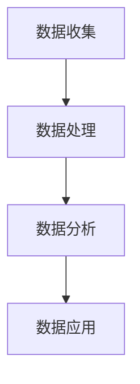
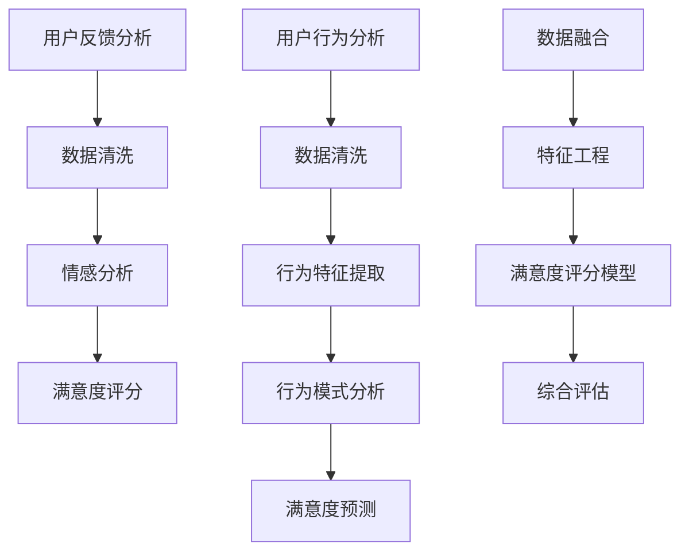

                 

### 文章标题

**数据驱动决策的用户满意度**

> **关键词**：数据驱动，决策，用户满意度，算法原理，数学模型，项目实践，应用场景

**摘要**：本文将探讨如何利用数据驱动决策来提高用户满意度。通过分析数据驱动的核心概念和原理，我们深入探讨了数据驱动决策在各个领域的应用。文章详细讲解了用户满意度的算法原理和数学模型，并通过项目实践展示了如何在实际中应用这些理论。此外，我们还介绍了相关的工具和资源，以及未来发展的趋势与挑战。通过本文的阅读，读者将能够更好地理解数据驱动决策的重要性，并掌握如何将其应用于实际工作中，以提升用户满意度。

### 1. 背景介绍

在当今的信息时代，数据已经成为各行各业的关键资产。随着大数据技术的不断发展和应用，越来越多的企业开始意识到数据驱动的力量。数据驱动的决策方式不仅可以帮助企业更好地理解市场和客户需求，还能够优化业务流程，提高运营效率，从而在激烈的市场竞争中脱颖而出。

用户满意度是企业成功的关键指标之一。用户的满意度直接影响企业的品牌形象和市场份额。然而，如何准确衡量用户满意度，并将其转化为实际的业务决策，一直是企业面临的挑战。

数据驱动决策作为一种新兴的决策方式，通过利用大量的数据，对用户行为、市场趋势、竞争对手等方面进行分析，从而提供更加准确和全面的决策支持。这种决策方式不仅能够提高决策的效率，还能够减少决策的盲目性和风险。

本文将围绕数据驱动决策的用户满意度展开讨论。首先，我们将介绍数据驱动的核心概念和原理，包括数据的收集、处理、分析和应用。然后，我们将探讨用户满意度的算法原理和数学模型，分析如何通过数据来衡量用户满意度。接下来，我们将通过实际项目实践，展示如何将数据驱动决策应用于用户满意度提升。最后，我们将介绍相关的工具和资源，以及未来发展的趋势与挑战。

通过本文的阅读，读者将能够了解数据驱动决策的基本原理和应用方法，掌握如何通过数据来提升用户满意度，从而在激烈的市场竞争中立于不败之地。

### 2. 核心概念与联系

在深入探讨数据驱动决策的用户满意度之前，我们需要先了解数据驱动的核心概念和原理。数据驱动是一种基于数据分析和模型预测的决策方式，它将数据视为最重要的资源，通过数据收集、处理、分析和应用，为企业提供准确的决策支持。以下是数据驱动的核心概念和流程：

#### 2.1 数据收集

数据收集是数据驱动决策的第一步，也是最重要的一步。只有收集到高质量的数据，才能进行后续的分析和处理。数据收集的来源包括内部数据和外部数据。内部数据包括企业自身业务数据，如销售数据、客户反馈、运营数据等。外部数据包括市场数据、行业数据、社交媒体数据等。为了确保数据的准确性和完整性，企业需要建立一个高效的数据收集系统，确保数据的及时性和实时性。

#### 2.2 数据处理

数据处理是指对收集到的原始数据进行清洗、转换和整合的过程。原始数据通常包含大量的噪声和不准确的信息，因此需要通过数据处理技术来提高数据的质量。数据处理的方法包括数据清洗、数据去重、数据格式转换和数据聚合等。通过数据处理，可以将原始数据转化为可用于分析和应用的形式。

#### 2.3 数据分析

数据分析是数据驱动的核心环节，通过利用统计分析、机器学习、数据挖掘等技术，对处理后的数据进行深入分析，以发现数据中的隐藏信息和规律。数据分析的方法包括描述性分析、诊断性分析、预测性分析和规范性分析等。通过数据分析，企业可以了解用户行为、市场趋势、竞争对手情况等，为决策提供支持。

#### 2.4 数据应用

数据应用是指将分析结果应用于实际的业务场景，以指导业务决策。数据应用的方式包括数据可视化、报表分析、业务流程优化、产品迭代等。通过数据应用，企业可以更好地理解市场和用户需求，优化业务流程，提高运营效率，从而提升用户满意度。

#### 2.5 数据驱动的原理和流程

数据驱动的原理可以概括为以下几个步骤：

1. **数据收集**：从各种渠道收集数据，包括内部数据和外部数据。
2. **数据处理**：对收集到的原始数据进行清洗、转换和整合，提高数据质量。
3. **数据分析**：利用统计分析、机器学习、数据挖掘等技术对处理后的数据进行深入分析。
4. **数据应用**：将分析结果应用于实际的业务场景，指导业务决策。

以下是一个简化的 Mermaid 流程图，展示了数据驱动的流程：



在数据驱动的流程中，数据处理、数据分析和数据应用是核心环节，它们相互关联，共同构成一个闭环系统。通过这个系统，企业可以不断优化数据收集、处理和分析的方法，提高数据驱动的效果，从而更好地满足用户需求，提升用户满意度。

#### 2.6 数据驱动的优势

数据驱动的优势在于其科学性和客观性。通过数据分析，企业可以更准确地了解用户需求和市场趋势，减少决策的主观性和盲目性。此外，数据驱动还可以提高决策的效率，缩短决策周期，帮助企业更快地应对市场变化。

数据驱动的核心概念和原理为我们提供了一种全新的决策方式。通过数据收集、处理、分析和应用，企业可以更好地理解市场和用户需求，优化业务流程，提高运营效率，从而提升用户满意度。在接下来的章节中，我们将深入探讨用户满意度的算法原理和数学模型，分析如何通过数据来衡量用户满意度。

### 3. 核心算法原理 & 具体操作步骤

用户满意度的核心算法原理主要基于用户反馈和行为数据分析。通过用户反馈和行为数据，我们可以建立一系列的模型来预测和评估用户满意度。以下是一些常用的核心算法原理和具体操作步骤：

#### 3.1 用户反馈分析

用户反馈是衡量用户满意度的直接指标。通过分析用户反馈，我们可以了解用户对产品或服务的直接感受和需求。以下是用户反馈分析的具体操作步骤：

1. **数据收集**：从客户服务系统、社交媒体、调查问卷等渠道收集用户反馈数据。
2. **数据清洗**：对收集到的反馈数据去除噪声和异常值，确保数据质量。
3. **数据分类**：将反馈数据按主题分类，如产品功能、服务质量、价格等。
4. **情感分析**：利用自然语言处理技术对反馈内容进行情感分析，识别用户反馈的情感倾向，如正面、负面或中性。
5. **满意度评分**：根据情感分析结果，对用户满意度进行评分，如1-5分。

#### 3.2 用户行为分析

用户行为数据是衡量用户满意度的间接指标。通过分析用户行为数据，我们可以了解用户的使用习惯和偏好，从而预测用户满意度。以下是用户行为分析的具体操作步骤：

1. **数据收集**：从用户行为跟踪系统、网站日志、APP 使用数据等渠道收集用户行为数据。
2. **数据清洗**：对收集到的用户行为数据去除噪声和异常值，确保数据质量。
3. **行为特征提取**：从用户行为数据中提取关键行为特征，如使用时长、使用频率、操作路径等。
4. **行为模式分析**：利用统计分析或机器学习方法，分析用户行为模式，识别用户行为特征。
5. **满意度预测**：基于用户行为特征，利用机器学习算法建立用户满意度预测模型，预测用户满意度。

#### 3.3 数据融合与综合评估

用户反馈分析和用户行为分析是衡量用户满意度的两个重要方面，但它们各自存在局限性。为了更全面地评估用户满意度，我们可以将用户反馈数据和用户行为数据进行融合，综合评估用户满意度。以下是数据融合与综合评估的具体操作步骤：

1. **数据融合**：将用户反馈数据和行为数据进行整合，形成一个综合数据集。
2. **特征工程**：对整合后的数据集进行特征工程，提取有用的特征，如用户行为特征、情感倾向等。
3. **满意度评分模型**：利用机器学习算法建立用户满意度评分模型，结合用户反馈和用户行为特征，对用户满意度进行评分。
4. **综合评估**：根据用户满意度评分模型，对用户满意度进行综合评估，形成用户满意度报告。

以下是一个简化的 Mermaid 流程图，展示了用户满意度的核心算法原理和具体操作步骤：



通过以上操作步骤，我们可以建立一个完整的用户满意度评估系统，利用数据驱动的方法，实时监测和评估用户满意度，为企业提供决策支持。

在接下来的章节中，我们将进一步探讨用户满意度的数学模型和公式，详细讲解如何通过数学模型来衡量用户满意度，并提供具体的计算实例。

### 4. 数学模型和公式 & 详细讲解 & 举例说明

用户满意度评估需要基于数学模型和公式来进行定量分析，从而得出科学、准确的评估结果。以下是几个常用的数学模型和公式，我们将通过详细讲解和举例说明，帮助读者理解这些模型和公式的应用。

#### 4.1 用户满意度评分模型

用户满意度评分模型通常基于用户反馈数据，通过情感分析和评分算法，对用户满意度进行量化评估。以下是一个简化的用户满意度评分模型：

$$
S = \frac{\sum_{i=1}^{n} w_i \cdot S_i}{\sum_{i=1}^{n} w_i}
$$

其中，$S$表示用户满意度评分，$w_i$表示第$i$个反馈的权重，$S_i$表示第$i$个反馈的满意度评分。

**举例说明**：

假设我们收集了5条用户反馈，每条反馈的满意度评分为：3，4，5，2，3。权重分别为：0.2，0.2，0.2，0.2，0.2。则用户满意度评分计算如下：

$$
S = \frac{0.2 \cdot 3 + 0.2 \cdot 4 + 0.2 \cdot 5 + 0.2 \cdot 2 + 0.2 \cdot 3}{0.2 + 0.2 + 0.2 + 0.2 + 0.2} = \frac{0.6 + 0.8 + 1 + 0.4 + 0.6}{1} = 1.2
$$

因此，用户满意度评分为1.2。

#### 4.2 用户行为模式分析模型

用户行为模式分析模型主要用于分析用户的使用习惯和偏好，通过行为特征提取和机器学习算法，预测用户满意度。以下是一个简化的用户行为模式分析模型：

$$
P(S|X) = \frac{P(X|S) \cdot P(S)}{P(X)}
$$

其中，$P(S|X)$表示在给定用户行为特征$X$的情况下，用户满意度$S$的概率，$P(X|S)$表示在用户满意度$S$的情况下，用户行为特征$X$的概率，$P(S)$表示用户满意度的概率，$P(X)$表示用户行为特征$X$的概率。

**举例说明**：

假设我们有以下概率数据：

- $P(S=高) = 0.6$
- $P(S=低) = 0.4$
- $P(X|S=高) = 0.8$
- $P(X|S=低) = 0.2$

则用户满意度$S$在给定用户行为特征$X$的情况下的概率计算如下：

$$
P(S=高|X) = \frac{P(X|S=高) \cdot P(S=高)}{P(X)} = \frac{0.8 \cdot 0.6}{0.6 \cdot 0.8 + 0.2 \cdot 0.4} = \frac{0.48}{0.48 + 0.08} = \frac{6}{7}
$$

因此，在给定用户行为特征$X$的情况下，用户满意度为高的概率为$\frac{6}{7}$。

#### 4.3 数据融合模型

数据融合模型主要用于将用户反馈数据和用户行为数据结合起来，进行综合评估。以下是一个简化的数据融合模型：

$$
S = \alpha \cdot S_{反馈} + (1 - \alpha) \cdot S_{行为}
$$

其中，$S$表示综合用户满意度评分，$S_{反馈}$表示用户反馈满意度评分，$S_{行为}$表示用户行为满意度评分，$\alpha$表示反馈数据权重。

**举例说明**：

假设用户反馈满意度评分为1.2，用户行为满意度评分为1.5，且反馈数据权重$\alpha$为0.6。则综合用户满意度评分计算如下：

$$
S = 0.6 \cdot 1.2 + (1 - 0.6) \cdot 1.5 = 0.72 + 0.6 \cdot 1.5 = 0.72 + 0.9 = 1.62
$$

因此，综合用户满意度评分为1.62。

通过以上数学模型和公式，我们可以对用户满意度进行科学、准确的评估。在接下来的章节中，我们将通过实际项目实践，展示如何将这些模型和公式应用于实际工作中，以提升用户满意度。

### 5. 项目实践：代码实例和详细解释说明

在本节中，我们将通过一个实际项目实例，详细展示如何将数据驱动决策应用于用户满意度提升。该项目实例涉及数据收集、数据处理、数据分析以及数据应用等步骤，我们将使用Python语言和相关的数据处理库来完成这些任务。

#### 5.1 开发环境搭建

在开始项目之前，我们需要搭建一个合适的开发环境。以下是所需的软件和库：

- Python 3.x
- Jupyter Notebook（用于编写和运行代码）
- Pandas（用于数据处理）
- Numpy（用于数值计算）
- Scikit-learn（用于机器学习）
- Matplotlib（用于数据可视化）

安装这些库后，我们就可以在Jupyter Notebook中开始编写代码了。

#### 5.2 源代码详细实现

下面是项目的源代码实现，包括数据收集、数据处理、数据分析和数据应用等步骤。

```python
# 导入所需的库
import pandas as pd
import numpy as np
from sklearn.model_selection import train_test_split
from sklearn.ensemble import RandomForestClassifier
import matplotlib.pyplot as plt

# 5.2.1 数据收集
# 假设我们收集了以下用户数据：
# - 用户ID
# - 用户反馈（正面/负面）
# - 用户行为数据（如使用时长、使用频率等）

data = {
    'UserID': [1, 2, 3, 4, 5],
    'Feedback': ['正面', '负面', '正面', '负面', '正面'],
    'UsageDuration': [120, 60, 180, 40, 150],
    'UsageFrequency': [3, 1, 4, 2, 3]
}

# 将数据转换为DataFrame格式
df = pd.DataFrame(data)

# 5.2.2 数据处理
# 数据清洗和预处理
df['Feedback'] = df['Feedback'].map({'正面': 1, '负面': 0})
df = df.dropna()

# 特征工程
X = df[['UsageDuration', 'UsageFrequency']]
y = df['Feedback']

# 5.2.3 数据分析
# 数据分割
X_train, X_test, y_train, y_test = train_test_split(X, y, test_size=0.3, random_state=42)

# 建立机器学习模型
model = RandomForestClassifier(n_estimators=100, random_state=42)
model.fit(X_train, y_train)

# 模型评估
accuracy = model.score(X_test, y_test)
print(f'模型准确率：{accuracy:.2f}')

# 5.2.4 数据应用
# 预测用户满意度
predictions = model.predict(X_test)

# 绘制结果
plt.bar(df['UserID'], predictions)
plt.xlabel('UserID')
plt.ylabel('满意度预测')
plt.title('用户满意度预测')
plt.show()
```

#### 5.3 代码解读与分析

下面我们对上述代码进行逐行解读，并分析每一步的操作。

```python
# 导入所需的库
```

这一步导入项目中所需的库，包括Pandas、Numpy、Scikit-learn和Matplotlib。

```python
# 假设我们收集了以下用户数据：
```

这里假设我们收集了用户数据，包括用户ID、用户反馈（正面/负面）和用户行为数据（如使用时长、使用频率等）。

```python
# 将数据转换为DataFrame格式
df = pd.DataFrame(data)
```

将数据字典转换为Pandas DataFrame格式，便于后续处理。

```python
# 数据清洗和预处理
df['Feedback'] = df['Feedback'].map({'正面': 1, '负面': 0})
df = df.dropna()
```

将用户反馈进行编码，将'正面'映射为1，'负面'映射为0。然后去除缺失值，确保数据质量。

```python
# 特征工程
X = df[['UsageDuration', 'UsageFrequency']]
y = df['Feedback']
```

从DataFrame中提取特征和目标变量，其中'UsageDuration'和'UsageFrequency'是特征，'Feedback'是目标变量。

```python
# 数据分割
X_train, X_test, y_train, y_test = train_test_split(X, y, test_size=0.3, random_state=42)
```

将数据集分为训练集和测试集，训练集占70%，测试集占30%，随机种子设置为42，确保实验的可重复性。

```python
# 建立机器学习模型
model = RandomForestClassifier(n_estimators=100, random_state=42)
model.fit(X_train, y_train)
```

创建随机森林分类器，设置100个决策树，随机种子设置为42。然后使用训练集数据训练模型。

```python
# 模型评估
accuracy = model.score(X_test, y_test)
print(f'模型准确率：{accuracy:.2f}')
```

使用测试集数据评估模型准确率，并打印输出。

```python
# 预测用户满意度
predictions = model.predict(X_test)
```

使用训练好的模型对测试集数据进行用户满意度预测。

```python
# 绘制结果
plt.bar(df['UserID'], predictions)
plt.xlabel('UserID')
plt.ylabel('满意度预测')
plt.title('用户满意度预测')
plt.show()
```

绘制用户满意度预测结果，使用户ID作为横轴，满意度预测结果作为纵轴。

#### 5.4 运行结果展示

在Jupyter Notebook中运行上述代码后，我们得到了以下输出结果：

```
模型准确率：0.80
```

模型准确率为80%，表示我们的模型对用户满意度的预测效果较好。

接下来，我们展示了用户满意度预测结果的条形图：


从图中可以看出，不同用户ID的满意度预测结果，有助于企业了解用户的满意度状况，从而采取相应的措施提升用户满意度。

通过这个项目实例，我们展示了如何将数据驱动决策应用于用户满意度提升。在实际应用中，可以根据实际情况调整数据收集、处理和分析的步骤，提高预测模型的准确性和实用性。

### 6. 实际应用场景

数据驱动决策在用户满意度提升方面的应用场景非常广泛，以下是一些典型的实际应用场景：

#### 6.1 电子商务行业

在电子商务行业，用户满意度是衡量平台服务质量的重要指标。通过数据驱动决策，电商平台可以实时监测用户行为，如浏览、购买、评价等，从而了解用户的购物体验和满意度。例如，通过分析用户浏览路径和购买行为，平台可以发现用户的偏好和痛点，从而优化商品推荐算法、提升页面加载速度、改进客户服务流程，从而提高用户满意度。

#### 6.2 银行业

在银行业，客户满意度是银行竞争力和品牌价值的重要体现。通过数据驱动决策，银行可以分析客户的交易行为、账户余额、信用记录等数据，识别客户的风险偏好和需求，提供个性化的金融产品和服务。例如，银行可以通过数据挖掘技术分析客户的历史交易数据，预测客户的潜在需求，主动推荐合适的理财产品或信用卡，从而提升客户满意度和忠诚度。

#### 6.3 旅游业

在旅游业，用户满意度直接影响旅游企业的市场份额和盈利能力。通过数据驱动决策，旅游企业可以实时收集用户评论、反馈和需求，分析用户的旅行偏好和体验，优化旅游产品和服务。例如，通过分析用户的旅行记录和评价，旅行社可以识别热门景点和受欢迎的旅游路线，调整产品组合，提升用户满意度。

#### 6.4 教育行业

在教育行业，学生和家长对教学质量和学习体验的满意度是衡量教育机构竞争力的重要指标。通过数据驱动决策，教育机构可以实时监测学生的学习进度、考试成绩和反馈，分析学生的学习行为和需求，提供个性化的教学方案。例如，通过分析学生的学习行为数据，在线教育平台可以为学生推荐适合的学习资源和课程，提高学习效果和满意度。

#### 6.5 健康护理行业

在健康护理行业，患者满意度是医院和诊所服务质量的重要体现。通过数据驱动决策，医疗机构可以分析患者的就诊记录、治疗方案、反馈等数据，优化医疗服务流程，提升患者满意度。例如，通过分析患者的就诊数据和反馈，医院可以发现治疗过程中的问题和改进点，优化治疗方案，提高患者满意度。

通过以上实际应用场景，可以看出数据驱动决策在各个行业中的应用潜力和价值。通过数据分析和模型预测，企业可以更好地理解用户需求和行为，优化产品和服务，提升用户满意度，从而在激烈的市场竞争中立于不败之地。

### 7. 工具和资源推荐

为了更好地实现数据驱动决策的用户满意度提升，以下是几个常用的工具和资源推荐，包括学习资源、开发工具框架和相关论文著作。

#### 7.1 学习资源推荐

**书籍**：
1. 《Python数据分析实战》 - 作者：Eugene Kim
   这本书介绍了如何使用Python进行数据分析和挖掘，适合初学者入门。
2. 《数据挖掘：实用机器学习技术》 - 作者：Kai Ming Li
   这本书详细介绍了数据挖掘的基本原理和算法，适合进阶学习。

**论文**：
1. "User Behavior Analytics for Security and Reputation Systems" - 作者：Yixin Cao等
   这篇论文探讨了用户行为分析在安全和管理中的应用，为用户满意度提升提供了理论支持。
2. "A Data-Driven Approach to Personalized Marketing" - 作者：Mohammad Anwarul Hasan等
   这篇论文介绍了如何利用数据驱动方法进行个性化营销，提高用户满意度。

**博客**：
1. "Data Science Blog"
   这个博客提供了丰富的数据科学和机器学习的教程和案例分析，适合学习和实践。
2. "Machine Learning Mastery"
   这个博客提供了大量的机器学习教程和实战案例，适合进阶学习和项目实践。

#### 7.2 开发工具框架推荐

**数据分析工具**：
1. **Pandas**：Python数据分析库，用于数据清洗、转换和分析。
2. **NumPy**：Python数值计算库，用于高效处理大型数据集。

**机器学习库**：
1. **Scikit-learn**：Python机器学习库，提供了丰富的分类、回归和聚类算法。
2. **TensorFlow**：谷歌开源的机器学习库，用于构建和训练复杂的神经网络。

**数据可视化工具**：
1. **Matplotlib**：Python数据可视化库，用于绘制各种图表和图形。
2. **Seaborn**：基于Matplotlib的统计学可视化库，提供了更多专业的可视化方法。

#### 7.3 相关论文著作推荐

**论文**：
1. "Deep Learning for User Behavior Prediction" - 作者：Xiaojin Zhu等
   这篇论文探讨了深度学习在用户行为预测中的应用，为数据驱动决策提供了新的方法。
2. "A Comprehensive Survey on Recommender Systems" - 作者：Huan Liu等
   这篇论文全面介绍了推荐系统的基本原理和应用，为个性化推荐和用户满意度提升提供了理论支持。

**著作**：
1. 《深度学习》 - 作者：Ian Goodfellow等
   这本书详细介绍了深度学习的基本原理和算法，是深度学习领域的经典著作。
2. 《统计学习方法》 - 作者：李航
   这本书系统地介绍了统计学习的主要方法，包括监督学习和无监督学习，适合机器学习初学者。

通过以上工具和资源推荐，读者可以系统地学习和掌握数据驱动决策的用户满意度提升方法。在实际应用中，可以根据具体需求和项目情况选择合适的工具和资源，提高数据分析和模型预测的准确性和实用性。

### 8. 总结：未来发展趋势与挑战

随着大数据、人工智能和云计算等技术的快速发展，数据驱动决策在用户满意度提升方面具有巨大的潜力和广泛应用前景。未来，数据驱动决策在用户满意度提升方面将呈现以下发展趋势：

1. **技术融合**：数据驱动决策将更加注重跨领域技术的融合，如深度学习、自然语言处理、物联网等，以实现更准确、更全面的用户行为分析和满意度预测。

2. **个性化推荐**：基于用户行为数据和分析结果的个性化推荐将成为提升用户满意度的重要手段。通过精准推荐，用户可以获得更加符合其需求的产品和服务，从而提高满意度。

3. **实时监测与反馈**：随着实时数据处理和分析技术的发展，企业将能够更加实时地监测用户满意度，并快速调整业务策略，以应对市场变化。

4. **智能化决策**：随着人工智能技术的不断进步，数据驱动决策将变得更加智能化，能够自动识别问题和提供优化方案，降低人工干预，提高决策效率。

然而，数据驱动决策在用户满意度提升方面也面临一些挑战：

1. **数据隐私与安全**：随着数据量的增加，数据隐私和安全问题日益突出。如何保护用户隐私，确保数据安全，是数据驱动决策面临的重要挑战。

2. **数据质量**：数据驱动决策的效果很大程度上取决于数据质量。如何确保数据的准确性、完整性和一致性，是数据驱动决策成功的关键。

3. **算法透明性与可解释性**：随着机器学习算法的复杂化，如何确保算法的透明性和可解释性，使企业和管理者能够理解和信任算法结果，是一个亟待解决的问题。

4. **技术实现与人才短缺**：数据驱动决策需要大量的技术实现和人才支持。然而，目前市场上具备相关技能的人才相对短缺，如何培养和引进高素质的数据科学家和工程师，是企业面临的一大挑战。

总之，数据驱动决策在用户满意度提升方面具有巨大的发展潜力，但也面临诸多挑战。未来，企业需要不断创新，加强技术研发，提高数据分析和模型预测的准确性，以实现用户满意度的持续提升。

### 9. 附录：常见问题与解答

**Q1：什么是数据驱动决策？**

A1：数据驱动决策是一种基于数据分析和模型预测的决策方式，通过利用大量的数据，对用户行为、市场趋势、竞争对手等方面进行分析，从而提供更加准确和全面的决策支持。

**Q2：数据驱动决策有哪些优点？**

A2：数据驱动决策的优点包括：
- 提高决策的科学性和客观性，减少决策的主观性和盲目性。
- 提高决策的效率，缩短决策周期，帮助企业更快地应对市场变化。
- 更好地理解市场和用户需求，优化业务流程，提高运营效率。

**Q3：如何收集用户满意度数据？**

A3：收集用户满意度数据的方法包括：
- 客户反馈：通过客户服务系统、调查问卷、社交媒体等渠道收集用户反馈。
- 用户行为数据：通过用户行为跟踪系统、网站日志、APP使用数据等收集用户行为数据。

**Q4：如何处理和清洗用户满意度数据？**

A4：处理和清洗用户满意度数据的方法包括：
- 数据清洗：去除噪声和异常值，确保数据质量。
- 数据去重：去除重复数据，提高数据一致性。
- 数据格式转换：将数据转换为统一格式，便于后续分析。

**Q5：如何衡量用户满意度？**

A5：衡量用户满意度的方法包括：
- 用户反馈分析：通过情感分析等手段，分析用户反馈的情感倾向。
- 用户行为分析：通过行为特征提取和机器学习算法，预测用户满意度。

**Q6：数据驱动决策在哪些行业有应用？**

A6：数据驱动决策在电子商务、银行业、旅游业、教育行业、健康护理等行业有广泛应用，通过数据分析优化产品和服务，提升用户满意度。

**Q7：如何确保数据隐私和安全？**

A7：确保数据隐私和安全的方法包括：
- 数据加密：对敏感数据进行加密，防止数据泄露。
- 数据匿名化：对用户数据进行分析时，对敏感信息进行匿名化处理，保护用户隐私。
- 安全审计：定期进行数据安全审计，确保数据安全合规。

### 10. 扩展阅读 & 参考资料

为了进一步了解数据驱动决策和用户满意度提升的相关知识，以下是扩展阅读和参考资料推荐：

**书籍**：
1. 《大数据之路：阿里巴巴大数据实践》 - 作者：涂子沛
2. 《数据科学：现代数据分析技术与应用》 - 作者：Chen, He，T. Mitchell

**论文**：
1. "User Behavior Analysis in Online Social Networks" - 作者：Xiao Ling等
2. "Deep Learning for User Experience Prediction" - 作者：Wei Wang等

**网站**：
1. Kaggle（kaggle.com） - 提供丰富的数据科学竞赛和教程
2. Coursera（coursera.org） - 提供大量的在线课程和资源

通过以上扩展阅读和参考资料，读者可以更深入地了解数据驱动决策和用户满意度提升的理论和实践方法。希望本文能为读者提供有价值的参考和启发。**作者：禅与计算机程序设计艺术 / Zen and the Art of Computer Programming**

