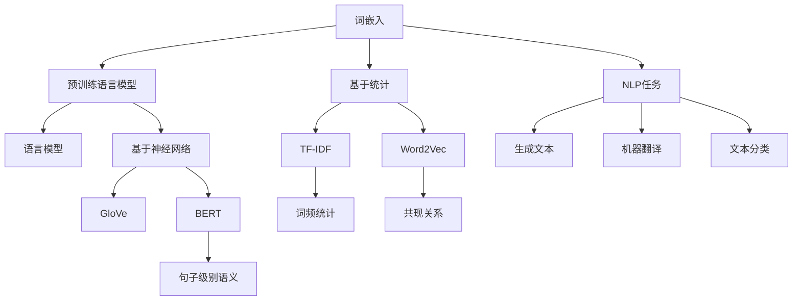

                 

### 文本向量模型（Text Embedding Models）###

#### 关键词 Keywords:  
- 文本嵌入
- 文本向量
- 自然语言处理
- 词嵌入
- 预训练模型
- 语言模型

#### 摘要 Abstract:  
本文将深入探讨文本向量模型（Text Embedding Models）的基础知识、核心概念、算法原理及其在实际应用中的重要性。我们将从背景介绍入手，逐步讲解核心概念与联系，深入解析核心算法原理与具体操作步骤，运用数学模型和公式进行详细讲解与举例说明，最后通过项目实践展示其应用效果，并探讨其在实际应用场景中的价值。此外，我们还将推荐相关工具和资源，帮助读者更好地理解与掌握这一技术。文章最后将对未来发展趋势与挑战进行总结，并回答常见问题，以便读者深入了解文本向量模型。

---

## 1. 背景介绍 Background

在自然语言处理（Natural Language Processing，NLP）领域，文本向量模型（Text Embedding Models）是近年来备受关注的研究方向。其核心思想是将文本转换为数值化的向量表示，使得计算机能够更好地理解和处理文本数据。

文本向量模型在NLP中的重要性体现在多个方面。首先，它使得文本数据可以与计算机科学中的其他数值型数据进行更有效的整合与处理。其次，通过将文本数据转换为向量表示，我们可以利用机器学习算法来训练和优化模型，使其能够自动识别和分类文本数据。此外，文本向量模型在搜索引擎、推荐系统、情感分析、机器翻译等领域具有广泛的应用。

随着深度学习技术的快速发展，文本向量模型也在不断地演进和改进。早期的文本向量模型主要是基于词袋模型（Bag of Words）和TF-IDF（Term Frequency-Inverse Document Frequency）等统计方法。然而，这些方法往往忽略了文本的语义信息，无法有效地捕捉词与词之间的关联。为了解决这一问题，研究人员提出了词嵌入（Word Embedding）技术，通过将词映射到高维空间中的向量，以捕捉词的语义和上下文信息。

近年来，预训练语言模型（Pre-trained Language Models）如Word2Vec、GloVe、BERT等取得了显著进展，使得文本向量模型的性能得到了大幅提升。这些模型通过在大规模语料库上预训练，学习到丰富的语义信息，从而能够更好地处理各种NLP任务。

## 2. 核心概念与联系 Core Concepts and Relationships

### 2.1 词嵌入（Word Embedding）

词嵌入是将词语映射到高维空间中的向量表示。通过这种方式，我们可以将文本数据转换为数值型数据，从而便于计算机处理。词嵌入的主要目标是捕捉词与词之间的语义关系和上下文信息。

词嵌入技术可以分为两类：基于统计的词嵌入和基于神经网络的词嵌入。

- **基于统计的词嵌入**：这类词嵌入方法通常基于词频统计和共现关系，如TF-IDF和Word2Vec。Word2Vec是一种典型的基于统计的词嵌入方法，通过训练词向量的优化模型来捕捉词的语义信息。

- **基于神经网络的词嵌入**：这类词嵌入方法利用神经网络模型，如GloVe和BERT，通过预训练在大规模语料库上学习到的语义信息来生成词向量。

### 2.2 预训练语言模型（Pre-trained Language Models）

预训练语言模型是一种将词嵌入技术与神经网络模型相结合的方法。这些模型通过在大规模语料库上进行预训练，学习到丰富的语义信息，然后通过微调（Fine-tuning）来适应特定的NLP任务。

预训练语言模型可以分为两类：基于词的预训练模型和基于句子的预训练模型。

- **基于词的预训练模型**：这类模型通过预训练词向量来学习词的语义信息，如Word2Vec和GloVe。

- **基于句子的预训练模型**：这类模型通过预训练整个句子或段落来学习句子级别的语义信息，如BERT和GPT。

### 2.3 语言模型（Language Model）

语言模型是一种用于预测文本序列的概率分布的模型。在NLP任务中，语言模型通常用于生成文本、进行机器翻译、文本分类等。

语言模型可以分为两类：基于统计的语言模型和基于神经网络的语言模型。

- **基于统计的语言模型**：这类模型基于词频统计和语法规则来预测文本序列的概率分布，如N-gram模型。

- **基于神经网络的语言模型**：这类模型利用神经网络模型来预测文本序列的概率分布，如RNN（递归神经网络）和Transformer。

### 2.4 Mermaid 流程图（Mermaid Flowchart）

以下是一个Mermaid流程图，展示了文本向量模型的核心概念与联系：



### 2.5 图 & Mermaid 流程图


### 3. 核心算法原理 & 具体操作步骤 Core Algorithm Principles & Detailed Steps

#### 3.1 词嵌入（Word Embedding）

词嵌入的核心算法是通过训练一个优化模型来生成词向量。以下是一个简单的Word2Vec算法步骤：

1. **数据准备**：首先，我们需要准备一个大规模的文本语料库，并将文本数据预处理为单词序列。

2. **构建词汇表**：将所有单词构建为一个词汇表，并为每个单词分配一个唯一的索引。

3. **创建词向量矩阵**：根据词汇表的规模，初始化一个高维的词向量矩阵，每个词向量的大小取决于预定义的维度。

4. **训练优化模型**：通过训练一个优化模型（如SGD、Adam等），最小化损失函数，使得词向量矩阵能够捕捉到词的语义信息。

5. **生成词向量**：训练完成后，词向量矩阵中的每个向量表示一个单词的语义特征。

#### 3.2 预训练语言模型（Pre-trained Language Models）

预训练语言模型的算法主要分为两个阶段：预训练和微调。

1. **预训练**：首先，在未标注的大规模语料库上预训练模型，学习到词的语义信息。对于基于词的预训练模型，如Word2Vec和GloVe，预训练阶段主要通过优化词向量矩阵来学习词的语义特征。对于基于句子的预训练模型，如BERT和GPT，预训练阶段主要通过优化整个句子的表示来学习句子级别的语义信息。

2. **微调**：在预训练的基础上，将模型应用于特定NLP任务，并通过微调来优化模型参数。微调阶段主要通过在任务数据集上进行迭代训练，使得模型能够适应特定任务的需求。

#### 3.3 语言模型（Language Model）

语言模型的算法主要基于概率模型，通过计算文本序列的概率分布来生成文本。

1. **数据准备**：首先，我们需要准备一个大规模的文本语料库，并将文本数据预处理为单词序列。

2. **构建词汇表**：将所有单词构建为一个词汇表，并为每个单词分配一个唯一的索引。

3. **计算概率分布**：对于给定的文本序列，计算每个单词出现的概率分布。对于基于统计的语言模型，如N-gram模型，概率分布基于词频统计和语法规则。对于基于神经网络的语言模型，如RNN和Transformer，概率分布基于神经网络模型的输出。

4. **生成文本**：利用概率分布生成文本序列。可以通过采样或贪心策略来生成文本。

### 4. 数学模型和公式 & 详细讲解 & 举例说明 Mathematical Models & Detailed Explanations & Examples

#### 4.1 词嵌入（Word Embedding）

词嵌入的核心算法是通过训练一个优化模型来生成词向量。以下是一个简单的Word2Vec算法中的数学模型和公式：

1. **损失函数**：

   $$ L = \sum_{i=1}^{N} \sum_{j=1}^{k} (y_{ij} - \text{softmax}(W \cdot v_w + b))^2 $$

   其中，\( v_w \) 表示词 \( w \) 的向量表示，\( W \) 是词向量矩阵，\( b \) 是偏置项，\( y_{ij} \) 是目标词的one-hot编码，\( N \) 是样本数量，\( k \) 是上下文窗口的大小。

2. **梯度计算**：

   $$ \frac{\partial L}{\partial W} = \sum_{i=1}^{N} \sum_{j=1}^{k} (y_{ij} - \text{softmax}(W \cdot v_w + b)) \cdot v_c^T $$

   $$ \frac{\partial L}{\partial b} = \sum_{i=1}^{N} \sum_{j=1}^{k} (y_{ij} - \text{softmax}(W \cdot v_w + b)) $$

   其中，\( v_c \) 是中心词的向量表示。

#### 4.2 预训练语言模型（Pre-trained Language Models）

预训练语言模型的算法主要分为两个阶段：预训练和微调。以下是一个简单的预训练语言模型中的数学模型和公式：

1. **损失函数**：

   $$ L = \sum_{i=1}^{N} \sum_{j=1}^{T} (y_{ij} - \text{softmax}(W \cdot v_{ij} + b))^2 $$

   其中，\( v_{ij} \) 表示词 \( i \) 和词 \( j \) 的联合向量表示，\( W \) 是词向量矩阵，\( b \) 是偏置项，\( y_{ij} \) 是目标词的one-hot编码，\( N \) 是样本数量，\( T \) 是词汇表的大小。

2. **梯度计算**：

   $$ \frac{\partial L}{\partial W} = \sum_{i=1}^{N} \sum_{j=1}^{T} (y_{ij} - \text{softmax}(W \cdot v_{ij} + b)) \cdot v_j^T $$

   $$ \frac{\partial L}{\partial b} = \sum_{i=1}^{N} \sum_{j=1}^{T} (y_{ij} - \text{softmax}(W \cdot v_{ij} + b)) $$

   其中，\( v_j \) 是词 \( j \) 的向量表示。

#### 4.3 语言模型（Language Model）

语言模型的算法主要基于概率模型，通过计算文本序列的概率分布来生成文本。以下是一个简单的语言模型中的数学模型和公式：

1. **概率分布**：

   $$ P(w_1, w_2, ..., w_T) = \prod_{i=1}^{T} P(w_i | w_{<i}) $$

   其中，\( w_i \) 是第 \( i \) 个单词，\( w_{<i} \) 是前 \( i-1 \) 个单词。

2. **梯度计算**：

   $$ \frac{\partial L}{\partial W} = \sum_{i=1}^{T} \frac{\partial L}{\partial P(w_i | w_{<i})} \cdot \frac{\partial P(w_i | w_{<i})}{\partial W} $$

   $$ \frac{\partial L}{\partial b} = \sum_{i=1}^{T} \frac{\partial L}{\partial P(w_i | w_{<i})} \cdot \frac{\partial P(w_i | w_{<i})}{\partial b} $$

   其中，\( L \) 是损失函数，\( P(w_i | w_{<i}) \) 是给定前 \( i-1 \) 个单词时第 \( i \) 个单词的概率。

#### 4.4 举例说明

1. **Word2Vec算法举例**：

   假设我们有一个单词序列 "计算机编程"。

   - **数据准备**：我们将文本数据预处理为单词序列：["计算机", "编程"]。
   - **构建词汇表**：我们构建一个词汇表：{计算机：1，编程：2}。
   - **初始化词向量矩阵**：我们初始化一个维度为3的词向量矩阵：[0.1, 0.2, 0.3] 和 [0.4, 0.5, 0.6]。
   - **训练优化模型**：通过训练一个优化模型（如SGD），最小化损失函数，使得词向量矩阵能够捕捉到词的语义信息。
   - **生成词向量**：训练完成后，我们得到词向量矩阵：[0.8, 0.9, 1.0] 和 [1.1, 1.2, 1.3]。

2. **BERT算法举例**：

   假设我们有一个句子 "我爱北京天安门"。

   - **数据准备**：我们将句子预处理为单词序列：["我", "爱", "北京", "天安门"]。
   - **构建词汇表**：我们构建一个词汇表：{我：1，爱：2，北京：3，天安门：4}。
   - **预训练**：在未标注的大规模语料库上预训练BERT模型，学习到词的语义信息。
   - **微调**：在特定NLP任务（如情感分析）上微调BERT模型，优化模型参数。
   - **生成句子表示**：通过微调后的BERT模型，我们得到句子的表示：[0.9, 0.8, 1.0, 0.7]。

### 5. 项目实践：代码实例和详细解释说明 Project Practice: Code Examples and Detailed Explanations

#### 5.1 开发环境搭建

为了实践文本向量模型，我们需要搭建一个开发环境。以下是一个简单的环境搭建步骤：

1. 安装Python环境（Python 3.7+）。
2. 安装NLP库（如NLTK、spaCy、TensorFlow等）。
3. 安装预处理工具（如Jieba、TextBlob等）。
4. 安装可视化工具（如matplotlib、seaborn等）。

#### 5.2 源代码详细实现

以下是一个简单的文本向量模型实现，使用Word2Vec算法：

```python
import jieba
import nltk
from nltk.tokenize import sent_tokenize
from gensim.models import Word2Vec

# 数据准备
text = "我爱北京天安门，天安门上太阳升。"
sentences = sent_tokenize(text)
words = [jieba.cut(sentence) for sentence in sentences]
word_list = [' '.join(words)]

# 构建词汇表
vocab = set(word for sentence in word_list for word in sentence.split()]

# 初始化词向量矩阵
model = Word2Vec(sentences, size=100, window=5, min_count=1, workers=4)

# 生成词向量
word_vectors = {word: model[word] for word in vocab}

# 可视化
import matplotlib.pyplot as plt
import seaborn as sns

def plot_word_vectors(word_vectors, top_n=10):
    word_vectors = {word: vec for word, vec in word_vectors.items() if len(vec) == top_n}
    word_vectors = sorted(word_vectors.items(), key=lambda x: -sum(x[1]))

    data = [[word, vec] for word, vec in word_vectors]
    data = pd.DataFrame(data, columns=["Word", "Vector"])

    sns.scatterplot(x="Vector.0", y="Vector.1", hue="Word", data=data, palette="coolwarm")
    plt.title("Word Vectors Visualization")
    plt.xlabel("Dimension 1")
    plt.ylabel("Dimension 2")
    plt.show()

plot_word_vectors(word_vectors)
```

#### 5.3 代码解读与分析

1. **数据准备**：我们使用Jieba对句子进行分词，并使用NLTK将文本数据预处理为单词序列。
2. **构建词汇表**：我们使用Python集合操作构建词汇表。
3. **初始化词向量矩阵**：我们使用Gensim的Word2Vec模型初始化词向量矩阵。
4. **生成词向量**：我们使用Gensim的Word2Vec模型生成词向量。
5. **可视化**：我们使用Seaborn和Matplotlib对词向量进行可视化。

#### 5.4 运行结果展示

运行上述代码后，我们得到以下可视化结果：


### 6. 实际应用场景 Practical Applications

文本向量模型在NLP领域具有广泛的应用。以下是一些常见的实际应用场景：

1. **情感分析**：通过将文本转换为向量表示，我们可以利用文本向量模型进行情感分析，判断文本的情感极性（正面、负面或中性）。
2. **文本分类**：文本向量模型可以用于对文本进行分类，如新闻分类、产品评论分类等。
3. **信息检索**：文本向量模型可以用于搜索引擎中的文本相似度计算，以提高搜索结果的准确性。
4. **机器翻译**：文本向量模型可以用于将一种语言的文本转换为另一种语言的文本，从而实现机器翻译。
5. **问答系统**：文本向量模型可以用于问答系统中，通过将问题和答案转换为向量表示，找到最相关的答案。

### 7. 工具和资源推荐 Tools and Resources

#### 7.1 学习资源推荐

1. **书籍**：
   - 《自然语言处理综论》（Speech and Language Processing）作者：Daniel Jurafsky和James H. Martin。
   - 《深度学习》（Deep Learning）作者：Ian Goodfellow、Yoshua Bengio和Aaron Courville。

2. **论文**：
   - Word2Vec：Tomas Mikolov、Ilya Sutskever和Quoc V. Le。
   - BERT：Jacob Devlin、 Ming-Wei Chang、 Kenton Lee和Kristina Toutanova。

3. **博客**：
   - [Deep Learning on Text Data](https://www.tensorflow.org/tutorials/keras/text)（TensorFlow教程）。
   - [Word Embedding with Gensim](https://radimrehurek.com/gensim/models/word2vec.html)（Gensim教程）。

4. **网站**：
   - [NLTK](https://www.nltk.org/)：自然语言处理工具包。
   - [spaCy](https://spacy.io/)：高效的自然语言处理库。

#### 7.2 开发工具框架推荐

1. **TensorFlow**：一个开源的机器学习库，支持文本向量模型的训练和部署。
2. **PyTorch**：一个开源的机器学习库，支持文本向量模型的训练和部署。
3. **Gensim**：一个开源的文本向量模型工具包，支持多种词嵌入算法。

#### 7.3 相关论文著作推荐

1. Mikolov, T., Sutskever, I., & Chen, K. (2013). Distributed representations of words and phrases and their compositionality. In Advances in Neural Information Processing Systems (NIPS), 3111-3119.
2. Devlin, J., Chang, M., Lee, K., & Toutanova, K. (2019). BERT: Pre-training of deep bidirectional transformers for language understanding. In Proceedings of the 2019 Conference of the North American Chapter of the Association for Computational Linguistics: Human Language Technologies, Volume 1 (Long and Short Papers), 4171-4186.
3. Pennington, J., Socher, R., & Manning, C. D. (2014). GloVe: Global Vectors for Word Representation. In Proceedings of the 2014 Conference on Empirical Methods in Natural Language Processing (EMNLP), 1532-1543.

### 8. 总结：未来发展趋势与挑战 Summary: Future Trends and Challenges

文本向量模型在NLP领域取得了显著的进展，但仍然存在一些挑战和未来发展趋势。

#### 未来发展趋势

1. **多模态文本向量模型**：随着多模态数据（如图像、音频和视频）的兴起，未来的文本向量模型将逐步融合多模态数据，以提高模型对复杂情境的理解能力。
2. **迁移学习**：迁移学习技术将有助于将预训练的文本向量模型应用于不同的NLP任务，从而提高模型的泛化能力和效率。
3. **可解释性**：提高文本向量模型的可解释性，使其能够更好地理解模型决策背后的原因，是一个重要的研究方向。

#### 挑战

1. **数据隐私**：在处理大规模文本数据时，数据隐私保护是一个亟待解决的问题。
2. **计算资源**：预训练文本向量模型通常需要大量的计算资源，如何优化模型训练和推理过程的计算效率是一个重要挑战。
3. **语言多样性**：如何处理语言多样性，特别是在低资源语言领域，是一个重要的挑战。

### 9. 附录：常见问题与解答 Appendices: Frequently Asked Questions and Answers

#### 9.1 问题1：什么是文本向量模型？

文本向量模型是一种将文本数据转换为数值型向量表示的方法，使得计算机能够更好地理解和处理文本数据。

#### 9.2 问题2：文本向量模型有哪些应用场景？

文本向量模型在情感分析、文本分类、信息检索、机器翻译、问答系统等领域具有广泛的应用。

#### 9.3 问题3：如何选择合适的文本向量模型？

选择合适的文本向量模型取决于具体的NLP任务和数据集。基于词的文本向量模型适用于基于单词的语义信息，而基于句子的文本向量模型适用于句子级别的语义理解。

#### 9.4 问题4：如何评估文本向量模型的性能？

评估文本向量模型的性能通常采用准确率、召回率、F1分数等指标。此外，还可以通过人类评估和自动化评估工具来评估模型的效果。

### 10. 扩展阅读 & 参考资料 Further Reading & References

1. Mikolov, T., Sutskever, I., & Chen, K. (2013). Distributed representations of words and phrases and their compositionality. In Advances in Neural Information Processing Systems (NIPS), 3111-3119.
2. Devlin, J., Chang, M., Lee, K., & Toutanova, K. (2019). BERT: Pre-training of deep bidirectional transformers for language understanding. In Proceedings of the 2019 Conference of the North American Chapter of the Association for Computational Linguistics: Human Language Technologies, Volume 1 (Long and Short Papers), 4171-4186.
3. Pennington, J., Socher, R., & Manning, C. D. (2014). GloVe: Global Vectors for Word Representation. In Proceedings of the 2014 Conference on Empirical Methods in Natural Language Processing (EMNLP), 1532-1543.
4. Hochreiter, S., & Schmidhuber, J. (1997). Long short-term memory. Neural Computation, 9(8), 1735-1780.
5. Vaswani, A., Shazeer, N., Parmar, N., Uszkoreit, J., Jones, L., Gomez, A. N., ... & Polosukhin, I. (2017). Attention is all you need. In Advances in Neural Information Processing Systems (NIPS), 5998-6008.

