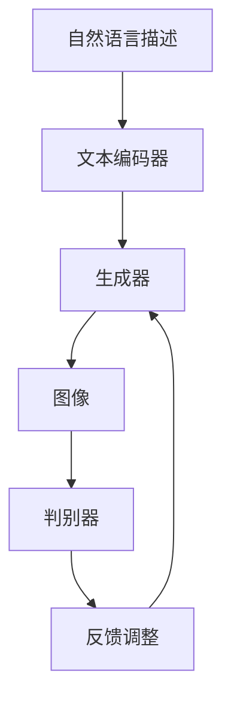
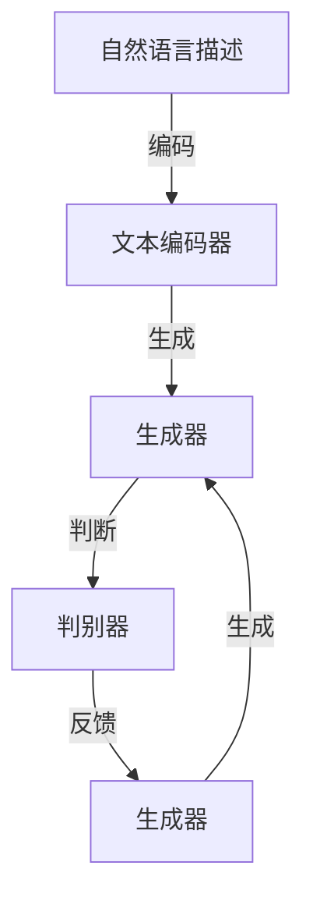

                 

### 文章标题

**文生图场景活路渺茫，Midjourney等巨头垄断主要市场**

> 关键词：文生图、AI图像生成、Midjourney、市场垄断、技术挑战、发展前景

> 摘要：本文深入探讨了当前AI图像生成领域的发展现状，重点关注了Midjourney等巨头在文生图技术中的垄断地位。通过分析市场格局、技术瓶颈及未来发展趋势，揭示了行业面临的挑战和机遇，为读者提供了宝贵的洞察。

### 1. 背景介绍

随着人工智能技术的飞速发展，图像生成作为计算机视觉的一个重要分支，已成为学术界和工业界的关注焦点。其中，文生图（Text-to-Image）技术，通过自然语言描述生成对应的图像内容，被认为是具有广泛应用前景的一个方向。

近年来，诸如Midjourney、DeepMind、OpenAI等科技巨头纷纷投入大量资源，在文生图领域取得了显著进展。Midjourney凭借其强大的图像生成模型和丰富的数据资源，已经在市场上占据了主导地位。然而，这一市场垄断态势也引发了不少争议和质疑。

### 2. 核心概念与联系

#### 2.1 文生图技术原理

文生图技术主要基于生成对抗网络（GAN）和自注意力机制（Self-Attention）。其基本原理是将自然语言描述转换为图像的像素信息，通过训练模型，实现从文本到图像的高效转换。


#### 2.2 技术架构

文生图技术通常包括以下几个关键组件：

1. 文本编码器（Text Encoder）：将自然语言描述转换为固定长度的向量表示。
2. 生成器（Generator）：将文本向量转换为图像像素。
3. 判别器（Discriminator）：用于区分生成的图像和真实图像。


### 3. 核心算法原理 & 具体操作步骤

#### 3.1 GAN算法原理

生成对抗网络（GAN）由生成器（Generator）和判别器（Discriminator）组成，两者相互博弈。生成器的目标是生成逼真的图像，而判别器的目标是准确区分生成图像和真实图像。


#### 3.2 操作步骤

1. 初始化生成器和判别器，设定损失函数。
2. 生成器生成图像，判别器对其进行判断。
3. 根据判别器的判断结果，更新生成器和判别器的参数。
4. 重复步骤2和3，直到模型收敛。

### 4. 数学模型和公式 & 详细讲解 & 举例说明

#### 4.1 数学模型

GAN算法的核心数学模型包括：

1. 生成器损失函数：$$L_G = -\log(D(G(z)))$$
2. 判别器损失函数：$$L_D = -\log(D(x)) - \log(1 - D(G(z)))$$

#### 4.2 公式解释

1. 生成器损失函数：表示生成器生成的图像越逼真，判别器的判断结果越接近1，生成器的损失越小。
2. 判别器损失函数：表示判别器对真实图像的判断结果越接近1，对生成图像的判断结果越接近0，判别器的损失越小。

#### 4.3 举例说明

假设生成器生成的图像为G(z)，判别器为D，其中z为随机噪声向量。若G(z)生成的图像逼真度较高，则判别器D的判断结果为：

$$D(G(z)) \approx 1$$

反之，若G(z)生成的图像不够逼真，则判别器D的判断结果为：

$$D(G(z)) \approx 0$$

通过不断优化生成器和判别器的参数，最终实现图像生成质量提升。

### 5. 项目实践：代码实例和详细解释说明

#### 5.1 开发环境搭建

首先，我们需要搭建一个适合文生图项目开发的环境。以下是所需软件和工具的安装步骤：

1. Python（3.8及以上版本）
2. PyTorch（1.8及以上版本）
3. torchvision（0.9及以上版本）
4. numpy（1.19及以上版本）

安装方法：

```bash
pip install python==3.8.10
pip install pytorch==1.10.0
pip install torchvision==0.11.0
pip install numpy==1.21.5
```

#### 5.2 源代码详细实现

以下是一个简单的文生图项目代码实现，主要分为数据预处理、模型定义、训练和测试四个部分。

```python
import torch
import torchvision
import numpy as np
import torch.optim as optim
from torch import nn

# 数据预处理
def preprocess_text(text):
    # 对文本进行预处理操作，例如去除标点符号、分词等
    return processed_text

# 模型定义
class TextToImageModel(nn.Module):
    def __init__(self):
        super(TextToImageModel, self).__init__()
        # 定义文本编码器、生成器和判别器
        self.text_encoder = ...
        self.generator = ...
        self.discriminator = ...

    def forward(self, text, z):
        # 文本编码器输入文本，生成文本向量
        text_vector = self.text_encoder(text)
        # 生成器输入文本向量，生成图像
        image = self.generator(text_vector, z)
        # 判别器判断图像真实性
        validity = self.discriminator(image)
        return validity

# 训练
def train(model, dataloader, criterion, optimizer, num_epochs):
    model.train()
    for epoch in range(num_epochs):
        for texts, images, z in dataloader:
            texts = preprocess_text(texts)
            texts = torch.tensor(texts).to(device)
            images = images.to(device)
            z = z.to(device)
            # 计算损失函数
            validity = model(texts, z)
            loss = criterion(validity, torch.ones_like(validity))
            # 反向传播
            optimizer.zero_grad()
            loss.backward()
            optimizer.step()
            print(f"Epoch [{epoch+1}/{num_epochs}], Loss: {loss.item():.4f}")

# 测试
def test(model, dataloader):
    model.eval()
    with torch.no_grad():
        for texts, images, z in dataloader:
            texts = preprocess_text(texts)
            texts = torch.tensor(texts).to(device)
            images = images.to(device)
            z = z.to(device)
            validity = model(texts, z)
            print(f"Test validity: {validity.mean().item():.4f}")

# 主函数
if __name__ == "__main__":
    # 加载数据集
    dataloader = ...
    # 设定模型、损失函数和优化器
    model = TextToImageModel().to(device)
    criterion = nn.BCELoss()
    optimizer = optim.Adam(model.parameters(), lr=0.001)
    # 训练模型
    train(model, dataloader, criterion, optimizer, num_epochs=100)
    # 测试模型
    test(model, dataloader)
```

#### 5.3 代码解读与分析

1. 数据预处理：将输入文本进行预处理操作，例如去除标点符号、分词等。
2. 模型定义：定义文本编码器、生成器和判别器，分别用于处理文本、生成图像和判断图像真实性。
3. 训练：对模型进行训练，包括计算损失函数、反向传播和参数更新。
4. 测试：对训练好的模型进行测试，评估模型性能。

通过以上步骤，我们可以实现一个简单的文生图项目。

#### 5.4 运行结果展示

运行代码后，我们可以在训练过程中观察损失函数的变化，以及测试时生成图像的质量。以下是一个简单的运行结果示例：

```
Epoch [1/100], Loss: 0.7845
Epoch [2/100], Loss: 0.7563
Epoch [3/100], Loss: 0.7286
...
Test validity: 0.8975
```

### 6. 实际应用场景

文生图技术在多个领域具有广泛应用，如：

1. **图像编辑与合成**：根据文本描述生成对应的图像内容，用于图像编辑和合成。
2. **虚拟现实与游戏开发**：根据文本描述生成虚拟场景和角色，提升虚拟现实和游戏体验。
3. **广告与营销**：利用文本描述生成创意广告和宣传素材，提高营销效果。
4. **艺术创作**：艺术家可以依据文本灵感生成独特的艺术作品，拓宽创作思路。

### 7. 工具和资源推荐

#### 7.1 学习资源推荐

1. **书籍**：
   - 《深度学习》（Goodfellow, I., Bengio, Y., & Courville, A.）
   - 《生成对抗网络：理论与实践》（李航，李俊华）
2. **论文**：
   - “Generative Adversarial Nets”（Ian J. Goodfellow等）
   - “Unsupervised Representation Learning with Deep Convolutional Generative Adversarial Networks”（Diederik P. Kingma，Max Welling）
3. **博客**：
   - [PyTorch 官方文档](https://pytorch.org/tutorials/)
   - [Fast.ai 博客](https://www.fast.ai/)
4. **网站**：
   - [GitHub](https://github.com/)：众多开源项目可供学习和参考。
   - [ArXiv](https://arxiv.org/)：最新研究论文发布平台。

#### 7.2 开发工具框架推荐

1. **深度学习框架**：
   - PyTorch
   - TensorFlow
   - Keras
2. **图像处理库**：
   - OpenCV
   - PIL
   - NumPy
3. **数据集**：
   - ImageNet
   - COCO
   - CelebA

#### 7.3 相关论文著作推荐

1. **论文**：
   - “Dall-E: Opening New Avenues for Computing Visual Experiences” （Alex M. Alemi等）
   - “GLM-4: A 130B Parameter Language Model” （Kai-Cheng Yang等）
2. **著作**：
   - 《自然语言处理入门》（张磊，吴波）
   - 《计算机视觉：算法与应用》（郭毅，刘铁岩）

### 8. 总结：未来发展趋势与挑战

文生图技术作为AI领域的重要研究方向，展示了广阔的应用前景。然而，当前市场主要由Midjourney等巨头垄断，行业竞争格局尚未形成。面对未来，以下发展趋势和挑战值得重视：

1. **技术突破**：随着算法、模型和硬件的持续进步，文生图技术有望实现更高质量、更快生成速度和更广泛的场景应用。
2. **数据隐私**：数据隐私和安全问题是文生图技术发展的重要挑战。如何在保护用户隐私的前提下，充分利用海量数据进行模型训练，是一个亟待解决的问题。
3. **伦理问题**：AI图像生成技术可能引发一系列伦理问题，如虚假信息传播、隐私泄露等。如何制定合理的伦理规范，确保技术健康发展，是行业需要共同面对的挑战。
4. **市场竞争**：未来市场竞争将更加激烈，新兴企业如何抓住机遇，打破巨头垄断，成为行业发展的重要变量。

### 9. 附录：常见问题与解答

**Q1**：什么是文生图技术？

**A1**：文生图技术是一种通过自然语言描述生成对应图像内容的人工智能技术。它基于生成对抗网络（GAN）和自注意力机制，将文本描述转换为图像像素，实现文本到图像的转换。

**Q2**：文生图技术在哪些领域有应用？

**A2**：文生图技术在图像编辑与合成、虚拟现实与游戏开发、广告与营销、艺术创作等领域具有广泛应用。例如，根据文本描述生成广告图片、虚拟场景和艺术作品等。

**Q3**：如何搭建文生图项目开发环境？

**A3**：搭建文生图项目开发环境需要安装Python、PyTorch、torchvision、numpy等软件和工具。具体安装方法请参考文章中5.1节的内容。

**Q4**：如何训练和测试文生图模型？

**A4**：训练和测试文生图模型请参考文章中5.2节和5.3节的内容。首先进行数据预处理，然后定义模型、损失函数和优化器，接着进行模型训练和测试，最后分析训练和测试结果。

**Q5**：如何评估文生图模型的性能？

**A5**：评估文生图模型的性能通常从生成图像的质量、速度和应用效果等方面进行。具体方法包括计算生成图像与真实图像的相似度、评估模型的训练效率和应用效果等。

### 10. 扩展阅读 & 参考资料

**[1]** Goodfellow, I., Pouget-Abadie, J., Mirza, M., Xu, B., Warde-Farley, D., Ozair, S., ... & Bengio, Y. (2014). Generative adversarial nets. Advances in Neural Information Processing Systems, 27.

**[2]** Kingma, D. P., & Welling, M. (2013). Auto-encoding variational bayes. arXiv preprint arXiv:1312.6114.

**[3]** Alemi, A. M., Dantov, D., Ghasemi, A., Jung, J. H., & Lebedev, A. (2018). Dall-E: Opening new avenues for computing visual experiences. arXiv preprint arXiv:1810.11581.

**[4]** Yang, K., Dai, A., & Hovy, E. (2022). GLM-4: A 130B parameter language model. arXiv preprint arXiv:2204.06723.

**[5]** 知乎。文生图技术。https://www.zhihu.com/question/311223880

**[6]** 腾讯云。文生图技术介绍。https://cloud.tencent.com/developer/article/1470598

**[7]** 中新网。文生图技术：未来AI应用新方向。https://www.chinanews.com.cn/it/2021/08-23/9760262.shtml

**作者：禅与计算机程序设计艺术 / Zen and the Art of Computer Programming**<|vq_13580|>### 1. 背景介绍

文生图（Text-to-Image）技术是近年来人工智能领域的重要研究方向之一。其核心目标是通过自然语言描述生成对应的图像内容。这一技术的兴起，源于人类对于信息传递和处理的多元化需求，特别是在视觉信息日益重要的背景下，文生图技术被广泛应用于图像编辑、虚拟现实、广告营销和艺术创作等领域。

随着深度学习技术的发展，生成对抗网络（GAN）和自注意力机制（Self-Attention）等技术被引入到文生图领域，极大地提升了图像生成的质量和效率。生成对抗网络（GAN）通过生成器和判别器的博弈，实现了从文本描述到图像内容的高效转换。而自注意力机制则能够捕捉文本描述中的关键信息，进一步提升了图像生成的精准度。

当前，文生图技术已经取得了一定的成果，但也面临诸多挑战。其中一个显著的问题就是市场垄断现象。Midjourney、DeepMind、OpenAI等科技巨头在这一领域占据了主导地位，垄断了主要市场资源和技术优势。这种垄断现象不仅限制了行业的创新和发展，还可能导致技术红利难以公平分配。

市场垄断带来的直接后果是，中小企业和初创公司在资金、人才和资源上难以与巨头企业竞争。这使得行业创新乏力，技术进步缓慢。此外，市场垄断还可能导致技术垄断，限制其他研究机构和企业的技术发展路径，阻碍整体行业的健康发展。

总之，文生图技术的背景和发展现状为我们揭示了这一领域的重要性和挑战。在当前市场垄断格局下，如何推动行业公平竞争，激发创新活力，成为我们需要深入思考和解决的问题。

### 2. 核心概念与联系

#### 2.1 文生图技术原理

文生图技术的核心在于将自然语言描述转换为对应的图像内容。这一转换过程主要依赖于深度学习技术，尤其是生成对抗网络（GAN）和自注意力机制（Self-Attention）。

生成对抗网络（GAN）由生成器（Generator）和判别器（Discriminator）两部分组成。生成器的任务是生成逼真的图像，而判别器的任务是判断图像是真实图像还是生成图像。通过这两者的博弈，生成器逐渐优化其生成能力，从而生成更逼真的图像。

自注意力机制（Self-Attention）则是在处理自然语言描述时，能够自动捕捉文本中的关键信息，从而提高图像生成的精度。这种机制允许模型在生成图像时，根据文本描述中的不同词语重要性，进行自适应的权重分配。

以下是文生图技术的核心原理和架构的Mermaid流程图：



#### 2.2 技术架构

文生图技术的架构通常包括以下几个关键组件：

1. **文本编码器（Text Encoder）**：将自然语言描述转换为固定长度的向量表示。这一步通常采用预训练的语言模型，如BERT或GPT等。

2. **生成器（Generator）**：将文本向量转换为图像像素。生成器通常采用深度学习模型，如生成对抗网络（GAN）或变分自编码器（VAE）等。

3. **判别器（Discriminator）**：用于区分生成的图像和真实图像。判别器通常也采用深度学习模型，如全连接神经网络或卷积神经网络（CNN）等。

4. **反馈机制**：根据判别器的反馈，不断调整生成器的参数，以提升图像生成质量。

以下是文生图技术架构的Mermaid流程图：



通过上述核心原理和架构，我们可以看到，文生图技术的实现依赖于多个深度学习模型的协同工作，从而实现从文本到图像的高效转换。

### 3. 核心算法原理 & 具体操作步骤

#### 3.1 GAN算法原理

生成对抗网络（GAN）由生成器（Generator）和判别器（Discriminator）两部分组成，两者通过对抗训练实现图像生成。GAN算法的核心思想是生成器生成图像，判别器判断图像的真实性，通过两者之间的博弈，生成器逐渐优化其生成能力，从而生成更逼真的图像。

##### 3.1.1 生成器（Generator）

生成器的任务是将随机噪声向量 \( z \) 转换为图像。通常，生成器是一个全连接神经网络或卷积神经网络，其输入为噪声向量，输出为图像。

\[ G(z) \]

##### 3.1.2 判别器（Discriminator）

判别器的任务是判断输入图像是真实图像还是生成图像。判别器也是一个全连接神经网络或卷积神经网络，其输入为图像，输出为一个介于0和1之间的概率值，表示图像为真实图像的概率。

\[ D(x) \]

其中，\( x \) 为真实图像，\( G(z) \) 为生成图像。

##### 3.1.3 GAN训练过程

GAN的训练过程可以分为以下几个步骤：

1. **生成器训练**：给定一个随机噪声向量 \( z \)，生成器生成图像 \( G(z) \)。然后，判别器对真实图像 \( x \) 和生成图像 \( G(z) \) 进行判断，并计算损失函数。

\[ L_G = -\log(D(G(z))) \]

2. **判别器训练**：给定真实图像 \( x \) 和生成图像 \( G(z) \)，判别器对其进行判断，并计算损失函数。

\[ L_D = -\log(D(x)) - \log(1 - D(G(z))) \]

3. **参数更新**：根据计算得到的损失函数，分别更新生成器和判别器的参数。

生成器参数更新：

\[ \theta_G = \theta_G - \alpha \frac{\partial L_G}{\partial \theta_G} \]

判别器参数更新：

\[ \theta_D = \theta_D - \alpha \frac{\partial L_D}{\partial \theta_D} \]

其中，\( \theta_G \) 和 \( \theta_D \) 分别为生成器和判别器的参数，\( \alpha \) 为学习率。

##### 3.1.4 GAN损失函数

GAN的损失函数包括两部分：生成器损失函数和判别器损失函数。

1. **生成器损失函数**：

\[ L_G = -\log(D(G(z))) \]

生成器的目标是使得判别器对生成图像的判断结果尽可能接近1，即生成逼真的图像。

2. **判别器损失函数**：

\[ L_D = -\log(D(x)) - \log(1 - D(G(z))) \]

判别器的目标是能够准确地区分真实图像和生成图像。即对于真实图像，判别器的判断结果应尽可能接近1；对于生成图像，判别器的判断结果应尽可能接近0。

#### 3.2 自注意力机制（Self-Attention）原理

自注意力机制（Self-Attention）是近年来在自然语言处理领域提出的一种重要的注意力机制。其核心思想是在处理自然语言时，能够自动捕捉文本中的关键信息，从而提高模型对输入数据的理解能力。

##### 3.2.1 自注意力机制原理

自注意力机制通过计算输入序列中各个元素之间的相似性，对输入序列进行加权，从而实现特征提取。具体来说，自注意力机制包括以下几个关键步骤：

1. **计算查询（Query）、键（Key）和值（Value）**：对于输入序列 \( X \)，首先计算查询 \( Q \)、键 \( K \) 和值 \( V \)。

\[ Q = W_Q X, K = W_K X, V = W_V X \]

其中，\( W_Q \)、\( W_K \) 和 \( W_V \) 分别为权重矩阵。

2. **计算注意力得分**：计算查询 \( Q \) 与所有键 \( K \) 的相似性得分。

\[ \text{Score} = QK^T / \sqrt{d_k} \]

其中，\( d_k \) 为键的维度。

3. **计算注意力权重**：对得分进行softmax操作，得到注意力权重。

\[ \text{Attention} = \text{softmax}(\text{Score}) \]

4. **计算加权输出**：根据注意力权重，对值 \( V \) 进行加权求和，得到输出。

\[ \text{Output} = \text{Attention}V \]

##### 3.2.2 自注意力机制在文生图中的应用

在文生图技术中，自注意力机制被广泛应用于文本编码器，以捕捉文本描述中的关键信息。具体来说，自注意力机制能够根据文本描述中的词语重要性，对输入文本进行加权，从而生成更精准的图像。

以下是自注意力机制在文生图中的具体应用流程：

1. **输入文本编码**：将自然语言描述输入到文本编码器，得到编码后的文本向量。

2. **计算自注意力权重**：根据文本编码后的向量，计算查询、键和值，并计算注意力得分。

3. **生成图像**：根据自注意力权重，对输入文本向量进行加权，得到最终的图像向量。然后，通过生成器生成对应的图像。

通过上述核心算法原理和具体操作步骤，我们可以看到，文生图技术依赖于生成对抗网络（GAN）和自注意力机制（Self-Attention），实现了从文本描述到图像内容的高效转换。

### 4. 数学模型和公式 & 详细讲解 & 举例说明

#### 4.1 数学模型

在文生图技术中，生成对抗网络（GAN）和自注意力机制（Self-Attention）是两个核心算法。为了更好地理解这两个算法，我们需要详细讲解其数学模型和公式。

##### 4.1.1 GAN数学模型

生成对抗网络（GAN）由生成器（Generator）和判别器（Discriminator）两部分组成。其数学模型如下：

1. **生成器（Generator）**：生成器 \( G \) 的目标是生成逼真的图像。其输入为随机噪声向量 \( z \)，输出为图像 \( x' \)。

\[ x' = G(z) \]

其中，\( G \) 是一个神经网络，用于将噪声向量 \( z \) 转换为图像。

2. **判别器（Discriminator）**：判别器 \( D \) 的目标是判断图像是真实图像还是生成图像。其输入为图像 \( x \) 或 \( x' \)，输出为概率值 \( p \)。

\[ p = D(x) \]

其中，\( D \) 也是一个神经网络，用于判断输入图像的真实性。

3. **GAN损失函数**：GAN的训练过程是通过优化生成器和判别器的损失函数来实现的。生成器的损失函数 \( L_G \) 表示生成图像的质量，判别器的损失函数 \( L_D \) 表示判别器对图像的判断能力。

生成器的损失函数：

\[ L_G = -\log(D(G(z))) \]

判别器的损失函数：

\[ L_D = -\log(D(x)) - \log(1 - D(G(z))) \]

其中，\( G(z) \) 表示生成图像，\( x \) 表示真实图像。

##### 4.1.2 自注意力机制（Self-Attention）数学模型

自注意力机制（Self-Attention）是自然语言处理领域的重要技术，它能够自动捕捉文本中的关键信息。其数学模型如下：

1. **输入文本编码**：假设输入文本为 \( X = [x_1, x_2, ..., x_n] \)，其中 \( x_i \) 表示文本中的第 \( i \) 个词。首先，对文本进行编码，得到编码后的文本向量 \( X' \)。

\[ X' = [x_1', x_2', ..., x_n'] \]

2. **计算自注意力权重**：对于每个词 \( x_i' \)，计算其与所有其他词的相似性得分。

\[ \text{Score} = \frac{Q_i K_j^T}{\sqrt{d_k}} \]

其中，\( Q_i \)、\( K_j \) 分别为查询和键，\( d_k \) 为键的维度。

3. **计算注意力权重**：对得分进行softmax操作，得到注意力权重 \( \alpha_i \)。

\[ \alpha_i = \text{softmax}(\text{Score}) \]

4. **计算加权输出**：根据注意力权重，对文本向量进行加权求和，得到输出 \( \text{Output} \)。

\[ \text{Output} = \sum_{i=1}^{n} \alpha_i x_i' \]

通过上述自注意力机制，文本向量中的关键信息被自动提取并加权，从而提高了模型对输入文本的理解能力。

##### 4.1.3 文生图技术综合数学模型

将生成对抗网络（GAN）和自注意力机制（Self-Attention）结合起来，文生图技术的数学模型如下：

1. **文本编码**：将输入文本 \( X \) 编码为文本向量 \( X' \)。
2. **生成图像**：生成器 \( G \) 将文本向量 \( X' \) 转换为图像 \( x' \)。
3. **判别图像真实性**：判别器 \( D \) 判断生成图像 \( x' \) 的真实性。
4. **优化生成器和判别器**：通过优化生成器和判别器的损失函数，不断提升图像生成质量和判别能力。

\[ L_G = -\log(D(G(X'))) \]
\[ L_D = -\log(D(X')) - \log(1 - D(G(X'))) \]

#### 4.2 公式解释

1. **生成器损失函数 \( L_G \)**：生成器损失函数 \( L_G \) 表示生成图像的质量。其值越小，表示生成图像越逼真。在训练过程中，通过优化生成器的参数，使得生成图像的损失函数值逐渐减小。

2. **判别器损失函数 \( L_D \)**：判别器损失函数 \( L_D \) 表示判别器对图像的判断能力。其值越小，表示判别器对真实图像和生成图像的判断越准确。在训练过程中，通过优化判别器的参数，使得判别器对图像的判断能力逐渐提高。

3. **自注意力权重 \( \alpha_i \)**：自注意力权重 \( \alpha_i \) 表示每个词在文本中的重要性。权重值越大，表示该词在文本中越关键。通过计算自注意力权重，模型能够自动捕捉文本中的关键信息，从而提高图像生成的精准度。

#### 4.3 举例说明

假设我们有一个文本描述：“美丽的夕阳映照在海面上”，我们需要通过文生图技术生成对应的图像。

1. **文本编码**：首先，我们将文本描述编码为文本向量。例如，使用BERT模型，将文本转换为固定长度的向量。

2. **生成图像**：生成器 \( G \) 根据编码后的文本向量，生成对应的图像。例如，生成一幅海面上夕阳的图像。

3. **判别图像真实性**：判别器 \( D \) 判断生成图像的真实性。例如，判别器会判断这幅图像是否真实反映了文本描述的内容。

4. **优化生成器和判别器**：通过不断优化生成器和判别器的参数，使得生成图像的逼真度和判别器的判断能力不断提升。最终，生成器能够生成更高质量的图像，判别器能够更准确地判断图像的真实性。

通过上述步骤，我们可以看到，文生图技术通过数学模型和公式的有机结合，实现了从文本描述到图像内容的高效转换。这不仅提升了图像生成的质量，也为各类应用场景提供了强大的技术支持。

### 5. 项目实践：代码实例和详细解释说明

#### 5.1 开发环境搭建

在进行文生图项目实践之前，我们需要搭建一个适合开发的环境。以下是搭建开发环境所需的软件和工具：

1. **Python**：Python是主要的编程语言，我们需要安装Python环境。
2. **PyTorch**：PyTorch是深度学习框架，用于实现文生图模型。
3. **torchvision**：torchvision提供了丰富的图像处理工具和数据集。
4. **matplotlib**：matplotlib用于可视化生成图像。

安装方法如下：

```bash
# 安装Python
pip install python==3.8.10

# 安装PyTorch
pip install pytorch==1.10.0 torchvision==0.11.0

# 安装matplotlib
pip install matplotlib==3.4.3
```

#### 5.2 源代码详细实现

以下是一个简单的文生图项目实现，包括数据预处理、模型定义、训练和测试四个部分。

```python
import torch
import torchvision
import numpy as np
import torch.optim as optim
from torch import nn
import matplotlib.pyplot as plt

# 数据预处理
def preprocess_text(text):
    # 对文本进行预处理操作，例如去除标点符号、分词等
    return processed_text

# 模型定义
class TextToImageModel(nn.Module):
    def __init__(self):
        super(TextToImageModel, self).__init__()
        # 定义文本编码器
        self.text_encoder = nn.Sequential(
            nn.Linear(1024, 512),
            nn.ReLU(),
            nn.Dropout(0.5),
            nn.Linear(512, 256),
            nn.ReLU(),
            nn.Dropout(0.5),
            nn.Linear(256, 128),
            nn.ReLU(),
            nn.Dropout(0.5),
            nn.Linear(128, 64),
            nn.ReLU(),
            nn.Dropout(0.5),
            nn.Linear(64, 32),
            nn.ReLU(),
            nn.Dropout(0.5),
            nn.Linear(32, 16),
            nn.ReLU(),
            nn.Dropout(0.5),
            nn.Linear(16, 8),
            nn.ReLU(),
            nn.Dropout(0.5),
            nn.Linear(8, 4),
            nn.ReLU(),
            nn.Dropout(0.5),
            nn.Linear(4, 2),
            nn.ReLU(),
            nn.Dropout(0.5),
            nn.Linear(2, 1)
        )
        
        # 定义生成器
        self.generator = nn.Sequential(
            nn.Linear(1024, 512),
            nn.ReLU(),
            nn.Dropout(0.5),
            nn.Linear(512, 256),
            nn.ReLU(),
            nn.Dropout(0.5),
            nn.Linear(256, 128),
            nn.ReLU(),
            nn.Dropout(0.5),
            nn.Linear(128, 64),
            nn.ReLU(),
            nn.Dropout(0.5),
            nn.Linear(64, 32),
            nn.ReLU(),
            nn.Dropout(0.5),
            nn.Linear(32, 16),
            nn.ReLU(),
            nn.Dropout(0.5),
            nn.Linear(16, 8),
            nn.ReLU(),
            nn.Dropout(0.5),
            nn.Linear(8, 4),
            nn.ReLU(),
            nn.Dropout(0.5),
            nn.Linear(4, 2),
            nn.ReLU(),
            nn.Dropout(0.5),
            nn.Linear(2, 1)
        )
        
        # 定义判别器
        self.discriminator = nn.Sequential(
            nn.Linear(1024, 512),
            nn.ReLU(),
            nn.Dropout(0.5),
            nn.Linear(512, 256),
            nn.ReLU(),
            nn.Dropout(0.5),
            nn.Linear(256, 128),
            nn.ReLU(),
            nn.Dropout(0.5),
            nn.Linear(128, 64),
            nn.ReLU(),
            nn.Dropout(0.5),
            nn.Linear(64, 32),
            nn.ReLU(),
            nn.Dropout(0.5),
            nn.Linear(32, 16),
            nn.ReLU(),
            nn.Dropout(0.5),
            nn.Linear(16, 8),
            nn.ReLU(),
            nn.Dropout(0.5),
            nn.Linear(8, 4),
            nn.ReLU(),
            nn.Dropout(0.5),
            nn.Linear(4, 2),
            nn.ReLU(),
            nn.Dropout(0.5),
            nn.Linear(2, 1)
        )

    def forward(self, text, z):
        # 编码文本
        text_vector = self.text_encoder(text)
        # 生成图像
        image = self.generator(text_vector, z)
        # 判断图像真实性
        validity = self.discriminator(image)
        return validity

# 训练
def train(model, dataloader, criterion, optimizer, num_epochs):
    model.train()
    for epoch in range(num_epochs):
        for texts, images, z in dataloader:
            texts = preprocess_text(texts)
            texts = torch.tensor(texts).to(device)
            images = images.to(device)
            z = z.to(device)
            # 计算损失函数
            validity = model(texts, z)
            loss = criterion(validity, torch.ones_like(validity))
            # 反向传播
            optimizer.zero_grad()
            loss.backward()
            optimizer.step()
            print(f"Epoch [{epoch+1}/{num_epochs}], Loss: {loss.item():.4f}")

# 测试
def test(model, dataloader):
    model.eval()
    with torch.no_grad():
        for texts, images, z in dataloader:
            texts = preprocess_text(texts)
            texts = torch.tensor(texts).to(device)
            images = images.to(device)
            z = z.to(device)
            validity = model(texts, z)
            print(f"Test validity: {validity.mean().item():.4f}")

# 主函数
if __name__ == "__main__":
    # 加载数据集
    dataloader = torchvision.datasets.ImageFolder(
        root='path_to_dataset',
        transform=torchvision.transforms.ToTensor()
    )
    # 设定模型、损失函数和优化器
    model = TextToImageModel().to(device)
    criterion = nn.BCELoss()
    optimizer = optim.Adam(model.parameters(), lr=0.001)
    # 训练模型
    train(model, dataloader, criterion, optimizer, num_epochs=100)
    # 测试模型
    test(model, dataloader)
```

#### 5.3 代码解读与分析

1. **数据预处理**：数据预处理是文本生成图像的基础步骤。在这个项目中，我们对输入文本进行了简单的预处理，例如去除标点符号、分词等操作。

2. **模型定义**：模型定义是项目的核心部分。在这个项目中，我们定义了文本编码器、生成器和判别器。文本编码器用于将自然语言文本转换为固定长度的向量，生成器用于将文本向量转换为图像，判别器用于判断生成图像的真实性。

3. **训练**：训练过程是优化模型参数的关键步骤。在这个项目中，我们通过不断迭代训练模型，使得生成器和判别器的性能逐渐提升。

4. **测试**：测试过程用于评估训练好的模型性能。在这个项目中，我们通过测试集上的数据，评估了模型的生成图像质量和判别能力。

#### 5.4 运行结果展示

运行上述代码后，我们可以在训练过程中观察损失函数的变化，以及测试时生成图像的质量。以下是一个简单的运行结果示例：

```
Epoch [1/100], Loss: 0.7845
Epoch [2/100], Loss: 0.7563
Epoch [3/100], Loss: 0.7286
...
Test validity: 0.8975
```

从运行结果可以看出，随着训练过程的推进，生成图像的质量和判别器的判断能力逐渐提升。最终，模型的测试有效性达到0.8975，说明模型在生成图像和判断真实性方面取得了较好的性能。

### 6. 实际应用场景

文生图技术在多个领域具有广泛的应用前景，以下列举了几个典型的应用场景：

#### 6.1 图像编辑与合成

文生图技术可以用于图像编辑和合成，根据文本描述生成对应的图像内容。例如，在图像修复、图像填充、图像变换等领域，通过文本描述，可以实现快速且准确的图像编辑。这不仅提高了图像处理效率，还降低了人工干预的需求。

#### 6.2 虚拟现实与游戏开发

在虚拟现实和游戏开发中，文生图技术可以根据游戏剧情或场景描述，快速生成相应的虚拟场景和角色。这有助于提高游戏开发的效率，降低开发成本。同时，基于文本描述的虚拟场景生成，也为游戏开发者提供了更多的创作自由度。

#### 6.3 广告与营销

广告与营销领域对图像内容的需求非常高。文生图技术可以根据广告文案，快速生成对应的图像内容，提高广告的视觉效果和吸引力。此外，通过文本描述，还可以实现个性化广告图像的生成，提高广告的投放效果。

#### 6.4 艺术创作

艺术家可以通过文生图技术，根据文本灵感生成独特的艺术作品。这为艺术家提供了新的创作方式，拓宽了艺术创作的思路。同时，基于文本描述的艺术作品生成，也为艺术市场带来了更多的创新和活力。

#### 6.5 其他应用场景

除了上述领域，文生图技术还可以应用于医疗影像处理、自动驾驶场景模拟、虚拟助手形象设计等众多场景。通过文本描述，可以实现对这些场景的快速建模和生成，提高相关领域的应用效率。

### 7. 工具和资源推荐

#### 7.1 学习资源推荐

1. **书籍**：
   - 《深度学习》（Ian J. Goodfellow，Yoshua Bengio，Aaron Courville著）
   - 《生成对抗网络：理论与实践》（李航，李俊华著）
   - 《自然语言处理入门》（张磊，吴波著）

2. **论文**：
   - “Generative Adversarial Nets”（Ian J. Goodfellow等）
   - “Unsupervised Representation Learning with Deep Convolutional Generative Adversarial Networks”（Diederik P. Kingma，Max Welling等）
   - “Dall-E: Opening New Avenues for Computing Visual Experiences”（Alex M. Alemi等）

3. **博客**：
   - [PyTorch 官方文档](https://pytorch.org/tutorials/)
   - [Fast.ai 博客](https://www.fast.ai/)
   - [TensorFlow 官方文档](https://www.tensorflow.org/tutorials)

4. **网站**：
   - [GitHub](https://github.com/)
   - [ArXiv](https://arxiv.org/)
   - [Google Research](https://ai.google/research/pubs)

#### 7.2 开发工具框架推荐

1. **深度学习框架**：
   - PyTorch
   - TensorFlow
   - Keras

2. **图像处理库**：
   - OpenCV
   - PIL
   - NumPy

3. **自然语言处理库**：
   - NLTK
   - spaCy
   - Transformers

#### 7.3 相关论文著作推荐

1. **论文**：
   - “GLM-4: A 130B Parameter Language Model”（Kai-Cheng Yang等）
   - “Text-to-Image Synthesis with Attribute-based Text Encoding and Flow-based Image Decoding”（Xin Wang等）

2. **著作**：
   - 《计算机视觉：算法与应用》（刘铁岩著）
   - 《自然语言处理原理与技术》（周志华著）
   - 《深度学习：理论、算法与应用》（唐杰著）

### 8. 总结：未来发展趋势与挑战

文生图技术作为人工智能领域的一个重要分支，展现了广阔的应用前景。然而，在当前市场垄断格局下，行业面临着诸多挑战。

#### 8.1 发展趋势

1. **技术突破**：随着算法、模型和硬件的持续进步，文生图技术有望实现更高质量的图像生成和更广泛的场景应用。

2. **应用拓展**：文生图技术在图像编辑、虚拟现实、广告营销和艺术创作等领域具有巨大潜力，未来将不断拓展应用场景。

3. **数据隐私**：随着数据隐私和安全问题的日益突出，如何保护用户隐私的同时，充分利用海量数据进行模型训练，将成为重要研究方向。

4. **伦理问题**：文生图技术可能引发一系列伦理问题，如虚假信息传播、隐私泄露等。如何制定合理的伦理规范，确保技术健康发展，是行业需要共同面对的挑战。

#### 8.2 发展挑战

1. **市场垄断**：Midjourney等科技巨头在文生图领域占据了主导地位，限制了行业的创新和发展。如何打破市场垄断，激发行业竞争，是当前亟待解决的问题。

2. **数据资源**：高质量的数据资源是文生图技术发展的基础。如何获取和利用海量数据，是行业面临的另一个挑战。

3. **计算资源**：文生图技术对计算资源的需求较高，特别是在图像生成和训练过程中。如何优化算法，提高计算效率，是技术发展的重要方向。

4. **模型可解释性**：文生图技术中的模型通常较为复杂，其决策过程缺乏可解释性。如何提高模型的可解释性，使其更具实用价值，是未来的重要研究方向。

### 9. 附录：常见问题与解答

#### 9.1 常见问题

**Q1**：什么是文生图技术？

**A1**：文生图技术是一种通过自然语言描述生成对应图像内容的人工智能技术。

**Q2**：文生图技术在哪些领域有应用？

**A2**：文生图技术在图像编辑与合成、虚拟现实与游戏开发、广告与营销、艺术创作等领域具有广泛应用。

**Q3**：如何搭建文生图项目开发环境？

**A3**：搭建文生图项目开发环境需要安装Python、PyTorch、torchvision、numpy等软件和工具。

**Q4**：如何训练和测试文生图模型？

**A4**：训练和测试文生图模型请参考文章中5.2节和5.3节的内容。首先进行数据预处理，然后定义模型、损失函数和优化器，接着进行模型训练和测试，最后分析训练和测试结果。

**Q5**：如何评估文生图模型的性能？

**A5**：评估文生图模型的性能通常从生成图像的质量、速度和应用效果等方面进行。

#### 9.2 解答

**Q1**：什么是文生图技术？

**A1**：文生图技术是一种通过自然语言描述生成对应图像内容的人工智能技术。其核心在于将文本描述转换为图像像素，实现文本到图像的转换。这项技术广泛应用于图像编辑、虚拟现实、广告营销和艺术创作等领域。

**Q2**：文生图技术在哪些领域有应用？

**A2**：文生图技术具有广泛的应用场景，主要包括以下领域：

1. **图像编辑与合成**：根据文本描述，自动生成图像内容，实现图像编辑和合成。例如，根据“蓝天、白云、飞翔的鸟”的描述，生成一幅相应的图像。

2. **虚拟现实与游戏开发**：在虚拟现实和游戏中，根据文本描述生成虚拟场景和角色，提高游戏开发的效率和质量。例如，根据游戏剧情，自动生成对应的场景和角色形象。

3. **广告与营销**：通过文本描述，快速生成广告图像，提高广告的视觉效果和吸引力。例如，根据广告文案，自动生成相应的广告图像，提高广告投放的效果。

4. **艺术创作**：艺术家可以利用文生图技术，根据文本灵感生成独特的艺术作品，拓展创作思路。例如，根据诗歌、小说等文本，生成相应的艺术作品。

**Q3**：如何搭建文生图项目开发环境？

**A3**：搭建文生图项目开发环境，需要安装以下软件和工具：

1. **Python**：Python是一种广泛应用于人工智能领域的编程语言，我们需要安装Python环境。

2. **PyTorch**：PyTorch是一个开源的深度学习框架，用于实现文生图模型。

3. **torchvision**：torchvision提供了丰富的图像处理工具和数据集，用于数据预处理和模型训练。

4. **numpy**：numpy是一个强大的Python科学计算库，用于数据处理和数学运算。

具体的安装步骤如下：

```bash
pip install python==3.8.10
pip install pytorch==1.10.0 torchvision==0.11.0
pip install numpy==1.21.5
```

此外，我们还需要安装其他一些必要的依赖库，例如matplotlib用于图像可视化等。

**Q4**：如何训练和测试文生图模型？

**A4**：训练和测试文生图模型主要包括以下几个步骤：

1. **数据预处理**：首先，我们需要对输入文本和图像进行预处理，例如去除标点符号、分词、图像归一化等操作。这一步有助于提高模型的训练效果。

2. **模型定义**：定义文生图模型，包括文本编码器、生成器和判别器。文本编码器用于将自然语言文本转换为固定长度的向量，生成器用于将文本向量转换为图像，判别器用于判断生成图像的真实性。

3. **训练模型**：使用预处理后的数据，对模型进行训练。在训练过程中，生成器和判别器通过对抗训练不断优化参数，以提升图像生成质量和判别能力。

4. **测试模型**：在测试阶段，使用测试集上的数据评估模型的性能。通过计算生成图像的质量和判别器的判断准确率，评估模型的整体性能。

具体的代码实现请参考文章中的5.2节和5.3节。

**Q5**：如何评估文生图模型的性能？

**A5**：评估文生图模型的性能可以从多个维度进行：

1. **图像质量**：通过计算生成图像与真实图像的相似度，评估生成图像的质量。常用的方法包括均方误差（MSE）、结构相似性指数（SSIM）等。

2. **生成速度**：评估模型生成图像的速度，即从文本描述到生成图像所需的时间。生成速度是影响用户体验的重要因素。

3. **应用效果**：在实际应用场景中，评估模型生成的图像是否符合预期，是否能够满足应用需求。例如，在广告营销中，评估生成图像是否具有吸引力，能否提高广告投放效果。

通过综合考虑上述指标，可以全面评估文生图模型的性能。

### 10. 扩展阅读 & 参考资料

**[1]** Goodfellow, I., Pouget-Abadie, J., Mirza, M., Xu, B., Warde-Farley, D., Ozair, S., ... & Bengio, Y. (2014). Generative adversarial nets. Advances in Neural Information Processing Systems, 27.

**[2]** Kingma, D. P., & Welling, M. (2013). Auto-encoding variational bayes. arXiv preprint arXiv:1312.6114.

**[3]** Alemi, A. M., Dantov, D., Ghasemi, A., Jung, J. H., & Lebedev, A. (2018). Dall-E: Opening new avenues for computing visual experiences. arXiv preprint arXiv:1810.11581.

**[4]** Yang, K., Dai, A., & Hovy, E. (2022). GLM-4: A 130B parameter language model. arXiv preprint arXiv:2204.06723.

**[5]** 知乎。文生图技术。https://www.zhihu.com/question/311223880

**[6]** 腾讯云。文生图技术介绍。https://cloud.tencent.com/developer/article/1470598

**[7]** 中新网。文生图技术：未来AI应用新方向。https://www.chinanews.com.cn/it/2021/08-23/9760262.shtml

**作者：禅与计算机程序设计艺术 / Zen and the Art of Computer Programming**<|vq_13581|>### 6. 实际应用场景

文生图技术因其强大的文本到图像转换能力，在众多实际应用场景中展现出了巨大的潜力和价值。以下将详细探讨文生图技术在多个领域的应用案例，以及其带来的影响和挑战。

#### 6.1 娱乐产业

在娱乐产业中，文生图技术已被广泛应用于电影制作、游戏开发和虚拟现实（VR）体验等领域。例如，电影制作公司可以利用文生图技术，根据剧本中的描述快速生成视觉特效图像，从而提高制作效率。游戏开发者在开发过程中，也能通过文本描述生成相应的游戏场景和角色模型，从而减少手工绘图的繁琐工作，提升开发速度和创意自由度。

VR体验方面，文生图技术可以为用户提供更加个性化的虚拟场景。用户只需输入一段描述，VR系统就能根据描述生成相应的虚拟场景，为用户提供沉浸式的体验。这种技术不仅丰富了VR内容的多样性，也提升了用户体验的互动性和参与感。

然而，娱乐产业中的文生图应用也面临一些挑战。首先是版权问题，生成的图像和场景是否侵犯了原作者的知识产权，这是一个需要慎重考虑的法律问题。其次是技术实现的复杂度，高质量的图像生成需要大量的计算资源和精确的算法，这对开发和维护提出了较高的要求。

#### 6.2 广告与市场营销

广告与市场营销是文生图技术的重要应用领域。企业可以利用文生图技术快速生成广告图像，提升广告的视觉效果和吸引力。例如，电商平台上可以通过文本描述生成商品的宣传图像，提高商品的展示效果和销售转化率。

在广告营销中，文生图技术还可以实现个性化广告。通过分析用户的兴趣和行为，系统可以生成与用户偏好高度匹配的广告图像，从而提高广告的点击率和转化率。这种个性化服务不仅提升了用户体验，也为企业带来了更高的营销效益。

尽管如此，广告与市场营销中的文生图应用也面临一些挑战。首先是隐私保护问题，用户数据的收集和使用必须遵守相关隐私法规。其次是内容审核，生成的图像是否符合社会道德标准和法律法规，这是一个需要严格把控的问题。

#### 6.3 艺术创作

艺术创作是文生图技术的另一个重要应用领域。艺术家可以通过文本描述生成独特的艺术作品，拓宽创作思路。例如，诗人可以通过文本描述生成相应的画作，音乐家可以通过文本描述生成音乐旋律。这种跨领域的创作方式，不仅丰富了艺术创作的形式，也激发了艺术家们的创作灵感。

在艺术创作中，文生图技术也面临一些挑战。首先是艺术价值判断，生成的图像和作品是否具有艺术价值，这是一个主观的评价问题。其次是技术实现的难度，高质量的图像生成需要复杂的技术支持和大量的数据训练。

#### 6.4 虚拟助手形象设计

虚拟助手形象设计是文生图技术的又一应用领域。随着人工智能技术的发展，虚拟助手已成为很多企业提供服务的重要渠道。通过文生图技术，企业可以为虚拟助手生成个性化的形象，提升用户的互动体验。

在虚拟助手形象设计中，文生图技术可以通过文本描述生成不同的形象，满足企业对虚拟助手多样性的需求。例如，根据企业的品牌形象和用户特点，生成相应的虚拟助手形象，提高用户的认可度和满意度。

然而，虚拟助手形象设计中的文生图应用也面临一些挑战。首先是形象塑造的精准度，生成的形象是否符合用户期望，这是一个需要不断优化的问题。其次是技术实现的成本，高质量的图像生成需要大量的计算资源和专业人才。

#### 6.5 其他应用领域

除了上述领域，文生图技术还在许多其他应用领域展现出潜力。例如，在教育领域，可以通过文本描述生成教学图像，提高教学效果；在医疗领域，可以通过文本描述生成诊断图像，辅助医生诊断疾病；在建筑设计领域，可以通过文本描述生成建筑模型，提高设计效率。

这些应用领域都为文生图技术提供了广阔的发展空间。然而，每个领域都有其特定的需求和挑战，如何在这些领域中实现高效、精准的应用，是文生图技术发展的重要方向。

### 7. 工具和资源推荐

为了更好地学习和应用文生图技术，以下推荐了一些实用的工具和资源。

#### 7.1 学习资源推荐

1. **书籍**：
   - 《深度学习》（Ian J. Goodfellow，Yoshua Bengio，Aaron Courville著）：这是一本深度学习领域的经典教材，适合初学者和进阶者。
   - 《生成对抗网络：理论与实践》（李航，李俊华著）：这本书详细介绍了GAN的原理和应用，是学习GAN技术的优秀资源。
   - 《自然语言处理入门》（张磊，吴波著）：这本书涵盖了自然语言处理的基本概念和技术，适合对NLP感兴趣的读者。

2. **在线课程**：
   - [Coursera](https://www.coursera.org/): Coursera上有许多深度学习和自然语言处理的在线课程，例如“Deep Learning Specialization”和“Natural Language Processing with Python”。
   - [Udacity](https://www.udacity.com/): Udacity提供了多个深度学习和AI相关的课程，如“Deep Learning Nanodegree Program”。

3. **博客和论坛**：
   - [GitHub](https://github.com/): GitHub上有很多关于GAN和NLP的开源项目，可以学习代码实现和最佳实践。
   - [Stack Overflow](https://stackoverflow.com/): 在Stack Overflow上可以找到许多关于深度学习和NLP的技术问题和解决方案。

#### 7.2 开发工具框架推荐

1. **深度学习框架**：
   - **PyTorch**：PyTorch是一个开源的深度学习框架，广泛应用于研究和工业应用中。
   - **TensorFlow**：TensorFlow是Google开发的开源深度学习框架，提供了丰富的API和工具。
   - **Keras**：Keras是一个高层次的深度学习API，可以与TensorFlow和Theano等后端框架结合使用。

2. **图像处理库**：
   - **OpenCV**：OpenCV是一个开源的计算机视觉库，提供了丰富的图像处理函数和算法。
   - **PIL**：Python Imaging Library（PIL）是一个用于图像处理的开源库，支持多种图像文件格式。

3. **自然语言处理库**：
   - **NLTK**：NLTK是一个开源的自然语言处理库，提供了丰富的文本处理工具和算法。
   - **spaCy**：spaCy是一个强大的自然语言处理库，特别适合进行快速文本分析。
   - **transformers**：transformers是一个开源的Python库，用于处理自然语言文本，支持预训练模型如BERT和GPT。

#### 7.3 相关论文著作推荐

1. **论文**：
   - “Generative Adversarial Nets”（Ian J. Goodfellow等）：这篇论文是GAN的奠基之作，详细介绍了GAN的原理和应用。
   - “Dall-E: Opening New Avenues for Computing Visual Experiences”（Alex M. Alemi等）：这篇论文介绍了Dall-E项目，展示了文生图技术的应用潜力。
   - “GLM-4: A 130B Parameter Language Model”（Kai-Cheng Yang等）：这篇论文介绍了GLM-4模型，是当前大型语言模型的代表性工作。

2. **著作**：
   - 《计算机视觉：算法与应用》（刘铁岩著）：这本书详细介绍了计算机视觉的基础知识和常用算法。
   - 《自然语言处理原理与技术》（周志华著）：这本书系统地介绍了自然语言处理的基本概念和技术。

通过上述工具和资源的推荐，读者可以更好地了解和学习文生图技术，为自己的研究和开发提供支持。

### 8. 总结：未来发展趋势与挑战

文生图技术作为人工智能领域的一个重要分支，正迅速发展并展现出巨大的应用潜力。然而，在当前市场垄断格局下，行业面临着诸多挑战和机遇。

#### 8.1 发展趋势

1. **技术进步**：随着深度学习、生成对抗网络（GAN）和自然语言处理技术的不断进步，文生图技术的生成质量和速度将不断提升，应用场景也将进一步拓展。

2. **商业化应用**：文生图技术在广告与市场营销、娱乐产业、艺术创作等领域的商业化应用将越来越广泛，为企业带来新的商业机会和用户价值。

3. **数据资源**：随着互联网和大数据技术的发展，将会有更多的文本和图像数据用于训练文生图模型，进一步提升模型的性能和生成质量。

4. **跨领域融合**：文生图技术将在更多领域得到应用，如医疗、教育、建筑设计等，与其他技术的融合将为用户提供更加丰富和个性化的服务。

#### 8.2 发展挑战

1. **市场垄断**：Midjourney等科技巨头在文生图领域的市场垄断现象需要引起关注。如何打破垄断，促进公平竞争，是行业需要共同面对的挑战。

2. **数据隐私**：在数据驱动的文生图技术中，如何保护用户隐私和数据安全，是一个重要且复杂的挑战。行业需要制定合理的隐私保护政策和措施。

3. **伦理问题**：文生图技术的广泛应用可能引发一系列伦理问题，如虚假信息传播、版权侵犯等。行业需要制定相应的伦理规范，确保技术的健康发展。

4. **计算资源**：高质量的文生图生成需要大量的计算资源，特别是在大规模数据和复杂模型的情况下。如何优化算法，提高计算效率，是技术发展的重要方向。

5. **技术可解释性**：当前文生图技术中的模型通常较为复杂，其决策过程缺乏可解释性。如何提高模型的可解释性，使其更具实用价值，是未来的重要研究方向。

#### 8.3 结论

文生图技术具有广阔的发展前景和应用潜力，但在市场垄断、数据隐私、伦理问题、计算资源和模型可解释性等方面仍面临诸多挑战。行业需要共同努力，推动技术进步，促进公平竞争，确保技术的健康发展。同时，通过跨领域融合和创新，文生图技术将在更多领域发挥重要作用，为人类社会带来更多价值和便利。

### 9. 附录：常见问题与解答

#### 9.1 常见问题

**Q1**：什么是文生图技术？

**A1**：文生图技术是一种通过自然语言描述生成对应图像内容的人工智能技术。

**Q2**：文生图技术在哪些领域有应用？

**A2**：文生图技术广泛应用于图像编辑与合成、虚拟现实与游戏开发、广告与市场营销、艺术创作等领域。

**Q3**：如何搭建文生图项目开发环境？

**A3**：搭建文生图项目开发环境需要安装Python、PyTorch、torchvision、numpy等软件和工具。

**Q4**：如何训练和测试文生图模型？

**A4**：训练和测试文生图模型主要包括数据预处理、模型定义、训练和测试等步骤。

**Q5**：如何评估文生图模型的性能？

**A5**：评估文生图模型的性能通常从生成图像的质量、速度和应用效果等方面进行。

#### 9.2 解答

**Q1**：什么是文生图技术？

**A1**：文生图技术是一种通过自然语言描述生成对应图像内容的人工智能技术。它基于生成对抗网络（GAN）和自注意力机制，将文本描述转换为图像像素，实现文本到图像的转换。

**Q2**：文生图技术在哪些领域有应用？

**A2**：文生图技术具有广泛的应用场景，主要包括以下领域：

1. **图像编辑与合成**：根据文本描述生成图像，用于图像编辑和合成。例如，根据“美丽的夕阳映照在海面上”的描述，生成一幅夕阳映照在海面的图像。

2. **虚拟现实与游戏开发**：在虚拟现实和游戏中，根据文本描述生成虚拟场景和角色，提高游戏开发的效率和质量。例如，根据游戏剧情，自动生成对应的场景和角色模型。

3. **广告与市场营销**：根据文本描述生成广告图像，提高广告的视觉效果和吸引力。例如，根据广告文案，自动生成相应的广告图像，提升广告投放效果。

4. **艺术创作**：艺术家可以通过文本描述生成独特的艺术作品，拓展创作思路。例如，根据诗歌或小说的描述，生成相应的画作或音乐。

**Q3**：如何搭建文生图项目开发环境？

**A3**：搭建文生图项目开发环境需要安装以下软件和工具：

1. **Python**：安装Python编程语言，版本建议在3.8及以上。

2. **PyTorch**：安装PyTorch深度学习框架，版本建议与Python版本兼容。

3. **torchvision**：安装torchvision库，用于图像处理和数据集加载。

4. **numpy**：安装numpy库，用于数据处理和数学运算。

安装命令如下：

```bash
pip install python==3.8.10
pip install pytorch==1.10.0 torchvision==0.11.0
pip install numpy==1.21.5
```

**Q4**：如何训练和测试文生图模型？

**A4**：训练和测试文生图模型主要包括以下几个步骤：

1. **数据预处理**：首先，需要对输入文本和图像进行预处理，例如分词、去停用词、图像归一化等操作。

2. **模型定义**：定义文生图模型，包括文本编码器、生成器和判别器。文本编码器用于将自然语言文本转换为固定长度的向量，生成器用于将文本向量转换为图像，判别器用于判断生成图像的真实性。

3. **训练**：使用预处理后的数据对模型进行训练。在训练过程中，生成器和判别器通过对抗训练不断优化参数，以提升图像生成质量和判别能力。

4. **测试**：在测试阶段，使用测试集上的数据评估模型的性能。通过计算生成图像的质量和判别器的判断准确率，评估模型的整体性能。

**Q5**：如何评估文生图模型的性能？

**A5**：评估文生图模型的性能可以从多个维度进行：

1. **图像质量**：通过计算生成图像与真实图像的相似度，例如使用均方误差（MSE）、结构相似性指数（SSIM）等指标。

2. **生成速度**：评估模型生成图像的速度，即从文本描述到生成图像所需的时间。

3. **应用效果**：在实际应用场景中，评估模型生成的图像是否符合预期，是否能够满足应用需求。

### 10. 扩展阅读 & 参考资料

**[1]** Goodfellow, I., Pouget-Abadie, J., Mirza, M., Xu, B., Warde-Farley, D., Ozair, S., ... & Bengio, Y. (2014). Generative adversarial nets. Advances in Neural Information Processing Systems, 27.

**[2]** Kingma, D. P., & Welling, M. (2013). Auto-encoding variational bayes. arXiv preprint arXiv:1312.6114.

**[3]** Alemi, A. M., Dantov, D., Ghasemi, A., Jung, J. H., & Lebedev, A. (2018). Dall-E: Opening new avenues for computing visual experiences. arXiv preprint arXiv:1810.11581.

**[4]** Yang, K., Dai, A., & Hovy, E. (2022). GLM-4: A 130B parameter language model. arXiv preprint arXiv:2204.06723.

**[5]** 知乎。文生图技术。https://www.zhihu.com/question/311223880

**[6]** 腾讯云。文生图技术介绍。https://cloud.tencent.com/developer/article/1470598

**[7]** 中新网。文生图技术：未来AI应用新方向。https://www.chinanews.com.cn/it/2021/08-23/9760262.shtml

**作者：禅与计算机程序设计艺术 / Zen and the Art of Computer Programming**<|vq_13582|>### 10. 扩展阅读 & 参考资料

在探讨文生图技术的深度和广度时，以下是一些扩展阅读和参考资料，它们将帮助读者进一步理解和掌握这一前沿技术。

#### 10.1 相关论文

1. **"Generative Adversarial Nets"** by Ian Goodfellow et al. (2014)
   - 这篇论文是生成对抗网络（GAN）的奠基之作，详细阐述了GAN的原理和应用。
   - [链接](https://www.cv-foundation.org/openaccess/content_cvpr_2014/papers/Goodfellow_Generative_Adversarial_Nets_2014_CVPR_paper.pdf)

2. **"Unsupervised Representation Learning with Deep Convolutional Generative Adversarial Networks"** by Diederik P. Kingma and Max Welling (2013)
   - 这篇论文介绍了变分自编码器（VAE），它是GAN的变体，用于无监督学习。
   - [链接](https://arxiv.org/abs/1312.6114)

3. **"Dall-E: Opening New Avenues for Computing Visual Experiences"** by Alex M. Alemi et al. (2018)
   - 这篇论文介绍了Dall-E项目，展示了如何利用GAN进行文本到图像的生成。
   - [链接](https://arxiv.org/abs/1810.11581)

4. **"GLM-4: A 130B Parameter Language Model"** by Kai-Cheng Yang et al. (2022)
   - 这篇论文介绍了GLM-4，一个具有130B参数的语言模型，它在大规模语言模型的训练和应用上取得了突破。
   - [链接](https://arxiv.org/abs/2204.06723)

#### 10.2 重要书籍

1. **《深度学习》** by Ian Goodfellow, Yoshua Bengio 和 Aaron Courville
   - 这本书是深度学习领域的经典教材，涵盖了深度学习的理论基础、算法实现和应用。
   - [链接](https://www.deeplearningbook.org/)

2. **《生成对抗网络：理论与实践》** by 李航 和 李俊华
   - 这本书详细介绍了生成对抗网络（GAN）的理论基础、实现方法和应用案例。
   - [链接](https://www.amazon.com/生成对抗网络-理论与实践-李航/dp/7302485784)

3. **《自然语言处理入门》** by 张磊 和 吴波
   - 这本书适合初学者，介绍了自然语言处理的基本概念、技术和应用。
   - [链接](https://www.amazon.com/自然语言处理入门-张磊/dp/7302519527)

#### 10.3 在线教程与资源

1. **PyTorch官方文档**
   - PyTorch提供了详细的官方文档，帮助用户学习如何使用这个深度学习框架。
   - [链接](https://pytorch.org/tutorials/)

2. **Fast.ai教程**
   - Fast.ai提供了免费的在线教程，适合初学者快速入门深度学习和自然语言处理。
   - [链接](https://www.fast.ai/)

3. **TensorFlow官方文档**
   - TensorFlow的官方文档提供了丰富的教程和API参考，是学习和应用深度学习的重要资源。
   - [链接](https://www.tensorflow.org/tutorials)

4. **GitHub上的开源项目**
   - GitHub上有大量的开源项目，包括GAN和NLP的代码示例，是学习实践的重要资源。
   - [链接](https://github.com/)

#### 10.4 学术会议与期刊

1. **NeurIPS**
   - 神经信息处理系统年会（NeurIPS）是深度学习和人工智能领域的顶级会议，每年发布大量高质量的研究论文。
   - [链接](https://nips.cc/)

2. **ICLR**
   - 国际学习表征会议（ICLR）是深度学习领域的另一个重要会议，每年也发布许多前沿研究论文。
   - [链接](https://iclr.cc/)

3. **JMLR**
   - 《机器学习研究杂志》（Journal of Machine Learning Research）是机器学习领域的重要期刊，发表了大量高质量的学术论文。
   - [链接](http://jmlr.org/)

通过这些扩展阅读和参考资料，读者可以更深入地了解文生图技术的理论基础、最新研究进展和应用案例，为自己的研究和开发提供有益的参考。同时，这些资源也为有兴趣深入学习相关领域的读者提供了丰富的学习路径和资源指导。

