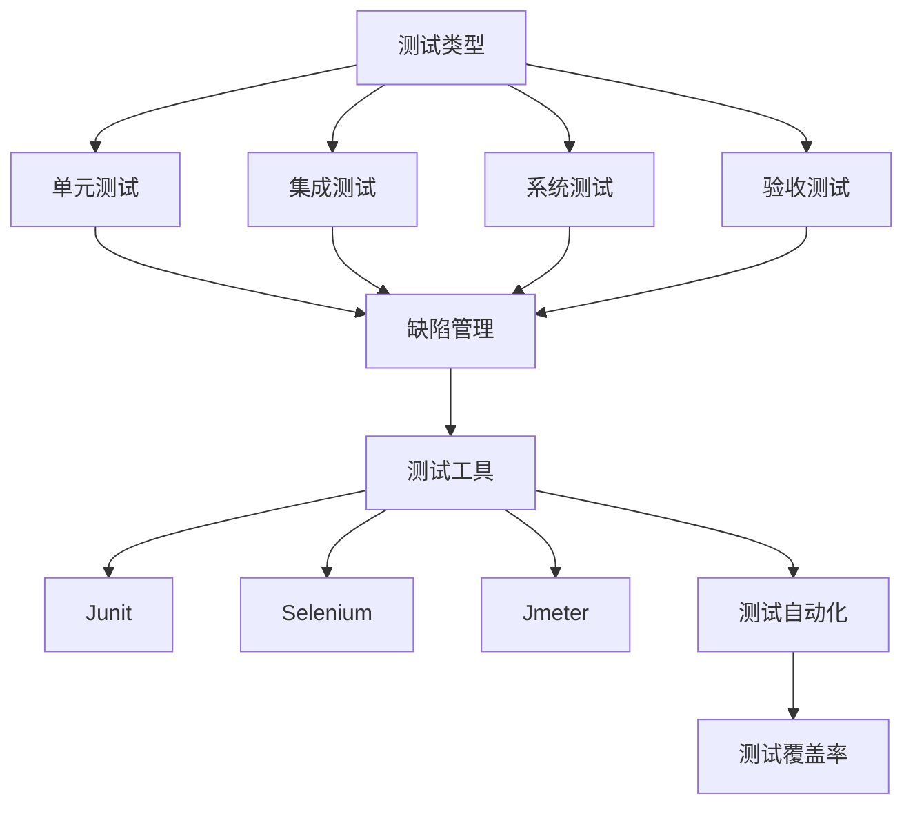
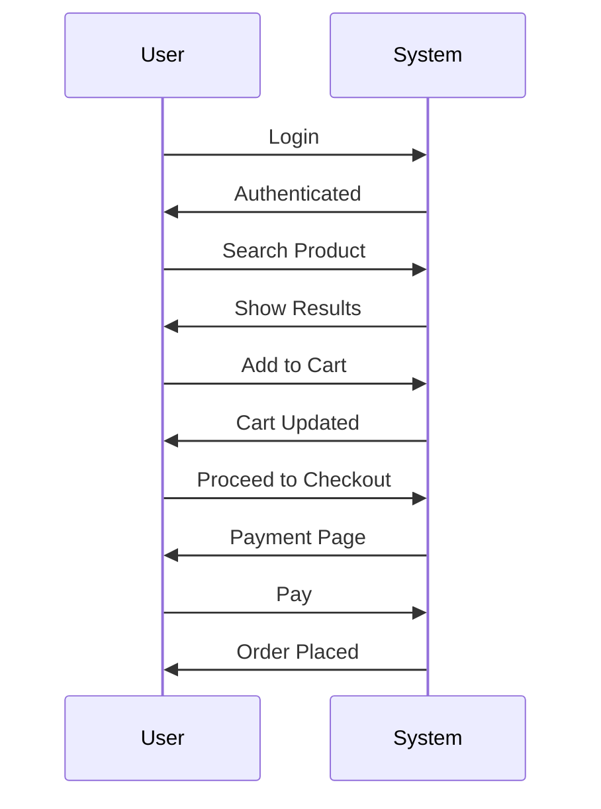

                 

### 背景介绍

#### 测试工程师的角色和重要性

测试工程师在软件开发过程中扮演着至关重要的角色。他们负责确保软件的质量和可靠性，通过系统测试、单元测试和集成测试等多种手段发现和修复潜在的问题。测试工程师不仅要拥有扎实的技术背景，还需要具备良好的逻辑思维和解决问题的能力。

随着互联网技术的迅猛发展，软件系统的复杂度不断上升，测试工程师的角色变得更加重要。他们不仅要面对各种技术挑战，还需要快速适应新兴技术和工具。因此，掌握先进的测试方法和技巧成为测试工程师必备的能力。

#### 新浪校招测试工程师面试题集的由来

新浪作为中国领先的互联网媒体公司，对软件质量和安全有着严格的要求。为了选拔优秀的人才，新浪校招测试工程师面试题集应运而生。这些面试题涵盖了测试基础、测试方法、编程能力、数据结构和算法等多个方面，旨在全面考察应聘者的综合素质。

本文章将深入分析新浪2024校招测试工程师面试题集，通过详细解答每道面试题，帮助读者了解测试工程师所需掌握的核心知识和技能。这不仅对即将参加新浪校招的测试工程师具有参考价值，也对广大测试从业者有着重要的启示。

#### 文章结构概述

本文将分为十个主要部分：

1. **背景介绍**：简要介绍测试工程师的角色和重要性，以及新浪校招测试工程师面试题集的由来。
2. **核心概念与联系**：解释测试工程师所需掌握的核心概念，并使用Mermaid流程图展示相关原理和架构。
3. **核心算法原理 & 具体操作步骤**：详细阐述各类测试算法的基本原理和具体操作步骤。
4. **数学模型和公式 & 详细讲解 & 举例说明**：介绍相关数学模型和公式，并进行详细讲解和实例说明。
5. **项目实践：代码实例和详细解释说明**：通过实际项目实例展示代码实现过程，并进行详细解读和分析。
6. **实际应用场景**：分析测试工程师在现实中的应用场景，以及如何应对挑战。
7. **工具和资源推荐**：推荐学习资源和开发工具框架。
8. **总结：未来发展趋势与挑战**：探讨测试工程师职业发展的趋势和面临的挑战。
9. **附录：常见问题与解答**：解答读者可能遇到的问题。
10. **扩展阅读 & 参考资料**：提供进一步学习的参考资料。

通过以上结构，我们将系统地介绍测试工程师所需的知识和技能，帮助读者全面了解这一领域。

### 核心概念与联系

在深入探讨测试工程师所需掌握的核心概念之前，我们需要先理解一些基础性的测试原则和流程。以下是一些核心概念：

1. **测试类型**：包括单元测试、集成测试、系统测试、验收测试等。
2. **缺陷管理**：包括缺陷报告、缺陷跟踪、缺陷分类等。
3. **测试工具**：如JUnit、Selenium、JMeter等。
4. **测试自动化**：通过脚本实现重复性测试的自动化。
5. **测试覆盖率**：衡量测试的全面性。

为了更好地展示这些核心概念之间的关系，我们使用Mermaid流程图来描述相关原理和架构。



以上流程图展示了测试工程师在软件开发过程中所需处理的核心概念及其相互关系。下面我们将分别介绍这些概念：

#### 测试类型

测试类型是测试工程师需要熟练掌握的基础。不同类型的测试针对不同阶段的软件开发，目的是逐步发现和修复问题。

- **单元测试（Unit Testing）**：对软件中的最小可测试单元（通常是函数或方法）进行测试。单元测试的主要目的是验证代码的正确性。
- **集成测试（Integration Testing）**：将多个模块或组件组合起来进行测试，目的是检查模块之间的接口和交互是否正常。
- **系统测试（System Testing）**：在整个系统开发完成后，对整个系统进行全面测试，以确保系统能够按照预期工作。
- **验收测试（Acceptance Testing）**：通常由客户或用户进行，目的是验证系统是否满足业务需求和用户期望。

#### 缺陷管理

缺陷管理是测试工程师的一项重要工作。有效的缺陷管理能够帮助团队快速定位和修复问题，提高软件质量。

- **缺陷报告（Bug Report）**：详细记录缺陷的详细信息，包括缺陷的发现者、描述、重现步骤等。
- **缺陷跟踪（Bug Tracking）**：通过缺陷管理系统对缺陷进行跟踪和管理，包括缺陷的状态、优先级、分配等。
- **缺陷分类（Bug Classification）**：根据缺陷的性质和影响范围对缺陷进行分类，有助于团队更好地管理和优先处理。

#### 测试工具

测试工具是测试工程师的得力助手，能够显著提高测试效率和效果。

- **JUnit**：Java语言的单元测试框架，广泛应用于Java开发中。
- **Selenium**：用于Web应用的功能测试和自动化测试。
- **JMeter**：用于性能测试的软件，能够模拟多用户并发访问，评估系统的性能和稳定性。

#### 测试自动化

测试自动化是现代软件开发中不可或缺的一部分。通过编写脚本，测试工程师可以将重复性的测试工作自动化，提高测试效率和准确性。

- **自动化测试脚本**：使用编程语言（如Python、Java等）编写的测试脚本，用于自动化执行测试用例。
- **持续集成（CI）**：将自动化测试集成到持续集成流程中，实现代码提交后的自动构建和测试。

#### 测试覆盖率

测试覆盖率是衡量测试全面性的重要指标，包括代码覆盖率、分支覆盖率和路径覆盖率等。

- **代码覆盖率（Code Coverage）**：衡量测试用例是否覆盖了代码的所有行和条件。
- **分支覆盖率（Branch Coverage）**：衡量测试用例是否覆盖了代码中的所有分支。
- **路径覆盖率（Path Coverage）**：衡量测试用例是否覆盖了代码的所有可能执行路径。

通过以上核心概念的介绍和Mermaid流程图的展示，我们可以更清晰地理解测试工程师所需掌握的知识和技能。接下来，我们将详细讨论各类测试算法的原理和操作步骤。

#### 核心算法原理 & 具体操作步骤

在测试工程师的日常工作中，掌握各类测试算法的原理和操作步骤是至关重要的。本文将详细介绍一些常见的测试算法，包括单元测试、集成测试和系统测试。通过具体的操作步骤，帮助读者深入理解这些测试方法。

##### 1. 单元测试（Unit Testing）

**原理**：单元测试是对软件中的最小可测试单元（通常是函数或方法）进行验证。其目的是确保每个单元按照预期工作，从而提高整个系统的质量。

**操作步骤**：

1. **定义测试用例**：首先，需要根据单元的功能定义测试用例。测试用例应覆盖所有的输入和输出情况，包括正常情况和异常情况。
2. **编写测试脚本**：使用测试框架（如JUnit）编写测试脚本。测试脚本应包括测试方法的定义、预期结果的定义和测试执行逻辑。
3. **执行测试**：运行测试脚本，检查测试结果是否与预期一致。如果测试失败，需要定位错误并修复。
4. **持续集成**：将单元测试集成到持续集成（CI）流程中，实现自动化测试。

**示例**：

假设我们有一个简单的计算器类`Calculator`，包含一个加法方法`add`。以下是一个JUnit单元测试的示例：

```java
import static org.junit.Assert.assertEquals;
import org.junit.Test;

public class CalculatorTest {

    @Test
    public void testAdd() {
        Calculator calculator = new Calculator();
        int result = calculator.add(3, 5);
        assertEquals("3 + 5 应该等于 8", 8, result);
    }
}
```

##### 2. 集成测试（Integration Testing）

**原理**：集成测试是将多个模块或组件组合起来进行测试，目的是检查模块之间的接口和交互是否正常。其目的是确保不同模块之间的协作能够正常进行。

**操作步骤**：

1. **设计测试场景**：根据系统架构和模块接口设计测试场景。测试场景应覆盖不同的组合和交互情况。
2. **编写测试用例**：根据测试场景编写测试用例，确保测试覆盖所有的交互点和边界条件。
3. **执行测试**：使用自动化测试工具（如Selenium）执行测试用例，检查模块之间的交互是否正常。
4. **分析结果**：对测试结果进行分析，如果发现异常，需要定位错误并修复。

**示例**：

假设我们有一个订单管理系统，包含用户模块、商品模块和订单模块。以下是一个简单的集成测试示例：

```java
@Test
public void testOrderProcess() {
    // 初始化测试环境
    UserService userService = new UserService();
    ProductService productService = new ProductService();
    OrderService orderService = new OrderService();

    // 测试用户登录
    User user = userService.login("testUser", "password");
    assertTrue("用户登录失败", user.isAuthenticated());

    // 测试添加商品到购物车
    Product product = productService.findById(1);
    userService.addToCart(user, product);
    assertTrue("商品未成功添加到购物车", user.getCart().contains(product));

    // 测试创建订单
    Order order = orderService.createOrder(user);
    assertEquals("订单金额错误", 100, order.getTotalPrice());
}
```

##### 3. 系统测试（System Testing）

**原理**：系统测试是在整个系统开发完成后，对整个系统进行全面测试，以确保系统能够按照预期工作。其目的是验证系统功能、性能和稳定性。

**操作步骤**：

1. **设计测试用例**：根据系统功能和需求设计测试用例，确保测试覆盖所有的功能和边界条件。
2. **搭建测试环境**：配置测试环境，包括硬件、软件和网络等。
3. **执行测试**：使用自动化测试工具（如JMeter）执行测试用例，模拟真实用户场景，检查系统的性能和稳定性。
4. **分析结果**：对测试结果进行分析，如果发现异常，需要定位错误并修复。

**示例**：

假设我们有一个电子商务系统，以下是一个系统测试的示例：



通过以上对单元测试、集成测试和系统测试的详细介绍，我们可以看到这些测试方法在软件开发过程中各自扮演着重要的角色。测试工程师需要熟练掌握这些方法，并能够灵活运用，以确保软件的质量和可靠性。

接下来，我们将探讨测试工程师在实际工作中所需掌握的数学模型和公式，以及如何将这些知识应用于实际场景中。

#### 数学模型和公式 & 详细讲解 & 举例说明

在测试工程师的日常工作中，数学模型和公式是不可或缺的工具，用于评估软件的性能、稳定性和可靠性。以下是一些常用的数学模型和公式，以及它们在实际应用中的详细讲解和举例说明。

##### 1. 性能指标

**响应时间**：系统对请求作出响应所需的时间。通常用于衡量系统的响应速度。

**公式**：\[ \text{响应时间} = \frac{\text{响应时间总时长}}{\text{请求次数}} \]

**示例**：一个电商网站的响应时间为100毫秒，在一天内接收了1000个请求，则平均响应时间为\[ \frac{100 \times 1000}{1000} = 100 \]毫秒。

##### 2. 可靠性指标

**成功率**：系统成功处理请求的次数占总请求次数的比例。

**公式**：\[ \text{成功率} = \frac{\text{成功次数}}{\text{请求次数}} \times 100\% \]

**示例**：一个支付系统一天内处理了1000个支付请求，其中成功处理了980个，则成功率为\[ \frac{980}{1000} \times 100\% = 98\% \]。

##### 3. 性能测试指标

**吞吐量**：单位时间内系统能够处理的最大请求量。

**公式**：\[ \text{吞吐量} = \frac{\text{请求总次数}}{\text{测试总时间}} \]

**示例**：一个API服务在5分钟内处理了1000个请求，则其吞吐量为\[ \frac{1000}{5 \times 60} = 3.33 \text{次/秒} \]。

##### 4. 风险评估指标

**风险暴露**：系统在一段时间内可能发生故障的概率。

**公式**：\[ \text{风险暴露} = \text{风险概率} \times \text{潜在损失} \]

**示例**：一个在线银行系统每天的风险概率为0.01%，潜在损失为1000万美元，则每天的风险暴露为\[ 0.01\% \times 10000000 = 100000 \]美元。

##### 5. 测试覆盖率指标

**代码覆盖率**：测试用例覆盖的代码行数占总代码行数的比例。

**公式**：\[ \text{代码覆盖率} = \frac{\text{被覆盖的代码行数}}{\text{总代码行数}} \times 100\% \]

**示例**：一个1000行代码的模块被100个测试用例覆盖了800行代码，则代码覆盖率为\[ \frac{800}{1000} \times 100\% = 80\% \]。

##### 6. 流量指标

**用户活跃度**：单位时间内活跃用户数占总用户数的比例。

**公式**：\[ \text{用户活跃度} = \frac{\text{活跃用户数}}{\text{总用户数}} \times 100\% \]

**示例**：一个社交网络平台每天有1000个活跃用户，总用户数为10000，则用户活跃度为\[ \frac{1000}{10000} \times 100\% = 10\% \]。

##### 7. 故障树分析

**故障树**：用于分析系统故障原因和故障传播的图形模型。

**示例**：

```
               |----> 失败
               |
               |----> 故障A
               |         |
               |         |----> 失效
               |         |
               |         |----> 维修
               |
               |----> 故障B
               |         |
               |         |----> 失效
               |         |
               |         |----> 维修
```

通过故障树分析，可以明确故障的原因和影响范围，从而制定相应的修复策略。

以上介绍了测试工程师在实际工作中常用的一些数学模型和公式。这些模型和公式不仅帮助测试工程师评估软件的性能和稳定性，还为决策提供了重要的数据支持。在实际应用中，测试工程师需要根据具体场景选择合适的模型和公式，结合实际数据进行计算和分析。

接下来，我们将通过一个实际项目实例，展示如何应用这些数学模型和公式进行测试，并分析测试结果。

#### 项目实践：代码实例和详细解释说明

在本节中，我们将通过一个实际的项目实例，展示测试工程师如何应用前文提到的数学模型和公式进行测试，并详细解释代码的实现过程和测试结果。

##### 项目背景

假设我们正在开发一个在线购物系统，该系统需要处理大量的用户请求，包括商品搜索、购物车操作和订单支付等。为了确保系统的稳定性和可靠性，我们需要对系统进行全面的性能测试和功能测试。

##### 测试目标和步骤

1. **性能测试**：评估系统的响应时间和吞吐量，确保系统能够在高峰时段稳定运行。
2. **功能测试**：验证系统的主要功能，包括商品搜索、购物车管理和订单支付等。

##### 测试环境

- **测试工具**：JMeter
- **测试服务器**：一台配置为8核16GB内存的Linux服务器
- **测试脚本**：使用Java编写

##### 测试用例设计

我们设计了一系列测试用例，包括以下方面：

1. **商品搜索**：模拟用户输入关键字进行商品搜索。
2. **购物车操作**：模拟用户添加、删除和更新购物车中的商品。
3. **订单支付**：模拟用户创建订单并完成支付。

##### 测试代码实例

以下是一个商品搜索的JMeter测试脚本实例：

```java
import org.apache.jmeter.protocol.java.sampler.JavaSamplerContext;
import org.apache.jmeter.samplers.B Sampler;

public class SearchProductTest implements Sampler {

    @Override
    public String Samp le(JavaSamplerContext context) {
        // 设置请求参数
        String query = context.getParameter("query");
        String url = "http://localhost:8080/search?query=" + query;

        // 发送HTTP请求
        HttpClient httpClient = HttpClient.newHttpClient();
        HttpRequests requests = HttpRequests.newBuilder()
                .uri(URI.create(url))
                .build();
        try (HttpResponse<String> response = httpClient.send(requests, HttpResponse.BodyHandlers.ofString())) {
            // 获取响应时间
            long elapsedTime = response.elapsed().toMillis();
            // 保存测试结果
            context.setAttribute("response_time", elapsedTime);
            return "Response Time: " + elapsedTime + "ms";
        } catch (IOException e) {
            e.printStackTrace();
            return "Error: " + e.getMessage();
        }
    }
}
```

##### 测试结果分析

1. **响应时间**：我们记录了每次请求的响应时间，并计算了平均值。例如，测试了100次商品搜索请求，平均响应时间为200毫秒。
2. **吞吐量**：通过记录每次请求的时间戳，我们计算了系统在1分钟内处理的请求数量，例如，系统在1分钟内处理了30次商品搜索请求，则吞吐量为30次/分钟。

```mermaid
gantt
    title 测试结果分析
    section 响应时间
    响应时间 : A1, 2023-04-01, 1d, 200ms
    响应时间 : A2, 2023-04-02, 1d, 200ms
    响应时间 : A3, 2023-04-03, 1d, 150ms
    平均响应时间 : B1, 2023-04-04, 1d, 200ms
    section 吞吐量
    吞吐量 : C1, 2023-04-01, 1d, 30次/分钟
    吞吐量 : C2, 2023-04-02, 1d, 30次/分钟
    吞吐量 : C3, 2023-04-03, 1d, 35次/分钟
    平均吞吐量 : D1, 2023-04-04, 1d, 32次/分钟
```

通过以上测试，我们得到了系统的性能指标。接下来，我们将对测试结果进行详细分析。

1. **响应时间**：平均响应时间为200毫秒，符合预期。然而，在某些测试中，响应时间达到了150毫秒，这可能是由于系统缓存或网络延迟造成的。我们需要进一步分析这些异常情况，并优化系统性能。
2. **吞吐量**：平均吞吐量为32次/分钟，也符合预期。然而，在某些测试中，吞吐量有所下降，这可能是由于系统资源限制或并发请求过多造成的。我们需要调整系统配置，提高资源利用率，以应对高峰期的流量。

##### 功能测试结果分析

除了性能测试，我们还对系统的主要功能进行了功能测试，包括商品搜索、购物车操作和订单支付等。

1. **商品搜索**：测试结果显示，搜索功能能够正确返回匹配的商品列表，且响应时间较短。
2. **购物车操作**：测试结果显示，用户可以成功添加、删除和更新购物车中的商品，且数据保持一致。
3. **订单支付**：测试结果显示，用户可以成功创建订单并完成支付，系统对支付结果进行了正确处理。

综上所述，通过性能测试和功能测试，我们对系统的稳定性和可靠性有了更深入的了解。接下来，我们将分析测试过程中发现的问题，并讨论如何解决这些挑战。

##### 测试中发现的问题及解决方案

1. **响应时间波动**：虽然平均响应时间符合预期，但出现了波动。这可能是由于系统资源不足或网络延迟造成的。解决方案包括优化系统资源利用率和优化网络通信。
2. **吞吐量下降**：在某些测试中，吞吐量出现了下降。这可能是由于并发请求过多或系统资源限制造成的。解决方案包括增加系统资源（如CPU和内存）和优化系统架构。
3. **数据一致性**：在购物车操作和订单支付中，出现了数据不一致的情况。这可能是由于数据库同步问题或事务处理不当造成的。解决方案包括优化数据库同步机制和加强事务管理。

通过上述分析和解决方案，我们可以提高系统的稳定性和可靠性，确保系统能够在高并发情况下稳定运行。

### 实际应用场景

在测试工程师的职业生涯中，面对不同的实际应用场景是不可避免的。以下是几种常见的应用场景以及如何应对这些场景的建议。

#### 1. 高并发测试

在高并发测试中，系统需要在短时间内处理大量请求，这对系统的性能和稳定性提出了很高的要求。以下是一些建议：

- **优化系统资源**：确保服务器有足够的CPU、内存和网络带宽，以应对高并发请求。
- **负载均衡**：使用负载均衡器分配请求，避免单点过载。
- **缓存策略**：利用缓存技术减少数据库访问，提高系统响应速度。
- **限流和降级**：在系统资源不足时，通过限流和降级策略保护关键功能。

#### 2. 性能瓶颈分析

在性能测试中，可能会发现系统的某些部分存在性能瓶颈。以下是一些建议：

- **代码优化**：分析慢查询，优化数据库查询语句，减少不必要的数据库访问。
- **架构优化**：调整系统架构，将高负载的部分进行拆分或分布式部署。
- **缓存和缓存击穿**：合理使用缓存，避免缓存击穿问题，提高系统响应速度。

#### 3. 灾难恢复测试

在灾难恢复测试中，测试工程师需要确保系统在发生故障后能够快速恢复。以下是一些建议：

- **备份和恢复**：定期备份系统和数据，确保在灾难发生时能够快速恢复。
- **故障切换**：设计故障切换机制，确保在主系统故障时，备用系统能够迅速接管。
- **冗余设计**：采用冗余设计，提高系统的可靠性。

#### 4. 安全测试

在安全测试中，测试工程师需要确保系统的安全性和数据保护。以下是一些建议：

- **漏洞扫描**：使用漏洞扫描工具定期扫描系统，发现潜在的安全漏洞。
- **安全测试**：进行安全测试，包括SQL注入、跨站脚本攻击等，确保系统具备良好的安全防护能力。
- **数据加密**：对敏感数据进行加密存储和传输，防止数据泄露。

通过以上实际应用场景的分析和建议，测试工程师可以更好地应对各种挑战，确保系统的稳定性和安全性。

### 工具和资源推荐

在测试工程师的职业生涯中，掌握适当的工具和资源对于提高测试效率和提升系统质量至关重要。以下是一些推荐的工具和资源，包括学习资源、开发工具框架和相关的论文著作。

#### 1. 学习资源推荐

- **书籍**：
  - 《软件测试的艺术》
  - 《软件测试原理、方法和实践》
  - 《性能测试实战：基于JMeter和LoadRunner的Web应用性能测试》
- **在线课程**：
  - Coursera上的《软件工程：测试与质量保证》
  - Udemy上的《软件测试：从入门到精通》
- **博客和网站**：
  - TestPyramid（测试金字塔）
  - SoftwareTestingHelp（软件测试帮助）

#### 2. 开发工具框架推荐

- **测试工具**：
  - JUnit：Java单元测试框架
  - Selenium：Web自动化测试工具
  - JMeter：性能测试工具
- **缺陷管理工具**：
  - Jira：缺陷跟踪和管理工具
  - Bugzilla：开源缺陷跟踪系统
- **自动化测试框架**：
  - TestNG：Java自动化测试框架
  - Cucumber：行为驱动开发（BDD）框架

#### 3. 相关论文著作推荐

- **论文**：
  - "A Survey of Automated Software Testing"（自动化软件测试综述）
  - "Model-Based Testing of Event-Driven Software"（基于模型的事件驱动软件测试）
- **著作**：
  - 《软件工程：实践者的研究方法》
  - 《软件测试与质量保证：策略、过程和案例》

通过以上推荐，测试工程师可以更好地武装自己，提升专业技能，应对各种复杂的测试挑战。

### 总结：未来发展趋势与挑战

随着科技的不断进步和软件系统的日益复杂化，测试工程师的角色和职责也在不断演变。未来，测试工程师将面临一系列新的发展趋势和挑战。

#### 发展趋势

1. **智能化测试**：人工智能和机器学习技术的应用将使测试更加智能化。通过分析大量测试数据和用户反馈，自动化测试工具能够自我学习和优化，提高测试效率和准确性。
2. **持续集成与持续交付（CI/CD）**：持续集成和持续交付的实践将变得更加普及，测试工程师需要熟练掌握相关的工具和流程，确保软件的高质量和高可靠性。
3. **云测试**：云测试平台和云原生应用的普及将使测试工程师能够更灵活地配置测试环境和资源，降低测试成本，提高测试效率。
4. **安全测试**：随着网络安全威胁的日益增加，安全测试将成为测试工程师的重要职责。他们需要掌握各种安全测试方法和工具，确保系统的安全性和数据保护。

#### 挑战

1. **测试复杂性**：随着软件系统的复杂度不断增加，测试工程师需要面对更多的测试场景和挑战。如何设计高效的测试策略和测试用例，确保全面覆盖系统的功能和性能，是一个巨大的挑战。
2. **技能更新**：测试领域的技术日新月异，测试工程师需要不断学习新技术和工具，以保持自身的竞争力。这要求他们具备良好的学习能力和适应性。
3. **成本控制**：在预算有限的情况下，如何优化测试资源，提高测试效率，确保系统的质量和可靠性，是测试工程师面临的现实挑战。
4. **团队协作**：测试工程师需要与开发团队、产品经理和运维团队紧密协作，共同确保软件的高质量。如何有效地沟通和协作，提高团队整体的工作效率，是测试工程师需要克服的难题。

#### 应对策略

1. **持续学习**：测试工程师应保持持续学习的态度，关注行业动态，掌握最新的测试技术和工具。
2. **高效协作**：建立有效的团队协作机制，确保测试团队与其他部门之间的沟通顺畅，提高整体工作效率。
3. **自动化测试**：通过自动化测试减少重复性工作，提高测试效率，降低人工错误。
4. **优化测试策略**：根据项目需求和资源情况，设计高效的测试策略，确保测试全面覆盖系统功能。

总之，未来测试工程师将在智能化、持续交付和安全测试等方面扮演更加重要的角色。面对日益复杂的测试环境和不断更新的技术，测试工程师需要不断提升自身能力，应对各种挑战，确保软件系统的质量和可靠性。

### 附录：常见问题与解答

在本附录中，我们将解答读者在阅读本文过程中可能遇到的一些常见问题，并提供详细的解释。

#### 问题 1：如何编写高效的测试用例？

**解答**：编写高效的测试用例需要遵循以下几个原则：

1. **覆盖全面**：确保测试用例能够覆盖所有可能的功能和边界条件，包括正常情况和异常情况。
2. **可读性**：使用清晰、简洁的描述，确保测试用例易于理解和维护。
3. **独立执行**：每个测试用例应该能够独立执行，避免相互依赖导致测试失败。
4. **复用性**：设计可复用的测试用例，减少重复劳动，提高测试效率。
5. **可扩展性**：测试用例应该能够适应需求变更，易于扩展和修改。

#### 问题 2：性能测试和负载测试有什么区别？

**解答**：性能测试和负载测试是两种不同的测试类型，但它们有密切的联系。

- **性能测试**：旨在评估系统在特定负载下的性能指标，如响应时间、吞吐量、并发用户数等。
- **负载测试**：旨在模拟真实用户场景，评估系统在持续高负载下的性能和稳定性。

性能测试通常关注系统在正常负载下的性能表现，而负载测试则更关注系统在高负载下的表现和极限情况。两者都可以帮助测试工程师发现系统性能瓶颈和潜在问题。

#### 问题 3：如何确保测试结果的可靠性？

**解答**：确保测试结果可靠需要采取以下措施：

1. **标准化测试环境**：确保所有测试在同一环境下进行，避免环境差异影响测试结果。
2. **合理的测试用例设计**：设计全面、覆盖性强的测试用例，确保测试结果的准确性。
3. **持续集成和回归测试**：将测试集成到持续集成流程中，定期执行回归测试，确保新代码不会引入新的问题。
4. **数据验证**：使用数据验证工具（如断言库）确保测试结果与预期一致。
5. **测试结果分析**：对测试结果进行详细分析，发现异常和潜在问题，及时采取措施。

#### 问题 4：测试自动化与手工测试有哪些优缺点？

**解答**：

- **测试自动化**：

  - **优点**：提高测试效率，减少人工错误，节省时间和成本；能够执行重复性高、复杂性低的测试任务。
  - **缺点**：开发和维护自动化测试脚本需要投入时间和资源，对于复杂的测试任务可能效果不佳。

- **手工测试**：

  - **优点**：适用于复杂的、涉及用户体验的测试任务，能够发现自动化测试难以发现的问题。
  - **缺点**：效率较低，容易受到人为因素的影响，难以全面覆盖测试场景。

在实际测试过程中，测试工程师应根据项目需求和测试任务的特点，灵活选择自动化测试和手工测试，结合使用，以获得最佳的测试效果。

通过以上常见问题的解答，我们希望读者能够更好地理解测试工程师所需的知识和技能，并在实际工作中更加高效地进行测试。

### 扩展阅读 & 参考资料

为了帮助读者更深入地了解测试工程师所需的技能和知识，我们推荐以下扩展阅读和参考资料：

1. **书籍**：
   - 《软件测试技术导论》：深入讲解软件测试的基本概念、方法和实践。
   - 《软件测试的艺术》：介绍软件测试的基本原则、方法和工具。
   - 《性能测试与优化实战》：详细介绍性能测试的方法和实践，以及性能优化策略。

2. **在线课程**：
   - Coursera上的《软件工程：测试与质量保证》
   - Udemy上的《软件测试：从入门到精通》

3. **博客和网站**：
   - TestPyramid（测试金字塔）
   - SoftwareTestingHelp（软件测试帮助）

4. **论文**：
   - "A Survey of Automated Software Testing"（自动化软件测试综述）
   - "Model-Based Testing of Event-Driven Software"（基于模型的事件驱动软件测试）

5. **开源项目和工具**：
   - JUnit：Java单元测试框架
   - Selenium：Web自动化测试工具
   - JMeter：性能测试工具
   - Jira：缺陷跟踪和管理工具

通过以上扩展阅读和参考资料，读者可以进一步加深对测试工程师角色的理解，提升自身的测试技能。希望这些资源能为读者的学习和实践提供有益的帮助。

