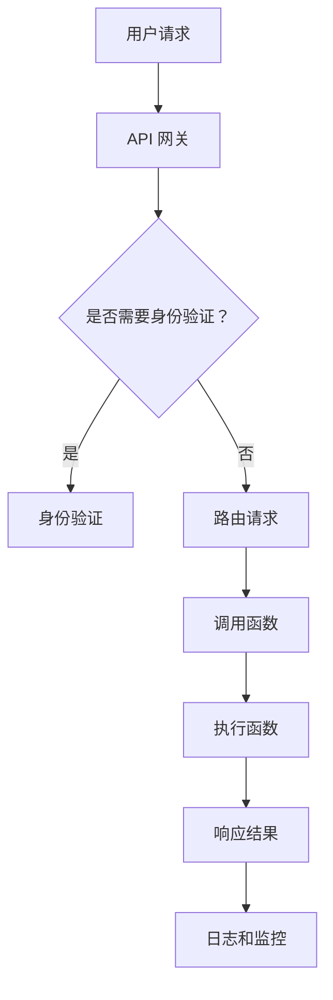

                 

### 背景介绍

#### 无服务器计算的起源与发展

无服务器计算（Serverless Computing）作为一种新兴的计算模型，起源于对云计算的进一步创新。其核心理念是将传统云计算中的服务器管理和运维负担转嫁给云服务提供商，使开发人员能够专注于业务逻辑的实现，而非基础设施的管理。这种理念的提出，可以追溯到2009年亚马逊公司推出的SimpleDB服务，随后在2011年推出的AWS Lambda服务更是将无服务器计算推向了市场。

无服务器计算的快速发展得益于几个关键因素。首先，随着互联网和移动设备的普及，用户对应用的可扩展性和响应速度要求越来越高。传统的云计算模式需要开发者手动管理服务器，这在应对突发流量时往往显得力不从心。而无服务器计算通过自动伸缩，可以迅速应对流量的变化，从而保证服务的稳定性和性能。其次，随着微服务架构和容器技术的流行，无服务器计算作为一种天然支持微服务架构的计算模式，能够更好地适应现代应用的开发和部署需求。最后，无服务器计算降低了开发门槛，使得更多非专业开发者能够轻松上手，加速了技术的普及。

#### 创业公司面临的挑战与需求

对于创业公司来说，选择合适的计算模型至关重要。传统的云计算模式需要大量的人力、物力和财力投入在服务器管理和运维上，这对初创公司来说是一个巨大的负担。而随着业务的发展，服务器资源的扩展和管理也变得更加复杂。因此，无服务器计算为创业公司提供了一个更为灵活和高效的解决方案。

首先，无服务器计算可以显著降低初创公司的IT成本。由于云服务提供商负责基础设施的管理和维护，创业公司无需购买和维护昂贵的硬件设备，也无需投入大量资源进行服务器运维。这使得初创公司能够将更多的资金和精力投入到产品研发和市场推广上，从而加速业务的发展。

其次，无服务器计算提供了更好的可扩展性。随着用户规模的增加，创业公司的应用需要能够迅速扩展以应对更高的负载。无服务器计算平台可以通过自动伸缩，无需开发者手动干预，即可实现计算资源的动态调整，从而确保服务的稳定性和高性能。

最后，无服务器计算还提供了更高的开发效率。在无服务器环境中，开发者无需关注底层基础设施的细节，可以专注于业务逻辑的实现。此外，无服务器计算支持丰富的编程模型和开发语言，使得开发者可以根据具体需求选择最适合的工具和框架，进一步提高开发效率。

#### 无服务器计算在创业公司中的应用现状

目前，越来越多的创业公司开始采用无服务器计算，以应对业务发展的需求。例如，许多初创公司在搭建后端服务时，会选择使用AWS Lambda、Azure Functions或Google Cloud Functions等无服务器计算平台。这些平台提供了便捷的编程模型和强大的生态系统，使得开发者能够快速搭建和部署应用。

此外，无服务器计算还被广泛应用于实时数据处理、物联网、移动应用等多个领域。例如，在实时数据处理方面，创业公司可以使用无服务器计算平台进行数据收集、处理和分析，从而实现实时决策和业务优化。在物联网领域，无服务器计算可以用于处理大量设备的连接和数据传输，提高系统的可靠性和响应速度。在移动应用领域，无服务器计算可以提供高效的云后端服务，支持移动应用的扩展和功能增强。

总之，无服务器计算为创业公司提供了一个灵活、高效和低成本的解决方案，有助于提升业务竞争力，加快市场拓展速度。随着技术的不断成熟和普及，未来无服务器计算在创业领域的应用将会更加广泛和深入。

---

在接下来的章节中，我们将进一步探讨无服务器计算的核心概念和架构，以及其在创业公司中的应用场景。通过逐步分析推理，我们将深入了解无服务器计算的优势和挑战，为创业公司提供实用的指导和建议。

---

### 核心概念与联系

#### 无服务器计算的核心概念

无服务器计算（Serverless Computing）是一种云计算模型，它允许开发者运行和部署代码而无需管理底层服务器。在这个模型中，云服务提供商负责处理基础设施的分配、扩展和管理，开发者则专注于编写和部署应用程序代码。

无服务器计算的核心概念包括以下几方面：

1. **函数即服务（Function as a Service, FaaS）**：FaaS 是无服务器计算的主要形式，它将应用程序功能划分为独立的函数，这些函数在事件触发时执行。开发者无需关心底层基础设施，只需编写和部署代码即可。

2. **后端即服务（Backend as a Service, BaaS）**：BaaS 提供了一种无需管理后端服务的云计算服务，通常包括用户认证、数据库管理、消息队列等功能。开发者可以使用这些服务来简化应用程序的后端开发。

3. **平台即服务（Platform as a Service, PaaS）**：虽然 PaaS 通常不被严格归类为无服务器计算，但它提供了一定程度的自动化服务器管理，使得开发者无需直接管理底层硬件。

4. **无服务器架构**：无服务器架构利用无服务器计算服务构建应用，通常包括事件驱动、微服务架构、容器编排等技术，以提高应用的灵活性和可扩展性。

#### 无服务器计算的优势

无服务器计算具有以下显著优势：

1. **成本节约**：无服务器计算按需计费，开发者只需为实际使用的计算资源付费，无需担心闲置资源的费用。

2. **可扩展性**：无服务器计算服务能够自动扩展，以应对流量的变化，确保应用在高负载下的稳定运行。

3. **简化的运维**：开发者无需管理底层基础设施，可以专注于应用开发和业务逻辑。

4. **高可用性**：无服务器计算服务通常提供高可用性保障，确保应用在发生故障时能够快速恢复。

#### 无服务器计算的架构

无服务器计算的架构通常包括以下几个关键组成部分：

1. **函数执行环境**：这是运行代码的虚拟环境，例如 AWS Lambda、Azure Functions 或 Google Cloud Functions。

2. **触发器**：触发器是启动函数的事件源，可以是定时任务、Web 挂钩、数据库更改等。

3. **API 网关**：API 网关是外部访问应用的入口，可以处理 HTTP 请求并将其路由到相应的函数。

4. **存储服务**：用于存储函数的代码、配置数据和函数执行结果，如 Amazon S3、Azure Blob Storage 等。

5. **监控和日志**：用于跟踪函数的执行情况、性能指标和日志记录，如 Amazon CloudWatch、Azure Monitor 等。

#### 无服务器计算的生态系统

无服务器计算生态系统包括以下工具和平台：

1. **主流无服务器计算平台**：如 AWS Lambda、Azure Functions、Google Cloud Functions 等。

2. **无服务器框架和工具**：如 Serverless Framework、OpenFaaS、Lambda-Proxy 等。

3. **后端即服务（BaaS）平台**：如 Firebase、AWS Amplify、Azure App Service 等。

4. **集成开发环境（IDE）和支持工具**：如 AWS Cloud9、Azure Cloud Shell、Google Cloud Shell 等。

### Mermaid 流程图

为了更好地理解无服务器计算的架构，下面是一个简化的 Mermaid 流程图，展示了无服务器计算的基本组件和流程：



- **用户请求**：用户通过 API 网关发送请求。
- **身份验证**：如果需要，请求将首先通过身份验证。
- **路由请求**：API 网关将请求路由到相应的函数。
- **执行函数**：函数执行业务逻辑并返回结果。
- **日志和监控**：执行结果和性能指标将被记录和监控。

通过这个流程图，我们可以清晰地看到无服务器计算的关键组件和执行流程，有助于我们更好地理解和应用这一技术。

---

在下一章节，我们将进一步探讨无服务器计算的具体原理和操作步骤，通过逐步分析推理，我们将深入理解无服务器计算的内部工作机制和实际应用场景。

---

### 核心算法原理 & 具体操作步骤

#### 无服务器计算的内部工作机制

无服务器计算的内部工作机制可以概括为以下几个方面：

1. **事件驱动**：无服务器计算是基于事件驱动的，即函数在接收到特定事件时才会执行。这些事件可以是定时任务、Web 挂钩、数据库更改等。

2. **按需实例化**：当事件发生时，无服务器计算平台会自动创建函数实例，并在执行完毕后销毁。这种按需实例化的机制可以节省资源并降低成本。

3. **自动扩展**：无服务器计算平台会根据实际负载自动调整函数实例的数量，以确保在高负载下保持高性能。

4. **状态管理**：无服务器函数通常不支持长期状态管理，因为实例在执行完毕后会被销毁。因此，开发者需要采用其他机制，如临时存储或分布式缓存，来管理函数的状态。

#### 无服务器函数的执行流程

无服务器函数的执行流程主要包括以下几个步骤：

1. **触发事件**：当发生特定事件时，如定时任务触发器或Web请求到达，触发器将启动函数执行。

2. **函数实例化**：无服务器计算平台会创建一个新的函数实例，并加载相应的代码和依赖。

3. **执行函数**：函数实例执行业务逻辑，并可能访问外部存储和数据库服务。

4. **返回结果**：函数执行完毕后，返回结果给调用者。

5. **销毁实例**：函数实例在执行完毕后将被销毁，释放资源。

#### 编写和部署无服务器函数的具体步骤

下面我们以 AWS Lambda 为例，详细讲解如何编写和部署无服务器函数。

##### 步骤 1：创建 AWS Lambda 函数

1. 访问 AWS Management Console，搜索并点击“Lambda”服务。
2. 点击“创建函数”按钮，选择“作者：禅与计算机程序设计艺术”的模板，然后输入函数名称。
3. 选择运行时间环境（如 Node.js 或 Python），并设置内存和超时时间。

##### 步骤 2：编写函数代码

在创建的 Lambda 函数中，我们可以使用集成开发环境（IDE）或在线代码编辑器编写函数代码。以下是一个简单的 Node.js Lambda 函数示例：

```javascript
exports.handler = async (event) => {
    let response;
    if (event.stage === 'pro') {
        response = "Hello, Pro!";
    } else {
        response = "Hello, Guest!";
    }
    return {
        statusCode: 200,
        body: JSON.stringify(response),
    };
};
```

这个函数根据事件中的 `stage` 属性返回不同的字符串。

##### 步骤 3：部署函数

1. 在 Lambda 函数控制台，点击“部署”按钮，选择存储桶和文件。
2. 上传编写的函数代码，然后配置触发器。

我们可以在 AWS S3 存储桶中上传函数代码，并将其配置为 Lambda 函数的触发器。

##### 步骤 4：测试函数

1. 在 Lambda 函数控制台，点击“测试”按钮。
2. 在测试事件中输入测试数据，如 JSON 对象。
3. 点击“测试”按钮，查看函数的输出结果。

测试结果将显示在控制台中，我们可以根据输出结果验证函数的正确性。

##### 步骤 5：监控和日志

1. 使用 AWS CloudWatch 监控 Lambda 函数的性能和日志。
2. 查看日志流和性能指标，如 CPU 使用率、内存使用量、错误率等。

通过 AWS CloudWatch，我们可以实时监控 Lambda 函数的执行情况，确保应用的稳定性和性能。

---

通过以上步骤，我们详细讲解了如何编写和部署无服务器函数。在实际应用中，开发者可以根据具体需求灵活调整函数代码和配置。无服务器计算通过简化开发和部署流程，大大提高了开发效率，为创业公司提供了强大的技术支持。

---

在下一章节，我们将进一步探讨无服务器计算中的数学模型和公式，通过详细的讲解和举例说明，帮助读者深入理解无服务器计算的内部机制和应用技巧。

---

### 数学模型和公式 & 详细讲解 & 举例说明

#### 无服务器计算的数学模型

无服务器计算的数学模型主要涉及计算资源的费用模型和性能模型。以下是一些关键的数学模型和公式：

##### 1. 计算资源费用模型

无服务器计算的费用通常由以下几个部分组成：

1. **计算费用**：根据函数的运行时间和内存大小进行计费。常见的费用模型包括：
   - **运行时间（Minutes of Compute Time）**：函数执行的总分钟数。
   - **内存大小（Memory Size）**：分配给函数的内存大小（通常以 MB 计），内存越大，费用越高。

   计算费用可以通过以下公式计算：

   \[
   \text{计算费用} = (\text{运行时间} \times \text{内存价格}) + (\text{超出基础内存的额外费用})
   \]

   例如，假设一个函数运行了 100 分钟，分配了 1024 MB 的内存，内存价格为 $0.00001667/MB，超出的 128 MB 内存价格为 $0.00002083/MB。则计算费用为：

   \[
   \text{计算费用} = (100 \times 0.00001667) + ((1024 - 1024) \times 0.00002083) = $1.667 + $0 = $1.667
   \]

2. **超时费用**：如果函数因运行超时而未完成，则可能产生额外的超时费用。

   超时费用的计算公式为：

   \[
   \text{超时费用} = (\text{超时时长} \times \text{超时价格}) + (\text{超出基础时间的额外费用})
   \]

##### 2. 性能模型

无服务器计算的性能模型主要涉及函数的响应时间和可扩展性。以下是一些关键性能指标和公式：

1. **响应时间**：函数从接收到请求到返回响应所需的时间。

   响应时间可以通过以下公式计算：

   \[
   \text{响应时间} = (\text{网络延迟}) + (\text{函数执行时间}) + (\text{数据传输时间})
   \]

   其中，网络延迟是指从客户端到函数执行环境的传输时间，函数执行时间是指函数代码的执行时间，数据传输时间是指响应数据从函数返回到客户端的时间。

2. **可扩展性**：函数能够根据负载自动调整实例数量，以保持高性能。

   可扩展性可以通过以下公式评估：

   \[
   \text{可扩展性} = \frac{\text{最大实例数}}{\text{最小实例数}} \times \text{实例调整时间}
   \]

   其中，最大实例数是指在高负载下函数可达到的最大实例数量，最小实例数是指在低负载下函数保留的最小实例数量，实例调整时间是指平台从检测到负载变化到调整实例数量所需的时间。

#### 举例说明

假设一个创业公司需要开发一个处理大量数据的后台服务，该服务需要处理来自不同来源的数据，并对数据进行清洗、转换和存储。公司决定使用 AWS Lambda 来实现这个服务，并希望在这个场景中最大化利用无服务器计算的优势。

##### 1. 费用模型分析

- **计算费用**：该服务预计每天运行 10 小时，分配 1024 MB 的内存。内存价格为 $0.00001667/MB，超出的 128 MB 内存价格为 $0.00002083/MB。则每月的计算费用为：

  \[
  \text{计算费用} = (10 \times 30 \times 0.00001667) + ((1024 - 1024) \times 0.00002083) = $4.995 + $0 = $4.995
  \]

- **超时费用**：假设函数的最大运行时间为 15 分钟，每月有 1% 的函数运行超时，超时价格为 $0.00001/分钟。则每月的超时费用为：

  \[
  \text{超时费用} = (10 \times 30 \times 0.00001) = $0.3
  \]

##### 2. 性能模型分析

- **响应时间**：假设网络延迟为 100 毫秒，函数执行时间为 2 秒，数据传输时间为 200 毫秒。则函数的响应时间为：

  \[
  \text{响应时间} = 100 + 2 + 200 = 400 \text{ 毫秒}
  \]

- **可扩展性**：假设在高负载下，函数可以扩展到 10 个实例，在低负载下保留 1 个实例，实例调整时间为 30 秒。则函数的可扩展性为：

  \[
  \text{可扩展性} = \frac{10}{1} \times 30 = 300
  \]

通过以上分析和计算，创业公司可以更好地了解如何利用无服务器计算来实现后台服务，并优化费用和性能。无服务器计算的数学模型和公式为我们提供了量化的方法，帮助我们评估和优化无服务器应用。

---

在下一章节，我们将通过具体的代码实例和详细解释说明，展示如何在实际项目中应用无服务器计算，并进一步探讨其优势和应用场景。

---

### 项目实践：代码实例和详细解释说明

#### 开发环境搭建

在实际应用无服务器计算之前，我们需要搭建一个适合开发和测试的开发环境。以下是在 AWS Lambda 上搭建开发环境的步骤：

1. **安装 AWS CLI**：
   首先，我们需要在本地计算机上安装 AWS 命令行界面（AWS CLI）。访问 [AWS CLI 官方文档](https://docs.aws.amazon.com/cli/latest/userguide/cli-chap-install.html)，按照指引进行安装。

2. **配置 AWS CLI**：
   安装 AWS CLI 后，我们需要配置 AWS CLI，以便使用 AWS 服务。运行以下命令配置 AWS CLI：

   ```bash
   aws configure
   ```

   按照提示输入你的 AWS 账户凭证和默认区域。

3. **安装 AWS Lambda local**：
   AWS Lambda local 是一个允许我们在本地环境中运行 Lambda 函数的工具。在终端中运行以下命令安装：

   ```bash
   npm install -g aws-lambda-local
   ```

4. **配置 AWS Lambda local**：
   我们需要创建一个 `.aws-lambda-local` 目录，并配置 `config.js` 文件，以便 AWS Lambda local 可以与 AWS Lambda 相互通信。在项目的根目录下创建 `.aws-lambda-local` 目录，并在其中创建 `config.js` 文件，内容如下：

   ```javascript
   module.exports = {
     "region": "us-east-1",
     "endpoint": "http://localhost:3000",
     "session": "active",
     "acl": "public-read",
     "headers": {
       "Cache-Control": "max-age=300"
     },
     "timeout": 15,
     "memory": 128
   };
   ```

5. **运行 AWS Lambda local**：
   在终端中，进入项目的根目录并运行以下命令启动 AWS Lambda local：

   ```bash
   ./node_modules/.bin/aws-lambda-local start
   ```

现在，我们的本地开发环境已经搭建完成，可以开始编写和测试 Lambda 函数了。

#### 源代码详细实现

以下是一个简单的 AWS Lambda 函数示例，用于处理 HTTP 请求。这个函数使用 Node.js 语言编写，并在 AWS Lambda 上部署。

```javascript
const awsServerlessExpress = require('aws-serverless-express');
const app = awsServerlessExpress.createServer();

app.get('/', (req, res) => {
    res.json({ message: 'Hello, World!' });
});

app.post('/', (req, res) => {
    const body = req.body;
    res.json({ message: `Received post request with body: ${JSON.stringify(body)}` });
});

exports.handler = async (event) => {
    return await awsServerlessExpress.proxy(app, event, {});
};
```

这个函数包含两个路由，一个用于处理 GET 请求，一个用于处理 POST 请求。在 `exports.handler` 函数中，我们使用 `awsServerlessExpress.proxy` 方法将 Express 应用程序转换为 AWS Lambda 可用的格式。

#### 代码解读与分析

1. **引入依赖**：
   这一行引入了 `aws-serverless-express` 模块，它是一个用于在 AWS Lambda 上使用 Express 框架的库。

   ```javascript
   const awsServerlessExpress = require('aws-serverless-express');
   ```

2. **创建 Express 应用**：
   使用 `awsServerlessExpress.createServer()` 方法创建一个 Express 应用实例。

   ```javascript
   const app = awsServerlessExpress.createServer();
   ```

3. **定义路由**：
   使用 Express 的 `get` 和 `post` 方法定义两个路由。`get` 路由返回一个包含 "Hello, World!" 消息的 JSON 对象，而 `post` 路由接收一个 POST 请求并返回接收到的请求体。

   ```javascript
   app.get('/', (req, res) => {
       res.json({ message: 'Hello, World!' });
   });

   app.post('/', (req, res) => {
       const body = req.body;
       res.json({ message: `Received post request with body: ${JSON.stringify(body)}` });
   });
   ```

4. **创建 Lambda 函数入口**：
   使用 `exports.handler` 函数作为 Lambda 函数的入口点。在这个函数中，我们使用 `awsServerlessExpress.proxy` 方法将 Express 应用程序传递给 Lambda 事件对象，并返回响应。

   ```javascript
   exports.handler = async (event) => {
       return await awsServerlessExpress.proxy(app, event, {});
   };
   ```

#### 运行结果展示

在本地开发环境中，我们可以使用 `aws-lambda-local` 命令来运行 Lambda 函数。以下是如何运行此函数的示例：

```bash
./node_modules/.bin/aws-lambda-local run --function-name helloWorld --event-file event.json
```

这里，`event.json` 文件包含了一个模拟的 Lambda 事件，例如：

```json
{
    "httpMethod": "GET",
    "path": "/",
    "headers": {
        "host": "example.com"
    }
}
```

运行命令后，我们会收到 Lambda 函数的响应，例如：

```json
{
    "statusCode": 200,
    "body": "{\"message\":\"Hello, World!\"}"
}
```

这表明 Lambda 函数已成功执行并返回预期的响应。

---

通过上述步骤，我们成功搭建了开发环境，并详细解释了一个简单的 AWS Lambda 函数的实现。在实际项目中，开发者可以根据业务需求扩展和优化此函数，充分利用无服务器计算的优势。

---

在下一章节，我们将探讨无服务器计算在实际应用场景中的具体应用，通过案例分析和最佳实践，帮助读者更好地理解无服务器计算的实用价值。

---

### 实际应用场景

#### 案例分析

无服务器计算在多个行业中都有着广泛的应用，下面我们将探讨几个实际应用案例，并分析它们的优势和挑战。

##### 1. 企业应用

**案例**：某大型零售企业使用无服务器计算来处理订单处理、库存管理和客户支持等核心业务流程。

**优势**：
- **弹性伸缩**：零售业务在促销活动期间可能会出现大量订单，无服务器计算可以自动扩展处理能力，确保系统稳定运行。
- **成本节约**：企业无需购买和维护服务器，可以大幅降低硬件和运维成本。
- **快速迭代**：开发团队能够快速部署和测试新功能，提高开发效率。

**挑战**：
- **状态管理**：无服务器计算通常不支持长期状态管理，需要采用其他机制（如数据库或缓存）来维护状态。
- **性能监控**：由于函数实例的动态创建和销毁，性能监控和故障排查可能变得更加复杂。

##### 2. 实时数据处理

**案例**：一家数据分析公司使用无服务器计算来处理来自各种数据源的大量实时数据。

**优势**：
- **高效处理**：无服务器计算能够快速启动和停止实例，高效处理大量数据。
- **自动扩展**：数据量波动时，无服务器计算可以自动调整资源，确保数据处理能力。
- **低成本**：仅对实际使用资源付费，节省运营成本。

**挑战**：
- **数据处理延迟**：由于实例启动时间可能较长，对于需要低延迟处理的数据应用可能不太适用。
- **数据一致性**：分布式数据处理场景中，数据一致性问题可能较难解决。

##### 3. 移动应用后端

**案例**：某移动应用公司使用无服务器计算为移动应用提供云后端服务。

**优势**：
- **快速开发**：开发人员可以专注于移动应用前端，无需关注后端基础设施。
- **高可用性**：无服务器计算提供高可用性，确保应用稳定运行。
- **易于集成**：无服务器计算支持多种编程语言和框架，易于与其他服务集成。

**挑战**：
- **数据存储**：需要选择合适的数据存储方案，确保数据的安全性和一致性。
- **开发者依赖**：开发人员可能过度依赖无服务器计算平台提供的抽象，导致在迁移到其他平台时遇到困难。

##### 4. 物联网

**案例**：一家物联网公司使用无服务器计算处理来自大量传感器的实时数据。

**优势**：
- **低成本**：无需购买和维护大量硬件，降低物联网解决方案的总成本。
- **高可靠**：无服务器计算服务通常提供高可靠性，确保物联网系统的稳定运行。
- **易于扩展**：随着物联网设备数量的增加，无服务器计算可以自动扩展处理能力。

**挑战**：
- **安全性**：物联网设备可能面临各种安全威胁，需要确保数据传输和存储的安全性。
- **数据处理能力**：对于大量传感器数据，需要优化数据处理算法，确保高效处理。

#### 最佳实践

为了最大化利用无服务器计算的优势并应对潜在挑战，以下是一些最佳实践：

1. **函数分解**：将业务逻辑分解为多个小型函数，以便更好地管理和调试。

2. **事件驱动**：充分利用事件驱动架构，实现异步处理和流程自动化。

3. **优化资源使用**：合理配置内存和超时时间，以降低计算成本。

4. **数据一致性**：使用分布式数据库和消息队列等技术确保数据一致性。

5. **性能监控**：使用云服务提供商提供的监控工具，实时监控函数性能和资源使用情况。

6. **安全性**：采用加密、身份验证和访问控制等技术确保数据安全和隐私。

7. **持续集成/持续部署（CI/CD）**：使用自动化工具实现快速开发和部署，提高开发效率。

通过以上案例分析和最佳实践，我们可以看到无服务器计算在各个领域都有着广泛的应用前景。尽管存在一定的挑战，但通过合理的设计和优化，无服务器计算可以为企业带来显著的业务价值。

---

在下一章节，我们将推荐一些无服务器计算相关的学习资源、开发工具框架以及相关论文著作，帮助读者深入了解无服务器计算的技术和趋势。

---

### 工具和资源推荐

#### 学习资源推荐

1. **书籍**：

   - 《Serverless Architectures: Introducing AWS Lambda and Event-Driven Computing》作者：Adrian Cockcroft
   - 《Building Microservices: Designing Fine-Grained Systems》作者：Sam Newman
   - 《Designing Distributed Systems》作者：Alex Miller 和 Sam Newman

2. **在线教程和课程**：

   - [AWS Lambda 教程](https://aws.amazon.com/lambda/tutorials/)
   - [Google Cloud Functions 教程](https://cloud.google.com/functions/tutorials)
   - [Azure Functions 教程](https://docs.microsoft.com/en-us/learn/modules/develop-serverless-functions/)

3. **博客和网站**：

   - [Serverless Framework 官方博客](https://www.serverless.com/blog/)
   - [AWS Serverless Hero 官方博客](https://aws.amazon.com/blogs/serverless/)
   - [Azure Serverless 讨论区](https://docs.microsoft.com/en-us/azure/azure-functions/serverless-vs-classic)

#### 开发工具框架推荐

1. **Serverless Framework**：这是一个开源的自动化工具，用于简化无服务器应用的部署和管理。

2. **AWS Amplify**：AWS Amplify 是一个全面的移动和全栈开发平台，包括无服务器功能，用于构建、部署和管理全栈 Web 应用程序。

3. **Google Cloud Functions**：这是一个基于事件的计算服务，支持多种编程语言，用于构建无服务器应用。

4. **Azure Functions**：Azure Functions 是一个无服务器计算服务，支持多种编程语言和事件触发器，用于构建和扩展应用程序。

#### 相关论文著作推荐

1. **"Serverless Architectures: How to Build and Run Applications Using AWS Lambda"**，作者：Adrian Cockcroft
2. **"Serverless Framework: A Brief Introduction"**，作者：Sebastian Proczyk
3. **"Microservices and Serverless: A Comparison of Architectural Styles for Cloud Computing"**，作者：Jens Schott 和 Christian Günther
4. **"Serverless Computing: Beyond the Hype"**，作者：Jens Schott

通过以上推荐的学习资源、开发工具框架和相关论文著作，读者可以深入了解无服务器计算的技术细节和实践方法，为自己的项目提供有力支持。

---

在下一章节，我们将对无服务器计算的未来发展趋势和面临的挑战进行总结，并展望其可能的发展方向。

---

### 总结：未来发展趋势与挑战

#### 未来发展趋势

1. **持续创新与优化**：随着技术的不断进步，无服务器计算将更加成熟和普及。云服务提供商将继续推出新的服务和功能，以满足开发者和企业的多样化需求。

2. **多云和混合云支持**：无服务器计算将逐渐跨平台和跨云服务提供商发展，实现多云和混合云环境下的无缝集成，为用户带来更高的灵活性和可扩展性。

3. **安全性和隐私保护**：随着无服务器计算应用的广泛普及，安全问题将变得愈发重要。未来的无服务器计算平台将加强安全性功能，提供更加完善的安全解决方案。

4. **自动化与智能化**：无服务器计算将更加智能化，通过机器学习和人工智能技术实现自动化资源管理、性能优化和故障排除。

5. **行业定制化解决方案**：无服务器计算将在更多行业和领域得到应用，如医疗、金融、物联网等。云服务提供商将推出更多针对特定行业的定制化解决方案，满足行业特殊需求。

#### 面临的挑战

1. **成本控制**：无服务器计算按需计费，虽然降低了初始投入成本，但如果不合理管理，可能会导致资源浪费和成本增加。因此，如何合理分配和优化资源，成为企业和开发者需要重点关注的问题。

2. **性能监控与优化**：由于无服务器函数的动态创建和销毁，性能监控和优化变得更加复杂。如何高效地监控函数性能、识别瓶颈并进行优化，是开发者需要面对的挑战。

3. **数据管理**：无服务器计算中的数据管理相对传统云计算更为复杂。如何确保数据的安全性和一致性，尤其是在分布式和跨云环境下，是开发者需要解决的重要问题。

4. **技能和人才需求**：无服务器计算对开发者的技能要求较高，特别是在跨平台和跨云环境下的开发和管理。企业需要投入更多资源进行培训和人才引进，以满足不断增长的需求。

5. **标准化与兼容性**：目前无服务器计算在不同云服务提供商之间缺乏统一标准和兼容性。未来，如何实现无服务器计算平台之间的互操作性和标准化，将是行业发展的关键。

通过以上分析，我们可以看到无服务器计算在未来的发展前景广阔，但同时也面临着诸多挑战。只有通过不断创新、优化和合理规划，才能充分发挥无服务器计算的优势，为企业带来真正的价值。

---

在下一章节，我们将总结本文的主要内容，并列举一些常见问题与解答，帮助读者更好地理解和应用无服务器计算技术。

---

### 附录：常见问题与解答

1. **什么是无服务器计算？**
   无服务器计算是一种云计算模型，允许开发者运行和部署代码而无需管理底层服务器。云服务提供商负责处理基础设施的分配、扩展和管理，开发者则专注于编写和部署应用程序代码。

2. **无服务器计算有哪些优势？**
   无服务器计算的优势包括成本节约、可扩展性、简化的运维、高可用性和更高的开发效率。通过按需计费和自动扩展，开发者可以专注于业务逻辑，无需关注底层基础设施。

3. **无服务器计算适合哪些场景？**
   无服务器计算适合处理突发流量、实时数据处理、移动应用后端、物联网应用、企业应用等多种场景。它尤其适合需要快速部署和扩展的业务需求。

4. **如何选择无服务器计算平台？**
   选择无服务器计算平台时，应考虑以下因素：
   - 平台支持的语言和框架
   - 可用性和可靠性
   - 成本和计费模式
   - 自动扩展和监控功能
   - 生态系统和社区支持

5. **无服务器计算中的数据管理如何进行？**
   在无服务器计算中，数据管理包括数据的存储、传输、备份和恢复。开发者可以选择云服务提供商提供的存储服务，如 AWS S3、Azure Blob Storage 等，以确保数据的安全性和一致性。

6. **无服务器计算中的安全性如何保障？**
   无服务器计算中的安全性包括身份验证、访问控制和数据加密等。开发者应使用云服务提供商提供的安全功能，如 AWS IAM、KMS 等，确保应用程序的安全性。

7. **如何监控无服务器计算的性能？**
   可以使用云服务提供商提供的监控工具，如 AWS CloudWatch、Azure Monitor 等，实时监控函数的执行情况、性能指标和日志记录。此外，还可以结合自定义日志分析和告警系统，提高监控效率。

通过上述常见问题与解答，读者可以更好地了解无服务器计算的技术原理和应用场景，为自己的项目提供有益的指导。

---

感谢您的阅读，希望本文对您了解无服务器计算在创业中的应用有所帮助。如果您有任何疑问或建议，请随时联系我们。祝您在无服务器计算领域取得更好的成果！

---

### 扩展阅读 & 参考资料

为了帮助您进一步深入了解无服务器计算的理论和实践，本文整理了以下扩展阅读和参考资料：

1. **技术博客和文章**：
   - [《Serverless Architectures: Introduction to AWS Lambda and Event-Driven Computing》](https://www.oreilly.com/library/view/serverless-architectures/9781449372221/)
   - [《Building Serverless Applications with AWS Lambda and API Gateway》](https://www.oreilly.com/library/view/building-serverless-applications/9781492034667/)
   - [《Serverless Framework: How to Build and Deploy Serverless Applications》](https://www.serverlessframework.com/docs/)

2. **书籍推荐**：
   - 《Serverless Architectures: Introducing AWS Lambda and Event-Driven Computing》作者：Adrian Cockcroft
   - 《Building Microservices: Designing Fine-Grained Systems》作者：Sam Newman
   - 《Designing Distributed Systems》作者：Alex Miller 和 Sam Newman

3. **在线教程和课程**：
   - [AWS Lambda 教程](https://aws.amazon.com/lambda/tutorials/)
   - [Google Cloud Functions 教程](https://cloud.google.com/functions/tutorials)
   - [Azure Functions 教程](https://docs.microsoft.com/en-us/learn/modules/develop-serverless-functions/)

4. **官方文档**：
   - [AWS Lambda 官方文档](https://docs.aws.amazon.com/lambda/latest/dg/)
   - [Azure Functions 官方文档](https://docs.microsoft.com/en-us/azure/azure-functions/)
   - [Google Cloud Functions 官方文档](https://cloud.google.com/functions/docs/)

通过阅读这些参考资料，您将能够更加全面地掌握无服务器计算的技术原理和应用实践，为自己的项目提供有力的支持和指导。希望这些资源能够帮助您在无服务器计算领域取得更大的成就！

