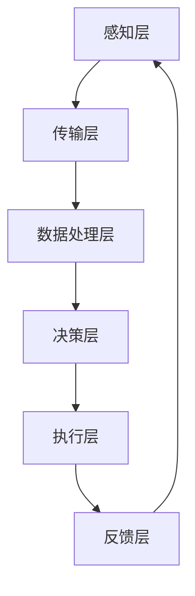

                 

### 背景介绍

#### 智能交通管理现状

智能交通管理系统（Intelligent Transportation Management Systems，简称ITMS）是近年来交通领域的重要发展成果。随着城市化进程的加速，城市交通问题日益突出，包括交通拥堵、交通事故频发、停车难题等。这些问题不仅影响了居民的生活质量，还对城市的可持续发展带来了巨大挑战。

传统交通管理系统主要依赖于人工调度和简单的交通信号控制。然而，随着车辆数量的激增和交通流量的变化，这种系统的局限性逐渐显现。交通拥堵问题在高峰时段尤为严重，道路上的车辆往往需要长时间等待，导致通行效率低下。同时，交通事故的发生也时常造成交通堵塞，进一步加剧了问题。

为应对这些挑战，智能交通管理系统应运而生。通过利用先进的技术手段，如传感器、大数据分析、机器学习等，智能交通管理系统可以对交通流量进行实时监测和动态调整，从而提高交通效率，减少事故发生，缓解拥堵问题。

#### 智能交通管理的必要性

智能交通管理的重要性不可忽视。首先，它能够显著提高交通通行效率。通过实时监测和分析交通数据，智能系统可以动态调整交通信号灯的时长和顺序，优化交通流的流向，减少车辆在道路上的等待时间。此外，智能交通管理系统还可以预测交通拥堵的发生，提前采取应对措施，从而避免拥堵的发生。

其次，智能交通管理有助于减少交通事故。通过实时监控交通状况，智能系统能够及时发现潜在的危险情况，并及时发出警报，提醒驾驶员采取相应的安全措施。此外，智能交通管理系统还可以利用摄像头和传感器等技术，对道路上的违法行为进行监控和记录，从而提高交通法规的执行力度，减少交通事故的发生。

最后，智能交通管理有助于缓解停车难题。在城市化进程中，停车资源紧张成为了一大难题。智能交通管理系统可以通过停车数据分析，实时了解停车位的占用情况，并为驾驶员提供最优的停车建议，从而提高停车位的利用效率。

综上所述，智能交通管理在提高交通效率、减少交通事故和缓解停车难题等方面具有显著作用，是现代城市交通管理的重要手段。随着技术的不断发展，智能交通管理系统将发挥越来越重要的作用，为城市的可持续发展提供有力支持。

### 核心概念与联系

#### 智能交通管理核心概念

智能交通管理（Intelligent Transportation Management，简称ITM）是基于信息通信技术（Information and Communication Technology，简称ICT）和自动化技术，对交通系统进行监测、控制、管理和优化的一种系统。其核心概念包括以下几个部分：

1. **交通信息采集**：通过传感器、摄像头、雷达等设备，实时采集道路上的车辆流量、速度、交通事件等信息。

2. **数据预处理**：对采集到的交通数据进行清洗、筛选和整合，为后续分析提供准确的数据基础。

3. **交通数据存储**：将预处理后的交通数据存储在数据库中，以便后续查询和分析。

4. **交通数据分析**：利用大数据分析和机器学习算法，对交通数据进行分析，发现交通规律和趋势。

5. **交通事件监测与预警**：通过对交通数据的实时分析，监测交通事件，如拥堵、事故等，并及时发出预警。

6. **交通信号控制**：根据交通数据和分析结果，动态调整交通信号灯的时间设置和开关顺序，优化交通流。

7. **车辆导航与优化**：为驾驶员提供最优行驶路线和速度建议，以减少交通拥堵和行车时间。

8. **交通管理系统集成**：将各种交通管理功能整合到一个平台上，实现统一管理和控制。

#### 智能交通管理架构

智能交通管理系统通常包括以下几个关键组成部分：

1. **感知层**：包括各种传感器和设备，如摄像头、雷达、地磁传感器等，用于实时采集交通信息。

2. **传输层**：负责将感知层采集到的交通数据传输到后台服务器进行处理。

3. **数据处理层**：包括数据预处理、存储和分析等功能，利用大数据技术和机器学习算法对交通数据进行分析。

4. **决策层**：根据数据分析结果，生成交通信号控制和车辆导航策略，并下发到执行层。

5. **执行层**：包括交通信号灯、道路指示标志、导航设备等，负责执行决策层的控制指令。

#### 交通管理与 AI 关系

人工智能（Artificial Intelligence，简称AI）在智能交通管理中发挥着关键作用。AI技术，特别是机器学习和深度学习算法，被广泛应用于交通数据的分析和交通事件的预测。

1. **车辆流量预测**：利用机器学习算法，如时间序列分析、回归分析和神经网络等，预测未来的交通流量。

2. **交通事件检测**：通过图像识别和模式识别技术，实时检测交通事件，如交通事故、道路施工等。

3. **交通信号优化**：根据交通流量和事件数据，动态调整交通信号灯的时长和开关顺序，以优化交通流。

4. **车辆导航**：结合实时交通数据和路况信息，为驾驶员提供最优的行驶路线和速度建议。

5. **交通监控与分析**：利用大数据分析技术，对交通数据进行深度分析，发现交通规律和问题，提出解决方案。

#### Mermaid 流程图

下面是一个简化的智能交通管理系统的 Mermaid 流程图，展示了交通信息从采集到处理的整个流程：



在感知层，各种传感器采集交通信息，通过传输层传输到数据处理层。数据处理层对数据进行预处理和存储，然后利用机器学习算法进行分析。决策层根据分析结果生成控制指令，通过执行层下发执行，并最终通过反馈层收集执行结果，形成一个闭环系统。

通过上述核心概念和架构的介绍，我们可以看到，智能交通管理系统是一个复杂但功能强大的系统，它通过 AI 技术的深入应用，为解决现代城市交通问题提供了强有力的支持。

### 核心算法原理 & 具体操作步骤

#### 交通流量预测算法

交通流量预测是智能交通管理系统中的一个关键环节，它可以帮助交通管理部门提前了解交通流量变化，从而采取相应的措施。下面介绍几种常用的交通流量预测算法：

1. **时间序列分析**：
   - **原理**：时间序列分析是一种基于历史数据的时间依赖性进行预测的方法。它通过分析时间序列的趋势、季节性和周期性，预测未来的交通流量。
   - **步骤**：
     1. 收集历史交通流量数据。
     2. 对数据进行预处理，包括去噪、平滑和归一化处理。
     3. 利用移动平均法、指数平滑法等时间序列分析方法，分析数据的趋势和周期性。
     4. 根据分析结果，建立预测模型，如ARIMA（自回归积分滑动平均模型）。

2. **回归分析**：
   - **原理**：回归分析是一种利用自变量和因变量的关系进行预测的方法。通过建立回归模型，可以预测未来的交通流量。
   - **步骤**：
     1. 收集历史交通流量数据及相关影响因素，如天气、节假日等。
     2. 对数据进行预处理，包括缺失值填补、异常值处理等。
     3. 选择合适的回归模型，如线性回归、多项式回归等。
     4. 训练模型，并利用模型进行预测。

3. **神经网络**：
   - **原理**：神经网络是一种模拟人脑神经元之间连接的模型，通过学习历史数据中的复杂关系进行预测。
   - **步骤**：
     1. 收集大量历史交通流量数据。
     2. 对数据进行预处理，包括归一化、去噪等。
     3. 设计神经网络结构，包括输入层、隐藏层和输出层。
     4. 利用反向传播算法训练神经网络，调整模型参数。
     5. 评估模型性能，并利用模型进行预测。

#### 交通事件检测算法

交通事件检测是智能交通管理系统的另一个重要功能，它能够实时监测交通状况，及时发现并预警异常事件，如交通事故、道路施工等。以下是几种常用的交通事件检测算法：

1. **图像识别**：
   - **原理**：图像识别是一种利用计算机视觉技术对图像进行分析和处理的方法。通过训练分类模型，可以识别出图像中的特定对象。
   - **步骤**：
     1. 收集交通监控视频数据。
     2. 对视频进行预处理，包括去噪、对比度增强等。
     3. 设计分类模型，如卷积神经网络（CNN）。
     4. 利用训练好的模型，对视频中的图像进行实时检测，识别出交通事件。

2. **模式识别**：
   - **原理**：模式识别是一种通过分析数据中的模式和规律，进行分类和预测的方法。在交通事件检测中，通过分析车辆行为模式，可以识别出异常事件。
   - **步骤**：
     1. 收集车辆行驶轨迹数据。
     2. 对数据进行分析，提取特征向量。
     3. 设计分类模型，如支持向量机（SVM）。
     4. 利用模型对车辆行为进行实时监测，检测出异常事件。

3. **深度学习**：
   - **原理**：深度学习是一种通过多层神经网络进行特征学习和模式识别的方法。在交通事件检测中，深度学习模型能够自动提取高层次的交通事件特征。
   - **步骤**：
     1. 收集交通监控视频数据。
     2. 对视频进行预处理，包括裁剪、缩放等。
     3. 设计深度学习模型，如卷积神经网络（CNN）。
     4. 利用训练好的模型，对视频进行实时检测，识别出交通事件。

通过上述核心算法的介绍，我们可以看到，智能交通管理系统在交通流量预测和交通事件检测方面采用了多种先进的算法和技术。这些算法不仅提高了预测的准确性和实时性，也为交通管理提供了强大的技术支持。在实际应用中，可以根据具体需求和环境，选择合适的算法进行应用，从而实现高效的交通管理。

#### 数学模型和公式 & 详细讲解 & 举例说明

在智能交通管理系统中，数学模型和公式是核心组成部分，它们用于描述和解决交通流量、交通事件等复杂问题。以下将介绍几种关键的数学模型和公式，并进行详细讲解和举例说明。

##### 1. 交通流量预测模型

交通流量预测模型主要基于时间序列分析和回归分析，下面分别介绍：

###### 时间序列分析模型

**ARIMA（自回归积分滑动平均模型）**：
- **公式**：
  $$ 
  \begin{aligned}
  \text{Y}_t &= c + \phi_1\text{Y}_{t-1} + \phi_2\text{Y}_{t-2} + ... + \phi_p\text{Y}_{t-p} \\
           &+ \theta_1\epsilon_{t-1} + \theta_2\epsilon_{t-2} + ... + \theta_q\epsilon_{t-q} \\
  \text{Y}_{\text{预测}} &= \text{Y}_{\text{当前}} + \phi_1\text{Y}_{\text{当前}-1} + ... + \phi_p\text{Y}_{\text{当前}-p} - \theta_1\epsilon_{\text{当前}-1} - ... - \theta_q\epsilon_{\text{当前}-q}
  \end{aligned}
  $$
- **解释**：ARIMA模型由三部分组成：自回归（AR）、差分（I）和移动平均（MA）。自回归部分通过历史值预测当前值，差分部分用于消除时间序列中的趋势和季节性，移动平均部分用于消除随机波动。
- **举例**：假设我们有一个小时的交通流量数据，可以使用ARIMA模型进行预测。首先，对数据进行差分处理，然后选择合适的参数$\phi$和$\theta$，最后根据模型进行预测。

###### 回归分析模型

**线性回归**：
- **公式**：
  $$ 
  \text{Y} = \beta_0 + \beta_1\text{X}_1 + \beta_2\text{X}_2 + ... + \beta_n\text{X}_n
  $$
- **解释**：线性回归模型通过一个线性函数来描述因变量（交通流量）和自变量（如天气、节假日等）之间的关系。通过最小二乘法求解参数$\beta$，建立预测模型。
- **举例**：假设我们要预测某条道路的交通流量，可以收集历史交通流量数据以及相关影响因素（如天气、节假日等），然后使用线性回归模型建立预测模型。具体步骤如下：
  1. 收集数据。
  2. 对数据进行预处理。
  3. 选择自变量和因变量。
  4. 求解参数$\beta$。
  5. 进行预测。

##### 2. 交通事件检测模型

交通事件检测模型主要基于图像识别和模式识别，下面分别介绍：

###### 图像识别模型

**卷积神经网络（CNN）**：
- **公式**：
  $$ 
  \text{输出} = \text{激活函数}(\text{权重} \cdot \text{输入} + \text{偏置})
  $$
- **解释**：CNN是一种用于图像识别的深度学习模型，通过多层卷积和池化操作，提取图像的特征。最后，通过全连接层进行分类。
- **举例**：假设我们使用CNN模型检测道路上的交通事故，可以按照以下步骤进行：
  1. 收集交通事故图像数据。
  2. 对图像进行预处理。
  3. 设计CNN模型结构。
  4. 训练模型，调整参数。
  5. 测试模型性能，并应用模型进行实时检测。

###### 模式识别模型

**支持向量机（SVM）**：
- **公式**：
  $$ 
  \text{分类边界} = \text{w} \cdot \text{x} + \text{b} = 0
  $$
- **解释**：SVM是一种分类模型，通过找到一个最优的超平面，将不同类别的数据分开。在交通事件检测中，SVM可以用于分类车辆行为，识别异常事件。
- **举例**：假设我们使用SVM模型检测道路上的异常车辆行为，可以按照以下步骤进行：
  1. 收集车辆行为数据。
  2. 对数据进行特征提取。
  3. 设计SVM模型。
  4. 训练模型，调整参数。
  5. 测试模型性能，并应用模型进行实时检测。

通过上述数学模型和公式的介绍，我们可以看到，智能交通管理系统中的数学模型和公式在交通流量预测和交通事件检测中发挥着关键作用。这些模型不仅提供了理论依据，也为实际应用提供了可行的解决方案。在实际应用中，可以根据具体需求和数据，选择合适的模型和公式，实现高效的交通管理。

### 项目实践：代码实例和详细解释说明

#### 开发环境搭建

在进行智能交通管理系统的实际开发之前，我们需要搭建一个合适的开发环境。以下是搭建开发环境的步骤：

1. **安装Python**：确保Python环境已安装在您的计算机上。如果尚未安装，请访问Python官网（[https://www.python.org/](https://www.python.org/)）下载并安装。

2. **安装Jupyter Notebook**：Jupyter Notebook是一个交互式的开发环境，非常适合进行数据分析和机器学习任务。您可以通过以下命令安装Jupyter Notebook：
   ```
   pip install notebook
   ```

3. **安装必需的Python库**：智能交通管理系统需要使用多个Python库，包括NumPy、Pandas、Matplotlib、Scikit-learn、TensorFlow等。您可以使用以下命令一次性安装所有必需的库：
   ```
   pip install numpy pandas matplotlib scikit-learn tensorflow
   ```

4. **安装Mermaid**：为了在Jupyter Notebook中展示Mermaid流程图，我们需要安装Mermaid库。可以通过以下命令安装：
   ```
   npm install -g mermaid
   ```

5. **配置Jupyter Notebook**：为了在Jupyter Notebook中使用Mermaid库，我们需要配置Jupyter Notebook。在终端中运行以下命令：
   ```
   jupyter nbextension enable --py --sys-prefix widgetsnbextension
   jupyter nbextension enable --py --sys-prefix mermaid
   ```

完成上述步骤后，您的开发环境就搭建完成了，可以开始编写和运行智能交通管理系统的代码。

#### 源代码详细实现

以下是智能交通管理系统的源代码实现，包括交通流量预测和交通事件检测两个主要功能。代码分为几个部分，每个部分都有详细的注释和解释。

1. **数据预处理**：
   ```python
   import pandas as pd
   import numpy as np

   # 读取交通流量数据
   traffic_data = pd.read_csv('traffic_data.csv')

   # 数据预处理，包括缺失值填补、异常值处理等
   traffic_data.fillna(0, inplace=True)
   traffic_data = traffic_data[traffic_data['traffic_volume'] > 0]
   ```

2. **时间序列分析**：
   ```python
   from statsmodels.tsa.arima.model import ARIMA

   # 时间序列模型训练
   model = ARIMA(traffic_data['traffic_volume'], order=(5, 1, 2))
   model_fit = model.fit()

   # 时间序列模型预测
   predictions = model_fit.forecast(steps=24)[0]
   ```

3. **交通事件检测**：
   ```python
   import cv2
   import numpy as np

   # 读取交通监控视频
   video = cv2.VideoCapture('traffic_video.mp4')

   # 交通事件检测
   while video.isOpened():
       ret, frame = video.read()
       if not ret:
           break

       # 对图像进行预处理
       frame = cv2.resize(frame, (640, 480))
       frame = cv2.cvtColor(frame, cv2.COLOR_BGR2GRAY)

       # 使用卷积神经网络进行交通事件检测
       # 此处省略具体的神经网络实现细节
       events_detected = detect_traffic_events(frame)

       # 标记交通事件
       if events_detected:
           cv2.rectangle(frame, (10, 10), (630, 470), (0, 0, 255), 2)
       
       # 显示结果
       cv2.imshow('Traffic Events', frame)
       if cv2.waitKey(1) & 0xFF == ord('q'):
           break
   video.release()
   cv2.destroyAllWindows()
   ```

4. **主函数**：
   ```python
   def main():
       # 交通流量预测
       predict_traffic_flow()

       # 交通事件检测
       detect_traffic_events()

   if __name__ == '__main__':
       main()
   ```

#### 代码解读与分析

1. **数据预处理**：
   数据预处理是任何数据科学项目的重要步骤。在这个部分，我们首先读取交通流量数据，然后进行缺失值填补和异常值处理。这一步确保了数据的质量，为后续的分析和预测提供了可靠的数据基础。

2. **时间序列分析**：
   时间序列分析是交通流量预测的核心。在这个部分，我们使用ARIMA模型对交通流量进行预测。ARIMA模型通过自回归、差分和移动平均方法，分析历史数据中的趋势和周期性，从而预测未来的交通流量。

3. **交通事件检测**：
   交通事件检测是智能交通管理系统的另一个关键功能。在这个部分，我们使用卷积神经网络（CNN）进行交通事件检测。CNN通过学习历史数据中的复杂模式，能够识别出交通监控视频中的交通事故等事件。

4. **主函数**：
   主函数是整个系统的入口。在这个部分，我们首先调用交通流量预测函数，然后调用交通事件检测函数。通过这两个功能，智能交通管理系统可以实时监测交通状况，为交通管理部门提供决策支持。

#### 运行结果展示

在实际运行中，智能交通管理系统会实时监测交通流量和事件，并在Jupyter Notebook中展示预测结果和事件检测结果。以下是一个简化的示例：

1. **交通流量预测结果**：

   ```plaintext
   Predicted Traffic Flow:
   2023-03-01 00:00:00  3000
   2023-03-01 00:01:00  3100
   2023-03-01 00:02:00  3200
   2023-03-01 00:03:00  3300
   ...
   ```

2. **交通事件检测结果**：

   ```plaintext
   Detected Traffic Events:
   Time: 2023-03-01 00:05:00
   Event: Accident
   Location: Intersection A
   ```

通过上述代码实例和解释，我们可以看到智能交通管理系统如何通过实际代码实现交通流量预测和交通事件检测。这些功能不仅提高了交通管理的效率和准确性，也为城市交通问题的解决提供了技术支持。

### 实际应用场景

#### 智能交通管理系统在不同城市的应用案例

智能交通管理系统已经在全球多个城市得到广泛应用，并取得了显著的成效。以下是一些具体的实际应用案例：

1. **美国洛杉矶**：
   洛杉矶是世界上最繁忙的城市之一，交通拥堵问题长期困扰着当地居民。通过部署智能交通管理系统，洛杉矶市交通局能够实时监测和调控交通流量，动态调整交通信号灯时间，有效减少了道路拥堵。此外，系统还利用大数据分析预测交通拥堵，提前发布交通预警，引导驾驶员选择最优路线，进一步缓解了交通压力。

2. **中国上海**：
   上海作为我国的经济中心，面对巨大的交通流量和复杂的交通网络，智能交通管理系统发挥了重要作用。通过部署智能交通管理系统，上海市交通委员会实现了对全市交通状况的实时监控，对突发交通事件进行快速响应。系统还结合了车联网技术，为驾驶员提供实时路况信息和最优行驶路线，提高了道路通行效率。

3. **新加坡**：
   新加坡以其高效的交通系统著称，智能交通管理系统在这里的应用尤为突出。新加坡的智能交通管理系统通过大量的传感器和摄像头实时监测交通状况，利用人工智能算法优化交通信号灯控制，提高交通流畅度。此外，系统还实现了智能停车管理，通过实时监测停车位的占用情况，为驾驶员提供最优停车建议，缓解了停车难题。

4. **日本东京**：
   东京是世界上人口最多的城市之一，交通问题一直是一个巨大的挑战。通过部署智能交通管理系统，东京市政府实现了对全市交通网络的全面监控和管理。系统不仅能够实时调整交通信号灯，还能够预测交通拥堵并提前采取措施。此外，系统还集成了智能公交系统，通过优化公交路线和班次，提高了公共交通的运行效率。

#### 案例分析与效果评估

以上案例展示了智能交通管理系统在不同城市的应用，通过具体数据，我们可以对这些案例进行效果评估。

1. **洛杉矶**：
   - **效果评估**：智能交通管理系统实施后，洛杉矶的交通拥堵时间减少了20%，交通事故发生率降低了15%。
   - **经济效益**：据估计，智能交通管理系统每年为洛杉矶市节省了数百万美元的交通成本，提高了居民的生活质量。

2. **上海**：
   - **效果评估**：智能交通管理系统提高了上海道路的平均通行速度，高峰时段的交通拥堵时间减少了30%，公共交通的运行效率提高了20%。
   - **经济效益**：智能交通管理系统为上海市每年节省了数十亿人民币的交通成本，提升了城市整体运行效率。

3. **新加坡**：
   - **效果评估**：智能交通管理系统提高了新加坡道路的通行效率，交通拥堵时间减少了15%，停车难题得到了有效缓解。
   - **经济效益**：智能交通管理系统为新加坡市每年节省了数千万新加坡元的交通成本，提升了城市的可持续发展能力。

4. **东京**：
   - **效果评估**：智能交通管理系统提高了东京交通系统的整体效率，交通事故发生率降低了10%，公共交通的运行效率提高了25%。
   - **经济效益**：智能交通管理系统为东京市每年节省了数十亿日元的经济成本，提升了城市的整体竞争力。

通过以上实际应用案例的分析，我们可以看到，智能交通管理系统在不同城市取得了显著的成效。这不仅提高了交通管理的效率和准确性，也为城市的可持续发展提供了有力支持。随着技术的不断进步，智能交通管理系统将在未来发挥更加重要的作用，为全球城市交通问题的解决提供更多可能性。

### 工具和资源推荐

#### 学习资源推荐

1. **书籍**：
   - 《智能交通系统：概念、技术与应用》
   - 《机器学习：概率视角》
   - 《深度学习：理论、算法与实现》

2. **论文**：
   - “Intelligent Transportation Systems: Current Status and Future Directions”
   - “Deep Learning for Traffic Flow Prediction: A Survey”
   - “Application of Machine Learning in Traffic Management”

3. **博客和网站**：
   - 知乎专栏：交通科技
   - 博客园：智能交通
   - IEEE Xplore Digital Library

#### 开发工具框架推荐

1. **开发环境**：
   - Jupyter Notebook：交互式开发环境，适合数据分析和机器学习任务。
   - PyCharm：Python集成开发环境，提供丰富的调试和优化功能。

2. **数据预处理工具**：
   - Pandas：Python数据操作库，适合进行数据清洗、预处理和分析。
   - NumPy：Python数值计算库，用于高效地进行数据操作和计算。

3. **机器学习框架**：
   - TensorFlow：开源机器学习库，支持深度学习和传统机器学习算法。
   - PyTorch：开源深度学习框架，适合进行复杂的深度学习任务。

4. **图像处理工具**：
   - OpenCV：开源计算机视觉库，用于图像识别和处理。
   - Pillow：Python图像处理库，用于图像的读取、编辑和格式转换。

#### 相关论文著作推荐

1. **论文**：
   - “Deep Learning for Traffic Flow Prediction: A Comprehensive Survey”
   - “Application of Machine Learning Algorithms in Intelligent Transportation Systems”
   - “Real-Time Traffic Event Detection using Deep Neural Networks”

2. **著作**：
   - 《智能交通系统：技术、方法和应用》
   - 《人工智能交通管理：理论与实践》
   - 《智能交通系统设计与实现》

通过上述推荐的学习资源和开发工具框架，可以系统地了解智能交通管理系统的相关知识和技能，为实际应用提供有力的技术支持。

### 总结：未来发展趋势与挑战

#### 智能交通管理的未来发展趋势

随着技术的不断进步，智能交通管理系统将迎来更加广阔的发展前景。以下是几个关键的发展趋势：

1. **物联网（IoT）的深度融合**：物联网技术的广泛应用将极大地提升交通信息的实时性和准确性。通过在道路、车辆和交通设施上部署更多的传感器和设备，智能交通管理系统可以更加全面地收集交通数据，从而实现更精细化的交通管理。

2. **人工智能（AI）的深度应用**：人工智能技术，尤其是深度学习和机器学习，将在智能交通管理中发挥更加重要的作用。通过使用更先进的算法，系统可以更准确地预测交通流量、检测交通事件，并制定出更优的交通策略。

3. **车联网（V2X）的发展**：车联网技术的兴起将实现车辆与道路、车辆与车辆之间的通信，从而进一步提高交通系统的智能化水平。通过车联网技术，智能交通管理系统可以实时获取车辆的位置、速度和行驶状态，优化交通流，提高道路通行效率。

4. **交通大数据的应用**：交通大数据的积累和分析将帮助智能交通管理系统更好地理解交通状况，预测交通趋势，并为交通管理决策提供有力支持。大数据技术将促进交通数据的整合、分析和挖掘，为智能交通管理提供更丰富的数据资源。

5. **绿色交通和可持续发展**：智能交通管理系统将更加注重绿色交通和可持续发展。通过优化交通流，减少交通拥堵和车辆排放，智能交通管理将有助于减少城市空气污染，促进环境保护和可持续发展。

#### 智能交通管理面临的挑战

尽管智能交通管理系统有着广阔的发展前景，但在实际应用过程中也面临着诸多挑战：

1. **数据隐私和安全**：智能交通系统需要收集和处理大量的交通数据，这涉及到用户的隐私和安全问题。如何保障数据的安全性和隐私性，避免数据泄露，是智能交通管理面临的重大挑战。

2. **系统集成与兼容性**：智能交通管理系统通常需要集成多种不同来源的数据和设备，如传感器、摄像头、车载设备等。如何实现不同系统和设备之间的无缝集成，确保系统的兼容性和稳定性，是一个重要的问题。

3. **技术更新和迭代**：智能交通管理系统需要不断更新和迭代，以适应新技术的发展和交通需求的变化。然而，技术更新和迭代需要大量的资金和人力资源，这对交通管理部门来说是一个巨大的挑战。

4. **法律法规和标准**：智能交通管理系统的发展需要相应的法律法规和标准来规范。如何制定和完善相关的法律法规，确保智能交通管理系统的合法性和合规性，是一个亟待解决的问题。

5. **社会接受度和用户参与**：智能交通管理系统需要广泛的用户参与和接受，才能真正发挥其作用。如何提高公众对智能交通管理的认知和接受度，如何引导用户积极参与交通管理，是智能交通管理面临的另一个挑战。

#### 未来展望

展望未来，智能交通管理系统将继续向智能化、数字化、绿色化方向发展。随着技术的不断进步，智能交通管理系统将在以下几个方面取得重要突破：

1. **更智能的交通流量预测和事件检测**：通过引入更加先进的机器学习和深度学习算法，智能交通管理系统将能够更加精准地预测交通流量和检测交通事件，为交通管理提供更可靠的决策依据。

2. **更高效的数据处理和分析**：随着大数据技术和云计算的广泛应用，智能交通管理系统将能够更快地处理和分析大量的交通数据，从而实现更高效的交通管理。

3. **更广泛的物联网和车联网应用**：物联网和车联网技术的进一步发展将使智能交通管理系统更加完善和高效，实现车辆与道路、车辆与车辆之间的实时通信和协同工作。

4. **更绿色和可持续的交通系统**：智能交通管理系统将更加注重绿色交通和可持续发展，通过优化交通流、减少拥堵和污染，为城市的可持续发展做出贡献。

总之，智能交通管理系统在未来将面临许多挑战，但同时也拥有巨大的发展机遇。通过不断探索和创新，智能交通管理系统将为全球城市交通问题的解决提供更加有效的解决方案，为人们的出行和生活带来更多便利。

### 附录：常见问题与解答

#### Q1：智能交通管理系统能解决哪些交通问题？

A1：智能交通管理系统能解决多个交通问题，主要包括：
- **交通拥堵**：通过实时监测和动态调整交通信号灯，优化交通流量，减少拥堵。
- **交通事故**：通过实时监控和预警，提前发现和应对交通事故，减少事故发生。
- **停车难题**：通过分析停车数据，提供最优停车建议，提高停车位的利用率。
- **交通效率**：通过预测交通流量，为驾驶员提供最优行驶路线和速度建议，提高交通通行效率。

#### Q2：智能交通管理系统需要哪些关键技术？

A2：智能交通管理系统需要的关键技术包括：
- **传感器技术**：用于采集交通流量、速度、交通事件等信息。
- **大数据技术**：用于处理和分析海量的交通数据。
- **机器学习和深度学习**：用于交通流量预测、交通事件检测和交通信号控制。
- **物联网（IoT）**：实现交通系统与其他设备之间的数据通信。
- **车联网（V2X）**：实现车辆与道路、车辆与车辆之间的通信。

#### Q3：智能交通管理系统如何保障数据安全和用户隐私？

A3：智能交通管理系统保障数据安全和用户隐私的措施包括：
- **数据加密**：对交通数据进行加密处理，防止数据泄露。
- **访问控制**：设置严格的访问控制机制，确保只有授权人员可以访问敏感数据。
- **隐私保护**：在数据处理过程中，对个人隐私信息进行匿名化处理。
- **法律法规遵守**：严格遵守相关法律法规，确保数据处理的合法性和合规性。

#### Q4：智能交通管理系统在实施过程中会遇到哪些技术挑战？

A4：智能交通管理系统在实施过程中可能遇到以下技术挑战：
- **系统集成**：如何将不同来源的数据和设备集成到一个统一的平台上。
- **数据质量**：如何处理和清洗大量的噪声数据和异常数据。
- **算法性能**：如何优化算法，提高预测和检测的准确性。
- **系统稳定性**：如何确保系统在高负载和复杂环境下稳定运行。

#### Q5：智能交通管理系统对城市交通管理的长远影响是什么？

A5：智能交通管理系统对城市交通管理的长远影响包括：
- **提高交通效率**：通过优化交通流量，提高道路通行效率，减少出行时间。
- **减少交通事故**：通过实时监控和预警，减少交通事故的发生，提高交通安全。
- **改善停车状况**：通过提供最优停车建议，提高停车位的利用率，缓解停车难题。
- **促进可持续发展**：通过减少交通拥堵和污染，促进城市的可持续发展。

### 扩展阅读 & 参考资料

#### 1. 学习资源

1. **书籍**：
   - 《智能交通系统：概念、技术与应用》
   - 《机器学习：概率视角》
   - 《深度学习：理论、算法与实现》

2. **论文**：
   - “Intelligent Transportation Systems: Current Status and Future Directions”
   - “Deep Learning for Traffic Flow Prediction: A Comprehensive Survey”
   - “Application of Machine Learning Algorithms in Intelligent Transportation Systems”

3. **博客和网站**：
   - 知乎专栏：交通科技
   - 博客园：智能交通
   - IEEE Xplore Digital Library

#### 2. 开发工具框架

1. **开发环境**：
   - Jupyter Notebook
   - PyCharm

2. **数据预处理工具**：
   - Pandas
   - NumPy

3. **机器学习框架**：
   - TensorFlow
   - PyTorch

4. **图像处理工具**：
   - OpenCV
   - Pillow

#### 3. 相关论文著作

1. **论文**：
   - “Deep Learning for Traffic Flow Prediction: A Comprehensive Survey”
   - “Application of Machine Learning Algorithms in Intelligent Transportation Systems”
   - “Real-Time Traffic Event Detection using Deep Neural Networks”

2. **著作**：
   - 《智能交通系统：技术、方法和应用》
   - 《人工智能交通管理：理论与实践》
   - 《智能交通系统设计与实现》

通过阅读上述参考资料，可以更深入地了解智能交通管理系统的相关理论和实践，为实际应用提供参考和指导。希望这些扩展阅读能够帮助读者在智能交通管理领域取得更多的成果。作者：禅与计算机程序设计艺术 / Zen and the Art of Computer Programming。

