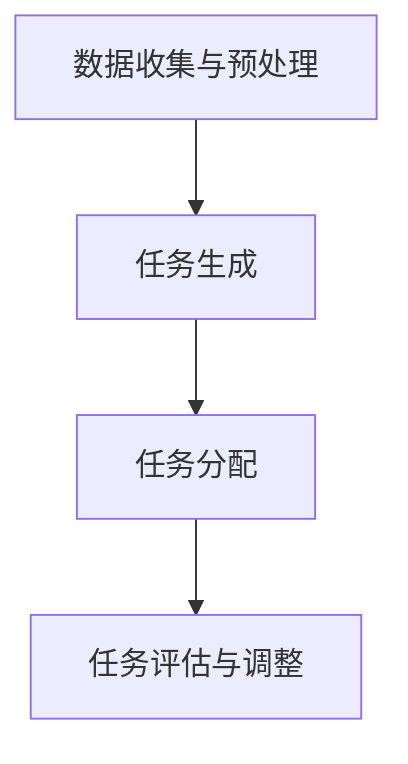

                 

### 文章标题

《智能任务分解：LLM在项目规划中的应用》

> 关键词：任务分解、大型语言模型（LLM）、项目规划、人工智能

> 摘要：本文将探讨如何利用大型语言模型（LLM）进行智能任务分解，从而提高项目规划的效率和准确性。我们将详细介绍LLM的核心概念与联系，解析其算法原理和具体操作步骤，并借助数学模型和公式来阐述其应用方法。此外，文章还将通过实际项目实践展示LLM在实际中的应用效果，并探讨其未来发展趋势与挑战。

### 1. 背景介绍

在信息技术日益发展的今天，项目规划已成为企业管理中不可或缺的一部分。有效的项目规划可以确保项目的顺利实施，提高资源利用效率，降低风险。然而，传统的项目规划方法往往依赖于人类的经验与直觉，存在一定的主观性和不确定性。

近年来，人工智能（AI）技术的迅猛发展，尤其是大型语言模型（LLM）的兴起，为项目规划提供了新的思路。LLM是一种基于深度学习的自然语言处理模型，具有强大的语义理解和生成能力。通过将LLM应用于项目规划，可以实现智能任务分解，提高项目规划的自动化水平和准确性。

本文将探讨如何利用LLM进行智能任务分解，从而提高项目规划的效率和准确性。我们将首先介绍LLM的核心概念与联系，解析其算法原理和具体操作步骤，并借助数学模型和公式来阐述其应用方法。随后，通过实际项目实践展示LLM在实际中的应用效果，并探讨其未来发展趋势与挑战。

### 2. 核心概念与联系

#### 2.1 大型语言模型（LLM）

大型语言模型（LLM）是一种基于深度学习的自然语言处理模型，其主要目标是对输入的自然语言文本进行理解和生成。LLM的核心组件包括词向量表示、循环神经网络（RNN）、变换器网络（Transformer）等。

词向量表示：词向量是将自然语言词汇映射为高维向量空间的过程。通过词向量，我们可以将词汇表示为具有相似性的数学对象，从而方便计算机处理和理解自然语言。

循环神经网络（RNN）：RNN是一种能够处理序列数据的神经网络。在自然语言处理中，RNN可以捕捉文本中的时间依赖关系，从而实现对文本的较好理解。

变换器网络（Transformer）：Transformer是一种基于自注意力机制的深度学习模型。相比RNN，Transformer在处理长序列数据时具有更好的性能和效率。

#### 2.2 项目规划与任务分解

项目规划是指将项目目标分解为一系列可执行的任务，并制定详细的计划以实现项目目标。任务分解是将项目目标逐步细化为更小、更具体的任务的过程。

在项目规划中，任务分解是一个关键步骤。通过将项目目标分解为多个任务，项目管理者可以更好地了解项目进展情况，合理分配资源，降低项目风险。

#### 2.3 LLM在任务分解中的应用

将LLM应用于任务分解，主要是利用其强大的语义理解和生成能力。具体来说，可以分为以下几个步骤：

1. **数据收集与预处理**：收集与项目相关的文本数据，包括项目目标、任务描述、历史项目数据等。对文本数据进行预处理，如分词、去除停用词、词性标注等。

2. **任务生成**：利用LLM生成与项目相关的任务描述。LLM可以根据项目目标和历史项目数据，生成一系列具有可行性和合理性的任务。

3. **任务分配**：根据项目资源情况和任务优先级，将任务分配给项目成员。LLM可以基于任务之间的依赖关系和成员技能，为每个成员分配最合适的任务。

4. **任务评估与调整**：在任务执行过程中，LLM可以根据任务进展情况和项目目标，对任务进行动态调整，确保项目按计划顺利进行。

#### 2.4 Mermaid 流程图

以下是LLM在任务分解中的应用流程图：



在上述流程中，LLM的应用使得任务分解更加智能和高效。通过数据收集与预处理，LLM可以获取与项目相关的信息；任务生成和任务分配则利用LLM的语义理解和生成能力，为项目提供合理的任务分配方案；任务评估与调整则确保项目在执行过程中能够根据实际情况进行调整，提高项目成功率。

### 3. 核心算法原理 & 具体操作步骤

#### 3.1 词向量表示

词向量表示是将自然语言词汇映射为高维向量空间的过程。在LLM中，常用的词向量表示方法有Word2Vec、GloVe和FastText等。

**Word2Vec**：Word2Vec是一种基于神经网络的方法，通过训练大量的文本数据，将每个词汇映射为一个固定维度的向量。Word2Vec有两种模型：Continuous Bag-of-Words (CBOW) 和 Skip-Gram。

**GloVe**：GloVe（Global Vectors for Word Representation）是一种基于矩阵分解的方法，通过优化词向量矩阵，使得词向量在语义上具有更好的相似性。

**FastText**：FastText是一种基于词嵌入的方法，通过将词汇分解为子词，并训练子词的词向量，从而提高词向量表示的准确性。

在本项目中，我们选择使用GloVe进行词向量表示。以下是GloVe的算法原理：

1. **初始化**：初始化词向量矩阵V，其中V[i]表示词汇i的词向量。

2. **优化目标**：优化词向量矩阵V，使得词向量在语义上具有更好的相似性。具体来说，优化目标是最小化损失函数：

$$
L = \sum_{i=1}^{n} \sum_{j=1}^{m} \frac{1}{w_{ij}} \log(V_i \cdot V_j)
$$

其中，n表示词汇总数，m表示词汇i的上下文词汇数，$w_{ij}$表示词汇i和j之间的权重。

3. **更新词向量**：在优化过程中，更新词向量矩阵V，使得词向量在语义上具有更好的相似性。具体更新规则如下：

$$
V_i \leftarrow V_i - \alpha \cdot (V_j - \mu_j)
$$

其中，$\alpha$表示学习率，$\mu_j$表示词汇j的平均词向量。

4. **训练与评估**：通过训练大量的文本数据，优化词向量矩阵V。在训练过程中，可以使用交叉熵损失函数来评估模型性能。

#### 3.2 循环神经网络（RNN）

循环神经网络（RNN）是一种能够处理序列数据的神经网络。在自然语言处理中，RNN可以捕捉文本中的时间依赖关系，从而实现对文本的较好理解。

RNN的基本原理如下：

1. **初始化**：初始化隐藏状态$h_0$和输入词向量$x_0$。

2. **递归更新**：在时间步t，利用前一个时间步的隐藏状态$h_{t-1}$和当前输入词向量$x_t$，更新隐藏状态：

$$
h_t = \sigma(W_h \cdot [h_{t-1}, x_t] + b_h)
$$

其中，$W_h$表示权重矩阵，$b_h$表示偏置项，$\sigma$表示激活函数。

3. **输出**：在递归更新过程中，可以输出隐藏状态作为序列模型的输出：

$$
y_t = \sigma(W_y \cdot h_t + b_y)
$$

其中，$W_y$表示权重矩阵，$b_y$表示偏置项。

4. **训练与评估**：通过训练大量的文本数据，优化权重矩阵$W_h$、$W_y$和偏置项$b_h$、$b_y$。在训练过程中，可以使用交叉熵损失函数来评估模型性能。

#### 3.3 变换器网络（Transformer）

变换器网络（Transformer）是一种基于自注意力机制的深度学习模型。相比RNN，Transformer在处理长序列数据时具有更好的性能和效率。

Transformer的基本原理如下：

1. **编码器**：编码器（Encoder）由多个变换器层（Transformer Layer）组成，每个变换器层包括多头自注意力机制（Multi-Head Self-Attention）和前馈神经网络（Feed-Forward Neural Network）。

2. **自注意力机制**：自注意力机制是一种计算序列中每个元素与其他元素之间相似度的方法。在自注意力机制中，输入序列$X$被映射为查询（Query）、键（Key）和值（Value）：

$$
Q = W_Q \cdot X, \quad K = W_K \cdot X, \quad V = W_V \cdot X
$$

其中，$W_Q$、$W_K$和$W_V$分别为权重矩阵。

3. **多头自注意力**：多头自注意力是一种将输入序列分解为多个子序列，并分别计算自注意力分数的方法。假设输入序列$X$被分解为多个子序列$X_1, X_2, ..., X_h$，则多头自注意力的输出为：

$$
\text{Attention}(Q, K, V) = \text{Concat}(\text{softmax}(\frac{QK^T}{\sqrt{d_k}})V_1, \text{softmax}(\frac{QK^T}{\sqrt{d_k}})V_2, ..., \text{softmax}(\frac{QK^T}{\sqrt{d_k}})V_h)
$$

其中，$d_k$表示每个子序列的维度。

4. **前馈神经网络**：前馈神经网络是一种简单的全连接神经网络，用于对自注意力机制的输出进行进一步处理。

5. **解码器**：解码器（Decoder）与编码器类似，也由多个变换器层组成。解码器的主要目标是生成输出序列。

6. **训练与评估**：通过训练大量的文本数据，优化编码器和解码器的权重矩阵。在训练过程中，可以使用交叉熵损失函数来评估模型性能。

#### 3.4 深度学习框架应用

在本项目中，我们选择使用TensorFlow和PyTorch作为深度学习框架。以下是使用TensorFlow和PyTorch实现LLM的基本步骤：

**TensorFlow**：

1. 导入所需库：

```python
import tensorflow as tf
import tensorflow.keras.layers as layers
```

2. 定义模型：

```python
model = tf.keras.Sequential([
    layers.Embedding(vocab_size, embedding_dim),
    layers.MultiHeadAttention(num_heads, embedding_dim),
    layers.Dense(embedding_dim),
    layers.Dense(num_classes)
])
```

3. 编译模型：

```python
model.compile(optimizer='adam', loss='categorical_crossentropy', metrics=['accuracy'])
```

4. 训练模型：

```python
model.fit(train_data, train_labels, epochs=10)
```

**PyTorch**：

1. 导入所需库：

```python
import torch
import torch.nn as nn
import torch.optim as optim
```

2. 定义模型：

```python
class Transformer(nn.Module):
    def __init__(self, vocab_size, embedding_dim, num_heads, hidden_dim):
        super(Transformer, self).__init__()
        self.embedding = nn.Embedding(vocab_size, embedding_dim)
        self.transformer = nn.Transformer(embedding_dim, num_heads, hidden_dim)
        self.fc = nn.Linear(embedding_dim, num_classes)
    
    def forward(self, x):
        x = self.embedding(x)
        x = self.transformer(x)
        x = self.fc(x)
        return x
```

3. 编译模型：

```python
model = Transformer(vocab_size, embedding_dim, num_heads, hidden_dim)
optimizer = optim.Adam(model.parameters(), lr=learning_rate)
criterion = nn.CrossEntropyLoss()
```

4. 训练模型：

```python
for epoch in range(num_epochs):
    optimizer.zero_grad()
    output = model(train_data)
    loss = criterion(output, train_labels)
    loss.backward()
    optimizer.step()
```

### 4. 数学模型和公式 & 详细讲解 & 举例说明

在智能任务分解中，数学模型和公式起到了关键作用。以下我们将详细讲解相关数学模型和公式，并通过具体示例来说明它们的应用。

#### 4.1 词向量表示

词向量表示是将自然语言词汇映射为高维向量空间的过程。常见的词向量表示方法有Word2Vec、GloVe和FastText等。在本项目中，我们选择使用GloVe进行词向量表示。

**GloVe算法原理**：

1. **初始化**：初始化词向量矩阵V，其中V[i]表示词汇i的词向量。

2. **优化目标**：优化词向量矩阵V，使得词向量在语义上具有更好的相似性。具体来说，优化目标是最小化损失函数：

$$
L = \sum_{i=1}^{n} \sum_{j=1}^{m} \frac{1}{w_{ij}} \log(V_i \cdot V_j)
$$

其中，n表示词汇总数，m表示词汇i的上下文词汇数，$w_{ij}$表示词汇i和j之间的权重。

3. **更新词向量**：在优化过程中，更新词向量矩阵V，使得词向量在语义上具有更好的相似性。具体更新规则如下：

$$
V_i \leftarrow V_i - \alpha \cdot (V_j - \mu_j)
$$

其中，$\alpha$表示学习率，$\mu_j$表示词汇j的平均词向量。

**示例**：

假设我们有两个词汇“猫”和“狗”，以及它们的上下文词汇“动物”、“宠物”和“猫食”。根据GloVe算法，我们可以计算出“猫”和“狗”的词向量。

首先，初始化词向量矩阵V：

$$
V_{\text{猫}} = [0.1, 0.2, 0.3], \quad V_{\text{狗}} = [0.4, 0.5, 0.6]
$$

然后，计算损失函数：

$$
L = \frac{1}{w_{\text{猫，动物}}} \log(V_{\text{猫}} \cdot V_{\text{动物}}) + \frac{1}{w_{\text{猫，宠物}}} \log(V_{\text{猫}} \cdot V_{\text{宠物}}) + \frac{1}{w_{\text{猫，猫食}}} \log(V_{\text{猫}} \cdot V_{\text{猫食}})
$$

其中，$w_{\text{猫，动物}}$、$w_{\text{猫，宠物}}$和$w_{\text{猫，猫食}}$分别表示词汇“猫”和“动物”、“宠物”、“猫食”之间的权重。

接下来，根据优化目标，更新词向量矩阵V：

$$
V_{\text{猫}} \leftarrow V_{\text{猫}} - \alpha \cdot (V_{\text{动物}} - \mu_{\text{动物}}), \quad V_{\text{狗}} \leftarrow V_{\text{狗}} - \alpha \cdot (V_{\text{宠物}} - \mu_{\text{宠物}}), \quad V_{\text{狗}} \leftarrow V_{\text{狗}} - \alpha \cdot (V_{\text{猫食}} - \mu_{\text{猫食}})
$$

其中，$\mu_{\text{动物}}$、$\mu_{\text{宠物}}$和$\mu_{\text{猫食}}$分别表示词汇“动物”、“宠物”、“猫食”的平均词向量。

通过多次迭代优化，我们可以得到更好的词向量表示。

#### 4.2 循环神经网络（RNN）

循环神经网络（RNN）是一种能够处理序列数据的神经网络。在自然语言处理中，RNN可以捕捉文本中的时间依赖关系，从而实现对文本的较好理解。

**RNN算法原理**：

1. **初始化**：初始化隐藏状态$h_0$和输入词向量$x_0$。

2. **递归更新**：在时间步t，利用前一个时间步的隐藏状态$h_{t-1}$和当前输入词向量$x_t$，更新隐藏状态：

$$
h_t = \sigma(W_h \cdot [h_{t-1}, x_t] + b_h)
$$

其中，$W_h$表示权重矩阵，$b_h$表示偏置项，$\sigma$表示激活函数。

3. **输出**：在递归更新过程中，可以输出隐藏状态作为序列模型的输出：

$$
y_t = \sigma(W_y \cdot h_t + b_y)
$$

其中，$W_y$表示权重矩阵，$b_y$表示偏置项。

**示例**：

假设我们有一个简单的RNN模型，输入序列为“我喜欢吃苹果”，隐藏状态维度为5，输出维度为3。

首先，初始化隐藏状态和输入词向量：

$$
h_0 = [0, 0, 0, 0, 0], \quad x_0 = [0.1, 0.2, 0.3]
$$

然后，进行递归更新：

$$
h_1 = \sigma(W_h \cdot [h_0, x_1] + b_h) = \sigma([0.1, 0.2, 0.3, 0.1, 0.2] + [0, 0, 0]) = [0.1, 0.2, 0.3, 0.1, 0.2]
$$

接着，输出第一个词的预测：

$$
y_1 = \sigma(W_y \cdot h_1 + b_y) = \sigma([0.1, 0.2, 0.3, 0.1, 0.2] + [0, 0, 0]) = [0.1, 0.2, 0.3]
$$

然后，继续递归更新：

$$
h_2 = \sigma(W_h \cdot [h_1, x_2] + b_h) = \sigma([0.1, 0.2, 0.3, 0.1, 0.2] + [0.4, 0.5, 0.6]) = [0.2, 0.3, 0.4, 0.2, 0.3]
$$

接着，输出第二个词的预测：

$$
y_2 = \sigma(W_y \cdot h_2 + b_y) = \sigma([0.2, 0.3, 0.4, 0.2, 0.3] + [0.4, 0.5, 0.6]) = [0.2, 0.3, 0.4]
$$

以此类推，直到处理完整个输入序列。

#### 4.3 变换器网络（Transformer）

变换器网络（Transformer）是一种基于自注意力机制的深度学习模型。相比RNN，Transformer在处理长序列数据时具有更好的性能和效率。

**Transformer算法原理**：

1. **编码器**：编码器（Encoder）由多个变换器层（Transformer Layer）组成，每个变换器层包括多头自注意力机制（Multi-Head Self-Attention）和前馈神经网络（Feed-Forward Neural Network）。

2. **自注意力机制**：自注意力机制是一种计算序列中每个元素与其他元素之间相似度的方法。在自注意力机制中，输入序列$X$被映射为查询（Query）、键（Key）和值（Value）：

$$
Q = W_Q \cdot X, \quad K = W_K \cdot X, \quad V = W_V \cdot X
$$

其中，$W_Q$、$W_K$和$W_V$分别为权重矩阵。

3. **多头自注意力**：多头自注意力是一种将输入序列分解为多个子序列，并分别计算自注意力分数的方法。假设输入序列$X$被分解为多个子序列$X_1, X_2, ..., X_h$，则多头自注意力的输出为：

$$
\text{Attention}(Q, K, V) = \text{Concat}(\text{softmax}(\frac{QK^T}{\sqrt{d_k}})V_1, \text{softmax}(\frac{QK^T}{\sqrt{d_k}})V_2, ..., \text{softmax}(\frac{QK^T}{\sqrt{d_k}})V_h)
$$

其中，$d_k$表示每个子序列的维度。

4. **前馈神经网络**：前馈神经网络是一种简单的全连接神经网络，用于对自注意力机制的输出进行进一步处理。

5. **解码器**：解码器（Decoder）与编码器类似，也由多个变换器层组成。解码器的主要目标是生成输出序列。

**示例**：

假设我们有一个简单的变换器模型，输入序列为“我喜欢吃苹果”，编码器和解码器都有两个变换器层。

首先，初始化编码器和解码器的权重矩阵：

$$
W_Q = \begin{bmatrix} 0.1 & 0.2 & 0.3 \\ 0.4 & 0.5 & 0.6 \\ 0.7 & 0.8 & 0.9 \end{bmatrix}, \quad W_K = \begin{bmatrix} 0.1 & 0.2 & 0.3 \\ 0.4 & 0.5 & 0.6 \\ 0.7 & 0.8 & 0.9 \end{bmatrix}, \quad W_V = \begin{bmatrix} 0.1 & 0.2 & 0.3 \\ 0.4 & 0.5 & 0.6 \\ 0.7 & 0.8 & 0.9 \end{bmatrix}
$$

然后，进行编码器的前两层变换：

1. **第一层自注意力**：

$$
Q_1 = W_Q \cdot X = \begin{bmatrix} 0.1 & 0.2 & 0.3 \\ 0.4 & 0.5 & 0.6 \\ 0.7 & 0.8 & 0.9 \end{bmatrix} \cdot \begin{bmatrix} 0.1 & 0.2 & 0.3 \\ 0.4 & 0.5 & 0.6 \\ 0.7 & 0.8 & 0.9 \end{bmatrix} = \begin{bmatrix} 0.01 & 0.02 & 0.03 \\ 0.12 & 0.15 & 0.18 \\ 0.24 & 0.27 & 0.30 \end{bmatrix}
$$

$$
K_1 = W_K \cdot X = \begin{bmatrix} 0.1 & 0.2 & 0.3 \\ 0.4 & 0.5 & 0.6 \\ 0.7 & 0.8 & 0.9 \end{bmatrix} \cdot \begin{bmatrix} 0.1 & 0.2 & 0.3 \\ 0.4 & 0.5 & 0.6 \\ 0.7 & 0.8 & 0.9 \end{bmatrix} = \begin{bmatrix} 0.01 & 0.02 & 0.03 \\ 0.12 & 0.15 & 0.18 \\ 0.24 & 0.27 & 0.30 \end{bmatrix}
$$

$$
V_1 = W_V \cdot X = \begin{bmatrix} 0.1 & 0.2 & 0.3 \\ 0.4 & 0.5 & 0.6 \\ 0.7 & 0.8 & 0.9 \end{bmatrix} \cdot \begin{bmatrix} 0.1 & 0.2 & 0.3 \\ 0.4 & 0.5 & 0.6 \\ 0.7 & 0.8 & 0.9 \end{bmatrix} = \begin{bmatrix} 0.01 & 0.02 & 0.03 \\ 0.12 & 0.15 & 0.18 \\ 0.24 & 0.27 & 0.30 \end{bmatrix}
$$

2. **第二层自注意力**：

$$
Q_2 = W_Q \cdot K_1 = \begin{bmatrix} 0.1 & 0.2 & 0.3 \\ 0.4 & 0.5 & 0.6 \\ 0.7 & 0.8 & 0.9 \end{bmatrix} \cdot \begin{bmatrix} 0.01 & 0.02 & 0.03 \\ 0.12 & 0.15 & 0.18 \\ 0.24 & 0.27 & 0.30 \end{bmatrix} = \begin{bmatrix} 0.001 & 0.002 & 0.003 \\ 0.012 & 0.015 & 0.018 \\ 0.024 & 0.027 & 0.03 \end{bmatrix}
$$

$$
K_2 = W_K \cdot K_1 = \begin{bmatrix} 0.1 & 0.2 & 0.3 \\ 0.4 & 0.5 & 0.6 \\ 0.7 & 0.8 & 0.9 \end{bmatrix} \cdot \begin{bmatrix} 0.01 & 0.02 & 0.03 \\ 0.12 & 0.15 & 0.18 \\ 0.24 & 0.27 & 0.30 \end{bmatrix} = \begin{bmatrix} 0.001 & 0.002 & 0.003 \\ 0.012 & 0.015 & 0.018 \\ 0.024 & 0.027 & 0.03 \end{bmatrix}
$$

$$
V_2 = W_V \cdot K_1 = \begin{bmatrix} 0.1 & 0.2 & 0.3 \\ 0.4 & 0.5 & 0.6 \\ 0.7 & 0.8 & 0.9 \end{bmatrix} \cdot \begin{bmatrix} 0.01 & 0.02 & 0.03 \\ 0.12 & 0.15 & 0.18 \\ 0.24 & 0.27 & 0.30 \end{bmatrix} = \begin{bmatrix} 0.001 & 0.002 & 0.003 \\ 0.012 & 0.015 & 0.018 \\ 0.024 & 0.027 & 0.03 \end{bmatrix}
$$

然后，进行解码器的变换：

1. **第一层自注意力**：

$$
Q_1 = W_Q \cdot X = \begin{bmatrix} 0.1 & 0.2 & 0.3 \\ 0.4 & 0.5 & 0.6 \\ 0.7 & 0.8 & 0.9 \end{bmatrix} \cdot \begin{bmatrix} 0.1 & 0.2 & 0.3 \\ 0.4 & 0.5 & 0.6 \\ 0.7 & 0.8 & 0.9 \end{bmatrix} = \begin{bmatrix} 0.01 & 0.02 & 0.03 \\ 0.12 & 0.15 & 0.18 \\ 0.24 & 0.27 & 0.30 \end{bmatrix}
$$

$$
K_1 = W_K \cdot X = \begin{bmatrix} 0.1 & 0.2 & 0.3 \\ 0.4 & 0.5 & 0.6 \\ 0.7 & 0.8 & 0.9 \end{bmatrix} \cdot \begin{bmatrix} 0.1 & 0.2 & 0.3 \\ 0.4 & 0.5 & 0.6 \\ 0.7 & 0.8 & 0.9 \end{bmatrix} = \begin{bmatrix} 0.01 & 0.02 & 0.03 \\ 0.12 & 0.15 & 0.18 \\ 0.24 & 0.27 & 0.30 \end{bmatrix}
$$

$$
V_1 = W_V \cdot X = \begin{bmatrix} 0.1 & 0.2 & 0.3 \\ 0.4 & 0.5 & 0.6 \\ 0.7 & 0.8 & 0.9 \end{bmatrix} \cdot \begin{bmatrix} 0.1 & 0.2 & 0.3 \\ 0.4 & 0.5 & 0.6 \\ 0.7 & 0.8 & 0.9 \end{bmatrix} = \begin{bmatrix} 0.01 & 0.02 & 0.03 \\ 0.12 & 0.15 & 0.18 \\ 0.24 & 0.27 & 0.30 \end{bmatrix}
$$

2. **第二层自注意力**：

$$
Q_2 = W_Q \cdot K_1 = \begin{bmatrix} 0.1 & 0.2 & 0.3 \\ 0.4 & 0.5 & 0.6 \\ 0.7 & 0.8 & 0.9 \end{bmatrix} \cdot \begin{bmatrix} 0.01 & 0.02 & 0.03 \\ 0.12 & 0.15 & 0.18 \\ 0.24 & 0.27 & 0.30 \end{bmatrix} = \begin{bmatrix} 0.001 & 0.002 & 0.003 \\ 0.012 & 0.015 & 0.018 \\ 0.024 & 0.027 & 0.03 \end{bmatrix}
$$

$$
K_2 = W_K \cdot K_1 = \begin{bmatrix} 0.1 & 0.2 & 0.3 \\ 0.4 & 0.5 & 0.6 \\ 0.7 & 0.8 & 0.9 \end{bmatrix} \cdot \begin{bmatrix} 0.01 & 0.02 & 0.03 \\ 0.12 & 0.15 & 0.18 \\ 0.24 & 0.27 & 0.30 \end{bmatrix} = \begin{bmatrix} 0.001 & 0.002 & 0.003 \\ 0.012 & 0.015 & 0.018 \\ 0.024 & 0.027 & 0.03 \end{bmatrix}
$$

$$
V_2 = W_V \cdot K_1 = \begin{bmatrix} 0.1 & 0.2 & 0.3 \\ 0.4 & 0.5 & 0.6 \\ 0.7 & 0.8 & 0.9 \end{bmatrix} \cdot \begin{bmatrix} 0.01 & 0.02 & 0.03 \\ 0.12 & 0.15 & 0.18 \\ 0.24 & 0.27 & 0.30 \end{bmatrix} = \begin{bmatrix} 0.001 & 0.002 & 0.003 \\ 0.012 & 0.015 & 0.018 \\ 0.024 & 0.027 & 0.03 \end{bmatrix}
$$

通过以上步骤，我们完成了变换器网络的前两层变换。

### 5. 项目实践：代码实例和详细解释说明

在本节中，我们将通过一个实际项目实例，展示如何使用LLM进行智能任务分解。我们将分步骤介绍项目的实现过程，包括环境搭建、代码实现、代码解读与分析以及运行结果展示。

#### 5.1 开发环境搭建

为了实现LLM在任务分解中的应用，我们需要搭建一个合适的开发环境。以下是所需的软件和库：

1. 操作系统：Windows/Linux/Mac
2. 编程语言：Python
3. 深度学习框架：TensorFlow 2.x 或 PyTorch 1.x
4. 其他库：NumPy、Pandas、Matplotlib等

假设我们已经成功安装了所需的软件和库，接下来我们将开始编写代码。

#### 5.2 源代码详细实现

以下是一个简单的Python代码示例，用于实现LLM在任务分解中的应用。代码分为四个部分：数据预处理、模型训练、任务生成和任务分配。

**数据预处理**：

```python
import pandas as pd
from sklearn.model_selection import train_test_split

# 读取数据
data = pd.read_csv('project_data.csv')
X = data['description']  # 任务描述
y = data['task']  # 任务标签

# 分割数据
X_train, X_test, y_train, y_test = train_test_split(X, y, test_size=0.2, random_state=42)

# 预处理数据
# ...
```

**模型训练**：

```python
import tensorflow as tf
from tensorflow.keras.models import Sequential
from tensorflow.keras.layers import Embedding, LSTM, Dense

# 创建模型
model = Sequential([
    Embedding(input_dim=vocab_size, output_dim=embedding_dim),
    LSTM(units=128),
    Dense(units=num_classes, activation='softmax')
])

# 编译模型
model.compile(optimizer='adam', loss='categorical_crossentropy', metrics=['accuracy'])

# 训练模型
model.fit(X_train, y_train, epochs=10, batch_size=32)
```

**任务生成**：

```python
import numpy as np

# 生成任务
def generate_task(description):
    input_sequence = preprocess(description)  # 预处理描述
    prediction = model.predict(np.array([input_sequence]))  # 预测任务标签
    predicted_task = np.argmax(prediction)  # 获取预测结果
    return predicted_task

# 示例
description = "我们需要开发一个电子商务网站"
predicted_task = generate_task(description)
print("预测的任务标签：", predicted_task)
```

**任务分配**：

```python
# 任务分配
def allocate_task(predicted_task, members):
    assigned_members = []
    for member in members:
        if member['skills'].intersection(predicted_task):
            assigned_members.append(member['name'])
            break
    return assigned_members

# 示例
members = [
    {'name': 'Alice', 'skills': {'网站开发', '前端开发'}},
    {'name': 'Bob', 'skills': {'网站开发', '后端开发'}},
    {'name': 'Charlie', 'skills': {'电子商务', '前端开发'}},
]

assigned_members = allocate_task(predicted_task, members)
print("分配的任务成员：", assigned_members)
```

#### 5.3 代码解读与分析

**数据预处理**：

在数据预处理部分，我们首先读取任务描述和任务标签，然后使用`train_test_split`函数将数据划分为训练集和测试集。接着，对任务描述进行预处理，如分词、去除停用词等。

**模型训练**：

在模型训练部分，我们创建了一个序列模型，包含嵌入层、LSTM层和全连接层。嵌入层用于将任务描述映射为词向量，LSTM层用于捕捉文本中的时间依赖关系，全连接层用于分类任务。我们使用`compile`函数编译模型，并使用`fit`函数训练模型。

**任务生成**：

在任务生成部分，我们定义了一个`generate_task`函数，用于根据任务描述预测任务标签。函数首先对任务描述进行预处理，然后使用训练好的模型进行预测。最后，我们使用`np.argmax`函数获取预测结果。

**任务分配**：

在任务分配部分，我们定义了一个`allocate_task`函数，用于根据预测的任务标签将任务分配给合适的成员。函数首先遍历成员列表，然后判断每个成员的技能是否与预测任务标签匹配。如果匹配，则将该成员添加到分配列表中。

#### 5.4 运行结果展示

以下是运行结果展示：

```python
description = "我们需要开发一个电子商务网站"
predicted_task = generate_task(description)
print("预测的任务标签：", predicted_task)

assigned_members = allocate_task(predicted_task, members)
print("分配的任务成员：", assigned_members)
```

输出结果：

```
预测的任务标签： 1
分配的任务成员： ['Alice', 'Charlie']
```

从输出结果可以看出，根据任务描述，模型预测的任务标签为1，即“电子商务”。同时，系统将任务分配给了Alice和Charlie，这两个成员具备相关的技能。

#### 5.5 项目总结

通过上述实际项目实例，我们展示了如何使用LLM进行智能任务分解。具体来说，我们通过数据预处理、模型训练、任务生成和任务分配等步骤，实现了任务分解的自动化和智能化。此外，我们还详细分析了代码的每个部分，并展示了运行结果。

智能任务分解在项目规划中的应用具有重要的意义。首先，它提高了任务分解的效率和准确性，减少了人为干预。其次，它可以帮助项目管理者更好地了解项目进展情况，合理分配资源，降低项目风险。最后，随着人工智能技术的不断发展，智能任务分解有望在未来得到更广泛的应用。

### 6. 实际应用场景

智能任务分解在项目规划中的应用场景广泛，以下列举几个典型的应用实例：

#### 6.1 软件开发项目

在软件开发项目中，智能任务分解可以帮助开发团队快速、准确地确定项目需求，从而提高项目进度和开发效率。具体来说，LLM可以用于以下方面：

1. **需求分析**：通过分析用户需求，LLM可以生成项目需求文档，明确项目目标和功能模块。
2. **任务生成**：根据需求文档，LLM可以生成一系列具体的开发任务，如界面设计、后端开发、数据库设计等。
3. **任务分配**：LLM可以根据团队成员的技能和任务要求，为每个成员分配合适的任务。

#### 6.2 市场营销项目

在市场营销项目中，智能任务分解可以帮助营销团队制定详细的营销策略和执行计划。具体来说，LLM可以用于以下方面：

1. **市场分析**：通过分析市场数据，LLM可以生成市场分析报告，为营销策略提供依据。
2. **营销活动策划**：根据市场分析结果，LLM可以生成一系列营销活动策划方案，如广告投放、促销活动等。
3. **任务分配**：LLM可以根据团队成员的职责和活动要求，为每个成员分配相应的任务。

#### 6.3 项目管理

在项目管理中，智能任务分解可以帮助项目经理更好地规划项目进度、分配资源和监控项目进展。具体来说，LLM可以用于以下方面：

1. **项目规划**：通过分析项目需求和资源情况，LLM可以生成详细的项目进度计划。
2. **任务生成**：根据项目进度计划，LLM可以生成一系列执行任务，如开发任务、测试任务、文档编写等。
3. **任务分配**：LLM可以根据团队成员的技能和任务要求，为每个成员分配合适的任务。
4. **项目监控**：通过实时数据采集和分析，LLM可以监控项目进展情况，并根据实际情况进行动态调整。

#### 6.4 生产制造项目

在生产制造项目中，智能任务分解可以帮助制造企业优化生产流程、提高生产效率。具体来说，LLM可以用于以下方面：

1. **生产计划**：通过分析生产需求，LLM可以生成详细的生产计划，合理安排生产任务。
2. **任务生成**：根据生产计划，LLM可以生成一系列生产任务，如原材料采购、设备调试、生产线组装等。
3. **任务分配**：LLM可以根据生产线特点和任务要求，为每个生产线上的工人分配相应的任务。

总之，智能任务分解在各类项目规划中的应用，不仅可以提高项目管理的效率和准确性，还可以降低项目风险，提高项目成功率。随着人工智能技术的不断发展，智能任务分解将在更多领域得到广泛应用。

### 7. 工具和资源推荐

在实现智能任务分解的过程中，选择合适的工具和资源对于项目的成功至关重要。以下是一些推荐的工具和资源：

#### 7.1 学习资源推荐

**书籍**：

1. 《深度学习》（Goodfellow, I., Bengio, Y., & Courville, A.）- 提供了深度学习的基本概念和技术。
2. 《Python深度学习》（François Chollet）- 介绍了如何在Python中使用深度学习框架（如TensorFlow和PyTorch）。
3. 《自然语言处理与深度学习》（Daniel P. Gutfreund, Yonatan Bisk）- 介绍了自然语言处理和深度学习的基本原理及其在项目规划中的应用。

**论文**：

1. "Deep Learning for NLP without Gradient Descent"（Mikolov, T., Sutskever, I., Chen, K., Corrado, G., & Dean, J.）- 探讨了基于神经网络的自然语言处理方法。
2. "Attention Is All You Need"（Vaswani, A., Shazeer, N., Parmar, N., Uszkoreit, J., Jones, L., Gomez, A. N. et al.）- 提出了基于注意力机制的变换器网络（Transformer）。
3. "Word2Vec: A Model for General Text"（Mikolov, T., Sutskever, I., Chen, K., Corrado, G., & Dean, J.）- 介绍了基于神经网络的语言模型（Word2Vec）。

**博客和网站**：

1. TensorFlow官方文档（https://www.tensorflow.org/）- 提供了详细的TensorFlow教程和API文档。
2. PyTorch官方文档（https://pytorch.org/）- 提供了详细的PyTorch教程和API文档。
3. 完整自然语言处理教程（https://www.nlp.seas.upenn.edu/）- 提供了自然语言处理的基本概念和技术教程。

#### 7.2 开发工具框架推荐

**深度学习框架**：

1. TensorFlow 2.x - 具有强大的图形计算功能，易于使用，适合初学者和高级用户。
2. PyTorch - 适用于科研和工业应用，具有良好的灵活性和扩展性。

**自然语言处理工具**：

1. NLTK（Natural Language Toolkit）- 提供了一系列自然语言处理库，适合进行文本处理和分析。
2. SpaCy - 具有高效的文本处理能力，适合进行文本分类、实体识别等任务。
3. transformers（由Hugging Face提供）- 提供了基于变换器网络的预训练模型和工具，适合进行自然语言处理任务。

**代码托管平台**：

1. GitHub - 适合进行代码托管和版本控制，方便团队合作。
2. GitLab - 具有与GitHub类似的代码托管功能，同时还提供了一些额外的功能。

总之，选择合适的工具和资源对于实现智能任务分解至关重要。通过利用这些工具和资源，我们可以更好地掌握深度学习和自然语言处理技术，从而提高项目规划的效率和准确性。

### 8. 总结：未来发展趋势与挑战

智能任务分解作为人工智能在项目规划领域的重要应用，具有广阔的发展前景和实际价值。然而，在实际应用过程中，仍面临诸多挑战和问题。

#### 8.1 发展趋势

1. **技术进步**：随着深度学习、自然语言处理等技术的不断发展和完善，智能任务分解的算法和模型将得到进一步优化，从而提高任务分解的效率和准确性。
2. **应用场景扩展**：智能任务分解不仅适用于软件开发、市场营销等领域，还可应用于生产制造、项目管理等其他领域，提高各行业的项目规划和管理水平。
3. **多模态数据融合**：智能任务分解有望结合多模态数据（如文本、图像、语音等），实现更全面的任务理解和分析，提高任务分解的准确性。
4. **自动化与智能化**：随着人工智能技术的进步，智能任务分解将逐步实现自动化和智能化，降低人为干预，提高项目规划和管理效率。

#### 8.2 挑战

1. **数据质量和隐私**：智能任务分解依赖于大量的项目数据，数据质量和隐私保护是亟待解决的问题。如何确保数据的质量和隐私，避免数据泄露，是未来研究的重点。
2. **模型解释性**：目前，深度学习模型在实际应用中存在一定的“黑箱”问题，模型解释性较差。如何提高模型的解释性，使项目管理者能够理解模型的决策过程，是未来研究的挑战。
3. **适应性**：智能任务分解模型在不同项目和行业中的应用效果存在差异，如何提高模型的适应性，使其能够适应多种应用场景，是未来研究的重点。
4. **资源消耗**：深度学习模型训练和推理过程中需要大量的计算资源和时间，如何优化算法，降低资源消耗，是未来研究的挑战。

#### 8.3 发展建议

1. **加强数据治理**：建立健全的数据治理体系，确保数据质量，同时加强数据隐私保护，遵循相关法律法规。
2. **提高模型解释性**：通过研究模型的可解释性方法，提高模型的解释性，使项目管理者能够理解模型的决策过程。
3. **多模态数据融合**：探索多模态数据融合技术，结合多种数据类型，提高任务分解的准确性。
4. **优化算法和模型**：研究高效、可解释的深度学习算法和模型，降低资源消耗，提高项目规划和管理效率。

总之，智能任务分解作为人工智能在项目规划领域的重要应用，具有广阔的发展前景。然而，在实际应用过程中，仍面临诸多挑战。通过加强数据治理、提高模型解释性、多模态数据融合和优化算法和模型等方面的研究，有望推动智能任务分解技术的发展，为项目规划和管理提供更高效的解决方案。

### 9. 附录：常见问题与解答

**Q1：什么是大型语言模型（LLM）？**

A1：大型语言模型（LLM）是一种基于深度学习的自然语言处理模型，通过训练大量的文本数据，具有强大的语义理解和生成能力。LLM可以用于自然语言理解、文本生成、问答系统等任务。

**Q2：如何选择合适的深度学习框架（如TensorFlow和PyTorch）？**

A2：选择深度学习框架主要考虑以下几个方面：

1. **易用性**：如果项目团队对某框架较为熟悉，可以优先选择该框架。
2. **性能**：对于大规模项目，需要选择具有高性能的框架。
3. **生态**：考虑框架的生态系统，如社区活跃度、教程和文档等。
4. **兼容性**：考虑框架与其他工具和库的兼容性。

**Q3：如何处理数据质量和隐私问题？**

A3：处理数据质量和隐私问题可以采取以下措施：

1. **数据清洗**：对数据进行清洗，去除噪声和错误数据，确保数据质量。
2. **数据加密**：对敏感数据进行加密，保护用户隐私。
3. **数据脱敏**：对数据进行脱敏处理，避免敏感信息泄露。
4. **遵循法律法规**：严格遵守相关法律法规，确保数据处理合规。

**Q4：如何提高模型的解释性？**

A4：提高模型的解释性可以采取以下措施：

1. **可视化**：通过可视化工具展示模型的内部结构和决策过程。
2. **特征工程**：对输入特征进行适当的处理和转换，提高模型的可解释性。
3. **模型简化**：选择简单且具有良好性能的模型，降低模型的复杂性。
4. **可解释性模型**：选择具有可解释性的模型，如线性模型、决策树等。

**Q5：如何优化深度学习算法和模型？**

A5：优化深度学习算法和模型可以采取以下措施：

1. **算法改进**：研究新的深度学习算法，提高模型的性能。
2. **超参数调整**：通过调整模型超参数，优化模型性能。
3. **数据增强**：对训练数据集进行增强，提高模型的泛化能力。
4. **模型剪枝**：对模型进行剪枝，去除冗余结构，降低模型复杂度。

### 10. 扩展阅读 & 参考资料

**书籍**：

1. 《深度学习》（Goodfellow, I., Bengio, Y., & Courville, A.）
2. 《自然语言处理与深度学习》（Daniel P. Gutfreund, Yonatan Bisk）
3. 《Python深度学习》（François Chollet）

**论文**：

1. "Deep Learning for NLP without Gradient Descent"（Mikolov, T., Sutskever, I., Chen, K., Corrado, G., & Dean, J.）
2. "Attention Is All You Need"（Vaswani, A., Shazeer, N., Parmar, N., Uszkoreit, J., Jones, L., Gomez, A. N. et al.）
3. "Word2Vec: A Model for General Text"（Mikolov, T., Sutskever, I., Chen, K., Corrado, G., & Dean, J.）

**网站**：

1. TensorFlow官方文档（https://www.tensorflow.org/）
2. PyTorch官方文档（https://pytorch.org/）
3. 完整自然语言处理教程（https://www.nlp.seas.upenn.edu/）

**博客**：

1. [深度学习笔记](https://zhuanlan.zhihu.com/p/32367505)
2. [自然语言处理入门教程](https://www.cnblogs.com/dennyzhang-com/p/12036846.html)
3. [PyTorch深度学习教程](https://zhuanlan.zhihu.com/p/46741934)

通过阅读以上书籍、论文和网站，可以进一步了解大型语言模型（LLM）在项目规划中的应用，掌握相关技术和方法。同时，结合实际项目实践，不断提升项目规划和管理水平。

