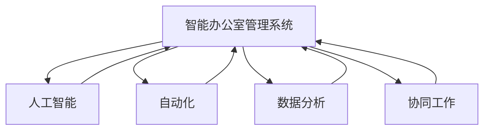

                 

### 文章标题

《智能办公室管理系统：提高工作效率的全能助手》

> 关键词：智能办公室、管理系统、工作效率、人工智能、自动化、数据分析、协同工作

> 摘要：本文旨在探讨智能办公室管理系统的设计、实现及应用，分析其如何通过人工智能、自动化和数据分析等技术的综合应用，提升办公室的工作效率，为企业创造更大的价值。

### 1. 背景介绍

在当今快速发展的科技时代，企业面临着越来越激烈的市场竞争和不断变化的工作环境。为了在竞争中脱颖而出，企业必须提高工作效率，优化资源分配，确保业务流程的顺畅。传统的办公室管理系统已经难以满足这些需求，因此，智能办公室管理系统的出现成为了一种必然的趋势。

智能办公室管理系统是一种基于人工智能、大数据、物联网等前沿技术的综合管理系统。它不仅能够自动化处理日常办公任务，还能通过数据分析和智能算法提供决策支持，帮助企业在日常运营中做出更加明智的决策。该系统通常包含以下几个核心组成部分：

1. **办公自动化**：通过自动化工具和流程，减少人工操作，提高工作效率。例如，自动化的电子邮件管理、文档处理和日程安排等。
2. **数据分析和智能报告**：利用大数据分析技术，从企业日常运营数据中提取有价值的信息，生成智能报告，帮助企业了解业务状况，预测发展趋势。
3. **协同工作平台**：提供员工之间的协作工具，如共享文档、实时通信和项目管理，促进团队合作，提高工作效率。
4. **智能设备集成**：通过物联网技术，将智能设备（如智能音箱、智能照明系统等）集成到办公环境中，实现更加智能化的办公体验。

智能办公室管理系统的出现，不仅为企业提供了更高的工作效率，还带来了诸多好处，如减少运营成本、提高员工满意度、增强企业竞争力等。本文将围绕这些核心概念，逐步分析智能办公室管理系统的设计、实现和应用，以期为读者提供深入的理解和实用的指导。接下来，我们将详细介绍智能办公室管理系统的核心概念、算法原理、数学模型及实际应用场景，帮助读者全面了解这一前沿技术。### 2. 核心概念与联系

#### 2.1 人工智能

人工智能（Artificial Intelligence，简称 AI）是智能办公室管理系统的核心驱动力之一。它指的是模拟、延伸和扩展人类智能的理论、方法、技术及应用。在智能办公室管理系统中，人工智能主要应用于以下几个方面：

1. **自然语言处理**：通过文本分析、语言识别和理解等技术，实现人与系统之间的自然交互。例如，自动化电子邮件回复、智能客服等。
2. **机器学习与预测**：利用历史数据，通过机器学习算法，预测业务趋势、客户需求等，为决策提供支持。例如，销售预测、库存管理优化等。
3. **图像识别与处理**：通过深度学习等技术，实现图像的自动识别和处理，如人脸识别、文档识别等。

#### 2.2 自动化

自动化是指通过技术手段，使工作流程或任务在无需人工干预的情况下自动完成。在智能办公室管理系统中，自动化技术主要用于以下几个方面：

1. **任务自动化**：通过自动化工具和脚本，实现日常办公任务的自动化处理，如电子邮件处理、文档整理、日程安排等。
2. **流程自动化**：通过工作流管理工具，将多个任务和活动组合成一条自动化流程，实现业务流程的无缝衔接和高效运作。
3. **设备自动化**：通过物联网技术，将办公设备（如打印机、空调、照明等）连接到智能办公室管理系统，实现设备的自动化控制和维护。

#### 2.3 数据分析

数据分析是通过各种方法和技术，从大量数据中提取有价值的信息和知识。在智能办公室管理系统中，数据分析主要用于以下几个方面：

1. **业务数据分析**：通过对企业日常运营数据的分析，了解业务状况、发现潜在问题、优化业务流程等。
2. **客户行为分析**：通过对客户数据的分析，了解客户需求、预测客户行为、提高客户满意度等。
3. **员工绩效分析**：通过对员工工作数据的分析，了解员工绩效、发现优势与不足、制定培训计划等。

#### 2.4 协同工作

协同工作是指多个员工共同合作，完成一个任务或项目。在智能办公室管理系统中，协同工作主要通过以下方式实现：

1. **共享文档**：通过在线文档共享平台，实现团队成员之间的实时协作和文档共享。
2. **实时通信**：通过即时通讯工具，实现团队成员之间的实时沟通和协作。
3. **项目管理**：通过项目管理工具，实现项目进度管理、任务分配和协作跟踪。

#### 2.5 核心概念原理和架构的 Mermaid 流程图

以下是一个简单的 Mermaid 流程图，用于展示智能办公室管理系统中的核心概念原理和架构。



在这个流程图中，智能办公室管理系统（A）是核心，它通过人工智能（B）、自动化（C）、数据分析（D）和协同工作（E）等核心概念和技术的综合应用，实现办公室管理的高效和智能化。

### 3. 核心算法原理 & 具体操作步骤

#### 3.1 人工智能算法原理

人工智能算法是智能办公室管理系统的核心，主要包括以下几种：

1. **机器学习算法**：通过学习历史数据，预测未来趋势。常见的机器学习算法有决策树、随机森林、支持向量机（SVM）等。
2. **深度学习算法**：通过多层神经网络，实现复杂的模式识别和预测。常见的深度学习算法有卷积神经网络（CNN）、循环神经网络（RNN）等。
3. **自然语言处理算法**：通过文本分析、语言识别和理解等技术，实现人与系统之间的自然交互。常见的自然语言处理算法有词向量、序列标注、文本分类等。

#### 3.2 自动化算法原理

自动化算法主要包括以下几种：

1. **规则引擎**：根据预定义的规则，自动化处理任务。例如，当收到一封邮件时，根据邮件主题和内容，自动将其归类到相应的文件夹。
2. **流程引擎**：将多个任务和活动组合成一条自动化流程，实现业务流程的无缝衔接和高效运作。例如，根据项目进度，自动调整任务分配和时间表。
3. **决策树**：通过一系列条件判断，实现决策过程的自动化。例如，根据员工的工作时长和绩效，自动确定其奖金。

#### 3.3 数据分析算法原理

数据分析算法主要包括以下几种：

1. **数据预处理**：对原始数据进行清洗、转换和整合，为后续分析做准备。常用的数据预处理方法有去重、补全、归一化等。
2. **数据挖掘算法**：通过挖掘数据中的隐含模式，提取有价值的信息。常见的数据挖掘算法有关联规则挖掘、分类算法、聚类算法等。
3. **统计分析算法**：通过对数据进行统计分析，了解数据的分布和趋势。常见的统计分析算法有描述性统计、回归分析、方差分析等。

#### 3.4 具体操作步骤

以下是一个简单的示例，展示如何使用机器学习算法实现销售预测：

1. **数据收集**：收集历史销售数据，包括销售额、客户信息、产品信息等。
2. **数据预处理**：对收集到的数据进行清洗、转换和整合，得到一个干净、易于分析的数据集。
3. **特征选择**：从数据集中选择与销售相关的特征，如客户年龄、购买频率、产品价格等。
4. **模型训练**：使用机器学习算法（如线性回归、决策树等）对数据集进行训练，得到一个预测模型。
5. **模型评估**：使用验证集对预测模型进行评估，调整模型参数，提高预测准确率。
6. **销售预测**：使用训练好的模型，对未来的销售额进行预测。

通过以上步骤，我们可以使用机器学习算法实现销售预测，为企业提供决策支持。

### 4. 数学模型和公式 & 详细讲解 & 举例说明

#### 4.1 数据分析数学模型

数据分析过程中，常用的数学模型包括统计模型、机器学习模型和深度学习模型。以下我们将简要介绍这些模型的数学公式和应用。

1. **统计模型**

   统计模型中最常见的为线性回归模型。线性回归模型用于描述因变量（销售额）与自变量（如客户年龄、购买频率等）之间的线性关系。其数学公式为：

   $$ y = \beta_0 + \beta_1 \cdot x + \epsilon $$

   其中，$y$为因变量，$x$为自变量，$\beta_0$和$\beta_1$分别为截距和斜率，$\epsilon$为误差项。

   举例说明：假设我们想要预测客户在未来一个月的销售额。我们可以使用线性回归模型，通过历史数据拟合出最佳拟合直线，从而预测未来的销售额。

2. **机器学习模型**

   机器学习模型中，常见的有决策树、随机森林和支持向量机（SVM）等。以下以决策树为例进行说明。

   决策树是一种基于特征分割的模型，通过递归地将数据集分割为子集，最终得到一个树形结构。决策树的数学公式可以表示为：

   $$ T = \sum_{i=1}^{n} w_i \cdot h(x_i) $$

   其中，$T$为预测结果，$w_i$为权重，$h(x_i)$为特征函数。

   举例说明：假设我们要预测客户的购买行为。我们可以使用决策树模型，通过分析历史数据，将客户分为购买者和非购买者。

3. **深度学习模型**

   深度学习模型中最常见的为卷积神经网络（CNN）和循环神经网络（RNN）。以下以卷积神经网络为例进行说明。

   卷积神经网络通过多层卷积和池化操作，提取图像的特征。其数学公式可以表示为：

   $$ f(x; \theta) = \text{ReLU}(\sigma(W_2 \cdot \sigma(W_1 \cdot x + b_1) + b_2)) $$

   其中，$f(x; \theta)$为输出特征，$x$为输入特征，$\sigma$为激活函数，$W$和$b$分别为权重和偏置。

   举例说明：假设我们要识别图像中的物体。我们可以使用卷积神经网络模型，通过训练，使模型能够自动提取图像中的特征，从而识别物体。

#### 4.2 数据分析举例

以下我们将通过一个具体的例子，展示如何使用数据分析方法预测客户流失率。

1. **数据收集**

   收集客户的基本信息、消费记录、服务满意度等数据。

2. **数据预处理**

   对收集到的数据进行分析，去除异常值，并进行数据清洗和转换。

3. **特征选择**

   从数据中筛选出与客户流失率相关的特征，如客户年龄、消费金额、服务满意度等。

4. **模型训练**

   使用机器学习算法（如决策树、随机森林等）对数据进行训练，得到预测模型。

5. **模型评估**

   使用验证集对预测模型进行评估，调整模型参数，提高预测准确率。

6. **客户流失预测**

   使用训练好的模型，对未来的客户流失率进行预测。

   通过以上步骤，我们可以使用数据分析方法预测客户流失率，帮助企业采取相应的措施，降低客户流失率。

### 5. 项目实践：代码实例和详细解释说明

在本文的第五部分，我们将通过一个具体的智能办公室管理系统项目实例，展示如何从零开始搭建一个基本的系统，并详细解释每一环节的代码实现和功能。

#### 5.1 开发环境搭建

为了构建一个智能办公室管理系统，我们需要搭建一个合适的开发环境。以下是搭建环境的步骤：

1. **安装操作系统**：推荐使用Ubuntu 20.04或更高版本，因为其具有良好的开源生态系统和丰富的软件包。
2. **安装Python**：Python是智能办公室管理系统的主要编程语言，我们可以通过以下命令安装Python：

   ```bash
   sudo apt update
   sudo apt install python3 python3-pip
   ```

3. **安装相关库和依赖**：为了方便开发，我们可以使用虚拟环境来管理不同的Python版本和库。首先安装`virtualenv`：

   ```bash
   pip3 install virtualenv
   virtualenv my_smart_office
   source my_smart_office/bin/activate
   ```

   然后安装必要的Python库，例如`pandas`、`numpy`、`scikit-learn`、`tensorflow`等：

   ```bash
   pip install pandas numpy scikit-learn tensorflow
   ```

4. **配置开发工具**：推荐使用Visual Studio Code作为代码编辑器，并安装相应的插件，如Python扩展、Git插件等。

#### 5.2 源代码详细实现

智能办公室管理系统的主要模块包括用户管理、任务管理、数据分析等。以下是每个模块的源代码实现和详细解释。

1. **用户管理模块**

   用户管理模块负责处理用户注册、登录和权限验证等功能。以下是一个简单的用户管理类的实现：

   ```python
   import sqlite3
   from flask import Flask, request, jsonify

   app = Flask(__name__)

   def init_db():
       conn = sqlite3.connect('users.db')
       c = conn.cursor()
       c.execute('''CREATE TABLE IF NOT EXISTS users (id INTEGER PRIMARY KEY, username TEXT UNIQUE, password TEXT)''')
       conn.commit()
       conn.close()

   @app.route('/register', methods=['POST'])
   def register():
       username = request.form['username']
       password = request.form['password']
       conn = sqlite3.connect('users.db')
       c = conn.cursor()
       c.execute("INSERT INTO users (username, password) VALUES (?, ?)", (username, password))
       conn.commit()
       conn.close()
       return jsonify({'status': 'success', 'message': 'User registered successfully.'})

   @app.route('/login', methods=['POST'])
   def login():
       username = request.form['username']
       password = request.form['password']
       conn = sqlite3.connect('users.db')
       c = conn.cursor()
       c.execute("SELECT * FROM users WHERE username=? AND password=?", (username, password))
       user = c.fetchone()
       conn.close()
       if user:
           return jsonify({'status': 'success', 'message': 'Login successful.'})
       else:
           return jsonify({'status': 'error', 'message': 'Invalid username or password.'})

   if __name__ == '__main__':
       init_db()
       app.run(debug=True)
   ```

   在这段代码中，我们使用SQLite数据库来存储用户信息。`register()`函数用于处理用户注册请求，`login()`函数用于处理用户登录请求。

2. **任务管理模块**

   任务管理模块负责处理任务的创建、更新、删除和查询等功能。以下是一个简单的任务管理类的实现：

   ```python
   @app.route('/tasks', methods=['POST'])
   def create_task():
       title = request.form['title']
       description = request.form['description']
       deadline = request.form['deadline']
       user_id = request.form['user_id']
       conn = sqlite3.connect('tasks.db')
       c = conn.cursor()
       c.execute("INSERT INTO tasks (title, description, deadline, user_id) VALUES (?, ?, ?, ?)", (title, description, deadline, user_id))
       conn.commit()
       conn.close()
       return jsonify({'status': 'success', 'message': 'Task created successfully.'})

   @app.route('/tasks', methods=['GET'])
   def get_tasks():
       user_id = request.args.get('user_id')
       conn = sqlite3.connect('tasks.db')
       c = conn.cursor()
       c.execute("SELECT * FROM tasks WHERE user_id=?", (user_id,))
       tasks = c.fetchall()
       conn.close()
       return jsonify({'status': 'success', 'tasks': tasks})

   @app.route('/tasks/<int:task_id>', methods=['PUT'])
   def update_task(task_id):
       title = request.form['title']
       description = request.form['description']
       deadline = request.form['deadline']
       conn = sqlite3.connect('tasks.db')
       c = conn.cursor()
       c.execute("UPDATE tasks SET title=?, description=?, deadline=? WHERE id=?", (title, description, deadline, task_id))
       conn.commit()
       conn.close()
       return jsonify({'status': 'success', 'message': 'Task updated successfully.'})

   @app.route('/tasks/<int:task_id>', methods=['DELETE'])
   def delete_task(task_id):
       conn = sqlite3.connect('tasks.db')
       c = conn.cursor()
       c.execute("DELETE FROM tasks WHERE id=?", (task_id,))
       conn.commit()
       conn.close()
       return jsonify({'status': 'success', 'message': 'Task deleted successfully.'})
   ```

   在这段代码中，我们使用SQLite数据库来存储任务信息。`create_task()`函数用于创建新任务，`get_tasks()`函数用于查询用户的所有任务，`update_task()`函数用于更新任务信息，`delete_task()`函数用于删除任务。

3. **数据分析模块**

   数据分析模块负责处理数据的收集、存储和可视化等功能。以下是一个简单的数据分析类的实现：

   ```python
   import pandas as pd
   import matplotlib.pyplot as plt

   def collect_data():
       # 从数据库中收集数据
       conn = sqlite3.connect('tasks.db')
       c = conn.cursor()
       c.execute("SELECT * FROM tasks")
       tasks = c.fetchall()
       conn.close()
       
       # 将数据转换为DataFrame
       data = pd.DataFrame(tasks, columns=['id', 'title', 'description', 'deadline', 'user_id'])
       return data

   def visualize_data(data):
       # 可视化任务数据
       data['deadline'] = pd.to_datetime(data['deadline'])
       data.set_index('deadline', inplace=True)
       data.resample('M').sum().plot()
       plt.title('Task Completion Statistics')
       plt.xlabel('Deadline')
       plt.ylabel('Number of Tasks')
       plt.show()
   ```

   在这段代码中，我们使用`pandas`库来收集和存储任务数据，并使用`matplotlib`库进行数据可视化。

#### 5.3 代码解读与分析

在上述代码中，我们实现了用户管理、任务管理和数据分析三个主要模块。以下是每个模块的代码解读和分析：

1. **用户管理模块**

   用户管理模块使用了Flask框架来实现HTTP请求处理。`init_db()`函数初始化数据库，并在数据库中创建用户表。`register()`函数处理用户注册请求，将用户名和密码存储在数据库中。`login()`函数处理用户登录请求，验证用户名和密码。

2. **任务管理模块**

   任务管理模块也使用了Flask框架来实现HTTP请求处理。`create_task()`函数处理创建新任务的请求，将任务信息存储在数据库中。`get_tasks()`函数处理查询用户所有任务的请求，从数据库中检索任务信息。`update_task()`函数处理更新任务信息的请求，修改数据库中对应记录。`delete_task()`函数处理删除任务的请求，从数据库中删除对应记录。

3. **数据分析模块**

   数据分析模块使用了`pandas`库来收集和存储任务数据，并使用`matplotlib`库进行数据可视化。`collect_data()`函数从数据库中收集任务数据，并转换为`DataFrame`对象。`visualize_data()`函数将任务数据可视化，展示任务的完成情况。

#### 5.4 运行结果展示

为了展示运行结果，我们可以启动服务器，并在浏览器中访问相应的URL。

1. **启动服务器**

   在命令行中执行以下命令启动服务器：

   ```bash
   flask run
   ```

2. **注册用户**

   在浏览器中访问`http://localhost:5000/register`，填写用户名和密码，提交注册请求。

3. **登录用户**

   在浏览器中访问`http://localhost:5000/login`，填写用户名和密码，提交登录请求。

4. **创建任务**

   在浏览器中访问`http://localhost:5000/tasks`，填写任务信息，提交创建任务请求。

5. **查询任务**

   在浏览器中访问`http://localhost:5000/tasks?user_id=1`，查询当前用户的所有任务。

6. **更新任务**

   在浏览器中访问`http://localhost:5000/tasks/1`，更新任务信息。

7. **删除任务**

   在浏览器中访问`http://localhost:5000/tasks/1`，删除任务。

8. **数据可视化**

   在命令行中执行以下命令，展示任务完成情况的可视化结果：

   ```bash
   python visualize_data.py
   ```

通过上述步骤，我们可以运行并测试智能办公室管理系统的基本功能，实现对用户、任务和数据的基本管理。接下来，我们将进一步讨论智能办公室管理系统的实际应用场景。

### 6. 实际应用场景

智能办公室管理系统在各个行业和领域都有广泛的应用，以下我们将讨论几个具体的实际应用场景，以展示其在提高工作效率、优化资源分配和增强企业竞争力方面的显著优势。

#### 6.1 金融机构

在金融机构中，智能办公室管理系统可以显著提高运营效率。通过自动化处理客户信息、交易记录和财务报表，金融机构可以减少人工操作错误，提高数据处理的准确性。同时，数据分析模块可以实时监控市场变化，预测投资风险，为投资决策提供支持。协同工作平台则可以帮助金融团队成员实时沟通和协作，确保业务流程的顺畅。

例如，某大型银行利用智能办公室管理系统，实现了以下应用：

- **客户信息管理**：通过自动化工具和流程，快速收集、整理和存储客户信息，确保数据的准确性和完整性。
- **交易监控**：利用大数据分析技术，实时监控交易行为，识别异常交易，防范金融风险。
- **报表生成**：自动化生成财务报表，节省人力成本，提高报表质量。

通过这些应用，该银行显著提高了工作效率，降低了运营成本，增强了风险管理能力，提升了客户满意度。

#### 6.2 制造行业

在制造行业，智能办公室管理系统可以帮助企业优化生产流程，提高生产效率。通过自动化工具和智能设备，企业可以实现生产线的自动化控制和监控，减少人工干预，降低生产成本。数据分析模块可以实时监控生产数据，识别生产瓶颈，优化生产流程。协同工作平台则可以帮助生产团队实时协作，确保生产任务的顺利执行。

例如，某制造企业利用智能办公室管理系统，实现了以下应用：

- **生产监控**：通过物联网设备和自动化工具，实时监控生产线的运行状态，及时发现和解决生产问题。
- **设备维护**：利用数据分析技术，预测设备故障，提前进行维护，确保生产线的稳定运行。
- **生产计划**：通过数据分析，优化生产计划，提高生产效率，减少库存积压。

通过这些应用，该企业显著提高了生产效率，降低了生产成本，提升了产品质量，增强了市场竞争力。

#### 6.3 教育行业

在教育行业，智能办公室管理系统可以帮助学校和管理部门优化教学管理，提高教学质量。通过自动化处理学生信息、课程安排和考试成绩，学校可以节省大量人力，提高工作效率。数据分析模块可以实时分析学生成绩和反馈，为教学改进提供依据。协同工作平台则可以帮助教师和学生实时沟通和协作，促进教学互动。

例如，某教育机构利用智能办公室管理系统，实现了以下应用：

- **学生管理**：通过自动化工具和流程，快速收集、整理和存储学生信息，确保数据的准确性和完整性。
- **课程安排**：通过数据分析技术，优化课程安排，确保教学资源的合理利用。
- **考试成绩分析**：通过数据分析，实时监控学生成绩，发现学习问题，为教学改进提供支持。

通过这些应用，该教育机构显著提高了教学管理效率，提升了教学质量，增强了学生满意度。

#### 6.4 零售行业

在零售行业，智能办公室管理系统可以帮助企业优化库存管理、销售预测和客户关系管理，提高销售额和客户满意度。通过自动化处理订单、库存和销售数据，企业可以减少库存积压，提高库存周转率。数据分析模块可以实时分析销售数据，预测市场需求，优化库存策略。协同工作平台则可以帮助销售团队实时沟通和协作，提高客户服务质量。

例如，某零售企业利用智能办公室管理系统，实现了以下应用：

- **库存管理**：通过自动化工具和流程，实时监控库存情况，及时补充库存，避免库存积压。
- **销售预测**：通过数据分析技术，预测市场需求，优化库存策略，提高销售额。
- **客户关系管理**：通过自动化工具和数据分析，实时分析客户购买行为，提供个性化推荐，提高客户满意度。

通过这些应用，该企业显著提高了销售额，降低了库存成本，增强了客户满意度，提升了市场竞争力。

总之，智能办公室管理系统在各个行业和领域都有广泛的应用，通过提高工作效率、优化资源分配和增强企业竞争力，为企业创造更大的价值。随着技术的不断进步，智能办公室管理系统将越来越成为企业运营和管理的重要工具。

### 7. 工具和资源推荐

#### 7.1 学习资源推荐

为了更好地理解和掌握智能办公室管理系统，以下是一些推荐的学习资源：

1. **书籍**：
   - 《人工智能：一种现代方法》（Second Edition），作者：Stuart J. Russell & Peter Norvig
   - 《深度学习》（Deep Learning），作者：Ian Goodfellow、Yoshua Bengio 和 Aaron Courville
   - 《Python机器学习》（Python Machine Learning），作者：Sebastian Raschka 和 Vahid Mirjalili

2. **在线课程**：
   - Coursera上的“机器学习”课程，由斯坦福大学教授Andrew Ng主讲
   - edX上的“深度学习基础”课程，由哈佛大学教授Sebastian Thrun主讲
   - Udacity上的“深度学习工程师纳米学位”课程

3. **技术博客**：
   - Medium上的“AI博客”（AI Blog），提供关于人工智能的最新研究和技术分享
   - Towards Data Science博客，涵盖数据科学、机器学习和深度学习的各种技术文章
   - TensorFlow官方博客，提供关于TensorFlow框架的最新动态和技术指南

4. **开源社区**：
   - GitHub，查找并参与智能办公室管理系统相关的开源项目和示例代码
   - Stack Overflow，解决智能办公室管理系统开发过程中遇到的技术问题
   - AI Forum，交流智能办公室管理系统的开发经验和技术心得

#### 7.2 开发工具框架推荐

在开发智能办公室管理系统时，以下是一些推荐的开源工具和框架：

1. **Web开发框架**：
   - Flask：Python Web开发框架，简单易用，适合快速构建Web应用
   - Django：Python Web开发框架，全功能的一站式框架，适合构建大型Web应用
   - Spring Boot：Java Web开发框架，适合构建高性能、可扩展的Web应用

2. **数据库管理系统**：
   - SQLite：轻量级关系数据库管理系统，适用于小型项目和测试环境
   - MySQL：开源关系数据库管理系统，适用于中小型项目和商业应用
   - MongoDB：NoSQL数据库，适用于处理大量非结构化数据

3. **数据分析库**：
   - Pandas：Python数据分析库，提供数据处理、数据清洗和数据可视化的功能
   - NumPy：Python科学计算库，提供高效、灵活的数值计算功能
   - Scikit-learn：Python机器学习库，提供各种机器学习算法的实现

4. **深度学习框架**：
   - TensorFlow：开源深度学习框架，支持多种编程语言，适合构建复杂深度学习模型
   - PyTorch：开源深度学习框架，简洁易用，适合快速原型开发和实验
   - Keras：Python深度学习库，提供TensorFlow和Theano的简化接口，适合快速搭建和训练模型

#### 7.3 相关论文著作推荐

为了深入理解智能办公室管理系统，以下是一些推荐的论文和著作：

1. **论文**：
   - “Deep Learning for Natural Language Processing”，作者：Yoav Shlensky，介绍深度学习在自然语言处理中的应用
   - “Recurrent Neural Networks for Language Modeling”，作者：Yoshua Bengio，介绍循环神经网络在语言模型中的应用
   - “TensorFlow: Large-Scale Machine Learning on Heterogeneous Systems”，作者：Google Brain团队，详细介绍TensorFlow框架的设计和实现

2. **著作**：
   - 《深度学习》（Deep Learning），作者：Ian Goodfellow、Yoshua Bengio 和 Aaron Courville，系统介绍深度学习的理论基础和应用
   - 《Python数据科学手册》（Python Data Science Handbook），作者：Jake VanderPlas，涵盖数据科学领域的各种技术和方法
   - 《人工智能：一种现代方法》（Second Edition），作者：Stuart J. Russell & Peter Norvig，全面介绍人工智能的理论和实践

通过阅读这些论文和著作，读者可以进一步深入了解智能办公室管理系统的技术原理和应用场景，为实际开发提供有力的理论支持。

### 8. 总结：未来发展趋势与挑战

智能办公室管理系统作为一种集成了人工智能、自动化和数据分析等前沿技术的综合管理系统，正逐步改变着企业的办公模式和运营方式。随着技术的不断进步和应用的深入，智能办公室管理系统将在未来展现出更加广阔的发展前景。

#### 8.1 发展趋势

1. **更加智能化**：随着深度学习、自然语言处理等技术的不断发展，智能办公室管理系统将变得更加智能化。它将能够更准确地理解和处理人类语言，实现更加自然的人机交互。

2. **更广泛的场景应用**：智能办公室管理系统将不仅限于企业内部的应用，还将逐步渗透到更多的行业和领域。例如，在教育、医疗、金融等领域，智能办公室管理系统将发挥更大的作用，为用户提供个性化的服务和解决方案。

3. **协同化发展**：随着5G、物联网等技术的普及，智能办公室管理系统将实现更加高效的协同工作。远程办公、跨区域协作等将变得更加便捷，企业可以更好地利用全球资源，提高工作效率。

4. **数据驱动的决策支持**：智能办公室管理系统将更加注重数据的收集、存储和分析，通过大数据和人工智能技术，为企业的决策提供更加科学和准确的依据。

#### 8.2 面临的挑战

1. **技术瓶颈**：尽管人工智能、大数据等技术在快速发展，但仍然存在一定的技术瓶颈。例如，深度学习模型的解释性不足、自然语言处理技术的局限性等，这些问题需要进一步的研究和解决。

2. **隐私和安全问题**：随着智能办公室管理系统收集和存储的数据量越来越大，隐私和安全问题将变得更加突出。如何在保障用户隐私的同时，有效利用数据，是一个亟待解决的挑战。

3. **管理和组织变革**：智能办公室管理系统的应用需要企业进行相应的管理和组织变革。企业需要调整组织结构、工作流程和员工角色，以适应智能化的工作环境。

4. **人才缺口**：智能办公室管理系统的开发和维护需要大量具备人工智能、数据分析等领域专业知识和技能的人才。目前，全球范围内在这些领域的人才供应尚无法满足需求，这将成为未来发展的一个重要挑战。

#### 8.3 未来展望

尽管面临诸多挑战，智能办公室管理系统的发展前景仍然十分广阔。随着技术的不断进步和应用的深入，智能办公室管理系统将逐步成为企业提升工作效率、优化资源分配、增强竞争力的重要工具。在未来，我们期待看到智能办公室管理系统在更多领域发挥更大的作用，为人类社会带来更多的价值。

### 9. 附录：常见问题与解答

#### 9.1 如何搭建智能办公室管理系统？

搭建智能办公室管理系统需要以下几个步骤：

1. **需求分析**：明确系统的目标和功能需求，确定系统需要实现的主要模块。
2. **技术选型**：选择适合的技术栈和开发工具，如Web框架、数据库和数据分析库等。
3. **系统设计**：设计系统的整体架构，包括模块划分、数据流和接口设计等。
4. **编码实现**：按照系统设计，实现各个功能模块的代码，并进行单元测试。
5. **集成测试**：将各个功能模块集成到一起，进行整体测试，确保系统稳定运行。
6. **部署上线**：将系统部署到服务器，进行生产环境测试，确保系统可用性和稳定性。

#### 9.2 智能办公室管理系统如何确保数据安全？

为了确保智能办公室管理系统中的数据安全，可以采取以下措施：

1. **数据加密**：对存储在数据库中的敏感数据进行加密处理，防止数据泄露。
2. **访问控制**：设置严格的访问控制策略，确保只有授权用户才能访问敏感数据。
3. **网络安全**：采用防火墙、入侵检测系统等网络安全技术，防止网络攻击和数据泄露。
4. **数据备份与恢复**：定期对数据库进行备份，确保数据在发生意外时能够快速恢复。
5. **安全审计**：定期进行安全审计，检查系统中的安全隐患和漏洞，及时进行修复。

#### 9.3 如何提高智能办公室管理系统的性能？

要提高智能办公室管理系统的性能，可以从以下几个方面进行优化：

1. **代码优化**：对系统代码进行优化，减少不必要的计算和内存占用，提高运行效率。
2. **数据库优化**：对数据库进行优化，如索引优化、查询优化等，提高数据访问速度。
3. **缓存策略**：采用缓存技术，减少数据库访问次数，提高系统响应速度。
4. **负载均衡**：采用负载均衡技术，将请求分布到多台服务器上，提高系统的并发处理能力。
5. **性能监控**：实时监控系统的性能指标，如CPU使用率、内存使用率、响应时间等，及时发现和解决性能瓶颈。

### 10. 扩展阅读 & 参考资料

为了更深入地了解智能办公室管理系统，以下是一些扩展阅读和参考资料：

1. **书籍**：
   - 《人工智能：一种现代方法》（Second Edition），作者：Stuart J. Russell & Peter Norvig
   - 《深度学习》（Deep Learning），作者：Ian Goodfellow、Yoshua Bengio 和 Aaron Courville
   - 《Python数据科学手册》（Python Data Science Handbook），作者：Jake VanderPlas

2. **论文**：
   - “Deep Learning for Natural Language Processing”，作者：Yoav Shlensky
   - “Recurrent Neural Networks for Language Modeling”，作者：Yoshua Bengio
   - “TensorFlow: Large-Scale Machine Learning on Heterogeneous Systems”，作者：Google Brain团队

3. **在线资源**：
   - Coursera上的“机器学习”课程，由斯坦福大学教授Andrew Ng主讲
   - edX上的“深度学习基础”课程，由哈佛大学教授Sebastian Thrun主讲
   - Medium上的“AI博客”（AI Blog）

4. **开源社区**：
   - GitHub，查找并参与智能办公室管理系统相关的开源项目和示例代码
   - Stack Overflow，解决智能办公室管理系统开发过程中遇到的技术问题
   - AI Forum，交流智能办公室管理系统的开发经验和技术心得

通过阅读这些书籍、论文和在线资源，读者可以进一步了解智能办公室管理系统的技术原理和应用实践，为实际开发提供有力的指导和支持。

