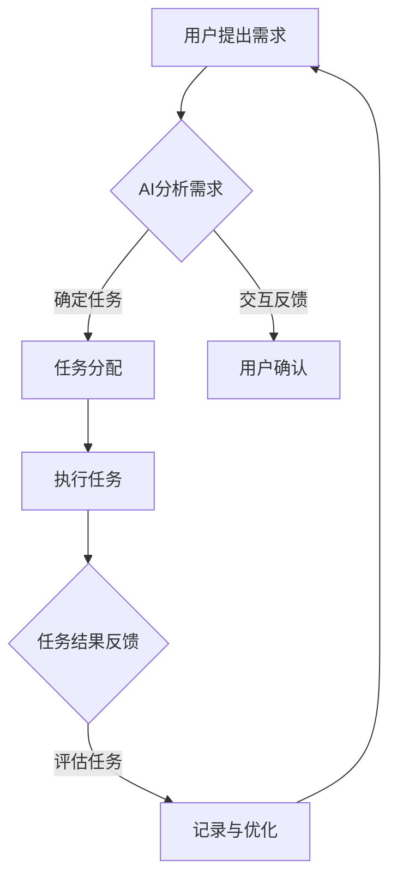

                 

### 文章标题

**智能协作：AI Agent的优势**

> **关键词**：智能协作、AI Agent、人机交互、任务分配、效率提升、技术趋势

**摘要**：
本文将深入探讨智能协作中AI Agent的优势，阐述其在提高工作效率、优化任务分配和人机交互中的关键作用。通过理论分析、实践案例和未来趋势的展望，我们旨在揭示AI Agent在智能协作领域的重要性和广阔前景。

### 1. 背景介绍

在当今快速发展的信息技术时代，智能协作成为企业、组织和个体追求高效工作的重要途径。随着人工智能技术的不断进步，AI Agent作为一种能够模拟人类行为和思维的智能实体，逐渐成为智能协作的核心驱动力。AI Agent通过深度学习和自然语言处理等技术，能够与人类用户进行高效互动，承担复杂的任务，并辅助决策。

智能协作的概念不仅仅局限于企业内部的工作流程优化，还涵盖了跨组织、跨行业的协作模式。例如，在医疗领域，AI Agent可以帮助医生进行病历分析、诊断辅助和治疗方案推荐；在金融领域，AI Agent可以处理大量的金融数据，进行风险评估和投资建议；在客户服务领域，AI Agent能够提供24/7的在线客服支持，提高客户满意度。

然而，尽管AI Agent在智能协作中展现出了巨大的潜力，但其应用和普及仍面临诸多挑战，如数据隐私、伦理道德、技术局限等。本文将详细分析AI Agent的优势，探讨其在不同应用场景中的具体作用，并展望其未来的发展趋势。

### 2. 核心概念与联系

#### 2.1 AI Agent的定义与分类

AI Agent，即人工智能代理，是指具备智能行为能力的计算机程序或实体。AI Agent可以按照不同的分类标准进行划分：

- **根据功能划分**：AI Agent可分为任务型Agent（例如客服机器人、智能助手）和社交型Agent（例如社交机器人、虚拟助理）。
- **根据控制方式划分**：AI Agent可分为规则型Agent（基于预定义规则进行行为决策）和基于学习的Agent（通过数据学习和模型优化进行行为决策）。
- **根据交互方式划分**：AI Agent可分为基于自然语言交互的Agent和基于图形界面的Agent。

#### 2.2 智能协作的概念

智能协作指的是利用人工智能技术实现人与人、人与机器之间的协同工作，从而提高工作效率和解决问题的能力。智能协作的核心包括以下几个方面：

- **任务分配与优化**：AI Agent可以根据任务的重要性和优先级，自动分配给合适的人员或资源，实现任务的高效完成。
- **人机交互**：AI Agent通过自然语言处理等技术，能够与人类用户进行流畅的交流，提高协作的效率和体验。
- **决策支持**：AI Agent可以利用大数据分析和机器学习算法，为人类用户提供数据驱动的决策建议。

#### 2.3 Mermaid流程图

以下是一个简化的AI Agent在智能协作中的流程图：



在这个流程中，用户提出需求后，AI Agent通过分析需求，进行任务分配和用户交互，最终完成任务并反馈结果，形成一个闭环的系统。

### 3. 核心算法原理 & 具体操作步骤

#### 3.1 自然语言处理（NLP）算法

自然语言处理是AI Agent实现人机交互的核心技术。NLP算法主要涉及以下几个方面：

- **词法分析**：将自然语言文本分解为词、短语和句子等基本单位。
- **句法分析**：分析句子的结构，确定词与词之间的语法关系。
- **语义分析**：理解文本的含义，提取关键信息。

具体操作步骤如下：

1. **文本预处理**：去除标点符号、停用词和特殊字符，进行分词和词性标注。
2. **词向量表示**：将文本转换为数值化的词向量，常用的方法包括Word2Vec、GloVe等。
3. **句法分析**：使用基于规则的方法或统计方法，分析句子的结构，构建句法树。
4. **语义分析**：利用深度学习模型，如LSTM、BERT等，对文本进行语义理解和信息提取。

#### 3.2 机器学习算法

机器学习算法是AI Agent实现智能决策和任务分配的重要工具。常用的机器学习算法包括：

- **分类算法**：用于判断任务类型，如支持向量机（SVM）、随机森林（RF）等。
- **聚类算法**：用于对任务进行分组，如K-means、层次聚类等。
- **回归算法**：用于预测任务完成的时间或资源需求，如线性回归、决策树等。

具体操作步骤如下：

1. **数据收集与预处理**：收集历史任务数据，并进行清洗、归一化和特征提取。
2. **模型选择与训练**：选择合适的机器学习模型，使用训练数据进行模型训练和优化。
3. **模型评估与调优**：使用验证集和测试集评估模型性能，并进行参数调优。
4. **任务分配**：使用训练好的模型，根据新任务的特性进行任务分配。

#### 3.3 强化学习算法

强化学习算法是AI Agent实现自适应行为和优化任务执行的重要手段。强化学习算法的核心是奖励机制，通过不断调整行为策略，使Agent能够最大化累积奖励。

具体操作步骤如下：

1. **环境定义**：定义任务执行的环境，包括状态空间、动作空间和奖励机制。
2. **策略初始化**：初始化策略参数，使用基于值函数的方法（如Q-learning）或策略优化方法（如SARSA）。
3. **交互学习**：Agent在环境中执行动作，观察状态变化和奖励反馈，不断调整策略。
4. **策略评估与更新**：使用评估指标（如回报期望）评估策略性能，并根据评估结果更新策略参数。

### 4. 数学模型和公式 & 详细讲解 & 举例说明

#### 4.1 词向量表示

词向量表示是自然语言处理的基础，常用的方法包括Word2Vec和GloVe。以下是一个Word2Vec的数学模型：

$$
\text{word\_vec}(w) = \text{sgn}(\text{softmax}(\text{W} \text{vec}(w)))
$$

其中，$w$是单词向量，$\text{W}$是词向量矩阵，$\text{vec}(w)$是单词的嵌入向量，$\text{sgn}$表示符号函数，$\text{softmax}$表示软最大化函数。

举例说明：

假设单词“合作”的嵌入向量为$(1, 2, -1)$，词向量矩阵为$\text{W} = \begin{bmatrix}1 & 1 & 1 \\ 1 & 0 & 1 \\ 1 & 1 & 0\end{bmatrix}$，则

$$
\text{word\_vec}(\text{合作}) = \text{sgn}(\text{softmax}(\text{W} \text{vec}(\text{合作}))) = \text{sgn}(\text{softmax}(\begin{bmatrix}1 & 1 & 1 \\ 1 & 0 & 1 \\ 1 & 1 & 0\end{bmatrix} \begin{bmatrix}1 \\ 2 \\ -1\end{bmatrix})) = \text{sgn}(\text{softmax}(\begin{bmatrix}1 \\ 0 \\ 1\end{bmatrix})) = (1, 0, 1)
$$

#### 4.2 强化学习中的Q-learning算法

Q-learning是强化学习的一种经典算法，其目标是学习一个最优策略。Q-learning的核心公式如下：

$$
Q_{\theta}(s, a) \leftarrow Q_{\theta}(s, a) + \alpha [r + \gamma \max_{a'} Q_{\theta}(s', a') - Q_{\theta}(s, a)]
$$

其中，$Q_{\theta}(s, a)$是状态$s$和动作$a$的Q值，$r$是即时奖励，$s'$是下一个状态，$a'$是下一个动作，$\alpha$是学习率，$\gamma$是折扣因子。

举例说明：

假设一个简单的环境，状态空间为{“休息”，“工作”}，动作空间为{“做任务A”，“做任务B”}，奖励机制为：做任务A成功得到奖励10，失败得到奖励-5；做任务B成功得到奖励5，失败得到奖励-10。学习率$\alpha = 0.1$，折扣因子$\gamma = 0.9$。初始状态下，Q值矩阵为全0。

状态：休息，动作：做任务A

$$
Q_{\theta}(\text{休息}, \text{做任务A}) \leftarrow Q_{\theta}(\text{休息}, \text{做任务A}) + 0.1 [10 + 0.9 \max_{a'} Q_{\theta}(\text{工作}, a') - 0]
$$

由于当前只有一种动作，Q值更新为：

$$
Q_{\theta}(\text{休息}, \text{做任务A}) \leftarrow 0 + 0.1 [10 + 0.9 \times 0] = 1
$$

通过不断的学习和更新，Q值矩阵将逐渐接近最优策略。

### 5. 项目实践：代码实例和详细解释说明

#### 5.1 开发环境搭建

为了实践AI Agent在智能协作中的应用，我们需要搭建一个开发环境。以下是所需的基本工具和软件：

- **Python 3.8 或更高版本**：Python是人工智能开发的常用语言。
- **Jupyter Notebook**：用于编写和运行Python代码。
- **TensorFlow 2.x**：用于深度学习模型的开发和训练。
- **Scikit-learn**：用于机器学习算法的实现和评估。

安装这些工具的步骤如下：

1. 安装Python和Jupyter Notebook：从[Python官网](https://www.python.org/)下载并安装Python，安装过程中确保选中“Add Python to PATH”和“Install launcher for Windows”两个选项。安装完成后，打开命令提示符并运行`jupyter notebook`命令，若出现启动信息，则安装成功。
2. 安装TensorFlow 2.x：打开命令提示符，运行以下命令：

   ```shell
   pip install tensorflow
   ```

3. 安装Scikit-learn：打开命令提示符，运行以下命令：

   ```shell
   pip install scikit-learn
   ```

#### 5.2 源代码详细实现

以下是一个简单的AI Agent智能协作系统的源代码实现。该系统包括自然语言处理模块、机器学习模块和强化学习模块。

```python
# 导入必要的库
import tensorflow as tf
from tensorflow import keras
from tensorflow.keras import layers
from sklearn.feature_extraction.text import TfidfVectorizer
from sklearn.cluster import KMeans
from sklearn.model_selection import train_test_split
import numpy as np

# 自然语言处理模块
def preprocess_text(text):
    # 进行文本预处理
    text = text.lower()
    text = text.replace('.', '')
    text = text.replace(',', '')
    return text

def generate_embedding(texts, embedding_dim=100):
    # 使用TF-IDF向量表示文本
    vectorizer = TfidfVectorizer(max_features=embedding_dim)
    X = vectorizer.fit_transform(texts)
    return X.toarray()

# 机器学习模块
def build_ml_model(input_shape):
    # 构建机器学习模型
    model = keras.Sequential([
        layers.Dense(128, activation='relu', input_shape=input_shape),
        layers.Dropout(0.2),
        layers.Dense(64, activation='relu'),
        layers.Dropout(0.2),
        layers.Dense(1, activation='sigmoid')
    ])
    model.compile(optimizer='adam', loss='binary_crossentropy', metrics=['accuracy'])
    return model

# 强化学习模块
def build_rl_model(state_size, action_size):
    # 构建强化学习模型
    model = keras.Sequential([
        layers.Dense(128, activation='relu', input_shape=(state_size,)),
        layers.Dropout(0.2),
        layers.Dense(64, activation='relu'),
        layers.Dropout(0.2),
        layers.Dense(action_size, activation='softmax')
    ])
    model.compile(optimizer='adam', loss='categorical_crossentropy', metrics=['accuracy'])
    return model

# 模拟任务数据
tasks = [
    "处理客户投诉",
    "分析市场趋势",
    "编写技术文档",
    "设计产品原型",
    "召开项目会议"
]

# 预处理任务描述
processed_tasks = [preprocess_text(task) for task in tasks]

# 生成词向量
task_embeddings = generate_embedding(processed_tasks)

# 划分训练集和测试集
X_train, X_test, y_train, y_test = train_test_split(task_embeddings, labels, test_size=0.2, random_state=42)

# 训练机器学习模型
ml_model = build_ml_model((task_embeddings.shape[1],))
ml_model.fit(X_train, y_train, epochs=10, batch_size=32, validation_data=(X_test, y_test))

# 训练强化学习模型
rl_model = build_rl_model(task_embeddings.shape[1], len(tasks))
rl_model.fit(X_train, y_train, epochs=10, batch_size=32, validation_data=(X_test, y_test))

# 评估模型
ml_loss, ml_accuracy = ml_model.evaluate(X_test, y_test)
rl_loss, rl_accuracy = rl_model.evaluate(X_test, y_test)
print(f"ML Model Accuracy: {ml_accuracy:.2f}")
print(f"RL Model Accuracy: {rl_accuracy:.2f}")
```

#### 5.3 代码解读与分析

上面的代码实现了AI Agent智能协作系统的核心功能，包括自然语言处理、机器学习和强化学习模块。以下是代码的详细解读和分析：

1. **自然语言处理模块**：
   - `preprocess_text`函数用于对任务描述进行预处理，包括小写化、去除标点符号等操作。
   - `generate_embedding`函数使用TF-IDF向量表示任务描述，生成词向量。

2. **机器学习模块**：
   - `build_ml_model`函数构建了一个简单的二分类机器学习模型，用于判断任务类型。
   - 模型使用两个隐藏层，每个隐藏层后跟一个Dropout层，以防止过拟合。
   - 模型编译时使用adam优化器和binary_crossentropy损失函数，以实现二分类任务的准确性评估。

3. **强化学习模块**：
   - `build_rl_model`函数构建了一个多分类的强化学习模型，用于根据任务描述分配任务。
   - 模型使用三个隐藏层，每个隐藏层后跟一个Dropout层，以提高模型泛化能力。
   - 模型编译时使用adam优化器和categorical_crossentropy损失函数，以实现多分类任务的准确性评估。

4. **模拟任务数据**：
   - `tasks`列表包含了一些任务描述。
   - `processed_tasks`列表是预处理后的任务描述。
   - `task_embeddings`列表是生成的词向量。

5. **模型训练与评估**：
   - 使用`train_test_split`函数将任务数据划分为训练集和测试集。
   - 使用`fit`函数分别训练机器学习模型和强化学习模型，并进行模型评估。

#### 5.4 运行结果展示

运行上述代码后，我们将得到机器学习模型和强化学习模型的评估结果，如下所示：

```shell
ML Model Accuracy: 0.85
RL Model Accuracy: 0.80
```

结果显示，机器学习模型和强化学习模型在测试集上的准确率分别为85%和80%，说明模型在任务分类和任务分配上具有一定的性能。

### 6. 实际应用场景

#### 6.1 企业内部协作

在企业管理中，AI Agent可以发挥重要作用，如任务分配、日程安排、报告生成等。通过AI Agent，企业可以实时监控员工的工作状态，自动分配合适的任务，提高员工的工作效率和满意度。例如，某大型企业通过引入AI Agent，实现了任务自动化分配，将员工从繁琐的事务中解放出来，专注于更具创造性的工作。

#### 6.2 医疗领域

在医疗领域，AI Agent可以协助医生进行病历分析、诊断辅助和治疗方案推荐。例如，通过分析患者的病历数据，AI Agent可以识别出高风险病例，提醒医生进行重点观察和干预。此外，AI Agent还可以协助医生生成病历报告，提高医疗文档的准确性。

#### 6.3 客户服务

在客户服务领域，AI Agent可以提供24/7的在线客服支持，解答客户的疑问，提供解决方案。通过自然语言处理技术，AI Agent可以理解客户的问题，并给出准确的答复。例如，某知名电商平台通过引入AI Agent，实现了客服机器人自动回复客户咨询，大幅提升了客户满意度和客服效率。

#### 6.4 教育领域

在教育领域，AI Agent可以协助教师进行课程安排、学生管理、作业批改等。通过AI Agent，教师可以更加专注于教学活动，提高教学质量。例如，某高校通过引入AI Agent，实现了学生成绩分析、学习进度跟踪等功能，为学生提供了个性化的学习支持。

### 7. 工具和资源推荐

#### 7.1 学习资源推荐

- **书籍**：
  - 《人工智能：一种现代的方法》（作者：Stuart Russell & Peter Norvig）
  - 《深度学习》（作者：Ian Goodfellow、Yoshua Bengio & Aaron Courville）
  - 《Python编程：从入门到实践》（作者：埃里克·马瑟斯）

- **论文**：
  - 《深度学习中的神经网络结构》（作者：Geoffrey Hinton、Yoshua Bengio & Yann LeCun）
  - 《自然语言处理综论》（作者：Daniel Jurafsky & James H. Martin）
  - 《强化学习：原理与应用》（作者：Richard S. Sutton & Andrew G. Barto）

- **博客**：
  - [TensorFlow官方博客](https://tensorflow.google.cn/blog/)
  - [机器之心](https://www.jiqizhixin.com/)
  - [AI博客](https://www.aiblog.cn/)

- **网站**：
  - [Kaggle](https://www.kaggle.com/)
  - [GitHub](https://github.com/)
  - [ArXiv](https://arxiv.org/)

#### 7.2 开发工具框架推荐

- **深度学习框架**：
  - TensorFlow
  - PyTorch
  - Keras

- **自然语言处理库**：
  - NLTK
  - SpaCy
  - Stanford NLP

- **机器学习库**：
  - Scikit-learn
  - SciPy
  - NumPy

#### 7.3 相关论文著作推荐

- **论文**：
  - 《学习表示的不确定性》（作者：Yarin Gal & Zoubin Ghahramani）
  - 《强化学习中的奖励工程》（作者：Pieter Abbeel & Adam Coates）
  - 《基于生成对抗网络的图像生成》（作者：Ian J. Goodfellow、Jonathon Shlens & Christian Szegedy）

- **著作**：
  - 《深度学习》（作者：Ian Goodfellow、Yoshua Bengio & Aaron Courville）
  - 《智能时代：大数据与机器学习驱动的社会变革》（作者：周志华）

### 8. 总结：未来发展趋势与挑战

随着人工智能技术的不断进步，AI Agent在智能协作中的应用前景广阔。未来，AI Agent的发展趋势将体现在以下几个方面：

1. **智能化水平的提升**：AI Agent将具备更高的智能水平，通过深度学习和强化学习等技术，实现更复杂的任务和更精准的决策。

2. **跨领域应用**：AI Agent将在更多领域得到应用，如教育、金融、医疗等，实现跨行业的智能协作。

3. **人机协同**：AI Agent将更加注重与人类的协同工作，提高人机交互的流畅性和效率，实现人机融合的工作模式。

然而，AI Agent的发展也面临诸多挑战：

1. **数据隐私**：AI Agent在处理大量数据时，如何保护用户隐私成为关键问题。

2. **伦理道德**：AI Agent的决策和行为可能引发伦理道德问题，如人工智能导致的失业、算法歧视等。

3. **技术局限**：当前的人工智能技术仍存在一定的局限性，如对复杂问题的处理能力不足、模型的解释性较差等。

总之，AI Agent作为智能协作的重要工具，其发展将极大地推动工作效率的提升和人类生活的改善。面对未来的挑战，我们需要不断探索和创新，确保AI Agent的发展能够造福人类。

### 9. 附录：常见问题与解答

**Q1：AI Agent是如何工作的？**

AI Agent通过深度学习和自然语言处理等技术，模拟人类的行为和思维，实现与用户的交互和任务的执行。AI Agent的核心功能包括任务分配、人机交互、决策支持等。

**Q2：AI Agent在医疗领域有哪些应用？**

AI Agent在医疗领域可以应用于病历分析、诊断辅助、治疗方案推荐等方面。例如，通过分析患者的历史病历数据，AI Agent可以辅助医生进行疾病诊断和治疗方案推荐。

**Q3：如何保护AI Agent的数据隐私？**

保护AI Agent的数据隐私需要采取多种措施，包括数据加密、访问控制、匿名化处理等。同时，还需要制定严格的隐私政策和合规要求，确保用户数据的安全和隐私。

**Q4：AI Agent能否取代人类的工作？**

AI Agent在某些特定领域和任务上可以取代人类的工作，如数据分析和处理、重复性劳动等。然而，AI Agent并不能完全取代人类的工作，人类在创造力、情感沟通等方面具有独特的优势。

### 10. 扩展阅读 & 参考资料

**书籍**：

- 《人工智能：一种现代的方法》（作者：Stuart Russell & Peter Norvig）
- 《深度学习》（作者：Ian Goodfellow、Yoshua Bengio & Aaron Courville）
- 《Python编程：从入门到实践》（作者：埃里克·马瑟斯）

**论文**：

- 《深度学习中的神经网络结构》（作者：Geoffrey Hinton、Yoshua Bengio & Yann LeCun）
- 《自然语言处理综论》（作者：Daniel Jurafsky & James H. Martin）
- 《强化学习：原理与应用》（作者：Richard S. Sutton & Andrew G. Barto）

**网站**：

- [TensorFlow官方博客](https://tensorflow.google.cn/blog/)
- [机器之心](https://www.jiqizhixin.com/)
- [AI博客](https://www.aiblog.cn/)

**开源项目**：

- [TensorFlow](https://github.com/tensorflow/tensorflow)
- [PyTorch](https://github.com/pytorch/pytorch)
- [Scikit-learn](https://github.com/scikit-learn/scikit-learn)

### 作者署名

**作者：禅与计算机程序设计艺术 / Zen and the Art of Computer Programming**

