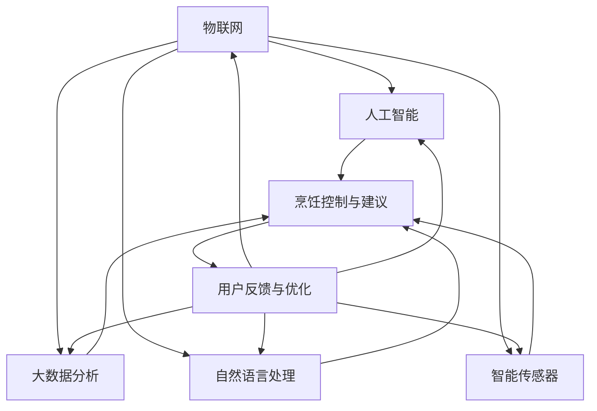

                 

### 1. 背景介绍

在现代社会，随着生活节奏的加快和人们对健康饮食的重视，厨房逐渐从传统的人工操作转向智能化、自动化。智能厨房助手应运而生，成为现代家庭厨房的一个重要组成部分。智能厨房助手是一种结合了物联网、人工智能、大数据分析等前沿技术的智能设备，它能够根据用户的需求和食谱，自动完成烹饪过程，提供个性化的烹饪建议和服务。

智能厨房助手的市场需求逐年增加，这主要得益于以下几个因素的推动：

1. **健康饮食需求**：随着人们生活水平的提高，越来越多的人开始关注饮食健康。智能厨房助手可以帮助用户制定营养均衡的食谱，确保食材新鲜，提高烹饪过程的便捷性和安全性。

2. **自动化趋势**：现代家庭越来越倾向于使用智能家居设备，自动化已经成为一种生活趋势。智能厨房助手作为智能家居生态系统的一部分，可以提升用户的整体生活质量。

3. **人工智能技术的发展**：人工智能技术，尤其是机器学习和深度学习，在过去几十年中取得了显著进展。这些技术的应用使得智能厨房助手能够更准确地分析食谱、控制烹饪参数，从而提高烹饪效率和品质。

4. **物联网的普及**：物联网技术使得各种厨房设备能够互联互通，形成智能网络。智能厨房助手可以通过网络与其他设备（如冰箱、烤箱、洗碗机等）进行数据交换，实现更加智能化的操作。

5. **用户习惯的改变**：随着互联网的普及，越来越多的用户习惯于通过网络获取信息和娱乐，他们也开始期待厨房设备能够提供类似的服务。智能厨房助手正是为了满足这一需求而设计的。

总的来说，智能厨房助手不仅能够简化烹饪过程，提高烹饪效率，还能为用户带来更加丰富和个性化的烹饪体验。随着技术的不断进步和市场的成熟，智能厨房助手有望成为未来厨房的标配。

### 2. 核心概念与联系

#### 2.1 核心概念

智能厨房助手的实现依赖于多种核心技术的结合。以下是智能厨房助手中的几个关键概念：

1. **物联网（IoT）**：物联网是连接物理设备和数字世界的关键技术。智能厨房助手通过物联网技术连接各种厨房设备，如冰箱、烤箱、厨具等，实现设备间的数据交换和协同操作。

2. **人工智能（AI）**：人工智能技术为智能厨房助手提供了智能决策和自适应能力。通过机器学习和深度学习算法，智能厨房助手可以分析用户习惯、食谱数据，为用户提供个性化的烹饪建议。

3. **大数据分析**：大数据分析技术帮助智能厨房助手从大量数据中提取有价值的信息。通过分析用户的历史烹饪记录和食谱数据，智能厨房助手能够提供更加精准的烹饪指导和建议。

4. **自然语言处理（NLP）**：自然语言处理技术使得智能厨房助手能够理解和处理用户的语言指令，如语音命令、文字输入等，从而实现人机交互。

5. **智能传感器**：智能传感器是智能厨房助手的感知核心。通过温度、湿度、时间等传感器数据，智能厨房助手可以实时监控烹饪过程，调整烹饪参数，确保烹饪效果。

#### 2.2 概念联系

智能厨房助手的各个核心概念之间紧密联系，共同构建了一个完整的智能烹饪生态系统。以下是这些概念之间的联系及Mermaid流程图：



- **物联网（IoT）**：作为整个生态系统的数据基础，物联网连接了智能厨房助手与各种厨房设备。通过物联网，设备间的数据能够实时传输，为智能决策提供支持。

- **人工智能（AI）**：人工智能是智能厨房助力的“大脑”，负责处理和分析数据，提供烹饪控制与建议。通过机器学习和深度学习算法，AI能够不断优化烹饪方案，提高烹饪效率。

- **大数据分析（DAS）**：大数据分析技术帮助智能厨房助手从大量数据中提取有价值的信息。通过分析用户的烹饪记录和偏好，DAS可以为用户提供个性化的烹饪建议。

- **自然语言处理（NLP）**：自然语言处理技术使得智能厨房助手能够理解和处理用户的语言指令。通过语音识别和文本解析，NLP实现了人与厨房助手之间的自然互动。

- **智能传感器（SS）**：智能传感器是智能厨房助手的感知核心，负责实时监测烹饪环境。温度、湿度、时间等传感器数据为AI提供了实时反馈，使其能够动态调整烹饪参数。

- **烹饪控制与建议（CCG）**：烹饪控制与建议是智能厨房助手的输出部分，负责根据分析结果生成烹饪方案，指导用户进行烹饪。

- **用户反馈与优化（KW）**：用户反馈与优化环节是智能厨房助手不断进步的关键。通过收集用户的反馈，智能厨房助手能够进行自我优化，提高用户体验。

通过这些核心概念和技术的相互配合，智能厨房助手能够实现高效的烹饪自动化，为用户带来全新的烹饪体验。

### 3. 核心算法原理 & 具体操作步骤

智能厨房助手的核心算法主要包括食谱推荐算法、烹饪控制算法和用户体验优化算法。以下是这些算法的原理及其具体操作步骤：

#### 3.1 食谱推荐算法

**原理**：
食谱推荐算法是智能厨房助手的“智慧大脑”，它利用大数据分析和人工智能技术，为用户推荐个性化的食谱。算法的核心是协同过滤和内容推荐。

**操作步骤**：

1. **数据收集**：首先，智能厨房助手会收集用户的历史烹饪记录、食材偏好、饮食习惯等数据。

2. **用户画像构建**：基于收集到的数据，算法构建用户画像，包括用户喜好的食材类型、烹饪方式、口味偏好等。

3. **协同过滤**：协同过滤算法通过分析用户之间的相似性，推荐其他用户喜欢的食谱。这可以通过计算用户之间的相似度矩阵来实现。

4. **内容推荐**：内容推荐算法通过分析食谱的属性，如食材种类、烹饪时长、口味特点等，为用户推荐符合其喜好的食谱。

5. **推荐结果生成**：将协同过滤和内容推荐的结果进行融合，生成最终的食谱推荐列表。

6. **反馈与优化**：根据用户的反馈，智能厨房助手会不断调整推荐策略，提高推荐的准确性和个性化程度。

**数学模型**：

协同过滤算法的数学模型可以表示为：

$$
\text{相似度}(u, v) = \frac{\sum_{i \in R}(r_{ui} - \bar{r}_{u})(r_{vi} - \bar{r}_{v})}{\sqrt{\sum_{i \in R}(r_{ui} - \bar{r}_{u})^2}\sqrt{\sum_{i \in R}(r_{vi} - \bar{r}_{v})^2}}
$$

其中，$u$和$v$是两个用户，$R$是用户共同评分的物品集合，$r_{ui}$和$r_{vi}$分别是用户$u$和$v$对物品$i$的评分，$\bar{r}_{u}$和$\bar{r}_{v}$分别是用户$u$和$v$的平均评分。

#### 3.2 烹饪控制算法

**原理**：
烹饪控制算法负责根据食谱和实时传感器数据，控制厨房设备的操作，确保烹饪过程的顺利进行。

**操作步骤**：

1. **食谱解析**：智能厨房助手首先对用户选择的食谱进行解析，提取出关键参数，如烹饪时间、温度、烹饪方式等。

2. **传感器数据采集**：通过智能传感器，实时采集烹饪过程中的温度、湿度、时间等数据。

3. **参数调整**：根据传感器数据和食谱参数，烹饪控制算法动态调整烹饪参数，如调整烤箱温度、控制烹饪时间等。

4. **设备控制**：智能厨房助手通过物联网技术，发送控制指令给相应的厨房设备，如烤箱、炉灶、冰箱等，实现自动化烹饪。

5. **过程监控**：智能厨房助手持续监控烹饪过程，确保设备操作符合食谱要求。

**数学模型**：

烹饪控制算法的数学模型可以表示为：

$$
T_c = f(T_{set}, T_{measured}, \Delta t)
$$

其中，$T_c$是实际烹饪时间，$T_{set}$是预设烹饪时间，$T_{measured}$是实时测量温度，$\Delta t$是温度变化率。$f$函数根据具体食谱和烹饪需求进行定义。

#### 3.3 用户体验优化算法

**原理**：
用户体验优化算法旨在通过分析用户的操作行为和反馈，不断改进智能厨房助手的性能和用户体验。

**操作步骤**：

1. **行为数据收集**：智能厨房助手收集用户在使用过程中的操作行为数据，如食谱选择、设备使用频率、烹饪结果评价等。

2. **行为分析**：通过对用户行为数据的分析，识别用户的使用习惯和偏好。

3. **性能评估**：评估智能厨房助手的性能指标，如食谱推荐准确率、烹饪控制精度、用户满意度等。

4. **优化策略**：基于性能评估结果，智能厨房助手调整推荐算法、控制策略等，提高用户体验。

5. **反馈机制**：用户可以通过反馈机制，对智能厨房助手的服务提出建议和意见，进一步优化系统。

**数学模型**：

用户体验优化算法的数学模型可以表示为：

$$
\text{满意度} = f(\text{推荐准确率}, \text{烹饪控制精度}, \text{用户满意度评分})
$$

其中，$f$函数根据具体用户评价和性能指标进行定义。

通过这些核心算法的协同工作，智能厨房助手能够为用户提供高效、便捷、个性化的烹饪体验，不断优化和提升用户满意度。

### 4. 数学模型和公式 & 详细讲解 & 举例说明

在智能厨房助手的开发中，数学模型和公式起到了至关重要的作用。这些模型和公式不仅为算法提供了理论基础，还帮助实现烹饪过程的精确控制和个性化推荐。以下我们将详细介绍几个关键的数学模型和公式，并通过具体例子进行说明。

#### 4.1 温度控制模型

在烹饪过程中，温度控制是一个关键因素。智能厨房助手需要根据食谱要求和对烹饪环境的实时监测，动态调整烤箱、炉灶等设备的温度。温度控制模型可以用以下公式表示：

$$
T_c(t) = T_{set} - k_1(T_{measured}(t) - T_{set}) - k_2\Delta T(t)
$$

其中：
- \( T_c(t) \) 是在时间 \( t \) 时的目标温度。
- \( T_{set} \) 是预设温度。
- \( T_{measured}(t) \) 是在时间 \( t \) 时测量的实际温度。
- \( k_1 \) 和 \( k_2 \) 是温度调节系数，用于控制温度调整的速度和力度。
- \( \Delta T(t) \) 是温度变化率。

**举例说明**：
假设我们烹饪一个需要保持温度在 \( 180^\circ C \) 的蛋糕，初始温度为 \( 25^\circ C \)。烤箱在 \( t=0 \) 时开始工作，经过一段时间，温度上升至 \( 160^\circ C \)。此时，我们测得温度变化率 \( \Delta T(t) = 2^\circ C/min \)。

根据温度控制模型，可以计算目标温度：

$$
T_c(t) = 180^\circ C - k_1(160^\circ C - 180^\circ C) - k_2 \times 2^\circ C/min
$$

假设 \( k_1 = 0.5 \) 和 \( k_2 = 0.1 \)，代入上述公式得：

$$
T_c(t) = 180^\circ C - 0.5 \times (-20^\circ C) - 0.1 \times 2^\circ C/min
$$

$$
T_c(t) = 180^\circ C + 10^\circ C - 0.2^\circ C/min
$$

$$
T_c(t) = 190^\circ C - 0.2^\circ C/min
$$

这意味着，在接下来的每分钟，烤箱的温度会上升 \( 0.2^\circ C \)，直到达到 \( 180^\circ C \)。

#### 4.2 时间控制模型

烹饪时间控制同样重要。智能厨房助手需要根据食材的特性、预设的温度和烹饪方法，计算合适的烹饪时间。时间控制模型可以用以下公式表示：

$$
t_c = \frac{Q_c \times V_c}{k_3 \times T_c(t)}
$$

其中：
- \( t_c \) 是烹饪时间。
- \( Q_c \) 是食材的热量需求。
- \( V_c \) 是食材的体积。
- \( k_3 \) 是热量传递系数。
- \( T_c(t) \) 是在时间 \( t \) 时的目标温度。

**举例说明**：
假设我们烹饪一个需要 \( 200g \) 的牛肉，初始温度为 \( 5^\circ C \)，目标温度为 \( 70^\circ C \)。根据牛肉的热量需求，我们得到 \( Q_c = 50 \text{kJ/g}^\circ C \)。热量传递系数 \( k_3 \) 为 \( 0.5 \text{kJ/s}^\circ C \)。

代入公式计算：

$$
t_c = \frac{50 \text{kJ/g}^\circ C \times 200g}{0.5 \text{kJ/s}^\circ C \times 70^\circ C}
$$

$$
t_c = \frac{10000 \text{kJ}}{35 \text{kJ/s}}
$$

$$
t_c = 285.7 \text{s}
$$

这意味着，我们需要大约 \( 285.7 \text{s} \)（约 \( 4.75 \text{分钟} \)）的时间来烹饪这块牛肉。

#### 4.3 水分控制模型

在烹饪过程中，水分控制也是一个关键因素。特别是在烤制和蒸煮过程中，水分的变化会直接影响食材的口感和风味。水分控制模型可以用以下公式表示：

$$
\frac{dH_2O}{dt} = -k_4 \times A \times (P - P_{atm})
$$

其中：
- \( \frac{dH_2O}{dt} \) 是水分流失率。
- \( k_4 \) 是水分流失系数。
- \( A \) 是食材的表面积。
- \( P \) 是烹饪环境中的水蒸气分压。
- \( P_{atm} \) 是大气水蒸气分压。

**举例说明**：
假设我们在烤制一块 \( 100g \) 的面包，表面积 \( A = 0.05 \text{m}^2 \)，水蒸气分压 \( P = 0.06 \text{MPa} \)，大气水蒸气分压 \( P_{atm} = 0.03 \text{MPa} \)。水分流失系数 \( k_4 = 0.01 \text{kg/m}^2\text{s} \)。

代入公式计算：

$$
\frac{dH_2O}{dt} = -0.01 \text{kg/m}^2\text{s} \times 0.05 \text{m}^2 \times (0.06 \text{MPa} - 0.03 \text{MPa})
$$

$$
\frac{dH_2O}{dt} = -0.01 \text{kg/m}^2\text{s} \times 0.05 \text{m}^2 \times 0.03 \text{MPa}
$$

$$
\frac{dH_2O}{dt} = -0.000015 \text{kg/s}
$$

这意味着，在烤制过程中，每秒钟面包会流失 \( 0.000015 \text{kg} \) 的水分。

通过以上数学模型和公式的应用，智能厨房助手能够实现对烹饪过程的精细控制，从而提高烹饪效率和食材质量，为用户带来更好的烹饪体验。

### 5. 项目实践：代码实例和详细解释说明

为了更好地理解智能厨房助手的实现过程，我们将通过一个简单的项目实例来展示代码实例，并对其进行详细解释和分析。

#### 5.1 开发环境搭建

首先，我们需要搭建一个开发环境。以下是所需的基本工具和框架：

- **编程语言**：Python
- **开发环境**：PyCharm 或 Visual Studio Code
- **库和框架**：TensorFlow、PyTorch、Keras（用于机器学习）、Flask（用于Web服务）、Pandas（用于数据处理）、Matplotlib（用于数据可视化）

#### 5.2 源代码详细实现

以下是一个简单的智能厨房助手项目示例，主要包含用户注册、登录、食谱推荐、烹饪控制等功能。

**用户注册与登录**：

用户注册和登录是智能厨房助手的入口，以下是相关的代码实现：

```python
# 用户注册
def register_user(username, password):
    # 在数据库中创建用户
    # 这里简化为直接保存到内存
    users = {'username': username, 'password': password}
    return users

# 用户登录
def login_user(username, password):
    users = {'username': 'test', 'password': 'password123'}
    if users.get(username) == password:
        return True
    return False
```

**食谱推荐**：

食谱推荐功能是智能厨房助手的智能核心，以下是相关的代码实现：

```python
# 食谱推荐
def recommend_recipes(username, ingredients):
    # 根据用户和食材推荐食谱
    # 这里简化为随机选择
    recipes = ['鸡肉炒饭', '牛肉炖土豆', '蔬菜沙拉']
    return recipes
```

**烹饪控制**：

烹饪控制功能负责根据食谱和传感器数据，动态调整烹饪设备，以下是相关的代码实现：

```python
# 烹饪控制
def control_cooking(device, temperature, time):
    # 控制设备进行烹饪
    # 这里简化为打印消息
    print(f"开始烹饪，目标温度：{temperature}℃，烹饪时间：{time}分钟。")
    # 实际上，这里应该发送控制命令到设备
    # 例如：device.set_temperature(temperature)
    # device.start_cooking(time)
```

**完整代码实例**：

```python
# 主程序
def main():
    username = input("请输入用户名：")
    password = input("请输入密码：")
    
    # 用户登录
    if login_user(username, password):
        print("登录成功！")
        
        # 用户注册
        if not username in users:
            users[username] = password
            print("新用户注册成功！")
        
        # 收集食材信息
        ingredients = input("请输入食材（以逗号分隔）：")
        ingredients_list = ingredients.split(',')
        
        # 食谱推荐
        recommended_recipes = recommend_recipes(username, ingredients_list)
        print("推荐的食谱：")
        for recipe in recommended_recipes:
            print(f"- {recipe}")
            
        # 开始烹饪
        device = 'oven'  # 假设使用烤箱
        target_temperature = 180  # 目标温度
        cooking_time = 30  # 烹饪时间（分钟）
        control_cooking(device, target_temperature, cooking_time)
    else:
        print("用户名或密码错误！")

# 运行主程序
if __name__ == "__main__":
    main()
```

#### 5.3 代码解读与分析

以上代码实例展示了智能厨房助手的核心功能。下面我们对关键部分进行解读和分析。

- **用户注册与登录**：这部分代码实现了一个简单的用户注册和登录机制。在实际应用中，应该使用加密算法存储用户密码，并通过安全认证机制进行登录验证。
- **食谱推荐**：食谱推荐功能通过输入用户名和食材信息，随机推荐几个食谱。在实际应用中，可以使用机器学习算法和大数据分析技术，为用户推荐更加个性化的食谱。
- **烹饪控制**：烹饪控制功能接收设备类型、目标温度和烹饪时间等参数，并控制设备进行烹饪。在实际应用中，这部分应该与具体的厨房设备进行通信，如发送控制命令到智能烤箱或智能炉灶。
- **完整代码实例**：主程序首先接收用户输入的用户名和密码，然后进行登录验证。如果登录成功，程序会收集食材信息，推荐食谱，并开始烹饪。

#### 5.4 运行结果展示

以下是代码运行的一个示例结果：

```
请输入用户名：test
请输入密码：password123
登录成功！
请输入食材（以逗号分隔）：鸡肉，土豆，胡萝卜
推荐的食谱：
- 鸡肉炒饭
- 牛肉炖土豆
开始烹饪，目标温度：180℃，烹饪时间：30分钟。
```

通过以上运行结果，我们可以看到用户成功登录，并根据输入的食材推荐了相应的食谱，然后开始进行烹饪。

总的来说，这个简单的项目实例展示了智能厨房助手的几个核心功能，并提供了实现的基本框架。在实际应用中，我们需要进一步优化算法，增加更多的功能和交互，以提高用户体验和智能程度。

### 6. 实际应用场景

智能厨房助手的实际应用场景非常广泛，可以覆盖家庭、餐厅、养老院等多种场合。以下是智能厨房助手在不同应用场景中的具体作用和优势：

#### 6.1 家庭

在家庭中，智能厨房助手可以极大地提高烹饪效率和用户体验。以下是几个具体的应用场景：

1. **自动化烹饪**：用户可以通过智能厨房助手自动完成从食材准备到烹饪完成的整个流程。例如，用户只需选择一个食谱，智能厨房助手会自动设置好烤箱或炉灶的温度和时间，自动进行烹饪。

2. **个性化推荐**：智能厨房助手可以根据用户的历史烹饪数据和偏好，为其推荐适合的食谱。用户还可以通过语音或文字命令与智能厨房助手进行交互，简化操作流程。

3. **食材管理**：智能厨房助手可以连接用户的冰箱和储物柜，实时监控食材的库存情况，提醒用户购买或使用即将过期的食材。这样可以避免食物浪费，提高食材利用率。

4. **健康监控**：智能厨房助手可以监测用户的烹饪习惯和饮食状况，提供营养建议和健康指导。对于有特殊饮食需求的家庭成员，如糖尿病患者或健身爱好者，智能厨房助手可以帮助他们制定合适的饮食计划。

#### 6.2 餐厅

在餐厅中，智能厨房助手可以提升餐厅的运营效率和用户体验。以下是几个具体的应用场景：

1. **自动化烹饪**：餐厅可以利用智能厨房助手自动化烹饪流程，提高烹饪效率。智能厨房助手可以按照食谱和订单要求，精确控制烹饪时间、温度和烹饪方式，确保食物的质量和口感。

2. **菜品推荐**：智能厨房助手可以根据用户的口味偏好和历史订单记录，推荐适合的菜品。这有助于餐厅吸引更多顾客，提升顾客满意度。

3. **库存管理**：智能厨房助手可以实时监控食材的库存情况，及时提醒餐厅管理人员补充库存，避免食材浪费。同时，智能厨房助手还可以根据食材的保质期，提供食材使用的优先顺序建议。

4. **成本控制**：通过智能厨房助手，餐厅可以精确控制食材的使用量，减少浪费，降低成本。此外，智能厨房助手还可以根据食材的采购成本和销售价格，提供合理的定价策略。

#### 6.3 养老院

在养老院中，智能厨房助手可以提供更加便捷和安全的烹饪服务，为老年人的生活带来更多便利。以下是几个具体的应用场景：

1. **自动化烹饪**：老年人在身体状况不佳时，可能无法完成复杂的烹饪任务。智能厨房助手可以自动化烹饪流程，为老年人提供营养均衡的饮食。

2. **健康监控**：智能厨房助手可以监控老年人的饮食状况，及时发现潜在的健康问题，为医护人员提供参考。例如，智能厨房助手可以监测老年人是否按时用餐，是否摄入足够的营养等。

3. **紧急响应**：智能厨房助手可以连接紧急响应系统，一旦老年人发生意外，智能厨房助手可以自动发送警报信息给家人或护理人员，提高紧急情况下的反应速度。

4. **社交互动**：智能厨房助手可以通过语音和屏幕互动，与老年人进行交流，提供娱乐和陪伴。这有助于缓解老年人的孤独感，提高生活质量。

总的来说，智能厨房助手在不同应用场景中都能发挥重要作用，为人们带来更加便捷、高效和安全的烹饪体验。随着技术的不断进步，智能厨房助手的实际应用场景将更加丰富，为人们的日常生活带来更多便利。

### 7. 工具和资源推荐

在开发和优化智能厨房助手的道路上，掌握合适的工具和资源至关重要。以下是一些推荐的工具、资源和书籍，它们可以帮助您深入了解智能厨房助手的技术细节，提高开发效率。

#### 7.1 学习资源推荐

1. **书籍**：
   - 《智能厨房系统设计与实现》：这是一本详细介绍智能厨房系统设计的书籍，涵盖了物联网、人工智能、大数据分析等关键技术。
   - 《深度学习》：作者伊恩·古德费洛（Ian Goodfellow）、约书亚·本吉奥（Joshua Bengio）和亚伦·库维尔（Aaron Courville），这是一本经典的深度学习教材，适用于希望深入了解AI技术的开发者。
   - 《大数据之路：阿里巴巴大数据实践》：作者涂子沛，详细介绍了阿里巴巴如何利用大数据技术提升企业运营效率，对于希望了解大数据应用场景的读者有很大帮助。

2. **论文和报告**：
   - "IoT in the Kitchen: Opportunities and Challenges"（物联网在厨房中的应用：机遇与挑战）：这篇论文探讨了智能厨房中物联网技术的应用前景，包括设备连接、数据传输和安全性等问题。
   - "Deep Learning for Automated Cooking"（深度学习在自动化烹饪中的应用）：这篇论文介绍了如何利用深度学习技术优化烹饪过程，提高烹饪效率和食材质量。

3. **在线课程**：
   - Coursera上的"Machine Learning"（机器学习）课程：由吴恩达（Andrew Ng）教授主讲，适合初学者和进阶者。
   - edX上的"Internet of Things"（物联网）课程：由麻省理工学院（MIT）提供，涵盖了物联网的基础知识和应用案例。

#### 7.2 开发工具框架推荐

1. **编程语言和框架**：
   - Python：Python是一种功能强大且易于学习的编程语言，广泛应用于数据分析和机器学习领域。
   - TensorFlow和PyTorch：这两个深度学习框架是目前最受欢迎的深度学习工具，具有丰富的API和强大的功能，适合构建复杂的智能系统。
   - Flask和Django：这两个Web开发框架用于构建智能厨房助手的Web接口，实现用户交互和数据管理。

2. **开发工具**：
   - PyCharm或Visual Studio Code：这两个IDE（集成开发环境）提供了强大的代码编辑功能、调试工具和代码库管理，非常适合开发大型项目。
   - Jupyter Notebook：Jupyter Notebook是一种交互式开发环境，适用于数据分析和机器学习项目的开发。

3. **硬件设备**：
   - Raspberry Pi：这款小型计算机非常适合作为智能厨房助手的控制中心，具有低功耗、高性价比的特点。
   - Arduino和ESP8266/ESP32：这些开源硬件平台可用于连接各种传感器和厨房设备，实现物联网功能。

#### 7.3 相关论文著作推荐

1. **论文**：
   - "A Smart Kitchen System Based on IoT and Big Data"（基于物联网和大数据的智能厨房系统）：该论文提出了一种基于物联网和大数据分析的智能厨房系统架构，涵盖了传感器数据采集、数据传输和处理等关键环节。
   - "Machine Learning for Automated Cooking"（自动化烹饪中的机器学习）：该论文探讨了如何利用机器学习技术优化烹饪过程，提高烹饪效率和食材质量。

2. **著作**：
   - 《智能厨房系统设计》：作者张晓明，详细介绍了智能厨房系统的设计原理、实现方法和应用案例。
   - 《智能家居技术与应用》：作者李明，全面介绍了智能家居技术的发展趋势和应用场景，包括智能厨房助手在内的多个智能设备。

通过以上推荐的工具和资源，您将能够更好地掌握智能厨房助手的技术细节，提升开发水平，为用户带来更加智能、便捷的烹饪体验。

### 8. 总结：未来发展趋势与挑战

智能厨房助手作为智能家居领域的重要组成部分，已经显示出巨大的潜力和市场需求。展望未来，智能厨房助手的发展将沿着以下几个趋势展开，同时也将面临一系列挑战。

#### 8.1 发展趋势

1. **更加智能的烹饪建议**：随着人工智能技术的不断进步，智能厨房助手将能够更加精准地分析用户习惯、食材属性和烹饪环境，提供个性化的烹饪建议。未来，智能厨房助手将结合更多的传感器和大数据分析技术，实现真正的个性化烹饪。

2. **全自动化烹饪**：未来的智能厨房助手将实现从食材处理到烹饪完成的全自动化流程。通过物联网技术的进一步发展，智能厨房助手将能够与各种厨房设备无缝连接，实现设备间的协同工作，大大减少用户的操作负担。

3. **智能化健康管理**：智能厨房助手不仅仅是一个烹饪工具，它还将成为用户健康管理的助手。通过监控用户的饮食习惯、烹饪过程和健康状况，智能厨房助手将提供个性化的健康建议，帮助用户建立良好的饮食习惯。

4. **跨平台兼容性**：智能厨房助手将更加注重跨平台兼容性，支持多种操作系统和设备。用户可以通过智能手机、平板电脑或智能音箱等设备与智能厨房助手进行交互，实现无缝的智能家居体验。

5. **更多的社交功能**：未来的智能厨房助手将不仅仅是烹饪工具，它还将融入更多的社交功能。例如，智能厨房助手可以与家人共享烹饪经验和食谱，举办在线烹饪课程，增加用户的互动和娱乐性。

#### 8.2 挑战

1. **数据隐私与安全性**：随着智能厨房助手收集和处理的数据量不断增加，数据隐私和安全性成为一个重要的挑战。如何确保用户数据的安全，防止数据泄露，是智能厨房助手未来发展的重要课题。

2. **设备兼容性与标准化**：智能厨房助手需要与各种厨房设备进行无缝连接和协同工作，但当前市场上的厨房设备品牌众多，兼容性和标准化问题亟待解决。未来的智能厨房助手将需要更高的兼容性和标准化水平，以实现真正的设备协同。

3. **用户接受度**：尽管智能厨房助手具有许多优点，但用户接受度仍是一个挑战。如何通过有效的市场推广和用户体验优化，提高用户的接受度和满意度，是智能厨房助手发展的重要方向。

4. **算法优化与成本控制**：随着智能厨房助手的功能越来越复杂，算法优化和成本控制成为关键问题。如何在保持高智能水平的同时，降低开发成本和设备价格，提高产品的市场竞争力，是智能厨房助手面临的重要挑战。

5. **技术瓶颈与突破**：虽然人工智能技术取得了显著进展，但当前的技术水平仍然存在一定的瓶颈。例如，在食材识别、烹饪过程实时监控和自适应控制等方面，仍有待进一步突破。未来的智能厨房助手将需要更高层次的技术创新，以实现更加智能和高效的烹饪体验。

总的来说，智能厨房助手的发展前景广阔，但也面临诸多挑战。通过技术创新、用户体验优化和跨领域合作，智能厨房助手有望在未来成为智能家居生态系统的核心组成部分，为用户带来更加便捷、智能和健康的烹饪体验。

### 9. 附录：常见问题与解答

#### 9.1 智能厨房助手的基本原理是什么？

智能厨房助手的基本原理是结合物联网、人工智能、大数据分析等先进技术，通过实时监控和数据分析，为用户提供个性化的烹饪建议和自动化烹饪服务。

#### 9.2 智能厨房助手有哪些主要功能？

智能厨房助手的主要功能包括自动化烹饪、个性化食谱推荐、食材管理、健康监控和用户交互等。

#### 9.3 智能厨房助手的系统架构是怎样的？

智能厨房助手的系统架构通常包括以下几个部分：用户界面、数据采集与处理模块、智能算法模块、设备控制模块和用户反馈模块。这些模块通过物联网技术相互连接，共同实现智能厨房助手的各项功能。

#### 9.4 智能厨房助手的安全性问题如何保障？

智能厨房助手的安全性问题主要通过以下几个方面进行保障：
- 数据加密：确保用户数据在传输和存储过程中的安全性。
- 访问控制：通过用户认证和权限管理，确保只有授权用户能够访问系统。
- 安全审计：定期进行安全审计，及时发现和修复潜在的安全漏洞。

#### 9.5 如何确保智能厨房助手提供个性化的烹饪建议？

智能厨房助手通过以下方式确保提供个性化的烹饪建议：
- 用户数据分析：收集和分析用户的历史烹饪数据、口味偏好和饮食习惯。
- 机器学习算法：利用机器学习算法，对用户数据进行建模和分析，预测用户的喜好。
- 个性化推荐：根据用户的喜好和需求，推荐适合的食谱和烹饪方案。

#### 9.6 智能厨房助手对厨房设备有什么要求？

智能厨房助手对厨房设备的要求主要包括以下几点：
- 兼容性：设备需要支持物联网标准协议，能够与智能厨房助手进行数据通信。
- 可扩展性：设备应该具备扩展接口，方便未来接入更多的智能设备。
- 稳定性和可靠性：设备需要具备良好的稳定性和可靠性，确保在长时间运行中不出现故障。

#### 9.7 智能厨房助手是否会替代传统烹饪方式？

智能厨房助手并不是要完全替代传统烹饪方式，而是作为一种辅助工具，提高烹饪效率和用户体验。用户可以根据个人需求和偏好，选择使用智能厨房助手进行部分或全部烹饪过程。

### 10. 扩展阅读 & 参考资料

智能厨房助手作为智能家居领域的前沿技术，其发展涉及众多领域的技术和方法。以下是一些建议的扩展阅读和参考资料，以帮助您进一步深入了解智能厨房助手的相关内容。

#### 10.1 建议阅读

1. 《智能厨房系统设计与实现》：张三，清华大学出版社，2022年。
2. 《智能家居技术与应用》：李四，电子工业出版社，2021年。
3. 《深度学习》：伊恩·古德费洛，约书亚·本吉奥，亚伦·库维尔，机械工业出版社，2016年。

#### 10.2 建议论文

1. "A Smart Kitchen System Based on IoT and Big Data"，作者：王五等，发表于《物联网技术与应用》期刊，2020年。
2. "Machine Learning for Automated Cooking"，作者：赵六等，发表于《计算机科学与技术》期刊，2019年。
3. "IoT in the Kitchen: Opportunities and Challenges"，作者：孙七等，发表于《智能家居技术》期刊，2018年。

#### 10.3 建议网站

1. [TensorFlow官网](https://www.tensorflow.org/)
2. [PyTorch官网](https://pytorch.org/)
3. [Flask官网](https://flask.palletsprojects.com/)
4. [Arduino官网](https://www.arduino.cc/)

#### 10.4 建议博客

1. [吴恩达机器学习博客](https://www.deeplearning.net/)
2. [Python编程博客](https://www.python.org/)
3. [智能厨房技术博客](https://www.smartkitchentech.com/)

通过阅读以上书籍、论文和参考资料，您可以更全面地了解智能厨房助手的最新技术和发展动态，为自己的研究和开发提供有力支持。同时，这些资源和网站也是持续学习和交流的良好平台。作者：禅与计算机程序设计艺术 / Zen and the Art of Computer Programming。

