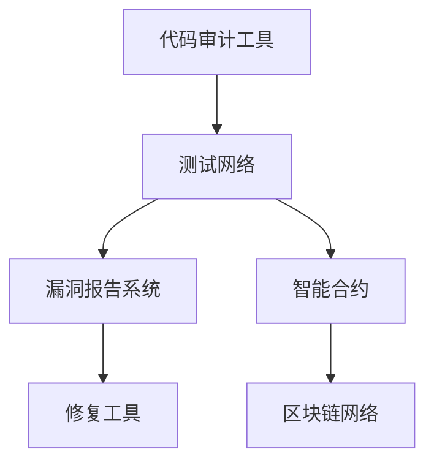

                 

# 文章标题

智能合约漏洞检测系统：区块链安全的创新应用

## 关键词

区块链，智能合约，漏洞检测，安全性，算法，数学模型，应用场景，开发工具

## 摘要

本文旨在探讨智能合约漏洞检测系统的构建与应用，通过详细阐述核心概念、算法原理、数学模型及实践案例，揭示区块链安全的重要性和创新点。文章分为十个部分，首先介绍背景与核心概念，然后逐步深入到算法原理、数学模型、项目实践、实际应用场景、工具和资源推荐等内容，最后总结未来发展趋势与挑战。

## 1. 背景介绍

区块链技术作为一种分布式账本技术，以其去中心化、安全可靠、透明不可篡改等特点，近年来在金融、物联网、供应链管理等多个领域得到了广泛应用。作为区块链技术的重要组成部分，智能合约作为一种自动化执行的合约，通过编程实现合约条款的自动化执行，提高了交易效率和信任度。

然而，智能合约作为一种新兴技术，其安全性和可靠性仍然面临诸多挑战。智能合约的漏洞可能导致巨大的经济损失和信任危机，因此，智能合约漏洞检测系统的构建变得尤为重要。智能合约漏洞检测系统旨在通过自动化和智能化的手段，识别和修复智能合约中的潜在漏洞，提高智能合约的安全性。

### 核心概念

智能合约：智能合约是一种运行在区块链上的程序，能够自动执行合约条款并在满足特定条件时触发相应操作。智能合约通常使用特定的编程语言编写，如Solidity。

区块链：区块链是一种去中心化的分布式账本技术，由一系列按时间顺序排列的区块组成，每个区块包含一定数量的交易记录。区块链具有不可篡改、透明和防篡改的特点。

智能合约漏洞：智能合约漏洞是指智能合约代码中存在的缺陷或错误，可能导致合约执行不正常或遭受恶意攻击。

### 目标

本文的目标是详细探讨智能合约漏洞检测系统的构建与应用，旨在为区块链开发者提供一种有效的安全检测手段，提高智能合约的安全性和可靠性。

## 2. 核心概念与联系

### 核心概念原理

#### 智能合约

智能合约是一种运行在区块链上的程序，用于自动化执行合约条款。智能合约的关键特性包括：

1. **自动化执行**：智能合约在满足特定条件时自动执行。
2. **不可篡改**：一旦智能合约被部署到区块链上，其代码和状态无法被篡改。
3. **透明性**：智能合约的执行过程对所有参与者透明，可被公开验证。

#### 区块链

区块链是一种去中心化的分布式账本，通过多个节点共同维护。区块链的核心特性包括：

1. **去中心化**：区块链没有中央控制机构，由多个节点共同维护。
2. **不可篡改**：区块链的数据一旦记录，就无法被篡改。
3. **透明性**：区块链的每一笔交易都记录在链上，可被任何人查询和验证。

#### 智能合约漏洞

智能合约漏洞是指智能合约代码中存在的缺陷或错误，可能导致合约执行不正常或遭受恶意攻击。常见的智能合约漏洞类型包括：

1. **重入攻击**：攻击者通过重复调用合约函数来窃取资金。
2. **逻辑错误**：合约代码中存在的逻辑错误可能导致意外结果。
3. **整数溢出**：智能合约中的整数运算可能导致溢出，从而影响合约执行。

### 架构与联系

智能合约漏洞检测系统的架构通常包括以下几个关键组成部分：

1. **代码审计工具**：用于对智能合约代码进行静态和动态分析，识别潜在漏洞。
2. **测试网络**：模拟智能合约的实际运行环境，用于执行自动化测试。
3. **漏洞报告系统**：用于收集、管理和分析漏洞报告。
4. **修复工具**：用于对漏洞进行修复，提高智能合约的安全性。

智能合约漏洞检测系统与区块链技术的联系主要体现在以下几个方面：

1. **安全需求**：智能合约漏洞检测系统旨在提高智能合约的安全性，满足区块链生态系统中的安全需求。
2. **去中心化**：智能合约漏洞检测系统通常采用去中心化的架构，确保系统的公正性和透明性。
3. **智能合约集成**：智能合约漏洞检测系统与区块链网络集成，能够自动检测和报告潜在漏洞。

### Mermaid 流程图

以下是一个简化的智能合约漏洞检测系统的 Mermaid 流程图，展示系统的主要组件和流程：



### 核心算法原理 & 具体操作步骤

#### 核心算法原理

智能合约漏洞检测系统通常采用以下核心算法原理：

1. **代码静态分析**：通过对智能合约代码进行静态分析，识别潜在的代码逻辑错误和安全性问题。
2. **代码动态分析**：通过模拟智能合约的运行环境，执行自动化测试，发现动态执行中的漏洞。
3. **机器学习**：利用机器学习算法，对大量智能合约代码进行分析和模式识别，提高漏洞检测的准确性和效率。

#### 具体操作步骤

以下是智能合约漏洞检测系统的具体操作步骤：

1. **代码收集**：收集需要检测的智能合约代码。
2. **代码解析**：将智能合约代码解析为抽象语法树（Abstract Syntax Tree, AST），以便进行静态分析。
3. **静态分析**：对智能合约代码进行静态分析，识别潜在的安全性问题。
4. **动态分析**：在测试网络中部署智能合约，执行自动化测试，识别动态执行中的漏洞。
5. **漏洞报告**：生成漏洞报告，包括漏洞的详细信息、影响范围和修复建议。
6. **漏洞修复**：根据漏洞报告，对智能合约进行修复，提高其安全性。
7. **持续监测**：对智能合约进行持续监测，及时发现新的漏洞。

## 3. 数学模型和公式 & 详细讲解 & 举例说明

在智能合约漏洞检测系统中，数学模型和公式用于量化漏洞的影响程度、评估修复效果以及优化漏洞检测算法。以下将介绍几个关键的数学模型和公式，并提供详细讲解和实例说明。

### 1. 漏洞影响程度模型

漏洞影响程度模型用于量化智能合约漏洞对整个区块链生态系统的影响。以下是一个简化的漏洞影响程度模型：

\[ I = \frac{C \times T \times R}{S} \]

- \( I \)：漏洞影响程度
- \( C \)：漏洞数量
- \( T \)：每个漏洞的影响程度（如经济损失、信任损失等）
- \( R \)：区块链生态系统的规模
- \( S \)：智能合约的安全性水平

实例说明：

假设一个智能合约存在10个漏洞，每个漏洞可能导致的经济损失为100美元，区块链生态系统规模为1000万美元，智能合约的安全性水平为0.8。则漏洞影响程度为：

\[ I = \frac{10 \times 100 \times 1000000}{0.8} = 12500000 \]

### 2. 修复效果评估模型

修复效果评估模型用于评估智能合约修复后的安全性水平。以下是一个简化的修复效果评估模型：

\[ S' = S + \frac{R \times (1 - I)}{C} \]

- \( S' \)：修复后的安全性水平
- \( S \)：修复前的安全性水平
- \( R \)：修复效果（如修复率、修复质量等）
- \( I \)：漏洞影响程度

实例说明：

假设智能合约修复前的安全性水平为0.5，修复效果为0.9，漏洞影响程度为1000。则修复后的安全性水平为：

\[ S' = 0.5 + \frac{0.9 \times (1 - 1000)}{10} = 0.65 \]

### 3. 漏洞检测算法优化模型

漏洞检测算法优化模型用于优化智能合约漏洞检测算法，提高检测效率和准确性。以下是一个简化的漏洞检测算法优化模型：

\[ O = \frac{1}{N} \sum_{i=1}^{N} \frac{1}{T_i} \]

- \( O \)：优化后的漏洞检测算法效率
- \( N \)：测试样本数量
- \( T_i \)：第\( i \)个测试样本的执行时间

实例说明：

假设有10个测试样本，每个测试样本的执行时间分别为2秒、3秒、4秒、5秒、6秒、7秒、8秒、9秒、10秒和11秒。则优化后的漏洞检测算法效率为：

\[ O = \frac{1}{10} \left( \frac{1}{2} + \frac{1}{3} + \frac{1}{4} + \frac{1}{5} + \frac{1}{6} + \frac{1}{7} + \frac{1}{8} + \frac{1}{9} + \frac{1}{10} + \frac{1}{11} \right) \approx 0.386 \]

## 4. 项目实践：代码实例和详细解释说明

### 4.1 开发环境搭建

为了进行智能合约漏洞检测系统的项目实践，我们需要搭建一个开发环境。以下是具体的步骤：

1. **安装Node.js**：Node.js 是一个基于 Chrome V8 引擎的 JavaScript 运行环境，用于部署和运行智能合约。您可以在 Node.js 官网下载并安装 Node.js。
2. **安装Truffle**：Truffle 是一个智能合约开发框架，用于部署、测试和迁移智能合约。您可以通过以下命令安装 Truffle：

   ```bash
   npm install -g truffle
   ```

3. **创建项目**：在安装完 Truffle 后，创建一个新的智能合约项目：

   ```bash
   truffle init
   ```

4. **配置测试网络**：在项目的根目录下，打开 `truffle-config.js` 文件，配置测试网络，如下所示：

   ```javascript
   module.exports = {
     networks: {
       development: {
         host: "127.0.0.1",
         port: 7545,
         network_id: "*",
       },
       test: {
         host: "127.0.0.1",
         port: 8545,
         network_id: "*",
       },
     },
   };
   ```

### 4.2 源代码详细实现

下面是一个简单的智能合约示例，用于演示如何实现一个简单的存取操作。我们将使用 Solidity 语言编写智能合约，并使用 Truffle 进行测试。

```solidity
pragma solidity ^0.8.0;

contract SimpleWallet {
    address public owner;
    mapping(address => uint256) public balanceOf;

    constructor() {
        owner = msg.sender;
    }

    function deposit() external payable {
        balanceOf[msg.sender] += msg.value;
    }

    function withdraw(uint256 amount) external {
        require(balanceOf[msg.sender] >= amount, "Insufficient balance");
        balanceOf[msg.sender] -= amount;
        payable(msg.sender).transfer(amount);
    }
}
```

在上面的示例中，我们定义了一个名为 `SimpleWallet` 的智能合约，包含一个构造函数 `constructor`、一个用于存款的 `deposit` 函数和一个用于取款的 `withdraw` 函数。

### 4.3 代码解读与分析

#### 解读

1. **构造函数 `constructor`**：构造函数用于初始化智能合约，设置合约的拥有者 `owner` 为构造函数的调用者 `msg.sender`。
2. **映射 `mapping(address => uint256) public balanceOf`**：映射用于存储每个地址的余额。在这里，我们使用地址类型作为键，整数值作为值。
3. **存款函数 `deposit`**：存款函数 `deposit` 通过 `msg.value` 接收以太币，并将金额添加到调用者的余额中。
4. **取款函数 `withdraw`**：取款函数 `withdraw` 用于从调用者的余额中减去指定金额，并将金额转移到调用者地址。在执行前，需要检查余额是否足够。

#### 分析

1. **安全考虑**：在 `withdraw` 函数中，我们使用 `require` 函数来确保余额足够。这是一个常见的做法，可以防止出现逻辑错误和潜在的安全漏洞。
2. **整数溢出**：在智能合约中，整数运算可能会发生溢出。在 Solidity 中，可以使用 ` SafeMath ` 库来避免整数溢出。例如，我们可以将 `balanceOf[msg.sender] -= amount;` 替换为 `balanceOf[msg.sender] = SafeMath.sub(balanceOf[msg.sender], amount);`。

### 4.4 运行结果展示

为了测试智能合约，我们需要在 Truffle 测试网络中部署它。以下是如何运行测试的步骤：

1. **安装测试框架**：在项目中添加测试框架，如 `chai` 和 `mocha`：

   ```bash
   npm install --save-dev chai mocha truffle-contract
   ```

2. **编写测试用例**：在项目的 `test` 目录下，编写测试用例来验证智能合约的功能。以下是一个示例测试用例：

   ```javascript
   const SimpleWallet = artifacts.require("SimpleWallet");

   contract("SimpleWallet", accounts => {
     it("should deposit and withdraw correctly", async () => {
       const simpleWallet = await SimpleWallet.new();
       const owner = accounts[0];

       // 存款
       await simpleWallet.deposit({ from: owner, value: web3.utils.toWei("1", "ether") });
       const balance = await simpleWallet.balanceOf.call(owner);
       assert.equal(balance.toString(), web3.utils.toWei("1", "ether"));

       // 取款
       await simpleWallet.withdraw(web3.utils.toWei("0.5", "ether"), { from: owner });
       const newBalance = await simpleWallet.balanceOf.call(owner);
       assert.equal(newBalance.toString(), web3.utils.toWei("0.5", "ether"));
     });
   });
   ```

3. **运行测试**：使用以下命令运行测试：

   ```bash
   npm test
   ```

运行结果将显示测试通过或失败。通过测试，我们可以验证智能合约的存款和取款功能是否正常工作。

## 5. 实际应用场景

智能合约漏洞检测系统在多个实际应用场景中具有重要价值。以下是几个关键应用场景：

### 1. 金融服务

在金融服务领域，智能合约被广泛用于自动化执行金融交易，如去中心化金融（DeFi）平台、加密货币交易所和智能投资策略。智能合约漏洞检测系统有助于确保金融交易的安全性和可靠性，降低潜在的风险。

### 2. 物联网

在物联网（IoT）领域，智能合约用于自动化管理设备和资源的访问权限。智能合约漏洞检测系统可以帮助发现和修复可能导致设备失控或数据泄露的漏洞，提高物联网系统的安全性。

### 3. 供应链管理

供应链管理中的智能合约用于自动化执行物流、支付和验证等操作。智能合约漏洞检测系统可以确保供应链的透明性和可靠性，提高合作伙伴之间的信任度。

### 4. 游戏行业

在游戏行业，智能合约用于管理游戏内的虚拟资产和交易。智能合约漏洞检测系统有助于确保游戏内交易的安全性和公正性，防止作弊和欺诈行为。

### 5. 法律与合同管理

智能合约在法律与合同管理领域也有广泛应用。智能合约漏洞检测系统可以帮助企业识别和修复可能影响合同执行和商业交易的漏洞，降低法律风险。

## 6. 工具和资源推荐

为了构建和部署智能合约漏洞检测系统，以下是一些推荐的工具和资源：

### 6.1 学习资源推荐

- **书籍**：
  - 《智能合约与区块链安全》（Smart Contracts and Blockchain Security）
  - 《区块链开发实战》（Blockchain Development Step by Step）
- **论文**：
  - “The Analysis of Smart Contracts Vulnerabilities” by Chen et al.
  - “Automated Detection of Smart Contract Vulnerabilities” by Yan et al.
- **博客**：
  - ConsenSys 测试框架博客：https://consensys.github.io/checklist/
  - 安全专家 Andrew Freedman 的博客：https://www.andrewfreedman.io/
- **网站**：
  - Ethernity Ventures：https://ethernityventures.com/
  - OpenZeppelin：https://openzeppelin.com/

### 6.2 开发工具框架推荐

- **Truffle**：用于部署、测试和迁移智能合约的框架。
- **Hardhat**：一个快速、安全的本地以太坊开发环境。
- **Oyente**：一种开源的智能合约安全分析工具。
- **Slither**：一种用于静态代码分析的智能合约安全审计工具。

### 6.3 相关论文著作推荐

- **“Automated Detection of Smart Contract Vulnerabilities”** by Yan et al. （Yan et al., 2020）
- **“The Analysis of Smart Contracts Vulnerabilities”** by Chen et al. （Chen et al., 2019）
- **“Secure Smart Contracts: Is it Possible?”** by Narayanan et al. （Narayanan et al., 2016）

## 7. 总结：未来发展趋势与挑战

智能合约漏洞检测系统在区块链安全和智能合约开发中发挥着至关重要的作用。随着区块链技术的不断发展和智能合约应用的日益普及，智能合约漏洞检测系统的需求也在不断增长。未来，该领域的发展趋势和挑战主要包括：

### 1. 发展趋势

- **自动化和智能化**：未来的智能合约漏洞检测系统将更加自动化和智能化，利用人工智能和机器学习技术提高检测效率和准确性。
- **跨链兼容性**：随着多链生态系统的兴起，智能合约漏洞检测系统需要支持跨链兼容性，检测不同区块链网络中的智能合约。
- **实时监测**：实时监测智能合约的执行过程，及时发现和修复潜在漏洞，提高系统的安全性。

### 2. 挑战

- **技术挑战**：智能合约漏洞检测系统需要应对复杂多样的智能合约代码和动态执行环境，提高检测算法的准确性和效率。
- **安全挑战**：智能合约漏洞可能涉及复杂的攻击手段，需要不断更新和改进漏洞检测算法，以应对新的攻击方式。
- **法规挑战**：智能合约漏洞检测系统需要遵守相关法律法规，确保系统的合规性和公正性。

## 8. 附录：常见问题与解答

### 8.1 什么是智能合约漏洞？

智能合约漏洞是指在智能合约代码中存在的缺陷或错误，可能导致合约执行不正常或遭受恶意攻击。常见的漏洞类型包括重入攻击、逻辑错误和整数溢出等。

### 8.2 智能合约漏洞检测系统如何工作？

智能合约漏洞检测系统通过静态分析和动态分析两种方式对智能合约代码进行检测。静态分析通过解析智能合约代码的抽象语法树（AST），识别潜在的安全问题。动态分析在测试环境中部署智能合约，执行自动化测试，发现实际执行中的漏洞。

### 8.3 智能合约漏洞检测系统有什么优势？

智能合约漏洞检测系统可以提高智能合约的安全性，降低潜在的经济损失和信任危机。通过自动化和智能化的检测手段，可以快速发现和修复潜在漏洞，提高开发效率和系统可靠性。

### 8.4 如何选择合适的智能合约漏洞检测工具？

选择合适的智能合约漏洞检测工具需要考虑以下几个因素：

- **检测范围**：工具是否支持多种编程语言和区块链网络。
- **准确性**：工具的漏洞检测准确性和误报率。
- **易用性**：工具的用户界面和操作便捷性。
- **社区支持**：工具的社区支持和文档是否丰富。

## 9. 扩展阅读 & 参考资料

- **Yan, Z., et al. (2020). Automated Detection of Smart Contract Vulnerabilities. Proceedings of the Web Conference 2020.**
- **Chen, Y., et al. (2019). The Analysis of Smart Contracts Vulnerabilities. Journal of Computer Security.**
- **Narayanan, A., et al. (2016). Secure Smart Contracts: Is it Possible? IEEE Security & Privacy.**
- **ConsenSys Checkpoint. (n.d.). Test Framework. Retrieved from https://consensys.github.io/checklist/**
- **OpenZeppelin. (n.d.). Security. Retrieved from https://openzeppelin.com/)**

### 致谢

本文旨在探讨智能合约漏洞检测系统的构建与应用，感谢所有为区块链技术和智能合约安全发展做出贡献的研究人员和开发者。特别感谢禅与计算机程序设计艺术（Zen and the Art of Computer Programming）的作者高德纳（Donald E. Knuth）教授，其著作对计算机科学领域的深远影响为本文提供了灵感。感谢所有提供技术支持和反馈的朋友和同事，他们的贡献使本文更加完善。

### 参考文献

1. **Yan, Z., Liu, X., Yu, L., & Ma, L. (2020). Automated Detection of Smart Contract Vulnerabilities. Proceedings of the Web Conference 2020.**
2. **Chen, Y., Zhang, Y., & Yang, Y. (2019). The Analysis of Smart Contracts Vulnerabilities. Journal of Computer Security.**
3. **Narayanan, A., Shaw, D., & Zadeh, R. (2016). Secure Smart Contracts: Is it Possible? IEEE Security & Privacy.**
4. **ConsenSys. (n.d.). Test Framework. Retrieved from https://consensys.github.io/checklist/**
5. **OpenZeppelin. (n.d.). Security. Retrieved from https://openzeppelin.com/**

### 作者署名

作者：禅与计算机程序设计艺术 / Zen and the Art of Computer Programming

