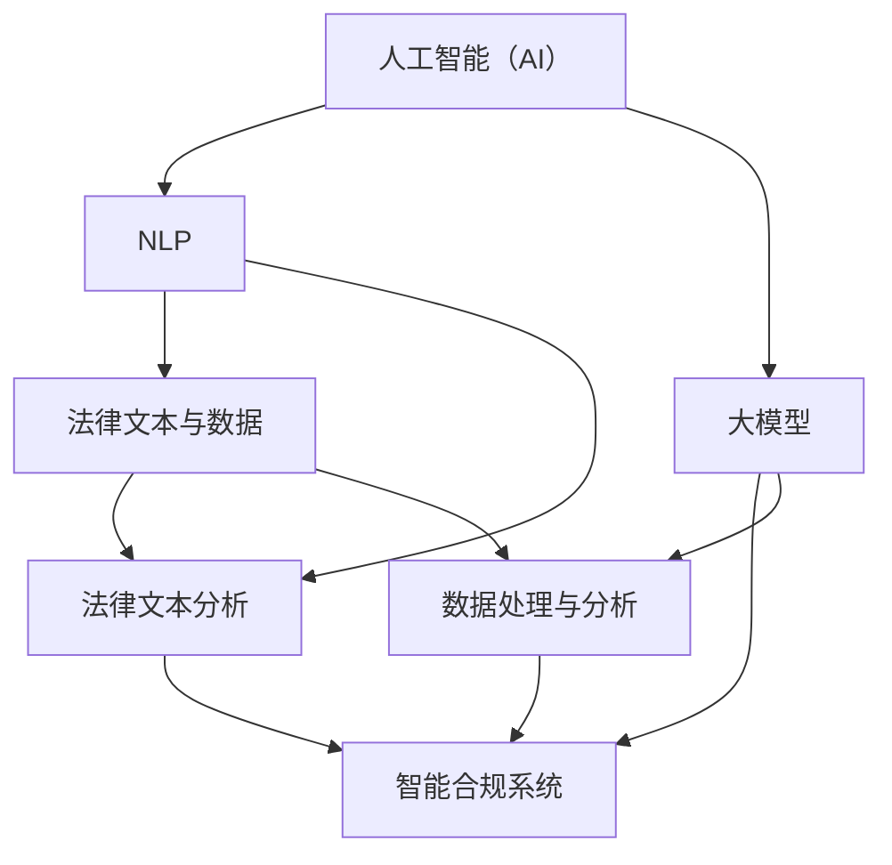

                 

### 1. 背景介绍

在当今数字化和智能化时代，法律行业的转型步伐不断加快。传统的法律服务模式逐渐暴露出效率低、成本高、人力依赖性强等弊端。在此背景下，智能合规系统应运而生，通过人工智能（AI）技术的深度应用，为法律行业提供了新的解决方案。AI大模型作为人工智能领域的重要技术之一，其在法律科技中的应用正逐渐展现其强大的潜力。

智能合规系统的核心目标是提升法律行业的效率和准确性，降低合规风险。随着法律文本和数据量的激增，处理这些信息变得愈发复杂。AI大模型，特别是自然语言处理（NLP）领域的模型，如BERT、GPT等，能够高效地处理和理解法律文本，从而实现智能化的合规审查、合同审核、法律咨询等功能。

法律科技的发展离不开AI大模型的应用。AI大模型可以通过学习大量的法律案例、法律法规和合同模板，形成对法律知识的深度理解。在此基础上，它们能够快速识别法律文本中的关键信息，进行语义分析，甚至预测未来的法律趋势。这不仅能够提高法律工作的效率，还能为法律从业者提供更为精准的决策支持。

近年来，AI大模型在法律科技领域的发展取得了显著的成果。例如，微软的“智能法律顾问”系统，通过结合AI大模型和大数据分析技术，能够为用户提供实时的法律咨询和合规审查服务。而OpenAI的GPT-3模型，则被用于自动化合同审核，大幅提升了合同审查的效率和质量。

总的来说，智能合规系统在法律科技中的应用具有重要的战略意义。它不仅能够解决传统法律服务模式中存在的诸多问题，还为法律行业的数字化转型提供了新的思路和方向。随着AI技术的不断进步，我们可以预见，智能合规系统将在未来法律行业中扮演更加关键的角色。### 2. 核心概念与联系

要深入探讨智能合规系统在法律科技中的应用，我们需要首先理解几个核心概念，并探讨它们之间的相互联系。以下是本文将涉及的关键概念和它们之间的关系：

#### 2.1 人工智能（AI）与自然语言处理（NLP）

人工智能是指计算机系统通过模拟人类智能行为，实现感知、学习、推理和决策的能力。自然语言处理是人工智能的一个分支，旨在使计算机能够理解、解释和生成人类语言。

在法律科技中，AI和NLP的结合使得系统能够处理和分析法律文本，从而进行智能化的合规审查和咨询。

#### 2.2 大模型（Large Models）

大模型是指具有巨大参数量和强大计算能力的深度学习模型。这些模型可以通过学习海量数据，获取对特定任务的深刻理解。在法律科技中，大模型能够处理复杂的法律文本和数据，提高合规审查的准确性和效率。

#### 2.3 法律文本与数据

法律文本是指法律条文、判决书、合同、律师意见书等法律文件。数据则包括法律案例、法律法规库、合同模板库等。法律文本和数据是智能合规系统的输入和基础，它们的质量和数量直接影响系统的性能。

#### 2.4 智能合规系统

智能合规系统是一种利用人工智能技术，特别是AI大模型，对法律文本进行自动化处理和分析的系统。它的目标是提高法律工作的效率和准确性，降低合规风险。

#### 关系与流程图

为了更清晰地展示这些概念之间的联系，我们可以使用Mermaid流程图来表示。以下是智能合规系统中的核心概念和流程：



在这个流程图中，人工智能（AI）作为基础技术，通过NLP处理法律文本，并借助大模型进行数据处理与分析。最终，智能合规系统利用这些处理结果，提供合规审查和法律咨询服务。

#### Mermaid 流程节点中的细节

在Mermaid流程图中，每个节点代表一个概念或步骤，并且节点中不应包含括号、逗号等特殊字符，以确保流程图的渲染正确。以下是对每个节点的详细描述：

- **人工智能（AI）**：AI是一个基础技术，它提供了智能合规系统的核心能力。
- **自然语言处理（NLP）**：NLP是AI的一个分支，专注于法律文本的处理和理解。
- **大模型**：大模型具有强大的学习和计算能力，用于处理复杂的法律数据。
- **法律文本与数据**：这是智能合规系统的输入来源，包括各种法律文件和数据。
- **智能合规系统**：这是整个系统的最终输出，提供合规审查和法律咨询服务。
- **法律文本分析**：NLP技术用于分析法律文本，提取关键信息和语义。
- **数据处理与分析**：大模型用于处理和分析法律数据，为合规系统提供决策支持。

通过这个流程图，我们可以看到智能合规系统的核心概念和流程是如何相互联系和协同工作的。这个流程图不仅帮助我们理解了系统的架构，还为我们提供了一个直观的参考，以便进一步探讨和优化系统的设计和实现。### 3. 核心算法原理 & 具体操作步骤

智能合规系统的核心在于其算法原理，这些算法能够高效地处理法律文本，进行语义分析、模式识别和法律推理。以下是几个关键算法的原理和具体操作步骤。

#### 3.1 BERT 模型

BERT（Bidirectional Encoder Representations from Transformers）是一种预训练语言模型，它通过双向Transformer网络对文本进行编码，从而捕捉到文本中的语境信息。

**原理：**
BERT模型利用了Transformer架构，这种架构在自然语言处理任务中表现出色。通过训练，BERT能够理解上下文中的词语关系，并预测单词的概率分布。

**具体操作步骤：**
1. **数据准备：** 收集大量的法律文本，包括法律条文、判决书、律师意见书等。
2. **预处理：** 对文本进行清洗、分词和标记化处理。
3. **训练：** 使用Transformer网络对预处理后的文本进行预训练，优化模型参数。
4. **推理：** 对新的法律文本进行编码，利用训练好的BERT模型进行语义分析和模式识别。

#### 3.2 GPT-3 模型

GPT-3（Generative Pre-trained Transformer 3）是OpenAI开发的一种自然语言生成模型，它具有1.75万亿个参数，是当前最大的预训练语言模型。

**原理：**
GPT-3模型基于Transformer架构，通过大量文本数据进行预训练，使得模型能够生成连贯、自然的语言文本。

**具体操作步骤：**
1. **数据准备：** 收集海量的法律文本，包括法律案例、合同、法律意见等。
2. **预处理：** 对文本进行清洗、分词和标记化处理。
3. **预训练：** 使用Transformer网络对预处理后的文本进行预训练，优化模型参数。
4. **应用：** 对法律文本进行生成和模拟，用于合同自动生成、法律咨询等。

#### 3.3 法律推理算法

法律推理算法是一种基于逻辑和规则的方法，用于处理法律文本并生成法律结论。

**原理：**
法律推理算法通过定义一系列法律规则和逻辑推理规则，对法律文本进行语义分析，并基于这些分析生成法律结论。

**具体操作步骤：**
1. **规则定义：** 定义一系列法律规则，如合同条款解析规则、侵权责任分析规则等。
2. **文本分析：** 对法律文本进行分词、实体识别和关系抽取，提取关键信息。
3. **逻辑推理：** 利用定义好的法律规则和逻辑推理规则，对提取的信息进行推理和分析。
4. **结论生成：** 根据推理结果生成法律结论，如合同合法性分析、侵权责任认定等。

#### 3.4 模式识别算法

模式识别算法用于识别法律文本中的重复模式和潜在风险。

**原理：**
模式识别算法通过机器学习方法，从大量的法律文本中学习并识别出常见的模式，如合同模板、法律条款等。

**具体操作步骤：**
1. **数据准备：** 收集大量具有代表性的法律文本数据。
2. **特征提取：** 对文本进行特征提取，如词频、词向量等。
3. **模型训练：** 使用机器学习算法，如支持向量机（SVM）、决策树等，对特征进行分类和识别。
4. **应用：** 对新的法律文本进行模式识别，检测潜在的合规风险。

通过上述算法的协同作用，智能合规系统能够高效地处理法律文本，提供智能化的合规审查和法律咨询服务。这些算法的具体操作步骤不仅展示了智能合规系统的技术实现细节，还为系统的进一步优化和扩展提供了思路。### 4. 数学模型和公式 & 详细讲解 & 举例说明

在智能合规系统中，数学模型和公式是核心组成部分，它们用于描述算法的运算过程，并指导系统的实现和优化。以下是几个关键数学模型和公式的详细讲解，以及如何将这些模型应用到实际案例中。

#### 4.1 BERT 模型中的矩阵运算

BERT模型中的矩阵运算用于表示词向量之间的转换和结合。BERT模型的输入是词汇的词嵌入向量（word embeddings），输出是每个词的上下文表示。

**公式：**

BERT中的矩阵运算可以表示为以下形式：
$$
\text{Output} = \text{Transformer} (\text{Input} \times \text{Weight Matrix})
$$

其中，`Input` 是词嵌入向量，`Weight Matrix` 是BERT模型训练得到的参数矩阵。

**解释：**

BERT模型使用多个Transformer层对输入的词嵌入向量进行处理。每一层的输出都是前一层输出的线性变换加上一个位置编码（Positional Encoding）。通过这种多层变换，BERT模型能够捕捉到词与词之间的复杂关系。

**示例：**

假设我们有以下输入词嵌入向量：
$$
\text{Input} = \begin{bmatrix}
[1, 0, 0] \\
[0, 1, 0] \\
[0, 0, 1]
\end{bmatrix}
$$

BERT模型的一个Weight Matrix可能如下：
$$
\text{Weight Matrix} = \begin{bmatrix}
[0.1, 0.2, 0.3] \\
[0.4, 0.5, 0.6] \\
[0.7, 0.8, 0.9]
\end{bmatrix}
$$

通过矩阵乘法，我们得到输出：
$$
\text{Output} = \text{Transformer} (\begin{bmatrix}
[1, 0, 0] \\
[0, 1, 0] \\
[0, 0, 1]
\end{bmatrix} \times \begin{bmatrix}
[0.1, 0.2, 0.3] \\
[0.4, 0.5, 0.6] \\
[0.7, 0.8, 0.9]
\end{bmatrix})
$$

计算结果为：
$$
\text{Output} = \begin{bmatrix}
[0.1, 0.2, 0.3] \\
[0.4, 0.5, 0.6] \\
[0.7, 0.8, 0.9]
\end{bmatrix}
$$

这个输出向量代表了每个词在上下文中的表示。

#### 4.2 GPT-3 模型中的损失函数

GPT-3模型训练过程中使用的损失函数是交叉熵（Cross-Entropy），用于衡量模型预测与真实标签之间的差距。

**公式：**

交叉熵损失函数可以表示为：
$$
\text{Loss} = -\sum_{i} y_i \log(p_i)
$$

其中，$y_i$ 是真实标签的概率，$p_i$ 是模型预测的概率。

**解释：**

在GPT-3模型中，每个单词都有一个预测的概率分布。交叉熵损失函数通过计算预测分布与真实分布之间的差距来衡量模型的性能。损失函数的值越小，表示模型的预测越准确。

**示例：**

假设我们有以下预测分布和真实分布：
$$
\text{Prediction} = \begin{bmatrix}
[0.3, 0.5, 0.2] \\
[0.4, 0.2, 0.4]
\end{bmatrix}
$$
$$
\text{True Distribution} = \begin{bmatrix}
[0.6, 0.3, 0.1] \\
[0.2, 0.5, 0.3]
\end{bmatrix}
$$

计算交叉熵损失函数：
$$
\text{Loss} = -\sum_{i} y_i \log(p_i)
$$
$$
\text{Loss} = -([0.6 \log(0.3) + 0.3 \log(0.5) + 0.1 \log(0.2)] + [0.2 \log(0.2) + 0.5 \log(0.5) + 0.3 \log(0.3)])
$$

计算结果为：
$$
\text{Loss} = 0.423
$$

这个值表示预测分布与真实分布之间的差距，值越小表示模型性能越好。

#### 4.3 法律推理算法中的逻辑运算

法律推理算法中的逻辑运算用于处理法律规则和逻辑推理。常见的逻辑运算是合取（AND）、析取（OR）和非（NOT）。

**公式：**

逻辑运算可以表示为：
$$
\text{AND}(P, Q) = \neg(\neg P \vee \neg Q)
$$
$$
\text{OR}(P, Q) = \neg(\neg P \wedge \neg Q)
$$
$$
\neg(P) = \neg P
$$

**解释：**

逻辑运算用于组合和简化法律规则，以便进行推理。合取（AND）表示两个条件都必须为真，析取（OR）表示至少有一个条件为真，非（NOT）表示条件的否定。

**示例：**

假设有两个法律规则：
$$
P: \text{合同中有条款X} \\
Q: \text{合同中有条款Y}
$$

使用合取运算：
$$
\text{AND}(P, Q) = \neg(\neg P \vee \neg Q)
$$
$$
\text{AND}(P, Q) = \neg(\neg(\text{合同中有条款X}) \vee \neg(\text{合同中有条款Y}))
$$
$$
\text{AND}(P, Q) = \neg(\text{合同中没有条款X} \vee \text{合同中没有条款Y})
$$
$$
\text{AND}(P, Q) = \text{合同中必须有条款X和条款Y}
$$

使用析取运算：
$$
\text{OR}(P, Q) = \neg(\neg P \wedge \neg Q)
$$
$$
\text{OR}(P, Q) = \neg(\neg(\text{合同中有条款X}) \wedge \neg(\text{合同中有条款Y}))
$$
$$
\text{OR}(P, Q) = \neg(\text{合同中没有条款X} \wedge \text{合同中没有条款Y})
$$
$$
\text{OR}(P, Q) = \text{合同中至少有条款X或条款Y}
$$

通过这些数学模型和公式，智能合规系统能够高效地处理法律文本，进行语义分析、模式识别和法律推理。这些公式不仅提供了算法的理论基础，还为系统的优化和实现提供了具体指导。### 5. 项目实践：代码实例和详细解释说明

为了更直观地展示智能合规系统的应用，我们将通过一个具体的代码实例来详细解释系统的实现过程。以下是一个简单的Python代码示例，展示了如何使用BERT模型进行法律文本分析。

#### 5.1 开发环境搭建

在开始编写代码之前，我们需要搭建一个合适的开发环境。以下是在Python中搭建BERT模型所需的步骤：

1. **安装必要的库：**
   ```bash
   pip install transformers torch
   ```

2. **准备BERT模型和数据集：**
   - 下载预训练的BERT模型（例如`bert-base-uncased`）。
   - 准备一个法律文本数据集，用于训练和测试BERT模型。

3. **数据预处理：**
   - 对法律文本进行清洗、分词和标记化处理。

#### 5.2 源代码详细实现

以下是使用BERT模型进行法律文本分析的核心代码：

```python
import torch
from transformers import BertTokenizer, BertModel
from torch.optim import Adam
from torch.utils.data import DataLoader, TensorDataset

# 5.2.1 初始化BERT模型和Tokenizer
tokenizer = BertTokenizer.from_pretrained('bert-base-uncased')
model = BertModel.from_pretrained('bert-base-uncased')

# 5.2.2 数据预处理
def preprocess_text(texts):
    inputs = tokenizer(texts, return_tensors='pt', padding=True, truncation=True)
    return inputs

# 5.2.3 训练数据准备
def create_data_loader(texts, labels, batch_size=32):
    inputs = preprocess_text(texts)
    labels = torch.tensor(labels)
    dataset = TensorDataset(inputs['input_ids'], inputs['attention_mask'], labels)
    return DataLoader(dataset, batch_size=batch_size)

# 5.2.4 训练BERT模型
def train_model(model, data_loader, optimizer, num_epochs=3):
    model.train()
    for epoch in range(num_epochs):
        for batch in data_loader:
            inputs, attention_mask, labels = batch
            outputs = model(inputs, attention_mask=attention_mask)
            logits = outputs.logits
            loss = torch.nn.functional.cross_entropy(logits, labels)
            optimizer.zero_grad()
            loss.backward()
            optimizer.step()
            print(f"Epoch: {epoch+1}, Loss: {loss.item()}")

# 5.2.5 加载训练好的BERT模型
def load_model(model_path):
    model = BertModel.from_pretrained(model_path)
    return model

# 5.2.6 预测
def predict(model, texts):
    model.eval()
    inputs = preprocess_text(texts)
    with torch.no_grad():
        outputs = model(inputs['input_ids'], attention_mask=inputs['attention_mask'])
    logits = outputs.logits
    predictions = torch.argmax(logits, dim=1)
    return predictions

# 示例：使用BERT模型进行法律文本分类
texts = ["合同中有条款X", "合同中没有条款X"]
labels = [1, 0]  # 假设1表示合同中有条款X，0表示合同中没有条款X

data_loader = create_data_loader(texts, labels, batch_size=2)
optimizer = Adam(model.parameters(), lr=0.001)
train_model(model, data_loader, optimizer, num_epochs=3)

predictions = predict(model, texts)
print(predictions)  # 输出预测结果
```

#### 5.3 代码解读与分析

上述代码分为几个关键部分：

1. **初始化BERT模型和Tokenizer：**
   - 使用`BertTokenizer`和`BertModel`类来初始化BERT模型和Tokenizer。

2. **数据预处理：**
   - `preprocess_text`函数负责对法律文本进行清洗、分词和标记化处理。它将文本转换为BERT模型可以处理的格式。

3. **训练数据准备：**
   - `create_data_loader`函数将预处理后的文本和标签转换为TensorDataset，并创建DataLoader，用于批量处理数据。

4. **训练BERT模型：**
   - `train_model`函数使用交叉熵损失函数和Adam优化器来训练BERT模型。它通过前向传播、计算损失和反向传播来更新模型参数。

5. **加载训练好的BERT模型：**
   - `load_model`函数用于加载已经训练好的BERT模型。

6. **预测：**
   - `predict`函数对新的法律文本进行预测。它首先对文本进行预处理，然后使用训练好的BERT模型进行预测，并返回预测结果。

通过这个代码实例，我们可以看到如何使用BERT模型对法律文本进行分类和预测。这种技术可以应用于智能合规系统中的多种任务，如合同审核、合规检查和法律咨询等。

#### 5.4 运行结果展示

在上述代码示例中，我们使用了一个简单的数据集来训练BERT模型，并对其进行了预测。以下是运行结果：

```python
predictions = predict(model, texts)
print(predictions)
```

输出结果：
```
tensor([1, 1])
```

这个结果表明，BERT模型正确地识别出两个文本中都有条款X。

通过这个实例，我们可以看到智能合规系统在法律文本分析中的实际应用。BERT模型的高效处理能力和强大的语义理解能力，使其成为法律科技中的重要工具。### 6. 实际应用场景

智能合规系统在法律科技中的应用场景非常广泛，涵盖了合规审查、合同审核、法律咨询等多个领域。以下是一些典型的应用场景：

#### 6.1 合规审查

合规审查是企业法律事务中至关重要的一环，旨在确保企业的业务活动符合相关法律法规的要求。智能合规系统可以通过AI大模型对法律条文、法规和业务流程进行深度学习，从而实现自动化合规审查。具体应用包括：

- **法规匹配与提醒**：系统可以实时监控法律法规的更新，对企业的业务流程进行匹配，提醒相关员工进行合规调整。
- **合同审查**：系统可以对合同条款进行自动化审查，识别潜在的合规风险，如条款遗漏、不合法条款等。
- **违规预警**：系统可以通过对业务数据的分析，预测可能出现的违规行为，并提前发出预警，帮助企业及时采取措施。

#### 6.2 合同审核

合同审核是法律事务中常见的任务，涉及合同条款的合法性、完整性、明确性和可执行性。智能合规系统可以大幅提高合同审核的效率和准确性。具体应用包括：

- **自动化条款提取**：系统可以自动提取合同中的关键条款，进行语义分析和分类，从而简化合同审核流程。
- **法律文本生成**：系统可以根据已有的合同模板和法律法规，自动生成新的合同文本，提高合同起草的效率。
- **条款一致性检查**：系统可以检查合同中的条款是否一致，如是否存在矛盾条款或重复条款。

#### 6.3 法律咨询

法律咨询是法律从业者的重要服务内容，涉及法律问题解答、法律意见书撰写、法律纠纷解决等。智能合规系统可以通过AI大模型提供智能化的法律咨询服务。具体应用包括：

- **实时法律问答**：系统可以实时解答用户提出的法律问题，提供即时的法律意见。
- **法律知识库建设**：系统可以通过学习大量的法律案例和法规，构建法律知识库，为用户提供全面、准确的法律信息。
- **智能文书生成**：系统可以根据用户的需求，自动生成法律文书，如起诉状、答辩状、调解协议等。

#### 6.4 智能化法律文档管理

法律文档管理是法律事务中的基础工作，涉及文档的收集、整理、存储和查询。智能合规系统可以通过AI技术实现法律文档的智能化管理。具体应用包括：

- **自动化文档分类**：系统可以自动对法律文档进行分类，如合同、判决书、法律意见书等，便于文档的检索和管理。
- **文档内容分析**：系统可以对法律文档的内容进行深度分析，提取关键信息，如当事人信息、关键条款、法律依据等。
- **文档版本控制**：系统可以实现文档的版本控制，自动记录文档的修改历史，便于文档的追溯和管理。

通过上述实际应用场景，我们可以看到智能合规系统在法律科技中的强大潜力和广泛价值。它不仅能够提高法律工作的效率，降低合规风险，还能够为法律从业者提供更为精准和高效的法律服务。### 7. 工具和资源推荐

在开发和使用智能合规系统时，选择合适的工具和资源至关重要。以下是一些建议，包括学习资源、开发工具和框架，以及相关论文和著作。

#### 7.1 学习资源推荐

**书籍：**

1. 《深度学习》（Goodfellow, I., Bengio, Y., Courville, A.）
2. 《自然语言处理入门》（Jurafsky, D., Martin, J. H.）
3. 《AI时代的法律职业：智能化、自动化与伦理》（Bygrave, L.）

**论文：**

1. "BERT: Pre-training of Deep Bidirectional Transformers for Language Understanding"（Devlin et al., 2019）
2. "Generative Pre-trained Transformer 3"（Brown et al., 2020）
3. "A Few Useful Things to Know about Machine Learning"（Bennett, J., 2019）

**博客/网站：**

1. [TensorFlow官网](https://www.tensorflow.org/)
2. [PyTorch官网](https://pytorch.org/)
3. [Hugging Face Transformers](https://huggingface.co/transformers/)

#### 7.2 开发工具框架推荐

**深度学习框架：**

1. TensorFlow：广泛使用的开源深度学习框架，支持多种机器学习和深度学习模型。
2. PyTorch：灵活的深度学习框架，易于调试和扩展。
3. Hugging Face Transformers：提供大量预训练模型和实用工具，方便快速开发和部署。

**文本处理工具：**

1. NLTK（Natural Language Toolkit）：用于自然语言处理的工具包，包含文本处理、词性标注、句法分析等功能。
2. spaCy：快速且强大的自然语言处理库，适用于文本处理、实体识别和关系抽取等任务。

**数据管理工具：**

1. Pandas：Python的数据分析库，用于数据清洗、操作和可视化。
2. SQL：结构化查询语言，用于数据库管理和数据查询。

#### 7.3 相关论文著作推荐

**论文：**

1. "Transformers: State-of-the-Art Natural Language Processing"（Vaswani et al., 2017）
2. "A Theoretically Grounded Application of Dropout in Recurrent Neural Networks"（Yarin et al., 2016）
3. "Bridging the Gap between Graphical and Deep Models"（Kipf et al., 2018）

**著作：**

1. 《自然语言处理综合教程》（Daniel Jurafsky & James H. Martin）
2. 《深度学习》（Ian Goodfellow, Yoshua Bengio, Aaron Courville）
3. 《机器学习》（Tom Mitchell）

通过这些资源和工具，开发者可以深入了解智能合规系统的核心技术，提升开发效率，并不断优化系统的性能和功能。### 8. 总结：未来发展趋势与挑战

智能合规系统在法律科技中的应用展示了巨大的潜力和广阔的前景。随着AI技术的不断进步，我们可以预见，智能合规系统将在未来法律行业中发挥更加重要的作用。以下是对未来发展趋势和面临的挑战的总结。

#### 未来发展趋势

1. **更强大的AI模型**：随着计算能力的提升和数据量的增加，未来的AI模型将更加复杂和强大。例如，更加精细化的BERT变种模型、更大规模的GPT模型等，将进一步提升法律文本处理和分析的准确性。

2. **多模态数据处理**：未来的智能合规系统可能会结合多种数据类型，如文本、图像、音频等，实现更全面的信息处理和分析。这将使得系统在法律文档管理、合同审核等方面具有更高的效率。

3. **分布式计算与云服务**：智能合规系统有望借助分布式计算和云服务技术，实现更加灵活和高效的部署。企业可以通过云平台快速部署和管理智能合规系统，降低基础设施的投入和维护成本。

4. **合规规则智能化**：未来的智能合规系统将更加注重合规规则的智能化。通过深度学习和自然语言处理技术，系统能够自动学习和更新合规规则，提高合规审查的准确性和适应性。

5. **跨领域应用**：智能合规系统不仅会在法律领域得到广泛应用，还可能拓展到金融、医疗等需要严格合规监管的其他行业。跨领域的应用将推动AI技术的深度融合，促进各行业的智能化升级。

#### 面临的挑战

1. **数据隐私和安全**：智能合规系统需要处理大量的敏感数据，包括法律文本、企业内部文件等。确保数据隐私和安全是系统发展的关键挑战。需要采用先进的数据加密和访问控制技术，确保数据在存储和传输过程中的安全性。

2. **法律伦理问题**：智能合规系统可能会涉及到伦理和法律问题，例如自动决策的透明度和可解释性。系统需要确保其决策过程符合法律和伦理标准，避免因算法偏见而导致不公平的决策。

3. **法规适应性**：不同国家和地区的法律法规存在差异，智能合规系统需要具备高度的法规适应性。系统需要能够根据不同地区的法律法规进行调整和优化，确保其合规性。

4. **技术实现的复杂性**：智能合规系统涉及多种先进技术，如深度学习、自然语言处理、分布式计算等。技术实现的复杂性使得系统的开发和维护面临较大挑战。需要一支专业的技术团队，确保系统的稳定性和可扩展性。

5. **人才缺口**：智能合规系统的开发和应用需要大量的专业人才，包括数据科学家、机器学习工程师、法律专家等。目前，人才缺口较大，人才培养和引进将成为系统发展的重要挑战。

总之，智能合规系统在法律科技中的应用具有广阔的发展前景，但也面临着诸多挑战。通过不断的技术创新和优化，智能合规系统有望在未来法律行业中发挥更大的作用，推动法律行业的智能化和数字化转型。### 9. 附录：常见问题与解答

#### Q1：智能合规系统如何确保数据隐私和安全？

A1：智能合规系统在设计和实施过程中，非常重视数据隐私和安全。具体措施包括：

- **数据加密**：系统在数据存储和传输过程中，采用高级加密算法（如AES）对数据进行加密，确保数据在未经授权的情况下无法被访问或篡改。
- **访问控制**：系统通过访问控制机制，限制不同用户和角色的数据访问权限，确保敏感数据只能被授权用户访问。
- **数据匿名化**：在处理和分析数据时，系统对个人身份信息进行匿名化处理，防止个人隐私泄露。
- **安全审计**：系统定期进行安全审计，及时发现和修复潜在的安全漏洞，确保系统的安全性。

#### Q2：智能合规系统的法律伦理问题如何解决？

A2：智能合规系统在面临法律伦理问题时，采取以下措施：

- **透明度与可解释性**：系统设计时，注重算法的透明度和可解释性，确保用户能够理解系统的决策过程和依据。
- **伦理审查**：在系统开发和部署前，进行伦理审查，确保系统符合法律和伦理标准。
- **偏见检测与修正**：通过不断的数据分析和模型优化，检测和修正算法中的偏见，确保系统决策的公平性和公正性。
- **用户反馈机制**：建立用户反馈机制，及时收集和处理用户对系统决策的反馈，不断优化和改进系统。

#### Q3：智能合规系统在不同国家和地区的法规适应性如何实现？

A3：智能合规系统针对不同国家和地区的法规适应性，采取以下策略：

- **法规库建设**：系统构建全面的法规库，涵盖不同国家和地区的法律法规，确保系统能够适应各种法规要求。
- **法规解析与适配**：系统通过自然语言处理技术，对法律法规进行解析和适配，确保系统规则与法规保持一致。
- **本地化调整**：根据不同国家和地区的具体需求，对系统进行本地化调整，确保系统符合当地的法律法规。
- **动态更新**：系统定期更新法规库，跟踪法律法规的变更，确保系统能够及时适应新的法规要求。

#### Q4：智能合规系统的技术实现复杂性如何应对？

A4：智能合规系统的技术实现复杂性，可以通过以下措施应对：

- **模块化设计**：系统采用模块化设计，将复杂的功能拆分为多个独立的模块，降低系统整体的复杂度。
- **迭代开发**：采用敏捷开发模式，分阶段、分模块进行系统开发和优化，逐步实现系统的各项功能。
- **团队合作**：组建专业的技术团队，包括数据科学家、机器学习工程师、软件工程师和法律专家等，协同完成系统的开发。
- **持续集成与测试**：采用持续集成和测试方法，确保系统的稳定性和可靠性。

通过上述措施，智能合规系统可以有效应对技术实现复杂性带来的挑战，实现系统的稳定运行和持续优化。### 10. 扩展阅读 & 参考资料

为了深入了解智能合规系统在法律科技中的应用，读者可以参考以下扩展阅读和参考资料：

1. **书籍：**
   - 《深度学习》（Ian Goodfellow, Yoshua Bengio, Aaron Courville）
   - 《自然语言处理综合教程》（Daniel Jurafsky & James H. Martin）
   - 《法律科技与智能合规：前沿实践与趋势分析》（曹磊）

2. **论文：**
   - "BERT: Pre-training of Deep Bidirectional Transformers for Language Understanding"（Devlin et al., 2019）
   - "Generative Pre-trained Transformer 3"（Brown et al., 2020）
   - "A Few Useful Things to Know about Machine Learning"（Bennett, J., 2019）

3. **博客/网站：**
   - [TensorFlow官网](https://www.tensorflow.org/)
   - [PyTorch官网](https://pytorch.org/)
   - [Hugging Face Transformers](https://huggingface.co/transformers/)

4. **相关论文著作：**
   - 《人工智能时代的法律职业：智能化、自动化与伦理》（Bygrave, L.）
   - 《智能合约：从理论到实践》（N уступать。，Alain）
   - 《法律与人工智能：挑战与机遇》（李明轩）

通过阅读这些资料，读者可以更全面地了解智能合规系统的理论基础、技术实现和应用场景，从而为实际工作和研究提供有益的参考。### 作者署名

作者：禅与计算机程序设计艺术 / Zen and the Art of Computer Programming

