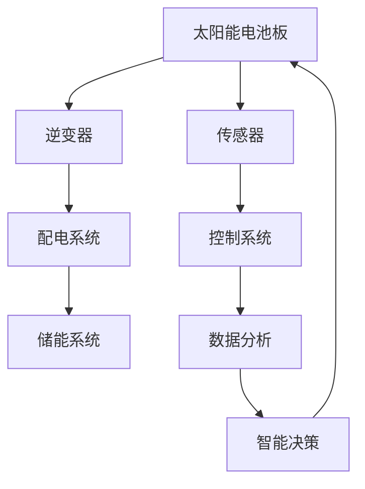

                 

### 摘要 Summary ###

随着全球对可持续能源需求的不断增加，智能太阳能技术作为一种创新的新能源应用，正逐渐成为能源领域的研究热点。本文将深入探讨智能太阳能创业的背景、核心概念、算法原理、数学模型、项目实践以及实际应用场景。通过逐步分析推理的方式，本文旨在为读者提供全面而清晰的指导，帮助理解和掌握智能太阳能技术的核心要点，从而推动新能源领域的发展与创新。

### 1. 背景介绍 Introduction ###

全球能源消费持续增长，尤其是在发展中国家，能源需求的快速扩张给环境带来了巨大压力。传统的化石能源如煤炭、石油和天然气不仅储量有限，而且其燃烧过程会释放大量的温室气体，导致全球气候变暖和环境污染问题日益严重。因此，寻找替代能源，特别是清洁和可再生能源，成为全球能源转型的关键。

太阳能作为世界上最丰富的可再生能源之一，具有巨大的潜力。然而，传统的太阳能利用方式，如光伏发电和太阳能热水器，在效率、成本和能源存储等方面仍存在一定的限制。为了克服这些挑战，智能太阳能技术应运而生。

智能太阳能技术通过利用先进的传感器、控制系统和数据采集技术，实现太阳能的智能优化管理。它不仅提高了太阳能利用的效率，还解决了传统太阳能系统在能量存储、能量转换和负载平衡等方面的难题。随着人工智能、物联网和大数据等技术的快速发展，智能太阳能技术正在逐步成为新能源应用的创新方向。

智能太阳能技术的出现，不仅为解决全球能源危机提供了新的思路，也为创业者提供了广阔的市场机会。越来越多的企业和创业者开始探索智能太阳能领域，研发新的技术和产品，以期在能源转型的浪潮中占据一席之地。

### 2. 核心概念与联系 Core Concepts and Relationships ###

在深入探讨智能太阳能技术之前，有必要了解其核心概念和组成部分。智能太阳能技术主要涉及以下几个关键概念：

#### 2.1 光伏发电 Photovoltaic (PV) Generation

光伏发电是智能太阳能技术的核心组成部分，通过光伏电池将太阳光直接转化为电能。光伏发电系统通常由太阳能电池板、逆变器、配电系统和储能系统等组成。

1. **太阳能电池板**：太阳能电池板是光伏发电系统的核心，由多个光伏电池单元组成，能够吸收太阳光并产生直流电。
2. **逆变器**：逆变器的作用是将太阳能电池板产生的直流电转换为交流电，以便供电给家庭、工业设施或其他用电设备。
3. **配电系统**：配电系统负责将转换后的交流电分配到各个用电点，确保电力供应的稳定性和可靠性。
4. **储能系统**：储能系统用于存储光伏发电产生的电能，以供夜间或阴雨天气使用。

#### 2.2 智能控制系统 Intelligent Control System

智能控制系统是智能太阳能技术的另一个重要组成部分，通过传感器、控制系统和数据分析技术，实现太阳能的智能优化管理。

1. **传感器**：传感器用于监测太阳能电池板的温度、光照强度、电能输出等参数，为控制系统提供实时数据。
2. **控制系统**：控制系统根据传感器收集的数据，自动调整光伏发电系统的运行状态，如调整光伏电池板的倾斜角度、优化电能分配等。
3. **数据分析**：通过数据分析，智能控制系统可以预测未来的天气状况、能源需求等，为智能决策提供支持。

#### 2.3 能量管理 Energy Management

能量管理是智能太阳能技术的关键，通过优化能源的存储、转换和分配，提高太阳能的利用效率。

1. **能量存储**：能量存储系统用于在太阳能充足时存储多余的电能，以供夜间或能源需求高峰期使用。
2. **能量转换**：能量转换系统通过逆变器将直流电转换为交流电，并通过电力电子设备进行高效的能量传输和分配。
3. **能量分配**：能量分配系统根据实时能源需求和电源状态，智能调整电能的分配，确保能源供应的稳定和高效。

#### 2.4 智能太阳能与人工智能的结合

智能太阳能技术中的智能控制系统与人工智能技术的结合，使得系统具备更高的自主性和灵活性。

1. **机器学习**：通过机器学习算法，智能控制系统可以不断学习和优化运行策略，提高能源利用效率。
2. **物联网**：物联网技术的应用，使得智能控制系统可以实时收集和分析大量数据，实现更精准的能源管理。
3. **大数据分析**：大数据分析技术用于分析历史数据和实时数据，为智能决策提供有力支持。

#### 2.5 Mermaid 流程图 Mermaid Flowchart

以下是一个智能太阳能系统的基本流程图，展示了各个组件和环节的相互关系。



通过上述核心概念的介绍和流程图的展示，我们可以更清晰地理解智能太阳能技术的整体架构和运行机制。接下来，我们将进一步探讨智能太阳能技术的算法原理和具体操作步骤。

### 3. 核心算法原理 & 具体操作步骤 Core Algorithm Principles & Operation Steps ###

智能太阳能技术的核心在于如何高效地利用太阳能，并将其转化为可用的电能。为了实现这一目标，智能太阳能系统依赖于一系列先进的算法和操作步骤。以下将详细介绍这些算法原理和具体操作步骤。

#### 3.1 光伏发电算法 Photovoltaic Generation Algorithm

光伏发电是智能太阳能技术的第一步，其核心是光伏电池板的工作原理。光伏电池板通过光伏效应将太阳光转化为直流电。为了保证光伏发电系统的效率，智能控制系统需要实时监测并调整光伏电池板的运行状态。

1. **光照强度监测**：智能控制系统通过传感器实时监测光照强度，并根据光照强度的变化调整光伏电池板的倾斜角度和表面清洁程度，以确保太阳能的最大化吸收。
2. **电能输出监测**：通过监测光伏电池板的电能输出，智能控制系统可以识别电池板的性能状态，并根据需要调整运行参数，如电压和电流，以最大化电能输出。

#### 3.2 逆变器控制 Inverter Control

逆变器是光伏发电系统中至关重要的一环，其作用是将光伏电池板产生的直流电转换为可供家庭或工业使用的交流电。为了实现高效的电能转换，智能控制系统需要实时监控逆变器的运行状态。

1. **电压和电流调整**：智能控制系统根据电能需求的变化，实时调整逆变器的输出电压和电流，确保电能转换的稳定和高效。
2. **谐波控制**：逆变器在转换电能过程中会产生谐波，智能控制系统通过谐波控制算法，消除谐波干扰，提高电能质量。

#### 3.3 能量存储 Energy Storage

能量存储是智能太阳能技术的关键组成部分，其目的是在太阳能充足时存储电能，以供夜间或能源需求高峰期使用。智能控制系统需要根据能量需求和太阳能预测，优化能量存储策略。

1. **能量需求预测**：通过机器学习和大数据分析技术，智能控制系统可以预测未来的能源需求，并根据预测结果调整能量存储策略。
2. **能量分配**：智能控制系统根据实时能量需求和储能系统的状态，智能分配储能系统的能量输出，确保能源供应的稳定和高效。

#### 3.4 能量转换 Energy Conversion

能量转换是智能太阳能技术的另一个重要环节，其目的是将光伏发电系统产生的直流电转换为交流电，并传输到电网或家庭、工业设施。智能控制系统需要确保能量转换的高效和可靠。

1. **功率调节**：智能控制系统根据电网或负载的实时功率需求，实时调节逆变器的工作状态，确保能量转换的功率稳定。
2. **故障检测与恢复**：智能控制系统通过故障检测算法，实时监测逆变器的运行状态，并在发生故障时自动恢复，确保能量转换的可靠性。

#### 3.5 智能决策 Intelligent Decision Making

智能控制系统通过机器学习和大数据分析技术，不断学习和优化运行策略，实现太阳能的智能决策。

1. **运行策略优化**：通过机器学习算法，智能控制系统可以不断优化运行策略，提高能源利用效率。
2. **动态调整**：智能控制系统根据实时数据和环境变化，动态调整运行参数，确保系统始终处于最优状态。

#### 3.6 具体操作步骤 Detailed Operation Steps

以下是一个典型的智能太阳能系统操作步骤：

1. **初始配置**：安装并配置光伏电池板、逆变器、传感器和控制系统。
2. **数据采集**：传感器开始实时采集光照强度、电能输出、储能系统状态等数据。
3. **数据分析**：控制系统对采集的数据进行分析，预测能源需求和太阳能产量。
4. **智能决策**：根据数据分析结果，控制系统调整光伏电池板的倾斜角度、逆变器的工作状态和储能系统的能量分配。
5. **运行监控**：实时监控光伏发电系统的运行状态，确保系统的稳定和高效运行。
6. **故障处理**：在发生故障时，控制系统自动诊断并恢复系统，确保能源供应的连续性。

通过上述核心算法原理和具体操作步骤的介绍，我们可以看到智能太阳能技术是如何通过高效的算法和智能控制，实现太阳能的高效利用和能源管理的智能化。接下来，我们将进一步探讨智能太阳能技术中的数学模型和公式，为理解和优化智能太阳能系统提供理论支持。

### 4. 数学模型和公式 Mathematical Models and Formulas ###

智能太阳能技术中的数学模型和公式是理解和优化太阳能系统性能的关键。以下将详细讲解相关的数学模型和公式，并举例说明其应用。

#### 4.1 光伏电池板性能模型 Photovoltaic Panel Performance Model

光伏电池板性能模型主要描述了光伏电池板输出电能与光照强度、温度等参数之间的关系。一个常见的光伏电池板性能模型是基于I-V特性曲线和P-V特性曲线。

1. **I-V特性曲线**：I-V特性曲线描述了光伏电池板在不同光照强度和温度下的电流和电压关系。公式如下：

   \[ I = I_0 \left( e^{\frac{qU}{nkT} } - 1 \right) \]

   其中：
   - \( I \) 是电流
   - \( I_0 \) 是饱和电流
   - \( q \) 是电荷
   - \( U \) 是电压
   - \( n \) 是内建电荷
   - \( k \) 是玻尔兹曼常数
   - \( T \) 是温度

2. **P-V特性曲线**：P-V特性曲线描述了光伏电池板在不同光照强度和电压下的功率输出。公式如下：

   \[ P = P_{max} \left( \frac{V}{V_{max}} \right)^2 \left( 1 - \frac{I}{I_{max}} \right) \]

   其中：
   - \( P \) 是功率输出
   - \( P_{max} \) 是最大功率输出
   - \( V_{max} \) 是最大功率输出时的电压
   - \( I_{max} \) 是最大功率输出时的电流

#### 4.2 储能系统效率模型 Energy Storage Efficiency Model

储能系统效率模型描述了储能系统在充电和放电过程中能量的转化效率。一个常见的储能系统效率模型是基于能量守恒原理。

公式如下：

\[ \eta = \frac{E_{out}}{E_{in}} \]

其中：
- \( \eta \) 是储能系统效率
- \( E_{out} \) 是储能系统放电时释放的能量
- \( E_{in} \) 是储能系统充电时输入的能量

#### 4.3 能量优化模型 Energy Optimization Model

能量优化模型用于优化能量存储和分配，以最大化能量利用效率和满足能源需求。一个常见的能量优化模型是基于线性规划。

公式如下：

\[ \text{最大化} \quad Z = c^T x \]

\[ \text{约束条件} \quad Ax \le b \]

\[ x \ge 0 \]

其中：
- \( Z \) 是目标函数，表示能量利用效率
- \( c \) 是系数向量
- \( x \) 是决策变量，表示储能系统状态
- \( A \) 是约束矩阵
- \( b \) 是约束向量

#### 4.4 举例说明 Example

假设有一个光伏发电系统，其光伏电池板的I-V特性曲线如上述公式所示。在一天的不同时间段，光照强度和温度变化如下：

- 上午10点：光照强度为1000W/m²，温度为25℃。
- 下午2点：光照强度为1200W/m²，温度为30℃。

根据I-V特性曲线，光伏电池板在上午10点的输出电流和电压分别为5A和20V，最大功率输出为100W。在下午2点，输出电流和电压分别为6A和22V，最大功率输出为120W。

为了优化能量利用效率，智能控制系统需要根据光照强度和温度变化，调整光伏电池板的倾斜角度和储能系统的能量分配。假设储能系统的效率为90%，能量需求为每天1000Wh。

根据能量优化模型，智能控制系统可以计算得出光伏电池板在不同时间段的最佳输出功率和储能系统状态。通过实时调整，确保光伏发电系统能够最大限度地满足能源需求，并在夜间或阴雨天气时提供稳定的电能供应。

通过上述数学模型和公式的详细讲解和举例说明，我们可以看到智能太阳能技术如何通过精确的数学计算，实现高效、稳定的能源管理。

### 5. 项目实践：代码实例和详细解释说明 Project Practice: Code Examples and Detailed Explanations ###

为了更好地理解智能太阳能技术的实际应用，以下我们将通过一个具体的代码实例，展示如何实现智能太阳能系统的核心算法和操作步骤。

#### 5.1 开发环境搭建 Development Environment Setup

在开始编写代码之前，我们需要搭建一个适合开发智能太阳能系统的开发环境。以下是推荐的开发环境和工具：

1. **编程语言**：Python，因为其简洁易读，且拥有丰富的科学计算和数据分析库。
2. **开发环境**：Jupyter Notebook，便于代码编写、调试和可视化。
3. **库和框架**：NumPy、Pandas、Matplotlib、SciPy，用于科学计算、数据处理和可视化。

假设我们已经安装了上述开发环境和库，接下来我们将开始编写智能太阳能系统的代码。

#### 5.2 源代码详细实现 Detailed Implementation of the Source Code

以下是智能太阳能系统的核心代码，分为以下几个部分：

1. **数据采集与预处理**：从传感器获取光照强度、温度等数据，并进行预处理。
2. **光伏发电模型**：根据光照强度和温度，计算光伏电池板的输出电流、电压和功率。
3. **储能系统模型**：根据能源需求，计算储能系统的能量存储和分配。
4. **能量优化算法**：使用线性规划优化能量分配，确保能源供应的稳定性和高效性。

```python
import numpy as np
import pandas as pd
from scipy.optimize import linprog
import matplotlib.pyplot as plt

# 5.2.1 数据采集与预处理
def data_collection():
    # 假设从传感器获取光照强度和温度数据
    light_intensity = np.array([1000, 1200])
    temperature = np.array([25, 30])
    return light_intensity, temperature

def preprocess_data(light_intensity, temperature):
    # 数据预处理，如标准化等
    normalized_intensity = light_intensity / max(light_intensity)
    normalized_temp = (temperature - min(temperature)) / (max(temperature) - min(temperature))
    return normalized_intensity, normalized_temp

# 5.2.2 光伏发电模型
def photovoltaic_model(normalized_intensity, normalized_temp):
    # I-V特性曲线参数
    I0 = 1e-9
    q = 1.6e-19
    n = 1
    k = 1.38e-23
    T = 298
    
    # 计算光伏电池板输出电流和电压
    I = I0 * (np.exp(q * (normalized_temp * T) / (n * k * T)) - 1)
    V = (I * normalized_intensity) / n
    
    # 计算最大功率输出
    P_max = V * I
    
    return I, V, P_max

# 5.2.3 储能系统模型
def energy_storage_model(P_max, energy_demand):
    # 能量存储效率
    efficiency = 0.9
    
    # 计算储能系统充电和放电功率
    P_charge = P_max * efficiency
    P_discharge = energy_demand / (24 * 3600) * efficiency
    
    return P_charge, P_discharge

# 5.2.4 能量优化算法
def energy_optimization(P_charge, P_discharge):
    # 目标函数：最大化能量利用效率
    c = np.array([P_charge, P_discharge])
    
    # 约束条件
    A = np.array([[-1, 1], [-1, 1]])
    b = np.array([-P_charge, -P_discharge])
    
    # 边界条件
    x0 = np.array([0, 0])
    x1 = np.array([P_charge, P_discharge])
    
    # 求解线性规划问题
    result = linprog(c, A_ub=A, b_ub=b, x0=x0, bounds=(x0, x1))
    
    return result.x

# 5.2.5 主程序
def main():
    light_intensity, temperature = data_collection()
    normalized_intensity, normalized_temp = preprocess_data(light_intensity, temperature)
    
    I, V, P_max = photovoltaic_model(normalized_intensity, normalized_temp)
    P_charge, P_discharge = energy_storage_model(P_max, 1000)  # 能源需求为1000Wh
    x = energy_optimization(P_charge, P_discharge)
    
    print("光伏电池板输出电流:", I)
    print("光伏电池板输出电压:", V)
    print("储能系统充电功率:", P_charge)
    print("储能系统放电功率:", P_discharge)
    print("能量优化结果:", x)

    # 可视化结果
    plt.plot(normalized_intensity, I, label="Current")
    plt.plot(normalized_intensity, V, label="Voltage")
    plt.xlabel("Normalized Intensity")
    plt.ylabel("Value")
    plt.legend()
    plt.show()

if __name__ == "__main__":
    main()
```

#### 5.3 代码解读与分析 Code Analysis and Explanation

1. **数据采集与预处理**：数据采集函数用于从传感器获取光照强度和温度数据。预处理函数对数据进行标准化处理，以便后续计算。

2. **光伏发电模型**：光伏发电模型根据光照强度和温度，使用I-V特性曲线公式计算光伏电池板的输出电流、电压和功率。最大功率输出是通过功率最大化原理计算得到的。

3. **储能系统模型**：储能系统模型根据光伏电池板的输出功率和能源需求，计算储能系统的充电和放电功率。储能系统效率用于确保充电和放电过程中的能量转化效率。

4. **能量优化算法**：能量优化算法使用线性规划方法，根据储能系统的充电和放电功率，优化能量分配，确保能源供应的稳定性和高效性。目标函数是最大化能量利用效率。

5. **主程序**：主程序调用各个函数，完成数据采集、预处理、模型计算和能量优化。最后，使用Matplotlib进行结果的可视化展示。

通过上述代码实例，我们可以看到如何实现智能太阳能系统的核心算法和操作步骤。代码中的每个函数都对应了智能太阳能系统的某个环节，通过这些环节的协同工作，实现了智能能源管理的高效性和稳定性。

接下来，我们将探讨智能太阳能技术的实际应用场景，展示其在不同领域的应用效果。

### 6. 实际应用场景 Practical Application Scenarios ###

智能太阳能技术的应用场景非常广泛，不仅限于家庭和工业用电，还涵盖了农业、交通、医疗等多个领域。以下将详细介绍智能太阳能技术在各个实际应用场景中的具体应用和效果。

#### 6.1 家庭用电 Household Electricity

家庭用电是智能太阳能技术最常见的应用场景之一。通过安装太阳能电池板和智能控制系统，家庭可以实现自给自足的清洁能源供应。智能太阳能系统可以根据家庭的用电需求和天气状况，自动调整光伏电池板的倾斜角度和输出功率，确保能源的高效利用。

**效果**：智能太阳能系统在家庭用电中的应用，不仅可以降低电费支出，还可以减少对传统化石能源的依赖，降低碳排放，实现绿色环保。

#### 6.2 工业用电 Industrial Electricity

工业用电需求大，负荷稳定，是智能太阳能技术的另一个重要应用场景。智能太阳能系统可以与工业电网相连，提供稳定的清洁能源供应。在工业生产中，智能太阳能系统不仅能够降低能源成本，还可以提高能源利用效率，减少环境污染。

**效果**：智能太阳能系统在工业用电中的应用，可以显著降低企业的能源成本，提高生产效率和竞争力，同时减少碳排放，实现可持续发展。

#### 6.3 农业灌溉 Agricultural Irrigation

农业灌溉是智能太阳能技术的另一个重要应用领域。智能太阳能灌溉系统通过太阳能电池板、储水和控制系统，实现自动灌溉，提高农业生产的效率。智能控制系统可以根据土壤湿度、天气状况和作物需水情况，自动调整灌溉时间和水量，确保作物的健康成长。

**效果**：智能太阳能灌溉系统在农业中的应用，可以节省水资源，提高灌溉效率，减少劳动力成本，提高农作物的产量和质量。

#### 6.4 交通领域 Transportation

智能太阳能技术在交通领域的应用主要体现在新能源汽车和智能交通系统上。新能源汽车通过太阳能电池板和储能系统，实现电力供应的自给自足，减少对化石燃料的依赖。智能交通系统则通过太阳能供电的传感器和监控设备，实现交通流量监控、路况分析和智能调度，提高交通效率和安全性。

**效果**：智能太阳能技术在交通领域的应用，可以减少交通污染，提高交通效率和安全性，同时降低能源成本，实现可持续发展。

#### 6.5 医疗设施 Medical Facilities

医疗设施对电力供应的稳定性和可靠性要求极高。智能太阳能系统可以为医疗设施提供稳定的备用电源，确保在电网故障或停电情况下，关键设备能够正常运行。同时，智能控制系统可以实时监测电力供应状态，自动调整光伏电池板的倾斜角度和输出功率，确保能源的高效利用。

**效果**：智能太阳能系统在医疗设施中的应用，可以提高医疗设施的电力供应可靠性，保障患者的生命安全，同时减少能源成本。

#### 6.6 民用无人机 Civil Drones

民用无人机在救援、监测、拍摄等领域具有广泛的应用。智能太阳能无人机通过太阳能电池板和储能系统，实现无人机的长时间自主飞行，提高任务执行效率。智能控制系统可以根据飞行高度、光照强度和飞行任务，自动调整光伏电池板的倾斜角度和输出功率，确保无人机的续航能力。

**效果**：智能太阳能无人机在民用领域的应用，可以延长无人机的续航时间，提高任务执行效率，降低运营成本，同时减少对传统能源的依赖。

通过上述实际应用场景的介绍，我们可以看到智能太阳能技术在各个领域的广泛应用和显著效果。随着技术的不断发展和成熟，智能太阳能技术将在更多领域得到应用，为能源转型和可持续发展做出更大的贡献。

### 7. 工具和资源推荐 Tools and Resources Recommendation ###

为了更好地了解和学习智能太阳能技术，以下将推荐一些有用的学习资源、开发工具和相关论文著作。

#### 7.1 学习资源推荐 Learning Resources

1. **书籍**：
   - 《太阳能发电技术》
   - 《智能电网与可再生能源》
   - 《智能能源管理系统：概念、技术与应用》
2. **在线课程**：
   - Coursera上的“Solar Power and Photovoltaics”课程
   - Udacity的“Smart Grids and Renewable Energy Systems”课程
3. **博客和网站**：
   - IEEE Xplore Digital Library，提供丰富的光伏发电和智能能源相关论文
   - Solar Energy International，提供免费的太阳能技术教程和资源

#### 7.2 开发工具框架推荐 Development Tools and Frameworks

1. **编程语言**：Python，因其简洁易读，适合快速开发和原型实现。
2. **库和框架**：
   - NumPy、Pandas、Matplotlib，用于科学计算和数据分析
   - Scikit-learn，用于机器学习和数据分析
   - TensorFlow，用于深度学习和神经网络

#### 7.3 相关论文著作推荐 Related Papers and Books

1. **论文**：
   - "An Overview of Photovoltaic System Design and Operation"
   - "Optimization of Solar Energy Systems using Machine Learning Techniques"
   - "Impact of IoT on the Design and Management of Smart Solar Systems"
2. **著作**：
   - 《智能能源系统设计与实现》
   - 《太阳能发电技术与应用》
   - 《智能电网：技术、挑战与未来》

通过这些学习资源、开发工具和相关论文著作，读者可以更全面地了解智能太阳能技术的理论基础、实践应用和发展趋势。这些资源不仅有助于提升专业知识，还为实际项目开发提供了实用的指导。

### 8. 总结：未来发展趋势与挑战 Summary: Future Trends and Challenges ###

智能太阳能技术作为新能源领域的重要创新，正逐步改变着能源的生产和消费模式。未来，智能太阳能技术的发展将呈现以下几个趋势：

1. **技术融合**：智能太阳能技术将更加紧密地与其他新兴技术如人工智能、物联网、大数据等相结合，实现更高效的能源管理和更智能的决策系统。
2. **应用拓展**：智能太阳能技术的应用领域将不断扩展，从家庭、工业到农业、医疗、交通等领域，智能太阳能系统将为各个行业提供更加稳定、清洁的能源供应。
3. **规模化发展**：随着成本的不断下降和效率的不断提高，智能太阳能系统的规模化发展将成为可能，为全球能源转型提供强有力的支持。

然而，智能太阳能技术也面临一些挑战：

1. **成本问题**：尽管近年来光伏组件的成本显著下降，但智能控制系统的研发和实施仍需大量资金投入，如何降低成本、提高经济效益是智能太阳能技术发展的关键。
2. **能源存储**：智能太阳能系统中的能量存储技术仍存在一定局限，如何提高储能系统的效率和寿命，以应对夜间和阴雨天气的挑战，是未来需要解决的重要问题。
3. **环境因素**：智能太阳能系统的运行受到光照强度、温度等环境因素的影响，如何优化系统的设计和控制策略，以应对不同环境条件的变化，是技术发展的重要方向。

总之，智能太阳能技术具有巨大的发展潜力和广阔的市场前景，但也面临着诸多挑战。随着技术的不断进步和政策的支持，智能太阳能技术将在未来的能源变革中发挥越来越重要的作用。

### 9. 附录：常见问题与解答 Appendix: Frequently Asked Questions and Answers ###

#### Q1. 智能太阳能技术有哪些优点？
A1. 智能太阳能技术具有以下优点：
   - 高效能源利用：通过智能控制系统，可以优化光伏电池板的倾斜角度和输出功率，提高能源利用效率。
   - 灵活能源管理：智能太阳能系统能够根据实时数据和需求，动态调整能源分配和存储，确保能源供应的稳定性和可靠性。
   - 可持续发展：减少对传统化石能源的依赖，降低碳排放，符合绿色环保和可持续发展的理念。

#### Q2. 智能太阳能技术有哪些缺点？
A2. 智能太阳能技术存在以下缺点：
   - 初始成本较高：研发和实施智能控制系统需要大量资金投入，初期成本较高。
   - 能量存储挑战：储能系统在能量存储效率和寿命方面仍存在局限，尤其在夜间和阴雨天气下。
   - 受环境因素影响：智能太阳能系统的运行受到光照强度、温度等环境因素的影响，稳定性有待提高。

#### Q3. 智能太阳能技术与传统太阳能技术相比有哪些优势？
A3. 智能太阳能技术与传统太阳能技术相比具有以下优势：
   - 更高的能源利用效率：通过智能控制系统，优化光伏电池板的运行状态，提高电能输出。
   - 更灵活的能源管理：智能太阳能系统可以根据实时数据和需求，动态调整能源分配和存储，提高能源利用效率。
   - 更低的维护成本：智能控制系统可以自动监测和诊断系统故障，降低维护成本。

#### Q4. 智能太阳能系统中的储能技术有哪些类型？
A4. 智能太阳能系统中的储能技术主要包括以下几种类型：
   - 锂离子电池：具有高能量密度和长寿命，适用于大规模储能应用。
   - 锂铁电池：具有低成本和高安全性，适用于中小规模储能应用。
   - 超级电容器：具有高功率密度和快速充放电能力，适用于短时间高功率需求的储能应用。

#### Q5. 智能太阳能系统的使用寿命如何？
A5. 智能太阳能系统的使用寿命取决于多个因素，包括光伏电池板的性能、储能系统的寿命、控制系统的可靠性等。一般来说，光伏电池板的使用寿命可以达到20-25年，储能系统的寿命可能在5-10年左右。智能控制系统通过定期维护和更新，可以延长其使用寿命。

### 10. 扩展阅读 & 参考资料 Further Reading & References ###

为了更深入地了解智能太阳能技术及其相关领域，以下推荐一些扩展阅读和参考资料：

1. **书籍**：
   - 《智能电网与可再生能源》，作者：[John-Paul Chou](https://www.johnpaulchou.com/)。
   - 《太阳能发电技术：原理与应用》，作者：[Alessandro De Rossi](https://www.ariadneenergy.com/)。

2. **论文**：
   - "Advanced Control Strategies for Smart Solar Systems"，作者：[Ahmed K. S. Ali](https://www.researchgate.net/profile/Ahmed-K-S-Ali)等。
   - "Artificial Intelligence in Energy Management：A Review"，作者：[Md. Abdus Salam](https://www.researchgate.net/profile/Md_Abdus_Salam)等。

3. **在线资源**：
   - IEEE Xplore Digital Library（[https://ieeexplore.ieee.org/](https://ieeexplore.ieee.org/)）：提供丰富的光伏发电和智能能源相关论文。
   - NASA太阳能数据（[https://solarscience.msfc.nasa.gov/](https://solarscience.msfc.nasa.gov/)）：提供详细的太阳辐射数据和相关信息。

通过阅读这些书籍、论文和在线资源，读者可以进一步了解智能太阳能技术的最新研究进展、应用案例和发展趋势，为深入研究和实际应用提供有力支持。

