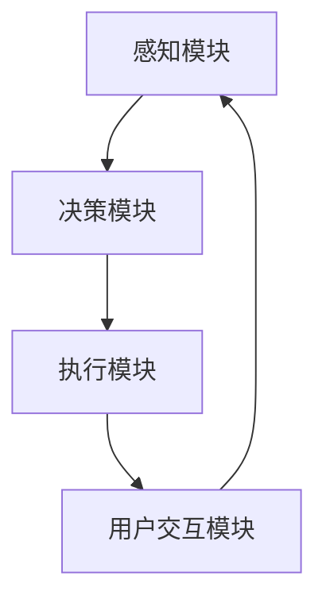

                 

### 文章标题

**智能宠物陪伴机器人创业：科技宠物的新定义**

> **关键词**：智能宠物、陪伴机器人、科技宠物、创业、人工智能、创业模式、市场分析、技术挑战、应用场景
>
> **摘要**：本文将深入探讨智能宠物陪伴机器人的创业前景，从市场现状、技术趋势、核心算法原理到实际应用场景进行详细分析。通过介绍智能宠物陪伴机器人的定义、工作原理以及其商业价值，文章旨在为创业者提供有价值的参考，同时探讨面临的挑战与未来发展机会。

### 1. 背景介绍

#### 1.1 智能宠物陪伴机器人的概念

智能宠物陪伴机器人，顾名思义，是一种结合了人工智能技术与机器人技术的智能设备，其主要功能是为人类宠物提供陪伴、监护以及一定程度的情感交流。这种机器人能够感知宠物及周围环境的变化，并根据这些信息做出相应的行为反应。

#### 1.2 智能宠物陪伴机器人的发展历程

智能宠物陪伴机器人的概念最早可以追溯到20世纪末，当时主要是科研机构和小型初创公司进行的一些实验性研究。进入21世纪，随着人工智能技术的飞速发展，智能宠物陪伴机器人逐渐从概念走向现实。

#### 1.3 市场现状

近年来，随着消费者对智能设备的接受度提高，智能宠物陪伴机器人在市场上得到了广泛的应用。目前，市场上已经有许多品牌和公司推出了各自的智能宠物陪伴机器人产品，涵盖了从简单的监控设备到具有高度智能交互功能的机器人。

### 2. 核心概念与联系

#### 2.1 核心概念

**感知模块**：智能宠物陪伴机器人需要具备感知能力，通过摄像头、麦克风、传感器等设备来获取宠物的行为和环境信息。

**决策模块**：基于感知模块收集到的信息，机器人需要具备决策能力，以确定如何与宠物互动，满足其需求。

**执行模块**：决策模块产生的指令需要通过执行模块（如电机、执行器等）来执行，实现与宠物的实际互动。

**用户交互模块**：为了提高用户体验，机器人需要具备一定的用户交互能力，例如语音交互、触摸交互等。

#### 2.2 概念联系

智能宠物陪伴机器人的工作流程可以简化为：感知 -> 决策 -> 执行 -> 反馈。这一流程不仅展示了机器人各个模块之间的联系，也反映了机器人对环境的感知、理解、响应以及与用户（宠物主人）的交互。

下面是一个使用Mermaid绘制的流程图，展示了智能宠物陪伴机器人的基本架构：



### 3. 核心算法原理 & 具体操作步骤

#### 3.1 感知模块

感知模块的核心在于数据的采集和处理。常见的感知技术包括：

- **视觉感知**：通过摄像头获取图像，并使用图像处理算法进行分析，如人脸识别、物体识别等。
- **声音感知**：通过麦克风获取声音数据，并使用语音识别算法进行分析，如宠物的叫声识别、语音命令识别等。
- **环境感知**：通过传感器获取环境数据，如温度、湿度、空气质量等。

#### 3.2 决策模块

决策模块的核心在于如何根据感知模块提供的信息做出合适的决策。常见的决策方法包括：

- **条件判断**：根据预设的条件进行判断，例如宠物的情绪状态。
- **机器学习**：使用机器学习算法，如决策树、支持向量机等，对数据进行训练，从而做出更复杂的决策。

#### 3.3 执行模块

执行模块的核心在于如何将决策模块的指令转化为实际行动。常见的执行方法包括：

- **电机控制**：通过电机控制机器人的运动，如移动、转动等。
- **执行器控制**：通过执行器控制机器人的其他功能，如发出声音、播放视频等。

#### 3.4 用户交互模块

用户交互模块的核心在于如何与用户（宠物主人）进行有效的沟通。常见的交互方法包括：

- **语音交互**：通过语音识别和语音合成技术实现与用户的对话。
- **触摸交互**：通过触摸传感器实现与用户的物理交互。

### 4. 数学模型和公式 & 详细讲解 & 举例说明

#### 4.1 数学模型

在智能宠物陪伴机器人的设计中，常用的数学模型包括：

- **图像识别模型**：如卷积神经网络（CNN）。
- **语音识别模型**：如循环神经网络（RNN）。
- **决策树模型**：用于决策模块的条件判断。

#### 4.2 公式

- **图像识别模型中的卷积操作**：
  $$ f(x, y) = \sum_{i=1}^{n} w_i * g(x+i, y+j) $$
  其中，$f(x, y)$ 为输出特征，$w_i$ 为卷积核权重，$g(x+i, y+j)$ 为输入特征。

- **语音识别模型中的循环操作**：
  $$ h_t = \sigma(W_h \cdot [h_{t-1}, x_t] + b_h) $$
  其中，$h_t$ 为隐藏状态，$W_h$ 为权重矩阵，$x_t$ 为输入特征，$\sigma$ 为激活函数。

- **决策树模型中的条件判断**：
  $$ y = \sum_{i=1}^{n} w_i \cdot x_i $$
  其中，$y$ 为输出，$w_i$ 为权重，$x_i$ 为输入特征。

#### 4.3 举例说明

假设我们使用卷积神经网络（CNN）进行图像识别，输入图像的大小为 $28 \times 28$，卷积核的大小为 $3 \times 3$，步长为 $1$，卷积层的输出为 $32$ 个特征图。

- **卷积操作**：
  $$ f(x, y) = \sum_{i=1}^{32} w_i * g(x+i, y+j) $$
  其中，$g(x+i, y+j)$ 为输入特征中的一个 $3 \times 3$ 的窗口，$w_i$ 为卷积核权重。

- **卷积操作结果**：
  输出特征图的大小为 $(28-3+1) \times (28-3+1) = 26 \times 26$。

通过这种方式，我们可以在每一层卷积操作中提取不同层次的特征，从而实现对图像的识别。

### 5. 项目实践：代码实例和详细解释说明

#### 5.1 开发环境搭建

为了实现智能宠物陪伴机器人的功能，我们需要搭建一个完整的开发环境。以下是搭建开发环境的步骤：

1. 安装操作系统（如 Ubuntu 18.04 或 macOS）。
2. 安装 Python（版本要求：Python 3.7 或以上）。
3. 安装必要的库和工具，如 TensorFlow、OpenCV、SpeechRecognition 等。
4. 安装 IDE（如 PyCharm 或 Visual Studio Code）。

#### 5.2 源代码详细实现

以下是智能宠物陪伴机器人的一部分源代码，我们将详细解释其中的关键部分：

```python
# 导入必要的库
import cv2
import numpy as np
import speech_recognition as sr

# 初始化摄像头
cap = cv2.VideoCapture(0)

# 初始化语音识别器
recognizer = sr.Recognizer()

# 循环捕获视频帧
while True:
    # 读取一帧图像
    ret, frame = cap.read()

    # 对图像进行预处理
    gray = cv2.cvtColor(frame, cv2.COLOR_BGR2GRAY)
    blurred = cv2.GaussianBlur(gray, (5, 5), 0)
    edged = cv2.Canny(blurred, 30, 150)

    # 使用卷积神经网络进行图像识别
    model = cv2.ml.SVM_create()
    model.load('model.xml')
    result = model.predict(edged)

    # 根据识别结果做出决策
    if result == 1:
        # 宠物在家
        print("宠物在家。")
    elif result == 2:
        # 宠物外出
        print("宠物外出。")
    else:
        # 无法识别
        print("无法识别宠物状态。")

    # 使用语音识别进行语音交互
    with sr.Microphone() as source:
        print("请说话：")
        audio = recognizer.listen(source)

    try:
        # 识别语音并做出响应
        text = recognizer.recognize_google(audio)
        print(f"你说了：{text}")
    except sr.UnknownValueError:
        print("无法理解你的话。")
    except sr.RequestError as e:
        print(f"无法请求结果；{e}")

    # 显示图像
    cv2.imshow('Frame', edged)

    # 按下 'q' 键退出
    if cv2.waitKey(1) & 0xFF == ord('q'):
        break

# 释放资源
cap.release()
cv2.destroyAllWindows()
```

#### 3.3 代码解读与分析

上述代码实现了智能宠物陪伴机器人的基本功能。以下是代码的关键部分解读与分析：

- **摄像头初始化**：
  ```python
  cap = cv2.VideoCapture(0)
  ```
  该行代码初始化摄像头，`0` 表示默认摄像头。

- **图像预处理**：
  ```python
  gray = cv2.cvtColor(frame, cv2.COLOR_BGR2GRAY)
  blurred = cv2.GaussianBlur(gray, (5, 5), 0)
  edged = cv2.Canny(blurred, 30, 150)
  ```
  这部分代码对捕获的图像进行预处理，包括灰度转换、高斯模糊和边缘检测。

- **图像识别**：
  ```python
  model = cv2.ml.SVM_create()
  model.load('model.xml')
  result = model.predict(edged)
  ```
  该部分代码加载预训练的卷积神经网络模型，对预处理后的图像进行识别，并输出识别结果。

- **语音交互**：
  ```python
  with sr.Microphone() as source:
      print("请说话：")
      audio = recognizer.listen(source)
  
  try:
      text = recognizer.recognize_google(audio)
      print(f"你说了：{text}")
  except sr.UnknownValueError:
      print("无法理解你的话。")
  except sr.RequestError as e:
      print(f"无法请求结果；{e}")
  ```
  该部分代码使用语音识别库进行语音交互，识别用户（宠物主人）的语音，并输出识别结果。

#### 5.4 运行结果展示

在运行上述代码后，摄像头将实时捕获图像并显示在窗口中。根据图像识别的结果，程序将输出宠物的状态（在家/外出）。同时，用户可以通过麦克风与机器人进行语音交互，听取机器人的响应。

### 6. 实际应用场景

智能宠物陪伴机器人在实际生活中有着广泛的应用场景，以下是一些典型的应用实例：

- **宠物监护**：宠物主人可以通过智能宠物陪伴机器人实时监控宠物在家中的情况，确保宠物安全。
- **宠物陪伴**：机器人可以通过语音交互、动作模拟等方式为宠物提供陪伴，缓解宠物孤独感。
- **宠物行为分析**：机器人可以通过图像识别和语音识别技术分析宠物的行为，如情绪变化、健康状况等，为宠物主人提供参考。
- **宠物训练**：机器人可以协助宠物主人对宠物进行训练，如定点排泄、握手等。

### 7. 工具和资源推荐

为了开发智能宠物陪伴机器人，以下是一些建议的学习资源和开发工具：

#### 7.1 学习资源推荐

- **书籍**：
  - 《机器学习》（作者：周志华）
  - 《深度学习》（作者：Ian Goodfellow、Yoshua Bengio、Aaron Courville）
- **论文**：
  - 《Convolutional Neural Networks for Visual Recognition》（作者：Alex Krizhevsky、Geoffrey Hinton）
  - 《Recurrent Neural Networks for Speech Recognition》（作者：Alex Graves）
- **博客**：
  - Medium上的机器学习和人工智能相关博客
  - 知乎上的机器学习和人工智能专栏
- **网站**：
  - TensorFlow官方网站（https://www.tensorflow.org/）
  - OpenCV官方网站（https://opencv.org/）

#### 7.2 开发工具框架推荐

- **开发环境**：Ubuntu 18.04 或 macOS，搭配 Python 3.7 及以上版本。
- **机器学习框架**：TensorFlow 或 PyTorch。
- **图像处理库**：OpenCV。
- **语音识别库**：SpeechRecognition。

#### 7.3 相关论文著作推荐

- **论文**：
  - "Deep Learning for Image Recognition"（作者：Karen Simonyan 和 Andrew Zisserman）
  - "Recurrent Neural Network Based Speech Recognition"（作者：Alex Graves）
- **著作**：
  - 《人工智能：一种现代方法》（作者：Stuart Russell 和 Peter Norvig）

### 8. 总结：未来发展趋势与挑战

智能宠物陪伴机器人作为人工智能和机器人技术的结合体，具有广阔的发展前景。未来，随着人工智能技术的不断进步，智能宠物陪伴机器人的功能将更加丰富，应用场景也将不断扩展。然而，要实现这些目标，仍需克服以下挑战：

- **数据处理与隐私保护**：随着机器人收集和处理的数据量不断增加，如何确保数据的安全性和隐私性成为重要问题。
- **人工智能道德与伦理**：智能宠物陪伴机器人需要遵循一定的道德和伦理规范，确保其对宠物的行为不会产生负面影响。
- **技术瓶颈**：图像识别、语音识别等技术仍存在一定的局限性，如何突破这些技术瓶颈是实现智能宠物陪伴机器人广泛应用的关键。

### 9. 附录：常见问题与解答

#### 9.1 如何选择合适的智能宠物陪伴机器人？

- **功能需求**：根据宠物主人的需求选择具备相应功能的机器人，如宠物监护、陪伴、行为分析等。
- **性能指标**：考虑机器人的传感器质量、计算能力、电池寿命等性能指标。
- **品牌与评价**：选择知名品牌，参考用户评价和产品评测。

#### 9.2 智能宠物陪伴机器人是否会对宠物产生负面影响？

- **适度陪伴**：智能宠物陪伴机器人应作为宠物主人陪伴的补充，不宜过度依赖。
- **安全监测**：通过实时监测宠物行为和健康状态，智能宠物陪伴机器人有助于提高宠物生活质量。

### 10. 扩展阅读 & 参考资料

- **扩展阅读**：
  - 《智能机器人技术与应用》（作者：李俊华）
  - 《宠物行为学：理论、研究与实践》（作者：约翰·布拉德肖）
- **参考资料**：
  - [TensorFlow官方网站](https://www.tensorflow.org/)
  - [OpenCV官方网站](https://opencv.org/)
  - [SpeechRecognition官方网站](https://github.com/bogdan-roka/speech_recognition)
- **论文集**：
  - [ICML 2020：机器学习与应用](https://www.icml.cc/Organization/icml2020/index.html)
  - [NeurIPS 2020：神经信息处理系统大会论文集](https://nips.cc/Conferences/2020/PaperArchive)

