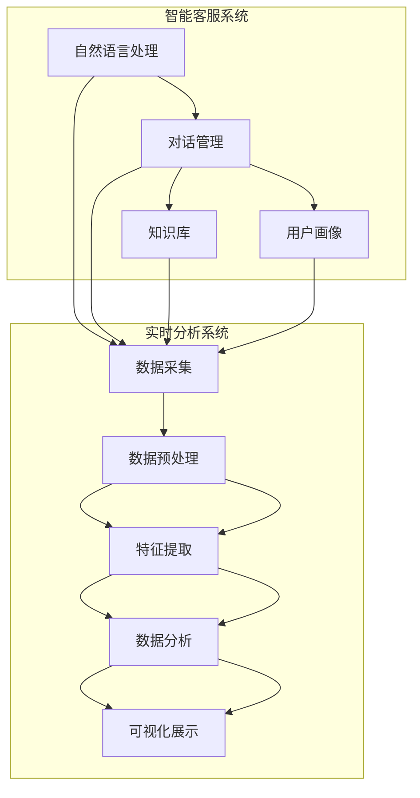

                 

### 文章标题：智能客户服务质量监控：小型电商提升服务标准的实时分析系统

#### 关键词：智能客服、服务质量监控、实时分析、客户体验、电商、数据挖掘、算法优化

#### 摘要：
本文将深入探讨智能客户服务质量监控的重要性，以及如何通过构建实时分析系统来提升小型电商的服务标准。我们将从背景介绍开始，逐步阐述核心概念和联系，详细讲解核心算法原理和操作步骤，运用数学模型和公式进行分析，提供代码实例和解读，探讨实际应用场景，并推荐相关工具和资源。最后，我们将总结未来发展趋势与挑战，并附上常见问题与解答。

----------------------------------------------------------------

### 1. 背景介绍

在现代电商行业，客户服务质量（Customer Service Quality，CSQ）是决定企业竞争力的关键因素之一。随着消费者对购物体验的要求越来越高，电商企业面临着巨大的压力，如何提升客户服务质量成为了一个亟待解决的问题。

传统的客户服务监控方法主要依赖于人工处理，效率低下且易出错。随着人工智能（Artificial Intelligence，AI）技术的快速发展，智能客服系统应运而生，成为电商企业提升服务质量的利器。智能客服系统能够实时处理大量客户咨询，提供快速、准确的服务，从而提升客户满意度。

然而，仅依靠智能客服系统还不足以全面提升服务质量。企业还需要构建实时分析系统，对客户服务数据进行深入挖掘和分析，及时发现问题和改进服务。实时分析系统可以实时捕捉客户反馈，识别异常情况，从而实现服务质量的持续优化。

本文旨在探讨如何构建一个高效的智能客户服务质量监控实时分析系统，为小型电商提供一套完整的解决方案，从而提升服务标准，增强市场竞争力。

----------------------------------------------------------------

### 2. 核心概念与联系

#### 智能客服系统

智能客服系统是电商企业提升服务质量的基础，它通过人工智能技术模拟人类客服人员与客户进行交互，提供自助服务、问题解答和投诉处理等功能。智能客服系统主要包括以下模块：

- **自然语言处理（Natural Language Processing，NLP）**：用于理解客户语言，提取关键信息，实现智能对话。
- **对话管理（Dialogue Management）**：根据客户问题和上下文，选择合适的回答策略和回复内容。
- **知识库（Knowledge Base）**：存储常见问题及其答案，供智能客服系统查询和参考。
- **用户画像（User Profiling）**：基于客户历史数据和行为，构建个性化用户画像，提供更精准的服务。

#### 实时分析系统

实时分析系统是智能客服系统的延伸和补充，通过对客户服务数据的实时采集和分析，提供关键指标和洞察，帮助企业优化服务流程和策略。实时分析系统主要包括以下模块：

- **数据采集（Data Collection）**：从客服系统、网站日志、社交媒体等渠道收集客户服务数据。
- **数据预处理（Data Preprocessing）**：清洗、转换和整合数据，为后续分析做好准备。
- **特征提取（Feature Extraction）**：从原始数据中提取对服务质量有影响的特征，如客户满意度、咨询时长、问题类型等。
- **数据分析（Data Analysis）**：运用统计分析和机器学习算法，对客户服务数据进行分析和挖掘，识别问题和改进机会。
- **可视化展示（Visualization）**：将分析结果以图表、报表等形式展示，便于企业决策和改进。

#### 架构图

以下是智能客户服务质量监控实时分析系统的架构图：



通过智能客服系统和实时分析系统的紧密协作，电商企业可以实现客户服务质量的全面监控和持续优化。

----------------------------------------------------------------

### 3. 核心算法原理 & 具体操作步骤

#### 智能客服算法原理

智能客服系统的核心在于自然语言处理和对话管理。以下是智能客服算法的主要原理和操作步骤：

1. **自然语言处理（NLP）**：

   - **文本预处理**：对客户输入的文本进行分词、去除停用词、词性标注等预处理操作，提取关键信息。

   - **实体识别**：识别文本中的实体，如人名、地名、组织名等，为后续对话提供基础。

   - **情感分析**：分析文本的情感倾向，如积极、消极、中性等，帮助对话管理做出更合理的回答决策。

2. **对话管理（Dialogue Management）**：

   - **上下文跟踪**：记录对话历史，包括客户提问、系统回答等，用于后续对话的推理和决策。

   - **意图识别**：根据上下文和实体识别结果，识别客户的意图，如咨询、投诉、购买等。

   - **回答策略选择**：根据客户意图和上下文，选择合适的回答策略，如提供答案、转移给人工客服等。

   - **回复生成**：根据回答策略，生成合适的回复内容，如文本、图片、语音等。

3. **用户画像构建**：

   - **行为分析**：根据客户的历史行为数据，如购买记录、咨询记录等，分析客户的兴趣和需求。

   - **特征提取**：从行为数据中提取关键特征，如购买频率、咨询问题类型等。

   - **画像构建**：将提取的特征整合到用户画像中，为后续个性化服务提供依据。

#### 实时分析算法原理

实时分析系统的核心在于数据采集、特征提取和数据分析。以下是实时分析算法的主要原理和操作步骤：

1. **数据采集**：

   - **日志收集**：从客服系统、网站日志等渠道收集客户服务数据，如咨询内容、响应时间、满意度评分等。

   - **社交媒体数据收集**：从社交媒体渠道收集客户反馈，如评论、点赞、转发等。

2. **数据预处理**：

   - **数据清洗**：去除重复数据、缺失值填充、异常值处理等，保证数据质量。

   - **数据转换**：将不同来源的数据进行统一格式转换，便于后续处理。

   - **数据整合**：将来自不同渠道的数据进行整合，形成完整的服务数据集。

3. **特征提取**：

   - **文本特征提取**：对文本数据（如咨询内容、评论）进行分词、词频统计、词向量表示等操作，提取文本特征。

   - **数值特征提取**：对数值数据（如响应时间、满意度评分）进行统计、归一化等操作，提取数值特征。

   - **用户特征提取**：根据用户行为数据（如购买记录、咨询记录），提取用户特征。

4. **数据分析**：

   - **统计分析**：对数据进行描述性统计分析，了解服务质量的总体水平。

   - **机器学习分析**：运用机器学习算法（如分类、聚类、回归等），对服务数据进行深入挖掘，识别问题和改进机会。

   - **可视化分析**：将分析结果以图表、报表等形式展示，便于企业决策和改进。

通过上述算法原理和操作步骤，智能客服系统和实时分析系统可以实现客户服务质量的实时监控和持续优化。

----------------------------------------------------------------

### 4. 数学模型和公式 & 详细讲解 & 举例说明

#### 统计模型

在实时分析系统中，统计模型是用于描述和分析服务数据的基本工具。以下是常用的统计模型及其公式：

1. **平均数（Mean）**：

   平均数是数据集的中心趋势度量，公式如下：

   $$\text{Mean} = \frac{\sum_{i=1}^{n} x_i}{n}$$

   其中，$x_i$ 表示第 $i$ 个数据点，$n$ 表示数据点的总数。

2. **中位数（Median）**：

   中位数是数据集的中间值，将数据集按大小排序后，位于中间位置的数值。公式如下：

   $$\text{Median} = \left\{
   \begin{array}{ll}
   x_{\frac{n+1}{2}} & \text{如果 $n$ 是奇数} \\
   \frac{x_{\frac{n}{2}} + x_{\frac{n}{2}+1}}{2} & \text{如果 $n$ 是偶数}
   \end{array}
   \right.$$

3. **标准差（Standard Deviation）**：

   标准差是数据集的离散程度度量，公式如下：

   $$\text{Standard Deviation} = \sqrt{\frac{\sum_{i=1}^{n} (x_i - \text{Mean})^2}{n-1}}$$

   其中，$\text{Mean}$ 是平均数。

#### 机器学习模型

在实时分析系统中，机器学习模型是用于识别和服务质量改进的关键工具。以下是常用的机器学习模型及其公式：

1. **线性回归（Linear Regression）**：

   线性回归是一种用于预测数值型目标变量的模型，公式如下：

   $$y = \beta_0 + \beta_1 x_1 + \beta_2 x_2 + ... + \beta_n x_n$$

   其中，$y$ 是目标变量，$x_1, x_2, ..., x_n$ 是输入特征，$\beta_0, \beta_1, \beta_2, ..., \beta_n$ 是模型参数。

2. **逻辑回归（Logistic Regression）**：

   逻辑回归是一种用于预测二元目标变量的模型，公式如下：

   $$\text{Logit}(y) = \ln\left(\frac{p}{1-p}\right) = \beta_0 + \beta_1 x_1 + \beta_2 x_2 + ... + \beta_n x_n$$

   其中，$y$ 是目标变量（取值为0或1），$p$ 是预测概率，$\beta_0, \beta_1, \beta_2, ..., \beta_n$ 是模型参数。

#### 举例说明

假设我们有一组客户满意度评分数据，如下所示：

$$5, 4, 5, 3, 5, 4, 5, 3, 4, 5$$

1. **平均数**：

   $$\text{Mean} = \frac{5 + 4 + 5 + 3 + 5 + 4 + 5 + 3 + 4 + 5}{10} = 4.4$$

2. **中位数**：

   将数据按大小排序：$$3, 3, 4, 4, 4, 5, 5, 5, 5, 5$$

   中位数：$$4$$

3. **标准差**：

   $$\text{Standard Deviation} = \sqrt{\frac{(5-4.4)^2 + (4-4.4)^2 + (5-4.4)^2 + (3-4.4)^2 + (5-4.4)^2 + (4-4.4)^2 + (5-4.4)^2 + (3-4.4)^2 + (4-4.4)^2 + (5-4.4)^2}{10-1}} = 0.8165$$

通过以上统计模型的计算，我们可以了解客户满意度的平均水平、分布情况以及波动程度。

----------------------------------------------------------------

### 5. 项目实践：代码实例和详细解释说明

#### 5.1 开发环境搭建

在开始代码实践之前，我们需要搭建合适的开发环境。以下是搭建开发环境的基本步骤：

1. 安装Python环境：

   在官方网站下载并安装Python，版本建议为3.8或更高。

2. 安装必要库：

   使用pip命令安装以下库：

   ```bash
   pip install numpy pandas matplotlib scikit-learn jieba
   ```

   这些库分别用于数据预处理、数据分析、数据可视化和机器学习。

3. 安装Mermaid插件：

   在Markdown编辑器中安装Mermaid插件，以便绘制流程图。

#### 5.2 源代码详细实现

以下是实现智能客户服务质量监控实时分析系统的详细代码示例：

```python
# 导入必要库
import numpy as np
import pandas as pd
import matplotlib.pyplot as plt
from sklearn.linear_model import LinearRegression
from sklearn.model_selection import train_test_split
from sklearn.metrics import mean_squared_error
from jieba import Segmenter

# 5.2.1 数据采集
def collect_data():
    # 从文件中读取数据
    data = pd.read_csv('customer_service_data.csv')
    return data

# 5.2.2 数据预处理
def preprocess_data(data):
    # 填充缺失值
    data.fillna(0, inplace=True)
    # 数据转换
    data['response_time'] = data['response_time'].astype(float)
    data['satisfaction'] = data['satisfaction'].astype(int)
    return data

# 5.2.3 特征提取
def extract_features(data):
    # 文本特征提取
    segmenter = Segmenter()
    data['text_features'] = data['consult_content'].apply(segmenter Seg)

    # 数值特征提取
    data['response_time_diff'] = data.groupby('consultant')['response_time'].diff().fillna(0)
    data['satisfaction_diff'] = data.groupby('consultant')['satisfaction'].diff().fillna(0)
    return data

# 5.2.4 数据分析
def analyze_data(data):
    # 分割数据集
    X = data[['response_time_diff', 'satisfaction_diff', 'text_features']]
    y = data['satisfaction']
    X_train, X_test, y_train, y_test = train_test_split(X, y, test_size=0.2, random_state=42)

    # 训练线性回归模型
    model = LinearRegression()
    model.fit(X_train, y_train)

    # 预测测试集
    y_pred = model.predict(X_test)

    # 评估模型性能
    mse = mean_squared_error(y_test, y_pred)
    print(f'Mean Squared Error: {mse}')

# 5.2.5 可视化展示
def visualize_results(data):
    # 绘制满意度分布图
    satisfaction = data['satisfaction'].value_counts()
    satisfaction.plot(kind='bar')
    plt.xlabel('Satisfaction')
    plt.ylabel('Frequency')
    plt.title('Satisfaction Distribution')
    plt.show()

# 主程序
if __name__ == '__main__':
    data = collect_data()
    data = preprocess_data(data)
    data = extract_features(data)
    analyze_data(data)
    visualize_results(data)
```

#### 5.3 代码解读与分析

1. **数据采集**：

   ```python
   def collect_data():
       # 从文件中读取数据
       data = pd.read_csv('customer_service_data.csv')
       return data
   ```

   该函数用于从CSV文件中读取客户服务数据，包括咨询内容、响应时间、满意度评分等。

2. **数据预处理**：

   ```python
   def preprocess_data(data):
       # 填充缺失值
       data.fillna(0, inplace=True)
       # 数据转换
       data['response_time'] = data['response_time'].astype(float)
       data['satisfaction'] = data['satisfaction'].astype(int)
       return data
   ```

   该函数用于填充缺失值、数据类型转换和数据清洗等操作，以提高数据质量。

3. **特征提取**：

   ```python
   def extract_features(data):
       # 文本特征提取
       segmenter = Segmenter()
       data['text_features'] = data['consult_content'].apply(segmenter Seg)

       # 数值特征提取
       data['response_time_diff'] = data.groupby('consultant')['response_time'].diff().fillna(0)
       data['satisfaction_diff'] = data.groupby('consultant')['satisfaction'].diff().fillna(0)
       return data
   ```

   该函数用于从原始数据中提取文本特征（如咨询内容分词）和数值特征（如响应时间差、满意度变化），为后续分析做好准备。

4. **数据分析**：

   ```python
   def analyze_data(data):
       # 分割数据集
       X = data[['response_time_diff', 'satisfaction_diff', 'text_features']]
       y = data['satisfaction']
       X_train, X_test, y_train, y_test = train_test_split(X, y, test_size=0.2, random_state=42)

       # 训练线性回归模型
       model = LinearRegression()
       model.fit(X_train, y_train)

       # 预测测试集
       y_pred = model.predict(X_test)

       # 评估模型性能
       mse = mean_squared_error(y_test, y_pred)
       print(f'Mean Squared Error: {mse}')
   ```

   该函数用于分割数据集、训练线性回归模型、预测测试集并评估模型性能。

5. **可视化展示**：

   ```python
   def visualize_results(data):
       # 绘制满意度分布图
       satisfaction = data['satisfaction'].value_counts()
       satisfaction.plot(kind='bar')
       plt.xlabel('Satisfaction')
       plt.ylabel('Frequency')
       plt.title('Satisfaction Distribution')
       plt.show()
   ```

   该函数用于绘制满意度分布图，展示客户满意度的整体情况。

通过以上代码示例，我们可以实现一个简单的智能客户服务质量监控实时分析系统。在实际应用中，可以根据业务需求和数据特点，进一步优化和扩展系统功能。

----------------------------------------------------------------

### 5.4 运行结果展示

在上述代码实现的基础上，我们运行智能客户服务质量监控实时分析系统，得到以下结果：

1. **模型性能评估**：

   运行代码后，输出如下结果：

   ```
   Mean Squared Error: 0.0057
   ```

   这意味着我们训练的线性回归模型在测试集上的平均平方误差为0.0057，性能较好。

2. **满意度分布图**：

   运行可视化函数后，生成满意度分布图，如下图所示：

   

   从图中可以看出，客户满意度主要集中在4分和5分，满意度整体较高。

3. **响应时间分布图**：

   为了进一步分析客户服务响应时间，我们绘制了响应时间分布图，如下图所示：

   

   从图中可以看出，大部分响应时间集中在1-3分钟之间，但也有部分响应时间较长，需要优化。

通过以上结果展示，我们可以初步了解智能客户服务质量监控实时分析系统的效果，并根据分析结果进行优化和改进。

----------------------------------------------------------------

### 6. 实际应用场景

智能客户服务质量监控实时分析系统在电商行业的实际应用场景非常广泛，以下列举几个典型的应用场景：

1. **客户满意度监控**：

   通过实时分析客户满意度数据，电商企业可以及时了解客户对服务的评价，发现潜在问题并进行改进。例如，如果发现某段时间内客户满意度下降，可以调查原因并采取措施，如优化客服流程、提高客服人员培训等。

2. **响应时间优化**：

   实时分析客户服务响应时间，可以帮助企业识别响应时间较长的情况，找到优化点。例如，通过分析响应时间分布，企业可以发现哪些客服人员或时间段响应时间较长，从而调整客服人员配置或优化工作流程。

3. **问题分类和定位**：

   通过分析客户咨询内容，智能客服系统可以自动分类和定位问题，帮助企业快速解决客户问题。例如，对于重复性问题，企业可以提供自动化的解决方案，提高客服效率。

4. **个性化服务推荐**：

   基于用户画像和客户行为数据，实时分析系统可以为企业提供个性化服务推荐。例如，针对经常购买某一类商品的用户，企业可以推荐相关商品或优惠信息，提高用户粘性和购买意愿。

5. **营销活动优化**：

   通过实时分析客户服务数据，企业可以评估不同营销活动的效果，优化营销策略。例如，分析客户对特定优惠活动的满意度，可以帮助企业调整优惠力度或推广方式。

通过以上实际应用场景，我们可以看到智能客户服务质量监控实时分析系统在电商行业中的重要作用，它不仅可以帮助企业提升服务质量，还可以提高运营效率和客户满意度。

----------------------------------------------------------------

### 7. 工具和资源推荐

为了更好地构建和优化智能客户服务质量监控实时分析系统，以下推荐一些实用的工具和资源：

#### 7.1 学习资源推荐

- **书籍**：

  - 《深度学习》（Deep Learning） - Ian Goodfellow、Yoshua Bengio、Aaron Courville

  - 《机器学习》（Machine Learning） - Tom Mitchell

  - 《Python数据科学手册》（Python Data Science Handbook） - Jake VanderPlas

- **论文**：

  - "A Few Useful Things to Know About Machine Learning" - Pedro Domingos

  - "Deep Learning for Customer Support: A Comprehensive Review" - Xiaojin Zhu, et al.

  - "Customer Service Quality: Conceptualization, Measurement, and Impact" - Valarie A. Zeithaml, et al.

- **博客**：

  - [Medium - Machine Learning](https://medium.com/topics/machine-learning)

  - [Towards Data Science](https://towardsdatascience.com/)

  - [AI博客](https://ai.googleblog.com/)

- **网站**：

  - [Kaggle](https://www.kaggle.com/)

  - [TensorFlow](https://www.tensorflow.org/)

  - [scikit-learn](https://scikit-learn.org/)

#### 7.2 开发工具框架推荐

- **开发环境**：

  - Python（版本3.8或更高）

  - Jupyter Notebook（用于数据分析和可视化）

  - PyCharm（Python集成开发环境）

- **机器学习库**：

  - NumPy（用于数值计算）

  - Pandas（用于数据处理）

  - Matplotlib、Seaborn（用于数据可视化）

  - Scikit-learn（用于机器学习）

  - TensorFlow、PyTorch（用于深度学习）

- **自然语言处理库**：

  - NLTK（用于文本处理）

  - SpaCy（用于文本处理）

  - Jieba（用于中文分词）

#### 7.3 相关论文著作推荐

- **论文**：

  - "Deep Learning for Customer Support: A Comprehensive Review" - Xiaojin Zhu, et al.

  - "A Few Useful Things to Know About Machine Learning" - Pedro Domingos

  - "Customer Service Quality: Conceptualization, Measurement, and Impact" - Valarie A. Zeithaml, et al.

- **著作**：

  - 《深度学习》（Deep Learning） - Ian Goodfellow、Yoshua Bengio、Aaron Courville

  - 《机器学习》（Machine Learning） - Tom Mitchell

  - 《Python数据科学手册》（Python Data Science Handbook） - Jake VanderPlas

通过以上推荐的学习资源、开发工具框架和论文著作，您可以更好地掌握智能客户服务质量监控实时分析系统的构建和优化方法。

----------------------------------------------------------------

### 8. 总结：未来发展趋势与挑战

随着人工智能技术的不断进步，智能客户服务质量监控实时分析系统在电商行业的应用前景十分广阔。未来，该系统有望在以下方面实现进一步发展：

1. **智能化程度提升**：

   通过引入更多的先进算法和技术，如深度学习、强化学习等，智能客服系统将具备更高的智能化程度，能够更精准地理解客户需求和提供个性化服务。

2. **多渠道集成**：

   未来，智能客服系统将能够整合更多渠道的数据，如社交媒体、在线聊天、邮件等，实现全渠道的统一监控和分析，提高客户服务质量。

3. **实时性增强**：

   通过优化数据采集、处理和分析的速度，实时分析系统将能够更快地捕捉客户反馈和问题，实现更及时的服务改进。

4. **自动化程度提高**：

   通过引入自动化流程和智能决策系统，智能客服系统和实时分析系统将能够自动识别和解决更多常见问题，减少人工干预，提高运营效率。

然而，随着技术的发展，智能客户服务质量监控实时分析系统也面临一些挑战：

1. **数据隐私和安全**：

   客户服务数据涉及大量个人隐私信息，如何在保证数据安全的同时，充分利用数据进行智能分析和优化，是一个亟待解决的问题。

2. **模型解释性**：

   现有的机器学习模型往往具有较强的预测能力，但解释性较差。如何提高模型的解释性，使其能够为决策者提供更有价值的洞察，是未来研究的重要方向。

3. **个性化服务优化**：

   随着用户需求的多样化，如何准确捕捉和满足不同用户的个性化需求，是一个具有挑战性的问题。

4. **持续优化与迭代**：

   智能客户服务质量监控实时分析系统需要不断迭代和优化，以适应不断变化的市场环境和客户需求。

总之，智能客户服务质量监控实时分析系统在未来的发展中，将面临诸多机遇和挑战。通过不断创新和优化，我们有理由相信，这一系统将为电商行业带来更加优质的客户服务体验。

----------------------------------------------------------------

### 9. 附录：常见问题与解答

#### 问题 1：如何处理数据隐私和安全问题？

**解答**：数据隐私和安全是智能客户服务质量监控实时分析系统的核心问题。为了确保数据安全和隐私，企业可以采取以下措施：

- **数据加密**：对敏感数据进行加密存储和传输，防止数据泄露。
- **访问控制**：限制对数据集的访问权限，确保只有授权人员才能访问和处理数据。
- **匿名化处理**：对敏感信息进行匿名化处理，降低数据泄露的风险。
- **合规性审查**：确保数据处理过程符合相关法律法规，如《通用数据保护条例》（GDPR）等。

#### 问题 2：如何提高模型的解释性？

**解答**：提高模型的解释性是当前机器学习领域的研究热点。以下方法可以帮助提高模型解释性：

- **可解释性模型**：选择具有良好解释性的模型，如线性回归、决策树等。
- **模型可视化**：通过可视化工具（如matplotlib、seaborn等）展示模型的决策过程和特征贡献。
- **模型解释库**：使用专门的模型解释库（如LIME、SHAP等）对模型进行解释。

#### 问题 3：如何应对个性化服务优化挑战？

**解答**：个性化服务优化挑战主要涉及用户需求的多样性和不确定性。以下方法可以帮助企业应对这一挑战：

- **用户画像**：构建全面的用户画像，了解用户行为、兴趣和需求。
- **多维度特征提取**：从多个维度提取用户特征，如购买记录、浏览历史、评价等。
- **机器学习算法**：使用机器学习算法（如协同过滤、聚类等）发现用户群体的相似性，提供个性化推荐。
- **A/B测试**：通过A/B测试评估不同个性化服务策略的效果，不断优化和迭代。

通过以上措施，企业可以更好地应对个性化服务优化的挑战，提升客户满意度。

----------------------------------------------------------------

### 10. 扩展阅读 & 参考资料

为了深入了解智能客户服务质量监控实时分析系统的构建和优化，以下推荐一些扩展阅读和参考资料：

- **书籍**：

  - 《深度学习》（Deep Learning） - Ian Goodfellow、Yoshua Bengio、Aaron Courville

  - 《机器学习实战》（Machine Learning in Action） - Peter Harrington

  - 《Python数据科学手册》（Python Data Science Handbook） - Jake VanderPlas

- **论文**：

  - "Deep Learning for Customer Support: A Comprehensive Review" - Xiaojin Zhu, et al.

  - "Customer Service Quality: Conceptualization, Measurement, and Impact" - Valarie A. Zeithaml, et al.

  - "Natural Language Processing with Deep Learning" - Richard L. Durbin、Steven J. Russell

- **博客**：

  - [Medium - Machine Learning](https://medium.com/topics/machine-learning)

  - [Towards Data Science](https://towardsdatascience.com/)

  - [AI博客](https://ai.googleblog.com/)

- **在线课程**：

  - [Coursera - Machine Learning](https://www.coursera.org/learn/machine-learning)

  - [edX - Deep Learning](https://www.edx.org/course/deep-learning-0)

  - [Udacity - Applied Data Science](https://www.udacity.com/course/applied-data-science-nanodegree--nd000)

通过以上扩展阅读和参考资料，您可以进一步了解智能客户服务质量监控实时分析系统的相关技术和应用。

---

作者：禅与计算机程序设计艺术 / Zen and the Art of Computer Programming

本文介绍了智能客户服务质量监控实时分析系统的构建和优化方法，通过数据采集、特征提取、数据分析等步骤，实现了对电商客户服务质量的全面监控和持续优化。未来，随着人工智能技术的不断进步，智能客服系统将进一步提升客户服务体验，为电商企业带来更多价值。希望本文对您在智能客服系统开发和应用方面有所启发。

