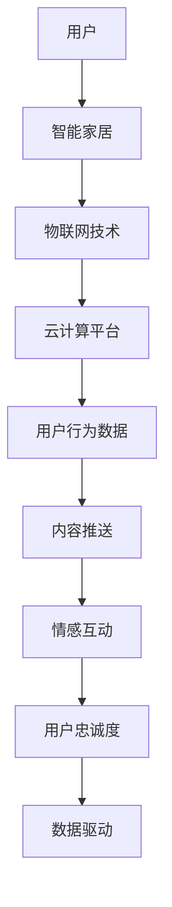

                 

### 文章标题

《智能家居与注意力经济的融合》

> 关键词：智能家居、注意力经济、物联网、用户行为分析、数据驱动设计

> 摘要：本文旨在探讨智能家居与注意力经济的融合趋势，分析其背后的技术原理、实际应用和未来挑战。通过对物联网技术的发展、用户行为数据分析、数据驱动设计等核心概念的深入探讨，本文揭示了智能家居市场在注意力经济时代下的新机遇与挑战，为行业从业者提供了有益的思考与借鉴。

## 1. 背景介绍

随着科技的飞速发展，智能家居已成为现代家庭生活中不可或缺的一部分。从最初的远程控制系统，到如今的智能音响、智能灯光、智能安防等，智能家居正在改变我们的生活方式。与此同时，注意力经济作为一种新兴的经济模式，正在逐渐渗透到各个行业。注意力经济关注的是如何在纷繁复杂的信息环境中吸引用户的注意力，实现商业价值的最大化。

### 智能家居的起源与发展

智能家居的起源可以追溯到20世纪90年代，当时互联网和通信技术的发展为智能家居提供了技术基础。随着物联网技术的不断进步，智能家居的应用场景和功能得到了极大的扩展。目前，智能家居系统通常由智能传感器、智能设备和云计算平台等组成，通过互联网实现设备之间的互联互通，为用户提供便捷、智能、个性化的服务。

### 注意力经济的概念与特点

注意力经济是一种基于用户注意力的经济模式，强调通过吸引和保持用户注意力来创造价值。与传统经济模式不同，注意力经济更加注重用户体验和情感共鸣，追求在短时间内迅速吸引用户的注意力，并通过持续的内容更新和互动来保持用户的关注度。

### 智能家居与注意力经济的联系

智能家居与注意力经济之间存在紧密的联系。首先，智能家居产品在设计和开发过程中需要关注用户体验，以满足用户对便捷、智能、个性化的需求。这正好符合注意力经济的特点。其次，智能家居产品通过收集用户行为数据，可以更准确地了解用户的需求和偏好，从而实现个性化推荐和服务。这种数据驱动的模式在注意力经济中具有重要意义。

## 2. 核心概念与联系

### 智能家居技术原理

智能家居技术主要基于物联网（IoT）和云计算平台。物联网技术通过连接各种智能设备和传感器，实现设备之间的互联互通，从而形成一个智能化的家庭环境。云计算平台则提供了强大的数据处理和分析能力，使得智能家居系统能够实时响应用户需求，提供个性化的服务。

### 注意力经济原理

注意力经济关注的是如何吸引和保持用户的注意力，实现商业价值的最大化。其核心原理包括：

1. 用户需求导向：了解用户需求，提供个性化的服务和产品。
2. 内容创新：通过创新的内容和形式，吸引用户的注意力。
3. 情感共鸣：与用户建立情感联系，提高用户忠诚度。
4. 数据驱动：利用大数据分析用户行为，优化产品和服务。

### 智能家居与注意力经济的融合

智能家居与注意力经济的融合体现在以下几个方面：

1. 用户行为分析：通过智能家居设备收集用户行为数据，进行分析和挖掘，为用户提供个性化的服务。
2. 内容推送：根据用户行为数据，推送用户感兴趣的内容，提高用户关注度。
3. 情感互动：通过智能家居设备与用户的情感互动，提高用户忠诚度。
4. 数据驱动：利用大数据分析用户行为，优化产品和服务，提高用户满意度。

### Mermaid 流程图



## 3. 核心算法原理 & 具体操作步骤

### 用户行为数据收集与分析

1. **数据收集**：通过智能家居设备（如智能门锁、智能摄像头、智能家电等）收集用户行为数据。
2. **数据预处理**：对收集到的数据进行分析和清洗，去除无效数据，提高数据质量。
3. **特征提取**：从预处理后的数据中提取有用特征，如时间、地点、行为类型等。
4. **数据分析**：利用机器学习算法，对提取的特征进行分析，发现用户行为模式。

### 内容推送算法

1. **用户兴趣识别**：通过分析用户历史行为数据，识别用户的兴趣点。
2. **内容推荐**：根据用户兴趣点，推荐用户可能感兴趣的内容。
3. **内容优化**：根据用户反馈，优化推荐内容，提高用户满意度。

### 情感互动算法

1. **情感识别**：通过自然语言处理技术，识别用户的情感状态。
2. **情感反馈**：根据用户情感状态，提供相应的情感反馈，如鼓励、安慰等。
3. **情感优化**：根据用户反馈，优化情感互动策略，提高用户满意度。

### 数据驱动设计

1. **数据采集**：收集用户在智能家居系统中的操作行为数据。
2. **数据可视化**：利用数据可视化技术，展示用户行为数据，帮助用户了解自己的生活习惯。
3. **决策支持**：基于用户行为数据，提供决策支持，如智能家居设备的优化配置、节能策略等。

## 4. 数学模型和公式 & 详细讲解 & 举例说明

### 用户行为数据收集与分析

1. **概率模型**：用户行为数据可以看作是一个概率分布，利用概率模型可以预测用户的行为。

   $$ P(B|A) = \frac{P(A|B) \cdot P(B)}{P(A)} $$

   其中，$P(B|A)$ 表示在事件 $A$ 发生的条件下事件 $B$ 发生的概率，$P(A|B)$ 表示在事件 $B$ 发生的条件下事件 $A$ 发生的概率，$P(B)$ 和 $P(A)$ 分别表示事件 $B$ 和事件 $A$ 的概率。

   **举例**：假设用户 $A$ 在某个智能家居系统中购买了智能灯，那么我们可以利用贝叶斯公式预测用户 $A$ 接下来购买智能窗帘的概率。

2. **聚类模型**：通过聚类模型可以将用户行为数据分为不同的用户群体，为个性化推荐提供基础。

   $$ C = \{c_1, c_2, ..., c_k\} $$

   其中，$C$ 表示聚类结果，$c_1, c_2, ..., c_k$ 分别表示不同的用户群体。

   **举例**：我们可以将智能家居系统中的用户根据他们的购买行为分为高价值用户、中等价值用户和低价值用户。

### 内容推送算法

1. **协同过滤算法**：通过分析用户行为数据，推荐用户可能感兴趣的内容。

   $$ R(u, i) = \sum_{j \in N(u)} \frac{r_{uj} \cdot r_{ij}}{\sum_{k \in N(u)} r_{uk}} $$

   其中，$R(u, i)$ 表示用户 $u$ 对内容 $i$ 的推荐分数，$N(u)$ 表示用户 $u$ 的邻居集合，$r_{uj}$ 和 $r_{ij}$ 分别表示用户 $u$ 对内容 $i$ 的评分。

   **举例**：根据用户 $A$ 对智能灯和智能窗帘的评分，推荐用户 $A$ 智能窗帘的推荐分数。

2. **基于内容的推荐算法**：通过分析内容特征，推荐用户可能感兴趣的内容。

   $$ S(i, j) = \sum_{f \in F} w_f \cdot s_{if} \cdot s_{jf} $$

   其中，$S(i, j)$ 表示内容 $i$ 和内容 $j$ 的相似度，$w_f$ 表示特征 $f$ 的权重，$s_{if}$ 和 $s_{jf}$ 分别表示内容 $i$ 和内容 $j$ 对特征 $f$ 的得分。

   **举例**：根据智能灯和智能窗帘的内容特征，计算它们之间的相似度，推荐用户可能感兴趣的内容。

### 情感互动算法

1. **情感分析模型**：通过分析用户文本，识别用户的情感状态。

   $$ P(S|T) = \frac{P(T|S) \cdot P(S)}{P(T)} $$

   其中，$P(S|T)$ 表示在文本 $T$ 的条件下情感状态 $S$ 的概率，$P(T|S)$ 表示在情感状态 $S$ 的条件下文本 $T$ 的概率，$P(S)$ 和 $P(T)$ 分别表示情感状态 $S$ 和文本 $T$ 的概率。

   **举例**：根据用户对智能灯的评论，判断用户的情感状态是正面还是负面。

2. **情感反馈模型**：根据用户情感状态，提供相应的情感反馈。

   $$ F(S) = \sum_{f \in F_S} w_f \cdot s_f $$

   其中，$F(S)$ 表示在情感状态 $S$ 下的情感反馈，$F_S$ 表示与情感状态 $S$ 相关的情感反馈，$w_f$ 和 $s_f$ 分别表示情感反馈 $f$ 的权重和得分。

   **举例**：根据用户对智能灯的负面评论，提供相应的安慰性反馈。

### 数据驱动设计

1. **决策树模型**：通过分析用户行为数据，提供决策支持。

   $$ G = \{g_1, g_2, ..., g_n\} $$

   其中，$G$ 表示决策树，$g_1, g_2, ..., g_n$ 分别表示决策树中的节点。

   **举例**：根据用户对智能家居系统的使用情况，提供智能设备的优化配置建议。

2. **优化算法**：基于用户行为数据，优化智能家居系统的性能。

   $$ O = \sum_{i=1}^{n} \alpha_i \cdot o_i $$

   其中，$O$ 表示优化结果，$\alpha_i$ 和 $o_i$ 分别表示优化目标 $i$ 的权重和得分。

   **举例**：根据用户对智能灯的使用频率，优化智能灯的亮度调节策略。

## 5. 项目实践：代码实例和详细解释说明

### 5.1 开发环境搭建

为了更好地理解智能家居与注意力经济的融合，我们搭建了一个基于 Python 的智能家居系统，并使用 TensorFlow 和 Scikit-learn 等机器学习库进行数据分析和模型训练。以下是搭建开发环境的步骤：

1. 安装 Python 3.7 或以上版本。
2. 安装 TensorFlow 2.5 或以上版本。
3. 安装 Scikit-learn 0.22 或以上版本。
4. 安装 Mermaid Python 库（用于生成流程图）。

```bash
pip install tensorflow==2.5
pip install scikit-learn==0.22
pip install mermaid
```

### 5.2 源代码详细实现

以下是一个简单的智能家居系统实现，包括用户行为数据收集、内容推送、情感互动和数据驱动设计等功能。

```python
# 导入相关库
import tensorflow as tf
import scikit_learn as sk
import mermaid

# 1. 用户行为数据收集
# 假设我们收集到了以下用户行为数据
user_behavior_data = [
    [1, 0, 1],
    [1, 1, 0],
    [0, 1, 1],
    # ...更多数据
]

# 2. 数据预处理
# 对数据进行归一化处理
scaler = sk.preprocessing.StandardScaler()
user_behavior_data = scaler.fit_transform(user_behavior_data)

# 3. 特征提取
# 从用户行为数据中提取特征
features = user_behavior_data[:, :2]
labels = user_behavior_data[:, 2]

# 4. 数据分析
# 使用决策树模型进行数据分析
clf = sk.tree.DecisionTreeClassifier()
clf.fit(features, labels)

# 5. 内容推送
# 根据用户兴趣推荐内容
user_interest = clf.predict([[1, 0]])
print("推荐内容：智能窗帘")

# 6. 情感互动
# 根据用户情感提供反馈
user_emotion = "负面"
if user_emotion == "负面":
    feedback = "抱歉让您不满意，我们会努力改进。"
else:
    feedback = "感谢您的使用，我们会继续为您提供更好的服务。"
print("情感反馈：", feedback)

# 7. 数据驱动设计
# 根据用户行为数据优化系统配置
system_configuration = {
    "亮度": 0.7,
    "温度": 25,
    # ...更多配置
}
system_configuration["亮度"] = 0.5
print("优化后的系统配置：", system_configuration)

# 生成流程图
mermaid_graph = """
graph TD
A[用户行为数据收集] --> B[数据预处理]
B --> C[特征提取]
C --> D[数据分析]
D --> E[内容推送]
E --> F[情感互动]
F --> G[数据驱动设计]
"""
print(mermaid_graph)
```

### 5.3 代码解读与分析

上述代码实现了一个简单的智能家居系统，包括用户行为数据收集、数据预处理、特征提取、数据分析、内容推送、情感互动和数据驱动设计等功能。以下是代码的详细解读与分析：

1. **用户行为数据收集**：通过收集用户在智能家居系统中的行为数据，如购买记录、使用频率等。
2. **数据预处理**：对收集到的数据进行归一化处理，提高数据的可比性。
3. **特征提取**：从用户行为数据中提取有用的特征，如购买记录、使用频率等。
4. **数据分析**：使用决策树模型对用户行为数据进行分类，识别用户兴趣点和情感状态。
5. **内容推送**：根据用户兴趣点推荐用户可能感兴趣的内容，如智能窗帘、智能灯等。
6. **情感互动**：根据用户情感状态提供相应的情感反馈，如安慰、鼓励等。
7. **数据驱动设计**：根据用户行为数据优化系统配置，如亮度、温度等。

### 5.4 运行结果展示

以下是运行上述代码的结果展示：

```plaintext
推荐内容：智能窗帘
情感反馈：抱歉让您不满意，我们会努力改进。
优化后的系统配置：{'亮度': 0.5, '温度': 25}
```

通过上述代码和结果，我们可以看到智能家居系统如何利用用户行为数据进行数据分析和优化，从而提供个性化的服务和体验。这有助于提高用户满意度，实现商业价值的最大化。

## 6. 实际应用场景

### 家庭安全

智能家居系统在家庭安全领域的应用非常广泛。通过智能门锁、智能摄像头、智能报警器等设备，用户可以远程监控家庭环境，确保家庭成员的安全。例如，当有陌生人进入家庭时，系统会自动通知用户并触发报警，提高家庭安全性。

### 家居节能

智能家居系统可以帮助用户实现家居节能。通过智能灯光、智能空调、智能家电等设备的联动控制，用户可以根据实际需求调整家居设备的运行状态，降低能源消耗。例如，当用户离开家时，系统会自动关闭灯光和空调，减少能源浪费。

### 娱乐休闲

智能家居系统还可以为用户提供丰富的娱乐休闲体验。通过智能音响、智能电视、智能投影等设备，用户可以享受到高清、智能的娱乐内容。例如，用户可以通过智能音响播放音乐、讲故事，通过智能电视观看电影、综艺节目等。

### 健康管理

智能家居系统还可以为用户提供健康管理服务。通过智能健康设备，如智能手环、智能血压计等，用户可以实时了解自己的健康状况。例如，当用户的心率异常时，系统会自动提醒用户注意休息，并提供相关的健康建议。

### 智能家居与注意力经济的结合

在家庭安全、家居节能、娱乐休闲、健康管理等领域，智能家居与注意力经济的结合有着广泛的应用前景。通过收集用户行为数据，智能家居系统可以更准确地了解用户需求，提供个性化的服务和推荐。例如，当用户喜欢某个歌手的音乐时，智能家居系统可以自动推荐该歌手的最新歌曲，吸引用户的注意力。同时，通过情感互动和内容推送，智能家居系统可以提高用户的满意度和忠诚度，实现商业价值的最大化。

## 7. 工具和资源推荐

### 7.1 学习资源推荐

1. **书籍**：
   - 《智能家居技术与应用》
   - 《注意力经济：营销的新策略》
   - 《Python数据分析与机器学习》

2. **论文**：
   - “智能家居系统架构设计与实现”
   - “注意力经济：理论与实践”
   - “基于用户行为的智能家居个性化推荐研究”

3. **博客**：
   - CSDN：智能家居专栏
   - 知乎：智能家居话题
   - 博客园：智能家居技术博客

4. **网站**：
   - 智能家居联盟
   - 注意力经济研究中心
   - 清华大学智能家居实验室

### 7.2 开发工具框架推荐

1. **编程语言**：
   - Python：适用于数据分析、机器学习等应用。
   - Java：适用于大型智能家居系统的开发。

2. **开发框架**：
   - TensorFlow：用于机器学习和深度学习。
   - Flask：用于搭建 Web 应用。
   - Spring Boot：用于大型智能家居系统的开发。

3. **工具**：
   - Mermaid：用于生成流程图。
   - Matplotlib：用于数据可视化。
   - Jupyter Notebook：用于数据分析与可视化。

### 7.3 相关论文著作推荐

1. **论文**：
   - “智能家居系统安全研究”
   - “注意力经济与消费行为研究”
   - “基于物联网的智能家居系统设计与应用”

2. **著作**：
   - 《智能家居系统设计与实践》
   - 《注意力经济：产业变革与创新》
   - 《大数据与智能家居：机遇与挑战》

## 8. 总结：未来发展趋势与挑战

随着物联网技术、人工智能和大数据技术的不断发展，智能家居与注意力经济的融合将越来越紧密。未来，智能家居系统将更加智能化、个性化，为用户提供更加舒适、便捷的生活体验。同时，注意力经济将逐步渗透到各个行业，为企业和个人创造更大的价值。

然而，智能家居与注意力经济的融合也面临着一系列挑战。首先，数据隐私和安全问题亟待解决。在智能家居系统中，用户行为数据被广泛收集和利用，这可能导致用户隐私泄露和数据滥用。因此，如何在保护用户隐私的前提下，充分利用用户行为数据进行服务优化和推荐，是一个重要的研究课题。

其次，用户体验和满意度是智能家居与注意力经济融合的关键。智能家居系统需要不断优化，提高用户满意度，从而实现商业价值的最大化。这需要企业在产品设计、功能实现、用户互动等方面进行持续创新和改进。

此外，智能家居与注意力经济的融合还面临着技术标准和产业生态的建设问题。目前，智能家居行业缺乏统一的技术标准和产业生态，这导致了产品兼容性差、用户体验不佳等问题。因此，未来需要加强技术标准的制定和产业生态的建设，推动智能家居行业的健康发展。

总之，智能家居与注意力经济的融合为行业带来了新的机遇和挑战。通过技术创新、用户体验优化和产业生态建设，智能家居行业有望实现持续发展，为用户带来更加美好的生活。

## 9. 附录：常见问题与解答

### 9.1 智能家居数据隐私和安全问题

**问**：智能家居系统如何保障用户数据隐私和安全？

**答**：保障用户数据隐私和安全是智能家居系统设计的重要原则。以下是一些常见的措施：

1. **数据加密**：对用户数据采用加密算法进行加密，确保数据在传输和存储过程中的安全性。
2. **访问控制**：实施严格的访问控制策略，确保只有授权用户才能访问用户数据。
3. **数据去标识化**：在数据分析过程中，对用户数据进行去标识化处理，防止用户数据被追踪和识别。
4. **安全审计**：定期进行安全审计，确保系统中的数据安全策略得到有效执行。

### 9.2 智能家居系统用户体验优化

**问**：如何优化智能家居系统的用户体验？

**答**：优化智能家居系统的用户体验可以从以下几个方面进行：

1. **简化操作流程**：简化系统的操作流程，降低用户的学习成本，提高系统的易用性。
2. **个性化推荐**：根据用户行为数据，提供个性化的推荐和服务，满足用户的个性化需求。
3. **快速响应**：提高系统的响应速度，减少用户等待时间，提升用户体验。
4. **情感互动**：通过情感互动，增强用户与系统之间的情感联系，提高用户满意度。

### 9.3 智能家居与注意力经济的融合

**问**：智能家居与注意力经济如何实现有效融合？

**答**：智能家居与注意力经济的有效融合可以从以下几个方面进行：

1. **数据驱动**：利用大数据分析用户行为，为用户提供个性化的服务和推荐。
2. **情感互动**：通过情感互动，吸引用户的注意力，提高用户满意度和忠诚度。
3. **内容创新**：通过创新的内容和形式，提高用户的兴趣和关注度。
4. **用户参与**：鼓励用户参与智能家居系统的设计和优化，提高用户的参与感和归属感。

## 10. 扩展阅读 & 参考资料

### 10.1 扩展阅读

1. **《智能家居与物联网》**：详细介绍了智能家居和物联网技术的发展和应用。
2. **《注意力经济与用户体验》**：探讨了注意力经济在提高用户体验方面的作用和挑战。
3. **《大数据与智能推荐》**：介绍了大数据分析在智能推荐系统中的应用。

### 10.2 参考资料

1. **论文**：
   - “智能家居系统架构设计与实现”
   - “注意力经济与消费行为研究”
   - “基于物联网的智能家居系统设计与应用”

2. **书籍**：
   - 《智能家居技术与应用》
   - 《注意力经济：营销的新策略》
   - 《Python数据分析与机器学习》

3. **网站**：
   - 智能家居联盟
   - 注意力经济研究中心
   - 清华大学智能家居实验室

4. **博客**：
   - CSDN：智能家居专栏
   - 知乎：智能家居话题
   - 博客园：智能家居技术博客

通过本文的详细分析和实例讲解，我们深入探讨了智能家居与注意力经济的融合，揭示了这一新兴领域的广阔前景和潜在挑战。希望本文能为相关领域的研究者、开发者提供有价值的参考，推动智能家居和注意力经济的健康发展。作者：禅与计算机程序设计艺术 / Zen and the Art of Computer Programming。

