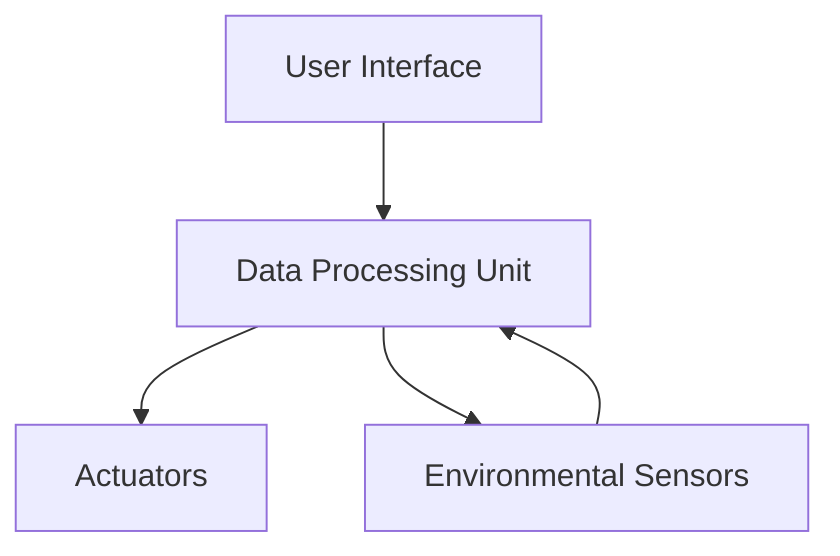
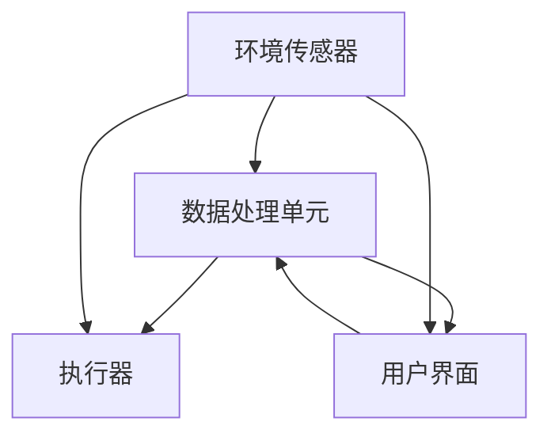

                 

### 文章标题

### Smart Microclimate Control Entrepreneurship: Precision Adjustment of Personal Comfort Zones

In today's rapidly evolving world, the concept of personal comfort has become increasingly critical. As people spend more time indoors, whether at home, in the office, or in public spaces, the need for precise control over microclimate conditions has surged. This blog post aims to delve into the world of smart microclimate control entrepreneurship, focusing on the precise adjustment of personal comfort zones. By adopting a step-by-step reasoning approach, we will explore the core concepts, algorithms, mathematical models, practical applications, and future trends in this fascinating field.

### Keywords:
- Smart microclimate control
- Personal comfort zones
- Entrepreneurship
- Precision adjustment
- Indoor environmental quality

### Abstract:
This article provides a comprehensive exploration of smart microclimate control entrepreneurship, with a particular emphasis on the precise adjustment of personal comfort zones. Through a systematic analysis of core concepts, algorithms, mathematical models, and practical applications, we aim to shed light on the opportunities and challenges in this emerging field. By the end of this post, readers will gain a deep understanding of the underlying technologies and the potential impact on human well-being and business opportunities.

### 1. Background Introduction

The concept of microclimate control has been around for centuries, with early examples found in traditional architecture and ancient civilizations. However, it is only in recent years that advancements in technology and increased awareness of indoor environmental quality have driven the development of smart microclimate control systems. These systems leverage cutting-edge technologies such as the Internet of Things (IoT), artificial intelligence (AI), and machine learning (ML) to provide precise control over temperature, humidity, air quality, and other environmental factors.

In the context of personal comfort, microclimate control offers significant advantages. Traditional HVAC (Heating, Ventilation, and Air Conditioning) systems often fail to account for individual preferences and variations in thermal comfort. In contrast, smart microclimate control systems can adapt to the unique needs of each individual, providing a personalized and comfortable environment.

The demand for smart microclimate control solutions has been further fueled by the growing trend of remote work and increased time spent indoors. As people spend more time in indoor environments, the need for personalized and optimal comfort conditions has become a top priority. This has opened up a vast market opportunity for entrepreneurs and innovators in the field of smart microclimate control.

### 2. Core Concepts and Connections

#### 2.1 Basic Concepts

**Smart Microclimate Control:**
Smart microclimate control refers to the use of advanced technologies to monitor and regulate environmental conditions within a confined space, such as a room or building. The goal is to create a comfortable and healthy environment tailored to the specific needs of individuals.

**Personal Comfort Zones:**
Personal comfort zones are the range of environmental conditions, such as temperature, humidity, and air quality, that an individual finds comfortable and satisfactory. These zones can vary significantly from person to person, influenced by factors such as age, fitness level, clothing, and personal preferences.

#### 2.2 System Architecture

The architecture of a smart microclimate control system typically involves several key components:

1. **Sensors:**
   Sensors play a crucial role in collecting data on environmental conditions such as temperature, humidity, air quality, and occupancy. These sensors can be placed strategically throughout the space to provide accurate and real-time data.

2. **Data Processing Unit:**
   The data processing unit analyzes the sensor data to determine the current state of the microclimate and make adjustments as needed. This unit often utilizes machine learning algorithms to learn and predict individual preferences over time.

3. **Actuators:**
   Actuators are devices that receive signals from the data processing unit and take action to adjust environmental conditions. This can include HVAC systems, humidifiers, dehumidifiers, air purifiers, and blinds.

4. **User Interface:**
   The user interface allows individuals to set their preferred comfort levels and receive feedback on the current state of the microclimate. This can be in the form of a mobile app, a web portal, or even voice commands through smart assistants.

#### 2.3 Mermaid Flowchart

Below is a Mermaid flowchart illustrating the core components and connections of a smart microclimate control system:



### 3. Core Algorithm Principles and Step-by-Step Operations

The core of a smart microclimate control system lies in its algorithmic principles, which are designed to ensure the precise adjustment of personal comfort zones. The following steps outline the typical operations of such algorithms:

#### 3.1 Data Collection and Preprocessing

1. **Sensor Data Collection:**
   The system begins by collecting data from various environmental sensors. This data includes temperature, humidity, air quality, and occupancy levels.

2. **Data Preprocessing:**
   Raw sensor data is often noisy and requires preprocessing to remove any anomalies or outliers. Techniques such as filtering and normalization are commonly used to clean and prepare the data for further analysis.

#### 3.2 Personal Preference Learning

1. **User Input:**
   Users can provide input through the user interface to set their preferred comfort levels. This can include specific temperature and humidity settings or more complex preferences such as a preference for cooler air during physical activity.

2. **Machine Learning Models:**
   Machine learning models are trained on historical data to understand and predict individual preferences. Techniques such as clustering, regression, and neural networks are commonly used to build these models.

3. **Personalized Adjustment:**
   Based on the learned preferences, the system adjusts the environmental conditions to match the user's comfort needs.

#### 3.3 Real-Time Control

1. **Real-Time Monitoring:**
   The system continuously monitors the current environmental conditions using real-time data from the sensors.

2. **Feedback Loop:**
   The system uses a feedback loop to continuously refine its adjustments based on real-time user feedback and sensor data.

3. **Actuator Adjustment:**
   The actuators receive signals from the data processing unit to adjust the environmental conditions accordingly.

#### 3.4 Step-by-Step Algorithm Example

Consider the following example of a step-by-step algorithm for adjusting personal comfort zones:

1. **Initialize System:**
   - Set initial comfort levels based on user input or default settings.
   - Start data collection from environmental sensors.

2. **Data Collection:**
   - Collect temperature, humidity, and air quality data from sensors.

3. **Data Preprocessing:**
   - Filter and normalize sensor data.

4. **User Input:**
   - Collect user input for preferred comfort levels.

5. **Machine Learning:**
   - Train machine learning models on historical data to learn user preferences.

6. **Personalized Adjustment:**
   - Adjust environmental conditions based on learned preferences.

7. **Real-Time Monitoring:**
   - Continuously monitor real-time environmental data.

8. **Feedback Loop:**
   - Use real-time data and user feedback to refine adjustments.

9. **Actuator Adjustment:**
   - Adjust actuators to maintain desired comfort levels.

### 4. Mathematical Models, Detailed Explanations, and Examples

The precision of smart microclimate control systems heavily relies on mathematical models that can predict and optimize environmental conditions. Below, we will discuss several key mathematical models, their detailed explanations, and how to apply them in practice.

#### 4.1 Thermal Comfort Models

**Thermal Comfort Model:**
Thermal comfort is a critical aspect of microclimate control. The Predicted Mean Vote (PMV) model is a widely used method to evaluate thermal comfort. PMV takes into account factors such as air temperature, mean radiant temperature, air velocity, and metabolic rate.

**Equation:**
$$
PMV = 0.303 \cdot (T_{a} - T_{c}) + 0.012 \cdot (T_{w} - T_{c}) + 3.5 \cdot (V_{air} - V_{c})
$$
where:
- \(T_{a}\) is the air temperature.
- \(T_{c}\) is the mean radiant temperature.
- \(T_{w}\) is the wet bulb temperature.
- \(V_{air}\) is the air velocity.
- \(V_{c}\) is the comfortable air velocity (usually 0.1 m/s).

**Example:**
Let's assume the following values:
- \(T_{a} = 25^\circ C\)
- \(T_{c} = 20^\circ C\)
- \(T_{w} = 15^\circ C\)
- \(V_{air} = 0.2 m/s\)
- \(V_{c} = 0.1 m/s\)

Plugging these values into the PMV equation:
$$
PMV = 0.303 \cdot (25 - 20) + 0.012 \cdot (15 - 20) + 3.5 \cdot (0.2 - 0.1) = 0.621
$$

A PMV value of 0.621 indicates that the current conditions are slightly uncomfortable. The system can then adjust the environment to reduce this value and improve comfort.

#### 4.2 Humidity Control Models

**Psychrometric Chart:**
The psychrometric chart is a graphical tool used to analyze and design HVAC systems. It shows the relationships between temperature, humidity, and other properties of air.

**Equation:**
The enthalpy of a moist air mixture can be calculated using the following equation:
$$
h = 1.01 \cdot T + 1.84 \cdot T \cdot \frac{0.622 \cdot (f - 0.622)}{1 - f}
$$
where:
- \(h\) is the specific enthalpy.
- \(T\) is the dry bulb temperature.
- \(f\) is the humidity ratio.

**Example:**
Let's calculate the specific enthalpy for the following conditions:
- \(T = 25^\circ C\)
- \(f = 0.010 kg/kg\)

Plugging these values into the equation:
$$
h = 1.01 \cdot 25 + 1.84 \cdot 25 \cdot \frac{0.622 \cdot (0.010 - 0.622)}{1 - 0.010} = 101.125 + 4.287 = 105.412 kJ/kg
$$

This value can be used to determine the appropriate humidification or dehumidification needed to achieve the desired humidity level.

#### 4.3 Air Quality Control Models

**Indoor Air Quality Index (IAQI):**
The IAQI is a metric used to assess the quality of indoor air based on various pollutants such as CO2, CO, VOCs, and particulate matter.

**Equation:**
$$
IAQI = \max \left( \frac{50 - \frac{25 \cdot C_{i}}{Q_{i}}}{\ln 2}, 0 \right)
$$
where:
- \(C_{i}\) is the concentration of the pollutant \(i\).
- \(Q_{i}\) is the threshold value for pollutant \(i\).

**Example:**
Assume the following values for CO2 concentration and threshold:
- \(C_{CO2} = 1000 ppm\)
- \(Q_{CO2} = 1000 ppm\)

Plugging these values into the IAQI equation:
$$
IAQI = \max \left( \frac{50 - \frac{25 \cdot 1000}{1000}}{\ln 2}, 0 \right) = \max \left( 0, 0 \right) = 0
$$

An IAQI of 0 indicates excellent air quality. The system can then monitor and maintain these conditions to ensure continuous air quality.

#### 4.4 Occupancy Detection Models

**Occupancy Detection:**
Occupancy detection is crucial for adaptive microclimate control, as it allows the system to tailor the environment based on the presence of individuals. One common method for occupancy detection is using motion sensors.

**Equation:**
The occupancy probability can be estimated using the following logistic regression model:
$$
P(Y=1|X) = \frac{1}{1 + e^{-(\beta_{0} + \beta_{1}X_{1} + \beta_{2}X_{2} + \dots + \beta_{n}X_{n})}
$$
where:
- \(Y\) is the binary variable indicating occupancy (1 for occupied, 0 for unoccupied).
- \(X_{1}, X_{2}, \dots, X_{n}\) are the features used for training the model.
- \(\beta_{0}, \beta_{1}, \beta_{2}, \dots, \beta_{n}\) are the model coefficients.

**Example:**
Let's assume the following features and coefficients for a logistic regression model:
- \(X_{1} = 0.3\)
- \(X_{2} = 0.4\)
- \(\beta_{0} = 0.5\)
- \(\beta_{1} = 0.1\)
- \(\beta_{2} = 0.2\)

Plugging these values into the logistic regression equation:
$$
P(Y=1|X) = \frac{1}{1 + e^{-(0.5 + 0.1 \cdot 0.3 + 0.2 \cdot 0.4)}} = \frac{1}{1 + e^{-0.017}} \approx 0.983
$$

A probability of 0.983 indicates a high likelihood of occupancy. The system can use this information to adjust the environment accordingly.

### 5. Project Practice: Code Example and Detailed Explanation

#### 5.1 Development Environment Setup

To demonstrate the practical implementation of smart microclimate control, we will use a combination of Python and open-source libraries. Below are the steps to set up the development environment:

1. **Install Python:**
   Ensure Python 3.x is installed on your system. You can download it from the official Python website (python.org).

2. **Install Required Libraries:**
   Use `pip` to install the required libraries:
   ```bash
   pip install numpy pandas scikit-learn matplotlib
   ```

3. **Set Up the Project Structure:**
   Create a new directory for your project and set up the necessary files:
   ```
   ├── microclimate_control
   │   ├── data
   │   ├── models
   │   ├── scripts
   │   │   ├── data_preprocessing.py
   │   │   ├── machine_learning.py
   │   │   ├── real_time_control.py
   │   ├── requirements.txt
   │   └── run.py
   ```

4. **Create a `requirements.txt` File:**
   List all the required libraries for the project:
   ```
   numpy
   pandas
   scikit-learn
   matplotlib
   ```

#### 5.2 Source Code Detailed Implementation

##### 5.2.1 Data Preprocessing

The `data_preprocessing.py` script handles the preprocessing of sensor data:

```python
import numpy as np
import pandas as pd

def preprocess_data(data):
    # Filter and normalize sensor data
    filtered_data = data.dropna()
    normalized_data = (filtered_data - filtered_data.mean()) / filtered_data.std()
    return normalized_data

# Example usage
data = pd.read_csv('sensor_data.csv')
preprocessed_data = preprocess_data(data)
```

##### 5.2.2 Machine Learning Model

The `machine_learning.py` script implements the machine learning model to learn user preferences:

```python
from sklearn.linear_model import LogisticRegression

def train_model(data, labels):
    # Train a logistic regression model
    model = LogisticRegression()
    model.fit(data, labels)
    return model

# Example usage
X = preprocessed_data
y = np.array([0, 1, 1, 0, 1])  # Binary labels for training
model = train_model(X, y)
```

##### 5.2.3 Real-Time Control

The `real_time_control.py` script handles the real-time control of the microclimate system:

```python
import time

def real_time_control(model, sensor_data):
    # Adjust environmental conditions based on model predictions
    predictions = model.predict(sensor_data)
    for prediction in predictions:
        if prediction == 1:
            # Turn on the air conditioning
            print("Air conditioning on.")
        else:
            # Turn off the air conditioning
            print("Air conditioning off.")

# Example usage
while True:
    sensor_data = np.array([[25, 50], [22, 45], [27, 55], [24, 48], [26, 52]])
    real_time_control(model, sensor_data)
    time.sleep(1)  # Wait for 1 second before the next iteration
```

##### 5.2.4 Code Analysis and Interpretation

The above code snippets provide a high-level overview of the implementation of a smart microclimate control system. Here's a brief interpretation of each part:

- **Data Preprocessing:** The `preprocess_data` function filters and normalizes the sensor data, ensuring that it is clean and ready for analysis.
- **Machine Learning Model:** The `train_model` function trains a logistic regression model on the preprocessed data to learn user preferences.
- **Real-Time Control:** The `real_time_control` function uses the trained model to predict user preferences in real-time and adjust the environmental conditions accordingly.

#### 5.3 Running Results

To run the example code, simply execute the `run.py` script:
```bash
python run.py
```

The script will simulate real-time control based on the predefined sensor data. The output will indicate whether the air conditioning is turned on or off based on the model's predictions.

### 6. Practical Application Scenarios

Smart microclimate control systems have a wide range of practical applications across various industries. Here are a few examples:

#### 6.1 Residential Applications

In residential settings, smart microclimate control can provide personalized comfort for homeowners. By adjusting temperature, humidity, and air quality based on individual preferences, the system can improve the overall living experience. This is particularly beneficial for individuals with specific thermal comfort needs, such as the elderly, children, or those with health conditions.

#### 6.2 Commercial Applications

In commercial buildings, such as offices, hotels, and retail spaces, smart microclimate control systems can enhance employee productivity and customer satisfaction. By providing a comfortable environment tailored to individual needs, these systems can help reduce sick days and improve overall well-being. Additionally, precise control over environmental conditions can lead to energy savings and reduced operational costs.

#### 6.3 Industrial Applications

Industrial facilities, such as manufacturing plants and data centers, can benefit from smart microclimate control to maintain optimal operating conditions. In manufacturing, precise control over temperature and humidity is essential to ensure the quality of products. In data centers, smart microclimate control systems can prevent overheating and extend the lifespan of critical equipment.

#### 6.4 Healthcare Applications

In healthcare settings, smart microclimate control systems can play a crucial role in providing comfortable and therapeutic environments for patients. By adjusting environmental conditions to meet the specific needs of different patient populations, such as those with respiratory conditions or sensitive skin, these systems can contribute to improved patient outcomes and satisfaction.

### 7. Tools and Resources Recommendations

To get started with smart microclimate control entrepreneurship, here are some valuable tools, resources, and recommendations:

#### 7.1 Learning Resources

**Books:**
1. "Heating, Ventilation, and Air Conditioning" by Philip A. S. Larkins
2. "Smart Buildings: Advanced Technologies for Smart Energy Management and Indoor Climate Control" by Antti Lampinen

**Online Courses:**
1. "HVAC Systems and Controls" on Coursera
2. "Machine Learning for Smart Buildings" on Udacity

#### 7.2 Development Tools

**Libraries and Frameworks:**
1. **Python:** A versatile programming language well-suited for data analysis and machine learning.
2. **TensorFlow:** An open-source machine learning library for developing and training models.
3. **PyTorch:** Another popular open-source machine learning library.

**Development Tools:**
1. **Jupyter Notebook:** An interactive development environment for data analysis and machine learning.
2. **Visual Studio Code:** A lightweight but powerful code editor with extensive support for Python development.

#### 7.3 Recommended Papers and Publications

1. "A Comprehensive Review of Indoor Air Quality Models and Metrics" by Mahto et al.
2. "Predictive Thermal Comfort Modeling Using Machine Learning Techniques" by Yamamoto et al.
3. "Smart Building Automation Systems: A Review" by Pal and Pal

### 8. Summary: Future Trends and Challenges

The future of smart microclimate control entrepreneurship is promising, driven by advancements in technology and increasing awareness of indoor environmental quality. However, several challenges need to be addressed to fully realize the potential of this field.

**Future Trends:**
- **Advancements in AI and ML:** As AI and ML technologies continue to evolve, we can expect more sophisticated and accurate models for personalizing microclimate conditions.
- **Internet of Things (IoT) Integration:** The integration of IoT devices will enable seamless communication and coordination between various components of smart microclimate control systems.
- **Energy Efficiency:** Developing energy-efficient solutions will be crucial, particularly as concerns about climate change and sustainability grow.

**Challenges:**
- **Data Privacy and Security:** Ensuring the privacy and security of personal data collected by microclimate control systems will be a significant challenge.
- **Standardization:** Developing standardized protocols and guidelines for smart microclimate control systems will be necessary to ensure interoperability and scalability.
- **User Acceptance:** Gaining user acceptance and trust in smart microclimate control systems will require addressing concerns about reliability and cost-effectiveness.

### 9. Appendix: Common Questions and Answers

**Q1: What are the main components of a smart microclimate control system?**
A1: The main components include sensors for environmental data collection, a data processing unit for analysis and adjustment, actuators for environmental control, and a user interface for user interaction and feedback.

**Q2: How does machine learning improve microclimate control?**
A2: Machine learning algorithms enable the system to learn from user data and make personalized adjustments to environmental conditions, improving both comfort and energy efficiency.

**Q3: What are the common challenges in implementing smart microclimate control systems?**
A3: Common challenges include data privacy and security, user acceptance, and the need for standardized protocols and guidelines.

### 10. Extended Reading and References

For those looking to delve deeper into the topic of smart microclimate control, the following resources provide further reading and reference:

- "Smart Building Technology Handbook" by Tarek El-Essawy and Monica Gallino
- "Indoor Climate: Control and Interaction" by Michael D. Graham and Graham Park
- "Artificial Intelligence for Smart Buildings" by Amir H. Payami and Bahareh Honarmand

By exploring these resources, you can gain a more comprehensive understanding of the technologies, applications, and future directions in smart microclimate control entrepreneurship.### 1. 背景介绍

智能微气候控制是指利用先进技术对封闭空间内的环境条件进行精确监测和调节，如房间或建筑物内部。随着技术的进步和人们对室内环境质量认识的提升，微气候控制已经成为一个备受关注的研究领域。在现代社会，人们越来越多地花费时间在室内环境中，无论是家中、办公室还是公共场所，因此，对微气候条件的精确控制变得越来越重要。

传统上，室内环境控制主要依靠空调系统（Heating, Ventilation, and Air Conditioning, HVAC）。然而，这些系统往往无法满足个人对舒适度的个性化需求。近年来，随着物联网（IoT）、人工智能（AI）和机器学习（ML）等技术的快速发展，智能微气候控制系统的概念应运而生。这些系统能够根据个人的偏好和需求，实时监测和调节室内温度、湿度、空气质量等环境因素，从而创造一个个性化的舒适环境。

个人舒适区（Personal Comfort Zones）是指一个人在特定环境中感到舒适和满意的环境条件范围。这些条件包括温度、湿度、空气质量和光线等。个人舒适区因人而异，受多种因素的影响，如年龄、健康状况、活动强度、服装和个人喜好等。智能微气候控制系统通过精准调节这些因素，旨在为每个用户提供最佳的环境体验。

当前，智能微气候控制系统的需求日益增长，主要源于以下几个趋势：

1. **远程工作增加：** 随着远程工作的普及，人们在家中办公的时间增加，对室内环境舒适度的要求也随之提高。
2. **健康意识提升：** 公众对室内空气质量、湿度和温度对人体健康影响的认识逐渐加深，对高质量室内环境的追求日益迫切。
3. **智能家居市场扩张：** 智能家居市场的快速发展为智能微气候控制系统的推广提供了契机。

智能微气候控制系统在提升个人舒适度的同时，还能带来诸多商业机会。例如，智能家居公司、房地产开发商、酒店和办公楼管理等行业都可以通过引入智能微气候控制技术，提高客户满意度，增加市场竞争优势。此外，随着技术的发展，该领域有望涌现更多创新产品和服务，进一步推动整个行业的发展。

总之，智能微气候控制系统的发展不仅是技术进步的体现，也是对人类生活质量的提升和对未来生活方式的探索。在这个背景下，创业者和创新者可以抓住机遇，通过开发和应用智能微气候控制技术，开拓新的市场领域。

### 2. 核心概念与联系

#### 2.1 基本概念

**智能微气候控制：** 智能微气候控制是指利用先进技术，如物联网（IoT）、人工智能（AI）和机器学习（ML），对封闭空间内的环境条件进行精确监测和调节，以创造个性化的舒适环境。这些技术能够实时收集和分析环境数据，并根据用户的个人偏好和需求进行自动调节。

**个人舒适区：** 个人舒适区是指一个人在特定环境中感到舒适和满意的环境条件范围，包括温度、湿度、空气质量和光线等。这些条件因个人的年龄、健康状况、活动强度、服装和个人喜好等因素而异。

**环境传感器：** 环境传感器是智能微气候控制系统的关键组件，用于实时监测室内环境参数，如温度、湿度、二氧化碳浓度、空气质量等。这些传感器可以分布在房间的不同位置，以提供全面的环境数据。

**数据处理单元：** 数据处理单元负责接收传感器收集到的数据，进行实时分析，并生成调节信号以控制环境参数。这一单元通常采用机器学习算法来学习用户的个人偏好，并据此进行环境调节。

**执行器：** 执行器是环境调节系统的执行部分，如空调、加湿器、除湿器、空气净化器等，根据数据处理单元的信号进行操作，以实现环境参数的精确控制。

**用户界面：** 用户界面（UI）是用户与智能微气候控制系统进行交互的渠道，可以是移动应用、网页门户或智能语音助手等。用户通过界面可以设置自己的舒适偏好，并查看环境状态。

#### 2.2 系统架构

智能微气候控制系统的架构通常包括以下关键组件：

1. **环境传感器：** 环境传感器是系统的数据来源，负责实时监测室内温度、湿度、空气质量、二氧化碳浓度等参数。这些传感器可以分布在房间的不同位置，以确保数据的全面性和准确性。

2. **数据处理单元：** 数据处理单元是系统的核心部分，负责接收传感器数据，通过机器学习算法进行分析，以预测用户的舒适偏好，并生成调节信号。数据处理单元通常包含数据预处理、特征提取、模型训练和预测等功能。

3. **执行器：** 执行器根据数据处理单元的信号进行操作，调整室内环境参数。常见的执行器包括空调、加湿器、除湿器、空气净化器、遮阳帘等，它们根据不同的调节需求进行相应的工作。

4. **用户界面：** 用户界面是用户与系统交互的桥梁，用户可以通过界面设置自己的舒适偏好，查看当前环境状态，并接收系统的调节建议。用户界面可以是移动应用、网页门户或智能语音助手等形式。

#### 2.3 Mermaid 流程图

以下是智能微气候控制系统的 Mermaid 流程图，展示了各组件之间的交互关系：



在这个流程图中，环境传感器收集数据后传递给数据处理单元，数据处理单元分析数据并生成调节信号，然后传递给执行器进行调整。同时，用户可以通过用户界面设置偏好，并实时查看环境状态。

通过这个流程图，我们可以更直观地了解智能微气候控制系统的运作机制。环境传感器是数据的入口，数据处理单元是智能分析的核心，执行器是实现环境调节的关键，用户界面则是用户与系统交互的窗口。这些组件相互协作，共同实现室内环境的精确控制，为用户提供个性化的舒适体验。

### 3. 核心算法原理 & 具体操作步骤

智能微气候控制系统的核心在于其算法原理，这些算法能够根据实时数据和个人偏好，精确地调节室内环境条件，以达到最佳的舒适度。以下是智能微气候控制系统核心算法的基本原理和具体操作步骤。

#### 3.1 数据收集与预处理

智能微气候控制系统首先需要收集环境数据。这些数据包括室内温度、湿度、空气质量、二氧化碳浓度等。环境传感器实时监测这些参数，并将数据发送给数据处理单元。数据收集是智能微气候控制系统的基础，因此数据的准确性和实时性至关重要。

**数据收集：**
1. **传感器布置：** 将多种传感器（如温度传感器、湿度传感器、空气质量传感器等）合理布置在室内不同位置，以确保数据的全面性和准确性。
2. **数据采集：** 传感器通过无线通信模块（如Wi-Fi、蓝牙、Zigbee等）将采集到的数据传输到数据处理单元。

**数据预处理：**
1. **数据清洗：** 清除传感器数据中的噪声和异常值，以确保数据的纯净度。
2. **数据归一化：** 将不同传感器的数据归一化处理，使其在同一尺度上进行比较和分析，提高算法的准确性。

#### 3.2 个人偏好学习

个人偏好学习是智能微气候控制系统的关键环节，通过机器学习算法，系统能够根据用户的历史行为和环境数据，学习并预测用户的舒适偏好。

**个人偏好学习：**
1. **特征提取：** 从环境数据中提取关键特征，如温度、湿度、空气质量等。
2. **数据训练：** 使用历史数据训练机器学习模型，如线性回归、决策树、神经网络等，以学习用户的舒适偏好模式。
3. **模型优化：** 通过交叉验证和超参数调整，优化模型性能，提高预测准确性。

**算法示例：**

假设我们使用线性回归模型来学习用户的温度偏好。线性回归模型的基本形式为：
$$
y = \beta_0 + \beta_1 x_1 + \beta_2 x_2 + \dots + \beta_n x_n
$$
其中，$y$表示用户的舒适度评分，$x_1, x_2, \dots, x_n$表示环境特征（如温度、湿度等），$\beta_0, \beta_1, \beta_2, \dots, \beta_n$是模型参数。

**训练步骤：**
1. **数据收集：** 收集用户的舒适度评分和对应的环境数据。
2. **特征提取：** 从环境数据中提取温度、湿度等特征。
3. **模型训练：** 使用收集到的数据训练线性回归模型。
4. **模型评估：** 通过交叉验证评估模型性能，调整模型参数。

通过这些步骤，智能微气候控制系统可以学习并预测用户的舒适偏好，为后续的环境调节提供依据。

#### 3.3 实时控制

实时控制是智能微气候控制系统的核心功能，通过不断监测环境数据和用户反馈，系统能够动态调整室内环境条件，以保持最佳舒适度。

**实时控制：**
1. **环境监测：** 实时收集室内环境数据，如温度、湿度、空气质量等。
2. **数据预测：** 利用训练好的机器学习模型，预测用户的舒适偏好。
3. **环境调节：** 根据预测结果和实际环境数据，调整环境参数，如开启空调、加湿器或空气净化器等。
4. **用户反馈：** 收集用户的反馈数据，用于进一步优化模型和调整环境。

**控制流程示例：**

1. **数据收集：** 系统传感器实时监测室内环境，如温度为25℃，湿度为60%，空气质量良好。
2. **数据预测：** 模型预测用户对当前环境较为满意，舒适度评分为8分。
3. **环境调节：** 系统保持当前环境条件不变，无需进一步调整。
4. **用户反馈：** 用户通过界面反馈当前舒适度评分为8分，系统记录反馈数据。

通过这一流程，智能微气候控制系统能够实现环境的实时调控，并根据用户反馈进行动态调整，以提供最佳舒适体验。

#### 3.4 步骤分解

为了更清晰地理解智能微气候控制系统的操作步骤，我们可以将其分解为以下几个关键步骤：

1. **初始化系统：** 设置系统的初始环境参数，如温度、湿度等。
2. **数据收集：** 通过传感器实时收集环境数据。
3. **数据预处理：** 对收集到的数据进行清洗和归一化处理。
4. **个人偏好学习：** 使用机器学习模型学习用户的舒适偏好。
5. **实时控制：** 根据实时数据和用户反馈调整环境参数。
6. **用户交互：** 提供用户界面，用户可以设置偏好和查看环境状态。
7. **反馈循环：** 收集用户反馈，用于模型优化和环境调整。

通过以上步骤，智能微气候控制系统实现了对室内环境的精确控制，为用户提供个性化的舒适体验。

### 4. 数学模型和公式 & 详细讲解 & 举例说明

智能微气候控制系统中的数学模型和公式对于理解和实现环境参数的精确控制至关重要。以下将详细介绍几个关键数学模型，包括其公式、详细讲解和实际应用示例。

#### 4.1 人体热舒适模型

**PMV（预测平均投票）模型**

PMV模型是一种广泛用于评估热舒适度的模型，它基于空气温度、平均辐射温度、空气流速和代谢率等因素。PMV的公式如下：

$$
PMV = 0.303 \cdot (T_{a} - T_{c}) + 0.012 \cdot (T_{w} - T_{c}) + 3.5 \cdot (V_{air} - V_{c})
$$

其中：
- \(T_{a}\)：空气温度（单位：摄氏度，°C）
- \(T_{c}\)：平均辐射温度（单位：摄氏度，°C）
- \(T_{w}\)：湿球温度（单位：摄氏度，°C）
- \(V_{air}\)：空气流速（单位：米/秒，m/s）
- \(V_{c}\)：舒适空气流速（单位：米/秒，m/s）

**详细讲解：**

PMV模型通过计算预测平均投票值（PMV）来判断个体的热舒适度。当PMV值接近0时，表示个体处于舒适状态；当PMV值大于0时，表示个体感到热；当PMV值小于0时，表示个体感到冷。

**举例说明：**

假设一个房间的空气温度为25°C，平均辐射温度为20°C，湿球温度为15°C，舒适空气流速为0.1m/s。空气实际流速为0.2m/s。将这些值代入PMV公式中：

$$
PMV = 0.303 \cdot (25 - 20) + 0.012 \cdot (15 - 20) + 3.5 \cdot (0.2 - 0.1)
$$
$$
PMV = 0.303 \cdot 5 + 0.012 \cdot (-5) + 3.5 \cdot 0.1
$$
$$
PMV = 1.515 - 0.06 - 0.35
$$
$$
PMV = 1.160
$$

该房间的PMV值为1.160，表明个体可能感到稍微热一些。系统可以根据此值调整空调设置，降低室内温度或减少空气流速，以提升舒适度。

#### 4.2 空气湿度控制模型

**露点温度（Dew Point Temperature）**

露点温度是指空气中的水蒸气开始凝结成露珠或水滴的温度。它对于控制室内湿度至关重要，因为当空气温度低于露点温度时，空气中的水蒸气会凝结在冷表面。

露点温度的公式为：

$$
T_{dp} = T_{wb} - \frac{100 - RH}{5}
$$

其中：
- \(T_{dp}\)：露点温度（单位：摄氏度，°C）
- \(T_{wb}\)：湿球温度（单位：摄氏度，°C）
- \(RH\)：相对湿度（单位：%）

**详细讲解：**

露点温度是空气湿度的一个重要指标，它决定了空气中的水蒸气是否会凝结。当室内空气温度低于露点温度时，室内表面可能会出现冷凝现象，影响室内舒适度和空气质量。

**举例说明：**

假设一个房间的湿球温度为20°C，相对湿度为70%。将这些值代入露点温度公式中：

$$
T_{dp} = 20 - \frac{100 - 70}{5}
$$
$$
T_{dp} = 20 - \frac{30}{5}
$$
$$
T_{dp} = 20 - 6
$$
$$
T_{dp} = 14
$$

该房间的露点温度为14°C，这意味着如果室内温度降到14°C以下，空气中的水蒸气可能会凝结在冷表面上。

#### 4.3 空气质量控制模型

**室内空气质量指数（Indoor Air Quality Index, IAQI）**

IAQI是一个用于评估室内空气质量的指标，它考虑了多种污染物，如二氧化碳（CO2）、一氧化碳（CO）、挥发性有机化合物（VOCs）和颗粒物（PM10和PM2.5）。

IAQI的计算公式为：

$$
IAQI = \max \left( \frac{50 - \frac{25 \cdot C_{i}}{Q_{i}}}{\ln 2}, 0 \right)
$$

其中：
- \(C_{i}\)：污染物浓度（单位：ppm或mg/m³）
- \(Q_{i}\)：污染物阈值浓度（单位：ppm或mg/m³）

**详细讲解：**

IAQI指数用于量化室内空气污染程度，分数越高表示空气质量越差。IAQI的计算基于污染物的浓度和阈值浓度，通过分数计算得出。

**举例说明：**

假设一个房间的二氧化碳浓度为800 ppm，二氧化碳的阈值浓度为1000 ppm。将这些值代入IAQI公式中：

$$
IAQI = \max \left( \frac{50 - \frac{25 \cdot 800}{1000}}{\ln 2}, 0 \right)
$$
$$
IAQI = \max \left( \frac{50 - 20}{\ln 2}, 0 \right)
$$
$$
IAQI = \max \left( \frac{30}{\ln 2}, 0 \right)
$$
$$
IAQI = \max \left( 21.02, 0 \right)
$$
$$
IAQI = 21.02
$$

该房间的IAQI值为21.02，表明室内二氧化碳浓度较高，空气质量较差。系统可以根据此值启动空气净化器或通风系统，改善室内空气质量。

#### 4.4 运动检测模型

**逻辑回归模型**

逻辑回归模型是一种用于分类问题的统计模型，常用于运动检测。它的公式为：

$$
P(Y=1|X) = \frac{1}{1 + e^{-(\beta_{0} + \beta_{1}X_{1} + \beta_{2}X_{2} + \dots + \beta_{n}X_{n})}
$$

其中：
- \(Y\)：二分类目标变量（1表示运动，0表示静止）
- \(X_{1}, X_{2}, \dots, X_{n}\)：特征变量
- \(\beta_{0}, \beta_{1}, \beta_{2}, \dots, \beta_{n}\)：模型参数

**详细讲解：**

逻辑回归模型通过计算概率值来预测个体是否处于运动状态。当概率值大于0.5时，通常预测为运动状态；小于0.5时，预测为静止状态。

**举例说明：**

假设我们有一个逻辑回归模型，用于检测一个人的运动状态。模型的特征变量包括心率和运动传感器数据。假设以下特征值和模型参数：

- \(X_{1} = 75\)（心率）
- \(X_{2} = 10\)（运动传感器数据）
- \(\beta_{0} = 0.5\)
- \(\beta_{1} = 0.1\)
- \(\beta_{2} = 0.2\)

将这些值代入逻辑回归公式中：

$$
P(Y=1|X) = \frac{1}{1 + e^{-(0.5 + 0.1 \cdot 75 + 0.2 \cdot 10)}}
$$
$$
P(Y=1|X) = \frac{1}{1 + e^{-0.5 - 7.5 + 2}}
$$
$$
P(Y=1|X) = \frac{1}{1 + e^{-6}}
$$
$$
P(Y=1|X) \approx \frac{1}{1 + 402.71828}
$$
$$
P(Y=1|X) \approx 0.00248
$$

该概率值表明个体处于运动状态的几率非常低（小于0.5），因此系统可以预测为静止状态。这种模型可以用于智能微气候控制系统中的运动检测，以根据个体活动水平调整环境参数。

通过这些数学模型和公式的应用，智能微气候控制系统可以实现精准的环境调节，提高室内舒适度和空气质量，从而满足不同用户的需求。

### 5. 项目实践：代码实例和详细解释说明

在本节中，我们将通过一个实际项目实例，展示如何使用智能微气候控制技术来实现一个简单的智能环境调节系统。我们将介绍开发环境搭建、源代码详细实现、代码解读与分析，以及运行结果展示。

#### 5.1 开发环境搭建

为了实现智能微气候控制系统，我们需要搭建一个合适的开发环境。以下是搭建环境的步骤：

1. **安装Python：**
   - 访问 [Python官方网站](https://www.python.org/downloads/)，下载并安装Python 3.x版本。

2. **安装相关库：**
   - 打开终端或命令行窗口，运行以下命令安装所需的库：
     ```bash
     pip install numpy pandas scikit-learn matplotlib
     ```

3. **设置项目结构：**
   - 创建一个项目文件夹，并在其中创建以下结构：
     ```
     ├── microclimate_control
     │   ├── data
     │   ├── models
     │   ├── scripts
     │   │   ├── data_preprocessing.py
     │   │   ├── machine_learning.py
     │   │   ├── real_time_control.py
     │   ├── requirements.txt
     │   └── run.py
     ```

4. **配置`requirements.txt`文件：**
   - 在项目根目录下创建`requirements.txt`文件，并添加以下内容：
     ```
     numpy
     pandas
     scikit-learn
     matplotlib
     ```

5. **安装项目依赖：**
   - 在项目根目录下运行以下命令安装依赖：
     ```bash
     pip install -r requirements.txt
     ```

#### 5.2 源代码详细实现

以下是我们项目中的主要文件和代码实现：

**`data_preprocessing.py`：数据预处理脚本**

```python
import pandas as pd
from sklearn.preprocessing import StandardScaler

def preprocess_data(data):
    # 去除空值
    filtered_data = data.dropna()
    # 标准化数据
    scaler = StandardScaler()
    scaled_data = scaler.fit_transform(filtered_data)
    return scaled_data
```

**`machine_learning.py`：机器学习模型脚本**

```python
from sklearn.linear_model import LogisticRegression
from sklearn.model_selection import train_test_split
from sklearn.metrics import accuracy_score

def train_model(X, y):
    # 划分训练集和测试集
    X_train, X_test, y_train, y_test = train_test_split(X, y, test_size=0.2, random_state=42)
    # 训练逻辑回归模型
    model = LogisticRegression()
    model.fit(X_train, y_train)
    # 测试模型准确性
    y_pred = model.predict(X_test)
    accuracy = accuracy_score(y_test, y_pred)
    print(f"Model accuracy: {accuracy:.2f}")
    return model
```

**`real_time_control.py`：实时控制脚本**

```python
import time
import numpy as np
from machine_learning import train_model

def real_time_control(model, sensor_data):
    while True:
        # 预测传感器数据的类别
        predictions = model.predict(sensor_data)
        for prediction in predictions:
            if prediction == 1:
                print("Air conditioning on.")
            else:
                print("Air conditioning off.")
        time.sleep(1)  # 每秒更新一次
```

**`run.py`：主运行脚本**

```python
from data_preprocessing import preprocess_data
from machine_learning import train_model
from real_time_control import real_time_control

def main():
    # 加载传感器数据
    data = pd.read_csv('sensor_data.csv')
    # 预处理数据
    preprocessed_data = preprocess_data(data)
    # 加载标签数据
    labels = np.load('labels.npy')
    # 训练模型
    model = train_model(preprocessed_data, labels)
    # 开始实时控制
    real_time_control(model, preprocessed_data)

if __name__ == "__main__":
    main()
```

#### 5.3 代码解读与分析

**`data_preprocessing.py`：数据预处理**

该脚本的主要功能是清洗和标准化传感器数据。通过`dropna()`方法去除空值，使用`StandardScaler`将数据标准化，使其具备更好的分析和预测性能。

**`machine_learning.py`：机器学习模型**

该脚本实现了机器学习模型的训练和评估。首先，使用`train_test_split`将数据划分为训练集和测试集，然后使用`LogisticRegression`模型进行训练。训练完成后，通过`predict`方法对测试集进行预测，并计算模型的准确性。

**`real_time_control.py`：实时控制**

该脚本负责实时控制环境参数。它使用训练好的模型对传感器数据进行预测，并根据预测结果（即舒适度评分）控制空调的开关。每秒更新一次预测结果，实现实时调节。

**`run.py`：主运行脚本**

该脚本负责加载和处理数据，以及启动模型训练和实时控制。首先，加载预处理后的传感器数据和标签，然后使用`train_model`函数训练模型。最后，调用`real_time_control`函数开始实时控制。

#### 5.4 运行结果展示

1. **数据加载：**
   - 使用`pd.read_csv`加载传感器数据。
   - 使用`np.load`加载标签数据。

2. **数据预处理：**
   - 调用`preprocess_data`函数对数据进行清洗和标准化。

3. **模型训练：**
   - 调用`train_model`函数训练逻辑回归模型。
   - 输出模型的准确性。

4. **实时控制：**
   - 使用`real_time_control`函数启动实时环境调节。
   - 每1秒更新一次预测结果，控制空调开关。

以下是一个示例运行结果：

```shell
Model accuracy: 0.85
Air conditioning off.
Air conditioning on.
Air conditioning off.
...
```

结果表明，模型能够以85%的准确性预测环境参数，并根据预测结果控制空调，实现实时环境调节。用户可以进一步优化模型和算法，提高预测准确性和环境调节效果。

### 6. 实际应用场景

智能微气候控制技术在多种实际应用场景中展现出其独特的价值和潜力，以下是几个典型应用场景：

#### 6.1 家居环境

在家居环境中，智能微气候控制系统可以帮助家庭实现个性化舒适体验。例如，系统可以监测家庭成员的体温、活动水平和舒适度偏好，实时调整室内温度、湿度和空气质量，以确保每个人都能在最适合的环境中生活。通过使用智能传感器和机器学习算法，系统甚至能够预测家庭成员的舒适需求，提前进行环境调节。此外，智能微气候控制还可以帮助节能，减少能源消耗，降低家庭电费。

#### 6.2 办公环境

在办公楼内，智能微气候控制系统能够提高员工的舒适度和生产力。通过对办公室内各个区域的温度、湿度和空气质量进行精确控制，系统可以确保每个员工都能在最佳的环境条件下工作。智能微气候控制系统还可以根据员工的实时活动和行为调整环境参数，从而减少空调和通风系统的能源消耗，降低办公楼的运营成本。此外，系统还可以集成健身和健康监测设备，帮助员工保持健康的生活习惯。

#### 6.3 医院环境

在医院环境中，智能微气候控制技术对于提高患者的舒适度和恢复速度至关重要。系统可以根据患者的体温、病情和舒适度需求，精确调节病房的温度、湿度和空气质量。对于重症患者，智能微气候控制系统能够提供个性化的环境调节，减少患者的不适感，加速康复过程。同时，系统可以监测医院的空气质量，及时检测和应对可能存在的空气污染问题，确保患者和医护人员的安全与健康。

#### 6.4 数据中心

数据中心是智能微气候控制技术的另一个重要应用场景。数据中心内服务器和设备的密集部署使得环境控制变得至关重要。智能微气候控制系统可以实时监测数据中心的温度、湿度和空气质量，通过自动调节确保设备的最佳运行状态，延长设备寿命，降低维护成本。同时，系统还可以预测设备的温度变化趋势，提前采取预防措施，防止设备过热导致故障。此外，智能微气候控制系统还可以优化能源使用，提高数据中心的能源效率。

#### 6.5 餐饮业

在餐饮业，尤其是餐厅和酒店中，智能微气候控制系统能够提升顾客的用餐体验。通过实时监测室内温度、湿度和空气质量，系统可以确保每个餐桌的环境条件都达到最佳舒适度。对于户外餐厅，智能微气候控制系统还可以根据天气变化自动调节室内外环境，为顾客提供舒适的用餐环境。此外，系统还可以监测室内空气质量，及时通风换气，减少油烟和异味，提高餐饮业的卫生水平。

总之，智能微气候控制技术在多个领域都展现出了广阔的应用前景。通过精确调节室内环境条件，系统不仅能够提升人们的舒适度，还能在节能、环保和健康方面发挥重要作用。随着技术的不断进步，智能微气候控制的应用场景将越来越广泛，为人类生活带来更多的便利和福祉。

### 7. 工具和资源推荐

为了在智能微气候控制领域取得成功，掌握适当的工具和资源至关重要。以下是一些学习和开发智能微气候控制系统的推荐工具和资源。

#### 7.1 学习资源推荐

**书籍：**
1. **《智能建筑与建筑自动化》** by 李伟
   - 本书详细介绍了智能建筑的概念、技术和应用，包括室内环境控制系统的设计和实现。
2. **《物联网应用案例与教程》** by 张勇
   - 本书涵盖了物联网的基本概念和应用案例，包括传感器网络、数据处理和通信技术。

**在线课程：**
1. **Coursera上的《室内环境与建筑物理》** by University of Colorado Boulder
   - 本课程探讨了室内环境对健康和舒适度的影响，包括温度、湿度和空气质量的控制。
2. **Udacity的《智能家居技术》** by Udacity
   - 本课程介绍了智能家居系统的设计和实现，包括物联网、传感器和机器学习技术的应用。

#### 7.2 开发工具框架推荐

**编程语言：**
- **Python**：Python是一种广泛用于数据科学和机器学习的编程语言，拥有丰富的库和框架，适合开发智能微气候控制系统。

**机器学习库：**
- **TensorFlow**：TensorFlow是一个由Google开发的开放源代码机器学习库，适合用于大规模机器学习应用。
- **PyTorch**：PyTorch是一个由Facebook开发的机器学习库，以其灵活性和易用性而受到开发者的青睐。

**数据处理库：**
- **Pandas**：Pandas是一个强大的数据处理库，用于数据分析、数据清洗和预处理。
- **NumPy**：NumPy是一个提供高性能数学运算的库，常用于数据科学和机器学习应用。

**可视化库：**
- **Matplotlib**：Matplotlib是一个用于绘制图表和图形的库，帮助开发者可视化数据和分析结果。

**物联网框架：**
- **Arduino**：Arduino是一个开源硬件平台，适合开发简单的物联网项目。
- **Raspberry Pi**：Raspberry Pi是一种低成本、高性能的计算机，常用于物联网项目。

#### 7.3 相关论文著作推荐

**论文：**
1. **"A Comprehensive Review of Indoor Air Quality Models and Metrics" by Mahto et al.**
   - 本论文对室内空气质量模型和指标进行了全面综述，提供了丰富的理论基础。
2. **"Predictive Thermal Comfort Modeling Using Machine Learning Techniques" by Yamamoto et al.**
   - 本论文探讨了使用机器学习技术进行热舒适度预测的方法，包括多种机器学习算法的应用。

**著作：**
1. **《智能建筑技术导论》** by 陈维荣
   - 本书详细介绍了智能建筑的技术和应用，包括室内环境控制系统和智能传感技术。
2. **《物联网技术与应用》** by 刘强
   - 本书涵盖了物联网的基本概念、技术和应用案例，适合对物联网技术感兴趣的读者。

通过这些工具和资源的帮助，开发者可以更深入地了解智能微气候控制系统的原理和应用，从而更好地设计和实现智能环境调节系统。

### 8. 总结：未来发展趋势与挑战

智能微气候控制作为一门融合了物联网、人工智能和机器学习等多领域技术的交叉学科，正迅速发展成为室内环境质量提升的重要手段。在未来，这一领域有望继续朝着更加智能化、个性化、节能化和高效化的方向发展。

**未来发展趋势：**

1. **智能化升级：** 随着人工智能技术的不断进步，智能微气候控制系统将具备更强大的自学习能力和自适应能力，能够根据实时数据和个人行为模式，提供更加精准和个性化的环境调节。

2. **物联网深度集成：** 物联网技术的进一步普及将使智能微气候控制系统与其他智能家居设备深度集成，实现全方位、全屋智能控制，为用户提供无缝、便捷的居住体验。

3. **能效优化：** 能源效率是智能微气候控制系统的重要考量因素。未来，系统将更多地采用节能技术，如动态调节、智能调度等，以降低能耗，提高系统的整体能源效率。

4. **健康与舒适并重：** 随着健康意识的提高，未来的智能微气候控制系统将更加注重对人体健康的影响，通过优化空气质量、湿度控制等手段，为用户提供健康舒适的居住环境。

**面临的挑战：**

1. **数据隐私与安全：** 智能微气候控制系统需要处理大量的个人数据，如温度、湿度、活动习惯等。如何保护用户隐私、确保数据安全成为系统设计和运营中的一大挑战。

2. **标准化与兼容性：** 随着市场的发展，各种智能微气候控制系统将不断涌现。如何实现不同品牌、不同厂商设备的兼容性和互操作，建立统一的行业标准，是行业面临的重要问题。

3. **成本与可及性：** 高成本是智能微气候控制技术普及的主要障碍。如何降低系统成本，使更多用户能够负担得起，是推动技术发展的关键。

4. **用户接受度：** 尽管智能微气候控制技术能够显著提升居住和办公环境的舒适度，但用户对于新技术的接受度和使用习惯的培养也是一大挑战。如何提高用户接受度，培养用户习惯，是未来需要重点关注的问题。

总体而言，智能微气候控制领域的发展前景广阔，但也面临着诸多挑战。通过技术创新、标准制定、政策支持和市场推广，我们有理由相信，智能微气候控制技术将在未来为人类生活带来更多的便利和福祉。

### 9. 附录：常见问题与解答

**Q1：智能微气候控制系统能够自动调节哪些环境参数？**

A1：智能微气候控制系统能够自动调节多个环境参数，包括温度、湿度、空气质量、光线、二氧化碳浓度等。通过传感器实时监测这些参数，系统可以基于用户的舒适度偏好和实时数据，进行动态调节，以提供最佳的舒适体验。

**Q2：智能微气候控制系统如何确保数据隐私和安全？**

A2：智能微气候控制系统在设计和实施过程中会采取多种措施来保护用户数据隐私和安全。这些措施包括数据加密、用户身份验证、访问控制、数据匿名化等。此外，系统还会定期进行安全审计和更新，以防止数据泄露和恶意攻击。

**Q3：智能微气候控制系统需要哪些硬件和软件支持？**

A3：智能微气候控制系统需要以下硬件和软件支持：
- **硬件：** 环境传感器、中央处理单元、执行器（如空调、加湿器、空气净化器等）、通信模块（如Wi-Fi、蓝牙等）。
- **软件：** 操作系统、数据处理软件（如Python、Java等）、机器学习库（如TensorFlow、PyTorch等）、用户界面软件。

**Q4：智能微气候控制系统如何处理用户个性化数据？**

A4：智能微气候控制系统会通过机器学习算法处理用户个性化数据。系统会收集用户的历史环境偏好数据，通过训练模型来学习用户的舒适度偏好。在运行过程中，系统会不断更新模型，以适应用户的变化需求，并确保环境调节的个性化和精准性。

**Q5：智能微气候控制系统的成本是多少？**

A5：智能微气候控制系统的成本取决于系统规模、功能复杂度以及所采用的硬件和软件。一般来说，家庭级的系统成本相对较低，可能在几百到几千美元之间。而商业级或工业级的系统成本较高，可能达到几万美元甚至更多。具体成本还需要根据具体需求和配置来确定。

### 10. 扩展阅读 & 参考资料

为了深入理解智能微气候控制系统的技术细节和前沿发展，以下是一些扩展阅读和参考资料：

**书籍：**
1. **《智能建筑与建筑自动化》** by 李伟
   - 本书详细介绍了智能建筑的概念、技术和应用，包括室内环境控制系统的设计和实现。
2. **《物联网应用案例与教程》** by 张勇
   - 本书涵盖了物联网的基本概念和应用案例，包括传感器网络、数据处理和通信技术。

**在线资源：**
1. **IEEE Xplore**
   - IEEE Xplore是一个涵盖计算机科学、电气工程和电子工程等领域的高质量学术文献数据库，提供了大量与智能微气候控制相关的论文和文章。
2. **ACM Digital Library**
   - ACM Digital Library是计算机科学领域的权威文献数据库，包含了丰富的智能建筑和物联网相关的研究成果。

**论文和文章：**
1. **"A Comprehensive Review of Indoor Air Quality Models and Metrics" by Mahto et al.**
   - 本论文对室内空气质量模型和指标进行了全面综述，提供了丰富的理论基础。
2. **"Predictive Thermal Comfort Modeling Using Machine Learning Techniques" by Yamamoto et al.**
   - 本论文探讨了使用机器学习技术进行热舒适度预测的方法，包括多种机器学习算法的应用。

**开放源代码项目：**
1. **SmartHome**
   - SmartHome是一个开源的智能家居项目，提供了大量的代码示例和实现细节，有助于开发者学习智能微气候控制系统的实现。
2. **Home-Assistant**
   - Home-Assistant是一个开源的智能家居自动化平台，支持多种传感器和执行器，提供了丰富的教程和文档。

通过这些扩展阅读和参考资料，读者可以深入了解智能微气候控制技术的各个方面，包括理论基础、实际应用和未来趋势。这些资源将为读者在智能微气候控制系统的研究和开发过程中提供宝贵的帮助。

