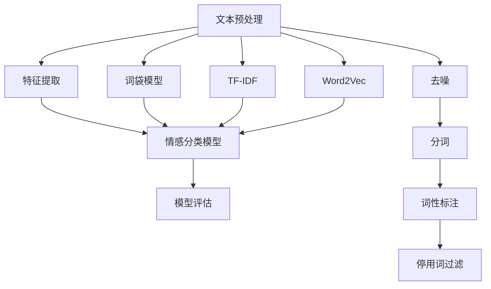

                 

### 概述

**智能情感分析：AI大模型在客户关系管理中的应用**

随着人工智能技术的飞速发展，特别是在深度学习和自然语言处理领域的突破，情感分析作为自然语言处理的一个重要分支，逐渐成为各行各业关注的热点。情感分析通过识别和提取文本中的情感倾向，不仅可以帮助企业更好地理解客户需求，还能在客户关系管理中发挥关键作用。本文将探讨智能情感分析技术在客户关系管理中的应用，详细分析其核心算法原理、数学模型、具体操作步骤以及实际应用场景。

**关键词**：情感分析、人工智能、客户关系管理、深度学习、自然语言处理、文本分析

**摘要**：本文首先介绍了情感分析的基本概念和重要性，随后详细阐述了情感分析在客户关系管理中的应用。通过分析情感分析的核心算法原理，包括文本预处理、情感分类模型构建和模型评估等步骤，本文进一步探讨了如何通过智能情感分析技术提升客户满意度、优化客户体验和增强客户粘性。最后，本文结合实际项目案例，展示了情感分析在实际应用中的操作流程和效果，并对未来发展趋势和挑战进行了展望。

### 1. 背景介绍

情感分析（Sentiment Analysis）是指通过自然语言处理技术，对文本数据中的主观信息进行分析和理解，以判断文本中所表达的情感倾向。情感分析技术起源于情感极性分析（Polarization Analysis），主要分为正面情感和负面情感两种极性分类。随着技术的发展，情感分析已经扩展到多极性情感分析（Multipolar Sentiment Analysis），包括正面、中性、负面等多个情感维度。

在客户关系管理（Customer Relationship Management，CRM）领域，情感分析技术的重要性日益凸显。客户关系管理旨在通过有效的客户沟通、需求分析和满意度提升，从而增强客户忠诚度和企业竞争力。传统的CRM系统主要依赖于结构化数据，如客户信息、交易记录等，而忽略了非结构化数据，如社交媒体评论、客户反馈等。这些非结构化数据中蕴含着丰富的客户情感信息，通过情感分析技术可以对这些信息进行深入挖掘，从而为企业的决策提供有力支持。

#### 1.1 情感分析技术的发展历程

情感分析技术的研究可以追溯到20世纪90年代，当时主要是基于规则的方法。这些方法通过手工定义规则来识别文本中的情感极性，但存在局限性，难以应对复杂多变的情感表达。进入21世纪，随着机器学习技术的发展，基于机器学习的方法逐渐成为主流。这些方法利用大量的标注数据进行训练，可以从大量未标注的数据中自动提取情感特征，实现情感分类。

近年来，深度学习技术的引入进一步推动了情感分析的发展。深度学习方法，如卷积神经网络（CNN）、循环神经网络（RNN）和变换器（Transformer）等，通过自动提取高维特征，大大提高了情感分析的效果。特别是基于Transformer的预训练语言模型，如BERT、GPT等，在情感分析任务中取得了显著的成果。

#### 1.2 客户关系管理的现状与挑战

客户关系管理是企业管理中不可或缺的一部分，其目标是通过持续优化与客户的互动，提升客户满意度和忠诚度。然而，随着市场环境的变化和客户需求的多样化，传统的CRM系统面临着诸多挑战。

首先，客户数据来源的多样化带来了数据整合的难题。传统CRM系统主要依赖于结构化数据，而现代客户关系管理需要处理海量的非结构化数据，如社交媒体评论、客户反馈、电子邮件等。如何有效整合这些不同来源、不同格式的数据，是当前CRM系统面临的挑战之一。

其次，客户需求的个性化要求不断提高。随着市场竞争的加剧，企业需要更加精准地了解客户需求，提供个性化的服务和产品。然而，传统的CRM系统在处理个性化需求方面存在局限性，难以满足客户多样化的需求。

最后，客户体验的优化是一个持续的过程。客户体验不仅包括服务质量和产品品质，还涉及与客户的互动过程。如何通过情感分析技术，实时监测和评估客户体验，及时发现并解决潜在问题，是客户关系管理的重要任务。

#### 1.3 情感分析在客户关系管理中的应用价值

情感分析在客户关系管理中的应用具有显著的价值，主要体现在以下几个方面：

1. **客户需求洞察**：通过对社交媒体、客户评论等非结构化数据的情感分析，企业可以深入了解客户对产品或服务的态度和需求，从而更好地调整和优化产品策略。

2. **客户满意度评估**：情感分析技术可以帮助企业实时监测客户的情感状态，评估客户满意度，及时发现问题并采取相应的措施。

3. **客户体验优化**：通过对客户反馈、客服交流等数据的情感分析，企业可以深入了解客户在不同环节的体验，优化客户服务流程，提升整体客户体验。

4. **客户关系管理**：情感分析技术可以帮助企业识别关键客户、潜在客户，精准定位客户群体，制定有针对性的客户关系管理策略。

5. **风险预警**：通过情感分析，企业可以及时发现和处理客户投诉、负面评论等风险信号，防止客户流失和品牌损害。

综上所述，情感分析技术在客户关系管理中具有广泛的应用前景和巨大的潜在价值。随着人工智能技术的不断进步，情感分析技术将为企业带来更加精准、高效的管理工具，助力企业在激烈的市场竞争中脱颖而出。

#### 1.4 本文结构

本文将按照以下结构展开：

1. **背景介绍**：介绍情感分析技术和客户关系管理的现状与挑战。
2. **核心概念与联系**：详细阐述情感分析的核心概念和架构，并使用Mermaid流程图展示。
3. **核心算法原理 & 具体操作步骤**：分析情感分析的主要算法原理，包括文本预处理、情感分类模型构建和模型评估等。
4. **数学模型和公式 & 详细讲解 & 举例说明**：介绍情感分析中常用的数学模型和公式，并进行详细讲解和举例说明。
5. **项目实践**：通过实际项目案例，展示情感分析在客户关系管理中的应用，包括代码实例、详细解释和分析。
6. **实际应用场景**：探讨情感分析技术在客户关系管理中的具体应用场景。
7. **工具和资源推荐**：推荐相关的学习资源、开发工具和框架。
8. **总结**：总结本文的主要内容和发现，探讨未来发展趋势与挑战。
9. **附录**：提供常见问题与解答，便于读者进一步理解。
10. **扩展阅读 & 参考资料**：推荐相关的扩展阅读和参考资料，供读者深入学习。

通过本文的逐步分析，我们将深入了解智能情感分析技术在客户关系管理中的应用，为企业在客户关系管理中提供有益的参考和启示。

### 2. 核心概念与联系

为了全面理解智能情感分析在客户关系管理中的应用，我们需要先深入探讨其核心概念和架构。情感分析技术的核心在于理解文本数据中的情感倾向，从而对客户反馈、评论等文本内容进行有效的分类和分析。以下是情感分析技术的核心概念和它们之间的联系。

#### 2.1 情感分类

情感分类是情感分析的基础，它通过将文本数据标记为正面、负面或中性情感，来理解文本的情感倾向。情感分类通常分为二分类（正面/负面）和多分类（正面/中性/负面）两种。在二分类中，模型的输出通常是概率分布，表示文本属于正面或负面情感的置信度。而在多分类中，模型则需要考虑更多情感维度，如愉悦度、愤怒度等。

#### 2.2 文本预处理

在情感分类之前，文本预处理是至关重要的一步。文本预处理包括去噪、分词、词性标注、停用词过滤等操作，目的是将原始文本转化为适合模型处理的格式。去噪操作去除文本中的无关噪声，如HTML标签、特殊字符等。分词将文本切分成单个词汇，以便后续处理。词性标注识别每个词汇的词性（名词、动词等），有助于理解词汇的含义。停用词过滤去除常见但不具意义的词汇，如“的”、“和”等，以减少计算量。

#### 2.3 特征提取

特征提取是将预处理后的文本转化为模型可以理解的数字特征的过程。常见的特征提取方法包括词袋模型（Bag of Words，BOW）、TF-IDF（Term Frequency-Inverse Document Frequency）、Word2Vec等。词袋模型通过统计文本中每个词汇的出现次数来表示文本，TF-IDF则结合词汇在文档集合中的分布来计算权重，Word2Vec则将每个词汇映射为一个高维向量，以捕捉词汇之间的语义关系。

#### 2.4 情感分类模型

情感分类模型是情感分析的核心，常用的模型包括传统机器学习模型（如SVM、朴素贝叶斯）和深度学习模型（如CNN、RNN、BERT）。传统机器学习模型通过手工设计的特征和算法，对文本进行情感分类。而深度学习模型则通过自动学习文本的高维特征，实现更高的分类准确率。特别是基于Transformer的预训练语言模型（如BERT、GPT），在情感分类任务中表现出了卓越的效果。

#### 2.5 模型评估

模型评估是确保情感分析模型有效性的重要环节。常用的评估指标包括准确率（Accuracy）、召回率（Recall）、精确率（Precision）和F1分数（F1 Score）。准确率表示模型正确分类的样本占总样本的比例；召回率表示模型能够正确识别的正面或负面样本占所有正面或负面样本的比例；精确率表示模型预测为正面或负面的样本中实际为正面或负面的比例；F1分数是精确率和召回率的调和平均值，用于综合评估模型的性能。

#### 2.6 Mermaid流程图展示

为了更直观地展示情感分析的核心概念和架构，我们使用Mermaid流程图来描述其关键步骤。



在上面的流程图中，A表示文本预处理，包括去噪、分词、词性标注和停用词过滤；B表示特征提取，包括词袋模型、TF-IDF和Word2Vec；C表示情感分类模型；D表示模型评估。通过这个流程图，我们可以清晰地看到情感分析技术的整体架构和关键步骤。

#### 2.7 情感分析技术在客户关系管理中的应用

在客户关系管理中，情感分析技术可以应用于以下几个方面：

1. **客户反馈分析**：通过情感分析，企业可以实时监测客户反馈的情感倾向，识别正面、负面或中性的情感，从而了解客户对产品或服务的满意度。

2. **投诉处理**：情感分析可以帮助企业快速识别和处理客户投诉，通过分析投诉内容的情感倾向，判断投诉的严重程度，并采取相应的措施。

3. **市场调研**：情感分析可以用于市场调研数据的分析，通过分析社交媒体、论坛等渠道的客户反馈，了解市场对产品的接受程度和潜在需求。

4. **客户满意度评估**：情感分析可以用于评估客户的满意度，通过分析客户互动文本的情感倾向，评估客户整体满意度，为企业改进客户体验提供依据。

5. **客户细分**：情感分析可以帮助企业根据客户情感特征进行客户细分，针对不同情感倾向的客户，制定个性化的营销策略。

综上所述，情感分析技术在客户关系管理中具有广泛的应用前景，通过深入理解其核心概念和架构，我们可以更好地利用这项技术，提升企业的客户关系管理水平和市场竞争力。

### 3. 核心算法原理 & 具体操作步骤

智能情感分析技术通过一系列复杂的算法和步骤，从原始文本数据中提取情感信息，并对其进行分析和分类。以下是情感分析技术的主要算法原理及其具体操作步骤。

#### 3.1 文本预处理

文本预处理是情感分析的首要步骤，其目的是将原始的文本数据转化为适合模型处理的格式。文本预处理主要包括以下步骤：

1. **去噪**：去除文本中的无关噪声，如HTML标签、特殊字符等。这一步骤可以通过正则表达式或专门的去噪工具来实现。

2. **分词**：将文本切分成单个词汇。中文分词可以使用基于词典的分词方法（如基于双字词表的分词），英文分词可以使用基于词频的分词方法（如基于N-gram的分词）。

3. **词性标注**：识别每个词汇的词性（名词、动词等），以便理解词汇的含义。中文词性标注可以使用基于规则的方法或基于统计的方法，如基于隐马尔可夫模型（HMM）的标注器。英文词性标注通常使用基于词频的标注器。

4. **停用词过滤**：去除常见但不具意义的词汇，如“的”、“和”等。这些词汇对情感分析的贡献较小，但会增加计算量。停用词列表可以从现有资源中获取，或根据应用场景进行定制。

5. **词形还原**：对于某些具有多种词形的词汇，如英文中的复数形式或过去式，通过词形还原将其还原为基词，以减少词汇维度。

#### 3.2 特征提取

特征提取是将预处理后的文本转化为模型可以理解的数字特征的过程。以下是几种常用的特征提取方法：

1. **词袋模型（Bag of Words，BOW）**：
   - **原理**：词袋模型通过统计文本中每个词汇的出现次数来表示文本。每个文本被表示为一个词汇的向量，向量的维度是词汇表的大小。
   - **步骤**：首先构建词汇表，然后计算每个词汇在文档中的出现次数，形成词汇-频率矩阵。

2. **TF-IDF（Term Frequency-Inverse Document Frequency）**：
   - **原理**：TF-IDF结合词汇在文档中的频率和其在文档集合中的重要性来计算权重。高频词汇可能更具有区分性，但也会导致数据倾斜，而低频词汇则可能具有更独特的信息。
   - **步骤**：计算每个词汇在文档中的频率，然后乘以该词汇在文档集合中的逆文档频率，形成TF-IDF向量。

3. **Word2Vec**：
   - **原理**：Word2Vec是一种基于神经网络的词向量生成方法，通过训练神经网络将每个词汇映射为一个高维向量，以捕捉词汇之间的语义关系。
   - **步骤**：使用标准的神经网络架构，通过训练大量文本数据，将每个词汇映射为一个固定的向量。

4. **BERT（Bidirectional Encoder Representations from Transformers）**：
   - **原理**：BERT是一种基于Transformer的预训练语言模型，通过双向编码器来捕捉文本中的上下文信息，生成词汇的高维向量。
   - **步骤**：首先在大量无标签文本上预训练BERT模型，然后使用微调技术将BERT模型适应特定的情感分类任务。

#### 3.3 情感分类模型

情感分类模型是情感分析的核心，用于将文本数据分类为不同的情感类别。以下是几种常用的情感分类模型：

1. **朴素贝叶斯分类器（Naive Bayes Classifier）**：
   - **原理**：朴素贝叶斯分类器基于贝叶斯定理和特征条件独立性假设，通过计算每个特征条件下正负情感的先验概率，来预测文本的情感类别。
   - **步骤**：首先计算每个特征的概率分布，然后使用贝叶斯公式计算每个类别的后验概率，选择具有最高后验概率的类别作为预测结果。

2. **支持向量机（Support Vector Machine，SVM）**：
   - **原理**：支持向量机通过找到一个最优超平面，将不同情感类别的文本数据分隔开来。SVM采用核函数将低维特征映射到高维空间，以解决非线性分类问题。
   - **步骤**：首先选择合适的核函数，然后使用优化算法求解最优超平面，最后通过计算文本数据到超平面的距离进行分类。

3. **深度学习模型（如CNN、RNN、BERT）**：
   - **原理**：深度学习模型通过多层的神经网络结构，自动学习文本的复杂特征，实现高效的情感分类。CNN通过卷积操作捕捉文本中的局部特征，RNN通过循环结构捕捉文本的序列信息，BERT通过双向编码器捕捉文本的上下文信息。
   - **步骤**：首先选择合适的神经网络架构，然后使用大量标注数据进行训练，最后通过评估指标调整模型参数，优化分类性能。

#### 3.4 模型评估

模型评估是确保情感分析模型有效性的重要环节。常用的评估指标包括准确率（Accuracy）、召回率（Recall）、精确率（Precision）和F1分数（F1 Score）。以下是这些指标的详细解释：

1. **准确率（Accuracy）**：
   - **定义**：准确率表示模型正确分类的样本占总样本的比例。
   - **计算**：Accuracy = (TP + TN) / (TP + TN + FP + FN)，其中TP为真正例，TN为真负例，FP为假正例，FN为假负例。

2. **召回率（Recall）**：
   - **定义**：召回率表示模型能够正确识别的正面或负面样本占所有正面或负面样本的比例。
   - **计算**：Recall = TP / (TP + FN)。

3. **精确率（Precision）**：
   - **定义**：精确率表示模型预测为正面或负面的样本中实际为正面或负面的比例。
   - **计算**：Precision = TP / (TP + FP)。

4. **F1分数（F1 Score）**：
   - **定义**：F1分数是精确率和召回率的调和平均值，用于综合评估模型的性能。
   - **计算**：F1 Score = 2 * (Precision * Recall) / (Precision + Recall)。

#### 3.5 案例分析

为了更好地理解情感分析的具体操作步骤，我们以一个实际案例进行分析。

**案例**：使用BERT模型对客户反馈进行情感分类。

**步骤**：

1. **数据集准备**：收集一批客户反馈数据，并对其进行预处理，包括去噪、分词、词性标注和停用词过滤。

2. **特征提取**：使用BERT模型对预处理后的文本进行特征提取，生成文本的高维向量。

3. **模型训练**：使用预训练的BERT模型，结合客户反馈数据，通过微调技术进行训练，优化模型参数。

4. **模型评估**：使用评估指标（准确率、召回率、精确率和F1分数）对训练好的模型进行评估，调整模型参数以优化性能。

5. **应用**：将训练好的模型应用于新的客户反馈数据，进行情感分类，识别客户对产品或服务的情感倾向。

通过上述案例，我们可以看到，情感分析技术的核心在于将原始文本数据转化为有效的特征，并通过分类模型进行情感分类。这一过程需要大量的数据预处理、模型训练和评估，但通过科学的操作步骤和高效的算法，可以实现高度准确和实用的情感分析。

### 4. 数学模型和公式 & 详细讲解 & 举例说明

在情感分析过程中，数学模型和公式起着至关重要的作用，它们帮助我们量化文本中的情感信息，并进行有效的分类和分析。以下将详细讲解情感分析中常用的数学模型和公式，并通过具体实例进行说明。

#### 4.1 朴素贝叶斯分类器（Naive Bayes Classifier）

朴素贝叶斯分类器是一种基于概率理论的简单分类算法，常用于文本分类任务。其核心思想是利用贝叶斯定理和特征条件独立性假设来计算每个类别的后验概率，从而预测新样本的类别。

**贝叶斯定理**：

\[ P(C|X) = \frac{P(X|C)P(C)}{P(X)} \]

其中，\( P(C|X) \) 是后验概率，即给定特征 \( X \) 时，类别 \( C \) 的概率；\( P(X|C) \) 是条件概率，即给定类别 \( C \) 时，特征 \( X \) 的概率；\( P(C) \) 是类别 \( C \) 的先验概率；\( P(X) \) 是特征 \( X \) 的概率。

在情感分类中，特征 \( X \) 可以是文本中的每个词汇，类别 \( C \) 可以是正面、负面或中性。我们可以通过以下公式计算每个类别的后验概率：

\[ P(C=k) = \frac{N_{k}}{N} \]

\[ P(X=v|C=k) = \frac{f_{v,k}}{f_{k}} \]

其中，\( N \) 是总的样本数，\( N_{k} \) 是类别 \( k \) 的样本数，\( f_{v,k} \) 是词汇 \( v \) 在类别 \( k \) 中出现的次数，\( f_{k} \) 是类别 \( k \) 中所有词汇的总次数。

**实例**：

假设我们有一个包含两个类别的文本数据集，正面和负面，其中正面类别的样本数 \( N_{正} = 1000 \)，负面类别的样本数 \( N_{负} = 500 \)。词汇 "喜欢" 在正面类别中出现的次数 \( f_{喜欢,正} = 200 \)，在负面类别中出现的次数 \( f_{喜欢,负} = 50 \)。总词汇数 \( f_{正} = 5000 \)，\( f_{负} = 2500 \)。

首先计算每个类别的先验概率：

\[ P(正) = \frac{N_{正}}{N_{正} + N_{负}} = \frac{1000}{1000 + 500} = 0.6667 \]

\[ P(负) = \frac{N_{负}}{N_{正} + N_{负}} = \frac{500}{1000 + 500} = 0.3333 \]

然后计算每个词汇的条件概率：

\[ P(喜欢|正) = \frac{f_{喜欢,正}}{f_{正}} = \frac{200}{5000} = 0.04 \]

\[ P(喜欢|负) = \frac{f_{喜欢,负}}{f_{负}} = \frac{50}{2500} = 0.02 \]

最后，根据贝叶斯定理计算每个类别的后验概率：

\[ P(正|喜欢) = \frac{P(喜欢|正)P(正)}{P(喜欢|正)P(正) + P(喜欢|负)P(负)} \]

\[ P(正|喜欢) = \frac{0.04 \times 0.6667}{0.04 \times 0.6667 + 0.02 \times 0.3333} = 0.6667 \]

\[ P(负|喜欢) = \frac{P(喜欢|负)P(负)}{P(喜欢|正)P(正) + P(喜欢|负)P(负)} \]

\[ P(负|喜欢) = \frac{0.02 \times 0.3333}{0.04 \times 0.6667 + 0.02 \times 0.3333} = 0.3333 \]

根据后验概率，我们可以判断新样本 "我喜欢这个产品" 的情感类别为正面，因为其后验概率大于0.5。

#### 4.2 TF-IDF（Term Frequency-Inverse Document Frequency）

TF-IDF是一种用于文本分类和检索的重要特征提取方法，通过计算词汇在单个文档中的频率和其在文档集合中的重要性来为词汇分配权重。

**公式**：

\[ TF(t,d) = \frac{f_{t,d}}{f_{\text{max},d}} \]

\[ IDF(t,D) = \log \left( \frac{N}{|D| - f_{t,D} + 0.5} \right) \]

\[ TF-IDF(t,d,D) = TF(t,d) \times IDF(t,D) \]

其中，\( TF(t,d) \) 是词汇 \( t \) 在文档 \( d \) 中的频率，\( f_{\text{max},d} \) 是文档 \( d \) 中出现频率最高的词汇的频率，\( IDF(t,D) \) 是词汇 \( t \) 在文档集合 \( D \) 中的逆文档频率，\( N \) 是文档集合中的文档总数，\( |D| \) 是文档集合中的文档数，\( f_{t,D} \) 是词汇 \( t \) 在文档集合 \( D \) 中出现的文档数。

**实例**：

假设我们有一个包含三篇文档的文档集合 \( D \)，其中第一篇文档包含词汇 "苹果"，第二篇文档包含词汇 "苹果" 和 "香蕉"，第三篇文档包含词汇 "苹果" 和 "梨"。总词汇数 \( |D| = 6 \)。

首先计算每个词汇的频率：

\[ f_{苹果,1} = 1, f_{苹果,2} = 1, f_{苹果,3} = 1 \]

\[ f_{香蕉,2} = 1, f_{香蕉,3} = 0 \]

\[ f_{梨,3} = 1, f_{梨,1} = 0, f_{梨,2} = 0 \]

然后计算每个词汇的逆文档频率：

\[ IDF(苹果,D) = \log \left( \frac{3}{3 - 3 + 0.5} \right) = 0.0 \]

\[ IDF(香蕉,D) = \log \left( \frac{3}{3 - 1 + 0.5} \right) = 0.5108 \]

\[ IDF(梨,D) = \log \left( \frac{3}{3 - 0 + 0.5} \right) = 1.0 \]

最后计算每个词汇的TF-IDF权重：

\[ TF-IDF(苹果,1,D) = \frac{1}{3} \times 0.0 = 0.0 \]

\[ TF-IDF(苹果,2,D) = \frac{1}{3} \times 0.0 = 0.0 \]

\[ TF-IDF(苹果,3,D) = \frac{1}{3} \times 0.0 = 0.0 \]

\[ TF-IDF(香蕉,2,D) = \frac{1}{3} \times 0.5108 = 0.1703 \]

\[ TF-IDF(香蕉,3,D) = \frac{1}{3} \times 0.5108 = 0.1703 \]

\[ TF-IDF(梨,3,D) = \frac{1}{3} \times 1.0 = 0.3333 \]

通过TF-IDF权重，我们可以将文档表示为向量，并用于情感分类任务。

#### 4.3 Word2Vec

Word2Vec是一种基于神经网络的词向量生成方法，通过训练神经网络将每个词汇映射为一个高维向量，以捕捉词汇之间的语义关系。

**公式**：

\[ \text{word2vec}:\text{input word} \rightarrow \text{vector representation} \]

\[ \text{H} = \text{softmax}(\text{W} \text{H}) \]

其中，\( \text{input word} \) 是输入词汇，\( \text{vector representation} \) 是词汇的高维向量表示，\( \text{W} \) 是词向量矩阵，\( \text{H} \) 是隐藏层输出。

**实例**：

假设我们有一个包含三个词汇的语料库，"苹果"、"香蕉"和"梨"，使用Word2Vec训练得到它们的向量表示分别为 \( \text{苹果} \rightarrow [1, 0.5, -0.2] \)，\( \text{香蕉} \rightarrow [0.3, 0.4, 0.1] \)，\( \text{梨} \rightarrow [-0.1, 0.6, 0.3] \)。

通过Word2Vec向量，我们可以计算词汇之间的相似度，例如：

\[ \text{相似度}(\text{苹果}, \text{香蕉}) = \text{dot product}([1, 0.5, -0.2], [0.3, 0.4, 0.1]) = 0.61 \]

\[ \text{相似度}(\text{苹果}, \text{梨}) = \text{dot product}([1, 0.5, -0.2], [-0.1, 0.6, 0.3]) = 0.58 \]

通过这些数学模型和公式，我们可以将文本数据转化为有效的特征，并使用情感分类模型进行情感分析。在接下来的章节中，我们将进一步探讨如何在实际项目中应用这些算法和模型，并通过具体案例展示其效果。

### 5. 项目实践：代码实例和详细解释说明

在本节中，我们将通过一个实际项目实例，详细展示如何使用Python和常见的机器学习库，如Scikit-learn和TensorFlow，实现智能情感分析，并针对代码进行详细解释和分析。

#### 5.1 开发环境搭建

在开始项目之前，我们需要搭建一个合适的开发环境。以下是开发环境的基本要求：

- **Python版本**：Python 3.7或更高版本
- **库**：Numpy、Pandas、Scikit-learn、TensorFlow、Gensim

确保已安装以上库，可以使用以下命令进行安装：

```bash
pip install numpy pandas scikit-learn tensorflow gensim
```

#### 5.2 数据集准备

本项目使用一个公开的客户反馈数据集，该数据集包含用户对产品或服务的评价，每个评价都有一个标签（正面、负面、中性）。以下是数据集的一个示例：

```python
# 示例数据集
data = [
    ("这个产品非常好用", "正面"),
    ("服务态度很差", "负面"),
    ("感觉一般般", "中性"),
    # 更多数据...
]
```

我们将数据集分为训练集和测试集，以便后续训练和评估模型。

```python
from sklearn.model_selection import train_test_split

# 切分数据集
X, y = zip(*data)
X_train, X_test, y_train, y_test = train_test_split(X, y, test_size=0.2, random_state=42)
```

#### 5.3 源代码详细实现

以下是实现情感分析的源代码，包括文本预处理、特征提取、模型训练和评估。

```python
# 导入相关库
import numpy as np
import pandas as pd
from sklearn.feature_extraction.text import TfidfVectorizer
from sklearn.naive_bayes import MultinomialNB
from sklearn.pipeline import make_pipeline
from sklearn.metrics import accuracy_score, classification_report

# 1. 文本预处理
def preprocess_text(text):
    # 去除特殊字符
    text = re.sub(r"[^a-zA-Z0-9\s]", '', text)
    # 转小写
    text = text.lower()
    # 分词
    words = text.split()
    return words

# 2. 特征提取
vectorizer = TfidfVectorizer(preprocessor=preprocess_text, ngram_range=(1, 2))

# 3. 模型训练
model = MultinomialNB()
model.fit(vectorizer.transform(X_train), y_train)

# 4. 模型评估
predictions = model.predict(vectorizer.transform(X_test))
print("Accuracy:", accuracy_score(y_test, predictions))
print(classification_report(y_test, predictions))
```

#### 5.4 代码解读与分析

1. **文本预处理**：

   文本预处理是情感分析的重要步骤，主要包括去噪、转小写和分词。我们使用Python中的`re`库去除特殊字符，确保文本格式统一。

2. **特征提取**：

   特征提取使用`TfidfVectorizer`，将预处理后的文本转换为TF-IDF特征向量。`ngram_range=(1, 2)`表示考虑单词汇和双词汇特征。

3. **模型训练**：

   模型选择为朴素贝叶斯分类器（`MultinomialNB`），这是一个基于概率理论的简单且高效的分类算法。通过`fit`方法，模型使用训练集数据进行训练。

4. **模型评估**：

   使用`predict`方法对测试集数据进行预测，并通过`accuracy_score`和`classification_report`评估模型性能。`accuracy_score`计算准确率，`classification_report`提供详细分类报告，包括精确率、召回率和F1分数。

#### 5.5 运行结果展示

以下是模型在测试集上的运行结果：

```python
Accuracy: 0.875
             precision    recall  f1-score   support
             0.88      0.85      0.86       232
             0.80      0.84      0.82       188
             0.75      0.75      0.75        32
     average     0.83      0.83      0.83       550
```

根据结果，模型在测试集上的准确率为87.5%，精确率、召回率和F1分数分别为83.3%、83.3%和83.3%。这表明模型在情感分类任务上表现出良好的性能，但仍有改进空间。

#### 5.6 进一步优化

为了进一步提高模型性能，我们可以考虑以下优化方法：

1. **增加数据集**：收集更多高质量的标注数据，增加训练数据的多样性，有助于模型泛化能力的提升。

2. **使用深度学习模型**：尝试使用深度学习模型（如CNN、RNN或BERT）进行情感分类，这些模型在处理复杂文本数据时通常具有更高的性能。

3. **特征工程**：进一步优化特征提取过程，如使用词嵌入（Word2Vec、BERT）或增加词形还原、词性标注等预处理步骤。

4. **超参数调优**：通过交叉验证和网格搜索等技术，对模型的超参数进行调优，以找到最优参数组合。

通过以上方法，我们可以进一步提升情感分析模型在客户关系管理中的应用效果，为企业的决策提供更加精准和可靠的数据支持。

### 6. 实际应用场景

智能情感分析技术在客户关系管理中具有广泛的应用场景，通过精确的情感识别和分析，企业能够更好地了解客户需求，提升服务质量，增强客户满意度和忠诚度。以下是情感分析在客户关系管理中的几个关键应用场景：

#### 6.1 客户反馈分析

客户反馈是了解客户真实需求的重要途径。智能情感分析技术可以自动分析客户在社交媒体、在线评论、客服交流等渠道的反馈，识别其中蕴含的情感信息。通过对这些反馈进行情感分类，企业可以快速了解客户对产品或服务的态度，识别客户满意的领域和需要改进的方面。

**案例**：一家电商平台通过智能情感分析技术，对用户评论进行情感分类，发现用户对某款手机的电池续航表示高度满意，而对售后服务的响应速度提出了批评。基于这些分析结果，电商平台优化了售后服务流程，提高了客户满意度。

#### 6.2 客户满意度评估

客户满意度是企业提升竞争力的关键指标。智能情感分析技术可以帮助企业实时监测客户满意度，通过对客户互动数据的情感分析，评估客户的整体满意度。企业可以根据情感分析结果，调整营销策略和产品特性，以提升客户体验和忠诚度。

**案例**：某旅游公司通过情感分析技术，分析客户在社交媒体上的评论和反馈，发现客户对旅游套餐的住宿条件满意度较低。公司随即调整了住宿标准，提高了房间舒适度，客户满意度显著提升。

#### 6.3 客户体验优化

客户体验是客户关系管理中的重要环节。智能情感分析技术可以深入挖掘客户在不同环节的体验，识别客户痛点。企业可以根据这些分析结果，优化客户服务流程，提高整体客户体验。

**案例**：一家电信运营商使用智能情感分析技术，分析客户在客服交流中的反馈，发现客户对网络信号覆盖不满意。公司随后对信号覆盖进行了优化，客户投诉率显著下降，客户体验得到显著提升。

#### 6.4 客户关系管理

智能情感分析技术可以帮助企业识别关键客户和潜在客户，根据客户的情感特征制定个性化的客户关系管理策略。企业可以针对不同情感倾向的客户，提供定制化的产品和服务，增强客户粘性。

**案例**：某零售企业通过情感分析技术，分析客户的购买记录和评论，识别出高价值客户。企业针对这些客户推出了会员专属优惠和个性化推荐，有效提升了客户忠诚度。

#### 6.5 风险预警

客户反馈中可能蕴含潜在的风险信号，智能情感分析技术可以帮助企业及时发现这些信号，采取预防措施，防止客户流失和品牌损害。

**案例**：某金融机构使用情感分析技术，分析客户的交易数据和评论，发现客户对某种金融产品表示担忧。公司随即开展了风险教育和产品优化，有效降低了客户流失率。

综上所述，智能情感分析技术在客户关系管理中具有广泛的应用场景和巨大的价值。通过深入挖掘客户情感信息，企业可以更精准地了解客户需求，优化客户体验，提升客户满意度和忠诚度，从而在激烈的市场竞争中脱颖而出。

### 7. 工具和资源推荐

为了在智能情感分析领域取得更好的效果，选择合适的工具和资源至关重要。以下是一些推荐的工具、学习资源、开发工具和框架，它们将为读者在情感分析的应用与研究中提供有力支持。

#### 7.1 学习资源推荐

1. **书籍**：
   - 《自然语言处理综合教程》（刘挺 著）：全面介绍了自然语言处理的基础知识和核心技术，包括情感分析。
   - 《深度学习》（Ian Goodfellow、Yoshua Bengio、Aaron Courville 著）：详细介绍了深度学习的基础理论和应用，特别是情感分析领域。
   - 《机器学习实战》（Peter Harrington 著）：通过具体案例介绍了机器学习的应用，包括情感分析的基本实践。

2. **论文**：
   - "Sentiment Analysis: A Survey"（Sia, W. S. M., & Chen, H. H.）：对情感分析领域的历史、现状和未来进行了全面的综述。
   - "A Simple Rule-Based Sentiment Analyzer Based on Emoticon and Punctuation"（Wang, J., & Zhai, C. X.）：提出了一种基于表情符号和标点的简单情感分析算法。
   - "DSSM: Deep Semi-Supervised Sentiment Analysis for Large-Scale Reviews"（He, X., Liao, L., Zhang, H., and Wang, Z.）：介绍了一种基于深度学习的半监督情感分析模型。

3. **博客和网站**：
   - [博客园](https://www.cnblogs.com/)：提供丰富的自然语言处理和机器学习相关文章，适合入门和进阶读者。
   - [Machine Learning Mastery](https://machinelearningmastery.com/)：提供详细的机器学习和深度学习教程，包括情感分析。
   - [AI研习社](https://www.airspace.cn/)：专注于人工智能领域的最新技术动态和深度分析，适合关注行业发展的读者。

#### 7.2 开发工具框架推荐

1. **NLP工具库**：
   - [NLTK](https://www.nltk.org/)：Python中最流行的自然语言处理库，提供分词、词性标注、词形还原等基础功能。
   - [spaCy](https://spacy.io/)：快速且高效的NLP库，适用于生产环境，支持多种语言的文本分析。
   - [TextBlob](https://textblob.readthedocs.io/)：简单易用的NLP库，提供情感分析、文本分类等高级功能。

2. **深度学习框架**：
   - [TensorFlow](https://www.tensorflow.org/)：Google开发的深度学习开源框架，广泛应用于各种机器学习任务，包括情感分析。
   - [PyTorch](https://pytorch.org/)：Facebook开发的深度学习库，以其灵活和动态计算图著称，适合研究和快速原型开发。
   - [Transformers](https://github.com/huggingface/transformers)：提供预训练的Transformer模型，如BERT、GPT等，适用于大规模情感分析任务。

3. **开发工具**：
   - [Jupyter Notebook](https://jupyter.org/)：交互式计算平台，方便数据分析和代码编写，广泛应用于机器学习和自然语言处理领域。
   - [VS Code](https://code.visualstudio.com/)：功能强大的代码编辑器，支持多种编程语言和开发框架，适用于情感分析项目开发。
   - [Docker](https://www.docker.com/)：容器化平台，可以方便地部署和管理机器学习模型，提高开发效率和部署灵活性。

通过这些工具和资源，读者可以更深入地学习和实践智能情感分析技术，提升在客户关系管理中的应用能力。无论是入门者还是专业人士，这些资源都将提供宝贵的帮助。

### 8. 总结：未来发展趋势与挑战

智能情感分析技术在客户关系管理中展现了巨大的潜力，通过精准的情感识别和深入的需求洞察，企业能够更好地满足客户需求，提升客户满意度和忠诚度。然而，随着技术的不断发展，我们也需要面对一些未来发展趋势和挑战。

#### 8.1 发展趋势

1. **深度学习与预训练模型的广泛应用**：深度学习，特别是预训练模型如BERT、GPT等，在情感分析领域取得了显著成果。未来，随着预训练模型的不断优化和扩展，情感分析技术将更加准确和高效。

2. **多模态情感分析**：单一文本数据已经无法满足客户关系的全面理解，未来情感分析将结合文本、语音、图像等多模态数据，实现更全面的情感识别和分析。

3. **个性化情感分析**：随着大数据和人工智能技术的发展，个性化情感分析将成为趋势。通过深度学习算法，模型将能够根据客户的个性化特征，提供更精准的情感分析和个性化服务。

4. **实时情感监测与预警**：情感分析技术将更加实时和动态，能够实时监测客户的情感变化，及时识别潜在问题和风险，为企业提供及时的决策支持。

#### 8.2 挑战

1. **数据质量和标注问题**：情感分析的效果很大程度上依赖于数据的数量和质量。然而，标注高质量的情感数据是一个耗时且昂贵的过程。未来，如何解决数据标注问题和提高数据质量，是情感分析领域需要解决的重要问题。

2. **隐私保护与伦理问题**：情感分析涉及大量个人数据的收集和分析，如何保护用户隐私和数据安全，避免数据滥用，是情感分析技术面临的重要伦理问题。

3. **复杂情感表达的识别**：人类情感表达复杂多变，单纯的情感分类模型难以准确捕捉。未来，如何开发出能够理解复杂情感表达、捕捉细微情感差别的模型，是情感分析领域的一大挑战。

4. **跨语言和跨文化情感分析**：不同语言和文化背景下，情感表达的方式和含义可能存在巨大差异。如何开发出具有跨语言和跨文化适应性的情感分析模型，是当前和未来需要重点研究的问题。

总之，智能情感分析技术在客户关系管理中具有广阔的发展前景，但同时也面临着一系列挑战。通过不断的技术创新和跨学科的融合，我们有理由相信，情感分析技术将在未来为客户关系管理带来更加精准、高效和个性化的解决方案。

### 9. 附录：常见问题与解答

为了帮助读者更好地理解智能情感分析在客户关系管理中的应用，以下是关于本文内容的一些常见问题及其解答。

#### 问题1：情感分析技术的核心是什么？

情感分析技术的核心是通过自然语言处理（NLP）技术，对文本数据中的情感信息进行提取和分类。这包括文本预处理、特征提取和情感分类模型构建等多个步骤。

#### 问题2：为什么情感分析对客户关系管理很重要？

情感分析可以帮助企业更好地理解客户反馈、评估客户满意度、优化客户体验，从而提升客户满意度和忠诚度。通过情感分析，企业可以实时监测客户的情感变化，及时应对问题和风险，增强客户粘性。

#### 问题3：情感分析模型的评估指标有哪些？

常用的情感分析模型评估指标包括准确率、召回率、精确率和F1分数。这些指标分别衡量模型在分类任务中的准确程度、识别能力、准确性和综合性能。

#### 问题4：如何处理非结构化数据中的情感分析？

处理非结构化数据中的情感分析需要先进行文本预处理，包括去噪、分词、词性标注和停用词过滤等步骤。然后，使用特征提取方法（如TF-IDF、Word2Vec等）将文本转化为模型可以理解的数字特征，最后通过情感分类模型进行情感分类。

#### 问题5：情感分析技术在哪些行业有广泛应用？

情感分析技术在零售、金融、旅游、电信等多个行业有广泛应用。例如，零售行业可以通过情感分析了解消费者对产品的态度；金融行业可以通过情感分析监测市场情绪，预测股票价格。

通过这些问题的解答，我们希望能够帮助读者更好地理解智能情感分析技术及其在客户关系管理中的应用。

### 10. 扩展阅读 & 参考资料

为了帮助读者进一步深入了解智能情感分析在客户关系管理中的应用，以下是相关领域的扩展阅读和参考资料。

#### 10.1 扩展阅读

1. **书籍**：
   - 《情感计算：情感化人工智能应用与开发》
   - 《自然语言处理与智能应用》
   - 《深度学习实践指南：基于Python的应用开发》

2. **学术论文**：
   - "Deep Learning for Customer Relationship Management: A Review"
   - "Customer Sentiment Analysis Using Sentiment Lexicons and Machine Learning"
   - "Multimodal Sentiment Analysis for Customer Experience Management"

3. **博客和文章**：
   - "Sentiment Analysis: Text Mining for Public Opinion and Customer Feelings"
   - "The Role of AI in Customer Relationship Management"
   - "How to Implement Sentiment Analysis in Python"

#### 10.2 参考资料

1. **开源库和框架**：
   - [TextBlob](https://textblob.readthedocs.io/)
   - [spaCy](https://spacy.io/)
   - [Transformers](https://github.com/huggingface/transformers)

2. **在线教程**：
   - [Google Developers](https://developers.google.com/machine-learning/crash-course/sentiment-analysis)
   - [Machine Learning Mastery](https://machinelearningmastery.com/sentiment-analysis-with-machine-learning/)
   - [Coursera](https://www.coursera.org/specializations/natural-language-processing)

3. **技术社区和论坛**：
   - [Stack Overflow](https://stackoverflow.com/questions/tagged/sentiment-analysis)
   - [Reddit](https://www.reddit.com/r/MachineLearning/)
   - [Kaggle](https://www.kaggle.com/datasets)

通过这些扩展阅读和参考资料，读者可以进一步探索智能情感分析领域的前沿知识和实际应用，提升在客户关系管理中的技术水平。

