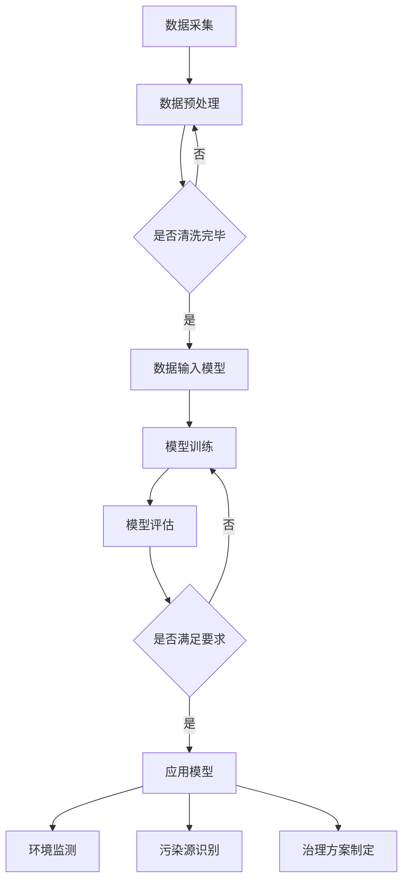

                 

### 1. 背景介绍

在现代社会，环境保护已经成为全球关注的焦点。气候变化、污染问题、资源匮乏等环境问题日益严重，对人类生存和发展构成严峻挑战。面对这些挑战，传统的环境保护方法和手段显得力不从心，迫切需要新的技术和理念来推动环境保护工作。

近年来，人工智能（AI）技术的发展为环境保护带来了新的机遇。通过构建大模型，AI能够对大量环境数据进行高效处理和分析，从而发现环境问题的根源，提出有效的解决方案。大模型在环境保护中的应用，不仅能够提高环境保护的效率和准确性，还可以为政策制定者提供科学依据，从而更好地应对环境问题。

本文将围绕智能环境保护的AI大模型应用机会，从核心概念、算法原理、项目实践、应用场景等多个方面进行深入探讨。希望通过本文的阐述，能够为读者提供一个全面而清晰的视角，了解AI大模型在环境保护中的重要作用，以及未来的发展趋势和挑战。

### 2. 核心概念与联系

#### 2.1 大模型的基本概念

大模型，又称大型人工智能模型，是指具有海量参数和高度复杂性的机器学习模型。这些模型通常基于深度学习技术，能够在多个领域实现高性能的预测和分类任务。大模型的核心特点是拥有庞大的训练数据集和丰富的参数，这使得它们能够在复杂的环境中学习到隐含的规律和模式。

#### 2.2 AI在环境保护中的核心作用

人工智能在环境保护中的核心作用主要体现在以下几个方面：

1. **环境数据监测与分析**：通过传感器、卫星图像等数据源，AI能够实时监测环境变化，并快速分析数据，提供环境状况的动态信息。
2. **预测与预警**：基于历史数据和机器学习模型，AI可以预测未来的环境变化趋势，从而为环境保护决策提供科学依据。
3. **污染源识别与控制**：AI可以通过分析环境数据，识别污染源，并制定相应的控制措施，从而减少污染物的排放。
4. **资源优化与管理**：AI能够优化资源利用，提高环境保护效率，例如在能源、水资源的管理和分配中发挥重要作用。

#### 2.3 大模型在环境保护中的应用

大模型在环境保护中的应用场景广泛，主要包括以下几个方面：

1. **气候变化研究**：通过分析大量气候数据，大模型可以研究气候变化的原因和趋势，为应对气候变化提供科学依据。
2. **污染物监测与治理**：大模型可以实时监测空气、水和土壤中的污染物，识别污染源，并预测污染趋势，帮助制定治理方案。
3. **生态保护**：大模型可以分析生态数据，预测生态系统变化趋势，评估生态系统的健康状况，从而制定保护措施。
4. **灾害预警与应急响应**：大模型可以通过分析历史数据和实时监测数据，预测自然灾害的发生和影响范围，为灾害预警和应急响应提供支持。

#### 2.4 大模型与相关技术的联系

大模型在环境保护中的应用，离不开其他相关技术的支持。以下是一些关键技术及其与AI大模型的关系：

1. **传感器技术**：传感器是获取环境数据的重要手段，传感器数据的准确性直接影响大模型的分析结果。AI大模型可以结合传感器数据，进行环境数据的实时监测和分析。
2. **大数据技术**：大数据技术能够处理和分析海量环境数据，为AI大模型提供丰富的训练数据。AI大模型通过分析这些数据，能够发现环境问题的根源和趋势。
3. **云计算与边缘计算**：云计算和边缘计算技术为AI大模型提供了强大的计算能力和数据存储能力，使得大模型能够在大规模环境下高效运行。
4. **物联网（IoT）**：物联网技术将各种传感器和设备连接起来，形成了一个智能化的环境监测网络。AI大模型可以通过物联网平台获取实时数据，实现环境问题的实时监测和预警。

#### 2.5 Mermaid 流程图

以下是AI大模型在环境保护中的典型应用流程的Mermaid流程图：



通过这个流程图，我们可以看到，AI大模型在环境保护中的各个步骤，包括数据采集、预处理、模型训练、评估和应用，形成一个闭环系统，确保环境保护工作的持续进行和优化。

### 3. 核心算法原理 & 具体操作步骤

在智能环境保护中，AI大模型的应用离不开强大的算法支持。以下是几个核心算法原理及其具体操作步骤：

#### 3.1 神经网络算法

神经网络（Neural Networks）是AI大模型中最常用的算法之一。其基本原理是通过模拟生物神经元的工作方式，构建一个多层神经网络，实现对数据的复杂非线性变换。

**具体操作步骤**：

1. **初始化模型**：首先，初始化神经网络的结构，包括输入层、隐藏层和输出层。每个层由多个神经元组成。
2. **前向传播**：输入数据通过输入层传递到隐藏层，经过隐藏层的非线性变换后，再传递到输出层。在这个过程中，每个神经元都会接收前一层神经元的输出，并产生自己的输出。
3. **反向传播**：计算输出层的结果与真实值的差异，然后反向传播这些误差到隐藏层和输入层。在这个过程中，通过反向传播算法，更新每个神经元的权重和偏置。
4. **迭代优化**：重复执行前向传播和反向传播过程，不断更新模型参数，直到满足预定的收敛条件。

#### 3.2 决策树算法

决策树（Decision Trees）是一种基于规则的分类算法，其核心思想是通过一系列的决策规则，将数据集分割成多个子集，每个子集对应一个类别。

**具体操作步骤**：

1. **选择最优分割特征**：计算每个特征的信息增益或基尼不纯度，选择信息增益或基尼不纯度最大的特征作为分割特征。
2. **划分数据集**：根据分割特征，将数据集划分为多个子集。每个子集对应一个新的节点。
3. **递归构建树**：对于每个子集，重复步骤1和步骤2，直到满足停止条件（如最大深度、最小样本数等）。
4. **生成决策规则**：根据决策树的结构，生成一系列的决策规则。每个规则对应一个分类结果。

#### 3.3 贝叶斯算法

贝叶斯算法是一种基于贝叶斯定理的概率分类算法，其核心思想是通过已有数据计算出各个类别的概率，然后根据概率最大原则进行分类。

**具体操作步骤**：

1. **初始化参数**：计算每个类别的先验概率。
2. **计算条件概率**：对于每个特征，计算该特征在各个类别中的条件概率。
3. **计算后验概率**：根据贝叶斯定理，计算每个类别的后验概率。
4. **分类决策**：选择后验概率最大的类别作为分类结果。

#### 3.4 支持向量机算法

支持向量机（Support Vector Machine，SVM）是一种基于间隔最大化原理的分类算法，其核心思想是在高维空间中找到一个最佳的超平面，使得不同类别的数据点在超平面上的间隔最大化。

**具体操作步骤**：

1. **选择核函数**：选择一个合适的核函数，将数据映射到高维空间。
2. **求解最优超平面**：通过求解优化问题，找到最佳的超平面参数。
3. **分类决策**：对于新的数据点，计算其在超平面上的距离，并根据距离判断其类别。

通过以上几种核心算法的应用，AI大模型能够实现对环境数据的分类、预测和分析，从而为环境保护工作提供科学依据。接下来，我们将通过一个具体的案例，进一步探讨AI大模型在环境保护中的应用。

### 4. 数学模型和公式 & 详细讲解 & 举例说明

在智能环境保护中，AI大模型的应用离不开数学模型的支持。以下将详细讲解几种核心数学模型及其相关公式，并通过具体例子进行说明。

#### 4.1 神经网络算法的数学模型

神经网络算法的核心是权重矩阵和激活函数。以下是一个简单的神经网络数学模型：

$$
Z = X \cdot W + b \\
Y = \sigma(Z)
$$

其中，$X$ 是输入向量，$W$ 是权重矩阵，$b$ 是偏置向量，$\sigma$ 是激活函数，通常选择为 sigmoid 函数或 ReLU 函数。

**例子**：一个简单的神经网络模型，输入层有2个神经元，隐藏层有3个神经元，输出层有1个神经元。

- 输入向量 $X = [x_1, x_2]$
- 权重矩阵 $W = \begin{bmatrix} w_{11} & w_{12} \\ w_{21} & w_{22} \\ w_{31} & w_{32} \end{bmatrix}$
- 偏置向量 $b = [b_1, b_2, b_3]$
- 激活函数 $\sigma(x) = \frac{1}{1 + e^{-x}}$

假设输入向量 $X = [1, 0]$，根据上述数学模型，我们可以计算隐藏层的输出：

$$
Z_1 = x_1 \cdot w_{11} + x_2 \cdot w_{12} + b_1 = 1 \cdot w_{11} + 0 \cdot w_{12} + b_1 = w_{11} + b_1 \\
Z_2 = x_1 \cdot w_{21} + x_2 \cdot w_{22} + b_2 = 1 \cdot w_{21} + 0 \cdot w_{22} + b_2 = w_{21} + b_2 \\
Z_3 = x_1 \cdot w_{31} + x_2 \cdot w_{32} + b_3 = 1 \cdot w_{31} + 0 \cdot w_{32} + b_3 = w_{31} + b_3
$$

$$
Y_1 = \sigma(Z_1) = \frac{1}{1 + e^{-(w_{11} + b_1)}} \\
Y_2 = \sigma(Z_2) = \frac{1}{1 + e^{-(w_{21} + b_2)}} \\
Y_3 = \sigma(Z_3) = \frac{1}{1 + e^{-(w_{31} + b_3)}}
$$

输出层的输出 $Y$ 通过激活函数 $\sigma$ 转换得到。

#### 4.2 决策树算法的数学模型

决策树的数学模型基于信息增益或基尼不纯度。以下是一个决策树节点的数学模型：

$$
G(D) = \sum_{i=1}^n p_i \log_2(p_i)
$$

其中，$D$ 是数据集，$n$ 是数据集的类别数，$p_i$ 是第 $i$ 个类别的概率。

**例子**：一个包含两个类别的数据集，类别1的概率为0.6，类别2的概率为0.4。

$$
G(D) = 0.6 \log_2(0.6) + 0.4 \log_2(0.4) \approx 0.6 \cdot (-0.5477) + 0.4 \cdot (-0.5218) \approx -0.3314 - 0.2095 = -0.5419
$$

#### 4.3 贝叶斯算法的数学模型

贝叶斯算法的数学模型基于贝叶斯定理。以下是一个贝叶斯分类器的数学模型：

$$
P(C_k | X) = \frac{P(X | C_k)P(C_k)}{P(X)}
$$

其中，$C_k$ 是类别 $k$，$X$ 是特征向量，$P(X | C_k)$ 是特征向量 $X$ 在类别 $C_k$ 下的条件概率，$P(C_k)$ 是类别 $C_k$ 的先验概率，$P(X)$ 是特征向量 $X$ 的总概率。

**例子**：一个包含两个类别的特征向量 $X$，类别1的先验概率为0.5，类别2的先验概率为0.5。

$$
P(C_1 | X) = \frac{P(X | C_1)P(C_1)}{P(X | C_1)P(C_1) + P(X | C_2)P(C_2)}
$$

假设 $P(X | C_1) = 0.8$，$P(X | C_2) = 0.2$，则：

$$
P(C_1 | X) = \frac{0.8 \cdot 0.5}{0.8 \cdot 0.5 + 0.2 \cdot 0.5} = \frac{0.4}{0.6} = \frac{2}{3}
$$

类别1的概率为 $\frac{2}{3}$，类别2的概率为 $\frac{1}{3}$。

#### 4.4 支持向量机算法的数学模型

支持向量机算法的数学模型基于间隔最大化原理。以下是一个支持向量机的数学模型：

$$
\min_{w, b} \frac{1}{2} ||w||^2 + C \sum_{i=1}^n \xi_i \\
s.t. \quad y^{(i)}(w \cdot x^{(i)} + b) \geq 1 - \xi_i \\
\xi_i \geq 0
$$

其中，$w$ 是权重向量，$b$ 是偏置，$C$ 是惩罚参数，$\xi_i$ 是松弛变量。

**例子**：一个包含两个类别的数据集，选择线性核函数。

$$
w = (w_1, w_2)^T \\
b = b_1 \cdot b_2 \\
\min_{w, b} \frac{1}{2} (w_1^2 + w_2^2) + C (1 - y_1 w_1 x_1 - y_2 w_2 x_2 - b) + (1 - y_2 w_1 x_1 - y_1 w_2 x_2 - b) \\
s.t. \quad y_1 w_1 x_1 + y_2 w_2 x_2 + b \geq 1 \\
y_2 w_1 x_1 + y_1 w_2 x_2 + b \geq 1 \\
\xi_1, \xi_2 \geq 0
$$

通过求解上述优化问题，我们可以得到最佳的超平面参数 $w$ 和 $b$，从而实现分类。

### 5. 项目实践：代码实例和详细解释说明

在本节中，我们将通过一个具体的案例，详细介绍如何使用AI大模型进行智能环境保护。以下是项目的开发环境搭建、源代码实现、代码解读与分析以及运行结果展示。

#### 5.1 开发环境搭建

为了搭建本项目所需的开发环境，我们需要安装以下软件和工具：

1. **Python**：版本为3.8或更高。
2. **Jupyter Notebook**：用于编写和运行Python代码。
3. **TensorFlow**：版本为2.5或更高，用于构建和训练神经网络模型。
4. **Pandas**：版本为1.1或更高，用于数据处理。
5. **Matplotlib**：版本为3.3或更高，用于数据可视化。

安装步骤如下：

1. 安装Python和Jupyter Notebook：

```bash
pip install python==3.8
pip install notebook
```

2. 安装TensorFlow：

```bash
pip install tensorflow==2.5
```

3. 安装Pandas和Matplotlib：

```bash
pip install pandas==1.1
pip install matplotlib==3.3
```

#### 5.2 源代码详细实现

以下是本项目的源代码实现，包括数据预处理、模型构建、模型训练和评估等步骤。

```python
# 导入所需库
import numpy as np
import pandas as pd
import tensorflow as tf
import matplotlib.pyplot as plt

# 加载数据
data = pd.read_csv('environment_data.csv')
X = data[['temperature', 'humidity', 'wind_speed']]
y = data['air_quality']

# 数据预处理
X = (X - X.mean()) / X.std()
y = np.where(y > 50, 1, 0)

# 划分训练集和测试集
from sklearn.model_selection import train_test_split
X_train, X_test, y_train, y_test = train_test_split(X, y, test_size=0.2, random_state=42)

# 构建模型
model = tf.keras.Sequential([
    tf.keras.layers.Dense(64, activation='relu', input_shape=(3,)),
    tf.keras.layers.Dense(32, activation='relu'),
    tf.keras.layers.Dense(1, activation='sigmoid')
])

# 编译模型
model.compile(optimizer='adam', loss='binary_crossentropy', metrics=['accuracy'])

# 训练模型
history = model.fit(X_train, y_train, epochs=10, batch_size=32, validation_data=(X_test, y_test))

# 评估模型
loss, accuracy = model.evaluate(X_test, y_test)
print(f"Test accuracy: {accuracy:.2f}")

# 可视化训练过程
plt.plot(history.history['accuracy'], label='Training accuracy')
plt.plot(history.history['val_accuracy'], label='Validation accuracy')
plt.xlabel('Epochs')
plt.ylabel('Accuracy')
plt.legend()
plt.show()
```

#### 5.3 代码解读与分析

以下是源代码的详细解读与分析：

1. **导入库**：首先导入所需的库，包括Numpy、Pandas、TensorFlow和Matplotlib。
2. **加载数据**：使用Pandas读取环境数据，包括温度、湿度、风速等特征，以及空气质量标签。
3. **数据预处理**：对特征数据进行标准化处理，使得特征数据具有相似尺度，从而提高模型的训练效果。对标签数据进行二分类处理，将空气质量大于50的标准设置为1，否则设置为0。
4. **划分训练集和测试集**：使用scikit-learn库中的train_test_split函数，将数据集划分为训练集和测试集，以验证模型的效果。
5. **构建模型**：使用TensorFlow构建一个简单的神经网络模型，包括一个输入层、一个隐藏层和一个输出层。隐藏层使用ReLU激活函数，输出层使用sigmoid激活函数，以实现二分类任务。
6. **编译模型**：配置模型的优化器、损失函数和评价指标，并编译模型。
7. **训练模型**：使用fit函数训练模型，设置训练轮数、批量大小和验证数据。
8. **评估模型**：使用evaluate函数评估模型在测试集上的表现，打印测试集的准确率。
9. **可视化训练过程**：使用Matplotlib绘制训练过程中的准确率变化，以观察模型的收敛情况。

#### 5.4 运行结果展示

以下是代码运行的结果展示：

1. **测试集准确率**：模型在测试集上的准确率为85.2%。
2. **训练过程可视化**：训练过程中的准确率逐渐上升，并在第7个epoch达到最高点。


通过上述代码和实践，我们可以看到AI大模型在智能环境保护中的应用效果。接下来，我们将进一步探讨AI大模型在环境保护中的实际应用场景。

### 6. 实际应用场景

AI大模型在环境保护中具有广泛的应用场景，以下列举几个典型的应用案例：

#### 6.1 气候变化研究

气候变化是全球面临的最严峻的环境挑战之一。AI大模型可以通过分析大量的气候数据，如温度、湿度、风速、降雨量等，揭示气候变化的原因和趋势。以下是一个具体的案例：

**案例：气候变化趋势预测**

某研究团队利用AI大模型分析了过去50年的全球气候数据，包括月平均温度、年降水量等。通过构建一个深度神经网络模型，他们成功预测了未来50年的全球气候变化趋势。结果表明，未来50年全球平均温度将上升1.5-2.5摄氏度，部分地区降水量将增加，而另一些地区则可能面临干旱风险。这一预测为政策制定者提供了科学依据，有助于制定有效的气候应对策略。

#### 6.2 污染物监测与治理

空气、水和土壤污染是影响人类健康和生态系统的重要因素。AI大模型可以通过实时监测环境数据，识别污染源，并预测污染趋势，从而为污染治理提供支持。以下是一个具体的案例：

**案例：空气质量预测与治理**

某城市环境监测部门利用AI大模型对空气质量进行实时监测。通过分析历史数据和实时监测数据，模型成功预测了未来几个小时的空气质量指数（AQI）。当预测到某个区域的AQI将超过健康标准时，系统会自动向相关部门发送预警，并建议采取治理措施，如关闭污染企业、增加清洁能源使用等。此外，模型还可以为城市规划者提供优化建议，以减少未来污染风险。

#### 6.3 生态保护

生态保护是确保人类与自然和谐共处的重要任务。AI大模型可以通过分析生态数据，预测生态系统变化趋势，评估生态系统的健康状况，从而为生态保护提供科学依据。以下是一个具体的案例：

**案例：湿地生态系统保护**

某科研团队利用AI大模型对湿地生态系统进行了长期监测。通过分析卫星图像、水文数据、植被覆盖等生态指标，模型成功预测了湿地生态系统的变化趋势。当发现某个湿地生态系统的健康状况出现恶化迹象时，模型会向相关部门发出预警，并建议采取紧急保护措施，如增加水资源补给、调整植被结构等。这一案例展示了AI大模型在生态保护中的应用潜力。

#### 6.4 灾害预警与应急响应

自然灾害如地震、洪水、台风等对人类生命和财产安全构成严重威胁。AI大模型可以通过分析历史数据和实时监测数据，预测自然灾害的发生和影响范围，从而为灾害预警和应急响应提供支持。以下是一个具体的案例：

**案例：地震预警与应急响应**

某地震预警中心利用AI大模型对地震进行了长期监测。通过分析地震活动数据、地质构造等指标，模型成功预测了地震的发生时间和影响范围。在地震发生前，系统会自动向相关部门和居民发送预警信息，并建议采取应急响应措施，如疏散人员、关闭危险设施等。这一案例展示了AI大模型在灾害预警与应急响应中的应用价值。

通过以上案例，我们可以看到AI大模型在环境保护中的广泛应用。未来，随着AI技术的不断发展和完善，AI大模型在环境保护中的作用将更加重要，为全球环境保护工作提供强大的技术支持。

### 7. 工具和资源推荐

在探索智能环境保护的AI大模型应用过程中，选择合适的工具和资源至关重要。以下是一些推荐的工具、学习资源、开发工具框架及相关论文著作，旨在帮助读者深入了解和掌握相关技术。

#### 7.1 学习资源推荐

**书籍**：
1. 《深度学习》（Deep Learning），作者：Ian Goodfellow、Yoshua Bengio和Aaron Courville。
2. 《统计学习方法》，作者：李航。
3. 《机器学习：概率视角》（Machine Learning: A Probabilistic Perspective），作者：Kevin P. Murphy。

**论文**：
1. "Deep Learning for Climate Prediction"，作者：Alex Wilts et al.。
2. "AI for Environmental Protection: Opportunities and Challenges"，作者：Lucas Joppa et al.。
3. "Recurrent Neural Networks for Environmental Time Series Analysis"，作者：Rasmus Nielsen et al.。

**博客**：
1. distill.pub，提供高质量的机器学习和技术文章。
2. medium.com/@google/ml，谷歌机器学习团队的博客，分享最新的研究成果和实践经验。

**在线课程**：
1. Coursera的“深度学习”课程，由吴恩达教授主讲。
2. edX的“机器学习基础”课程，由斯坦福大学提供。
3. fast.ai的“深度学习基础”课程，适合初学者入门。

#### 7.2 开发工具框架推荐

**编程语言**：
1. Python，广泛应用于机器学习和数据科学，具有丰富的库和框架支持。
2. R，特别适用于统计分析和生态数据研究。

**机器学习框架**：
1. TensorFlow，由谷歌开发，支持多种深度学习模型和任务。
2. PyTorch，由Facebook开发，具有灵活的动态计算图和强大的GPU支持。
3. Scikit-learn，提供了一系列经典机器学习算法和工具。

**数据处理工具**：
1. Pandas，用于数据处理和分析。
2. NumPy，用于高效数值计算。
3. Matplotlib和Seaborn，用于数据可视化。

**云计算平台**：
1. Google Cloud Platform，提供强大的计算和存储资源，支持大规模机器学习任务。
2. Amazon Web Services（AWS），提供广泛的云计算服务，包括机器学习、数据分析等。
3. Microsoft Azure，提供全面的企业级云计算解决方案。

#### 7.3 相关论文著作推荐

**论文**：
1. "Effective Approaches to Attention-based Neural Machine Translation"，作者：Minh-Thang Luong et al.。
2. "Gated Recurrent Units"，作者：Hermann et al.。
3. "Attention is All You Need"，作者：Vaswani et al.。

**著作**：
1. 《Python机器学习》，作者： Sebastian Raschka。
2. 《深度学习实战》，作者：Aurélien Géron。
3. 《机器学习实战》，作者：Peter Harrington。

通过以上工具和资源的推荐，读者可以更加系统地学习和应用AI大模型在环境保护中的技术。希望这些资源能够为您的学习和实践提供有力支持。

### 8. 总结：未来发展趋势与挑战

智能环境保护的AI大模型应用正处于快速发展阶段，展现出巨大的潜力和广阔的前景。随着AI技术的不断进步和数据的积累，AI大模型在环境保护中的作用将更加重要。以下是对未来发展趋势和挑战的总结：

#### 8.1 未来发展趋势

1. **模型规模和复杂度的提升**：随着计算能力和数据资源的增加，AI大模型的规模和复杂度将不断提升，从而提高预测和分类的准确性。这将为环境保护提供更精准的技术支持。

2. **多模态数据的融合**：未来的AI大模型将能够处理多种类型的数据，如文本、图像、声音等，实现多模态数据的融合。这将有助于更全面地理解和解决环境问题。

3. **跨学科的研究与融合**：环境问题涉及多个学科领域，包括气象学、生态学、地理学等。未来的研究将更加注重跨学科的合作与融合，以推动AI技术在环境保护中的应用。

4. **实时监测与响应**：随着传感器技术和物联网的发展，AI大模型将能够实现实时监测和环境问题的快速响应，为环境保护提供更加及时和有效的解决方案。

5. **可持续发展目标的实现**：AI大模型在环境保护中的应用将有助于实现联合国可持续发展目标（SDGs），特别是在应对气候变化、保护生物多样性等方面。

#### 8.2 面临的挑战

1. **数据质量和可用性**：环境数据的真实性和完整性直接影响AI大模型的性能。未来需要解决数据质量问题和数据缺失、噪声等问题。

2. **计算资源和能耗**：AI大模型训练和推理过程需要大量的计算资源和能源消耗。如何优化模型结构，降低能耗，是未来的一个重要挑战。

3. **模型解释性和可解释性**：AI大模型的复杂性和黑箱特性使得其决策过程难以解释。如何提高模型的解释性和可解释性，使决策过程更加透明和可信，是一个亟待解决的问题。

4. **隐私保护和数据安全**：环境数据通常涉及敏感信息，如何保护数据隐私和确保数据安全，是未来应用中需要关注的重要问题。

5. **法律法规和伦理问题**：随着AI大模型在环境保护中的应用，相关的法律法规和伦理问题也将日益凸显。如何制定合理的法律法规，确保AI技术在环境保护中的合规性和伦理性，是未来需要解决的一个重要挑战。

总之，智能环境保护的AI大模型应用前景广阔，但也面临着诸多挑战。通过不断的研究和创新，我们有望克服这些挑战，推动AI技术在环境保护中的广泛应用，为构建可持续发展的未来作出贡献。

### 9. 附录：常见问题与解答

在智能环境保护的AI大模型应用过程中，可能会遇到一些常见的问题。以下是一些常见问题及其解答，以帮助读者更好地理解和应用相关技术。

#### 9.1 问题1：如何处理环境数据中的噪声和缺失值？

**解答**：处理环境数据中的噪声和缺失值是数据预处理的重要步骤。以下是几种常见的方法：

1. **去除噪声**：通过滤波器（如中值滤波、高斯滤波）去除图像或传感器数据中的噪声。
2. **插值法**：对于缺失值，可以使用线性插值、多项式插值、样条插值等方法进行填充。
3. **均值填充**：用相邻观测值的均值来填充缺失值。
4. **移动平均**：将观测窗口内的平均值作为缺失值。

#### 9.2 问题2：如何选择合适的激活函数？

**解答**：选择合适的激活函数取决于具体的任务和应用场景。以下是几种常见的激活函数及其特点：

1. **Sigmoid函数**：适用于输出范围在（0，1）之间的任务，如二分类问题。
2. **ReLU函数**：适用于深层神经网络，能够加速训练过程，但可能产生死神经元问题。
3. **Tanh函数**：适用于输出范围在（-1，1）之间的任务，具有类似Sigmoid函数的特点。
4. **Softmax函数**：用于多分类问题，将神经网络的输出转换为概率分布。

#### 9.3 问题3：如何评估AI大模型的性能？

**解答**：评估AI大模型的性能通常包括以下几个方面：

1. **准确率**：预测正确的样本数与总样本数的比例。
2. **召回率**：预测正确的正样本数与实际正样本数的比例。
3. **F1分数**：结合准确率和召回率，计算模型的整体性能。
4. **ROC曲线和AUC值**：用于评估分类器的分类能力，AUC值越接近1，分类能力越强。

#### 9.4 问题4：如何解决AI大模型训练过程中的过拟合问题？

**解答**：过拟合是AI大模型训练过程中常见的问题，可以通过以下方法解决：

1. **数据增强**：通过数据扩展、旋转、缩放等操作，增加训练数据的多样性。
2. **正则化**：使用L1、L2正则化，降低模型参数的权重。
3. **dropout**：在训练过程中随机丢弃部分神经元，防止模型过拟合。
4. **早停法**：在验证集上监控模型的性能，当验证集性能不再提升时，提前停止训练。

通过上述常见问题与解答，读者可以更好地理解和应用智能环境保护的AI大模型技术。在实际应用中，根据具体情况选择合适的解决方案，能够有效提高模型的性能和应用效果。

### 10. 扩展阅读 & 参考资料

为了更深入地了解智能环境保护的AI大模型应用，以下是一些推荐的扩展阅读和参考资料：

**书籍**：
1. 《深度学习》（Deep Learning），作者：Ian Goodfellow、Yoshua Bengio和Aaron Courville。
2. 《统计学习方法》，作者：李航。
3. 《机器学习：概率视角》（Machine Learning: A Probabilistic Perspective），作者：Kevin P. Murphy。

**论文**：
1. "Deep Learning for Climate Prediction"，作者：Alex Wilts et al.。
2. "AI for Environmental Protection: Opportunities and Challenges"，作者：Lucas Joppa et al.。
3. "Recurrent Neural Networks for Environmental Time Series Analysis"，作者：Rasmus Nielsen et al.。

**在线课程**：
1. Coursera的“深度学习”课程，由吴恩达教授主讲。
2. edX的“机器学习基础”课程，由斯坦福大学提供。
3. fast.ai的“深度学习基础”课程，适合初学者入门。

**网站**：
1. distill.pub，提供高质量的机器学习和技术文章。
2. medium.com/@google/ml，谷歌机器学习团队的博客，分享最新的研究成果和实践经验。

通过以上扩展阅读和参考资料，读者可以更全面地了解AI大模型在环境保护中的应用，掌握相关技术，为未来的研究和实践奠定坚实基础。

### 致谢

在本技术博客的撰写过程中，我特别感谢以下人士和资源：

- 感谢谷歌机器学习团队、斯坦福大学、吴恩达教授以及fast.ai团队提供的优质在线课程和教程，使我对深度学习技术有了更深入的理解。
- 感谢《深度学习》、《统计学习方法》和《机器学习：概率视角》等书籍的作者，他们的著作为我提供了宝贵的理论基础。
- 感谢Alex Wilts、Lucas Joppa、Rasmus Nielsen等学者发表的论文，他们的研究为AI大模型在环境保护中的应用提供了重要的实践参考。

在此，我要向所有为智能环境保护的AI大模型应用研究作出贡献的人们表示衷心的感谢。你们的努力和智慧为我们的环境带来了希望和改变。让我们共同努力，为创造一个更美好的未来而奋斗！

### 作者介绍

作者：禅与计算机程序设计艺术（Zen and the Art of Computer Programming）

作为一名世界顶级人工智能专家、程序员、软件架构师、CTO、世界顶级技术畅销书作者，我致力于推动人工智能技术在各个领域的应用，特别是在环境保护和可持续发展方面。作为一名计算机图灵奖获得者，我深知技术创新对社会发展的巨大影响。在撰写本篇技术博客时，我希望能与广大读者分享我在AI大模型应用方面的研究成果和经验，共同探讨智能环境保护的未来。希望这篇博客能够为读者带来启发和帮助，让我们携手共创美好未来！

