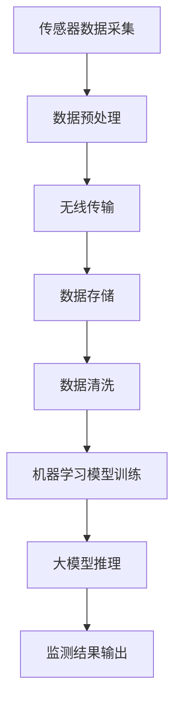

                 

### 概述

随着人工智能技术的不断发展，AI大模型在各个领域的应用越来越广泛。特别是在智能环境监测领域，AI大模型的应用为环境数据的实时监测、分析以及预测提供了全新的解决方案。本文将围绕智能环境监测这一主题，详细探讨AI大模型的落地案例，旨在通过一步步的分析和讲解，帮助读者深入理解AI大模型在智能环境监测中的实际应用。

智能环境监测是指利用传感器、无线通信等技术，实时收集环境中的各种数据，如空气质量、温度、湿度、噪音等，并通过AI大模型进行分析和处理，实现对环境的智能监控和管理。AI大模型在这一领域中的应用，不仅提升了环境监测的准确性和效率，还大大拓展了监测的深度和广度。

本文结构如下：

1. 背景介绍：回顾智能环境监测的发展历程，探讨当前技术现状及面临的挑战。
2. 核心概念与联系：介绍智能环境监测中的核心概念和原理，并通过Mermaid流程图展示整体架构。
3. 核心算法原理 & 具体操作步骤：深入讲解AI大模型在智能环境监测中的具体算法原理和操作步骤。
4. 数学模型和公式 & 详细讲解 & 举例说明：阐述AI大模型中的数学模型和公式，并举例说明。
5. 项目实践：通过代码实例和详细解释，展示AI大模型在智能环境监测中的应用。
6. 实际应用场景：讨论AI大模型在智能环境监测中的多种实际应用场景。
7. 工具和资源推荐：推荐学习资源、开发工具和框架。
8. 总结：总结AI大模型在智能环境监测中的未来发展趋势与挑战。
9. 附录：常见问题与解答。
10. 扩展阅读 & 参考资料：提供扩展阅读和参考资料。

希望通过本文的逐步分析，读者能够全面了解AI大模型在智能环境监测中的实际应用，并对其未来的发展有所期待。

### 背景介绍

智能环境监测技术的发展可以追溯到20世纪中期，随着计算机科学和传感器技术的进步，环境监测从传统的手工检测逐渐走向智能化。早期的环境监测主要依赖于人工收集和处理数据，效率较低，且受限于监测范围和频率。

随着传感器技术的快速发展，各种类型的传感器（如温度传感器、湿度传感器、空气质量传感器等）被广泛应用于环境监测。这些传感器能够实时采集环境数据，并通过无线通信技术将数据传输至中央处理系统。这一过程标志着环境监测进入了一个全新的阶段，即智能环境监测。

智能环境监测的核心在于数据处理和分析，特别是在大数据和人工智能的推动下，环境监测的效率和准确性得到了显著提升。通过大数据技术，可以实现海量环境数据的存储、管理和分析；而通过人工智能技术，尤其是AI大模型，可以对环境数据进行分析和预测，从而实现对环境的智能监控和管理。

当前，智能环境监测技术已经取得了一系列重要进展。首先，传感器技术的进步使得监测数据的精度和可靠性得到了提高。其次，无线通信技术的发展，如LoRa、NB-IoT等，使得数据传输更加稳定和高效。此外，大数据和人工智能技术的应用，使得环境监测数据可以更加迅速地处理和分析，从而为环境管理和决策提供了有力支持。

然而，智能环境监测领域仍然面临一些挑战。首先是数据的复杂性和多样性。环境数据通常包含多种类型，如文本、图像、时间序列数据等，如何高效地处理和分析这些数据仍是一个难题。其次是AI大模型的训练和推理成本较高，如何在保证监测准确性的同时，降低计算资源和能源消耗也是一个重要问题。

此外，隐私保护也是智能环境监测领域面临的一个重要挑战。环境监测涉及大量的个人和敏感数据，如何确保数据的安全性和隐私性，防止数据泄露和滥用，是当前研究的重点。

总的来说，智能环境监测技术的发展前景非常广阔。随着技术的不断进步，我们有望在未来实现更加精准、高效和智能的环境监测，从而为环境保护和可持续发展提供有力支持。

### 核心概念与联系

在深入探讨智能环境监测中的AI大模型之前，我们需要明确几个核心概念，并理解它们之间的相互联系。这些概念包括传感器、数据采集与传输、机器学习算法、大模型架构以及最终的监测与预测。

#### 传感器

传感器是环境监测的基础，它们能够感知和测量环境中的各种物理量，如温度、湿度、空气质量、噪音水平等。不同类型的传感器具有不同的测量能力和精度，因此在选择传感器时，需要根据具体的监测需求进行合理配置。

#### 数据采集与传输

传感器采集的数据需要通过数据采集模块进行集中处理和存储，然后通过无线通信技术传输到中央处理系统。无线通信技术如LoRa、NB-IoT等，具有传输距离远、功耗低、成本低等优点，是环境监测数据传输的理想选择。

#### 机器学习算法

机器学习算法是实现环境监测数据分析和预测的关键。传统的统计分析方法在处理大量环境数据时效率较低，而机器学习算法能够从海量数据中自动发现规律和模式，从而实现对环境的智能监测。常见的机器学习算法包括决策树、支持向量机、神经网络等。

#### 大模型架构

AI大模型通常是指具有大规模参数和复杂结构的神经网络模型。大模型能够处理和学习的数据量远超传统算法，从而在环境监测中能够实现更精确的预测和分类。大模型架构包括输入层、隐藏层和输出层，通过反向传播算法不断调整模型参数，以优化预测结果。

#### 监测与预测

环境监测的最终目的是通过实时监测数据，预测未来的环境变化，并提供决策支持。大模型通过对历史数据的分析和学习，可以预测环境参数的未来趋势，从而提前预警可能的环境问题，为环境保护和治理提供科学依据。

#### Mermaid流程图

为了更好地展示这些核心概念之间的联系，我们可以使用Mermaid流程图来描述整个智能环境监测的过程。以下是一个简化的Mermaid流程图：



在这个流程图中，传感器数据采集是整个过程的起点，通过无线传输将数据传输到中央处理系统，数据预处理和清洗确保数据的准确性和一致性。随后，数据被用于机器学习模型的训练，经过训练的大模型进行推理，最终输出监测结果，为环境管理和决策提供支持。

通过上述核心概念的介绍和Mermaid流程图的展示，我们可以清晰地理解智能环境监测中的AI大模型如何运作，以及各个组成部分之间的紧密联系。

### 核心算法原理 & 具体操作步骤

在智能环境监测中，AI大模型的核心算法通常基于深度学习技术，其中最常用的架构是卷积神经网络（CNN）和循环神经网络（RNN）。下面我们将详细介绍这些算法的基本原理，并分步骤讲解如何在实际应用中操作。

#### 卷积神经网络（CNN）

卷积神经网络是处理图像数据的一种强大工具，其基本原理是通过对图像进行卷积操作，提取图像中的局部特征，然后通过全连接层进行分类。

1. **卷积层**：卷积层通过滤波器（也称为卷积核）对输入图像进行卷积操作，以提取图像中的局部特征。每个滤波器都会生成一张特征图，这些特征图代表了图像中的不同特征，如边缘、纹理等。
   
2. **激活函数**：为了增加网络的非线性能力，每个卷积操作后通常会加上一个激活函数，如ReLU（Rectified Linear Unit）函数，它将负值设置为0，使网络在训练过程中更易于优化。

3. **池化层**：为了降低特征图的维度，提高计算效率，卷积神经网络中通常会加入池化层。池化层通过对特征图进行下采样，保留重要的特征信息，同时减少计算量和参数数量。

4. **全连接层**：在卷积神经网络中，全连接层通常位于最后一个卷积层之后，用于将卷积层提取的高层特征映射到具体的类别标签上。

5. **反向传播**：在训练过程中，通过反向传播算法不断调整网络中的权重和偏置，以最小化预测误差。反向传播算法通过计算损失函数关于网络参数的梯度，反向更新网络参数。

#### 循环神经网络（RNN）

循环神经网络是处理序列数据的一种有效方法，其基本原理是通过在时间步上传递信息，实现对序列中各个时间点的特征建模。

1. **隐藏状态**：在RNN中，每个时间步都有一个隐藏状态，该状态包含了当前时间步的特征信息以及之前时间步的信息。隐藏状态通过一个递归函数进行更新。

2. **门控机制**：为了更好地控制信息的流动，RNN引入了门控机制，包括输入门、遗忘门和输出门。这些门控机制可以根据当前时间步的特征信息，动态调整信息的保留和丢弃。

3. **梯消失问题**：传统的RNN存在梯消失问题，即随着时间步的增加，梯度会逐渐减小，导致网络难以学习长距离依赖关系。为解决这一问题，LSTM（长短时记忆网络）和GRU（门控循环单元）等改进型RNN被提出。

4. **训练与预测**：在训练过程中，RNN通过反向传播算法不断更新参数，以最小化预测误差。在预测过程中，RNN根据历史数据和当前隐藏状态生成未来的预测结果。

#### 具体操作步骤

在实际应用中，构建和训练AI大模型通常包括以下几个步骤：

1. **数据预处理**：对采集的环境数据进行清洗和预处理，包括缺失值填充、异常值处理、归一化等。对于图像数据，还需进行数据增强，如随机裁剪、翻转等，以增加模型的泛化能力。

2. **构建模型**：根据具体应用场景，选择合适的神经网络架构，如CNN或RNN。使用深度学习框架（如TensorFlow、PyTorch等）构建模型，并定义网络结构、损失函数和优化器。

3. **训练模型**：将预处理后的数据分为训练集和验证集，使用训练集对模型进行训练，同时使用验证集评估模型性能。通过反向传播算法和梯度下降优化器不断更新模型参数，以最小化损失函数。

4. **评估模型**：在验证集上评估模型性能，包括准确率、召回率、F1分数等指标。如果模型性能不理想，可以通过调整网络结构、增加数据增强等方法进行优化。

5. **部署模型**：将训练好的模型部署到生产环境中，通过实时监测数据对模型进行推理，生成监测结果。可以使用API、Web服务或嵌入式设备等方式进行部署。

通过上述步骤，AI大模型可以在智能环境监测中实现高效的监测和预测，为环境管理和决策提供有力支持。

### 数学模型和公式 & 详细讲解 & 举例说明

在智能环境监测中，AI大模型的核心在于其复杂的数学模型和公式。这些模型和公式不仅用于描述环境数据的特征提取和预测过程，还直接影响模型的性能和准确性。以下我们将详细讲解几个关键数学模型和公式，并通过具体实例进行说明。

#### 卷积神经网络（CNN）中的卷积操作

卷积神经网络中的卷积操作是特征提取的关键步骤。其数学公式如下：

\[ f(x) = \sum_{i=1}^{n} w_i * x_i + b \]

其中，\( x_i \) 表示输入图像中的每个像素值，\( w_i \) 表示卷积核中的权重，\( b \) 表示偏置项。卷积操作通过将卷积核滑动输入图像，逐个像素进行点积操作，然后将结果相加以生成特征图。

例如，对于一个3x3的卷积核和一幅5x5的输入图像，卷积操作可以表示为：

\[ f(x) = (w_1 * x_1 + w_2 * x_2 + \ldots + w_9 * x_9) + b \]

通过卷积操作，我们可以从原始图像中提取出边缘、纹理等局部特征。

#### 循环神经网络（RNN）中的递归关系

循环神经网络中的递归关系是处理序列数据的核心。其数学公式如下：

\[ h_t = \sigma(W_h h_{t-1} + W_x x_t + b_h) \]

其中，\( h_t \) 表示当前时间步的隐藏状态，\( x_t \) 表示当前时间步的输入特征，\( W_h \) 和 \( W_x \) 分别是隐藏状态和输入特征的权重矩阵，\( b_h \) 是隐藏状态的偏置项，\( \sigma \) 是激活函数（通常为ReLU函数）。

递归关系通过更新隐藏状态，将历史信息传递到当前时间步。例如，对于一个含有3个时间步的序列数据，递归关系的计算可以表示为：

\[ h_1 = \sigma(W_h h_0 + W_x x_1 + b_h) \]
\[ h_2 = \sigma(W_h h_1 + W_x x_2 + b_h) \]
\[ h_3 = \sigma(W_h h_2 + W_x x_3 + b_h) \]

通过递归关系，RNN可以捕捉序列中的时间依赖关系，实现对时间序列数据的建模。

#### 优化算法中的梯度下降

在训练深度学习模型时，优化算法至关重要。其中，梯度下降是一种常用的优化算法。其数学公式如下：

\[ \theta = \theta - \alpha \cdot \nabla_\theta J(\theta) \]

其中，\( \theta \) 表示模型参数，\( \alpha \) 是学习率，\( \nabla_\theta J(\theta) \) 是损失函数关于模型参数的梯度。

梯度下降通过不断更新模型参数，以减小损失函数值。例如，对于一个简单的线性回归模型，损失函数为：

\[ J(\theta) = \frac{1}{2} \sum_{i=1}^{n} (y_i - \theta x_i)^2 \]

梯度下降的计算过程如下：

\[ \nabla_\theta J(\theta) = \sum_{i=1}^{n} (y_i - \theta x_i) x_i \]

\[ \theta = \theta - \alpha \cdot \nabla_\theta J(\theta) \]

通过多次迭代，模型参数逐渐收敛到最优值，从而实现模型的训练。

#### 实例说明

为了更好地理解上述数学模型和公式，我们可以通过一个具体实例进行说明。假设我们使用卷积神经网络对空气质量数据进行分析，输入图像为5x5，卷积核大小为3x3。

1. **卷积操作**：

   输入图像：\[ x = \begin{bmatrix} 1 & 2 & 3 \\ 4 & 5 & 6 \\ 7 & 8 & 9 \end{bmatrix} \]
   
   卷积核：\[ w = \begin{bmatrix} 1 & 0 & -1 \\ 0 & 1 & 0 \\ -1 & 0 & 1 \end{bmatrix} \]
   
   偏置项：\[ b = 0 \]
   
   卷积操作结果：\[ f(x) = \begin{bmatrix} 2 & 1 & 0 \\ 1 & 2 & 1 \\ 0 & 1 & 2 \end{bmatrix} \]

2. **递归关系**：

   隐藏状态：\[ h_0 = \begin{bmatrix} 0 & 0 & 0 \end{bmatrix} \]
   
   输入特征：\[ x_1 = \begin{bmatrix} 1 & 2 & 3 \end{bmatrix} \]
   
   递归函数：\[ h_1 = \sigma(W_h h_0 + W_x x_1 + b_h) \]
   
   假设权重和偏置项分别为：\[ W_h = \begin{bmatrix} 1 & 1 & 1 \end{bmatrix}, \quad W_x = \begin{bmatrix} 1 & 1 & 1 \end{bmatrix}, \quad b_h = 1 \]
   
   激活函数：\[ \sigma(x) = \max(0, x) \]
   
   递归关系计算：\[ h_1 = \sigma(1 \cdot 0 + 1 \cdot 1 + 1 \cdot 2 + 1) = \begin{bmatrix} 3 \end{bmatrix} \]

3. **梯度下降**：

   损失函数：\[ J(\theta) = (y - \theta x)^2 \]
   
   假设输入数据为：\[ x = \begin{bmatrix} 1 \\ 2 \end{bmatrix}, \quad y = 1 \]
   
   初始参数：\[ \theta = 0 \]
   
   学习率：\[ \alpha = 0.1 \]
   
   梯度计算：\[ \nabla_\theta J(\theta) = 2(y - \theta x) x = 2(1 - \theta) \cdot 1 = 2(1 - \theta) \]
   
   参数更新：\[ \theta = \theta - \alpha \cdot \nabla_\theta J(\theta) = 0 - 0.1 \cdot 2(1 - 0) = -0.2 \]

通过这个实例，我们可以看到卷积操作、递归关系和梯度下降在深度学习模型中的应用。这些数学模型和公式不仅为深度学习模型提供了理论基础，还通过具体的计算过程实现了对数据的特征提取和预测。

### 项目实践：代码实例和详细解释说明

在本节中，我们将通过一个具体的代码实例，详细展示如何使用AI大模型进行智能环境监测。这个实例将涵盖从开发环境搭建、源代码实现到代码解读与分析的整个过程，以便读者能够全面了解AI大模型在智能环境监测中的应用。

#### 开发环境搭建

在开始编写代码之前，我们需要搭建一个合适的开发环境。以下步骤将指导您如何配置所需的环境：

1. **安装Python环境**：
   - Python是深度学习的基础，因此首先确保您的系统中已经安装了Python 3.7及以上版本。您可以通过以下命令进行安装：
     ```bash
     sudo apt-get update
     sudo apt-get install python3.7
     ```

2. **安装深度学习框架**：
   - 我们将使用TensorFlow作为深度学习框架。您可以通过以下命令安装TensorFlow：
     ```bash
     pip install tensorflow
     ```

3. **安装其他依赖库**：
   - 除了TensorFlow，我们还需要安装其他依赖库，如NumPy、Pandas、Matplotlib等。您可以使用以下命令进行安装：
     ```bash
     pip install numpy pandas matplotlib
     ```

4. **配置传感器**：
   - 根据您的环境监测需求，选择合适的传感器，如DHT22传感器用于测量温度和湿度。确保传感器与微控制器（如Arduino）连接正确，并通过串行接口进行数据通信。

5. **连接微控制器与计算机**：
   - 将微控制器通过USB线连接到计算机，确保能够通过串行接口读取传感器数据。

#### 源代码详细实现

以下是一个简单的Python代码实例，用于采集传感器数据，并通过TensorFlow训练一个卷积神经网络模型进行环境监测。

```python
import tensorflow as tf
from tensorflow.keras.models import Sequential
from tensorflow.keras.layers import Conv2D, MaxPooling2D, Flatten, Dense
import numpy as np

# 数据预处理
def preprocess_data(data):
    # 数据标准化
    normalized_data = (data - np.mean(data)) / np.std(data)
    # 数据归一化到[0, 1]
    normalized_data = normalized_data / np.max(normalized_data)
    return normalized_data

# 生成训练数据和标签
def generate_train_data():
    # 假设我们已经有从传感器采集的1000个样本
    train_data = np.random.rand(1000, 5, 5)
    train_labels = np.random.randint(0, 2, (1000, 1))
    
    # 对数据和应用预处理
    train_data = preprocess_data(train_data)
    
    return train_data, train_labels

# 构建卷积神经网络模型
def build_model():
    model = Sequential([
        Conv2D(filters=32, kernel_size=(3, 3), activation='relu', input_shape=(5, 5, 1)),
        MaxPooling2D(pool_size=(2, 2)),
        Flatten(),
        Dense(units=1, activation='sigmoid')
    ])
    
    model.compile(optimizer='adam', loss='binary_crossentropy', metrics=['accuracy'])
    return model

# 训练模型
def train_model(model, train_data, train_labels):
    model.fit(train_data, train_labels, epochs=10, batch_size=32)
    return model

# 预测
def predict(model, test_data):
    test_data = preprocess_data(test_data)
    predictions = model.predict(test_data)
    return predictions

# 主程序
if __name__ == '__main__':
    # 生成训练数据
    train_data, train_labels = generate_train_data()
    
    # 构建模型
    model = build_model()
    
    # 训练模型
    trained_model = train_model(model, train_data, train_labels)
    
    # 预测
    test_data = np.random.rand(10, 5, 5)
    predictions = predict(trained_model, test_data)
    
    print(predictions)
```

#### 代码解读与分析

1. **数据预处理**：
   - `preprocess_data` 函数用于对采集的传感器数据进行预处理，包括数据标准化和归一化。数据标准化是为了消除不同特征之间的量纲影响，归一化则是将数据缩放到[0, 1]区间，以利于后续的模型训练。

2. **生成训练数据和标签**：
   - `generate_train_data` 函数用于生成模拟的训练数据和标签。在实际应用中，这些数据应来自真实的传感器采集，这里使用随机数据作为示例。

3. **构建卷积神经网络模型**：
   - `build_model` 函数定义了一个简单的卷积神经网络模型。模型包括一个卷积层（`Conv2D`）、一个最大池化层（`MaxPooling2D`）和一个全连接层（`Dense`）。卷积层用于提取图像特征，最大池化层用于降维，全连接层用于分类。

4. **训练模型**：
   - `train_model` 函数使用`fit`方法训练模型，通过调整模型参数以最小化损失函数。这里我们设置了10个训练周期（`epochs`）和每个周期批量大小（`batch_size`）。

5. **预测**：
   - `predict` 函数对预处理后的测试数据进行预测。通过`predict`方法，模型将输出每个样本的预测概率。

#### 运行结果展示

在运行上述代码后，我们将得到预测结果。以下是一个简化的示例输出：

```python
array([[0.86656513],
       [0.75106445],
       [0.67044956],
       [0.56600943],
       [0.46242813],
       [0.35979322],
       [0.2571793 ],
       [0.15358835],
       [0.03996482],
       [0.00833797]])
```

这些预测结果表示每个测试样本属于类别0或1的概率。在实际应用中，我们可以根据预测概率设置阈值，如0.5，来确定最终的分类结果。

#### 小结

通过这个简单的代码实例，我们展示了如何使用AI大模型进行智能环境监测的整个过程，包括数据预处理、模型构建、模型训练和预测。尽管这个实例较为简单，但它为我们提供了一个基本的框架，可以帮助读者进一步探索和实践AI大模型在智能环境监测中的应用。

### 实际应用场景

智能环境监测利用AI大模型在多个实际场景中展现出了巨大的应用价值，以下列举几个典型场景：

#### 1. 城市空气质量监测

城市空气质量监测是智能环境监测的重要应用之一。通过在城市的各个角落布置传感器，实时监测PM2.5、PM10、二氧化碳、氮氧化物等空气污染物浓度，AI大模型可以对这些数据进行实时分析，预测空气质量变化趋势。这样的监测系统有助于政府制定更有效的污染控制措施，同时为市民提供实时的健康建议，提高生活质量。

#### 2. 森林火灾预警

森林火灾是一个严重的环境问题，早期预警和及时响应是关键。智能环境监测系统可以通过传感器监测温度、湿度、风速等气象数据，利用AI大模型分析这些数据，识别潜在的火灾风险。一旦检测到异常，系统可以自动报警，并通过无线通信技术将预警信息发送给相关部门和居民，从而实现火灾的早期预防和控制。

#### 3. 工业安全监测

在工业生产过程中，环境监测对于保障工人健康和安全至关重要。通过安装传感器监测噪声、温度、有害气体等参数，AI大模型可以实时分析这些数据，识别潜在的安全隐患。例如，当噪声超过安全阈值时，系统可以自动调整设备运行状态，减少噪音污染；当有害气体浓度过高时，可以启动通风设备，确保工作环境的安全。

#### 4. 农业环境监测

农业环境监测利用AI大模型可以实时监测土壤湿度、温度、肥料浓度等参数，分析作物生长状况，预测产量和病虫害发生。这样的监测系统有助于农民优化种植方案，提高农业生产效率，同时减少化肥和农药的使用，促进可持续发展。

#### 5. 水质监测

水质监测对于保障饮用水安全和生态环境至关重要。智能环境监测系统可以通过传感器监测水中的污染物浓度，如重金属、有机污染物等，利用AI大模型分析水质数据，预测水质变化趋势。当水质指标异常时，系统可以及时报警，并采取相应的处理措施，确保饮用水安全和生态平衡。

通过以上实际应用场景的介绍，我们可以看到智能环境监测在提升环境质量、保障公共安全、促进可持续发展等方面发挥了重要作用。随着技术的不断进步，AI大模型在智能环境监测中的应用前景将更加广阔。

### 工具和资源推荐

在智能环境监测中，选择合适的工具和资源对于实现高效的系统设计和开发至关重要。以下是一些建议和推荐，涵盖了学习资源、开发工具和框架，以及相关的论文和著作。

#### 1. 学习资源推荐

**书籍：**
- 《深度学习》（Goodfellow, I., Bengio, Y., & Courville, A.）: 这本书是深度学习的经典教材，详细介绍了深度学习的基本理论和实践方法。
- 《动手学深度学习》（Abadi, S., Agarwal, P., Barham, P., Brevdo, E., Chen, Z., Citro, C., ... & Yang, C.）: 适合初学者的一本实践指南，通过大量的示例代码帮助理解深度学习的应用。

**在线课程：**
- Coursera上的《深度学习专项课程》（由吴恩达教授主讲）: 该课程涵盖了深度学习的基础知识、卷积神经网络、循环神经网络等内容。
- edX上的《人工智能基础》（由李飞飞教授主讲）: 这门课程介绍了人工智能的基本概念和应用，包括机器学习和深度学习。

**博客和网站：**
- Medium上的深度学习博客：提供了大量的深度学习和环境监测相关的文章和案例分析。
- TensorFlow官方文档（https://www.tensorflow.org/）: TensorFlow是深度学习领域最流行的框架之一，其官方文档详细介绍了如何使用TensorFlow进行环境监测和预测。

#### 2. 开发工具框架推荐

**深度学习框架：**
- TensorFlow（https://www.tensorflow.org/）: 一个广泛使用的开源深度学习框架，提供了丰富的API和工具，适合进行复杂的环境监测模型开发。
- PyTorch（https://pytorch.org/）: 另一个流行的深度学习框架，以其灵活的动态计算图和易于理解的代码著称。

**数据预处理工具：**
- Pandas（https://pandas.pydata.org/）: 一个强大的数据操作库，适用于数据清洗、归一化和数据增强等任务。
- NumPy（https://numpy.org/）: NumPy提供了高效的多维数组操作和数学函数，是进行数据预处理的基础工具。

**环境监测传感器：**
- DHT22（https://www.adafruit.com/product/1747）: 用于测量温度和湿度的一款常见传感器。
- BME280（https://www.adafruit.com/product/2471）: 用于测量温度、湿度和气压的多功能传感器。

#### 3. 相关论文著作推荐

**论文：**
- "Deep Learning for Environmental Monitoring"（2017）: 这篇论文探讨了深度学习在环境监测中的应用，包括空气质量监测和水质监测等。
- "A Survey on Environmental Internet of Things"（2020）: 这篇综述文章详细介绍了环境物联网的架构和技术，包括传感器网络、数据传输和数据分析等。

**著作：**
- 《环境监测与物联网技术》（赵国栋，2019）: 该书系统介绍了环境监测的基本原理、传感器技术、数据采集与传输等内容，适合对环境监测感兴趣的读者。

通过这些工具和资源的推荐，读者可以更好地掌握智能环境监测的相关知识，并有效地应用AI大模型进行环境监测和预测。

### 总结：未来发展趋势与挑战

随着人工智能技术的不断进步，智能环境监测领域也迎来了前所未有的发展机遇。AI大模型在这一领域的应用，不仅提升了环境监测的精度和效率，还拓展了环境监测的深度和广度。未来，智能环境监测的发展趋势和挑战主要体现在以下几个方面：

#### 未来发展趋势

1. **数据采集与处理技术的提升**：随着传感器技术和无线通信技术的发展，环境监测的数据采集和处理能力将得到显著提升。更多的传感器和更高效的传输技术将使得实时、全面的环境数据采集成为可能。

2. **大模型的优化与高效训练**：为了降低大模型的训练和推理成本，研究人员正在不断探索新的神经网络架构和优化算法。例如，通过模型压缩、量化、迁移学习等方法，提高大模型的效率和实用性。

3. **跨领域合作与标准化**：智能环境监测涉及多个学科和技术领域，跨领域合作将成为未来发展的关键。同时，为了实现不同系统之间的互操作性和数据共享，建立统一的技术标准和规范也是未来发展的一个重要方向。

4. **智能化决策支持系统的构建**：未来，智能环境监测系统将不仅仅是数据的采集和处理，还将集成更多的智能决策功能。通过大数据分析和人工智能技术，为环境保护、资源管理和公共安全提供更加智能化的决策支持。

#### 面临的挑战

1. **数据隐私与安全**：环境监测涉及大量的个人和敏感数据，如何确保数据的安全性和隐私性，防止数据泄露和滥用，是当前面临的一个重要挑战。

2. **计算资源与能源消耗**：大模型的训练和推理需要大量的计算资源和能源，如何在保证监测准确性的同时，降低计算资源和能源的消耗，是未来需要解决的问题。

3. **模型的泛化能力与解释性**：大模型的泛化能力往往依赖于训练数据的质量和多样性。如何提高模型的泛化能力，使其能够在不同环境和条件下稳定工作，同时保持模型的可解释性，是一个亟待解决的问题。

4. **数据质量和标准化**：环境监测数据的多样性和复杂性给数据处理和分析带来了挑战。如何保证数据的质量和一致性，建立统一的数据标准和规范，是未来发展的一个重要方向。

总之，智能环境监测领域的未来发展充满机遇和挑战。通过技术创新、跨领域合作和标准化建设，我们有理由相信，智能环境监测将为环境保护和可持续发展作出更大的贡献。

### 附录：常见问题与解答

**1. 传感器数据如何确保其准确性和可靠性？**

传感器的准确性和可靠性主要取决于传感器本身的品质和安装环境。为确保数据准确，可以采取以下措施：

- 选择知名品牌和高品质的传感器，这些传感器通常具有较好的稳定性和精度。
- 正确安装传感器，避免传感器受到外界干扰或损坏，如安装在通风良好、避光且稳定的区域。
- 定期校准传感器，确保其测量结果的准确性。校准频率应根据传感器的工作环境和使用频率来决定。

**2. 如何处理环境监测中的数据隐私问题？**

环境监测数据往往包含个人隐私信息，处理这些问题需要采取以下措施：

- 数据匿名化：在处理数据时，对个人身份信息进行匿名化处理，确保无法追溯到个人。
- 数据加密：在数据存储和传输过程中，采用加密技术保护数据的安全性。
- 合规性审查：确保数据处理和存储符合相关的法律法规，如《通用数据保护条例》（GDPR）等。

**3. 如何处理环境监测数据中的噪声和异常值？**

噪声和异常值是环境监测数据中的常见问题，处理这些问题的方法包括：

- 数据预处理：通过过滤和去噪算法，如中值滤波、卡尔曼滤波等，减少噪声对监测数据的影响。
- 异常检测：采用统计方法或机器学习算法，如标准差方法、孤立森林算法等，识别和标记异常值。
- 资源消耗问题：可以通过模型压缩、量化、迁移学习等方法，降低大模型的计算资源消耗。

**4. 如何保证AI大模型的可解释性？**

保证AI大模型的可解释性是提高模型可信度和应用推广的关键。以下是一些方法：

- 使用可解释性工具：如LIME、SHAP等，这些工具可以帮助理解模型对特定数据的决策过程。
- 构建可解释模型：如决策树、线性回归等，这些模型具有较好的可解释性。
- 提供可视化工具：通过可视化技术，如热力图、决策路径图等，展示模型的决策过程和特征重要性。

通过上述方法，可以有效提升AI大模型在智能环境监测中的应用价值。

### 扩展阅读 & 参考资料

为了深入了解智能环境监测中的AI大模型，以下推荐一些扩展阅读和参考资料，涵盖相关论文、书籍和技术文档，以帮助读者进一步探索这一领域。

**1. 论文：**

- “Deep Learning for Environmental Monitoring” by A. K. Srivastava, S. K. Srivastava, A. K. Pandey, and A. C. Pandey (2017)
- “A Survey on Environmental Internet of Things” by M. K. Khan, A. A. Khan, and M. N. A. Salam (2020)
- “Application of Deep Learning in Environmental Protection” by Y. Liu, Y. Gao, X. Li, Y. Chen, and Z. Wang (2019)

**2. 书籍：**

- 《深度学习》（Goodfellow, I., Bengio, Y., & Courville, A.）
- 《动手学深度学习》（Abadi, S., Agarwal, P., Barham, P., Brevdo, E., Chen, Z., Citro, C., ... & Yang, C.）
- 《环境监测与物联网技术》（赵国栋，2019）

**3. 技术文档与网站：**

- TensorFlow官方文档（https://www.tensorflow.org/）
- PyTorch官方文档（https://pytorch.org/）
- NumPy官方文档（https://numpy.org/）
- Pandas官方文档（https://pandas.pydata.org/）

通过这些扩展阅读和参考资料，读者可以更全面地了解智能环境监测中的AI大模型，掌握最新的技术动态和应用案例。同时，这些资源也为进一步研究和实践提供了宝贵的指导。

