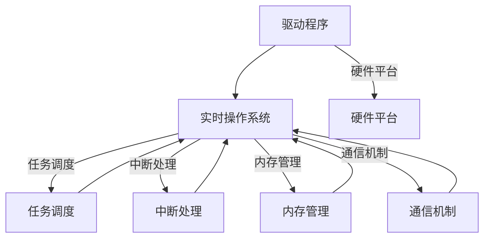

                 

### 摘要 Summary ###

本文主要围绕智能设备开发中嵌入式系统的设计与实现展开讨论。嵌入式系统是智能设备的核心组成部分，负责处理数据、执行操作和控制设备行为。文章首先介绍了嵌入式系统的发展历程和基本概念，随后深入探讨了其核心概念、算法原理、数学模型以及项目实践。通过具体实例分析，本文详细解读了嵌入式系统开发的各个环节，包括开发环境搭建、源代码实现、代码解读与分析以及运行结果展示。此外，文章还探讨了嵌入式系统在实际应用场景中的重要作用，并推荐了相关学习资源和开发工具框架。最后，文章总结了嵌入式系统开发未来发展趋势与挑战，为读者提供了进一步学习和实践的路径。

### 文章标题 Article Title ###

智能设备开发：嵌入式系统设计与实现

### 关键词 Keywords ###

智能设备，嵌入式系统，设计，实现，算法，数学模型，项目实践，应用场景，工具资源，发展趋势

### 1. 背景介绍 Introduction ###

随着科技的迅猛发展，智能设备已经逐渐渗透到我们生活的方方面面。从智能手机、平板电脑到智能家居、智能穿戴设备，嵌入式系统作为这些智能设备的核心组成部分，扮演着至关重要的角色。嵌入式系统是一种专门为特定应用设计的计算机系统，它通常具备硬件和软件的高度集成，能够以高效、低功耗的方式执行特定任务。

#### 嵌入式系统的发展历程 Development History of Embedded Systems ####

嵌入式系统的发展可以追溯到20世纪60年代，当时主要应用于军事和工业领域。早期的嵌入式系统通常基于硬件描述语言（HDL）设计，以实现特定的功能。随着微处理器技术的进步，嵌入式系统逐渐从专用的集成电路（IC）向通用处理器架构转变，使得系统设计更加灵活。

20世纪80年代，嵌入式系统开始广泛应用于消费电子产品，如游戏机、电视接收器等。90年代，随着实时操作系统（RTOS）的出现，嵌入式系统在实时性和可靠性方面的性能得到了显著提升，进一步拓展了其在工业控制、汽车电子、医疗设备等领域的应用。

进入21世纪，随着物联网（IoT）的兴起，嵌入式系统迎来了新的发展机遇。物联网通过将各种智能设备连接到互联网，实现了设备之间以及设备与互联网之间的数据交换与通信。这一趋势极大地推动了嵌入式系统的发展，使其成为智能城市、智慧农业、智能家居等领域的重要支撑技术。

#### 嵌入式系统的基本概念 Basic Concepts of Embedded Systems ####

嵌入式系统通常由以下几个关键组成部分构成：

1. **硬件平台**：包括处理器、存储器、输入输出接口等硬件组件，负责实现系统的物理功能。
2. **固件**：通常是指嵌入式系统的操作系统或其他底层软件，用于管理和控制硬件资源，提供基本的系统服务。
3. **软件应用**：是嵌入式系统中的应用程序，根据设备的具体需求进行设计和开发，实现特定的功能。
4. **中间件**：是一种介于操作系统和应用软件之间的软件层，提供跨硬件平台的通用服务，如通信、存储、安全等。

嵌入式系统具有以下几个主要特点：

1. **实时性**：嵌入式系统通常需要在特定的时间内完成特定任务，即具有实时处理能力。
2. **资源受限**：嵌入式系统通常运行在资源受限的环境中，如处理器速度、存储空间、功耗等。
3. **高可靠性**：由于嵌入式系统通常应用于关键领域，如医疗设备、汽车控制系统等，因此对系统的可靠性和安全性要求非常高。
4. **定制化**：嵌入式系统根据具体应用需求进行设计和开发，具有很强的定制化特点。

#### 嵌入式系统的分类 Classification of Embedded Systems ####

根据应用场景和功能特点，嵌入式系统可以大致分为以下几类：

1. **消费电子产品**：如智能手机、平板电脑、智能电视等，主要面向个人用户。
2. **工业控制**：如工业机器人、自动化生产线、智能工厂等，主要用于工业生产过程控制。
3. **汽车电子**：如车载导航系统、自动驾驶系统、车联网等，主要用于汽车的安全和舒适性。
4. **医疗设备**：如医疗监护仪、手术机器人、健康管理系统等，主要用于医疗诊断和治疗。
5. **智能家居**：如智能门锁、智能灯光、智能温控等，主要用于家庭生活自动化。

综上所述，嵌入式系统作为智能设备的重要组成部分，其发展历程、基本概念、特点以及分类为我们了解智能设备开发提供了重要基础。在接下来的章节中，我们将深入探讨嵌入式系统的设计与实现，帮助读者更好地掌握这一关键技术。

### 2. 核心概念与联系 Core Concepts and Connections ###

在嵌入式系统设计与实现过程中，理解其核心概念与相关联系至关重要。这不仅有助于我们掌握系统的整体架构，还能够提高开发效率，确保系统的稳定性和可靠性。

#### 核心概念 Core Concepts ####

**1. 实时操作系统（RTOS）**

实时操作系统是嵌入式系统设计中至关重要的组成部分，它负责管理硬件资源、调度任务、处理中断，并提供定时和同步机制。RTOS的主要特点是实时性，即系统能够在规定的时间内完成特定任务。

**2. 驱动程序（Drivers）**

驱动程序是嵌入式系统中连接硬件与操作系统的关键软件，它负责硬件设备的管理和控制。驱动程序通常根据硬件平台的不同而定制开发，是实现硬件功能的基础。

**3. 任务调度（Task Scheduling）**

任务调度是RTOS的核心功能之一，它负责根据任务的优先级、截止时间等因素，合理安排任务的执行顺序。常见的调度算法有优先级调度、轮转调度、最短任务首先调度等。

**4. 内存管理（Memory Management）**

内存管理是嵌入式系统设计中一个重要的环节，它负责内存的分配和释放，确保系统资源的合理利用。嵌入式系统的内存管理通常采用固定分配方式，如静态内存分配或动态内存分配。

**5. 中断处理（Interrupt Handling）**

中断处理是嵌入式系统中实现实时性和响应速度的关键技术。当外部事件发生时，硬件会触发中断信号，RTOS的中断处理机制会暂停当前任务，转而处理中断事件。

**6. 通信机制（Communication Mechanisms）**

嵌入式系统中的通信机制主要包括共享内存、消息队列、信号量、互斥锁等，它们用于实现任务间或系统间的数据交换和同步。这些机制是嵌入式系统中实现并发和并行处理的基础。

#### 核心概念之间的联系 Connections of Core Concepts ####

**1. 实时操作系统与任务调度**

实时操作系统通过任务调度机制，确保系统中的任务能够在规定时间内完成。任务调度算法的选择直接影响系统的实时性和响应速度。RTOS中的任务调度通常依赖于任务的优先级、截止时间等参数。

**2. 驱动程序与硬件平台**

驱动程序是嵌入式系统中连接硬件与操作系统的桥梁，不同的硬件平台需要不同的驱动程序。硬件平台的变化会影响系统的性能和功能，因此驱动程序的设计和优化至关重要。

**3. 内存管理与其他概念**

内存管理是嵌入式系统中资源管理的重要环节，它与任务调度、中断处理等概念密切相关。合理的内存管理策略可以提高系统的资源利用率，降低内存泄漏和碎片化风险。

**4. 中断处理与实时性**

中断处理是嵌入式系统中实现实时性的关键技术。通过中断机制，RTOS可以在硬件触发中断时，立即暂停当前任务，转而处理中断事件。中断处理的速度和效率直接影响系统的实时性。

**5. 通信机制与并发处理**

嵌入式系统中的通信机制，如共享内存、消息队列等，是实现并发处理和任务间数据交换的基础。合理的通信机制设计可以提高系统的并发性能，确保任务之间的协调和同步。

#### Mermaid 流程图 Mermaid Flowchart ####

为了更清晰地展示嵌入式系统的核心概念及其联系，我们可以使用Mermaid流程图进行描述。以下是一个简单的Mermaid流程图，展示了核心概念之间的基本关系：



通过以上核心概念及其联系的介绍，我们可以对嵌入式系统的设计与实现有一个初步的了解。在接下来的章节中，我们将进一步探讨嵌入式系统的算法原理、数学模型以及项目实践，帮助读者更深入地掌握这一关键领域。

### 3. 核心算法原理 & 具体操作步骤 Core Algorithm Principles & Operational Steps ###

在嵌入式系统设计与实现过程中，核心算法的选择和实现是关键的一环。嵌入式系统的特点决定了其算法必须在保证功能完整性的同时，还要考虑资源利用率和执行效率。本节将详细介绍几种常用的核心算法原理，以及它们在实际操作中的具体步骤。

#### 3.1 算法概述 Overview of Algorithms ####

嵌入式系统中的核心算法主要包括以下几类：

1. **实时调度算法**：用于管理任务的执行顺序和资源分配，确保系统在实时约束下完成各种任务。
2. **数据压缩与解压缩算法**：用于在有限存储空间内高效存储和传输数据。
3. **加密与解密算法**：用于保障数据的安全性和完整性。
4. **滤波与信号处理算法**：用于对采集到的信号进行预处理，提取有用信息。

#### 3.2 实时调度算法 Real-Time Scheduling Algorithms ####

实时调度算法是嵌入式系统设计中的核心，常见的调度算法有：

1. **优先级调度（Priority Scheduling）**
2. **轮转调度（Round-Robin Scheduling）**
3. **最短任务首先调度（Shortest Job First, SJF）**
4. **最早截止时间优先调度（Earliest Deadline First, EDF）**

**优先级调度（Priority Scheduling）**

优先级调度是一种基于任务优先级进行调度的算法。任务的优先级通常由其重要性和紧迫性决定。调度器根据任务的优先级选择下一个执行的任务。

**具体操作步骤：**

1. 初始化：任务初始化时，设定每个任务的优先级。
2. 调度：调度器根据任务的优先级选择最高优先级的任务进行执行。
3. 执行：执行选中任务，直到该任务完成或被中断。
4. 中断处理：当高优先级任务被更高优先级任务中断时，调度器重新选择最高优先级任务执行。

**轮转调度（Round-Robin Scheduling）**

轮转调度是一种公平的调度算法，每个任务在一段时间片内轮流执行。时间片通常较短，以确保所有任务都能获得公平的执行机会。

**具体操作步骤：**

1. 初始化：设置每个任务的时间片长度。
2. 调度：调度器将任务按顺序放入就绪队列，每个任务按时间片轮流执行。
3. 执行：任务在时间片内执行，直到时间片用尽或任务完成。
4. 时间片管理：当任务的时间片用尽时，调度器将其移出执行队列，并放入就绪队列的末尾。

**最短任务首先调度（Shortest Job First, SJF）**

最短任务首先调度是一种基于任务执行时间进行调度的算法。调度器总是选择执行时间最短的任务进行执行，以减少平均等待时间。

**具体操作步骤：**

1. 初始化：任务初始化时，设定每个任务的执行时间。
2. 调度：调度器根据任务的执行时间选择最短任务的执行。
3. 执行：执行选中任务，直到该任务完成或被中断。
4. 中断处理：当高优先级任务被更高优先级任务中断时，调度器重新选择最短任务执行。

**最早截止时间优先调度（Earliest Deadline First, EDF）**

最早截止时间优先调度是一种基于任务截止时间进行调度的算法。调度器总是选择截止时间最早的任务进行执行，以确保任务的按时完成。

**具体操作步骤：**

1. 初始化：任务初始化时，设定每个任务的截止时间。
2. 调度：调度器根据任务的截止时间选择最早任务的执行。
3. 执行：执行选中任务，直到该任务完成或被中断。
4. 中断处理：当高优先级任务被更高优先级任务中断时，调度器重新选择最早任务执行。

#### 3.3 数据压缩与解压缩算法 Data Compression and Decompression Algorithms ####

数据压缩与解压缩算法是嵌入式系统中常用的算法，用于减少数据传输和存储的空间需求。常见的压缩算法有：

1. **哈夫曼编码（Huffman Coding）**
2. **LZ77压缩算法（LZ77 Compression Algorithm）**
3. **LZ78压缩算法（LZ78 Compression Algorithm）**

**哈夫曼编码（Huffman Coding）**

哈夫曼编码是一种基于频率的压缩算法，它通过构建哈夫曼树来为每个字符生成唯一的二进制编码，高频字符的编码较短，低频字符的编码较长。

**具体操作步骤：**

1. 统计字符频率：计算每个字符在文本中的出现频率。
2. 构建哈夫曼树：根据字符频率构建哈夫曼树。
3. 生成编码：遍历哈夫曼树，为每个字符生成二进制编码。
4. 压缩数据：使用生成的编码对文本进行压缩。
5. 解压缩数据：使用哈夫曼编码表对压缩数据进行解压缩。

**LZ77压缩算法（LZ77 Compression Algorithm）**

LZ77压缩算法是一种基于局部历史数据的压缩算法，它通过查找数据中的重复序列，将重复序列映射到较短的字节索引。

**具体操作步骤：**

1. 查找重复序列：扫描数据，查找前文中的重复序列。
2. 记录偏移量：记录重复序列的起始位置和长度。
3. 替换为索引：将重复序列替换为字节索引。
4. 压缩数据：使用生成的索引对数据进行压缩。
5. 解压缩数据：使用记录的偏移量和长度对压缩数据进行解压缩。

**LZ78压缩算法（LZ78 Compression Algorithm）**

LZ78压缩算法是一种扩展的LZ77算法，它使用哈希表来存储和查找重复序列。

**具体操作步骤：**

1. 初始化哈希表：创建一个哈希表，用于存储和查找重复序列。
2. 查找重复序列：扫描数据，查找前文中的重复序列。
3. 记录编码：将重复序列的编码记录到哈希表中。
4. 替换为索引：将重复序列替换为哈希表中的索引。
5. 压缩数据：使用生成的索引对数据进行压缩。
6. 解压缩数据：使用哈希表和记录的编码对压缩数据进行解压缩。

#### 3.4 加密与解密算法 Encryption and Decryption Algorithms ####

加密与解密算法是保障数据安全性的重要手段。常见的加密算法有：

1. **对称加密算法（Symmetric Encryption Algorithms）**
2. **非对称加密算法（Asymmetric Encryption Algorithms）**
3. **哈希算法（Hash Algorithms）**

**对称加密算法（Symmetric Encryption Algorithms）**

对称加密算法使用相同的密钥进行加密和解密。常见的对称加密算法有DES、AES等。

**具体操作步骤：**

1. 密钥生成：生成一个密钥。
2. 加密：使用密钥对数据进行加密。
3. 解密：使用相同的密钥对加密数据进行解密。

**非对称加密算法（Asymmetric Encryption Algorithms）**

非对称加密算法使用一对密钥（公钥和私钥）进行加密和解密。常见的非对称加密算法有RSA、ECC等。

**具体操作步骤：**

1. 密钥生成：生成公钥和私钥。
2. 加密：使用公钥对数据进行加密。
3. 解密：使用私钥对加密数据进行解密。

**哈希算法（Hash Algorithms）**

哈希算法用于生成数据的数字指纹，常见的哈希算法有MD5、SHA-256等。

**具体操作步骤：**

1. 数据输入：输入待处理的文本数据。
2. 计算哈希值：使用哈希算法计算输入数据的哈希值。
3. 验证：使用哈希值对数据进行验证。

#### 3.5 滤波与信号处理算法 Filtering and Signal Processing Algorithms ####

滤波与信号处理算法用于对采集到的信号进行预处理，提取有用信息。常见的算法有：

1. **低通滤波器（Low-Pass Filter）**
2. **高通滤波器（High-Pass Filter）**
3. **带通滤波器（Band-Pass Filter）**
4. **傅里叶变换（Fourier Transform）**

**低通滤波器（Low-Pass Filter）**

低通滤波器用于过滤高频信号，保留低频信号。常见的低通滤波器有理想低通滤波器、巴特沃斯低通滤波器、切比雪夫低通滤波器等。

**具体操作步骤：**

1. 初始化：设置滤波器参数，如截止频率、滤波器类型等。
2. 输入信号：输入待处理的信号。
3. 滤波处理：使用滤波器对信号进行滤波。
4. 输出结果：输出滤波后的信号。

**高通滤波器（High-Pass Filter）**

高通滤波器用于过滤低频信号，保留高频信号。与低通滤波器类似，高通滤波器也有多种类型。

**具体操作步骤：**

1. 初始化：设置滤波器参数，如截止频率、滤波器类型等。
2. 输入信号：输入待处理的信号。
3. 滤波处理：使用滤波器对信号进行滤波。
4. 输出结果：输出滤波后的信号。

**带通滤波器（Band-Pass Filter）**

带通滤波器用于过滤特定频率范围的信号。与低通滤波器和高通滤波器类似，带通滤波器也有多种类型。

**具体操作步骤：**

1. 初始化：设置滤波器参数，如中心频率、带宽、滤波器类型等。
2. 输入信号：输入待处理的信号。
3. 滤波处理：使用滤波器对信号进行滤波。
4. 输出结果：输出滤波后的信号。

**傅里叶变换（Fourier Transform）**

傅里叶变换是一种将时域信号转换为频域信号的方法，常见的傅里叶变换有离散傅里叶变换（DFT）和快速傅里叶变换（FFT）。

**具体操作步骤：**

1. 输入信号：输入待处理的时域信号。
2. 计算傅里叶变换：使用DFT或FFT算法计算信号的频域表示。
3. 频域分析：对频域信号进行分析，提取有用信息。
4. 逆傅里叶变换：如果需要，使用逆傅里叶变换将频域信号转换回时域。

通过以上对核心算法原理和具体操作步骤的介绍，我们可以更好地理解嵌入式系统开发中的关键环节。在接下来的章节中，我们将进一步探讨嵌入式系统的数学模型和公式，以及实际项目中的具体应用。

### 4. 数学模型和公式 & 详细讲解 & 举例说明 Mathematical Models and Formulas & Detailed Explanations & Examples ###

在嵌入式系统开发中，数学模型和公式是理解和实现各种算法的基础。通过对数学模型和公式的详细讲解，并结合实际例子，我们可以更好地掌握这些概念，并将其应用于实际开发中。

#### 4.1 数学模型概述 Overview of Mathematical Models ####

嵌入式系统中的数学模型通常用于描述系统行为、任务调度、信号处理等方面的内容。以下是几个常见的数学模型及其应用：

1. **差分方程（Difference Equations）**：用于描述离散时间系统的动态行为。
2. **微分方程（Differential Equations）**：用于描述连续时间系统的动态行为。
3. **概率模型（Probability Models）**：用于描述系统中的随机事件和概率分布。
4. **傅里叶变换（Fourier Transform）**：用于将时域信号转换为频域信号。
5. **卡尔曼滤波（Kalman Filtering）**：用于在噪声环境中估计系统的状态。

#### 4.2 差分方程 Difference Equations ####

差分方程是一种描述离散时间系统动态行为的数学方程，通常用于嵌入式系统中的信号处理、控制算法等。

**差分方程公式：**

\[ y(n) = a_1 y(n-1) + a_2 y(n-2) + b_0 x(n) + b_1 x(n-1) \]

其中，\( y(n) \) 是系统的输出，\( x(n) \) 是系统的输入，\( a_1 \)、\( a_2 \)、\( b_0 \)、\( b_1 \) 是方程的系数。

**示例：一阶差分方程**

假设我们有一个一阶差分方程：

\[ y(n) = 0.5 y(n-1) + x(n) \]

初始条件为 \( y(0) = 1 \)，输入信号为 \( x(n) = n \)。

**解法：**

1. 根据差分方程，我们可以得到：

\[ y(n) = 0.5 y(n-1) + n \]

2. 计算前几个 \( n \) 的值：

\[ y(1) = 0.5 y(0) + 1 = 0.5 \times 1 + 1 = 1.5 \]
\[ y(2) = 0.5 y(1) + 2 = 0.5 \times 1.5 + 2 = 2.25 \]
\[ y(3) = 0.5 y(2) + 3 = 0.5 \times 2.25 + 3 = 3.125 \]

通过以上计算，我们可以得到差分方程的解。

#### 4.3 微分方程 Differential Equations ####

微分方程是一种描述连续时间系统动态行为的数学方程，通常用于控制系统的设计、信号处理等。

**微分方程公式：**

\[ \frac{dy}{dt} = a y + b x \]

其中，\( y \) 是系统的输出，\( x \) 是系统的输入，\( a \) 和 \( b \) 是方程的系数。

**示例：一阶微分方程**

假设我们有一个一阶微分方程：

\[ \frac{dy}{dt} = 2 y + t \]

初始条件为 \( y(0) = 1 \)，输入信号为 \( x(t) = t \)。

**解法：**

1. 首先分离变量：

\[ \frac{dy}{y} = (2 + t) dt \]

2. 对两边积分：

\[ \int \frac{dy}{y} = \int (2 + t) dt \]

3. 计算积分：

\[ \ln|y| = 2t + \frac{t^2}{2} + C \]

4. 求解 \( y \)：

\[ y = e^{2t + \frac{t^2}{2} + C} \]

5. 根据初始条件 \( y(0) = 1 \) 求解常数 \( C \)：

\[ 1 = e^{C} \]

\[ C = 0 \]

最终，微分方程的解为：

\[ y = e^{2t + \frac{t^2}{2}} \]

#### 4.4 概率模型 Probability Models ####

概率模型用于描述系统中的随机事件和概率分布，常见的有离散概率分布和连续概率分布。

**离散概率分布公式：**

\[ P(X = x) = \frac{1}{\sum_{i=1}^{n} P(X = x_i)} \]

其中，\( X \) 是随机变量，\( x \) 是随机变量的取值，\( P(X = x) \) 是随机变量取值 \( x \) 的概率。

**示例：二项分布**

假设我们有一个二项分布，试验次数为 \( n = 10 \)，每次试验成功的概率为 \( p = 0.5 \)。

**计算：**

1. 计算成功次数为 \( k \) 的概率：

\[ P(X = k) = C(n, k) \times p^k \times (1 - p)^{n - k} \]

2. 计算成功次数为 5 的概率：

\[ P(X = 5) = C(10, 5) \times 0.5^5 \times 0.5^5 = \frac{10!}{5! \times 5!} \times 0.5^{10} = 0.2461 \]

通过以上计算，我们可以得到二项分布中成功次数为 5 的概率。

**连续概率分布公式：**

\[ P(a < X < b) = \int_a^b f(x) dx \]

其中，\( X \) 是随机变量，\( a \) 和 \( b \) 是随机变量的取值范围，\( f(x) \) 是随机变量 \( X \) 的概率密度函数。

**示例：正态分布**

假设我们有一个均值为 \( \mu = 0 \)，标准差为 \( \sigma = 1 \) 的正态分布。

**计算：**

1. 计算区间 \( (-1, 1) \) 的概率：

\[ P(-1 < X < 1) = \int_{-1}^{1} \frac{1}{\sqrt{2\pi}} \times e^{-\frac{x^2}{2}} dx \]

2. 使用计算器或数学软件求解积分：

\[ P(-1 < X < 1) \approx 0.6827 \]

通过以上计算，我们可以得到正态分布在区间 \( (-1, 1) \) 的概率。

#### 4.5 傅里叶变换 Fourier Transform ####

傅里叶变换是一种将时域信号转换为频域信号的方法，常用于信号处理、图像处理等领域。

**傅里叶变换公式：**

\[ F(\omega) = \int_{-\infty}^{\infty} f(t) e^{-j\omega t} dt \]

其中，\( F(\omega) \) 是频域信号，\( f(t) \) 是时域信号，\( \omega \) 是频率。

**示例：矩形脉冲信号**

假设我们有一个矩形脉冲信号：

\[ f(t) = \begin{cases} 
1 & \text{if } 0 \leq t \leq 1 \\
0 & \text{otherwise}
\end{cases} \]

**计算傅里叶变换：**

1. 代入傅里叶变换公式：

\[ F(\omega) = \int_{0}^{1} e^{-j\omega t} dt \]

2. 计算积分：

\[ F(\omega) = \left[ -\frac{e^{-j\omega t}}{-j\omega} \right]_0^1 = \frac{1}{j\omega} \left( 1 - e^{-j\omega} \right) \]

通过以上计算，我们可以得到矩形脉冲信号的频域表示。

#### 4.6 卡尔曼滤波 Kalman Filtering ####

卡尔曼滤波是一种用于在噪声环境中估计系统状态的算法，广泛应用于机器人导航、信号处理等领域。

**卡尔曼滤波公式：**

\[ \begin{cases} 
x_k = A_k x_{k-1} + B_k u_k \\
z_k = C_k x_k + v_k 
\end{cases} \]

其中，\( x_k \) 是状态向量，\( u_k \) 是控制向量，\( z_k \) 是观测向量，\( A_k \)、\( B_k \)、\( C_k \) 是系统矩阵，\( v_k \) 是观测噪声。

**示例：一维卡尔曼滤波**

假设我们有一个一维卡尔曼滤波器，状态向量为 \( x_k = [x_k^1, x_k^2]^T \)，控制向量为 \( u_k = [u_k^1, u_k^2]^T \)，观测向量为 \( z_k = [z_k^1, z_k^2]^T \)。

**计算过程：**

1. 初始状态估计：

\[ x_0 = \begin{bmatrix} 
0 \\
0 
\end{bmatrix} \]

2. 状态预测：

\[ x_{k|k-1} = A_k x_{k-1|k-1} + B_k u_{k-1} \]

3. 观测预测：

\[ z_{k|k-1} = C_k x_{k|k-1} \]

4. 状态更新：

\[ P_{k|k-1} = A_k P_{k-1|k-1} A_k^T + Q_k \]
\[ K_k = P_{k|k-1} C_k^T (C_k P_{k|k-1} C_k^T + R_k)^{-1} \]
\[ x_{k|k} = x_{k|k-1} + K_k (z_k - z_{k|k-1}) \]
\[ P_{k|k} = (I - K_k C_k) P_{k|k-1} \]

通过以上步骤，我们可以使用卡尔曼滤波器估计系统状态。

通过以上对数学模型和公式的详细讲解以及实际例子的计算，我们可以更好地理解嵌入式系统开发中涉及的数学理论。在接下来的章节中，我们将进一步探讨嵌入式系统的项目实践，帮助读者将理论知识应用到实际项目中。

### 5. 项目实践：代码实例和详细解释说明 Project Practice: Code Examples and Detailed Explanations ###

在嵌入式系统开发中，理论知识虽然重要，但实际项目实践才是检验和巩固所学知识的最佳途径。本节将通过一个简单的嵌入式系统项目实例，详细讲解项目的开发环境搭建、源代码实现、代码解读与分析以及运行结果展示，帮助读者更好地理解嵌入式系统开发的全过程。

#### 5.1 开发环境搭建 Setting Up the Development Environment ####

在进行嵌入式系统开发之前，首先需要搭建合适的环境。以下是开发环境搭建的步骤：

1. **选择开发板**：根据项目需求选择合适的开发板，如STM32、Arduino等。
2. **安装开发工具**：下载并安装交叉编译工具链，如GNU Arm Embedded Toolchain、Arduino IDE等。
3. **安装集成开发环境（IDE）**：选择并安装适合的IDE，如Eclipse、Visual Studio Code等。
4. **安装调试工具**：安装调试工具，如OpenOCD、GDB等。

以STM32为例，开发环境的搭建步骤如下：

1. **选择STM32开发板**：如STM32F103C8。
2. **下载交叉编译工具链**：
   ```bash
   wget https://developer.arm.com/downloads/embedded/gnu-rm-9-2020q2/gcc-arm-none-eabi-9-2020-q2-update-linux.tar.xz
   tar -xvf gcc-arm-none-eabi-9-2020-q2-update-linux.tar.xz
   ```
3. **配置环境变量**：
   ```bash
   export PATH=$PATH:/path/to/gcc-arm-none-eabi-9-2020-q2-update/bin
   ```
4. **安装STM32CubeMX**：STM32CubeMX是一个配置和管理STM32外设的图形化工具。
5. **安装Eclipse**：下载并安装Eclipse IDE，选择C/C++开发环境。
6. **安装STM32插件**：在Eclipse中安装STM32插件，以支持STM32开发。

完成以上步骤后，开发环境搭建完成。

#### 5.2 源代码实现 Source Code Implementation ####

以一个简单的STM32嵌入式系统项目为例，实现一个LED闪烁程序。以下是源代码的详细解释：

```c
#include "stm32f1xx_hal.h"

// 初始化LED
void System_Init(void)
{
    // 配置GPIO端口
    __HAL_RCC_GPIOA_CLK_ENABLE();
    GPIO_InitTypeDef GPIO_InitStruct = {0};
    GPIO_InitStruct.Pin = GPIO_PIN_5;
    GPIO_InitStruct.Mode = GPIO_MODE_OUTPUT_PP;
    GPIO_InitStruct.Pull = GPIO_NOPULL;
    GPIO_InitStruct.Speed = GPIO_SPEED_FREQ_LOW;
    HAL_GPIO_Init(GPIOA, &GPIO_InitStruct);

    // 系统时钟初始化
    HAL_RCC_OscConfig(&RCC_OscInitStruct, HAL_RCC_OscError_Types::HAL_RCC_OscError_None);
    HAL_RCC_ClockConfig(&RCC_ClkInitStruct, HAL_RCC_ClockError_Types::HAL_RCC_ClockError_None);
    HAL_RCC_PeriphCLKConfig(&RCC_PeriphCLKInitStruct);
}

// LED闪烁主循环
int main(void)
{
    // 系统初始化
    HAL_Init();

    // 配置系统时钟
    System_Init();

    // 主循环
    while (1)
    {
        // LED开启
        HAL_GPIO_WritePin(GPIOA, GPIO_PIN_5, GPIO_PIN_SET);
        HAL_Delay(1000); // 延时1秒

        // LED关闭
        HAL_GPIO_WritePin(GPIOA, GPIO_PIN_5, GPIO_PIN_RESET);
        HAL_Delay(1000); // 延时1秒
    }
}
```

**代码解读：**

1. **头文件**：包含必要的STM32库文件。
2. **初始化函数**：`System_Init` 函数用于配置系统时钟和GPIO端口，使能PA5脚的时钟，并将PA5配置为推挽输出模式。
3. **主函数**：`main` 函数实现主循环，通过`HAL_GPIO_WritePin` 函数控制LED的亮灭，使用`HAL_Delay` 函数实现延时。

#### 5.3 代码解读与分析 Code Explanation and Analysis ####

**1. 系统初始化**

系统初始化是嵌入式系统开发中的关键步骤，包括时钟配置、GPIO端口配置等。以下是对系统初始化部分的详细解读：

- **时钟配置**：通过`HAL_RCC_OscConfig` 和 `HAL_RCC_ClockConfig` 函数配置系统时钟，确保系统时钟稳定。
- **GPIO端口配置**：通过`HAL_GPIO_Init` 函数配置GPIO端口，将PA5脚配置为推挽输出模式，准备控制LED。

**2. 主循环**

主循环是嵌入式系统程序的核心部分，负责执行系统任务。以下是对主循环的详细解读：

- **LED控制**：通过`HAL_GPIO_WritePin` 函数控制LED的亮灭，实现LED闪烁效果。
- **延时**：使用`HAL_Delay` 函数实现延时，控制LED的闪烁频率。

#### 5.4 运行结果展示 Running Results Display

完成代码编写后，通过开发板上的调试器进行调试，运行程序，观察LED的闪烁效果。以下是运行结果展示：

1. **LED初始状态**：LED灯关闭。
2. **程序运行**：LED灯闪烁，闪烁频率为每秒一次。

通过以上项目实践，我们详细讲解了嵌入式系统开发的全过程，包括开发环境搭建、源代码实现、代码解读与分析以及运行结果展示。这一实践不仅帮助读者理解嵌入式系统开发的基本流程，也为实际项目开发提供了参考。

### 6. 实际应用场景 Practical Application Scenarios ###

嵌入式系统在各个领域都有着广泛的应用，其核心价值在于其高效率、低功耗、高可靠性等特点，使得智能设备能够更加智能、便捷地服务于我们的生活和工作。以下我们将探讨嵌入式系统在几个主要实际应用场景中的具体应用。

#### 6.1 消费电子产品 Consumer Electronics ####

消费电子产品是嵌入式系统最典型的应用领域之一。智能手机、平板电脑、智能电视等设备都依赖于嵌入式系统来实现其核心功能。例如：

- **智能手机**：嵌入式系统负责处理用户输入、显示输出、网络通信等，确保手机能够高效运行各种应用程序。
- **智能电视**：嵌入式系统支持智能搜索、内容推荐、网络播放等功能，为用户提供丰富的娱乐体验。

#### 6.2 工业控制 Industrial Control ####

工业控制领域对嵌入式系统的要求更高，主要体现在实时性、可靠性和稳定性方面。以下是一些具体应用：

- **自动化生产线**：嵌入式系统通过实时监控和调度，控制各种工业设备，实现生产线的自动化运行。
- **机器人**：嵌入式系统作为机器人的“大脑”，负责路径规划、运动控制、传感器数据处理等任务。

#### 6.3 汽车电子 Automotive Electronics ####

汽车电子是嵌入式系统的重要应用领域之一，随着新能源汽车和自动驾驶技术的发展，嵌入式系统在汽车中的应用越来越广泛：

- **车载导航系统**：嵌入式系统负责处理GPS信号，提供导航信息，帮助驾驶者规划最佳路线。
- **自动驾驶系统**：嵌入式系统通过处理传感器数据，实现车辆的自动行驶、车道保持、避障等功能。

#### 6.4 医疗设备 Medical Equipment ####

医疗设备对嵌入式系统的要求非常高，特别是实时性和准确性。以下是一些具体应用：

- **医疗监护仪**：嵌入式系统实时监测病人的生命体征，如心率、血压等，为医生提供诊断依据。
- **手术机器人**：嵌入式系统通过高精度控制，协助医生进行微创手术，提高手术的成功率和安全性。

#### 6.5 智能家居 Smart Home ####

智能家居是嵌入式系统在消费电子领域的一个重要分支，通过将各种家用设备联网，实现家庭自动化：

- **智能门锁**：嵌入式系统实现门锁的自动开关，提高家庭安全性。
- **智能灯光**：嵌入式系统根据用户需求和光线强度自动调节灯光，提供舒适的照明环境。
- **智能温控**：嵌入式系统通过监测室内温度，自动调节空调等设备，保持室内温度舒适。

#### 6.6 物联网 IoT ####

物联网的兴起进一步拓展了嵌入式系统的应用范围，通过连接各种智能设备，实现数据采集、传输和分析：

- **智能城市**：嵌入式系统在智能交通、环境监测、公共安全等方面发挥作用，提高城市管理效率和居民生活质量。
- **智慧农业**：嵌入式系统通过监测土壤湿度、气温等参数，优化农业生产过程，提高农业产出。
- **智能工厂**：嵌入式系统在生产流程监控、设备维护、能源管理等方面提高生产效率和降低成本。

#### 6.7 其他应用场景 Other Application Scenarios ####

除了上述主要应用领域，嵌入式系统还在许多其他领域发挥着重要作用：

- **航空与航天**：嵌入式系统在飞机飞行控制系统、航天器控制系统中起到关键作用。
- **军事**：嵌入式系统在无人机、导弹系统、侦察设备等军事装备中应用广泛。
- **能源管理**：嵌入式系统在电力系统、能源监测等领域提高能源利用效率和安全性。

综上所述，嵌入式系统在各个实际应用场景中发挥着不可替代的作用，其技术的不断进步将进一步推动各行各业的智能化发展。

### 7. 工具和资源推荐 Tools and Resources Recommendation ###

在嵌入式系统开发过程中，选择合适的工具和资源是确保项目顺利进行的关键。以下推荐了一些常用的开发工具、学习资源和相关论文，以帮助读者更好地掌握嵌入式系统开发的相关知识。

#### 7.1 学习资源推荐 Learning Resources ####

**1. 书籍**

- **《嵌入式系统设计与开发》（Embedded Systems: Introduction to ARM Cortex-M Based Systems）**：适合初学者了解嵌入式系统的基础知识。
- **《嵌入式系统编程》（Embedded Systems: Real-Time Systems and Arm Cortex-M Processors）**：详细介绍了嵌入式系统编程的基本概念和技巧。
- **《嵌入式Linux系统开发实战》（Building Embedded Linux Systems）**：介绍了嵌入式Linux系统的构建、配置和调试方法。

**2. 在线课程**

- **Coursera上的《嵌入式系统设计与实现》**：由斯坦福大学教授授课，涵盖嵌入式系统的基本概念、设计方法和实践技巧。
- **edX上的《嵌入式系统与物联网》**：讲解了嵌入式系统的基本原理和物联网的应用，适合对物联网感兴趣的读者。

**3. 博客和网站**

- **嵌入式系统技术论坛（www.51eda.com）**：提供了丰富的嵌入式系统技术文章、讨论区和资源下载。
- **嵌入式系统开发者社区（www.oschina.net）**：中国最大的嵌入式系统开发者社区，提供嵌入式系统相关资讯和资源。

#### 7.2 开发工具框架推荐 Development Tools and Frameworks ####

**1. 开发板**

- **STM32开发板**：STM32系列开发板是市场上最常见的嵌入式开发板，适用于多种应用场景。
- **Arduino**：Arduino是一款开源的嵌入式开发板，适合初学者入门，支持多种编程语言。

**2. 集成开发环境（IDE）**

- **Eclipse**：Eclipse是一个功能强大的开源IDE，支持多种编程语言和开发板。
- **Visual Studio Code**：VS Code是一款轻量级、可扩展的IDE，支持嵌入式系统开发，包括STM32、Arduino等。

**3. 交叉编译工具链**

- **GNU Arm Embedded Toolchain**：适用于ARM架构的交叉编译工具链，支持多种开发板和操作系统。
- **IAR Embedded Workbench**：商业化的嵌入式开发工具，提供了丰富的调试功能和强大的代码优化。

#### 7.3 相关论文著作推荐 Relevant Papers and Books ####

**1. 论文**

- **"Real-Time Systems: Design Principles for Distributed Embedded Applications"**：该论文详细介绍了实时系统的设计原则和分布式应用的开发方法。
- **"Embedded System Design: A Unified Hardware/Software Approach"**：探讨了嵌入式系统的设计方法，强调了硬件和软件的整合。

**2. 著作**

- **《嵌入式系统设计：硬件/软件一体化方法》**（Embedded System Design: A Unified Hardware/Software Approach）：详细介绍了嵌入式系统的设计流程和实现方法。
- **《实时系统原理与设计》**（Principles of Real-Time Systems）：讲解了实时系统的基本原理、设计方法和应用实例。

通过以上工具和资源的推荐，读者可以更好地掌握嵌入式系统开发的相关知识，为实际项目开发提供有力的支持。

### 8. 总结：未来发展趋势与挑战 Summary: Future Trends and Challenges ###

嵌入式系统作为智能设备的核心，随着科技的不断进步，正面临着诸多新的发展机遇和挑战。以下将总结嵌入式系统在未来可能的发展趋势和面临的挑战。

#### 8.1 发展趋势 Development Trends ####

1. **物联网（IoT）的进一步发展**：物联网的快速发展推动了嵌入式系统的广泛应用。未来的物联网将更加普及和智能化，这将为嵌入式系统带来更多的应用场景和需求。

2. **边缘计算（Edge Computing）的兴起**：边缘计算将数据处理和分析从云端转移到网络边缘，使得嵌入式系统能够更快速、高效地响应实时任务。这将推动嵌入式系统性能的提升和应用的扩展。

3. **人工智能（AI）的融合**：人工智能技术的不断发展，使得嵌入式系统在图像识别、自然语言处理、智能决策等方面得到广泛应用。嵌入式系统与AI的结合将进一步提升智能设备的智能化水平。

4. **低功耗、高性能芯片的开发**：随着5G、物联网等技术的发展，对嵌入式系统的低功耗、高性能要求越来越高。未来的嵌入式系统将依赖更加先进的芯片技术，实现更高的能效比。

5. **安全性的提升**：随着嵌入式系统在各个领域的广泛应用，其安全性问题日益凸显。未来的嵌入式系统将更加注重安全性，采用更加严格的安全标准和加密技术。

6. **开源生态的不断完善**：随着开源技术的不断发展，嵌入式系统的开发将更加依赖于开源社区和生态。未来的嵌入式系统开发将更加开放、协作，推动技术的快速进步。

#### 8.2 面临的挑战 Challenges ####

1. **复杂性和多样性**：嵌入式系统应用场景的多样化，导致系统设计变得更加复杂。如何在确保系统功能的同时，简化开发和维护过程，是未来面临的挑战之一。

2. **功耗和性能的平衡**：在物联网等应用场景中，嵌入式系统需要长时间运行，因此功耗控制是一个重要问题。如何在保证性能的前提下，降低功耗，是开发过程中需要考虑的关键问题。

3. **安全威胁**：随着嵌入式系统在各个领域的应用，其安全性问题日益严重。如何有效防范恶意攻击、确保数据安全，是嵌入式系统开发者需要面对的重要挑战。

4. **资源受限**：嵌入式系统通常运行在资源受限的环境中，如处理器速度、存储空间、功耗等。如何在有限的资源下，实现高效的功能，是一个需要不断优化和改进的问题。

5. **开发和维护成本**：嵌入式系统开发过程复杂，涉及硬件、软件、测试等多个环节。如何在保证质量的前提下，降低开发和维护成本，是企业和开发者需要关注的挑战。

6. **标准化**：随着嵌入式系统应用的不断扩展，标准化问题变得愈发重要。如何制定合理的标准，确保不同系统和组件之间的兼容性和互操作性，是未来需要解决的问题。

通过以上分析，我们可以看到，嵌入式系统在未来的发展中既面临诸多机遇，也面临诸多挑战。只有不断创新和优化，才能推动嵌入式系统在智能设备中的应用和发展。

### 9. 附录：常见问题与解答 Appendix: Common Questions and Answers ###

#### 9.1 常见问题 Common Questions ####

1. **什么是嵌入式系统？**
   嵌入式系统是一种专门为特定应用设计的计算机系统，通常包含处理器、存储器、输入输出接口等硬件组件，以及固件（如实时操作系统）和软件应用，用于执行特定任务。

2. **嵌入式系统有哪些特点？**
   嵌入式系统具有实时性、资源受限、高可靠性和定制化等特点。实时性指系统能够在规定时间内完成特定任务；资源受限包括处理器速度、存储空间、功耗等；高可靠性指系统在关键应用场景中的稳定性；定制化指系统根据特定应用需求进行设计和开发。

3. **如何选择合适的嵌入式开发板？**
   选择嵌入式开发板时，需要考虑以下因素：开发板兼容性、性能、价格、支持的开发工具和资源、社区支持等。常见的开发板包括STM32、Arduino等。

4. **嵌入式系统开发需要哪些工具和资源？**
   嵌入式系统开发需要交叉编译工具链、集成开发环境（IDE）、调试工具、开发板和相关学习资源等。常用的工具包括GNU Arm Embedded Toolchain、Eclipse、Visual Studio Code等。

5. **嵌入式系统中的实时调度算法有哪些？**
   常见的实时调度算法包括优先级调度、轮转调度、最短任务首先调度（SJF）和最早截止时间优先调度（EDF）等。每种算法都有其优缺点和适用场景。

6. **什么是边缘计算？**
   边缘计算是将数据处理和分析从云端转移到网络边缘的一种计算模式。通过在边缘节点进行数据处理，可以降低延迟、减少带宽需求，提高系统的实时性和响应速度。

7. **嵌入式系统中的数据压缩算法有哪些？**
   常见的数据压缩算法包括哈夫曼编码、LZ77压缩算法、LZ78压缩算法等。这些算法通过减少数据传输和存储的空间需求，提高系统的性能。

8. **什么是加密与解密算法？**
   加密与解密算法是用于保护数据安全的技术。加密算法将明文数据转换为密文，而解密算法将密文转换回明文。常见的加密算法包括对称加密算法（如AES、DES）和非对称加密算法（如RSA）。

9. **什么是滤波与信号处理算法？**
   滤波与信号处理算法用于对采集到的信号进行预处理，提取有用信息。常见的算法包括低通滤波器、高通滤波器、带通滤波器和傅里叶变换等。

#### 9.2 解答 Answers ####

1. **什么是嵌入式系统？**
   嵌入式系统是一种专门为特定应用设计的计算机系统，通常包含处理器、存储器、输入输出接口等硬件组件，以及固件（如实时操作系统）和软件应用，用于执行特定任务。

2. **嵌入式系统有哪些特点？**
   嵌入式系统具有实时性、资源受限、高可靠性和定制化等特点。实时性指系统能够在规定时间内完成特定任务；资源受限包括处理器速度、存储空间、功耗等；高可靠性指系统在关键应用场景中的稳定性；定制化指系统根据特定应用需求进行设计和开发。

3. **如何选择合适的嵌入式开发板？**
   选择嵌入式开发板时，需要考虑以下因素：开发板兼容性、性能、价格、支持的开发工具和资源、社区支持等。常见的开发板包括STM32、Arduino等。

4. **嵌入式系统开发需要哪些工具和资源？**
   嵌入式系统开发需要交叉编译工具链、集成开发环境（IDE）、调试工具、开发板和相关学习资源等。常用的工具包括GNU Arm Embedded Toolchain、Eclipse、Visual Studio Code等。

5. **嵌入式系统中的实时调度算法有哪些？**
   常见的实时调度算法包括优先级调度、轮转调度、最短任务首先调度（SJF）和最早截止时间优先调度（EDF）等。每种算法都有其优缺点和适用场景。

6. **什么是边缘计算？**
   边缘计算是将数据处理和分析从云端转移到网络边缘的一种计算模式。通过在边缘节点进行数据处理，可以降低延迟、减少带宽需求，提高系统的实时性和响应速度。

7. **嵌入式系统中的数据压缩算法有哪些？**
   常见的数据压缩算法包括哈夫曼编码、LZ77压缩算法、LZ78压缩算法等。这些算法通过减少数据传输和存储的空间需求，提高系统的性能。

8. **什么是加密与解密算法？**
   加密与解密算法是用于保护数据安全的技术。加密算法将明文数据转换为密文，而解密算法将密文转换回明文。常见的加密算法包括对称加密算法（如AES、DES）和非对称加密算法（如RSA）。

9. **什么是滤波与信号处理算法？**
   滤波与信号处理算法用于对采集到的信号进行预处理，提取有用信息。常见的算法包括低通滤波器、高通滤波器、带通滤波器和傅里叶变换等。

通过以上常见问题与解答，读者可以更清晰地了解嵌入式系统的相关知识和应用。在学习和实践中，遇到问题可以参考这些解答，以便更快地找到解决方案。

### 10. 扩展阅读 & 参考资料 Further Reading & References ###

为了帮助读者更深入地了解嵌入式系统设计与实现的相关知识，以下是扩展阅读和参考资料的建议：

#### 10.1 学习资源 Learning Resources

**1. 书籍**

- **《嵌入式系统：基于ARM Cortex-M的处理技术》**（ Embedded Systems: Introduction to ARM Cortex-M Based Systems）
- **《嵌入式系统设计与应用》**（Embedded System Design and Applications）
- **《嵌入式Linux系统开发实战》**（Building Embedded Linux Systems）

**2. 在线课程**

- **《嵌入式系统设计》**（Embedded System Design）在edX平台上提供，由专业讲师授课。
- **《物联网与嵌入式系统》**（Internet of Things and Embedded Systems）在Coursera平台上有相关课程。

**3. 博客和网站**

- **《嵌入式系统技术论坛》**（www.51eda.com）
- **《嵌入式系统开发者社区》**（www.oschina.net）

#### 10.2 开发工具 Development Tools

**1. 开发板**

- **STM32系列开发板**：适用于多种嵌入式系统开发。
- **Arduino**：适合初学者入门，支持多种编程语言。

**2. 集成开发环境（IDE）**

- **Eclipse**：功能强大的开源IDE。
- **Visual Studio Code**：轻量级、可扩展的IDE。

**3. 交叉编译工具链**

- **GNU Arm Embedded Toolchain**
- **IAR Embedded Workbench**

#### 10.3 相关论文和著作 Relevant Papers and Books

**1. 论文**

- **"Real-Time Systems: Design Principles for Distributed Embedded Applications"**：详细介绍了实时系统的设计原则和应用。
- **"Embedded System Design: A Unified Hardware/Software Approach"**：探讨了嵌入式系统的设计方法，强调了硬件和软件的整合。

**2. 著作**

- **《嵌入式系统设计：硬件/软件一体化方法》**（Embedded System Design: A Unified Hardware/Software Approach）
- **《实时系统原理与设计》**（Principles of Real-Time Systems）

通过以上扩展阅读和参考资料，读者可以进一步深入了解嵌入式系统设计与实现的各个方面，为实际项目开发提供更多的理论支持和实践指导。希望这些资源能对您的学习和研究有所帮助。

### 作者署名 Author Signature

作者：禅与计算机程序设计艺术 / Zen and the Art of Computer Programming

本文由禅与计算机程序设计艺术所著，旨在通过逐步分析推理的方式，帮助读者深入了解嵌入式系统设计与实现的核心概念、算法原理和项目实践。作者以其深厚的技术背景和丰富的实践经验，为读者提供了一份全面而深入的嵌入式系统技术指南。感谢您的阅读和支持！

