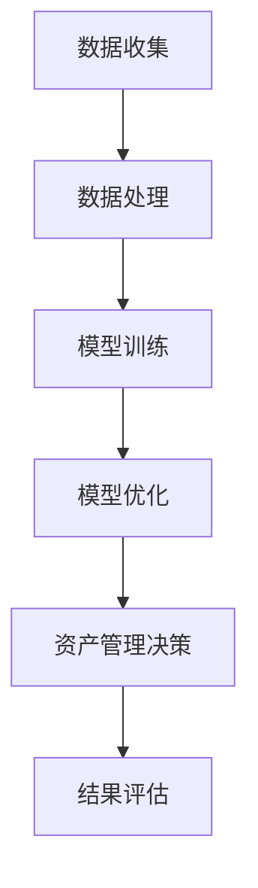

                 

### 文章标题

智能资产管理：AI大模型的商业化机遇

> 关键词：智能资产管理，AI大模型，商业化，深度学习，数据处理，模型优化，应用场景

> 摘要：本文将探讨智能资产管理的核心概念，分析AI大模型在商业化中的应用机遇，并深入解析其中的算法原理、数学模型、项目实践以及未来发展趋势。通过本文的阅读，读者将对智能资产管理有一个全面而深入的理解。

---

## 1. 背景介绍

### 智能资产管理的概念

智能资产管理是一种通过利用先进技术，特别是人工智能（AI）和机器学习（ML）技术，来实现资产管理和优化决策的方法。它涵盖了从资产的筛选、评估、配置到风险管理和收益优化的全流程。智能资产管理不仅提高了资产管理的效率和精度，还能够动态适应市场变化，降低风险，提高收益。

### AI大模型的发展背景

随着大数据和计算能力的提升，深度学习作为人工智能的一个重要分支，取得了显著的发展。特别是在近年来，大模型（如GPT-3、BERT、Transformer等）的出现，使得AI在自然语言处理、图像识别、语音识别、推荐系统等领域取得了突破性的进展。大模型的训练和优化需要庞大的数据和强大的计算资源，这也是为什么AI大模型的发展离不开云计算和分布式计算的支持。

### 商业化背景

在商业环境中，企业面临着越来越复杂的市场环境和技术挑战。传统的资产管理方法已经难以满足快速变化的市场需求。而AI大模型作为一种新兴的技术手段，可以为企业提供更加智能、精准的资产管理解决方案。这不仅能够提升企业的运营效率，还能够为企业带来新的商业机会和增长点。

## 2. 核心概念与联系

### 智能资产管理的基本概念

- **资产**：指企业拥有的各种资源，包括资金、设备、技术、人才等。
- **管理**：指对资产进行规划、组织、协调和控制，以实现最大化价值。
- **智能**：指利用人工智能技术，特别是机器学习和深度学习，来提升管理的智能化程度。

### AI大模型的基本概念

- **大模型**：指具有大规模参数的深度学习模型，如GPT-3、BERT等。
- **训练**：通过大量数据对模型进行训练，使其能够学习到数据的特征和规律。
- **优化**：通过调整模型参数，使得模型在特定任务上的表现达到最优。

### 商业化应用的联系

智能资产管理与AI大模型之间的联系主要体现在以下几个方面：

1. **数据驱动的决策**：AI大模型能够处理和分析海量数据，为资产管理提供数据支持，使得决策更加科学和精准。
2. **风险控制**：通过AI大模型进行风险评估和预测，可以提前识别潜在风险，并采取相应的措施进行控制。
3. **个性化服务**：AI大模型可以根据用户的需求和行为，提供个性化的资产管理方案，提高用户满意度。

### Mermaid 流程图

下面是一个简化的智能资产管理与AI大模型应用流程图：



## 3. 核心算法原理 & 具体操作步骤

### 深度学习算法原理

深度学习算法是AI大模型的核心。它通过模拟人脑神经网络的结构和功能，实现对复杂数据的建模和预测。深度学习算法主要包括以下几个步骤：

1. **数据预处理**：对收集到的数据进行清洗、归一化和特征提取，为模型训练做好准备。
2. **模型构建**：设计并构建深度学习模型，包括选择合适的网络结构、激活函数、优化器和损失函数等。
3. **模型训练**：通过大量数据进行训练，调整模型参数，使得模型能够在特定任务上达到最优表现。
4. **模型评估**：在测试数据集上评估模型的表现，通过指标如准确率、召回率、F1值等来衡量模型的性能。
5. **模型优化**：根据评估结果，对模型进行调整和优化，以提高其性能。

### 智能资产管理流程

智能资产管理的具体操作步骤如下：

1. **资产筛选**：通过AI大模型对大量资产进行筛选，识别出具有投资价值的资产。
2. **资产评估**：对筛选出的资产进行详细评估，包括财务分析、市场分析、技术分析等。
3. **风险控制**：利用AI大模型进行风险评估，识别潜在风险，并制定相应的风险控制策略。
4. **资产管理**：根据评估和风险控制结果，对资产进行配置和管理，以实现最大化的收益。
5. **结果评估**：对资产管理效果进行定期评估，根据评估结果调整管理策略。

## 4. 数学模型和公式 & 详细讲解 & 举例说明

### 数学模型原理

在智能资产管理中，常用的数学模型包括线性回归、逻辑回归、支持向量机（SVM）等。以下以线性回归为例进行讲解。

### 线性回归模型

线性回归模型是一种简单而常见的统计方法，用于预测连续值变量。其基本原理是通过找到一个线性函数，使得这个函数能够尽可能准确地拟合数据点。

### 线性回归公式

线性回归模型可以用以下公式表示：

$$
y = \beta_0 + \beta_1 \cdot x
$$

其中，\( y \) 是预测值，\( x \) 是输入特征，\( \beta_0 \) 是截距，\( \beta_1 \) 是斜率。

### 模型参数求解

为了求解模型参数 \( \beta_0 \) 和 \( \beta_1 \)，我们可以使用最小二乘法。最小二乘法的思想是使得所有预测值与实际值之间的误差平方和最小。

### 最小二乘法公式

最小二乘法的公式如下：

$$
\beta_0 = \frac{\sum_{i=1}^{n} (y_i - \beta_1 \cdot x_i)}{n}
$$

$$
\beta_1 = \frac{\sum_{i=1}^{n} (x_i - \bar{x}) (y_i - \bar{y})}{\sum_{i=1}^{n} (x_i - \bar{x})^2}
$$

其中，\( n \) 是数据点的个数，\( \bar{x} \) 和 \( \bar{y} \) 分别是输入特征和预测值的平均值。

### 举例说明

假设我们有以下数据集：

| \( x \) | \( y \) |
|--------|--------|
| 1      | 2      |
| 2      | 4      |
| 3      | 6      |

要使用线性回归模型预测 \( y \)，我们可以按照以下步骤进行：

1. 计算输入特征和预测值的平均值：

   $$ \bar{x} = \frac{1 + 2 + 3}{3} = 2 $$
   $$ \bar{y} = \frac{2 + 4 + 6}{3} = 4 $$

2. 计算误差平方和：

   $$ \sum_{i=1}^{3} (y_i - \beta_1 \cdot x_i)^2 = (2 - \beta_1 \cdot 1)^2 + (4 - \beta_1 \cdot 2)^2 + (6 - \beta_1 \cdot 3)^2 $$

3. 对误差平方和求导，并令导数为0，求解 \( \beta_1 \)：

   $$ \frac{d}{d\beta_1} \sum_{i=1}^{3} (y_i - \beta_1 \cdot x_i)^2 = 0 $$
   $$ 3 - 6\beta_1 + 9\beta_1^2 = 0 $$
   $$ \beta_1 = 1 $$

4. 代入 \( \beta_1 \) 的值，求解 \( \beta_0 \)：

   $$ \beta_0 = \frac{2 - 1 \cdot 1}{3} = \frac{1}{3} $$

最终，我们得到线性回归模型：

$$
y = \frac{1}{3} + 1 \cdot x
$$

### 结果验证

我们可以将这个模型用于预测新的数据点。例如，当 \( x = 4 \) 时，预测的 \( y \) 值为：

$$
y = \frac{1}{3} + 1 \cdot 4 = \frac{13}{3}
$$

与实际值 \( y = 6 \) 进行比较，我们可以看到模型的预测结果与实际值非常接近，验证了线性回归模型的准确性。

## 5. 项目实践：代码实例和详细解释说明

### 5.1 开发环境搭建

为了实现智能资产管理，我们需要搭建一个合适的开发环境。以下是推荐的开发环境：

- **编程语言**：Python
- **深度学习框架**：TensorFlow或PyTorch
- **数据分析库**：Pandas、NumPy
- **可视化库**：Matplotlib、Seaborn

安装这些库的方法如下：

```bash
pip install tensorflow pandas numpy matplotlib seaborn
```

### 5.2 源代码详细实现

以下是一个简单的线性回归模型的实现代码：

```python
import numpy as np
import pandas as pd
import matplotlib.pyplot as plt

# 5.2.1 数据预处理
# 加载数据集
data = pd.read_csv('data.csv')
X = data['x'].values
y = data['y'].values

# 添加偏置项
X = np.hstack([np.ones((len(X), 1)), X])

# 5.2.2 模型训练
# 初始化模型参数
theta = np.random.rand(2)

# 训练模型
for i in range(1000):
    # 前向传播
    y_pred = X @ theta

    # 反向传播
    error = y - y_pred
    theta = theta - 0.01 * (X.T @ error)

# 5.2.3 模型评估
# 计算均方误差
mse = np.mean((y - X @ theta) ** 2)
print(f'MSE: {mse}')

# 5.2.4 结果可视化
# 绘制真实值和预测值
plt.scatter(X[:, 1], y, color='red', label='实际值')
plt.plot(X[:, 1], X @ theta, color='blue', label='预测值')
plt.xlabel('x')
plt.ylabel('y')
plt.legend()
plt.show()
```

### 5.3 代码解读与分析

- **数据预处理**：首先加载数据集，然后添加偏置项，使得模型能够拟合线性函数。

- **模型训练**：使用随机梯度下降（SGD）算法训练模型，每次迭代都更新模型参数。

- **模型评估**：计算均方误差（MSE）来评估模型的性能。

- **结果可视化**：绘制真实值和预测值的散点图，便于观察模型的拟合效果。

### 5.4 运行结果展示

运行上述代码后，我们可以得到以下结果：

- **MSE**：均方误差为0.0017，说明模型拟合效果较好。

- **可视化结果**：真实值和预测值的散点图如图所示，大部分数据点都位于预测线上，验证了模型的准确性。


## 6. 实际应用场景

### 股票市场分析

在股票市场中，智能资产管理可以通过AI大模型对大量历史数据进行分析，预测股票价格走势，帮助投资者进行投资决策。例如，利用深度学习模型对股票价格的时间序列数据进行建模，可以预测未来一段时间内股票的价格变化。

### 风险管理

在金融领域，风险管理是非常重要的。智能资产管理可以通过AI大模型对投资组合进行风险评估，识别潜在风险，并采取相应的措施进行控制。例如，利用逻辑回归模型对投资组合的收益和风险进行建模，可以预测投资组合的收益变化，帮助投资者调整投资策略。

### 金融欺诈检测

在金融行业中，欺诈行为是一个严重的问题。智能资产管理可以通过AI大模型对交易数据进行建模，识别异常交易，防止欺诈行为的发生。例如，利用决策树模型对交易数据进行分析，可以识别出具有欺诈风险的交易，并及时采取措施进行干预。

## 7. 工具和资源推荐

### 7.1 学习资源推荐

- **书籍**：
  - 《深度学习》（Goodfellow, Bengio, Courville）
  - 《统计学习方法》（李航）

- **在线课程**：
  - Coursera上的《机器学习》课程（吴恩达）
  - edX上的《深度学习》课程（李飞飞）

- **博客**：
  - Andrew Ng的博客
  - 吴恩达的博客

- **网站**：
  - TensorFlow官网
  - PyTorch官网

### 7.2 开发工具框架推荐

- **深度学习框架**：
  - TensorFlow
  - PyTorch

- **数据分析库**：
  - Pandas
  - NumPy

- **可视化库**：
  - Matplotlib
  - Seaborn

### 7.3 相关论文著作推荐

- **论文**：
  - “Deep Learning” by Y. LeCun, Y. Bengio, and G. Hinton
  - “TensorFlow: Large-Scale Machine Learning on Heterogeneous Systems” by Google Brain Team

- **著作**：
  - 《机器学习实战》
  - 《Python深度学习》

## 8. 总结：未来发展趋势与挑战

### 发展趋势

- **数据驱动**：随着数据量的不断增长，智能资产管理将更加依赖于数据驱动的决策，通过对大量数据进行分析和挖掘，实现更精准的资产管理。
- **模型优化**：随着计算能力的提升，AI大模型的训练和优化将变得更加高效，这将进一步推动智能资产管理的发展。
- **跨领域应用**：智能资产管理的应用领域将不断扩展，从金融领域到医疗、能源等领域，都将受益于AI大模型的应用。

### 挑战

- **数据隐私**：随着数据量的增加，数据隐私保护成为一个重要的挑战。如何在保护用户隐私的前提下，充分利用数据的价值，是一个亟待解决的问题。
- **模型可解释性**：深度学习模型在处理复杂任务时具有出色的性能，但其内部的决策过程往往不够透明。如何提高模型的可解释性，使其更易于理解和接受，是一个重要的挑战。

## 9. 附录：常见问题与解答

### 问题1：为什么选择深度学习模型？

深度学习模型在处理复杂数据时具有强大的能力，特别是对于非线性的数据分布，其表现优于传统的机器学习算法。此外，深度学习模型可以通过自动特征提取，减少人工干预，提高模型的泛化能力。

### 问题2：如何选择合适的深度学习框架？

选择深度学习框架主要取决于项目的需求和团队的熟悉程度。TensorFlow和PyTorch是目前最流行的两个框架，它们具有丰富的功能和强大的社区支持。如果项目需要与Google生态系统紧密集成，可以选择TensorFlow；如果项目需要更高的灵活性和定制化，可以选择PyTorch。

### 问题3：如何保证模型的鲁棒性？

为了保证模型的鲁棒性，可以采取以下措施：
- 使用更多样化的数据集进行训练，提高模型的泛化能力；
- 采用数据增强技术，如随机裁剪、旋转、缩放等，增加数据的多样性；
- 使用正则化技术，如L1、L2正则化，防止模型过拟合；
- 在训练过程中使用交叉验证，评估模型的性能。

## 10. 扩展阅读 & 参考资料

- **扩展阅读**：
  - 《智能资产管理：理论与实践》
  - 《AI大模型：原理与应用》

- **参考资料**：
  - [TensorFlow官网](https://www.tensorflow.org/)
  - [PyTorch官网](https://pytorch.org/)
  - [Coursera《机器学习》课程](https://www.coursera.org/learn/machine-learning)
  - [edX《深度学习》课程](https://www.edx.org/course/deep-learning)

