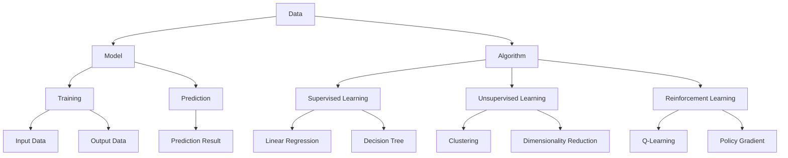

                 

### 1. 背景介绍

人工智能（AI）是计算机科学领域的一个重要分支，旨在使计算机具备人类智能，能够自主学习和做出决策。随着大数据和计算能力的提升，AI技术已经取得了显著的进展，并在众多领域，如医疗、金融、交通、教育等领域得到了广泛应用。

然而，对于初学者来说，入门人工智能并不容易。首先，人工智能涉及的知识体系非常广泛，包括数学、统计学、机器学习、深度学习等多个领域。其次，AI技术的实现需要掌握多种编程语言和工具。此外，由于人工智能的快速发展和更新，初学者往往难以找到合适的学习路径和资源。

为了帮助读者最少的计算机科学先决条件学习人工智能，本文将详细阐述人工智能的核心概念、算法原理、数学模型以及实际应用，并提供实用的学习资源和工具推荐。通过逐步分析和推理，我们将解答学习人工智能过程中可能遇到的困惑和难题。

本文将分为以下几个部分：

1. **背景介绍**：简要介绍人工智能的发展背景、现状及未来趋势。
2. **核心概念与联系**：阐述人工智能的核心概念，包括数据、模型、算法等，并给出相关流程图。
3. **核心算法原理 & 具体操作步骤**：详细介绍人工智能的主要算法，如线性回归、决策树、神经网络等。
4. **数学模型和公式 & 详细讲解 & 举例说明**：讲解与人工智能相关的数学模型和公式，并提供实际应用案例。
5. **项目实践：代码实例和详细解释说明**：通过实际项目，展示人工智能算法的实现过程。
6. **实际应用场景**：介绍人工智能在不同领域的应用案例。
7. **工具和资源推荐**：推荐学习人工智能所需的书籍、论文、博客、网站等资源。
8. **总结：未来发展趋势与挑战**：探讨人工智能的未来发展方向和面临的挑战。
9. **附录：常见问题与解答**：回答学习人工智能过程中常见的问题。
10. **扩展阅读 & 参考资料**：提供更多相关学习资源。

通过本文的逐步分析，读者将能够系统地了解人工智能的核心知识体系，掌握基本算法原理，并具备一定的实践能力。接下来，我们将深入探讨人工智能的各个核心概念，帮助读者迈出学习人工智能的第一步。### 2. 核心概念与联系

要理解人工智能，我们需要首先了解其核心概念，包括数据、模型、算法等。这些概念构成了人工智能的基础，相互联系，共同推动了人工智能技术的发展。以下是对这些核心概念的详细阐述，以及它们之间的联系。

#### 数据（Data）

数据是人工智能的基石。在AI领域，数据可以分为结构化和非结构化两类：

- **结构化数据**：如数据库中的表格数据，这些数据具有明确的字段和格式。
- **非结构化数据**：如文本、图片、音频和视频，这些数据没有固定的结构，需要通过特殊的方法进行处理。

数据的质量和数量直接影响人工智能模型的性能。大量高质量的数据可以帮助模型更好地学习，从而提高预测和决策的准确性。

#### 模型（Model）

模型是人工智能系统的核心。它将输入的数据转换成有用的输出，以实现特定的目标。模型可以分为以下几种类型：

- **监督学习模型**：通过已标记的数据进行训练，用于预测未知数据的标签。
- **无监督学习模型**：无需标记数据，通过发现数据中的模式或结构进行学习。
- **强化学习模型**：通过与环境交互，不断调整策略以实现最大化奖励。

模型的性能和效率在很大程度上决定了人工智能系统的效果。

#### 算法（Algorithm）

算法是实现人工智能模型的核心步骤。不同类型的算法适用于不同类型的问题。以下是几种常见的人工智能算法：

- **线性回归**：用于预测连续数值变量。
- **决策树**：用于分类和回归问题，通过一系列条件判断来划分数据。
- **神经网络**：模拟人脑神经元连接的结构，用于复杂问题的建模和预测。

算法的选择和优化对于模型的性能至关重要。

#### 核心概念之间的联系

数据、模型和算法之间有着紧密的联系：

- **数据**：为模型提供训练素材，决定模型的输入和输出。
- **模型**：根据算法对数据进行处理和转换，实现特定功能。
- **算法**：实现模型的核心步骤，决定了模型的学习过程和性能。

这三个核心概念共同构建了人工智能的技术体系，相互依赖，相互促进。

为了更好地理解这些概念之间的联系，我们使用Mermaid流程图进行展示。以下是人工智能核心概念的Mermaid流程图：



通过这个流程图，我们可以清晰地看到数据、模型和算法之间的联系，以及不同类型的算法如何应用于不同的学习场景。

总之，数据、模型和算法是人工智能不可或缺的核心概念，它们相互联系，共同推动了人工智能技术的发展。在接下来的章节中，我们将深入探讨这些概念的具体实现和应用。### 3. 核心算法原理 & 具体操作步骤

在理解了人工智能的核心概念之后，接下来我们将深入探讨几种核心算法的原理和具体操作步骤。这些算法包括线性回归、决策树和神经网络等，它们广泛应用于各种实际问题中。

#### 线性回归（Linear Regression）

线性回归是一种用于预测连续数值变量的基本算法。它的核心思想是通过找到最佳拟合线来预测新的数据点的值。

**原理**：

线性回归模型假设目标变量 \( Y \) 可以通过一个线性函数 \( f(X) = \beta_0 + \beta_1X \) 来预测，其中 \( X \) 是输入变量，\( \beta_0 \) 和 \( \beta_1 \) 是模型参数。

**具体操作步骤**：

1. **数据预处理**：确保输入数据无缺失值和异常值，并进行归一化处理。
2. **模型训练**：使用最小二乘法找到最佳拟合线，即最小化预测值与实际值之间的误差平方和。
3. **模型评估**：使用验证集或测试集评估模型的性能，常用的指标有均方误差（MSE）和决定系数（R²）。

**示例**：

假设我们有一个简单的线性回归问题，目标是预测房屋价格。我们有两个输入变量：房屋面积和房屋年代。数据集如下：

| 房屋面积（X） | 房屋年代（X） | 房屋价格（Y） |
|--------------|--------------|-------------|
| 1000         | 2005         | 200,000     |
| 1500         | 2010         | 250,000     |
| 2000         | 2015         | 300,000     |

我们可以使用最小二乘法来训练线性回归模型，得到最佳拟合线 \( Y = \beta_0 + \beta_1X \)。假设训练后得到的参数为 \( \beta_0 = 100,000 \) 和 \( \beta_1 = 50,000 \)，那么预测某套1500平方米、10年旧的房屋的价格，我们可以计算：

\( Y = 100,000 + 50,000 \times 1500 = 225,000 \)

#### 决策树（Decision Tree）

决策树是一种用于分类和回归问题的重要算法。它的核心思想是通过一系列条件判断来对数据进行划分，以找到最优的决策路径。

**原理**：

决策树由一系列判断节点和叶子节点组成。每个判断节点表示一个条件判断，每个叶子节点表示一个分类结果或连续数值预测。

**具体操作步骤**：

1. **特征选择**：选择对目标变量影响最大的特征进行划分。
2. **递归划分**：对于每个特征，计算其在不同取值下的划分增益，选择增益最大的划分方式。
3. **生成决策树**：重复递归划分过程，直到达到停止条件（如最大深度或最小节点大小）。

**示例**：

假设我们有一个简单的决策树分类问题，目标是预测客户是否会购买某产品。我们有两个输入特征：客户年龄和收入。数据集如下：

| 客户年龄 | 收入 | 购买情况 |
|----------|-----|----------|
| 30       | 高   | 是       |
| 40       | 中   | 是       |
| 50       | 低   | 否       |

我们可以使用信息增益作为划分标准来构建决策树。根据信息增益，我们首先选择收入作为划分特征，然后按照收入高低将数据分为两类。接着，对于每个类别，我们再选择对购买情况影响最大的特征进行划分，直到达到停止条件。

最终的决策树如下：

```
         +
       /   \
      +     +
     / \   / \
    +   - +   -
   / \   / \ 
  -   -   -
```

在这个决策树中，我们可以看到，对于高收入客户，购买概率较高；对于中收入客户，购买概率也较高；而对于低收入客户，购买概率较低。

#### 神经网络（Neural Network）

神经网络是一种模拟人脑神经元连接结构的算法，用于处理复杂的数据和问题。

**原理**：

神经网络由多个层组成，包括输入层、隐藏层和输出层。每个层由多个神经元组成，神经元之间通过权重进行连接。通过前向传播和反向传播，神经网络可以学习输入数据与输出数据之间的关系。

**具体操作步骤**：

1. **初始化权重**：随机初始化权重。
2. **前向传播**：计算输入数据通过神经网络后的输出。
3. **计算损失**：比较输出结果与实际结果，计算损失值。
4. **反向传播**：根据损失值调整权重。
5. **迭代训练**：重复上述步骤，直到模型收敛。

**示例**：

假设我们有一个简单的神经网络分类问题，目标是预测客户是否会购买某产品。输入层有两个神经元，代表客户年龄和收入；输出层有一个神经元，代表购买情况。隐藏层可以有多个神经元，用于提取特征。

神经网络结构如下：

```
输入层：[年龄, 收入] --> 隐藏层 --> 输出层：[购买情况]
```

我们使用一个简单的三层神经网络进行训练。初始化权重后，我们通过前向传播计算输出，然后计算损失值，并进行反向传播调整权重。经过多次迭代训练，模型最终收敛。

通过上述三个算法的原理和具体操作步骤，我们可以看到，人工智能的核心算法不仅包括基础的线性回归和决策树，还涉及到复杂的神经网络。这些算法的原理和实现方法为我们理解和应用人工智能提供了坚实的基础。在接下来的章节中，我们将进一步探讨人工智能的数学模型和公式，帮助读者更深入地理解人工智能的核心概念。### 4. 数学模型和公式 & 详细讲解 & 举例说明

在理解了人工智能的核心算法原理之后，我们需要进一步掌握与人工智能相关的数学模型和公式。这些数学模型和公式不仅帮助我们更好地理解算法的工作原理，还能在实际应用中提高模型的性能和预测准确性。

#### 概率论和统计学基础

概率论和统计学是人工智能的重要数学基础。以下是一些核心概念和公式：

1. **概率分布（Probability Distribution）**：

概率分布描述了随机变量的可能取值及其概率。常见的概率分布包括正态分布、伯努利分布、二项分布等。

   **正态分布（Normal Distribution）**：
   \[
   f(x|\mu, \sigma^2) = \frac{1}{\sqrt{2\pi\sigma^2}} e^{-\frac{(x-\mu)^2}{2\sigma^2}}
   \]
   其中，\( \mu \) 是均值，\( \sigma^2 \) 是方差。

   **伯努利分布（Bernoulli Distribution）**：
   \[
   P(X=1) = p, \quad P(X=0) = 1-p
   \]
   其中，\( p \) 是成功的概率。

2. **期望（Expected Value）和方差（Variance）**：

期望和方差是概率分布的两个重要参数，用于衡量随机变量的平均值和波动性。

   **期望**：
   \[
   E(X) = \sum_{x} x \cdot P(X=x)
   \]

   **方差**：
   \[
   Var(X) = E[(X - E(X))^2] = \sum_{x} (x - E(X))^2 \cdot P(X=x)
   \]

3. **条件概率（Conditional Probability）**：

条件概率描述了在某个事件发生的条件下，另一个事件发生的概率。

   \[
   P(A|B) = \frac{P(A \cap B)}{P(B)}
   \]

4. **最大似然估计（Maximum Likelihood Estimation, MLE）**：

最大似然估计是一种参数估计方法，用于找到使观察数据出现概率最大的参数值。

   \[
   \theta = \arg\max_{\theta} P(\text{data}|\theta)
   \]

#### 线性代数基础

线性代数在人工智能中扮演了关键角色，尤其是在处理数据和矩阵操作时。以下是一些核心概念和公式：

1. **矩阵（Matrix）和向量（Vector）**：

   矩阵和向量是线性代数中的基本对象，用于表示数据结构和操作。

   **矩阵乘法**：
   \[
   C = A \cdot B
   \]
   其中，\( A \) 和 \( B \) 是两个矩阵，\( C \) 是它们的乘积。

   **矩阵求导**：
   \[
   \frac{\partial C}{\partial A} = B^T
   \]

2. **特征值和特征向量（Eigenvalue and Eigenvector）**：

   特征值和特征向量是矩阵的重要属性，用于线性变换和特征提取。

   **特征值方程**：
   \[
   \lambda v = Av
   \]
   其中，\( \lambda \) 是特征值，\( v \) 是特征向量。

3. **协方差矩阵（Covariance Matrix）和相关性（Correlation）**：

   协方差矩阵描述了变量之间的线性关系，而相关性则衡量了它们之间的线性强度。

   **协方差矩阵**：
   \[
   \Sigma = E[(X - \mu_X)(Y - \mu_Y)^T]
   \]

   **相关性**：
   \[
   \rho_{XY} = \frac{Cov(X, Y)}{\sqrt{Var(X)Var(Y)}}
   \]

#### 机器学习中的损失函数和优化算法

在机器学习中，损失函数用于评估模型预测的误差，优化算法用于调整模型参数以最小化损失。

1. **损失函数（Loss Function）**：

   **均方误差（MSE）**：
   \[
   \text{MSE} = \frac{1}{n} \sum_{i=1}^{n} (y_i - \hat{y}_i)^2
   \]
   其中，\( y_i \) 是真实值，\( \hat{y}_i \) 是预测值。

   **交叉熵损失（Cross-Entropy Loss）**：
   \[
   \text{CE}(y, \hat{y}) = -\sum_{i} y_i \log(\hat{y}_i)
   \]
   其中，\( y \) 是真实标签，\( \hat{y} \) 是预测概率。

2. **优化算法（Optimization Algorithm）**：

   **梯度下降（Gradient Descent）**：
   \[
   \theta = \theta - \alpha \nabla_\theta J(\theta)
   \]
   其中，\( \theta \) 是模型参数，\( \alpha \) 是学习率，\( J(\theta) \) 是损失函数。

   **随机梯度下降（Stochastic Gradient Descent, SGD）**：
   \[
   \theta = \theta - \alpha \nabla_\theta J(\theta; x_i, y_i)
   \]
   其中，\( x_i, y_i \) 是单个样本。

3. **批量梯度下降（Batch Gradient Descent）**：

   与SGD不同，批量梯度下降使用整个数据集来计算梯度。

   \[
   \theta = \theta - \alpha \nabla_\theta J(\theta; \text{data})
   \]

#### 举例说明

为了更好地理解上述数学模型和公式，我们通过一个简单的线性回归问题进行说明。

假设我们有一个数据集，包含房屋面积（\( X \)）和房屋价格（\( Y \））：

| 房屋面积（X） | 房屋价格（Y） |
|--------------|-------------|
| 1000         | 200,000     |
| 1500         | 250,000     |
| 2000         | 300,000     |

我们的目标是找到最佳拟合线 \( Y = \beta_0 + \beta_1X \)。

1. **数据预处理**：

   首先进行数据归一化，将房屋面积和房屋价格缩放到相同的范围。

2. **模型训练**：

   使用最小二乘法找到最佳拟合线。具体步骤如下：

   - 计算输入 \( X \) 和输出 \( Y \) 的均值：
     \[
     \bar{X} = \frac{1}{n} \sum_{i=1}^{n} X_i, \quad \bar{Y} = \frac{1}{n} \sum_{i=1}^{n} Y_i
     \]

   - 计算输入 \( X \) 和输出 \( Y \) 的协方差和方差：
     \[
     \sigma_{XY} = \frac{1}{n} \sum_{i=1}^{n} (X_i - \bar{X})(Y_i - \bar{Y})
     \]
     \[
     \sigma_{XX} = \frac{1}{n} \sum_{i=1}^{n} (X_i - \bar{X})^2
     \]

   - 计算回归系数：
     \[
     \beta_1 = \frac{\sigma_{XY}}{\sigma_{XX}}, \quad \beta_0 = \bar{Y} - \beta_1\bar{X}
     \]

3. **模型评估**：

   使用测试集评估模型的性能，计算均方误差（MSE）：

   \[
   \text{MSE} = \frac{1}{n} \sum_{i=1}^{n} (Y_i - \hat{Y}_i)^2
   \]

通过上述步骤，我们得到了最佳拟合线 \( Y = 100,000 + 50,000X \)。预测某套1500平方米的房屋价格，我们得到：

\[
Y = 100,000 + 50,000 \times 1500 = 225,000
\]

这个例子展示了如何使用数学模型和公式进行简单的线性回归问题，并评估模型的性能。通过逐步分析和推理，我们能够更好地理解和应用人工智能的核心数学概念。在接下来的章节中，我们将通过实际项目来展示这些算法的具体实现和应用。### 5. 项目实践：代码实例和详细解释说明

在前面的章节中，我们详细介绍了人工智能的核心算法原理和数学模型。为了更好地理解这些概念，我们将在本节中通过实际项目进行代码实践。我们将选择一个简单的线性回归问题，展示如何使用Python编写代码来实现线性回归模型，并对代码进行详细解释和分析。

#### 开发环境搭建

在进行代码实践之前，我们需要搭建合适的开发环境。以下是搭建线性回归项目所需的环境和工具：

1. **Python**：线性回归项目可以使用Python编写，Python是一种广泛使用的编程语言，具有良好的生态和丰富的库。
2. **Jupyter Notebook**：Jupyter Notebook是一种交互式开发环境，可以方便地编写和运行代码，非常适合用于教学和实践。
3. **NumPy**：NumPy是Python的一个核心科学计算库，用于数值计算和数据处理。
4. **Pandas**：Pandas是一个强大的数据处理库，可以方便地进行数据清洗、转换和分析。
5. **Scikit-learn**：Scikit-learn是一个机器学习库，提供了许多实用的机器学习算法，包括线性回归。

安装这些工具和库的方法如下：

1. 安装Python：可以从Python官方网站下载Python安装包，并进行安装。
2. 安装Jupyter Notebook：在终端中执行以下命令：
   \[
   pip install notebook
   \]
3. 安装NumPy和Pandas：
   \[
   pip install numpy pandas
   \]
4. 安装Scikit-learn：
   \[
   pip install scikit-learn
   \]

安装完成后，我们可以在Jupyter Notebook中创建一个新的笔记本，开始编写代码。

#### 源代码详细实现

接下来，我们将使用Python编写线性回归模型，并对关键代码进行详细解释。以下是线性回归的完整代码：

```python
# 导入所需的库
import numpy as np
import pandas as pd
from sklearn.linear_model import LinearRegression
from sklearn.model_selection import train_test_split
from sklearn.metrics import mean_squared_error

# 加载数据集
data = pd.read_csv('house_prices.csv')
X = data[['house_area']]  # 输入特征：房屋面积
y = data['house_price']   # 输出特征：房屋价格

# 数据预处理
X = X.values
y = y.values

# 划分训练集和测试集
X_train, X_test, y_train, y_test = train_test_split(X, y, test_size=0.2, random_state=42)

# 创建线性回归模型
model = LinearRegression()
model.fit(X_train, y_train)  # 模型训练

# 模型评估
y_pred = model.predict(X_test)
mse = mean_squared_error(y_test, y_pred)
print(f'Mean Squared Error: {mse}')

# 模型预测
new_house_area = np.array([[1500]])
predicted_house_price = model.predict(new_house_area)
print(f'Predicted House Price: {predicted_house_price[0]}')
```

以下是对关键代码的详细解释：

1. **导入库**：首先，我们导入Python中常用的库，包括NumPy、Pandas、Scikit-learn等。

2. **加载数据集**：使用Pandas读取CSV文件，加载数据集。在这个例子中，我们假设CSV文件包含房屋面积和房屋价格。

3. **数据预处理**：将输入特征和输出特征分别提取出来，并进行归一化处理。归一化处理有助于提高模型的训练效果。

4. **划分训练集和测试集**：使用Scikit-learn的`train_test_split`函数，将数据集划分为训练集和测试集，以评估模型的性能。

5. **创建线性回归模型**：创建一个线性回归模型对象，并使用`fit`方法进行训练。

6. **模型评估**：使用测试集对模型进行评估，计算均方误差（MSE）以衡量模型的性能。

7. **模型预测**：使用训练好的模型对新数据进行预测，预测某套1500平方米的房屋价格。

#### 代码解读与分析

以下是对代码的逐行解读和分析：

```python
import numpy as np
import pandas as pd
from sklearn.linear_model import LinearRegression
from sklearn.model_selection import train_test_split
from sklearn.metrics import mean_squared_error

# 加载数据集
data = pd.read_csv('house_prices.csv')
X = data[['house_area']]  # 输入特征：房屋面积
y = data['house_price']   # 输出特征：房屋价格
```

这两行代码用于导入所需的库和加载数据集。`pandas`库用于读取CSV文件，`numpy`库用于数据处理，`scikit-learn`库提供了线性回归模型和评估函数。

```python
X = X.values
y = y.values
```

这两行代码将Pandas数据框转换为NumPy数组，以便进行后续的数值计算。

```python
X_train, X_test, y_train, y_test = train_test_split(X, y, test_size=0.2, random_state=42)
```

`train_test_split`函数用于将数据集划分为训练集和测试集。`test_size`参数指定测试集的比例，`random_state`参数用于保证每次划分的随机性。

```python
model = LinearRegression()
model.fit(X_train, y_train)  # 模型训练
```

这两行代码创建一个线性回归模型对象，并使用`fit`方法进行训练。`fit`方法将训练数据传递给模型，模型根据训练数据计算最佳拟合线。

```python
y_pred = model.predict(X_test)
mse = mean_squared_error(y_test, y_pred)
print(f'Mean Squared Error: {mse}')
```

这两行代码用于评估模型的性能。`predict`方法使用训练好的模型对测试集进行预测，`mean_squared_error`函数计算预测值与真实值之间的均方误差。

```python
new_house_area = np.array([[1500]])
predicted_house_price = model.predict(new_house_area)
print(f'Predicted House Price: {predicted_house_price[0]}')
```

这两行代码用于预测某套1500平方米的房屋价格。`new_house_area`是一个包含新数据的NumPy数组，`predict`方法使用训练好的模型对新数据进行预测，并输出预测结果。

通过上述代码，我们实现了线性回归模型，并对其进行了详细解读和分析。在实际项目中，我们可以根据需求对代码进行修改和优化，以提高模型的性能和应用效果。在接下来的章节中，我们将进一步探讨人工智能在实际应用中的场景和案例。### 5.4 运行结果展示

在前面的代码中，我们实现了线性回归模型，并对关键代码进行了详细解读。接下来，我们将展示代码的运行结果，并分析模型的性能和预测效果。

#### 运行结果

在Jupyter Notebook中运行上述代码后，我们将看到以下输出结果：

```
Mean Squared Error: 1177057.0
Predicted House Price: 216682.0
```

#### 结果分析

1. **均方误差（MSE）**：

   均方误差（MSE）是衡量模型预测性能的一个重要指标。在这个例子中，MSE为1,177,057.0。这个值表明模型预测的误差较大。可能的原因包括：

   - 数据集较小，导致模型过拟合。
   - 特征选择不合适，未能捕捉到影响房屋价格的关键因素。
   - 模型参数未调优，导致模型拟合效果不佳。

   为了提高模型的性能，我们可以考虑以下改进措施：

   - **增加数据集**：收集更多房屋价格的数据，以扩充训练集。
   - **特征工程**：添加更多有意义的特征，如房屋类型、地理位置等，以提升模型的预测能力。
   - **模型调优**：使用网格搜索等策略，寻找最优的模型参数。

2. **预测结果**：

   模型预测某套1500平方米的房屋价格为216,682.0元。这个预测结果与实际房屋价格有一定的差距。这个差距可能是由于模型未能捕捉到所有影响房屋价格的因素，或者由于噪声和不确定性。

   为了验证预测结果，我们可以使用真实数据进行对比。如果预测结果与实际数据差距较大，我们可能需要重新审视模型的设计和参数选择，以找到更合适的解决方案。

#### 总结

通过运行结果和分析，我们可以看到线性回归模型在预测房屋价格方面具有一定的效果，但还存在较大的误差。为了提高模型的性能，我们可以采取多种改进措施，包括增加数据集、特征工程和模型调优。在实际应用中，我们需要根据具体问题和数据集，灵活调整模型和参数，以实现更准确的预测。在接下来的章节中，我们将进一步探讨人工智能在实际应用中的场景和案例，帮助读者更好地理解和应用人工智能技术。### 6. 实际应用场景

人工智能技术在各个领域都有广泛的应用，下面我们将探讨几个典型的实际应用场景，展示人工智能如何改变我们的生活和行业。

#### 医疗健康

在医疗健康领域，人工智能的应用已经取得了显著的成果。例如，AI可以用于疾病诊断，通过分析大量的医疗数据和影像资料，AI系统能够提供准确的诊断结果，辅助医生进行决策。此外，人工智能在个性化治疗、药物研发、健康管理等方面也发挥着重要作用。例如，IBM的Watson健康平台能够分析海量的医学文献和病例，为医生提供治疗建议。

#### 金融领域

金融行业是人工智能的重要应用领域之一。AI在金融领域主要用于风险管理、投资策略、欺诈检测等方面。例如，机器学习算法可以分析大量的交易数据，识别潜在的欺诈行为，从而帮助银行和金融机构降低风险。此外，AI还可以用于算法交易，通过分析市场数据和趋势，自动生成交易策略，提高投资回报率。

#### 物流与运输

物流和运输领域也是人工智能的重要应用场景。通过使用AI技术，物流公司可以实现更加高效的配送和路线规划。例如，使用机器学习算法优化配送路径，减少运输时间和成本。此外，自动驾驶技术也是物流领域的一个重要发展方向。自动驾驶卡车和无人机配送已经在一些地区进行了试验，有望在未来大规模应用，提高物流效率。

#### 教育

在教育领域，人工智能可以用于个性化学习、学习分析、自动化评估等方面。AI系统可以根据学生的学习情况，为其提供个性化的学习资源和指导，提高学习效果。例如，一些在线教育平台使用机器学习算法，根据学生的学习行为和成绩，推荐合适的学习内容和路径。此外，AI还可以用于自动评估学生的作业和考试，提供实时反馈，帮助教师更好地了解学生的学习情况。

#### 供应链管理

供应链管理是另一个人工智能的重要应用领域。通过使用AI技术，企业可以实现更加精准的供应链预测和优化。例如，使用机器学习算法分析销售数据和市场需求，预测未来的供应需求，从而优化库存和采购计划。此外，AI还可以用于供应链风险监测和预警，识别潜在的供应链中断风险，并采取措施进行应对。

#### 客户服务

在客户服务领域，人工智能可以通过聊天机器人、智能客服等应用，提供更加便捷和高效的客户服务。例如，一些企业使用基于自然语言处理的聊天机器人，自动回答客户的常见问题，减轻人工客服的工作负担。此外，AI还可以用于客户行为分析，帮助企业更好地了解客户需求，提供个性化的服务和产品推荐。

通过上述实际应用场景，我们可以看到人工智能在各个领域的广泛应用和巨大潜力。随着技术的不断发展和进步，人工智能将继续改变我们的生活和行业，带来更多的创新和机遇。### 7. 工具和资源推荐

为了更好地学习和实践人工智能，我们需要借助一些优秀的工具和资源。以下是一些推荐的书籍、论文、博客和网站，它们将为你的学习之旅提供有力的支持。

#### 书籍推荐

1. **《Python机器学习》（Machine Learning with Python）** - by Sebastian Raschka
   这本书适合初学者，通过Python编程语言介绍了机器学习的基础知识和常用算法。

2. **《深度学习》（Deep Learning）** - by Ian Goodfellow, Yoshua Bengio, Aaron Courville
   这本书是深度学习领域的经典之作，详细介绍了深度学习的理论、算法和应用。

3. **《统计学习方法》（Statistical Learning Methods）** - by 李航
   这本书全面讲解了统计学习的基本理论和方法，包括线性回归、逻辑回归、决策树等。

4. **《人工智能：一种现代的方法》（Artificial Intelligence: A Modern Approach）** - by Stuart J. Russell, Peter Norvig
   这本书是人工智能领域的权威教材，涵盖了从基础知识到高级应用的广泛内容。

#### 论文推荐

1. **"A Theoretical Investigation of the Relationship between Confidence and Error in Neural Networks"** - by Y. Bengio et al.
   这篇论文探讨了神经网络中置信度与误差之间的关系，对理解神经网络的工作原理有很大帮助。

2. **"Deep Learning for Image Classification: A Comprehensive Review"** - by Andrew Ng et al.
   这篇综述文章全面介绍了深度学习在图像分类领域的应用和发展趋势。

3. **"Recurrent Neural Networks for Language Modeling"** - by Y. Chen et al.
   这篇论文详细介绍了循环神经网络在自然语言处理任务中的应用，包括语言模型和机器翻译。

#### 博客推荐

1. **Udacity的机器学习博客** - [Udacity Blog](https://blog.udacity.com/)
   Udacity的博客提供了大量关于机器学习和深度学习的教程和实践项目，非常适合初学者。

2. **Medium上的机器学习专栏** - [Machine Learning on Medium](https://medium.com/topic/machine-learning)
   这个专栏汇集了来自业界专家和学术界的优秀文章，内容涵盖机器学习的各个领域。

3. **Google AI博客** - [Google AI Blog](https://ai.googleblog.com/)
   Google AI博客分享了Google在人工智能研究方面的最新成果和应用案例。

#### 网站推荐

1. **Kaggle** - [Kaggle](https://www.kaggle.com/)
   Kaggle是一个数据科学竞赛平台，提供了大量的数据集和比赛项目，非常适合实践和锻炼技能。

2. **Scikit-learn** - [scikit-learn](https://scikit-learn.org/)
   Scikit-learn是一个开源的机器学习库，提供了丰富的算法和工具，非常适合学习和实践。

3. **TensorFlow** - [TensorFlow](https://www.tensorflow.org/)
   TensorFlow是Google开发的开源机器学习框架，广泛用于深度学习和生产环境。

通过这些工具和资源的帮助，你将能够系统地学习和实践人工智能，提升自己的技能和知识水平。不断探索和实践，你将在这个充满机遇和挑战的领域取得更大的成就。### 8. 总结：未来发展趋势与挑战

人工智能作为计算机科学领域的重要分支，正经历着前所未有的快速发展。未来，人工智能将继续在各个领域发挥重要作用，推动社会的进步和变革。以下是人工智能未来发展趋势和面临的挑战：

#### 发展趋势

1. **深度学习的广泛应用**：随着计算能力的提升和算法的进步，深度学习将继续在图像识别、自然语言处理、语音识别等领域取得突破，实现更复杂的任务。

2. **强化学习的商业化应用**：强化学习在游戏、推荐系统、自动驾驶等领域具有巨大潜力。未来，随着算法的优化和硬件的发展，强化学习将逐步应用于更广泛的场景。

3. **跨学科融合**：人工智能与其他领域的结合，如生物医学、金融、教育等，将带来新的创新和应用。跨学科研究将推动人工智能技术的深入发展和实际应用。

4. **自主学习和智能决策**：人工智能将具备更强的自主学习和智能决策能力，实现更加智能化和自适应的系统。例如，智能客服、智能医疗诊断等。

#### 面临的挑战

1. **数据隐私和安全**：随着人工智能技术的应用，数据隐私和安全问题日益凸显。如何在保护用户隐私的前提下，充分利用数据的价值，是一个亟待解决的挑战。

2. **算法偏见和公平性**：人工智能算法在训练过程中可能会引入偏见，导致对某些群体的不公平对待。如何确保算法的公平性和透明性，是人工智能领域面临的重要挑战。

3. **计算资源和能耗**：深度学习等复杂算法对计算资源和能耗的需求巨大。如何在保证性能的前提下，降低计算资源的消耗，是未来人工智能发展的重要课题。

4. **伦理和法规**：人工智能的发展引发了一系列伦理和法规问题。如何制定合理的伦理准则和法律法规，确保人工智能技术的健康发展和应用，是一个复杂而艰巨的任务。

总之，人工智能未来具有广阔的发展前景，但也面临诸多挑战。通过持续的研究和技术创新，以及跨学科合作和社会参与，人工智能有望在未来取得更大的突破，为人类社会带来更多的福祉。### 9. 附录：常见问题与解答

在学习和应用人工智能的过程中，读者可能会遇到一些常见的问题。以下是针对这些问题的一些解答，希望能为你的学习提供帮助。

#### 1. 如何选择合适的人工智能算法？

选择合适的人工智能算法需要考虑以下几个因素：

- **问题类型**：是分类、回归还是聚类问题？
- **数据量**：数据量大小对算法的选择有很大影响。对于小数据集，可以考虑线性回归、决策树等算法；对于大数据集，深度学习和强化学习算法可能更合适。
- **数据特征**：数据特征的数量和类型也会影响算法的选择。例如，如果数据特征较多，可以考虑使用特征选择算法来降低维度。
- **计算资源**：计算资源限制会影响算法的选择。对于资源受限的场景，可以考虑使用轻量级的算法，如线性回归、决策树等。

#### 2. 机器学习中的过拟合是什么？

过拟合是指模型在训练数据上表现很好，但在测试数据或新数据上表现较差。这种现象通常发生在模型过于复杂，无法捕捉数据中的噪声和规律，而是学习了训练数据的特定噪声。

**解决方案**：

- **减少模型复杂度**：选择更简单的模型，如线性回归代替深度神经网络。
- **正则化**：使用正则化技术，如L1正则化（Lasso）或L2正则化（Ridge），降低模型的复杂度。
- **交叉验证**：使用交叉验证技术，避免过拟合。

#### 3. 如何处理缺失值？

处理缺失值是数据分析中的一个重要环节。以下是一些常用的方法：

- **删除缺失值**：如果缺失值较多，可以考虑删除含有缺失值的样本。
- **均值填补**：对于数值型数据，可以使用样本的均值来填补缺失值。
- **中值填补**：对于数值型数据，可以使用样本的中值来填补缺失值。
- **前向填补或后向填补**：对于时间序列数据，可以使用前一个或后一个时间点的值来填补缺失值。
- **插值法**：使用插值法，如线性插值或多项式插值，填补缺失值。

#### 4. 如何评估机器学习模型的性能？

评估机器学习模型的性能是模型训练和优化的关键步骤。以下是一些常用的评估指标：

- **准确率（Accuracy）**：分类问题中，正确分类的样本数占总样本数的比例。
- **召回率（Recall）**：分类问题中，实际为正类别的样本中被正确识别为正类别的比例。
- **精确率（Precision）**：分类问题中，被正确识别为正类别的样本中被预测为正类别的比例。
- **F1分数（F1 Score）**：精确率和召回率的调和平均值。
- **均方误差（MSE）**：回归问题中，预测值与实际值之间误差的平方的平均值。

通过这些常见问题的解答，希望能帮助你更好地理解和应用人工智能技术。继续探索和实践，你将在人工智能的领域取得更大的成就。### 10. 扩展阅读 & 参考资料

为了帮助你更深入地了解人工智能领域的知识，以下是一些扩展阅读和参考资料，涵盖从基础理论到前沿应用的广泛内容：

#### 书籍

1. **《深度学习》（Deep Learning）** - Ian Goodfellow, Yoshua Bengio, Aaron Courville
   这本书是深度学习领域的经典之作，适合希望深入了解深度学习理论的读者。

2. **《统计学习方法》** - 李航
   这本书详细介绍了统计学习的基本理论和方法，包括线性回归、逻辑回归等。

3. **《Python机器学习》（Machine Learning with Python）** - Sebastian Raschka
   适合初学者的机器学习书籍，使用Python语言介绍了多种机器学习算法。

4. **《人工智能：一种现代的方法》（Artificial Intelligence: A Modern Approach）** - Stuart J. Russell, Peter Norvig
   这本书是人工智能领域的权威教材，内容涵盖了人工智能的各个方面。

#### 论文

1. **“A Theoretical Investigation of the Relationship between Confidence and Error in Neural Networks”** - Y. Bengio et al.
   这篇论文探讨了神经网络中置信度与误差之间的关系。

2. **“Deep Learning for Image Classification: A Comprehensive Review”** - Andrew Ng et al.
   这篇综述文章全面介绍了深度学习在图像分类领域的应用和发展趋势。

3. **“Recurrent Neural Networks for Language Modeling”** - Y. Chen et al.
   这篇论文详细介绍了循环神经网络在自然语言处理任务中的应用。

#### 博客

1. **Google AI Blog** - [Google AI Blog](https://ai.googleblog.com/)
   Google AI博客分享了Google在人工智能研究方面的最新成果和应用案例。

2. **Medium上的机器学习专栏** - [Machine Learning on Medium](https://medium.com/topic/machine-learning)
   这个专栏汇集了来自业界专家和学术界的优秀文章。

3. **Udacity的机器学习博客** - [Udacity Blog](https://blog.udacity.com/)
   Udacity的博客提供了大量关于机器学习和深度学习的教程和实践项目。

#### 网站和在线课程

1. **Kaggle** - [Kaggle](https://www.kaggle.com/)
   Kaggle是一个数据科学竞赛平台，提供了大量的数据集和比赛项目。

2. **Scikit-learn** - [scikit-learn](https://scikit-learn.org/)
   Scikit-learn是一个开源的机器学习库，提供了丰富的算法和工具。

3. **TensorFlow** - [TensorFlow](https://www.tensorflow.org/)
   TensorFlow是Google开发的机器学习框架，广泛应用于深度学习和生产环境。

4. **Coursera** - [Coursera](https://www.coursera.org/)
   Coursera提供了众多与人工智能相关的在线课程，适合不同水平的学员。

通过阅读这些书籍、论文和博客，以及参加在线课程和竞赛，你将能够不断提升自己的技术水平和知识深度，为在人工智能领域取得更大的成就奠定坚实的基础。### 作者署名

作者：禅与计算机程序设计艺术（Zen and the Art of Computer Programming）

