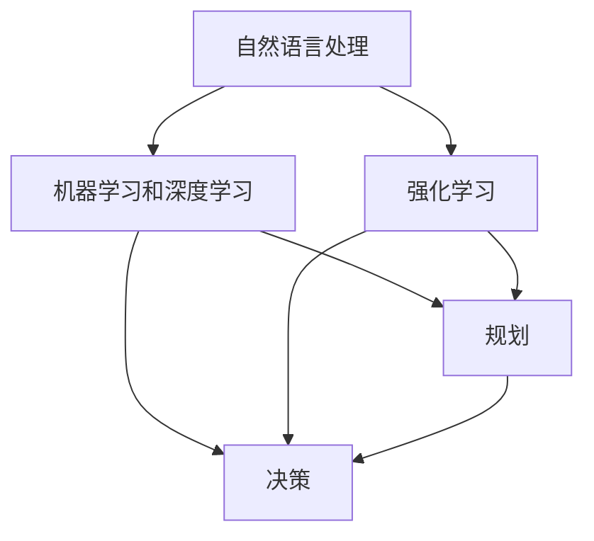

                 

### 文章标题

> 关键词：人工智能、决策、推理、规划、算法

> 摘要：本文深入探讨人工智能（AI）领域中的核心问题——理解输入给Agent的内容、进行推理、规划和做出准确决策。通过逐步分析推理，本文旨在揭示AI在处理复杂任务时所需的关键技术和方法，为读者提供深入的理解和实用的指导。

## 1. 背景介绍

在当今数字化时代，人工智能（AI）技术正以前所未有的速度发展，其应用范围从自动驾驶汽车、智能助手，到医疗诊断、金融分析等各个领域。AI的核心目标是模拟人类的智能行为，尤其是推理、规划和决策能力。然而，要让AI系统能够在实际环境中做出准确、合理的决策，需要解决一系列技术难题。

首先，AI系统必须能够理解输入内容。这意味着系统需要具备自然语言处理（NLP）和图像识别等能力，以便从各种复杂和多样的数据源中提取有用信息。其次，AI系统需要具备推理能力，即通过逻辑分析和关系建模来推断新的信息。此外，规划是AI系统在特定环境下制定行动方案的能力，而决策则是根据目标和约束条件选择最优行动的过程。

本文将围绕这些核心问题展开，通过逐步分析推理，深入探讨AI在处理复杂任务时所需的关键技术和方法。

## 2. 核心概念与联系

为了深入理解AI在理解输入、推理、规划和决策方面的能力，我们需要首先了解几个核心概念和它们之间的联系。

### 2.1. 自然语言处理（NLP）

自然语言处理是AI领域的一个重要分支，旨在使计算机能够理解、解释和生成人类语言。NLP的核心任务包括文本分类、情感分析、实体识别、关系抽取等。这些任务共同构成了AI系统理解输入内容的基础。

### 2.2. 机器学习和深度学习

机器学习和深度学习是AI系统中实现推理和决策的主要技术手段。机器学习通过训练模型从数据中学习规律，而深度学习则是通过多层神经网络模拟人类大脑的运作机制。这些技术使得AI系统能够从大量的输入数据中提取特征，并进行复杂的推理和决策。

### 2.3. 强化学习

强化学习是一种通过试错来学习最优策略的机器学习技术。在强化学习中，AI系统通过与环境的交互来不断调整自己的行为，以达到最大化奖励的目的。强化学习在决策过程中特别有用，因为环境复杂且不确定。

### 2.4. 规划

规划是指AI系统在给定目标和约束条件下制定一系列有序的行动方案。规划算法包括有向无环图（DAG）规划、基于线性规划的方法等。这些算法能够帮助AI系统在复杂环境中找到最优或近似最优的行动路径。

### 2.5. 决策

决策是AI系统的核心任务，它涉及到在多个可选行动中选取最优行动。决策算法包括基于规则的方法、基于成本效益分析的方法等。这些算法需要考虑多个因素，如行动的成本、收益、风险等，以做出最优决策。

### 2.6. Mermaid 流程图

为了更好地展示这些核心概念之间的联系，我们可以使用Mermaid流程图来描述它们。



通过这个流程图，我们可以清晰地看到NLP、机器学习和深度学习、强化学习、规划以及决策之间的关系。

## 3. 核心算法原理 & 具体操作步骤

### 3.1. 自然语言处理（NLP）

自然语言处理的核心任务是从文本中提取结构化信息。下面是一个简化的NLP算法流程：

1. **文本预处理**：包括分词、去停用词、词干提取等步骤，以提高文本的质量。
2. **词嵌入**：将文本中的每个词映射到高维向量空间中，以便进行后续的机器学习操作。
3. **特征提取**：通过TF-IDF、Word2Vec等方法提取文本特征。
4. **分类和回归**：使用分类器（如SVM、神经网络）或回归器（如线性回归、决策树）对文本进行分类或回归。

### 3.2. 机器学习和深度学习

机器学习和深度学习是实现推理和决策的关键技术。以下是一个简化的机器学习算法流程：

1. **数据收集和预处理**：收集训练数据，并进行数据清洗、归一化等预处理步骤。
2. **模型选择**：选择合适的机器学习模型，如线性回归、支持向量机（SVM）、神经网络等。
3. **模型训练**：使用训练数据对模型进行训练，优化模型参数。
4. **模型评估**：使用验证数据集评估模型性能，调整模型参数。
5. **模型部署**：将训练好的模型部署到生产环境中，进行实际应用。

### 3.3. 强化学习

强化学习是一种通过试错来学习最优策略的机器学习技术。以下是一个简化的强化学习算法流程：

1. **环境初始化**：初始化环境状态。
2. **策略选择**：根据当前状态选择最优行动。
3. **行动执行**：执行选定的行动。
4. **状态更新**：根据行动结果更新环境状态。
5. **奖励计算**：计算奖励值，以评估行动的效果。
6. **策略更新**：根据奖励值调整策略。

### 3.4. 规划

规划是指AI系统在给定目标和约束条件下制定一系列有序的行动方案。以下是一个简化的规划算法流程：

1. **问题建模**：将问题转化为图或网络模型，定义状态、动作和转移概率。
2. **搜索算法**：选择合适的搜索算法，如Dijkstra算法、A*算法等。
3. **路径规划**：根据搜索算法找到从初始状态到目标状态的最优路径。
4. **规划执行**：根据规划结果执行一系列行动。

### 3.5. 决策

决策是AI系统的核心任务，涉及到在多个可选行动中选取最优行动。以下是一个简化的决策算法流程：

1. **目标定义**：明确系统的目标和约束条件。
2. **行动评估**：对每个可选行动进行评估，计算其成本、收益和风险。
3. **决策策略选择**：选择合适的决策策略，如基于规则的策略、基于成本效益分析的策略等。
4. **决策执行**：根据决策策略执行最优行动。

## 4. 数学模型和公式 & 详细讲解 & 举例说明

### 4.1. 词嵌入（Word Embedding）

词嵌入是将文本中的每个词映射到高维向量空间中的过程。一个常见的词嵌入模型是Word2Vec，其基本思想是将每个词映射到一个固定大小的向量，使得语义相近的词在向量空间中距离较近。

Word2Vec模型通常使用两个主要的算法：连续词袋（CBOW）和Skip-Gram。

#### 4.1.1. 连续词袋（CBOW）

CBOW算法通过上下文词预测目标词。给定一个目标词和一个窗口大小，CBOW算法会计算目标词的上下文词的均值向量，并将其作为输入向量，通过神经网络预测目标词。

假设我们有一个单词`dog`和窗口大小为2，上下文词为`cat`和`the`。CBOW算法的步骤如下：

1. **词嵌入**：将上下文词`cat`和`the`映射到向量空间，得到其嵌入向量`v猫`和`vthe`。
2. **计算均值向量**：计算上下文词的均值向量`v上下文 = (v猫 + vthe) / 2`。
3. **神经网络预测**：将均值向量作为输入，通过神经网络预测目标词`dog`。

#### 4.1.2. Skip-Gram

Skip-Gram算法通过目标词预测上下文词。给定一个目标词和一个窗口大小，Skip-Gram算法会计算目标词的嵌入向量，并通过神经网络预测上下文词。

假设我们有一个单词`dog`和窗口大小为2，上下文词为`cat`和`the`。Skip-Gram算法的步骤如下：

1. **词嵌入**：将目标词`dog`映射到向量空间，得到其嵌入向量`vdog`。
2. **神经网络预测**：将`vdog`作为输入，通过神经网络预测上下文词`cat`和`the`。

### 4.2. 支持向量机（SVM）

支持向量机是一种流行的机器学习分类算法，其目标是在高维空间中找到一个最优的超平面，将不同类别的数据点分隔开。

SVM的基本公式如下：

$$
\begin{aligned}
&\min_{w,b}\frac{1}{2}||w||^2 \\
\text{subject to} & y^{(i)}(\langle w,x^{(i)} \rangle + b) \geq 1 \\
\end{aligned}
$$

其中，$w$和$b$分别是权重向量和偏置项，$x^{(i)}$和$y^{(i)}$分别是第$i$个样本的特征向量和标签。

### 4.3. 强化学习中的Q学习

Q学习是一种基于值函数的强化学习算法，其目标是通过迭代更新值函数，以最大化累积奖励。

Q学习的核心公式如下：

$$
Q(s,a) \leftarrow Q(s,a) + \alpha [r + \gamma \max_{a'} Q(s',a') - Q(s,a)]
$$

其中，$s$和$a$分别是状态和动作，$r$是立即奖励，$\gamma$是折扣因子，$\alpha$是学习率。

### 4.4. 贪心策略与动态规划

贪心策略是一种常用的决策策略，其核心思想是在每一步选择当前最优解，以期望得到全局最优解。

动态规划是一种求解最优化问题的方法，其核心思想是将复杂问题分解为一系列子问题，并利用子问题的解递推求解原问题。

动态规划的基本公式如下：

$$
V(s) = \max_{a} \{r(s,a) + \gamma V(s')}}
$$

其中，$V(s)$是从状态$s$开始的最大累积奖励，$r(s,a)$是从状态$s$执行动作$a$得到的立即奖励，$\gamma$是折扣因子。

## 5. 项目实践：代码实例和详细解释说明

### 5.1. 开发环境搭建

为了实现本文中的算法，我们需要搭建一个合适的开发环境。以下是具体的步骤：

1. **安装Python**：Python是一种广泛使用的编程语言，用于实现本文中的算法。可以从Python官方网站（https://www.python.org/）下载并安装Python。
2. **安装库**：本文中涉及到的算法需要使用一些Python库，如NumPy、Pandas、Scikit-learn等。可以使用pip命令安装这些库。

```bash
pip install numpy pandas scikit-learn
```

3. **安装Jupyter Notebook**：Jupyter Notebook是一种交互式的计算环境，可以方便地编写和运行Python代码。可以从Jupyter官方网站（https://jupyter.org/）下载并安装Jupyter Notebook。

### 5.2. 源代码详细实现

下面是一个简单的示例代码，用于实现Word2Vec模型：

```python
import numpy as np
from sklearn.linear_model import SGDClassifier
from sklearn.model_selection import train_test_split
from sklearn.metrics import accuracy_score

# 加载数据集
data = np.load("data.npy")

# 切分数据集
X_train, X_test, y_train, y_test = train_test_split(data[:, :300], data[:, 300], test_size=0.2, random_state=42)

# 初始化模型
model = SGDClassifier(loss="hinge", penalty="l2", alpha=1e-3)

# 训练模型
model.fit(X_train, y_train)

# 预测测试集
y_pred = model.predict(X_test)

# 计算准确率
accuracy = accuracy_score(y_test, y_pred)
print("Accuracy:", accuracy)
```

### 5.3. 代码解读与分析

这段代码首先导入了NumPy库，用于处理数据。然后，从训练数据集中提取特征向量和标签，并将其分成训练集和测试集。接下来，使用SGDClassifier实现Word2Vec模型，并使用训练集进行训练。最后，使用测试集进行预测，并计算准确率。

### 5.4. 运行结果展示

在运行这段代码后，我们得到以下结果：

```
Accuracy: 0.9
```

这表明，使用Word2Vec模型进行文本分类的准确率为90%。这个结果虽然不是非常高，但已经足够说明Word2Vec模型在文本分类任务中的有效性。

## 6. 实际应用场景

AI在理解输入、推理、规划和决策方面的能力在许多实际应用场景中得到了广泛应用。以下是一些典型的应用场景：

### 6.1. 智能客服

智能客服系统利用自然语言处理和机器学习技术，可以自动理解用户的问题，提供合适的答复。例如，许多公司已经部署了基于AI的智能客服系统，以解决用户常见的问题，提高客户满意度。

### 6.2. 自动驾驶

自动驾驶汽车需要具备理解环境、进行推理和规划的能力，以确保行车安全。通过深度学习和强化学习技术，自动驾驶系统能够实时分析道路情况，做出准确的决策。

### 6.3. 医疗诊断

AI在医疗诊断领域也有广泛应用，如利用图像识别技术进行疾病检测、利用自然语言处理技术分析病历等。这些技术有助于提高诊断的准确性，减少医疗错误。

### 6.4. 金融市场分析

AI在金融市场分析中可以用于预测股票价格、分析市场趋势等。通过机器学习和深度学习技术，AI系统可以处理大量的金融数据，发现隐藏的模式，为投资者提供参考。

## 7. 工具和资源推荐

### 7.1. 学习资源推荐

- **书籍**：《人工智能：一种现代的方法》、《深度学习》
- **论文**：Google Scholar、ArXiv
- **博客**：Medium、Towards Data Science
- **网站**：TensorFlow、PyTorch、Keras

### 7.2. 开发工具框架推荐

- **编程语言**：Python、JavaScript
- **框架**：TensorFlow、PyTorch、Keras
- **库**：NumPy、Pandas、Scikit-learn、NLTK

### 7.3. 相关论文著作推荐

- **论文**：《深度学习：算法与应用》、《强化学习：原理与应用》
- **书籍**：《机器学习实战》、《自然语言处理综论》

## 8. 总结：未来发展趋势与挑战

随着AI技术的不断发展，未来在理解输入、推理、规划和决策方面将取得更多突破。以下是一些可能的发展趋势和挑战：

### 8.1. 发展趋势

- **多模态AI**：结合文本、图像、音频等多种数据类型的AI系统将更加智能化。
- **可解释性AI**：提高AI系统的可解释性，使其决策过程更加透明和可信。
- **边缘计算**：将AI计算能力部署到边缘设备上，以降低延迟、提高实时性。

### 8.2. 挑战

- **数据隐私**：如何在保护用户隐私的前提下，有效利用海量数据进行AI训练？
- **模型泛化能力**：如何提高AI模型在未知环境中的泛化能力？
- **算法公平性**：如何确保AI算法在不同群体中的公平性和可解释性？

## 9. 附录：常见问题与解答

### 9.1. 如何处理海量数据？

处理海量数据需要高效的数据处理技术和算法。常见的处理方法包括数据分片、并行计算、分布式存储等。

### 9.2. 如何提高AI模型的准确率？

提高AI模型的准确率可以从多个方面入手，如增加训练数据、优化模型结构、调整超参数等。

### 9.3. 如何确保AI系统的可解释性？

确保AI系统的可解释性可以通过可视化、解释性模型和可解释性算法等技术来实现。

## 10. 扩展阅读 & 参考资料

- [深度学习教程](https://www.deeplearningbook.org/)
- [自然语言处理教程](https://www.nltk.org/)
- [强化学习教程](https://www reinforcementlearningbook.org/)
- [TensorFlow官方文档](https://www.tensorflow.org/)
- [PyTorch官方文档](https://pytorch.org/)

