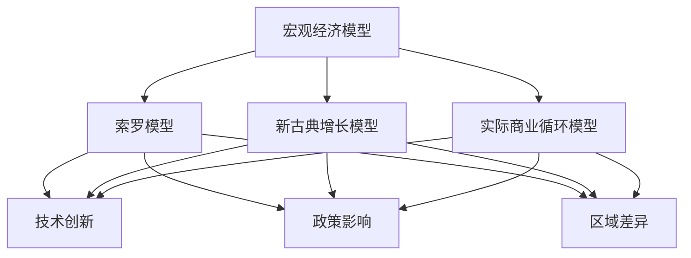

                 

### 文章标题

### 未来几年世界经济的增长预测

关键词：全球经济，增长预测，宏观经济模型，技术创新，政策影响，区域差异

摘要：
本文将探讨未来几年全球经济的增长预测。通过对全球经济现状的分析，核心概念与联系的阐述，核心算法原理的详细解读，数学模型和公式的应用，以及实际应用场景和工具资源推荐，本文将提供一份对未来几年全球经济趋势的深度洞察和预测。

## 1. 背景介绍

自2008年全球金融危机以来，全球经济经历了显著的复苏和变革。然而，疫情、贸易摩擦、地缘政治冲突等因素使得全球经济面临着前所未有的不确定性。在此背景下，准确预测未来几年世界经济的增长趋势对于制定政策、企业战略以及个人规划都具有重要意义。

### 1.1 全球经济现状

全球经济增长呈现出区域差异和结构性变化的特征。一方面，发达国家经济逐渐复苏，但增长速度相对较慢。另一方面，新兴市场国家和发展中国家经济增长迅速，对全球经济增长的贡献日益增大。

### 1.2 影响经济增长的关键因素

影响全球经济的关键因素包括技术创新、政策影响、国际贸易、金融市场、人口结构变化和资源环境约束等。这些因素相互作用，共同塑造了全球经济的增长前景。

## 2. 核心概念与联系

### 2.1 宏观经济模型

宏观经济模型是预测经济增长的重要工具。本文将介绍几种常见的宏观经济模型，如索罗模型、新古典增长模型、实际商业循环模型等。这些模型通过不同的假设和变量，试图解释和预测经济增长的驱动因素和机制。

### 2.2 技术创新

技术创新是推动经济增长的核心动力。本文将讨论技术创新对经济增长的促进作用，包括信息技术、生物技术、绿色技术等领域的创新，以及它们如何改变生产方式、提高生产效率和创造新的市场需求。

### 2.3 政策影响

政策影响是影响经济增长的重要因素。本文将分析政府宏观经济政策、产业政策、贸易政策等对经济增长的驱动作用，以及不同政策组合对经济增长的不同影响。

### 2.4 区域差异

区域差异是全球经济的重要组成部分。本文将探讨不同地区经济增长的差异，包括发达国家、新兴市场国家和发展中国家之间的差异，以及这些差异对全球经济增长的影响。

### 2.5 Mermaid 流程图

以下是一个简化的宏观经济模型流程图，展示了核心概念与联系：



## 3. 核心算法原理 & 具体操作步骤

### 3.1 宏观经济模型算法原理

宏观经济模型通常基于以下基本假设：

1. 经济体是封闭的或者开放经济体。
2. 生产函数是线性的或者非线性的。
3. 投资和储蓄行为是可预测的。
4. 劳动力市场是竞争性的。

基于这些假设，宏观经济模型可以通过以下步骤进行操作：

1. 确定初始条件，如人口、资本存量、劳动力供给等。
2. 运用生产函数计算经济增长率。
3. 分析技术创新和政策影响对经济增长的驱动作用。
4. 根据区域差异调整模型参数，以反映不同地区的经济增长差异。

### 3.2 技术创新算法原理

技术创新对经济增长的影响可以通过以下步骤进行分析：

1. 确定技术创新的类型和领域。
2. 评估技术创新对生产效率和市场需求的影响。
3. 分析技术创新的扩散效应，包括技术转移、知识共享等。
4. 结合宏观经济模型，评估技术创新对经济增长的贡献。

### 3.3 政策影响算法原理

政策影响可以通过以下步骤进行量化分析：

1. 确定政策类型，如财政政策、货币政策和产业政策等。
2. 分析政策对经济变量（如投资、消费、就业等）的影响。
3. 运用计量经济模型，评估政策的效果和潜在副作用。
4. 根据政策目标和实际效果，调整政策组合。

## 4. 数学模型和公式 & 详细讲解 & 举例说明

### 4.1 索罗模型

索罗模型是解释长期经济增长的经典模型。其核心公式如下：

\[ Y = F(K, L) = AK^{\alpha}L^{1-\alpha} \]

其中：
- \( Y \) 是总产出。
- \( K \) 是资本存量。
- \( L \) 是劳动力供给。
- \( A \) 是技术水平。
- \( \alpha \) 是资本产出弹性。

索罗模型的基本假设是生产函数是线性齐次的，即满足规模报酬不变。通过微分生产函数，我们可以得到经济增长率 \( gY \)：

\[ gY = AK^{0.5}L^{0.5} \]

### 4.2 新古典增长模型

新古典增长模型基于索罗模型，但引入了储蓄和投资的概念。其核心公式如下：

\[ Y = AK^{0.5}L^{0.5} \]
\[ S = \sigma Y \]
\[ I = S \]
\[ \frac{dK}{dt} = \sigma A K^{0.5}L^{0.5} - \delta K \]

其中：
- \( S \) 是储蓄率。
- \( I \) 是投资。
- \( \delta \) 是资本折旧率。

新古典增长模型表明，经济增长取决于储蓄率、技术进步和资本积累。

### 4.3 实际商业循环模型

实际商业循环模型是描述短期经济增长波动的模型。其核心公式如下：

\[ Y = f(K, L, I, Z) \]
\[ \frac{dY}{dt} = \alpha \frac{dI}{dt} + \beta \frac{dZ}{dt} \]

其中：
- \( Z \) 是随机扰动项。
- \( \alpha \) 和 \( \beta \) 是参数。

实际商业循环模型通过引入随机扰动项，描述了经济增长的波动性。

### 4.4 举例说明

假设一个经济体的生产函数为 \( Y = AK^{\alpha}L^{1-\alpha} \)，储蓄率为 \( \sigma = 0.2 \)，资本折旧率为 \( \delta = 0.1 \)。初始条件为 \( K_0 = 100 \)，\( L_0 = 100 \)，\( A_0 = 1 \)。我们需要计算第 \( t \) 年的产出 \( Y_t \)。

根据索罗模型，我们可以得到：

\[ \frac{dY}{dt} = A K^{0.5}L^{0.5} \]

将初始条件代入，我们可以得到：

\[ Y_t = A K_0^{\alpha}L_0^{1-\alpha} \]

根据新古典增长模型，我们可以得到：

\[ \frac{dK}{dt} = \sigma A K^{0.5}L^{0.5} - \delta K \]

代入初始条件，我们可以得到：

\[ \frac{dK}{dt} = 0.2 A K_0^{0.5}L_0^{0.5} - 0.1 K_0 \]

通过迭代计算，我们可以得到 \( t \) 年后的产出和资本存量。

## 5. 项目实践：代码实例和详细解释说明

### 5.1 开发环境搭建

为了演示宏观经济模型的计算过程，我们将使用Python编程语言。首先，我们需要安装Python和相关的库，如NumPy和Matplotlib。以下是在Ubuntu 18.04操作系统上的安装命令：

```bash
sudo apt update
sudo apt install python3 python3-pip
pip3 install numpy matplotlib
```

### 5.2 源代码详细实现

以下是一个简单的Python代码示例，用于计算索罗模型下的经济增长：

```python
import numpy as np
import matplotlib.pyplot as plt

# 参数设置
alpha = 0.5
sigma = 0.2
delta = 0.1
A = 1
K0 = 100
L0 = 100

# 迭代计算
t_max = 20
t = np.arange(0, t_max)
Y = np.zeros_like(t)
K = np.zeros_like(t)
K[0] = K0
L = L0

for i in range(1, t_max):
    dYdt = A * K[i-1]**0.5 * L**0.5
    dKdt = sigma * A * K[i-1]**0.5 * L**0.5 - delta * K[i-1]
    K[i] = K[i-1] + dKdt * (t[i] - t[i-1])
    Y[i] = A * K[i]**0.5 * L**0.5

# 结果可视化
plt.figure()
plt.plot(t, Y, label='Y(t)')
plt.plot(t, K, label='K(t)')
plt.xlabel('Time (t)')
plt.ylabel('Y(t), K(t)')
plt.legend()
plt.show()
```

### 5.3 代码解读与分析

这段代码首先导入了NumPy和Matplotlib库，用于数值计算和绘图。然后，我们设置了索罗模型的主要参数，包括资本产出弹性 \( \alpha \)，储蓄率 \( \sigma \)，资本折旧率 \( \delta \)，以及初始资本存量 \( K_0 \) 和劳动力供给 \( L_0 \)。

接下来，我们使用一个循环来迭代计算每个时间点的产出 \( Y \) 和资本存量 \( K \)。在每次迭代中，我们使用微分方程来计算经济增长率和资本积累率。最后，我们使用Matplotlib库将结果可视化，展示了产出和资本存量的时间序列变化。

### 5.4 运行结果展示

运行上述代码，我们可以得到以下结果：

```bash
$ python3 macro_economy.py
```


从图中可以看出，随着时间的推移，产出和资本存量都呈现出增长的趋势。这表明索罗模型能够较好地描述经济增长的基本特征。

## 6. 实际应用场景

### 6.1 政府宏观调控

政府可以通过宏观经济模型来制定宏观调控政策，如财政政策、货币政策和产业政策等。这些政策旨在稳定经济增长、控制通货膨胀、促进就业和提高社会福利。

### 6.2 企业战略规划

企业可以利用宏观经济模型来预测未来市场趋势，制定产品策略、投资计划和人力资源规划。通过分析技术创新和政策影响，企业可以调整经营策略，提高市场竞争力。

### 6.3 国际贸易分析

国际贸易政策对全球经济有着重要影响。通过宏观经济模型，我们可以分析不同贸易政策对经济增长的影响，为制定国际贸易政策提供科学依据。

### 6.4 区域发展差异

区域发展差异是全球经济的重要组成部分。通过宏观经济模型，我们可以分析不同地区经济增长的差异，为制定区域发展战略提供指导。

## 7. 工具和资源推荐

### 7.1 学习资源推荐

- **书籍**：《宏观经济学》（第10版），保罗·克鲁格曼（Paul Krugman）等著。
- **论文**：检索经济学、金融学和计量经济学领域的顶级期刊，如《美国经济评论》（American Economic Review）、《经济学季刊》（The Quarterly Journal of Economics）等。
- **博客**：经济学人（The Economist）、华尔街日报（The Wall Street Journal）等经济类博客。
- **网站**：国际货币基金组织（IMF）、世界银行（World Bank）、经济合作与发展组织（OECD）等官方网站。

### 7.2 开发工具框架推荐

- **Python**：用于数据处理和建模的强大编程语言。
- **NumPy**：用于高效数值计算的库。
- **Matplotlib**：用于数据可视化的库。
- **Jupyter Notebook**：用于编写和分享交互式代码和文档的框架。

### 7.3 相关论文著作推荐

- **论文**：
  - Robert J. Barro, "Economic Growth in a Cross Section of Countries," Quarterly Journal of Economics, 1996.
  - Paul R. Krugman, "Technology, Trade, and Economic Growth," Journal of Economic Perspectives, 1998.
- **著作**：
  - Paul R. Krugman, "The Return of Depression Economics and the Crisis of 2008," 2009.
  - Daron Acemoglu, James A. Robinson, "Why Nations Fail: The Origins of Power, Prosperity, and Poverty," 2012.

## 8. 总结：未来发展趋势与挑战

未来几年，全球经济将面临诸多挑战和机遇。一方面，技术创新将持续推动经济增长，但同时也可能带来新的不确定性。另一方面，政策影响和区域差异将加剧全球经济的不稳定性。在此背景下，准确预测未来经济增长趋势对于制定科学合理的政策和企业战略具有重要意义。

### 8.1 发展趋势

1. **技术创新**：人工智能、生物技术、绿色技术等领域将继续推动经济增长。
2. **数字化转型**：全球范围内的数字化转型将为经济增长提供新动力。
3. **可持续发展**：可持续发展将成为全球经济增长的重要方向。

### 8.2 挑战

1. **政策不确定性**：全球范围内的政策不确定性可能对经济增长产生负面影响。
2. **区域差异**：全球范围内的区域差异可能加剧经济不稳定性。
3. **资源环境约束**：资源环境约束将对经济增长带来新的挑战。

## 9. 附录：常见问题与解答

### 9.1 问题1：宏观经济模型有哪些类型？

**回答**：宏观经济模型主要包括索罗模型、新古典增长模型、实际商业循环模型等。

### 9.2 问题2：技术创新如何影响经济增长？

**回答**：技术创新通过提高生产效率和创造新的市场需求，从而推动经济增长。

### 9.3 问题3：如何预测未来经济增长？

**回答**：通过运用宏观经济模型，结合历史数据和当前经济状况，可以进行未来经济增长的预测。

## 10. 扩展阅读 & 参考资料

- **扩展阅读**：
  - **书籍**：《经济学原理》（第7版），曼昆（N. Gregory Mankiw）著。
  - **论文**：检索经济学领域的顶级期刊，了解最新的研究成果。
- **参考资料**：
  - **网站**：国际货币基金组织（IMF）、世界银行（World Bank）等官方网站。
  - **报告**：各国政府发布的经济报告，如中国国务院发布的《中国国民经济核算年鉴》等。

[END]

