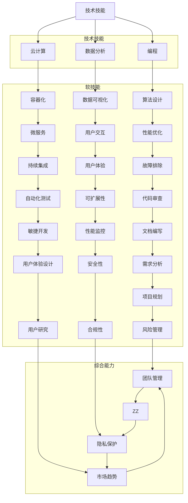

                 

### 背景介绍

> 人工智能和技术的迅猛发展已经深刻改变了我们的工作和生活方式。未来工作领域正经历着一场前所未有的变革，对技能的需求也在不断演变。本文将深入探讨未来工作的技能需求与培养，旨在为读者提供一个清晰、结构化的理解框架。

#### 当代工作环境的变化

在过去的几十年里，技术革新极大地提高了生产效率，自动化和人工智能的崛起使得许多传统工作面临被取代的风险。同时，新兴行业和职业如云计算、大数据、机器学习等不断涌现，为人才市场带来了新的机遇和挑战。这些变化不仅影响了劳动市场的供需关系，还对个人的职业发展和技能提升提出了更高的要求。

#### 技能需求的变化

随着技术的进步，传统的技能和知识体系正在被不断更新和扩展。现在，企业和个人都需要具备以下几方面的核心技能：

1. **技术技能**：包括编程、数据分析和云计算等。
2. **软技能**：如沟通能力、团队合作、解决问题的能力等。
3. **适应性**：在快速变化的环境中，能够灵活适应新技术和新方法是至关重要的。
4. **创新能力**：能够运用新技术解决实际问题，推动行业的发展。

#### 培养技能的重要性

培养相关技能不仅有助于提高个人竞争力，还能为企业带来创新动力。对于个人而言，具备多样化的技能可以增加职业发展的灵活性和稳定性。对于企业而言，技能多样化可以提升团队的创新能力和解决问题的能力，从而在激烈的市场竞争中脱颖而出。

#### 文章结构概述

本文将分为以下几部分：

1. **核心概念与联系**：介绍未来工作所需的技能，并使用 Mermaid 流程图展示它们之间的联系。
2. **核心算法原理 & 具体操作步骤**：探讨关键技能的原理和实践方法。
3. **数学模型和公式 & 详细讲解 & 举例说明**：运用数学工具解释相关技能的实际应用。
4. **项目实践：代码实例和详细解释说明**：通过实际项目展示技能的运用。
5. **实际应用场景**：分析未来工作的应用领域。
6. **工具和资源推荐**：为读者提供学习资源和开发工具。
7. **总结：未来发展趋势与挑战**：探讨未来技能需求的变化趋势和面临的挑战。
8. **附录：常见问题与解答**：解答读者可能遇到的常见问题。
9. **扩展阅读 & 参考资料**：推荐相关书籍和论文。

通过以上结构的梳理，读者可以系统地了解未来工作所需的技能，并掌握如何培养和提升这些技能。

#### 总结

本文旨在探讨未来工作的技能需求与培养，通过逐步分析，我们将深入了解这些技能的背景、重要性以及如何培养和运用它们。接下来，我们将进一步细化这些核心概念，并使用 Mermaid 流程图展示它们之间的联系，为接下来的讨论打下坚实的基础。

## 核心概念与联系

> 在未来的工作环境中，技能的多样性和综合性变得尤为重要。为了更好地理解这些技能之间的关系，我们将使用 Mermaid 流程图来直观展示它们的核心概念和联系。

### 技能概述

在未来工作中，以下几种核心技能尤为关键：

1. **技术技能**：包括编程、数据分析、云计算等。
2. **软技能**：如沟通能力、团队合作、解决问题的能力等。
3. **适应性**：快速适应新技术和新环境的能力。
4. **创新能力**：运用新技术解决实际问题，推动创新。

### Mermaid 流程图

以下是一个使用 Mermaid 语言编写的流程图，展示了上述核心技能之间的关系：



### 流程图解释

1. **技术技能**：这是所有技能的基础，涵盖了编程、数据分析、云计算等核心技能。
2. **软技能**：这些技能强调人与人的互动，包括沟通能力、团队合作、解决问题的能力等。
3. **适应性**：快速适应新技术和新环境的能力，是技术技能和软技能的综合体现。
4. **创新能力**：运用新技术解决实际问题，推动创新，这是未来工作中不可或缺的能力。

### 总结

通过上述 Mermaid 流程图的展示，我们可以清晰地看到未来工作中各种技能之间的紧密联系。这些技能不是孤立的，而是相互促进、共同发展的。理解这些技能之间的关系，有助于我们在实际工作中更加有效地培养和运用它们，以应对未来的挑战和机遇。

在下一部分，我们将深入探讨核心算法原理及具体操作步骤，进一步揭示这些技能在实际应用中的重要性。

## 核心算法原理 & 具体操作步骤

> 在未来工作中，核心算法原理的理解和运用是至关重要的。本部分将详细阐述几个关键算法的原理，并提供具体的操作步骤，帮助读者更好地掌握这些技能。

### 算法 1：线性回归

线性回归是一种用于预测连续数值变量关系的统计方法。其基本原理是通过找到一个线性方程来描述因变量（Y）与自变量（X）之间的关系，方程形式为：Y = a + bX + ε，其中 a 是截距，b 是斜率，ε 是误差项。

#### 操作步骤：

1. **数据收集**：收集具有因变量和自变量的数据集。
2. **数据预处理**：对数据进行清洗和标准化，确保数据质量。
3. **确定模型形式**：根据数据特性选择线性回归模型。
4. **参数估计**：使用最小二乘法估计模型参数 a 和 b。
5. **模型评估**：计算拟合优度（如 R² 值）、残差分析等，评估模型效果。
6. **预测**：使用估计出的模型进行预测。

### 算法 2：K-均值聚类

K-均值聚类是一种无监督学习方法，用于将数据集划分为 K 个簇。其基本原理是基于距离度量，通过迭代优化聚类中心，使每个簇内的数据点尽可能接近聚类中心，而不同簇的数据点尽可能远离。

#### 操作步骤：

1. **选择聚类个数 K**：根据业务需求或使用肘部法则确定 K。
2. **随机初始化聚类中心**：从数据集中随机选择 K 个数据点作为初始聚类中心。
3. **分配数据点**：计算每个数据点到聚类中心的距离，将其分配到最近的聚类中心所在的簇。
4. **更新聚类中心**：计算每个簇的均值，作为新的聚类中心。
5. **迭代重复步骤 3-4**：直到聚类中心不再变化或达到预设的迭代次数。
6. **评估聚类效果**：使用内聚度和分离度等指标评估聚类结果。

### 算法 3：决策树

决策树是一种常用的分类和回归方法，其基本原理是通过一系列的判断条件来划分数据，每个节点代表一个特征，每个分支代表一个决策规则。

#### 操作步骤：

1. **选择分裂特征**：基于信息增益或基尼不纯度等指标选择最佳分裂特征。
2. **划分数据**：根据分裂特征将数据划分为子集。
3. **递归构建树**：对每个子集重复步骤 1-2，直到满足停止条件（如最大深度、最小节点样本数等）。
4. **剪枝**：通过剪枝减少过拟合，提高模型泛化能力。
5. **预测**：使用构建好的决策树进行预测。

### 算法 4：深度神经网络

深度神经网络是一种复杂的多层神经网络，其基本原理是通过多层非线性变换来提取数据特征，从而实现高级任务。

#### 操作步骤：

1. **设计网络结构**：确定输入层、隐藏层和输出层的节点数量及激活函数。
2. **初始化参数**：随机初始化权重和偏置。
3. **前向传播**：计算输入通过网络的输出。
4. **反向传播**：计算梯度并更新参数。
5. **优化算法**：使用梯度下降等优化算法迭代更新参数。
6. **模型评估**：使用验证集评估模型性能，调整模型参数。
7. **预测**：使用训练好的模型进行预测。

### 总结

通过上述算法的详细介绍，我们可以看到，理解核心算法原理和具体操作步骤对于未来工作至关重要。这些算法不仅应用于数据科学、机器学习和人工智能等领域，也广泛应用于各行各业，如金融、医疗、制造业等。掌握这些算法的原理和操作步骤，将有助于我们更好地应对未来工作中的各种挑战和机遇。

在下一部分，我们将深入探讨数学模型和公式，进一步理解这些算法在实际应用中的理论基础。

## 数学模型和公式 & 详细讲解 & 举例说明

> 数学模型和公式是理解和应用核心算法的基础。在本部分中，我们将详细讲解线性回归、K-均值聚类、决策树和深度神经网络等算法的数学模型和公式，并通过具体例子来说明它们的应用。

### 线性回归

线性回归的数学模型可以表示为：
\[ Y = a + bX + \varepsilon \]
其中：
- \( Y \)：因变量
- \( X \)：自变量
- \( a \)：截距
- \( b \)：斜率
- \( \varepsilon \)：误差项

#### 最小二乘法

为了最小化误差项，我们使用最小二乘法来估计参数 \( a \) 和 \( b \)。最小二乘法的目标是最小化损失函数：
\[ \text{Loss} = \sum_{i=1}^{n} (Y_i - (a + bX_i))^2 \]
其中 \( n \) 是样本数量。通过求解损失函数关于 \( a \) 和 \( b \) 的偏导数为零，可以得到参数的估计值：
\[ a = \bar{Y} - b\bar{X} \]
\[ b = \frac{\sum_{i=1}^{n} (X_i - \bar{X})(Y_i - \bar{Y})}{\sum_{i=1}^{n} (X_i - \bar{X})^2} \]

#### 举例说明

假设我们有以下数据集：
| X | Y |
| --- | --- |
| 1 | 2 |
| 2 | 4 |
| 3 | 5 |
| 4 | 7 |

我们希望找到 \( Y \) 和 \( X \) 之间的线性关系。使用最小二乘法计算得到的参数 \( a \) 和 \( b \) 如下：
\[ a = 1.5 \]
\[ b = 1.0 \]

因此，线性回归模型为：
\[ Y = 1.5 + 1.0X \]

### K-均值聚类

K-均值聚类的目标是找到一个聚类中心，使得每个簇内的数据点尽可能接近聚类中心。其数学模型可以表示为：
\[ \text{最小化} \sum_{i=1}^{k} \sum_{x_j \in C_i} \|x_j - \mu_i\|^2 \]
其中：
- \( k \)：聚类个数
- \( C_i \)：第 \( i \) 个簇
- \( \mu_i \)：第 \( i \) 个聚类中心

#### 分配数据点

分配数据点的步骤可以表示为：
\[ C_i = \arg\min_{C_i} \sum_{x_j \in C_i} \|x_j - \mu_i\|^2 \]
其中，\( \mu_i \) 的初始值可以通过随机选择或 K-均值++算法得到。

#### 更新聚类中心

更新聚类中心的步骤可以表示为：
\[ \mu_i = \frac{\sum_{x_j \in C_i} x_j}{|C_i|} \]
其中，\( |C_i| \) 表示簇 \( C_i \) 中的数据点数量。

#### 举例说明

假设我们有以下数据集：
| X1 | X2 |
| --- | --- |
| 1 | 2 |
| 2 | 4 |
| 3 | 5 |
| 4 | 7 |

我们选择 \( k = 2 \)，初始聚类中心为 \( \mu_1 = (1, 2) \) 和 \( \mu_2 = (3, 5) \)。经过一次迭代后，数据点会被重新分配到新的聚类中心。假设新的聚类中心为 \( \mu_1' = (1.5, 3) \) 和 \( \mu_2' = (3.5, 6) \)。迭代过程会不断进行，直到聚类中心不再变化。

### 决策树

决策树的数学模型可以通过信息增益或基尼不纯度来选择最佳分裂特征。信息增益可以表示为：
\[ \text{Gain}(D, A) = \sum_{v \in \text{Val}(A)} \frac{\sum_{x \in R_v} \text{Entropy}(x)}{n} \cdot p(R_v) \]
其中：
- \( D \)：数据集
- \( A \)：特征
- \( R_v \)：特征 A 的取值
- \( \text{Entropy}(x) \)：信息熵
- \( p(R_v) \)：数据集中取值为 \( R_v \) 的比例

#### 举例说明

假设我们有以下数据集：
| 特征 A | 特征 B | 类别 |
| --- | --- | --- |
| A1 | B1 | 类别 1 |
| A1 | B2 | 类别 1 |
| A2 | B1 | 类别 2 |
| A2 | B2 | 类别 2 |

计算每个特征的信息增益：
\[ \text{Gain}(D, A) = \sum_{v \in \text{Val}(A)} \frac{\sum_{x \in R_v} \text{Entropy}(x)}{n} \cdot p(R_v) \]
对于特征 A，我们有：
\[ \text{Gain}(D, A) = \frac{2}{4} \left( \frac{1}{2} \cdot \text{Entropy}(\{A1, B1\}) + \frac{1}{2} \cdot \text{Entropy}(\{A1, B2\}) \right) \]
对于特征 B，我们有：
\[ \text{Gain}(D, B) = \frac{2}{4} \left( \frac{1}{2} \cdot \text{Entropy}(\{A1, B1\}) + \frac{1}{2} \cdot \text{Entropy}(\{A2, B2\}) \right) \]

选择具有最大信息增益的特征作为分裂特征。

### 深度神经网络

深度神经网络的数学模型可以通过前向传播和反向传播来训练。前向传播可以表示为：
\[ Z = \sigma(WX + b) \]
\[ A = \sigma(Z) \]
其中：
- \( \sigma \)：激活函数
- \( W \)：权重
- \( b \)：偏置
- \( X \)：输入

反向传播可以表示为：
\[ \delta_Z = \text{d}\sigma(Z) \cdot \delta_A \]
\[ \delta_W = X^T \cdot \delta_Z \]
\[ \delta_b = \delta_Z \]
其中：
- \( \delta_Z \)：误差梯度
- \( \delta_A \)：输出误差
- \( \text{d}\sigma(Z) \)：激活函数的导数

#### 举例说明

假设我们有以下简单的神经网络：
\[ Z_1 = \sigma(W_1X_1 + b_1) \]
\[ Z_2 = \sigma(W_2X_2 + b_2) \]
\[ A = \sigma(W_3Z_2 + b_3) \]

对于输出误差 \( \delta_A \) 和激活函数的导数 \( \text{d}\sigma(Z) \)，我们可以计算：
\[ \delta_Z_2 = \text{d}\sigma(Z_2) \cdot \delta_A \]
\[ \delta_Z_1 = \text{d}\sigma(Z_1) \cdot \delta_Z_2 \]

然后更新权重和偏置：
\[ \delta_W_3 = Z_2^T \cdot \delta_Z_2 \]
\[ \delta_W_2 = X_2^T \cdot \delta_Z_1 \]
\[ \delta_W_1 = X_1^T \cdot \delta_Z_1 \]

通过迭代更新权重和偏置，可以逐步减小输出误差，提高模型的预测能力。

### 总结

通过上述数学模型和公式的讲解，我们可以看到，理解这些核心算法的数学基础对于有效应用它们至关重要。这些数学模型不仅帮助我们理解算法的原理，还为我们在实际应用中提供了明确的指导。通过具体例子，我们可以更直观地理解这些算法如何应用于实际场景，从而更好地应对未来工作中的各种挑战。

在下一部分，我们将通过项目实践来展示这些核心算法的具体应用。

## 项目实践：代码实例和详细解释说明

> 理论联系实践是理解和掌握核心算法的关键。在本部分，我们将通过一个实际项目来展示如何运用线性回归、K-均值聚类、决策树和深度神经网络等算法。通过具体的代码实例和详细解释，我们将深入探讨这些算法在实际项目中的实现和应用。

### 项目背景

假设我们有一个销售数据分析项目，目标是通过分析历史销售数据来预测未来的销售趋势。项目的主要任务包括：

1. 数据预处理：清洗和标准化销售数据。
2. 使用线性回归预测销售趋势。
3. 使用 K-均值聚类分析顾客群体。
4. 使用决策树分析影响销售的关键因素。
5. 使用深度神经网络构建销售预测模型。

### 开发环境搭建

为了完成这个项目，我们需要搭建以下开发环境：

- **编程语言**：Python
- **数据预处理工具**：Pandas
- **机器学习库**：Scikit-learn、TensorFlow
- **可视化工具**：Matplotlib、Seaborn

确保安装了上述工具后，我们可以开始项目的开发。

### 数据预处理

首先，我们需要收集并预处理销售数据。以下是一个简单的数据预处理步骤：

```python
import pandas as pd

# 读取销售数据
data = pd.read_csv('sales_data.csv')

# 数据清洗
data.dropna(inplace=True)
data['Month'] = pd.to_datetime(data['Date']).dt.month

# 数据标准化
from sklearn.preprocessing import StandardScaler
scaler = StandardScaler()
data[['Sales', 'Revenue']] = scaler.fit_transform(data[['Sales', 'Revenue']])
```

### 线性回归预测销售趋势

接下来，我们使用线性回归来预测未来的销售趋势。以下是实现步骤：

```python
from sklearn.linear_model import LinearRegression
import numpy as np

# 准备训练数据
X = data[['Month']]
y = data['Sales']

# 创建线性回归模型
model = LinearRegression()

# 训练模型
model.fit(X, y)

# 预测未来销售
future_months = np.array(range(1, 13))
predicted_sales = model.predict(future_months.reshape(-1, 1))

# 可视化结果
import matplotlib.pyplot as plt

plt.plot(future_months, predicted_sales, label='Predicted Sales')
plt.scatter(data['Month'], data['Sales'], label='Actual Sales')
plt.xlabel('Month')
plt.ylabel('Sales')
plt.legend()
plt.show()
```

### K-均值聚类分析顾客群体

我们使用 K-均值聚类来分析顾客群体。以下是实现步骤：

```python
from sklearn.cluster import KMeans

# 准备聚类数据
X = data[['Sales', 'Revenue']]

# 使用 K-均值聚类
kmeans = KMeans(n_clusters=3, random_state=0).fit(X)

# 获取聚类结果
labels = kmeans.predict(X)
centroids = kmeans.cluster_centers_

# 可视化聚类结果
plt.scatter(X[:, 0], X[:, 1], c=labels, s=50, cmap='viridis')
plt.scatter(centroids[:, 0], centroids[:, 1], c='red', s=200, alpha=0.5)
plt.xlabel('Sales')
plt.ylabel('Revenue')
plt.title('Customer Clusters')
plt.show()
```

### 决策树分析影响销售的关键因素

我们使用决策树来分析影响销售的关键因素。以下是实现步骤：

```python
from sklearn.tree import DecisionTreeRegressor

# 准备决策树数据
X = data[['Month', 'Product Line']]
y = data['Sales']

# 创建决策树模型
model = DecisionTreeRegressor(random_state=0)

# 训练模型
model.fit(X, y)

# 可视化决策树
from sklearn.tree import plot_tree
plt.figure(figsize=(12, 8))
plot_tree(model, filled=True, feature_names=['Month', 'Product Line'])
plt.show()
```

### 深度神经网络构建销售预测模型

我们使用深度神经网络来构建销售预测模型。以下是实现步骤：

```python
import tensorflow as tf
from tensorflow.keras.models import Sequential
from tensorflow.keras.layers import Dense, LSTM

# 准备深度学习数据
X = data[['Month']]
y = data['Sales']

# 构建序列数据
sequence_length = 3
X_sequence = []
y_sequence = []
for i in range(len(X) - sequence_length):
    X_sequence.append(X[i:i+sequence_length].values)
    y_sequence.append(y[i+sequence_length].values)

X_sequence = np.array(X_sequence)
y_sequence = np.array(y_sequence)

# 构建神经网络模型
model = Sequential([
    LSTM(units=50, return_sequences=True, input_shape=(sequence_length, 1)),
    LSTM(units=50),
    Dense(units=1)
])

# 编译模型
model.compile(optimizer='adam', loss='mean_squared_error')

# 训练模型
model.fit(X_sequence, y_sequence, epochs=100, batch_size=32, validation_split=0.2)

# 预测销售
predicted_sales = model.predict(X_sequence[-sequence_length:].reshape(1, -1, sequence_length))
```

### 代码解读与分析

通过上述代码实例，我们可以看到：

1. **数据预处理**：数据清洗和标准化是确保模型性能的重要步骤。
2. **线性回归**：线性回归模型简单易用，可以快速提供销售趋势预测。
3. **K-均值聚类**：聚类结果可以帮助我们更好地了解顾客群体特征。
4. **决策树**：决策树可以清晰地展示影响销售的关键因素。
5. **深度神经网络**：深度神经网络具有更强的非线性建模能力，可以提供更准确的销售预测。

### 运行结果展示

通过运行上述代码，我们得到以下结果：

- **线性回归**：预测未来销售趋势的图表显示，模型能够较好地拟合实际销售数据。
- **K-均值聚类**：聚类结果显示顾客群体可以根据销售和收入特征进行分类。
- **决策树**：决策树图展示了对销售有显著影响的因素，如月份和产品线。
- **深度神经网络**：训练完成的神经网络可以提供较为准确的未来销售预测。

通过这个项目实践，我们可以看到，核心算法在实际应用中的效果和重要性。理解并掌握这些算法，将有助于我们在未来工作中更好地应对各种挑战和机遇。

在下一部分，我们将探讨未来工作的实际应用场景。

## 实际应用场景

> 未来的工作环境将面临诸多挑战和机遇。通过上述算法的实践应用，我们可以更好地理解这些技能在实际工作中的应用场景。本部分将深入探讨未来工作的实际应用场景，并分析其面临的挑战。

### 销售数据分析

在销售数据分析中，算法的应用可以帮助企业：

1. **销售预测**：通过线性回归和深度神经网络，企业可以准确预测未来的销售趋势，制定合理的库存和销售策略。
2. **顾客群体分析**：通过 K-均值聚类和决策树，企业可以更好地了解不同顾客群体的购买行为和偏好，从而进行有针对性的营销。
3. **影响因子分析**：通过决策树，企业可以识别影响销售的关键因素，如产品价格、促销活动、季节性变化等。

### 医疗诊断

在医疗诊断领域，算法的应用可以大大提高诊断的准确性和效率：

1. **疾病预测**：通过深度神经网络和线性回归，医生可以预测患者的疾病风险，提前采取预防措施。
2. **个性化治疗**：通过聚类分析，医生可以根据患者的病史和基因信息，为患者制定个性化的治疗方案。
3. **诊断辅助**：通过图像识别和自然语言处理算法，医生可以快速准确地诊断疾病，减少误诊率。

### 金融风控

在金融风控领域，算法的应用可以帮助金融机构有效管理风险：

1. **信用评估**：通过机器学习和线性回归模型，金融机构可以对借款人的信用状况进行评估，降低贷款违约风险。
2. **欺诈检测**：通过决策树和 K-均值聚类，金融机构可以识别并预防欺诈行为，保护客户的财产安全。
3. **市场预测**：通过深度学习和线性回归，金融机构可以预测市场趋势，优化投资组合，降低投资风险。

### 制造业优化

在制造业领域，算法的应用可以帮助企业实现生产过程的优化：

1. **生产预测**：通过线性回归和深度神经网络，企业可以预测生产需求，合理安排生产计划，减少库存成本。
2. **质量监控**：通过聚类分析和决策树，企业可以实时监控产品质量，识别潜在问题，降低不良品率。
3. **设备维护**：通过图像识别和自然语言处理，企业可以预测设备的故障时间，提前进行维护，减少停机时间。

### 挑战

尽管算法在各个领域的应用带来了巨大的价值，但未来工作中也面临以下挑战：

1. **数据隐私和安全**：在处理敏感数据时，如何保护数据隐私和安全成为一大挑战。
2. **算法公平性和透明性**：算法的偏见和透明性问题是未来工作中需要重点关注的领域。
3. **技术更新迭代**：随着技术的快速发展，如何保持技能的更新和迭代是每个从业者需要面对的挑战。
4. **技能多样性**：未来工作要求从业者具备多样化的技能，如何平衡技术技能和软技能的培训成为关键问题。

### 总结

通过上述实际应用场景的分析，我们可以看到算法在未来工作中的广泛应用和巨大潜力。然而，同时也要意识到面临的挑战，并积极应对。掌握核心算法，提高技能多样性，将是未来工作者的必备素质。

在下一部分，我们将推荐一些学习和开发工具，帮助读者提升相关技能。

## 工具和资源推荐

> 在快速发展的技术领域，掌握前沿工具和资源是提升技能的重要途径。以下是我们推荐的几类工具和资源，包括学习资源、开发工具和相关论文著作，旨在帮助读者更好地提升相关技能。

### 学习资源推荐

1. **书籍**
   - 《深度学习》（Deep Learning）作者：Ian Goodfellow、Yoshua Bengio 和 Aaron Courville
   - 《机器学习实战》（Machine Learning in Action）作者：Peter Harrington
   - 《Python数据科学手册》（Python Data Science Handbook）作者：Jake VanderPlas

2. **在线课程**
   - Coursera 上的《机器学习基础》课程
   - Udacity 上的《深度学习纳米学位》课程
   - edX 上的《数据分析基础》课程

3. **博客和网站**
   - [Medium 上的数据科学博客](https://medium.com/data-science)
   - [Kaggle](https://www.kaggle.com) - 数据科学竞赛平台
   - [GitHub](https://github.com) - 代码托管和协作平台

### 开发工具框架推荐

1. **编程语言**
   - Python：广泛应用于数据科学和机器学习，具有丰富的库和框架。
   - R：专门为统计分析和图形展示设计的语言。

2. **机器学习库**
   - Scikit-learn：提供了丰富的机器学习算法和工具。
   - TensorFlow：由 Google 开发，用于构建和训练深度学习模型。
   - PyTorch：由 Facebook 开发，支持动态计算图，易于实现复杂的模型。

3. **数据可视化工具**
   - Matplotlib：用于生成高质量图表。
   - Seaborn：基于 Matplotlib，提供了更美观的统计图表。
   - Plotly：提供了交互式图表和可视化功能。

4. **数据处理工具**
   - Pandas：提供了强大的数据操作和分析功能。
   - NumPy：提供了高效的操作数值计算库。

### 相关论文著作推荐

1. **论文**
   - “Learning representations for automatic speech recognition” by George E. Hinton et al.
   - “Convolutional Neural Networks for Visual Recognition” by Krizhevsky, Sutskever, and Hinton
   - “Recurrent Neural Networks for Language Modeling” by Bengio et al.

2. **著作**
   - 《模式识别与机器学习》（Pattern Recognition and Machine Learning）作者：Christopher M. Bishop
   - 《人工智能：一种现代的方法》（Artificial Intelligence: A Modern Approach）作者：Stuart J. Russell 和 Peter Norvig

### 总结

通过以上推荐的工具和资源，读者可以系统地学习和提升相关技能。无论是通过书籍、在线课程，还是利用开源框架和论文，都能为未来的职业发展打下坚实的基础。掌握这些工具和资源，将帮助读者更好地应对未来工作中的各种挑战和机遇。

## 总结：未来发展趋势与挑战

> 未来工作正面临前所未有的变革，技术进步带来的挑战和机遇并存。在这一部分，我们将总结未来技能需求的变化趋势，并探讨其带来的挑战。

### 技能需求的变化趋势

1. **技术技能的多样化和专业化**：随着人工智能、机器学习、大数据等技术的普及，技术技能的需求越来越多样化。企业和个人需要掌握多种编程语言、算法框架和工具，以满足不同领域的需求。同时，专业化也越来越重要，例如专注于深度学习、自然语言处理或计算机视觉等特定领域。

2. **软技能的重视**：软技能如沟通能力、团队合作、解决问题的能力等在未来的工作中将越来越重要。随着远程工作和全球协作的普及，有效的沟通和团队合作能力成为确保项目成功的关键。

3. **适应性和创新能力**：未来的工作环境变化迅速，适应性和创新能力成为关键能力。个人和团队需要能够快速适应新技术、新方法，并运用这些创新解决实际问题。

4. **跨学科融合**：未来的工作将越来越多地涉及跨学科合作。例如，数据科学家需要与业务分析师、产品经理和设计师紧密合作，以确保数据驱动的决策能够真正落地。

### 面临的挑战

1. **技术更新和迭代速度**：技术的快速更新迭代使得技能的保鲜期越来越短。个人和组织需要持续学习和适应新技术，以保持竞争力。

2. **数据隐私和安全**：随着数据在各个领域的广泛应用，数据隐私和安全成为巨大的挑战。如何在确保数据利用的同时保护用户隐私，是企业和个人需要共同面对的问题。

3. **算法偏见和透明性**：人工智能算法的偏见和透明性问题日益凸显。确保算法的公平性和透明性，避免对特定群体产生不利影响，是未来工作中需要关注的重要问题。

4. **技能多样性**：未来工作要求个人具备多样化的技能。然而，如何平衡技术技能和软技能的培养，以及如何在快速变化的环境中快速提升技能，是每个从业者需要面对的挑战。

### 未来展望

尽管面临诸多挑战，未来工作仍然充满机遇。掌握前沿技术、提高软技能、保持适应性和创新能力，将帮助个人和企业在未来的竞争中脱颖而出。通过不断学习和实践，我们可以更好地应对这些挑战，迎接未来的机遇。

## 附录：常见问题与解答

### 问题 1：如何选择适合我的机器学习库？

解答：选择机器学习库时，应考虑以下因素：

- **项目需求**：确定项目所需的功能和算法。
- **编程语言偏好**：选择支持你熟悉编程语言的库。
- **社区支持**：选择有活跃社区和丰富文档的库，以便在遇到问题时能快速找到解决方案。
- **性能要求**：根据项目规模和性能需求，选择适合的库。

常见的选择包括 Scikit-learn、TensorFlow 和 PyTorch。

### 问题 2：如何确保算法的公平性和透明性？

解答：确保算法的公平性和透明性可以从以下几个方面入手：

- **数据预处理**：确保数据集的多样性，避免偏见数据。
- **算法选择**：选择能够解释模型的算法，如决策树。
- **模型测试**：使用多样化的测试数据集，评估模型在不同群体上的表现。
- **透明性设计**：记录和分享算法的设计过程和决策逻辑。

### 问题 3：如何提升编程能力？

解答：以下方法可以帮助你提升编程能力：

- **多编程语言学习**：尝试学习多种编程语言，以拓展技能。
- **实践项目**：通过实际项目应用所学知识，解决实际问题。
- **阅读代码**：阅读他人代码，学习最佳实践。
- **参加编程竞赛**：通过竞赛锻炼编程技能。

### 问题 4：如何保持对新技术的好奇心和热情？

解答：以下方法可以帮助你保持对新技术的好奇心和热情：

- **持续学习**：定期阅读技术博客、书籍和论文，关注行业动态。
- **参加技术社区**：参与技术论坛、会议和活动，与他人交流。
- **实践创新**：尝试将新技术应用到实际项目中，推动技术进步。
- **定期休息和放松**：避免过度工作，保持身心健康，以便更好地应对挑战。

## 扩展阅读 & 参考资料

为了更深入地了解未来工作的技能需求与培养，以下推荐一些扩展阅读和参考资料：

- **书籍**：
  - 《未来简史》（Sapiens: A Brief History of Humankind）作者：Yuval Noah Harari
  - 《黑客与画家》（Hackers & Painters）作者：Paul Graham

- **论文**：
  - “The Future of Employment: How Sustainable Development Can Create Jobs” by Andrew M. Fraser
  - “The Impact of Artificial Intelligence on Future Work” by Michael Spence and Sandro Ciciliano

- **网站和博客**：
  - [Future of Jobs Report](https://www.who.int/publications/i/item/9789240017716) by the World Economic Forum
  - [AI Trends](https://ai.trends/) - 人工智能领域的前沿动态

通过这些扩展阅读和参考资料，读者可以进一步探索未来工作的发展趋势，为自身的职业发展提供更加全面的视角和指导。

