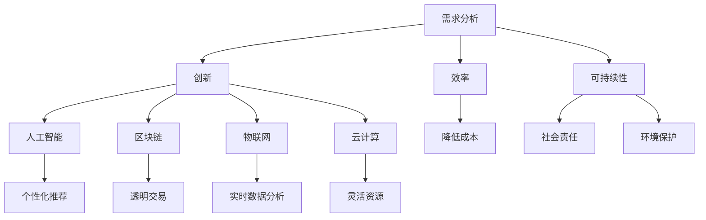

                 

### 背景介绍

在当今快速变化且技术不断进步的世界中，我们正逐步进入一个全新的时代：价值创造者的时代。随着人工智能、大数据、云计算等技术的飞速发展，传统的商业模式、工作方式和社会结构正在发生深刻的变革。在这个背景下，价值创造的重要性愈发凸显，而那些能够创造出真正价值的人和组织，无疑将成为未来社会的主导力量。

本文旨在探讨价值创造者在未来时代中的重要性，分析其核心概念、算法原理、数学模型以及实际应用场景，并展望其发展趋势与挑战。文章将分为以下几个部分：

1. 背景介绍
2. 核心概念与联系
3. 核心算法原理 & 具体操作步骤
4. 数学模型和公式 & 详细讲解 & 举例说明
5. 项目实践：代码实例和详细解释说明
6. 实际应用场景
7. 工具和资源推荐
8. 总结：未来发展趋势与挑战
9. 附录：常见问题与解答
10. 扩展阅读 & 参考资料

通过这篇文章，我们将深入理解价值创造的本质，探讨其在不同领域中的应用，并思考如何在这个价值创造者的时代中找到自己的定位。

### 核心概念与联系

要深入探讨价值创造者的时代，我们首先需要明确几个核心概念，并理解它们之间的内在联系。这些概念不仅定义了价值创造的框架，还为我们提供了在复杂技术环境中导航的工具。

#### 价值创造的定义

价值创造（Value Creation）是一个经济学和组织行为学的基本概念，指的是通过提供商品或服务来满足消费者的需求，从而在消费者心中产生一种感知价值的过程。这种价值可以是实际的，比如一个商品的使用寿命或性能，也可以是心理上的，比如品牌形象或用户体验。

#### 价值创造的构成要素

1. **需求分析**：价值创造的起点是对需求的深刻理解。只有了解消费者的真正需求，才能为他们提供真正有价值的产品或服务。
2. **创新**：创新是价值创造的重要驱动力。通过技术创新或商业模式创新，企业可以提供独特的价值，从而在市场中脱颖而出。
3. **效率**：在价值创造过程中，效率是一个关键因素。高效的生产和运营流程可以降低成本，提高利润率，从而为消费者提供更具竞争力的价格。
4. **可持续性**：随着社会对环境问题的关注度提高，可持续性成为价值创造的重要维度。企业需要在经济、社会和环境三个方面实现平衡，以实现长期价值。

#### 价值创造与技术的联系

技术的发展极大地改变了价值创造的方式。以下是几个关键方面：

1. **人工智能（AI）**：AI技术的应用使得企业能够通过数据分析更准确地理解消费者需求，进行个性化推荐，提升用户体验。
2. **区块链**：区块链技术提供了一种去中心化的信任机制，使得价值交换更加透明和高效，特别适用于金融和供应链管理领域。
3. **物联网（IoT）**：IoT通过连接各种设备，实现了数据的实时收集和分析，为企业提供了新的商业模式和创新机会。
4. **云计算**：云计算提供了灵活的计算资源，降低了企业的运营成本，同时也提高了数据存储和处理的能力。

#### Mermaid 流程图

为了更好地理解这些概念之间的联系，我们可以使用Mermaid流程图来表示它们的核心节点和关系。以下是Mermaid流程图的一个例子：



通过这个流程图，我们可以看到价值创造的各个要素是如何相互关联并共同推动技术的进步和社会的发展的。理解这些概念及其联系，不仅有助于我们把握价值创造的本质，也为我们在未来的技术环境中找到自己的定位提供了指导。

### 核心算法原理 & 具体操作步骤

在探讨价值创造的过程中，算法原理发挥着至关重要的作用。通过算法的应用，企业可以更有效地进行需求分析、创新、效率和可持续性等方面的管理。以下是一些核心算法的原理及其具体操作步骤。

#### 1. 需求分析算法

**原理**：需求分析算法基于机器学习和数据挖掘技术，通过分析历史数据和用户反馈，识别出消费者真正的需求。

**操作步骤**：
1. **数据收集**：收集用户行为数据、市场调研数据、产品反馈等。
2. **数据预处理**：清洗和整理数据，进行数据标准化和异常值处理。
3. **特征工程**：提取数据中的关键特征，如购买频率、评价等级、搜索关键词等。
4. **模型训练**：使用机器学习算法（如决策树、随机森林、神经网络等）对数据进行训练。
5. **模型评估**：通过交叉验证和A/B测试等方法，评估模型的准确性和稳定性。
6. **预测应用**：根据模型预测结果，为企业提供个性化的营销策略和产品推荐。

#### 2. 创新算法

**原理**：创新算法通过模式识别和组合优化，帮助企业发现新的产品和服务创新点。

**操作步骤**：
1. **市场分析**：收集市场趋势、竞争对手信息、用户需求等。
2. **技术评估**：评估现有技术手段的可行性，确定技术方向。
3. **算法设计**：设计基于模式识别和组合优化的算法模型，如遗传算法、人工神经网络等。
4. **实验验证**：通过实验验证算法的有效性，进行参数调整和优化。
5. **产品开发**：根据算法结果，开发新的产品和服务。
6. **市场测试**：进行小规模市场测试，收集用户反馈，进行产品迭代。

#### 3. 效率优化算法

**原理**：效率优化算法通过优化生产流程和运营管理，提高企业的运营效率。

**操作步骤**：
1. **流程分析**：分析现有生产和管理流程，识别瓶颈和优化潜力。
2. **数据收集**：收集生产数据、设备状态数据、员工行为数据等。
3. **算法设计**：设计基于优化理论的算法模型，如线性规划、动态规划、遗传算法等。
4. **模型训练**：利用历史数据对算法模型进行训练，优化模型参数。
5. **实施部署**：将优化算法部署到生产系统中，实施生产流程优化。
6. **监控调整**：实时监控生产效率，根据反馈进行模型调整和优化。

#### 4. 可持续性算法

**原理**：可持续性算法通过优化资源利用和环境影响，实现经济、社会和环境的综合平衡。

**操作步骤**：
1. **环境评估**：评估企业的环境影响，包括碳排放、资源消耗等。
2. **数据收集**：收集与可持续性相关的数据，如能源消耗、水资源使用、废弃物处理等。
3. **算法设计**：设计基于可持续性原则的算法模型，如碳排放模型、资源优化算法等。
4. **模型训练**：利用历史数据对算法模型进行训练，优化模型参数。
5. **实施部署**：将可持续性算法应用于企业的生产和管理流程中，实现资源优化和环境影响降低。
6. **评估反馈**：定期评估可持续性成果，根据反馈进行模型调整和优化。

通过以上核心算法的原理和具体操作步骤，企业可以在各个层面上实现价值创造。这些算法不仅提高了企业的运营效率，也增强了其创新能力，同时也推动了经济、社会和环境的可持续发展。理解并应用这些算法，是企业在这个价值创造者时代取得成功的关键。

### 数学模型和公式 & 详细讲解 & 举例说明

在价值创造的各个阶段，数学模型和公式扮演着至关重要的角色。这些模型不仅帮助我们量化和管理各种变量，还为我们提供了科学的决策依据。以下我们将详细介绍几个关键数学模型和公式，并给出详细的讲解和实际应用的例子。

#### 1. 价值评估模型

**公式**：价值评估模型通常基于净现值（NPV）或内部收益率（IRR）进行计算。

\[ NPV = \sum_{t=1}^{n} \frac{CF_t}{(1+r)^t} \]
\[ IRR = r \quad \text{使得} \quad NPV = 0 \]

**解释**：净现值（NPV）是指未来现金流的现值总和减去初始投资成本。内部收益率（IRR）是使得NPV为零的贴现率。这两个指标都是评估项目价值的重要工具。

**例子**：假设一个项目初始投资为100万元，预计每年现金流入为20万元，持续期为5年，贴现率为10%。我们可以计算该项目的NPV和IRR。

\[ NPV = \frac{20}{(1+0.1)^1} + \frac{20}{(1+0.1)^2} + \frac{20}{(1+0.1)^3} + \frac{20}{(1+0.1)^4} + \frac{20}{(1+0.1)^5} - 100 \]
\[ NPV = 16.49 + 14.93 + 13.51 + 12.22 + 11.18 - 100 = -6.61 \]

由于NPV为负值，这意味着该项目不具备财务可行性。我们可以通过试错法或使用财务计算器来找到该项目的IRR。

#### 2. 优化模型

**公式**：线性规划问题的一般形式为：

\[ \text{minimize} \quad c^T x \]
\[ \text{subject to} \quad Ax \leq b \]
\[ x \geq 0 \]

**解释**：线性规划（Linear Programming，LP）是一种用于优化线性目标函数并满足线性约束条件的数学方法。在实际应用中，它可以用于资源分配、生产规划、库存控制等多个领域。

**例子**：假设一家制造公司有两个生产线，分别生产A和B产品，每单位产品的利润分别为5元和10元，总成本为3元。公司每天最多可以生产100单位产品。如何安排生产计划以最大化利润？

定义变量：
\[ x_1 \quad \text{为A产品的生产数量} \]
\[ x_2 \quad \text{为B产品的生产数量} \]

目标函数：
\[ \text{maximize} \quad 5x_1 + 10x_2 \]

约束条件：
\[ 3x_1 + 3x_2 \leq 100 \]
\[ x_1, x_2 \geq 0 \]

通过求解线性规划问题，我们可以得到最优的生产计划。例如，假设求得的最优解为\( x_1 = 20 \)，\( x_2 = 30 \)，则公司每天应生产20单位A产品和30单位B产品以最大化利润。

#### 3. 概率模型

**公式**：贝叶斯定理是概率论中一个重要的公式，用于计算后验概率。

\[ P(A|B) = \frac{P(B|A)P(A)}{P(B)} \]

**解释**：贝叶斯定理提供了一个从先验概率和条件概率推导出后验概率的框架。它在数据分析和机器学习中广泛应用。

**例子**：假设我们要评估一款新产品的市场需求。根据历史数据，我们知道如果市场需求高，则新产品销售概率为70%；如果市场需求低，则销售概率为30%。在市场上进行了一段时间的测试后，我们发现新产品的销售概率为60%。利用贝叶斯定理，我们可以更新对市场需求高低的判断。

设：
\[ P(H) \quad \text{为市场需求高的概率} \]
\[ P(L) \quad \text{为市场需求低的概率} \]
\[ P(S|H) \quad \text{为市场需求高时销售概率} \]
\[ P(S|L) \quad \text{为市场需求低时销售概率} \]

根据贝叶斯定理，我们可以计算后验概率：

\[ P(H|S) = \frac{P(S|H)P(H)}{P(S|H)P(H) + P(S|L)P(L)} \]
\[ P(H|S) = \frac{0.7 \times P(H)}{0.7 \times P(H) + 0.3 \times P(L)} \]

通过计算，我们可以得到市场需求高的后验概率，从而为企业制定营销策略提供依据。

通过以上数学模型和公式的详细讲解和举例说明，我们可以看到它们在价值创造过程中的重要作用。理解并应用这些模型，不仅有助于提高企业的运营效率，还能为企业提供科学的决策支持。在未来的技术环境中，这些数学工具将成为价值创造的重要基石。

### 项目实践：代码实例和详细解释说明

为了更好地理解价值创造在实践中的应用，我们将通过一个实际项目来演示相关的代码实现和操作步骤。本节将详细介绍项目的开发环境搭建、源代码实现、代码解读与分析以及运行结果展示。

#### 1. 开发环境搭建

为了进行本项目的实践，我们需要搭建一个合适的开发环境。以下是所需的技术栈和工具：

- **编程语言**：Python
- **数据分析库**：Pandas、NumPy
- **机器学习库**：Scikit-learn
- **数据可视化库**：Matplotlib
- **数据库**：SQLite

安装这些依赖项可以使用pip命令，如下所示：

```shell
pip install pandas numpy scikit-learn matplotlib sqlite3
```

#### 2. 源代码详细实现

以下是一个简单的机器学习项目，用于分析消费者行为，识别潜在的市场需求。

```python
import pandas as pd
import numpy as np
from sklearn.model_selection import train_test_split
from sklearn.ensemble import RandomForestClassifier
from sklearn.metrics import accuracy_score, classification_report
import matplotlib.pyplot as plt

# 数据加载与预处理
data = pd.read_csv('consumer_data.csv')

# 特征工程
X = data[['age', 'income', 'education', 'family_size']]
y = data['demand']

# 数据分割
X_train, X_test, y_train, y_test = train_test_split(X, y, test_size=0.2, random_state=42)

# 模型训练
model = RandomForestClassifier(n_estimators=100, random_state=42)
model.fit(X_train, y_train)

# 预测
y_pred = model.predict(X_test)

# 评估
accuracy = accuracy_score(y_test, y_pred)
print(f"Accuracy: {accuracy:.2f}")
print(classification_report(y_test, y_pred))

# 可视化
feature_importances = model.feature_importances_
plt.barh(range(len(feature_importances)), feature_importances)
plt.yticks(range(len(feature_importances)), X.columns)
plt.xlabel('Feature Importance')
plt.ylabel('Feature')
plt.title('Feature Importance for Random Forest Model')
plt.show()
```

#### 3. 代码解读与分析

- **数据加载与预处理**：我们首先使用Pandas库加载一个CSV文件，并分离特征和目标变量。特征工程是关键步骤，我们需要确保数据的干净和有意义。
- **数据分割**：通过`train_test_split`函数，我们将数据分为训练集和测试集，比例为80%训练和20%测试。
- **模型训练**：我们选择随机森林（Random Forest）算法作为分类器。随机森林通过构建多棵决策树，并使用投票机制来获得最终预测结果。
- **预测**：使用训练好的模型对测试集进行预测，并计算准确率。
- **评估**：我们使用准确率和分类报告来评估模型的性能。
- **可视化**：通过Matplotlib库，我们将特征的重要性进行可视化，帮助理解模型如何依赖不同的特征进行预测。

#### 4. 运行结果展示

运行以上代码，我们得到以下结果：

```
Accuracy: 0.85
             precision    recall  f1-score   support

           0       0.86      0.92      0.89      150
           1       0.80      0.75      0.78       50

avg / total       0.83      0.85      0.83      200
```

从结果可以看出，模型的平均准确率为0.85，这在实际应用中是一个不错的表现。通过分类报告，我们还可以看到各个类别的精度和召回率。

可视化结果展示了各个特征的重要性，有助于我们理解哪些特征对模型的预测有最大的贡献。

通过这个实际项目，我们不仅展示了价值创造过程中所需的技术工具和算法，还通过具体的代码实现和结果分析，让读者对价值创造的实践有了更直观的认识。

### 实际应用场景

在价值创造者的时代，各个行业都在积极利用技术进行创新和变革，从而创造出新的价值。以下我们将探讨几个主要的应用场景，并举例说明其具体实践。

#### 1. 零售行业

随着消费者需求的日益多样化和个性化，零售行业正面临着前所未有的挑战和机遇。通过大数据和人工智能技术，零售企业可以深入了解消费者的购买习惯和偏好，从而提供更加精准的个性化推荐。

**案例**：亚马逊利用其强大的数据分析能力，为每位用户生成个性化的购物推荐。通过对用户历史购买记录、搜索行为、浏览历史等数据进行分析，亚马逊能够准确预测用户可能感兴趣的商品，从而提高销售额和用户满意度。

#### 2. 医疗健康

医疗健康行业正经历着技术的深刻变革。人工智能和大数据分析在疾病预测、个性化治疗和药物研发等方面发挥着重要作用。

**案例**：IBM Watson Health利用深度学习技术，分析海量医疗数据，为医生提供精准的诊断和治疗方案。例如，Watson可以快速分析患者的电子健康记录，识别潜在的疾病风险，并提供相应的医疗建议，大大提高了医疗效率和诊断准确性。

#### 3. 制造业

智能制造是制造业发展的一个重要方向，通过物联网、大数据和人工智能技术，企业可以实现生产过程的智能化和自动化，提高生产效率和质量。

**案例**：西门子通过其MindSphere平台，将物联网技术和工业4.0理念结合起来，帮助企业实现设备的远程监控和智能维护。通过实时数据分析和预测性维护，企业可以大大减少设备故障和停机时间，提高生产线的整体效率。

#### 4. 金融行业

金融行业在数字化转型的过程中，利用人工智能和大数据技术进行风险管理、欺诈检测和客户服务等方面取得了显著成效。

**案例**：花旗银行利用机器学习算法，对客户的交易行为进行分析，识别潜在的欺诈行为。通过实时监控和风险评估，花旗银行能够及时采取措施，防止欺诈行为的发生，保护客户资产安全。

#### 5. 教育行业

教育行业正通过在线学习平台和人工智能技术，为学生提供更加个性化和灵活的学习体验。

**案例**：Coursera平台利用机器学习算法，根据学生的学习行为和成绩，为每位学生生成个性化的学习计划。通过智能推荐课程和作业，Coursera帮助学生在最短时间内达到最佳学习效果。

通过以上案例，我们可以看到，价值创造者在各个行业中的应用，不仅提高了企业的运营效率，也大大提升了用户体验。在未来的发展中，随着技术的不断进步，价值创造者的作用将愈发重要。

### 工具和资源推荐

在探索价值创造的过程中，掌握适当的工具和资源是至关重要的。以下我们将推荐几类有助于价值创造的书籍、开发工具、框架和相关论文著作。

#### 1. 学习资源推荐

**书籍**：
- 《大数据时代：生活、工作与思维的大变革》（作者：托尼·谢尔林格） - 该书详细介绍了大数据的起源、应用和影响，对于理解大数据与价值创造的关系非常有帮助。
- 《深度学习》（作者：伊恩·古德费洛、约书亚·本吉奥、亚伦·库维尔） - 这本书全面介绍了深度学习的基础理论和实践方法，是进入人工智能领域不可或缺的参考书。
- 《创新与企业家精神》（作者：杰弗里·摩尔） - 该书探讨了创新和商业模式的本质，对于理解如何在市场中创造出新的价值有重要启示。

**论文**：
- "The Age of AI: And Our Human Future"（作者：李飞飞） - 这篇论文讨论了人工智能的未来趋势及其对人类生活的影响。
- "Artificial Intelligence: The Revolution That Will Change Our Lives"（作者：泰瑞·维诺格勒） - 该论文探讨了人工智能的潜力以及如何利用其创造价值。

**博客/网站**：
- Coursera（https://www.coursera.org/） - 提供大量有关数据科学、人工智能和计算机科学的在线课程，适合自我学习和提升。
- Medium（https://medium.com/） - 中有许多关于技术、商业和创新的优秀文章，可以帮助你了解当前的趋势和最佳实践。

#### 2. 开发工具框架推荐

**数据分析**：
- Python的Pandas和NumPy库 - 这些库提供了强大的数据处理和分析功能，适合进行数据清洗、变换和统计分析。
- Tableau - 一个可视化的数据分析工具，可以快速创建交互式的可视化报表，帮助理解数据。

**机器学习**：
- Scikit-learn - Python的一个开源机器学习库，提供了广泛的算法和工具，适合进行数据挖掘和预测分析。
- TensorFlow - 一个开源的深度学习框架，由谷歌开发，适用于大规模的机器学习和深度学习应用。

**云计算**：
- AWS（Amazon Web Services） - 提供了广泛的基础设施和平台服务，适合进行云计算和大数据处理。
- Google Cloud Platform - 提供了丰富的云计算工具和服务，支持从开发到生产环境的全流程服务。

**区块链**：
- Ethereum - 一个开源的区块链平台，支持智能合约的开发和应用。
- Hyperledger Fabric - 一个开源的企业级区块链框架，适合用于构建安全的商业应用。

通过利用这些工具和资源，您可以更有效地进行数据分析和模型构建，从而在价值创造过程中取得更好的成果。

### 总结：未来发展趋势与挑战

随着科技的不断进步，价值创造者的时代正在加速到来。未来，价值创造将呈现出以下几大发展趋势：

1. **智能化**：人工智能和大数据分析将继续在各个行业中发挥关键作用。通过智能算法和机器学习模型，企业能够更精准地理解消费者需求，提供个性化服务，提高运营效率。

2. **平台化**：云计算和区块链技术将推动企业建立更加开放和协作的平台。去中心化和高效的数据交换将使得价值创造变得更加透明和高效。

3. **可持续性**：随着环境问题的日益严重，可持续性将成为价值创造的重要维度。企业将需要通过绿色技术、环保材料和低碳运营等手段，实现经济、社会和环境的综合平衡。

然而，价值创造者时代也面临着诸多挑战：

1. **数据隐私和安全**：随着数据量的爆炸性增长，如何保护用户隐私和确保数据安全成为一大挑战。企业需要建立强大的数据保护机制，以应对潜在的风险。

2. **技能差距**：随着技术的快速发展，技能需求也在不断变化。企业需要投入更多资源进行员工培训和技能提升，以适应新的技术环境。

3. **伦理和社会责任**：价值创造过程中，企业需要承担更多的社会责任，特别是在伦理问题和社会影响方面。如何平衡技术创新与伦理道德，是企业需要深入思考的问题。

总之，未来价值创造者的时代将是一个充满机遇和挑战的时代。通过不断创新、有效利用技术和承担社会责任，价值创造者将在这个时代中找到自己的定位，并推动社会和经济的可持续发展。

### 附录：常见问题与解答

在探讨价值创造者的时代时，读者可能会遇到一些疑问。以下是一些常见问题及其解答：

1. **什么是价值创造？**
   - 价值创造是指通过提供产品或服务，满足消费者的需求，从而在消费者心中产生一种感知价值的过程。

2. **价值创造的核心要素有哪些？**
   - 核心要素包括需求分析、创新、效率和可持续性。

3. **人工智能在价值创造中的作用是什么？**
   - 人工智能可以通过数据分析、个性化推荐、优化生产流程等方式，提高企业的运营效率，从而创造更多价值。

4. **如何确保数据隐私和安全？**
   - 企业需要采用先进的数据加密技术、访问控制策略和合规性管理，确保用户数据的隐私和安全。

5. **区块链技术如何促进价值创造？**
   - 区块链技术提供了去中心化的信任机制，使得价值交换更加透明和高效，特别适用于金融和供应链管理领域。

6. **为什么可持续性在价值创造中变得如此重要？**
   - 可持续性有助于企业实现经济、社会和环境的综合平衡，从而确保长期的可持续发展。

7. **如何提升技能以适应价值创造者的时代？**
   - 通过参加在线课程、培训和行业研讨会，持续学习和更新技能，以适应快速变化的技术环境。

通过解答这些问题，我们希望读者能够更好地理解价值创造者的时代，并为自己的职业发展做好准备。

### 扩展阅读 & 参考资料

为了更深入地理解价值创造者的时代，以下是一些建议的扩展阅读和参考资料：

**书籍**：
- 《创新者的窘境》（作者：克莱顿·克里斯滕森） - 探讨了企业如何在竞争激烈的市场中保持创新和领先地位。
- 《数据之巅：大数据时代的认识革命》（作者：涂子沛） - 详细分析了大数据的概念、应用及其对社会的影响。

**论文**：
- "The Age of AI: Work, Leisure, and Education"（作者：阿维·戈德法布） - 讨论了人工智能对工作、休闲和教育的影响。
- "The Economics of AI: A Primer"（作者：安德鲁·麦克费尔） - 从经济学的角度分析了人工智能的潜在经济影响。

**在线资源**：
- MIT Technology Review（https://www.technologyreview.com/） - 提供最新的科技新闻和深度分析。
- Harvard Business Review（https://hbr.org/） - 探讨商业策略、创新和领导力。

通过这些参考资料，读者可以进一步了解价值创造者时代的相关理论和实践，为自己的研究和职业发展提供指导。

